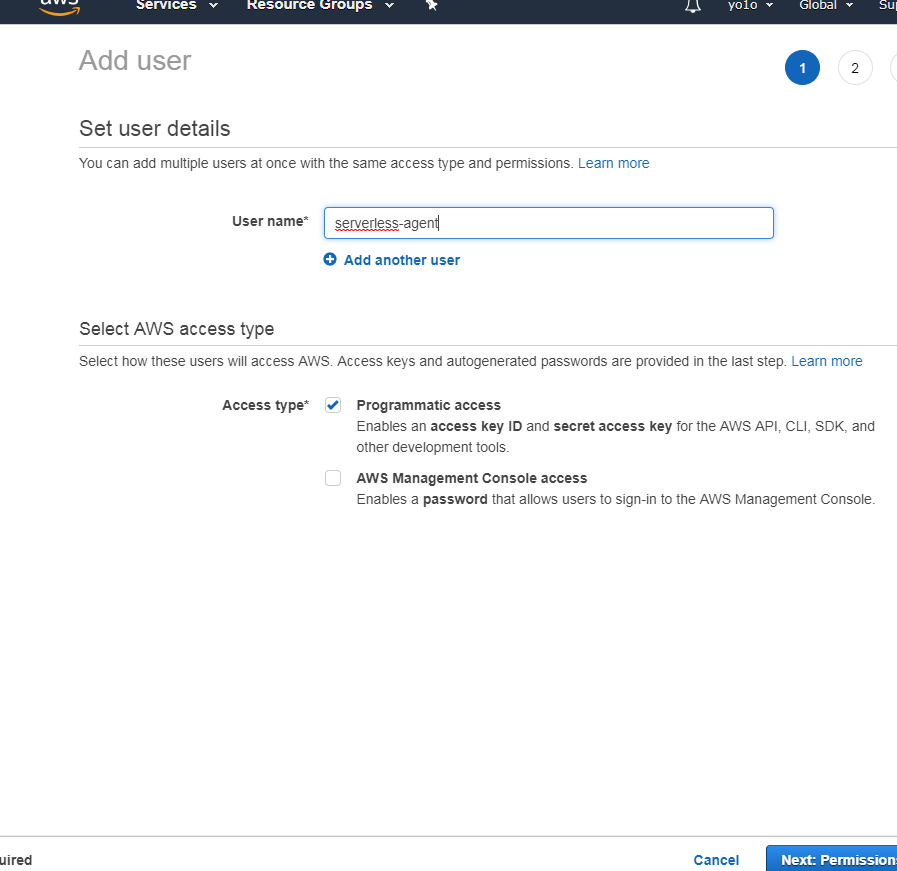

# What I'm gonna build
I'm gonna build a simple crawler that will send HTTP request to zigbang.com's api server to receive data on estates, and then save it to dynamoDB. 

# Prerequisites
* Have a recent version of node installed
```bash
nvm install stable
```
* Install `serverless` globally
```bash
npm install -g serverless
```

# Initialize serverless project
To initialize it with a python [template](https://serverless.com/framework/docs/providers/aws/cli-reference/create/),
```bash
serverless create --template aws-python3
```
see more templates [from the documentation.](https://serverless.com/framework/docs/providers/aws/cli-reference/create#available-templates)

Then you are gonna see something like
```
Serverless: Generating boilerplate...
 _______                             __
|   _   .-----.----.--.--.-----.----|  .-----.-----.-----.
|   |___|  -__|   _|  |  |  -__|   _|  |  -__|__ --|__ --|
|____   |_____|__|  \___/|_____|__| |__|_____|_____|_____|
|   |   |             The Serverless Application Framework
|       |                           serverless.com, v1.39.0
 -------'

Serverless: Successfully generated boilerplate for template: "aws-python3"
Serverless: NOTE: Please update the "service" property in serverless.yml with your service name
```
Successful!

# Give permission to `serverless` cli on aws
## AWS Access keys
You need to create something called *AWS Access Keys*.
1. Head over to [Identity and Access Management home](https://console.aws.amazon.com/iam/home)
2. Browse to [Users tab](https://console.aws.amazon.com/iam/home#/users) and click *add user*. 
  
3. Click on *Attach existing policies directly* and *Create policy*.
Add the following [json provided by `serverless` team](https://gist.github.com/ServerlessBot/7618156b8671840a539f405dea2704c8):
  ```json
  {
    "Statement": [
        {
            "Action": [
                "apigateway:*",
                "cloudformation:CancelUpdateStack",
                "cloudformation:ContinueUpdateRollback",
                "cloudformation:CreateChangeSet",
                "cloudformation:CreateStack",
                "cloudformation:CreateUploadBucket",
                "cloudformation:DeleteStack",
                "cloudformation:Describe*",
                "cloudformation:EstimateTemplateCost",
                "cloudformation:ExecuteChangeSet",
                "cloudformation:Get*",
                "cloudformation:List*",
                "cloudformation:PreviewStackUpdate",
                "cloudformation:UpdateStack",
                "cloudformation:UpdateTerminationProtection",
                "cloudformation:ValidateTemplate",
                "dynamodb:CreateTable",
                "dynamodb:DeleteTable",
                "dynamodb:DescribeTable",
                "ec2:AttachInternetGateway",
                "ec2:AuthorizeSecurityGroupIngress",
                "ec2:CreateInternetGateway",
                "ec2:CreateNetworkAcl",
                "ec2:CreateNetworkAclEntry",
                "ec2:CreateRouteTable",
                "ec2:CreateSecurityGroup",
                "ec2:CreateSubnet",
                "ec2:CreateTags",
                "ec2:CreateVpc",
                "ec2:DeleteInternetGateway",
                "ec2:DeleteNetworkAcl",
                "ec2:DeleteNetworkAclEntry",
                "ec2:DeleteRouteTable",
                "ec2:DeleteSecurityGroup",
                "ec2:DeleteSubnet",
                "ec2:DeleteVpc",
                "ec2:Describe*",
                "ec2:DetachInternetGateway",
                "ec2:ModifyVpcAttribute",
                "events:DeleteRule",
                "events:DescribeRule",
                "events:ListRuleNamesByTarget",
                "events:ListRules",
                "events:ListTargetsByRule",
                "events:PutRule",
                "events:PutTargets",
                "events:RemoveTargets",
                "iam:CreateRole",
                "iam:DeleteRole",
                "iam:DeleteRolePolicy",
                "iam:GetRole",
                "iam:PassRole",
                "iam:PutRolePolicy",
                "iot:CreateTopicRule",
                "iot:DeleteTopicRule",
                "iot:DisableTopicRule",
                "iot:EnableTopicRule",
                "iot:ReplaceTopicRule",
                "kinesis:CreateStream",
                "kinesis:DeleteStream",
                "kinesis:DescribeStream",
                "lambda:*",
                "logs:CreateLogGroup",
                "logs:DeleteLogGroup",
                "logs:DescribeLogGroups",
                "logs:DescribeLogStreams",
                "logs:FilterLogEvents",
                "logs:GetLogEvents",
                "s3:CreateBucket",
                "s3:DeleteBucket",
                "s3:DeleteBucketPolicy",
                "s3:DeleteObject",
                "s3:DeleteObjectVersion",
                "s3:GetObject",
                "s3:GetObjectVersion",
                "s3:ListAllMyBuckets",
                "s3:ListBucket",
                "s3:PutBucketNotification",
                "s3:PutBucketPolicy",
                "s3:PutBucketTagging",
                "s3:PutBucketWebsite",
                "s3:PutEncryptionConfiguration",
                "s3:PutObject",
                "sns:CreateTopic",
                "sns:DeleteTopic",
                "sns:GetSubscriptionAttributes",
                "sns:GetTopicAttributes",
                "sns:ListSubscriptions",
                "sns:ListSubscriptionsByTopic",
                "sns:ListTopics",
                "sns:SetSubscriptionAttributes",
                "sns:SetTopicAttributes",
                "sns:Subscribe",
                "sns:Unsubscribe",
                "states:CreateStateMachine",
                "states:DeleteStateMachine"
            ],
            "Effect": "Allow",
            "Resource": "*"
        }
    ],
    "Version": "2012-10-17"
}
  ```

4. Click *Next* until you see *Create user*. Then, copy the *Access Key ID* and *Secret access key* to somewhere like notepad.
5. Enter in the API keys
  ```bash
  export AWS_ACCESS_KEY_ID=<your-key-here>
  export AWS_SECRET_ACCESS_KEY=<your-secret-key-here>
  # AWS_ACCESS_KEY_ID and AWS_SECRET_ACCESS_KEY are now available for serverless to use
  ```
6. Deploy
  ```bash
  serverless deploy
  ```
  Then you are gonna see 
  ```bash
  Serverless: Packaging service...
  Serverless: Excluding development dependencies...
  Serverless: Creating Stack...
  Serverless: Checking Stack create progress...
  .....
  Serverless: Stack create finished...
  Serverless: Uploading CloudFormation file to S3...
  Serverless: Uploading artifacts...
  Serverless: Uploading service aws-python3.zip file to S3 (1.97 KB)...
  Serverless: Validating template...
  Serverless: Updating Stack...
  Serverless: Checking Stack update progress...
  ...............
  Serverless: Stack update finished...
  Service Information
  service: aws-python3
  stage: dev
  region: us-east-1
  stack: aws-python3-dev
  resources: 5
  api keys:
    None
  endpoints:
    None
  functions:
    hello: aws-python3-dev-hello
  layers:
    None
  ```
7. Add a profile
  Yes. Do add a profile so that next time you create a similar kind of project, you will not have to enter in your api keys again.
  1. [install `awscli`](https://docs.aws.amazon.com/ko_kr/cli/latest/userguide/cli-chap-install.html) (if this does not work, use [bundle installer.](https://docs.aws.amazon.com/ko_kr/cli/latest/userguide/install-bundle.html) If the install command [breaks with an error, perhaps run `apt-get install `apt-get install python-dev`](https://github.com/MeetMe/newrelic-plugin-agent/issues/151)
  ```bash
  pip install awscli --upgrade --user
  ```
  2. [initialize a profile](https://serverless.com/framework/docs/providers/aws/cli-reference/config-credentials/)
  ```bash
  serverless config credentials --provider aws --key 1234 --secret 5678 --profile custom-profile
  ```
  3. Later on, you can use this profile in this way:
  ```bash
  serverless deploy --aws-profile profileIjustMade
  ```
  of course you can modify your profile info and api keys in `~/.aws/credentials`.

# Check your function is working
First, set a function name in `serverless.yml`:
```yml
functions:
  hello:
    handler: handler.hello
    name: hello

```
Then `sls deploy` again to make changes. 
Now, 
```bash
$ serverless invoke -f hello
{
    "statusCode": 200,
    "body": "{\"message\": \"Go Serverless v1.0! Your function executed successfully!\", \"input\": {}}"
}
```
yes, it works!!

# Want to include python modules? Make a [deployment package.](https://docs.aws.amazon.com/ko_kr/lambda/latest/dg/lambda-python-how-to-create-deployment-package.html)
> **A deployment package is a ZIP archive that contains your function code and dependencies.** 

> You need to create a deployment package if you use the Lambda API to manage functions, or **if your code uses libraries other than the AWS SDK.** Other libraries and dependencies need to be included in the deployment package. You can upload the package directly to Lambda, or you can use an Amazon S3 bucket, and then upload it to Lambda.

1. First, you would need to have aws cli installed. If you have not, check above for steps. 

2. Then install dependencies to a local directory with pip, and include them in your deployment package.
  ```bash
  j031:~/workspace (master) $ mkdir packages
  j031:~/workspace (master) $ cd packages/
  j031:~/workspace/packages (master) $ ls
  j031:~/workspace/packages (master) $ pip install requests --target .
  ```

3. Create zip of packages 
```
$ zip -r9 ../function.zip .
```

4. Add function code to the zip
```
j031:~/workspace/es (master) $ zip -g function.zip handler.py
  adding: handler.py (deflated 50%)
```

5. Upload!
```
j031:~/workspace/es (master) $ aws lambda update-function-code --function-name crawler --zip-file fileb://function.zip
```

6. If you feel tiredsome, just create `update.sh`:
```sh
mkdir .tmp
zip -r9 ./.tmp/function.zip ./packages
zip -g ./.tmp/function.zip handler.py
aws lambda update-function-code --function-name crawler --zip-file fileb://./.tmp/function.zip
rm -rf ./.tmp
```

# OR use serverless-python-requirements
[Just install it](https://github.com/UnitedIncome/serverless-python-requirements), and produce `requirements.txt` by running `pip freeze > requirements.txt` and run `sls deploy`. 
*I find this way very much simpler and easier!*

# Source code
[The source code can be found from this repo!](https://github.com/9oelM/es)

# serverless.yml
In the `name` and other relevant fields, fill out suitable values.
```yml
service: crawl-service # NOTE: update this with your service name

...

provider:
  name: aws
  runtime: python3.6
  region: us-east-1

...

functions:
  crawler:
    handler: handler.crawler # # The file and module for this specific function.
    name: crawler
    
    ...
```