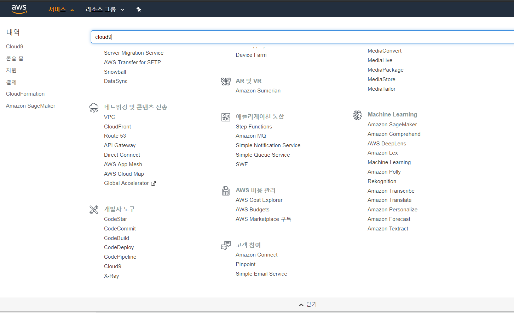

# 문제
- 열악해도 너무 열악하다. 
- 내 컴퓨터가 없다.
- 당연히 개인 GPU도 쓸 수 없다.
- 학교 GPU Farm에도 연결이 불가능하다. 
- 로컬 컴퓨터(싸지방 컴)에서 작업은 당연히 못한다. 성능이 떨어질 뿐더러 저장도 안된다. 
- ssh connection이 불가하다.
- 과연 싸지방에서 딥러닝 공부/실습을 할 수 있을까?

# 목표
- 군대에서 싸지방으로 딥러닝 공부를 가능하게 만들기
- [fast.ai](https://fast.ai) course material을 cloud에서 jupyter로 볼 수 있게 만들기 (내가 딥러닝을 처음 공부하기 위해 선택한 교재다)
- 내 개인 딥러닝 프로젝트를 cloud에서 돌릴 수 있게 만들기
- 최소한의 비용이 나가게 하기

# Quick rundown
- 인내심이 필요함. 인내심이 없다면... 아무도 모른다.
- AWS, Google (GCP) 계정이 필요함
- 계정 만들고 각 회사의 Cloud service에 가입하는 과정에서 신용카드 번호가 필요함 (돈이 나가는 것은 아님. AWS는 12 months of free tier, GCP는 $300 credit을 준다)

## 시작
### 1. 구글 계정 만들기
- [링크에 들어가서 계정을 만들자.](https://accounts.google.com/signup/v2/webcreateaccount?hl=en-GB&flowName=GlifWebSignIn&flowEntry=SignUp&nogm=true) (있으면 스킵)

### 2. GCP에서 Credit 받기
- [GCP에서 무료로 시작하기](https://cloud.google.com/) 클릭. GCP 들어가자마자 만약 GCP Signup이 되어있지 않으면 바로 Try it free라는 문구가 뜬다. 클릭.


- 가입 절차를 마무리하자. 신용카드 번호를 적어도 걱정없다. Credits가 다 나가도 돈이 청구되지 않는다. 

### 3. AWS 가입하기
- [링크에 들어가서 계정을 만들자.](https://portal.aws.amazon.com/billing/signup?redirect_url=https%3A%2F%2Faws.amazon.com%2Fregistration-confirmation&language=ko_kr#/)


중간에 신용카드 정보를 적는 과정이 있다. 신용카드와 함께 등록되어 있는 주소가 여기 입력하는 주소와 다르면 나중에 서비스를 이용하지 못할 수도 있다 (물론 고칠 수 있다. 하지만 귀찮다). 그러니 한 번에 끝내자.

학교에서 간혹 가다 AWS Educate를 지원하는 곳이 있다. 본인이 학교를 다니다가 왔으면 학교가 별도의 Credit을 지원하는지 꼭 확인해보자. 

### 4. AWS 가입 완료
- 가입이 완료됐으면 Confirmation 이메일이 올 것이다. 
- 이제 [AWS Console](https://aws.amazon.com/ko/console/)에 접속할 수 있다.

### 5. Cloud9 + EC2 Instance 생성
- 이 글을 적는 본인도 참 어이가 없는데, 별 방법이 없어서 이 방법을 써야 한다 (특히 SSH가 안 되기 때문에). 이해가 잘 안 될 수도 있는데, GCP Instance를 설정하는 용도로 AWS Cloud9을 쓸 것이다. 단지 그 용도로. 
- 일단 AWS에 로그인 한 후 [AWS Cloud9](https://console.aws.amazon.com/cloud9)으로 이동하자. 웹에서 IDE와 Terminal에 엑세스할 수 있을 것이다. 
 Cloud9이 찾기 힘들다면 검색해서 바로 찾자.



그리고는 오른쪽에 있는 Create environment를 클릭


이름은 아무거나 친다. 나는 `gcp`라고 했다. 

EC2 Instance 설정을 할 수 있다. OS는 Amazon linux에서 Ubuntu로 바꿔주자. 나머지는 그대로. 어차피 여기서 데이터 학습을 돌릴 게 아니라서 최소 사양의 Instance로 만들어도 상관없다. 


아. 그리고 EC2 Instance를 켜고 끄는 것에 신경쓰지 않아도 된다. Cloud9에 접속할 때 자동으로 켜지고, 끄고 나서 30분뒤에 EC2도 같이 자동으로 꺼진다. 설정만 바꾸지 않는다면.
그 다음 계속 그냥 진행. 노란 확인 버튼만 계속 누르면 된다. 
다 왔다. 이제 방금 만든 instance를 IDE에서 열어보자. 한 1~2분 기다리면 IDE가 준비된다. 


### 6. Cloud9에서 GCP Instance 생성
사실 지금부터는 [fast.ai에서 gcp docs](https://course.fast.ai/start_gcp.html)를 보는 게 더 편할 수도 있다. 동일한 방법을 여기서도 소개한다.

cloud9 IDE 하단에 보이는 Terminal에서 다음 command를 실행한다.

  ```bash
  # Create environment variable for correct distribution
  export CLOUD_SDK_REPO="cloud-sdk-$(lsb_release -c -s)"
  
  # Add the Cloud SDK distribution URI as a package source
  echo "deb http://packages.cloud.google.com/apt $CLOUD_SDK_REPO main" | sudo tee -a /etc/apt/sources.list.d/google-cloud-sdk.list
  
  # Import the Google Cloud Platform public key
  curl https://packages.cloud.google.com/apt/doc/apt-key.gpg | sudo apt-key add -
  
  # Update the package list and install the Cloud SDK
  sudo apt-get update && sudo apt-get install google-cloud-sdk
  ```

중간중간에 `Y/N`을 묻는 문구가 나올 수도 있다. 나는 대부분 큰 영향은 없다고 생각하고 `Y`라고 눌렀다. 다 환경설정에 지대한 영향을 미치지는 않는 질문들이다. 


### 7. GCP에서 프로젝트 생성

GCP 홈페이지 네비게이션 좌측에 있는 프로젝트 Dropdown을 클릭하여 새 프로젝트를 만들자. 


나는 fast-ai로 이름지었다. 

billing account와 project가 연결되어 있는지 확인하자. [billing/projects](https://console.cloud.google.com/billing/projects)에 들어가서 무언가가 있으면 연결이 되어있다는 뜻이다. 


다 끝나면 **Cloud9으로 돌아가** init하자.

  ```bash
  $ gcloud init
  Welcome! This command will take you through the configuration of gcloud.
  
  Your current configuration has been set to: [default]
  
  You can skip diagnostics next time by using the following flag:
    gcloud init --skip-diagnostics
  
  Network diagnostic detects and fixes local network connection issues.
  Checking network connection...done.                                                                                                                                                                                                                 
  Reachability Check passed.
  Network diagnostic passed (1/1 checks passed).
  
  You must log in to continue. Would you like to log in (Y/n)?  
  ```
  이 다음에 `Y`를 입력하고 시키는 대로만 진행하자. 로그인은 방금 GCP에서 작업한 구글 계정으로 한다. 진행하다 보면 내가 만들었던 프로젝트를 선택할 수 있다:
  ```bash
  You are logged in as: [email@gmail.com].

  Pick cloud project to use: 
   [1] fast-ai-******
   [2] Create a new project
  Please enter numeric choice or text value (must exactly match list 
  item):  1
  
  Your current project has been set to: [fast-ai-******].

  ```
  완료.

### 8. GCP Instance 생성

다음 커맨드를 cloud9 terminal에 복붙하자. 

```bash
export IMAGE_FAMILY="pytorch-latest-gpu" # or "pytorch-latest-cpu" for non-GPU instances
export ZONE="us-west2-b" # budget: "us-west1-b"
export INSTANCE_NAME="my-fastai-instance"
export INSTANCE_TYPE="n1-highmem-8" # budget: "n1-highmem-4"

# budget: 'type=nvidia-tesla-k80,count=1'
gcloud compute instances create $INSTANCE_NAME \
        --zone=$ZONE \
        --image-family=$IMAGE_FAMILY \
        --image-project=deeplearning-platform-release \
        --maintenance-policy=TERMINATE \
        --accelerator="type=nvidia-tesla-p4,count=1" \
        --machine-type=$INSTANCE_TYPE \
        --boot-disk-size=200GB \
        --metadata="install-nvidia-driver=True" \
        --preemptible
```

아마도 

```bash
ERROR: (gcloud.compute.instances.create) Could not fetch resource:
 - Quota 'GPUS_ALL_REGIONS' exceeded. Limit: 0.0 globally.
```

이런 에러가 뜰 것이다. 뜬다면

- GCP 홈페이지 맨 오른쪽 위에 계속 떠 있는 '활성화' 버튼을 누르고 '업그레이드' 클릭
- [GCP Quotas page](https://console.cloud.google.com/iam-admin/quotas)에 들어가서 다음과 같이 필터 설정


'할당량 수정' 클릭 후 요청을 제출한다. **2일쯤 걸린다는데....**


완료하면 이런 이메일을 받게 된다. _언제 끝나나.._

```
Hello,

Thank you for contacting Google Cloud Platform Support.

This message is to confirm that we've received your quota request for  
project 'fast-ai-******'. Quota increase requests typically take two  
business days to process. If this quota request is very urgent, please  
respond to this email so that our support agents can have full context when  
processing your quota increase request.

While we make every effort to provide you with a resolution to your case  
within two business days, please understand that some of the quota increase  
requests may require further evaluation which takes additional time.

If you have any further information and clarification you would like to  
include in your request, please feel free to reply to this email.

Best regards,
Google Cloud Platform Support
```

2일만 기다리자. 2일만...

자고 일어나서 이메일을 확인하니까 벌써 뭔가 Notification이 와 있었다. 확인.

```
Hello,

Your quota request for project '***********' has been approved and your  
quota has been adjusted accordingly.

Changed Quota:
+------------------+------------------+
| GLOBAL Attribute | GPUS_ALL_REGIONS |
+------------------+------------------+
|     Changes      |      0 -> 1      |
+------------------+------------------+
....
```

드디어 GPU를 쓸 수 있다. 

그럼 다시 Cloud9 terminal로 돌아가자. 다시 다음 Command를 실행한다.

```bash
export IMAGE_FAMILY="pytorch-latest-gpu" # or "pytorch-latest-cpu" for non-GPU instances
export ZONE="us-west2-b" # budget: "us-west1-b"
export INSTANCE_NAME="my-fastai-instance"
export INSTANCE_TYPE="n1-highmem-8" # budget: "n1-highmem-4"

# budget: 'type=nvidia-tesla-k80,count=1'
gcloud compute instances create $INSTANCE_NAME \
        --zone=$ZONE \
        --image-family=$IMAGE_FAMILY \
        --image-project=deeplearning-platform-release \
        --maintenance-policy=TERMINATE \
        --accelerator="type=nvidia-tesla-p4,count=1" \
        --machine-type=$INSTANCE_TYPE \
        --boot-disk-size=200GB \
        --metadata="install-nvidia-driver=True" \
        --preemptible
```

완료되면 뭐라뭐라 뜬다.

```bash
Created [https://www.googleapis.com/compute/v1/projects/fast-ai-******/zones/us-west2-b/instances/my-fastai-instance].
WARNING: Some requests generated warnings:
 - Disk size: '200 GB' is larger than image size: '30 GB'. You might need to resize the root repartition manually if the operating system does not support automatic resizing. See https://cloud.google.com/compute/docs/disks/persistent-disks#repartitionrootpd for details.

NAME                ZONE        MACHINE_TYPE  PREEMPTIBLE  INTERNAL_IP  EXTERNAL_IP    STATUS

....

```

이제 연결해보자.

```bash
gcloud compute ssh --zone=$ZONE jupyter@$INSTANCE_NAME -- -L 8080:localhost:8080
```

`passphrase`를 물어보면서 진행을 묻는다. 만든 적 없으니 다 엔터 치면 instance에 접속이 가능하다. 드디어 성공.


shell의 `$`앞에 `jupyter@my-fastai-instance`라는 글이 생긴 걸 볼 수 있다.

#### 주의할 점
우리는 [Preemtible instance](https://course.fast.ai/start_gcp.html#preemptible-instances)를 생성했다 (command 입력시 `preemptible` flag를 참고). Fast.ai의 말에 따르면 (1) 큰 수요가 있으면 30초 안에 멈출 수도 있고 (그러지 않ㅇ기를 바래야지) (2) 24시간을 쓴 후에는 무조건 꺼진단다. 그래서 이게 더 싸고 초보자에게 알맞는 instance라고 한다. 

### 9. 업데이트 후 notebook 실행
사실 instance에 이미 `tutorials`라는 폴더가 있고 그곳에 jupyter notebook이 있다. `course-v3`라는 폴더에 접근하자.

```bash
cd tutorials/fastai/course-v3
git checkout .
git pull
```

course를 가장 최신 상태로 업데이트했다. 

그리고 `conda`를 써서 업데이트.

```bash
sudo /opt/anaconda3/bin/conda install -c fastai fastai
```

나는 `pipenv`를 써서 사실 `conda`가 어떻게 돌아가는지는 잘 모른다. 확인해보니 `conda`는 깔려있고 `pipenv`는 안 깔려있기도 하고, fastai도 이렇게 시키니까 그냥 `conda`를 쓰자. 

### 10. 기타
일단 [opera 브라우저](https://www.opera.com)를 설치하자. 싸지방에서 Github이 막혀있으므로 vpn을 지원하는 opera를 사용해야 한다. 물론 속도가 좀 느려지는 건 감안해야 한다. 울지 말자. 할 수 있다. 

오페라 브라우저를 열은 후 설정 -> 고급 -> 기능 -> vpn 사용 on.

이제 깃헙에 들어갈 수 있다.

됐다. 거의 다 왔다. 

### 10. Jupyer notebook 실행
