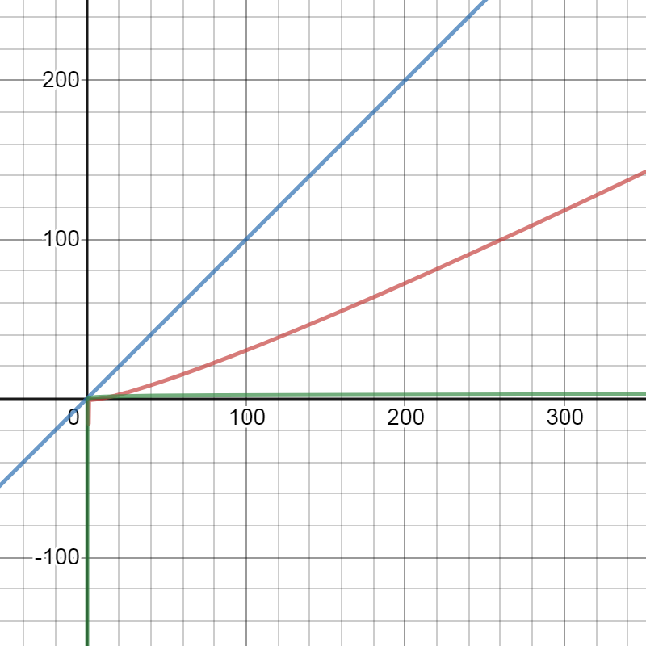
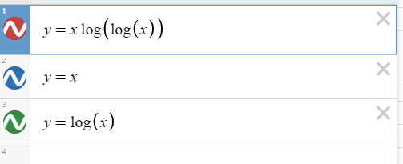
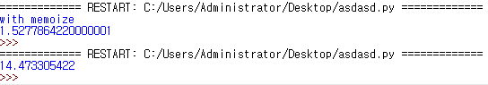

# Rationale
I was creating an `isPrime` function:

```python
def isPrime(n):
    prime = [True for i in range(n + 1)]
    fac = 2
    while fac * fac <= n + 1:
        if prime[fac]:
            for i in range(fac*fac, n + 1, fac):
                prime[i] = False
        fac += 1
    return prime[n]
```

## Time complexity
For now, forget about the condition in the while loop: `fac * fac <= n + 1`.
You know that you are going to fill out the array of size `n` anyways. 
This is going to take `O(n)` time (`prime[i] = False` run at least `n` times overall). 

And the tricky part is `for i in range(fac*fac, n + 1, fac):`.
It is going to take less than `O(nlogn)` time. This is because if you compare this series with a harmonic series:
- Harmonic: 1 + 1/2 + 1/3 + 1/4 + 1/5 + ... + 1/n
- `for i in range(fac*fac, n + 1, fac)`: you have to run at least about `n + 1 / fac` ~= `n / fac` times. So each time you are going to get 1/2 + 1/3 + 1/5 + 1/7 ... + n/n. 

Now, obviously, the number of calculation of harmonic series of a given `n` is greater than that of a series of reciprocals of prime numbers up to `n`. 

Harmonic series has a time complexity of `nlogn`. 

or, better, [a series of reciprocals of prime numbers has a time complexity of `nloglogn`.](https://en.wikipedia.org/wiki/Divergence_of_the_sum_of_the_reciprocals_of_the_primes). I will cut the explanation off here for now because it is going to be too complex.

Anyways, so if you add up: `O(n) + O(nloglogn) = O(nloglogn)` as you can discard the same term with a smaller multiple. 
    
So the time complexity of this algorithm, called Sieve of Eratosthenes, has a time complexity of `O(nloglogn)` (this many arithmetic operations will happen).

[](https://www.desmos.com/calculator/rufvsd67ha)



See that `xlog(log(x))` is `O(x)`, but `xlog(log(x))` grows much faster than `log(x)`. 

So you may.. think of caching. 

Ok. So that was the main rationale for memoization. Sorry for the rationale being too long.

So let's see how we can memoize. 

# Memoization
A decorator is just a higher-order function. Takes in a function as a parameter and outputs a function with some additional functionalities. 

A normal decorator may look like this:

```python
def memoize(func):
    cache = {}

    def memoizer(*args, **kwargs):
        key = str(args) + str(kwargs)
        if key not in cache:
            cache[key] = func(*args, **kwargs)
        return cache[key]

    return memoizer
```

Note that `cache` won't be permitted to be accessed inside `memoizer` if it is not a mutable object: for example, `int`. If you want to enable it, you should go for [`nonlocal`](https://www.python.org/dev/peps/pep-3104/).

So this is the memoized version of getting prime numbers. I fixed the previous code to enable memoization of a list.

```python
from typing import List, Callable

intToList = Callable[[int], List[int]]

def memoize(func : intToList) -> intToList:
    cache = []
    def memoizer(n):
        nonlocal cache
        if n > len(cache): # haven't met this n before
            cache = func(n) # if new, calculate from scratch again
        return cache 
    return memoizer

@memoize
def getPrime(n : int) -> List[int]:
    prime = [True for i in range(n + 1)]
    fac = 2
    while fac * fac <= n + 1:
        if prime[fac]:
            for i in range(fac*fac, n + 1, fac):
                prime[i] = False
        fac += 1
    return prime
```

Fair enough. A true memoization would detect that `n` is bigger than `len(cache)`, so that calculation runs only from `len(cache)` to `n`. But that requires more adjustments to the code. For now, I decided to be complacent with this: if you enter `n` that is less than any previous inputs, `getPrime` is just going to return `cache`. 

So this is an actual usage with `isPrime`:

```python
from typing import List, Callable

intToList = Callable[[int], List[int]]

def memoize(func : intToList) -> intToList:
    print('with memoize')
    cache = []
    def memoizer(n):
        nonlocal cache
        if n > len(cache): # haven't met this n before
            cache = func(n) # if new, calculate from scratch again
        return cache 
    return memoizer

@memoize
def getPrime(n : int) -> List[int]:
    prime = [True for i in range(n + 1)]
    fac = 2
    while fac * fac <= n + 1:
        if prime[fac]:
            for i in range(fac*fac, n + 1, fac):
                prime[i] = False
        fac += 1
    return prime

def isPrime(n : int) -> bool:
    return getPrime(n)[n]

if __name__ == '__main__':
    import timeit
    script = "isPrime(20)\nisPrime(17)\nisPrime(10)"             
    print(timeit.timeit(script, setup="from __main__ import isPrime"))

```

Remember, [`timeit` by default runs 1000000 times of execution.](https://docs.python.org/3/library/timeit.html#timeit.timeit) 

`timeit` gave this result:

|                             | With @memoize | Without @memoize |
|-----------------------------|---------------|------------------|
| Result (1000000 executions) | 1.5277864220000001  | 14.473305422     |

Wow. It's gotta be a must. It's really much faster... It should be. 



# Sources
- [https://medium.com/@chenfelix/time-complexity-sieve-of-eratosthenes-fb0184da81dc](https://medium.com/@chenfelix/time-complexity-sieve-of-eratosthenes-fb0184da81dc)
- [https://stackoverflow.com/questions/2582732/time-complexity-of-sieve-of-eratosthenes-algorithm](https://stackoverflow.com/questions/2582732/time-complexity-of-sieve-of-eratosthenes-algorithm)
- [https://nedbatchelder.com/blog/201601/isolated_memoize.html](https://nedbatchelder.com/blog/201601/isolated_memoize.html)