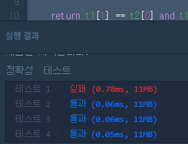

# 여행경로 문제 
[프로그래머스 문제 링크](https://programmers.co.kr/learn/courses/30/lessons/43164?language=python3)

## 문제 설명
주어진 항공권을 모두 이용하여 여행경로를 짜려고 합니다. 항상 ICN 공항에서 출발합니다.

항공권 정보가 담긴 2차원 배열 tickets가 매개변수로 주어질 때, 방문하는 공항 경로를 배열에 담아 return 하도록 solution 함수를 작성해주세요.

## 제한사항
- 모든 공항은 알파벳 대문자 3글자로 이루어집니다.
- 주어진 공항 수는 3개 이상 10,000개 이하입니다.
- tickets의 각 행 [a, b]는 a 공항에서 b 공항으로 가는 항공권이 있다는 의미입니다.
- 주어진 항공권은 모두 사용해야 합니다.
- 만일 가능한 경로가 2개 이상일 경우 알파벳 순서가 앞서는 경로를 return 합니다.
- 모든 도시를 방문할 수 없는 경우는 주어지지 않습니다.

## 입출력 예
```
input -> output
[[ICN, JFK], [HND, IAD], [JFK, HND]] ->	[ICN, JFK, HND, IAD]
[[ICN, SFO], [ICN, ATL], [SFO, ATL], [ATL, ICN], [ATL,SFO]] -> [ICN, ATL, ICN, SFO, ATL, SFO]
```

## 입출력 예 설명
### 예제 #1

`[ICN, JFK, HND, IAD]` 순으로 방문할 수 있습니다.

### 예제 #2

`[ICN, SFO, ATL, ICN, ATL, SFO]` 순으로 방문할 수도 있지만 `[ICN, ATL, ICN, SFO, ATL, SFO]` 가 알파벳 순으로 앞섭니다.

## 풀이
처음에는 **DFS 범주에 속해있는 문제라 굳이 Recursion을 써서 풀어야 한다는 생각에 사로잡혀 있었다.**
그러다가 끙끙거리며 적어본 코드는 다음과 같다 (어이구 많이도 적었다 파이썬으로...)

```python
from typing import List
def canVisit(t1 : List[str], t2 : List[str], lastDest : str):
    return t1[1] == t2[0] and t1[0] == lastDest

def getRoute(tickets : List[str], ans : str = "ICN"):
    if len(tickets) == 1: 
        return f'{ans},{tickets[0][1]}'.split(",")
    else:
        for i in range(1,len(tickets)): # for each ticket, check connectivity with tickets[0]
            if canVisit(tickets[0], tickets[i], ans[-3:]): # there is a connected route 
                t = tickets.pop(0)
                return getRoute(tickets, f'{ans},{t[1]}') # choose the first one that works
    return getRoute(tickets[1:] + tickets[:1], ans) 

def initialize(tickets : List[List[str]], startPoint: str):
    tickets.sort(key=lambda x : x[0] == startPoint, reverse=True)
    startCnt = 0
    for x in tickets:
        if x[0] == startPoint:
            startCnt += 1
        else:
            break
    return tickets, startCnt

def solution(tickets):
    tickets, startCnt = initialize(tickets, "ICN")
    ansPool = []
    for i in range(startCnt):
        t = tickets.pop(0)
        ansPool.append(getRoute([t]+tickets))
        tickets.append(t)
    return min(ansPool)
```

긴 코드 치고는 Time complexity하고 Space Complexity는 그럭저럭 괜찮았다. 
근데 문제는 테스트 1에서만 계속 Fail이 떴고 원인을 도저히 찾을 수가 없었다.



결국 다른 사람들의 풀이를 보고 (부끄러움을 감수하며) 내 코드가 무엇이 잘못됐는지 알아보기로 했다.

## 고수들의 정답
와... 정말 정말 짧았다. 
정OO이란 분이 작성한 코드였다. 

한 줄씩 살펴보려고 한다. 
```python
def solution(tickets):
    def helper(tickets, route):
        if tickets == []: # tickets가 비어있으면 당연히 route 반환. 
            return route
        left = [i for i in range(len(tickets)) if tickets[i][0] == route[-1]] 
        if left == []:
            return None # 연결될 수 없다면 None을 반환한다.
        left.sort(key = lambda i: tickets[i][1]) 
        
        for next in left:
            rest = helper(tickets[:next]+tickets[next+1:], route+[tickets[next][1]])
            if rest is not None:
                return rest
    return helper(tickets, ["ICN"])
```

Line 5
```python
left = [i for i in range(len(tickets)) if tickets[i][0] == route[-1]]
```
`route`의 마지막 종착점과 연결될 수 있는 티켓의 index를 `left`에 모두 넣어준다. 

Line 6-7
```python
    if left == []:
        return None 
```
route가 아예 연결될 수 없다면 None을 반환한다. route를 다 찾고 마지막에 일어날 것이다.

Line 8
```python
left.sort(key = lambda i: tickets[i][1])
```
- `left`에 저장된 index를 corresponding하는 `tickets[i][1]`에 있는 string을 기준으로 `sort`한다.
- 왜 `tickets[i][0]`이 아니고 `tickets[i][1]`인지 묻는다면, 물론 아니라면 상관없겠지만 `len(left) > 1`일때 Higher alphabetical order를 따르는 `route`를 선택해야 하기 때문이다.
- 예를 들어, 만약 Input이 `[['ICN', 'SFO'], ['ICN', 'ATL'], ['SFO', 'ATL'], ['ATL', 'ICN'], ['ATL', 'SFO']]`이었다면 `left`가 처음엔 `[0, 1]`이지만 `sort`를 거치고 나서는 `[1, 0]`로 바뀐다.

Line 10
```python
    for next in left:
        rest = helper(tickets[:next]+tickets[next+1:], route+[tickets[next][1]])
        if rest is not None:
            return rest
```
`rest = helper(tickets[:next]+tickets[next+1:], route+[tickets[next][1]])` 요 라인은 사실상 `tickets` list에서 `tickets[next]`만 뺀 list를 `helper`에 첫번째 인자로 집어넣는다. `route`에는 `tickets[next][1]`를 더한다. 

`if rest is not None:`에선 루트가 연결될 수 있다면 `rest`를 반환한다 (Line 6-7 참고).

리턴 값은 `left`에 달려있다. `left`는 어차피 list object라서 recursion이 일어나도 reference는 그대로 남아있다.
다음 번 `left = [i for i in range(len(tickets)) if tickets[i][0] == route[-1]]`에서 left가 바뀐다. 