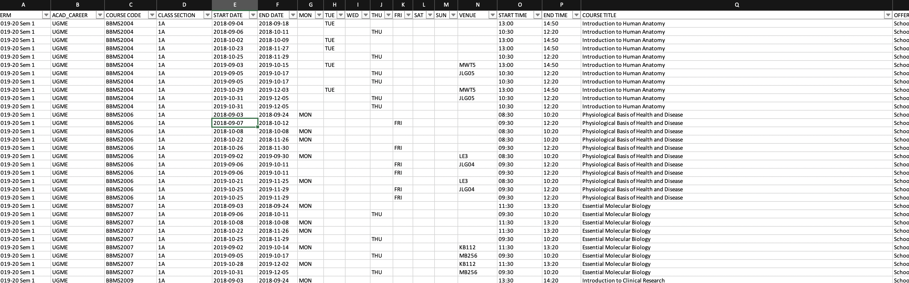

# What am I going to do?
So I have my university's timetable data in excel:



I want to read this data using exceljs + node + typescript, and then put it into mongodb.

I also want make docker images for my node app and mongodb, so that I can use `docker-compose` to orchestrate execution of them. 

The main reason I want to try out docker is just that **I did not want to pollute my local OSX environment with mongodb data.**

The steps below assume that you've already signed up for & installed docker on your environment. 

You can find the repo for this tutorial(?) [here](https://github.com/hoxyjs/parser).

So here it goes: 

# Basic workflows for mongodb on docker

This will detect that you have no mongo image on local, download it from online, and then run it on port `27017`:

```bash
$ mkdir ./data
$ docker run -d -p 27017:27017 -v ~/data:/data/db mongo

Unable to find image 'mongo:latest' locally
latest: Pulling from library/mongo
35c102085707: Pull complete
251f5509d51d: Pull complete
8e829fe70a46: Pull complete
6001e1789921: Pull complete
62fb80b8f88c: Pull complete
76be8dc9ea13: Pull complete
c73353d62de1: Pull complete
9dfe7c37b46c: Pull complete
1fdf813927b6: Pull complete
87b9bd03dc66: Pull complete
24c524d289d7: Pull complete
306b575ddfff: Pull complete
ee1475733b36: Pull complete
Digest: sha256:ec1fbbb3f75fdee7c3433ce2d5b8200e7c9916c57902023777bec5754da5e525
Status: Downloaded newer image for mongo:latest
d7e515cfe278d3dbc6b12634bcb85819c6d1da219c79026bf68e4b84b139a4da
```

This will show the list of **running containers**:

```bash
$ docker container ls

CONTAINER ID        IMAGE               COMMAND                  CREATED             STATUS              PORTS                      NAMES
d7e515cfe278        mongo               "docker-entrypoint.s…"   12 minutes ago      Up 12 minutes       0.0.0.0:27017->27017/tcp   interesting_jepsen
```

This will list both inactive/active containers. Notice you've got one more than the previous command.

```
$ docker container ls -a
CONTAINER ID        IMAGE               COMMAND                  CREATED             STATUS              PORTS                      NAMES
15d5921d8acb        mongo               "docker-entrypoint.s…"   20 minutes ago      Created                                        agitated_panini
d7e515cfe278        mongo               "docker-entrypoint.s…"   21 minutes ago      Up 21 minutes       0.0.0.0:27017->27017/tcp   interesting_jepsen
```

Now, to access the mongo shell inside the container, you either have to use the id or the name of the container. As you can see from the output, the ID is `d7e515cfe278` and the name `interesting_jepsen` (I guess it's auto-generated by docker). You could do:

```bash
$ docker exec -it d7e515cfe278 bash
# or
$ docker exec -it interesting-jepsen bash
```

to launch a bash terminal inside this docker image. `-it` flag is for `interactive` and `tty`:

```bash
$ docker exec --help

Usage:	docker exec [OPTIONS] CONTAINER COMMAND [ARG...]

Run a command in a running container

Options:
  -d, --detach               Detached mode: run command in the background
      --detach-keys string   Override the key sequence for detaching a container
  -e, --env list             Set environment variables
  -i, --interactive          Keep STDIN open even if not attached
      --privileged           Give extended privileges to the command
  -t, --tty                  Allocate a pseudo-TTY
  -u, --user string          Username or UID (format: <name|uid>[:<group|gid>])
  -w, --workdir string       Working directory inside the container
```

Ok. so `interactive` means just interactive, and `pseudo-TTY` means:
> A device that has the functions of a physical terminal without actually being one. Created by terminal emulators such as xterm. ([ref](https://unix.stackexchange.com/questions/21147/what-are-pseudo-terminals-pty-tty))

So you are going to launch an interactive, virtual terminal. 

Anyways, that was the meaning of `-it` flag.

IF you think the name `interesting-jepsen` is not good enough, change it:

```bash
$ docker container rename interesting_jepsen mongodb-test
$ docker container ls
CONTAINER ID        IMAGE               COMMAND                  CREATED             STATUS              PORTS                      NAMES
d7e515cfe278        mongo               "docker-entrypoint.s…"   27 minutes ago      Up 27 minutes       0.0.0.0:27017->27017/tcp   mongodb-test
``` 

Yay. Anyhow, if you run this command:

```bash
$ docker exec -it d7e515cfe278 bash
# or
$ docker exec -it interesting-jepsen(or mongodb-test) bash
```

it is going to give you a virtual bash terminal inside your terminal:

```bash
root@d7e515cfe278:/#
```

Now launch the mongo shell.

```bash
root@d7e515cfe278:/# mongo
MongoDB shell version v4.2.0
connecting to: mongodb://127.0.0.1:27017/?compressors=disabled&gssapiServiceName=mongodb
Implicit session: session { "id" : UUID("81bef6b1-53be-4155-a014-cc846fba16ef") }
MongoDB server version: 4.2.0
Server has startup warnings:
2019-08-17T12:42:58.181+0000 I  CONTROL  [initandlisten]
2019-08-17T12:42:58.181+0000 I  CONTROL  [initandlisten] ** WARNING: Access control is not enabled for the database.
2019-08-17T12:42:58.181+0000 I  CONTROL  [initandlisten] **          Read and write access to data and configuration is unrestricted.
2019-08-17T12:42:58.181+0000 I  CONTROL  [initandlisten]
---
Enable MongoDB's free cloud-based monitoring service, which will then receive and display
metrics about your deployment (disk utilization, CPU, operation statistics, etc).

The monitoring data will be available on a MongoDB website with a unique URL accessible to you
and anyone you share the URL with. MongoDB may use this information to make product
improvements and to suggest MongoDB products and deployment options to you.

To enable free monitoring, run the following command: db.enableFreeMonitoring()
To permanently disable this reminder, run the following command: db.disableFreeMonitoring()
---
```

Now you see mongo's working nicely. Let's go make an image for my simple node app.

# Using node with docker

This time I will going to create an image with my own node app.

Here's what my `index.ts` in my node app looks like:

```typescript
import to from "await-to-js";
import dotenv from "dotenv";
import Excel from "exceljs";

import connect from "./connect";
import Course, {ICourse} from "./course";

dotenv.config();

(async () => {
    const [err, result] = await to(connect());
    if (err) { throw new Error(err); }

    const workbook = new Excel.Workbook();
    const workbookFile = await workbook.xlsx.readFile(`${process.env.DOCKER_ROOT_DIR || process.env.ROOT_DIR}/src/assets/timetable.xlsx`);
    const worksheet = workbook.getWorksheet(1);

    worksheet.eachRow(async (row: Excel.Row, rowNumber: number) => {
        if (rowNumber < 10) {
            const [_, term, acadCareer, courseCode, classSection, startDate, endDate, mon, tue, wed, thu, fri, sat, sun, venue, startTime, endTime, title, offerDept, instructor]: any = row.values;

            const course = new Course({
                term,
                acadCareer,
                courseCode,
                classSection,
                title,
                offerDept,
                instructor: instructor && instructor.split(";").map((name: string) => name.trim()),
            });

            await course.save().then(() => console.log("Course created"));
        }
    });

    Course.find({}, function(err, courses) {
        console.log(courses);
    });
    return;
})();

```

It's simple. It will read from an Excel document some data and store it into mongodb.

Now, to make your own image, you need a `Dockerfile` in the project root directory. `Dockerfile` specifies what will be included in your application container when it is executed. It defines your container environment. It's a bit like `travis.yml` if you have used Travis. It's just a set of instructions:

```dockerfile
FROM node:12
# Create app directory & set ownership on them to user 'node'
RUN mkdir -p /home/node/app/node_modules && chown -R node:node /home/node/app
# Set working directory
WORKDIR /home/node/app
# Install app dependencies
COPY package*.json ./
# Ensure the current user is 'node'
USER node
# Install deps
RUN npm install --save-dev yarn
RUN /home/node/app/node_modules/.bin/yarn
# Copy app source code with appropriate permissions
COPY --chown=node:node . .
# Start application
CMD [ "npm", "start" ]
```

Also, just like git, there's `.dockerignore`. Just add the ones you don't want in your image:

```
node_modules
npm-debug.log
Dockerfile
.dockerignore
.git
.gitignore
dist
```

Now you are ready to make an image. Run on bash:

```bash
docker build -t your-dockerhub-id/node-test .
# be in your project root where Dockerfile exists. 
```

Then it is going to show you what it's doing: 

```bash
Sending build context to Docker daemon  192.1MB
Step 1/8 : FROM node:12
12: Pulling from library/node
9cc2ad81d40d: Pull complete
e6cb98e32a52: Pull complete
ae1b8d879bad: Pull complete
42cfa3699b05: Pull complete
053cac798c4e: Pull complete
e11ff976ff71: Pull complete
224731f6b161: Pull complete
56ed10abd115: Pull complete
f93be52154ee: Pull complete
Digest: sha256:2eb5b7ee06215cda1c697c178978c51367b78ee3992a058f37b73616521fc104
Status: Downloaded newer image for node:12
 ---> e3e4ac3015dd
Step 2/8 : RUN mkdir -p /home/node/app/node_modules && chown -R node:node /home/node/app
 ---> Running in 20d0454832aa
Removing intermediate container 20d0454832aa
 ---> 3bc196dc1ba2
Step 3/8 : WORKDIR /home/node/app
 ---> Running in 13b04fa8b5e2

...

Successfully built 6d852a03a2bf
Successfully tagged 9oel/node-test:latest
```

Now the image's ready. To see the built image:

```
$ docker images
REPOSITORY          TAG                 IMAGE ID            CREATED              SIZE
my-username/node-test      latest              069c8178498c        About a minute ago   1.26GB
```

Now you can create a container using this image. 

## Using node and mongo containers together with `docker-compose`

Now we've got two images:
- `node-test`
- `mongo`

You need something called `docker-compose` to define and run multiple containers together as one application. To do that, write out a `docker-compose.yml` in your project root:

```yaml
# use docker-compose version 3
version: "3"
services:
  # my custom service name
  node:
    build:
      context: .
      dockerfile: Dockerfile
    image: 9oel/node-test
    restart: unless-stopped
    ports:
      - "8080:8080"
    # for volume errors, refer to https://github.com/ClusterHQ/dvol/issues/67
    volumes:
      - .:/home/node/app
      - ./node_modules:/home/node/app/node_modules
    environment:
      - DOCKER_ROOT_DIR=/home/node/app
    depends_on:
      - mongo
  mongo:
    image: mongo
    ports:
      - "27017:27017"

```

Now we are ready to go. Set the directory to the project root, and then simply run (`docker-compose` is installed together with docker, as far as I know):

```bash
$ docker-compose up
```

It is going to show a lot of messages about how it's doing:

```bash
$ docker-compose up
Starting parser_mongo_1 ... done
Recreating parser_node_1 ... done
Attaching to parser_mongo_1, parser_node_1
mongo_1  | 2019-08-19T06:40:08.825+0000 I  CONTROL  [main] Automatically disabling TLS 1.0, to force-enable TLS 1.0 specify --sslDisabledProtocols 'none'
mongo_1  | 2019-08-19T06:40:08.827+0000 I  CONTROL  [initandlisten] MongoDB starting : pid=1 port=27017 dbpath=/data/db 64-bit host=614026340cb8
mongo_1  | 2019-08-19T06:40:08.827+0000 I  CONTROL  [initandlisten] db version v4.2.0
mongo_1  | 2019-08-19T06:40:08.827+0000 I  CONTROL  [initandlisten] git version: a4b751dcf51dd249c5865812b390cfd1c0129c30
mongo_1  | 2019-08-19T06:40:08.827+0000 I  CONTROL  [initandlisten] OpenSSL version: OpenSSL 1.1.1  11 Sep 2018
mongo_1  | 2019-08-19T06:40:08.827+0000 I  CONTROL  [initandlisten] allocator: tcmalloc
mongo_1  | 2019-08-19T06:40:08.827+0000 I  CONTROL  [initandlisten] modules: none
mongo_1  | 2019-08-19T06:40:08.827+0000 I  CONTROL  [initandlisten] build environment:
mongo_1  | 2019-08-19T06:40:08.827+0000 I  CONTROL  [initandlisten]     distmod: ubuntu1804
mongo_1  | 2019-08-19T06:40:08.828+0000 I  CONTROL  [initandlisten]     distarch: x86_64
mongo_1  | 2019-08-19T06:40:08.828+0000 I  CONTROL  [initandlisten]     target_arch: x86_64
mongo_1  | 2019-08-19T06:40:08.828+0000 I  CONTROL  [initandlisten] options: { net: { bindIp: "*" } }
mongo_1  | 2019-08-19T06:40:08.828+0000 W  STORAGE  [initandlisten] Detected unclean shutdown - /data/db/mongod.lock is not empty.
mongo_1  | 2019-08-19T06:40:08.828+0000 I  STORAGE  [initandlisten] Detected data files in /data/db created by the 'wiredTiger' storage engine, so setting the active storage engine to 'wiredTiger'.

...

node_1   | (node:30) [DEP0005] DeprecationWarning: Buffer() is deprecated due to security and usability issues. Please use the Buffer.alloc(), Buffer.allocUnsafe(), or Buffer.from() methods instead.
mongo_1  | 2019-08-19T06:40:23.485+0000 I  NETWORK  [listener] connection accepted from 172.18.0.3:59916 #1 (1 connection now open)
mongo_1  | 2019-08-19T06:40:23.490+0000 I  NETWORK  [conn1] received client metadata from 172.18.0.3:59916 conn1: { driver: { name: "nodejs", version: "3.2.7" }, os: { type: "Linux", name: "linux", architecture: "x64", version: "4.9.184-linuxkit" }, platform: "Node.js v12.8.1, LE, mongodb-core: 3.2.7" }
mongo_1  | 2019-08-19T06:40:33.035+0000 I  SHARDING [conn1] Marking collection course.courses as collection version: <unsharded>
mongo_1  | 2019-08-19T06:40:33.036+0000 I  STORAGE  [conn1] createCollection: course.courses with generated UUID: e5cf5691-7ebf-44a0-967a-065b94b2e4a6 and options: {}
mongo_1  | 2019-08-19T06:40:33.049+0000 I  INDEX    [conn1] index build: done building index _id_ on ns course.courses
node_1   | Course created
mongo_1  | 2019-08-19T06:40:33.060+0000 I  NETWORK  [listener] connection accepted from 172.18.0.3:59918 #2 (2 connections now open)
mongo_1  | 2019-08-19T06:40:33.064+0000 I  NETWORK  [conn2] received client metadata from 172.18.0.3:59918 conn2: { driver: { name: "nodejs", version: "3.2.7" }, os: { type: "Linux", name: "linux", architecture: "x64", version: "4.9.184-linuxkit" }, platform: "Node.js v12.8.1, LE, mongodb-core: 3.2.7" }
node_1   | Course created
mongo_1  | 2019-08-19T06:40:33.071+0000 I  NETWORK  [listener] connection accepted from 172.18.0.3:59920 #3 (3 connections now open)
mongo_1  | 2019-08-19T06:40:33.072+0000 I  NETWORK  [conn3] received client metadata from 172.18.0.3:59920 conn3: { driver: { name: "nodejs", version: "3.2.7" }, os: { type: "Linux", name: "linux", architecture: "x64", version: "4.9.184-linuxkit" }, platform: "Node.js v12.8.1, LE, mongodb-core: 3.2.7" }
node_1   | Course created
node_1   | Course created
node_1   | Course created
mongo_1  | 2019-08-19T06:40:33.079+0000 I  NETWORK  [listener] connection accepted from 172.18.0.3:59922 #4 (4 connections now open)
mongo_1  | 2019-08-19T06:40:33.079+0000 I  NETWORK  [conn4] received client metadata from 172.18.0.3:59922 conn4: { driver: { name: "nodejs", version: "3.2.7" }, os: { type: "Linux", name: "linux", architecture: "x64", version: "4.9.184-linuxkit" }, platform: "Node.js v12.8.1, LE, mongodb-core: 3.2.7" }
node_1   | Course created
node_1   | Course created
node_1   | Course created
node_1   | Course created

   {
node_1   |     instructor: [
node_1   |       'Chan,Wing Yan Camie',
node_1   |       'Chang,Chuen Chung Raymond',
node_1   |       'Cheung,Annie',
node_1   |       'Ching,Yick Pang',
node_1   |       'Chung,Sookja Kim',
node_1   |       'Huen,Shing Yan Michael',
node_1   |       'Tipoe,George Lim',
node_1   |       'Yang,Jian',
node_1   |       'Yip,Ka Fun Henry',
node_1   |       'Yip,Sui Ping Vera'
node_1   |     ],
node_1   |     _id: 5d5a44602e23e5001e7b4921,
node_1   |     term: '2019-20 Sem 1',
node_1   |     acadCareer: 'UGME',
node_1   |     courseCode: 'BBMS2004',
node_1   |     classSection: '1A',
node_1   |     title: 'Introduction to Human Anatomy',
node_1   |     offerDept: 'School of Biomedical Sciences',
node_1   |     schedules: [],
node_1   |     __v: 0
node_1   |   },
node_1   |   {
node_1   |     instructor: [
node_1   |       'Chan,Wing Yan Camie',
node_1   |       'Chang,Chuen Chung Raymond',
node_1   |       'Cheung,Annie',
node_1   |       'Ching,Yick Pang',
node_1   |       'Chung,Sookja Kim',
node_1   |       'Huen,Shing Yan Michael',
node_1   |       'Tipoe,George Lim',
node_1   |       'Yang,Jian',
node_1   |       'Yip,Ka Fun Henry',
node_1   |       'Yip,Sui Ping Vera'
node_1   |     ],
node_1   |     _id: 5d5a44602e23e5001e7b4923,
node_1   |     term: '2019-20 Sem 1',
node_1   |     acadCareer: 'UGME',
node_1   |     courseCode: 'BBMS2004',
node_1   |     classSection: '1A',
node_1   |     title: 'Introduction to Human Anatomy',
node_1   |     offerDept: 'School of Biomedical Sciences',
node_1   |     schedules: [],
node_1   |     __v: 0
node_1   |   },
node_1   |   {
node_1   |     instructor: [
node_1   |       'Chan,Wing Yan Camie',
node_1   |       'Chang,Chuen Chung Raymond',
node_1   |       'Cheung,Annie',
node_1   |       'Ching,Yick Pang',
node_1   |       'Chung,Sookja Kim',
node_1   |       'Huen,Shing Yan Michael',
node_1   |       'Tipoe,George Lim',
node_1   |       'Yang,Jian',
node_1   |       'Yip,Ka Fun Henry',
node_1   |       'Yip,Sui Ping Vera'
node_1   |     ],
node_1   |     _id: 5d5a44602e23e5001e7b4924,
node_1   |     term: '2019-20 Sem 1',
node_1   |     acadCareer: 'UGME',
node_1   |     courseCode: 'BBMS2004',
node_1   |     classSection: '1A',
node_1   |     title: 'Introduction to Human Anatomy',
node_1   |     offerDept: 'School of Biomedical Sciences',
node_1   |     schedules: [],
node_1   |     __v: 0
node_1   |   },
```

Yes! You can see the message `Course created` and some data from mongo, which is an output from my node application. 

You can check their status with these commands as well:

```bash
$ docker-compose ps
     Name                   Command               State            Ports
----------------------------------------------------------------------------------
parser_mongo_1   docker-entrypoint.sh mongod      Up      0.0.0.0:27017->27017/tcp
parser_node_1    docker-entrypoint.sh npm start   Up      0.0.0.0:8080->8080/tcp
```

Now let's enter the mongo shell inside the container to actually check for the data that has been inserted (**Note**: you should run this below command with the service status **up**)

```bash
$ docker-compose exec mongo bash
root@614026340cb8:/# 
```

`docker-compse` does not need `-it` flag like before when we ran `docker`. It's just different. Now let's start mongo to inspect the data:

```bash
$ docker exec -it parser_mongo_1 bash
root@7970fbf8d42a:/# mongo mongodb://mongo:27017/course
> show dbs
admin    0.000GB
config   0.000GB
course   0.000GB
courses  0.000GB
local    0.000GB
> db.stats()
{
	"db" : "course",
	"collections" : 1,
	"views" : 0,
	"objects" : 45,
	"avgObjSize" : 459.8888888888889,
	"dataSize" : 20695,
	"storageSize" : 36864,
	"numExtents" : 0,
	"indexes" : 1,
	"indexSize" : 36864,
	"scaleFactor" : 1,
	"fsUsedSize" : 7696060416,
	"fsTotalSize" : 62725623808,
	"ok" : 1
}
> db.courses.find({})
{ "_id" : ObjectId("5d5a44602e23e5001e7b4920"), "instructor" : [ "INSTRUCTOR" ], "term" : "TERM", "acadCareer" : "ACAD_CAREER", "courseCode" : "COURSE CODE", "classSection" : "CLASS SECTION", "title" : "COURSE TITLE", "offerDept" : "OFFER DEPT", "schedules" : [ ], "__v" : 0 }
{ "_id" : ObjectId("5d5a44602e23e5001e7b4921"), "instructor" : [ "Chan,Wing Yan Camie", "Chang,Chuen Chung Raymond", "Cheung,Annie", "Ching,Yick Pang", "Chung,Sookja Kim", "Huen,Shing Yan Michael", "Tipoe,George Lim", "Yang,Jian", "Yip,Ka Fun Henry", "Yip,Sui Ping Vera" ], "term" : "2019-20 Sem 1", "acadCareer" : "UGME", "courseCode" : "BBMS2004", "classSection" : "1A", "title" : "Introduction to Human Anatomy", "offerDept" : "School of Biomedical Sciences", "schedules" : [ ], "__v" : 0 }
{ "_id" : ObjectId("5d5a44602e23e5001e7b4923"), "instructor" : [ "Chan,Wing Yan Camie", "Chang,Chuen Chung Raymond", "Cheung,Annie", "Ching,Yick Pang", "Chung,Sookja Kim", "Huen,Shing Yan Michael", "Tipoe,George Lim", "Yang,Jian", "Yip,Ka Fun Henry", "Yip,Sui Ping Vera" ], "term" : "2019-20 Sem 1", "acadCareer" : "UGME", "courseCode" : "BBMS2004", "classSection" : "1A", "title" : "Introduction to Human Anatomy", "offerDept" : "School of Biomedical Sciences", "schedules" : [ ], "__v" : 0 }
{ "_id" : ObjectId("5d5a44602e23e5001e7b4924"), "instructor" : [ "Chan,Wing Yan Camie", "Chang,Chuen Chung Raymond", "Cheung,Annie", "Ching,Yick Pang", "Chung,Sookja Kim", "Huen,Shing Yan Michael", "Tipoe,George Lim", "Yang,Jian", "Yip,Ka Fun Henry", "Yip,Sui Ping Vera" ], "term" : "2019-20 Sem 1", "acadCareer" : "UGME", "courseCode" : "BBMS2004", "classSection" : "1A", "title" : "Introduction to Human Anatomy", "offerDept" : "School of Biomedical Sciences", "schedules" : [ ], "__v" : 0 }
...
```

Yes, it works!

So far we have looked at how to make node and mongodb images and use them together with `docker-compose`. 

## Additionally useful docker commands

Just fyi:

Remove containers:

```
docker rm [container-name or container-id]
```

Remove images:

```dockerfile
docker rmi [image-name or image-id]
```
