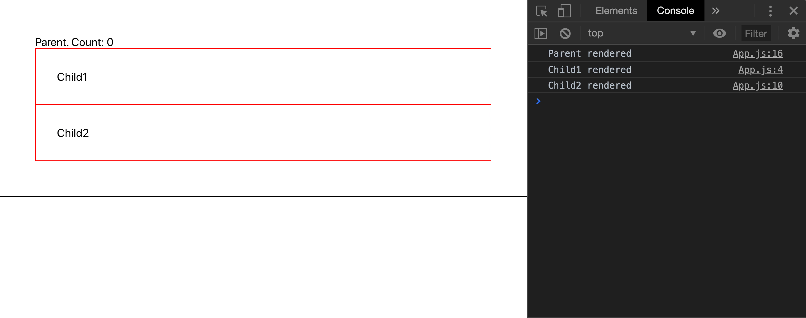
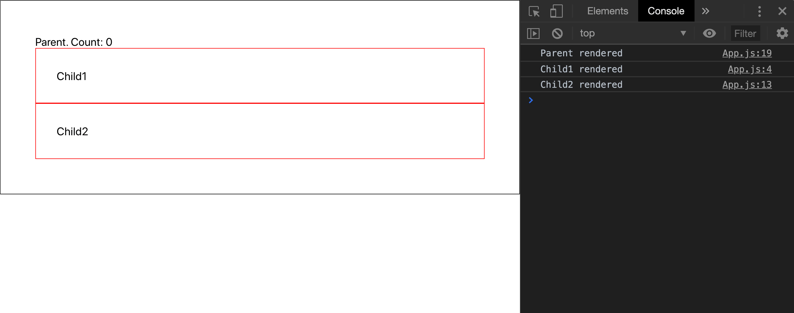
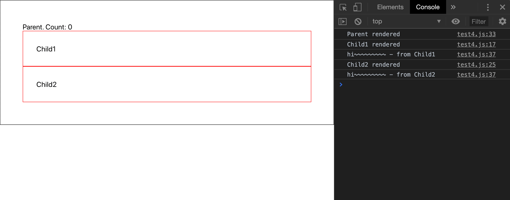

## I believed React is smart enough to know this.... but aye?

We had a bunch of large component trees in our company's web application.
And I saw them re-rendering from the top to deep down to the bottom for no reason. 
At first, I thought it would be easy to get them correct.


Of course, the tree was much bigger than this. The tree didn't just reach the end. This made useless re-rendering even a bigger concern.
From the top to bottom, `Provider`, `ConnectedRouter`, `App`, `PersistGate`, `ComponentA`, `ComponentB`, .... and so on.

And I saw that there were no use of `shouldComponentUpdate`/`PureComponent`/`memo` in our app yet. 
So I decided to make use of them, still not yet aware of what was to come for me. 

## Takeaway 1: Parent component pretty much does not care about its `children`

I was optimizing the app and witnessed an interesting fact. 
Here's the code to demonstrate it:

```js
import React, { useState } from 'react';

const Child1 = () => {
  console.log('Child1 rendered')
  return <div style = {{border: '1px solid red', padding: '30px'}}>
    Child1
  </div>
}
const Child2 = () => {
  console.log('Child2 rendered')
  return <div style = {{border: '1px solid red', padding: '30px'}}>
    Child2
  </div>
}
const Parent = () => {
  console.log('Parent rendered')

  let [count, setCount] = useState(0)
  const handleMouseEnter = () => setCount(prevCount => prevCount + 1)

  return <div onMouseEnter={handleMouseEnter} style = {{border: '1px solid black', padding: '50px'}}>
    Parent. Count: {count}
    <Child1/>
    <Child2/>
  </div>
}
export default Parent
```

And do you think `Child1` and `Child2` are going to re-render upon `Parent` component's `mouseEnter`?
See what happens:


Oops. **They re-render.** But I do not see a reason why (The same thing happens for `class` components, if you wonder. You can try that!). 
The children do not even have their own props or states to listen for any changes.
How can this happen? This is from React's own documentation:

> `shouldComponentUpdate()` is invoked before rendering when new props or state are being received. _**Defaults to true.**_ 

It defaults to true! What... Ok. React is made that way. 

Then how can we make it better? 

## Takeaway 2: use the `children` prop

Ok. The only difference is that **we use children prop**. 

```js

(Child1 and Child2 stay the same)

const Parent = ({ children }) => {
  console.log('Parent rendered')

  let [count, setCount] = useState(0)
  const handleMouseEnter = () => setCount(prevCount => prevCount + 1)

  return <div onMouseEnter={handleMouseEnter} style = {{border: '1px solid black', padding: '50px'}}>
    Parent. Count: {count}
    {children}
  </div>
}
export default () => <Parent><Child1/><Child2/></Parent>
```

And the result?



It **does not re-render the children components anymore**! 
I still have not understood exactly why React _can_ in this code but _cannot_ in the previous code, 
but this is what it is.

## Takeaway 3: use `React.memo`

```js
import React, { useState, memo } from 'react';

const Child1 = memo(() => {
  console.log('Child1 rendered')
  return <div style = {{border: '1px solid red', padding: '30px'}}>
    Child1
  </div>
})
const Child2 = memo(() => {
  console.log('Child2 rendered')
  return <div style = {{border: '1px solid red', padding: '30px'}}>
    Child2
  </div>
})
const Parent = () => {
  console.log('Parent rendered')

  let [count, setCount] = useState(0)
  const handleMouseEnter = () => setCount(prevCount => prevCount + 1)

  return <div onMouseEnter={handleMouseEnter} style = {{border: '1px solid black', padding: '50px'}}>
    Parent. Count: {count}
    <Child1/>
    <Child2/>
  </div>
}
export default Parent
```

`memo` literally memoizes the functional component receiving a certain `props`, and if the props stay the same, it will just return the previously rendered (same) component. The result? Same as solution 1. It does not re-render `Child1` and `Child2`.
So I'm just gonna copy and paste the gif from above for those who are lazy to read what's written, just like me:


Ok. But if you are using passing in nested objects as props, you should implement your own `areEqual` function for `memo`, like this:

```js
import React, { useState, memo } from 'react';

const Child1 = memo(({ obj }) => {
  console.log(`Child${obj.number.one} rendered`)
  return <div style = {{border: '1px solid red', padding: '30px'}}>
    Child1
  </div>
})

const areEqual = (prevProps, nextProps) => 
  prevProps.obj.number.one === nextProps.obj.number.one && prevProps.obj.number.two === nextProps.obj.number.two
  
const Child2 = memo(({ obj }) => {
  console.log(`Child${obj.number.two} rendered`)
  return <div style = {{border: '1px solid red', padding: '30px'}}>
    Child2
  </div>
}, areEqual)

const Parent = () => {
  console.log('Parent rendered')

  let [count, setCount] = useState(0)
  const handleMouseEnter = () => setCount(prevCount => prevCount + 1)
  const obj = {
    number: {
      one: 1,
      two: 2,
    }
  }
  
  return <div onMouseEnter={handleMouseEnter} style = {{border: '1px solid black', padding: '50px'}}>
    Parent. Count: {count}
    <Child1 obj={obj}/>
    <Child2 obj={obj}/>
  </div>
}
export default Parent
```

Yeah. I know it's an ol' school style to check nested object equality, but it works well. 
In practice, [you use something like `isEqual` from `react-fast-compare`](https://github.com/FormidableLabs/react-fast-compare) that would handle nested object comparison for you.

Ok. Now, what's the result? 



`Child1` no longer knows `obj` prop stays the same because `memo` only runs a shallow comparison between `prevProps` and `nextProps`
But `Child2` exactly knows, by using `areEqual` function, that `obj` is actually staying the same and therefore it does not need to re-render itself. 

## Takeaway 4: Use `PureComponent`/`shouldComponentUpdate`

Of course, you might wanna use your class component. So here's a brief explanation on that as well:

```js
import React, { Component, PureComponent } from 'react';

class Child1 extends PureComponent {
  render(){
    console.log(`Child${this.props.obj.number.one} rendered`)
    return <div style = {{border: '1px solid red', padding: '30px'}}>
      Child1
    </div>
  }
}

class Child2 extends Component {
  constructor(){
    super()
  }

  shouldComponentUpdate(nextProps, nextState){
    return this.props.obj.number.one !== nextProps.obj.number.one && this.props.obj.number.two !== nextProps.obj.number.two
  }

  render(){
    console.log(`Child${this.props.obj.number.two} rendered`)
    return <div style = {{border: '1px solid red', padding: '30px'}}>
      Child2
    </div>
  }
}
  
class Parent extends React.Component {
  constructor(){
    super()
    this.handleMouseEnter = this.handleMouseEnter.bind(this);
    this.state = {
      count: 0
    }
  }
  handleMouseEnter(){
    this.setState((prevState) => ({count: prevState.count + 1}));
  }
  render(){
    console.log('Parent rendered')
    const obj = {
      number: {
        one: 1,
        two: 2,
      }
    }

    return <div onMouseEnter={this.handleMouseEnter} style = {{border: '1px solid black', padding: '50px'}}>
        Parent. Count: {this.state.count}
      <Child1 obj={obj}/>
      <Child2 obj={obj}/>
    </div>
  }
}
  
export default Parent
```

Above is an exact replica of the functional component implementations. Here are the details:
1. You use `PureComponent` for `Child1`, but it won't serve its purpose, just like `memo`, because it has a nested object as its prop. It will keep re-rendering upon its parent component re-rendering. It would work if there were no nested object properties. 
2. You use `shouldComponentUpdate` for `Child2` and it will work. It compares nested objects just like `areEqual`. In case there is a `state`, you can use `nextState` to compare with `this.state` (previous state).
3. It's just so annoying to write lots of boilerplate of codes for a `class` component. That's why I prefer functional components... (yeah I digressed a bit) 

Of course, the result is the same as the last code snippet. Let's again copy and paste the same gif for the people:


## Takeaway 5: Deal with functions from props when comparing

There are many cases where props are functions, especially when you plug your functions into components with redux's `mapDispatchToProps`, or passing your functions as props from parent down to children to get notified of what happened in children.

Dealing with functions might sound like really a basic thing, but it can really harm your application's performance if you don't do.

We see lots of patterns like this:

```js
import React, { useState, memo } from 'react';

const Child1 = memo(({ num, sayHiInChildren }) => {
  console.log(`Child${num} rendered`)
  sayHiInChildren('Child1')
  return <div style = {{border: '1px solid red', padding: '30px'}}>
    Child1
  </div>
})

const areEqual = (prevProps, nextProps) => 
  prevProps.num === nextProps.num && prevProps.sayHiInChildren === nextProps.sayHiInChildren
  
const Child2 = memo(({ num, sayHiInChildren }) => {
  console.log(`Child${num} rendered`)
  sayHiInChildren('Child2');
  return <div style = {{border: '1px solid red', padding: '30px'}}>
    Child2
  </div>
}, areEqual)

const Parent = () => {
  console.log('Parent rendered')
  
  let [count, setCount] = useState(0)
  const handleMouseEnter = () => setCount(prevCount => prevCount + 1)
  const sayHiInChildren = child => console.log(`hi~~~~~~~~~ - from ${child}`);
  
  return <div onMouseEnter={handleMouseEnter} style = {{border: '1px solid black', padding: '50px'}}>
    Parent. Count: {count}
    <Child1 num={1} sayHiInChildren={sayHiInChildren}/>
    <Child2 num={2} sayHiInChildren={sayHiInChildren}/>
  </div>
}
export default Parent
```

Details:
1. Now, the `obj` prop no longer an object. It's just become `num`. 
2. You are passing a function called `sayHiInChildren` to `Child2` as a `prop`. 
3. You shallowly compare if all props are the same, both in `Child1` and `Child2`, albeit using different ways (`Child1` is not using a custom `areEqual` function, but `Child2` is. But essentially they are doing the same thing in this context). 
4. Everything is going to re-render although props to `Child1` and `Child2` are staying exactly the same. Look at the result:


But why!? Well..

In javascript, there is hardly a way to compare functions. 

```js
prevProps.sayHiInChildren === nextProps.sayHiInChildren
```
This will always return false, because functions are objects in javascript, meaning they are compared not with values, but references:

```js
function a() {
  console.log('we are not the same')
}
function b() {
  console.log('we are not the same')
}
a === b // false
```

The only way to make it possible is to have the same reference:

```js
function a() {
  console.log('we are not the same')
}
const b = a
a === b // true
```

Then how can we deal with functions in props?
Well, there are 4 ways: 
  - Exclude them (not recommended)
  - Stringify them (not recommended)
  - Use `useCallback`
  - Bind the function to the class.


### 1. Exclude them (not recommended)

`util.ts`

```js
import _ from 'lodash-es';
import isEqual from 'react-fast-compare';

const removeFunctions = (fromObj) => {
  const obj = {}
  // @description it only removes functions that are not inside nested object properties.
  // you can improve with recursion to remove all functions inside an object. 
  Object.keys(fromObj).forEach(key => !_.isFunction(fromObj[key]) && (obj[key] = fromObj[key]))
  return obj
}

export const areEqual = (prevProps, nextProps) => {
  const [prev, next] = [prevProps, nextProps].map(removeFunctions);
  return isEqual(prev, next);
}
```

You can use lodash's `_.isFunction` to check if something is a function.
Then you only have object properties that are not functions, to apply that to `areEqual` function.

Now, you can do this:

```js
import React, { useState, memo } from 'react';
import { areEqual } from './util'

const Child1 = memo(({ num, sayHiInChildren }) => {
  console.log(`Child${num} rendered`)
  sayHiInChildren('Child1')
  return <div style = {{border: '1px solid red', padding: '30px'}}>
    Child1
  </div>
}, areEqual)

const Child2 = memo(({ num, sayHiInChildren }) => {
  console.log(`Child${num} rendered`)
  sayHiInChildren('Child2');
  return <div style = {{border: '1px solid red', padding: '30px'}}>
    Child2
  </div>
}, areEqual)

const Parent = () => {
  console.log('Parent rendered')
  
  let [count, setCount] = useState(0)
  const handleMouseEnter = () => setCount(prevCount => prevCount + 1)
  const sayHiInChildren = child => console.log(`hi~~~~~~~~~ - from ${child}`);
  
  return <div onMouseEnter={handleMouseEnter} style = {{border: '1px solid black', padding: '50px'}}>
    Parent. Count: {count}
    <Child1 num={1} sayHiInChildren={sayHiInChildren}/>
    <Child2 num={2} sayHiInChildren={sayHiInChildren}/>
  </div>
}
export default Parent
```

Result? Only parent component re-renders. Essentially, you are only comparing props which are not functions.



### 2. Stringify them (not recommended)

By default, `JSON.stringify` does not support stringifying functions. So you've gotta use third party libaries like [jsonfn](https://github.com/vkiryukhin/jsonfn#readme).

Let's do this:

`util.js`

```js
import JSONfn from 'json-fn'
import isEqual from 'react-fast-compare'

export const areEqual = (prevProps, nextProps) => {
  const [prev, next] = [prevProps, nextProps].map(JSONfn.stringify)
  return isEqual(prev, next)
}
```

`JSONfn.stringify` will generate a string looking like:

```js
{"num":1,"sayHiInChildren":"_NuFrRa_child => console.log(\"hi~~~~~~~~~ - from \".concat(child))"}
```

Using this function will give you the same result as the last example. Here's another copy and paste:


### 3. Use useCallback
Probably this is the wisest solution when you are trying to prevent rerender in a functional component.

```js
const sayHiInChildren = useCallback(child => console.log(`hi~~~~~~~~~ — from ${child}`), [])
```
`useCallback` will look at the dependencies fed into the array and will only give a different function when some dependency changed. Otherwise it is going to return a memoized callback, which won’t cause a rerender even if it’s fed as a prop.

### 4. Bind the function to the class

As you know useCallback cannot be used in class components.What can we do in the class components?
You can either do:

```js
class Parent extends React.Component {
  sayHiInChildren = child => console.log(`hi~~~~~~~~~ - from ${child}`);

  render() {
    return <div onMouseEnter={handleMouseEnter} style = {{border: '1px solid black', padding: '50px'}}>
      Parent. Count: {count}
      <Child1 num={1} sayHiInChildren={sayHiInChildren}/>
      <Child2 num={2} sayHiInChildren={sayHiInChildren}/>
    </div>
  }
}
```

or

```js
class Parent extends React.Component {
  constructor(...args) {
    super(...args);
    this.sayHiInChildren = this.sayHiInChildren.bind(this);
  }

  sayHiInChildren(child){
    console.log(`hi~~~~~~~~~ - from ${child}`);
  }

  render() {
    return <div onMouseEnter={handleMouseEnter} style = {{border: '1px solid black', padding: '50px'}}>
      Parent. Count: {count}
      <Child1 num={1} sayHiInChildren={sayHiInChildren}/>
      <Child2 num={2} sayHiInChildren={sayHiInChildren}/>
    </div>
  }
}
```

The two methods differ only in the syntax (arrow function binds directly to the parent context, while traditional function has to be bound manually), and they bring the same effect. In this way, you can retain a consistent reference of a function, which will allow you to prevent useless re-render.

## Summary

* If you do not use `children` prop, every component inside the `render` function of a parent will re-render by default.
* There are ways to prevent useless re-renders:
  * Use `memo` with `areEqual`, or
  * Use `PureComponent` or `shouldComponentUpdate`
* If there are functions in your props, before using `areEqual` or `shouldComponentUpdate`:
  * Exclude them (not recommended)
  * Stringify them (not recommended)
  * Use `useCallback`
  * Bind the function to the class.

## Edit
Yes, and you should really take into consideration how much tradeoff your optimization could bring. In other words, the optimization could not work as you expected.