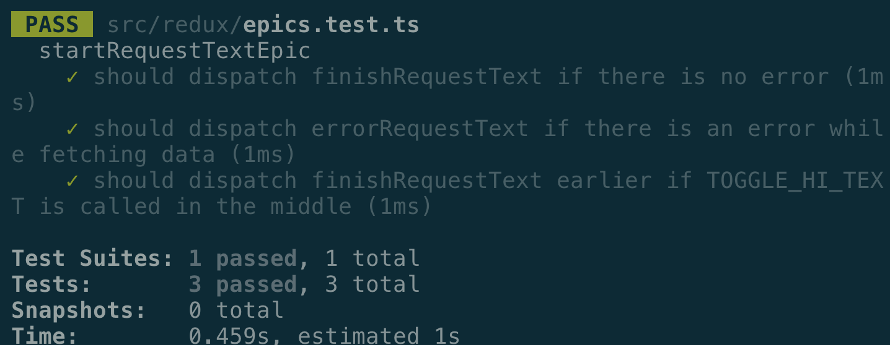
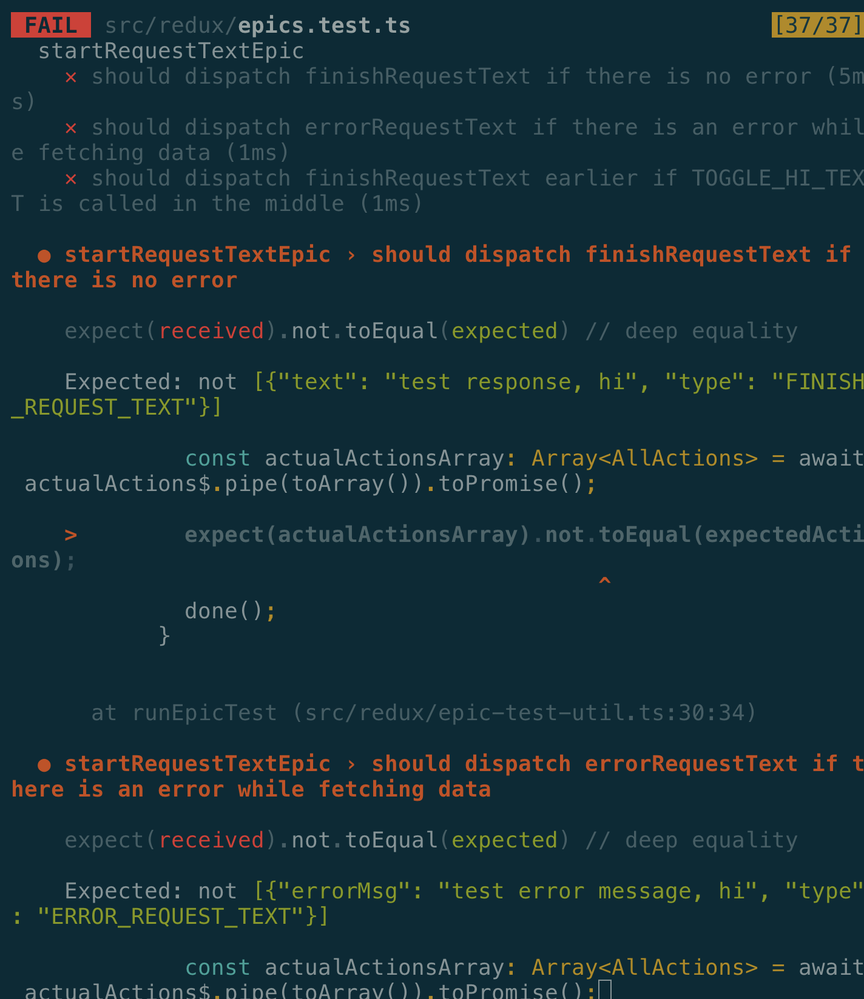

# Problem
I was struggling at my company trying to write some tests for RxJS operations.
Most of the network requests were managed by RxJS, and none of them were covered by tests. I wanted to write tests, but just did not know how to.

But I really just wanted to start from the basics - I mean, the really basics, including why, and how we might want to use `redux-observable`.

# tl;dr
If you want to hop straight into the source code, [here it is.](https://github.com/9oelM/redux-observable)

# First things first
## What is reactive programming?
> [Reactive programming is programming with asynchronous data streams.](https://gist.github.com/staltz/868e7e9bc2a7b8c1f754#reactive-programming-is-programming-with-asynchronous-data-streams)

- Typical events are async event streams, and want to observe over them
- You have useful functions to combine/create/filter those streams

> A **stream** is a sequence of ongoing events ordered in time. It can emit three different things: a value (of some type), an error, or a "completed" signal. 

> We capture these emitted events only asynchronously, by **defining a function that will execute when a value is emitted,** another function when an error is emitted, and another function when 'completed' is emitted.

So this is essentially going back to [the observer design pattern](https://github.com/9oelM/frontend-interview#observer).

## Why bother to use rxjs?
### Abstraction.
If you use RP, you don't have to really worry about implementation details, because it gives you high level of abstraction layer. So you never have to bother with `Promise`s and `await` in javascript anymore. Just declaratively implement what you want to do, and that's it.

### Async works made easier
Nowadays async operations have become a common thing, beacuse you might need to handle UI interactions & tonnes of network requests. 

So there's a good chance that it is going to be a good fit for heavily network based application (both for frontend and backend).

### Lots of helper functions to simplify work declaratively
You have dedicated helper functions to implement what you want to do, which otherwise you might do in a very complex way. Even if this does not fully come to your mind right now, you are going to notice it as you go through this article.

## Why bother to use it with Redux?
Now we have a brief understanding of advantages of using RxJS. Now, we want to handle actions in Redux, but not all actions are synchronous. 

For a simple example, I have wrote a simple application that fetches text from the server and shows it, like this:

 

> I assumed that you have a prior knowledge of some Typescript and React fundamentals including hooks.

This is the project structure (omitted unimportant ones):
```
src
├── App.tsx
├── DummyTextRequestButton
│   └── DummyTextRequestButton.tsx
├── DummyTextViewer
│   └── DummyTextViewer.tsx
├── redux
│   ├── actions.ts
│   ├── constants.ts
│   ├── reducer.ts
│   ├── store.ts
│   └── types.ts
```

### Redux-related things first
In redux, as you know, we mainly have actions and reducers. I have created three types of actions:
1. `StartRequestText`: I will `dispatch` this right before `fetch`ing from the dummy text API.
2. `FinishRequestText`: I will `dispatch` this right after receiving the text.
3. `ErrorRequestText`: I will `dispatch` this as soon as I encounter an error in the process described above.

The above actions are implemented like this in `actions.ts`:
```ts
import { Constants as C } from './constants';
import { Action } from 'redux';

export interface StartRequestTextAction extends Action<C.START_REQUEST_TEXT> {}

export const startRequestText: () => StartRequestTextAction = () => ({
  type: C.START_REQUEST_TEXT,
});

export interface FinishRequestTextAction extends Action<typeof C.FINISH_REQUEST_TEXT> {
  text: string;
}

export const finishRequestText: (text: string) => FinishRequestTextAction = (text) => ({
  type: C.FINISH_REQUEST_TEXT,
  text,
});

export interface ErrorRequestTextAction extends Action<typeof C.ERROR_REQUEST_TEXT> {
  errorMsg: string;
}

export const errorRequestText: (errorMsg: string) => ErrorRequestTextAction = (errorMsg) => ({
  type: C.ERROR_REQUEST_TEXT,
  errorMsg,
});
```

And I simply defined some action types in `constants.ts`:
```ts
export enum Constants {
  START_REQUEST_TEXT = 'START_REQUEST_TEXT',
  FINISH_REQUEST_TEXT = 'FINISH_REQUEST_TEXT',
  ERROR_REQUEST_TEXT = 'ERROR_REQUEST_TEXT',
}
```

Putting them into `reducer.ts` is not difficult at all.
We just have to update the state for each different action.
You can see that I'm updating `isLoading`, `text`, and `errorMsg` individually according to each `type` of an `action`:

`reducer.ts`
```ts
import { Reducer, combineReducers } from 'redux';

import { SimpleTextState, AllActions } from './types';
import { Constants as C } from './constants';
import { RootState } from './types';

export const simpleTextReducer: Reducer<SimpleTextState, AllActions> =
  (state = { isLoading: false }, action) => {
    switch (action.type) {
      case C.START_REQUEST_TEXT:
        return {
          ...state,
          isLoading: true,
        };
      case C.FINISH_REQUEST_TEXT:
        return {
          ...state,
          text: action.text,
          isLoading: false,
        };
      case C.ERROR_REQUEST_TEXT:
        return {
          ...state,
          errorMsg: action.errorMsg,
          isLoading: false,
        };
      default:
        return state;
    }
  }

const reducers: Reducer<RootState> = combineReducers<RootState>({
  simpleText: simpleTextReducer,
});

export default reducers;
```

Again, not so much in `store.ts`. Just combine reducers (although we just have one, which is not usual in production envrionments) and configure redux devtools extension, and create store.

`store.ts`
```ts
import { combineReducers, createStore, Action, Reducer } from 'redux';
import reducers from './reducer';
import { SimpleTextState, RootState } from './types';
import { Constants as C } from './constants';

const store = createStore<State, AllActions, any, any>(
  reducers, (window as any).__REDUX_DEVTOOLS_EXTENSION__ && (window as any).__REDUX_DEVTOOLS_EXTENSION__()
);

export default store;
```

And I defined the types we need in `types.ts`:
```ts
import * as actions from "./actions";
import { ActionType } from 'typesafe-actions';

export type AllActions = ActionType<typeof actions>;

export interface RootState {
  simpleText: SimpleTextState;
}

export interface SimpleTextState {
  text?: string;
  errorMsg?: string;
  isLoading: boolean;
}
```

`App.tsx`
In the parent component, we just want to show two things: the button and the text.

```ts
import React from 'react';
import { Provider } from 'react-redux';

import store from './redux/store';
import DummyTextRequestButton from './DummyTextRequestButton/DummyTextRequestButton';
import DummyTextViewer from './DummyTextViewer/DummyTextViewer';

const App: React.FC = () => {
  return (
    <Provider store={store}>
      <div className="App">
        <DummyTextRequestButton />
        <DummyTextViewer />
      </div>
    </Provider>
  );
}

export default App;
```

`DummyTextRequestButton.tsx`

In this component, we have the logic of dispatching all of the actions we have defined earlier.
You have to recognize that we want to port the logic in `handleClick` to `redux-observable` later, because right now it's not reactive at all.

```ts
import React, { FC } from 'react';
import { Dispatch } from 'redux';
import { useDispatch } from 'react-redux';
import { startRequestText, errorRequestText, finishRequestText } from '../redux/actions';

const DummyTextRequestButton: FC = () => {
  const dispatch: Dispatch = useDispatch();

  const REQUEST_URL: string = 'https://baconipsum.com/api/?type=meat?paras=200';

  const handleClick = async () => {
    dispatch(startRequestText());

    const response: string | Error = await fetch(REQUEST_URL)
      .then((resp: Response) => resp.text())
      .catch((err: Error) => err);

    (response instanceof Error) ?
      dispatch(errorRequestText(response.message)) :
      dispatch(finishRequestText(response));
  }

  return (
    <button 
      style={{ backgroundColor: 'grey', color: 'white', width: 150, height: 50 }}
      onClick={handleClick}
    >
      Click me to request dummy text
    </button>
  )
};

export default DummyTextRequestButton;
```

`DummyTextViewer.tsx`
This component consumes the redux state. Shows error, text, or loading based on the state.

```ts
import React, { FC, ReactNode } from 'react';
import { useSelector } from 'react-redux';

import { RootState } from '../redux/types';

const DummyTextViewer: FC = () => {
  const {
    simpleText: {
      text, errorMsg, isLoading,
    }
  }: RootState = useSelector((state: RootState) => state);

  const textViewer: ReactNode = errorMsg !== undefined ?
    <p>oops, there was an error</p> : (
      <p>{text}</p>
    );

  const dummyTextViewer: ReactNode | null = isLoading ? 
    (<p>loading...</p>) : textViewer;

  return (
    <section>
      {dummyTextViewer}
    </section>
  )
}

export default DummyTextViewer;
```

### With RxJS and redux-observable?
First of all, we are going to introduce relevant modules to our project:

```bash
npm i --save redux-devtools-extension redux-observable rxjs
```

Then we want to get rid of somewhat complex logic inside `DummyTextRequestButton.tsx`:

```ts
import React, { FC } from 'react';
import { Dispatch } from 'redux';
import { useDispatch } from 'react-redux';
import { startRequestText } from '../redux/actions';

const DummyTextRequestButton: FC = () => {
  const dispatch: Dispatch = useDispatch();

  /** Now we just want to trigger the first single action */
  const handleClick = async () => {
    dispatch(startRequestText());
  }

  return (
    <button 
      style={{ backgroundColor: 'grey', color: 'white', width: 150, height: 50 }}
      onClick={handleClick}
    >
      Click me to request dummy text
    </button>
  )
};

export default DummyTextRequestButton;
```

We can do it like above because we are going to port our logic to `redux-observable`.

Then, we are going to create something called `epics.ts` inside `redux` folder:
```ts
import { Epic, ofType, combineEpics } from "redux-observable";
import { from, of } from 'rxjs';
import { catchError, mergeMap } from 'rxjs/operators';
import { fromFetch } from 'rxjs/fetch';

import { Constants as C } from './constants';
import { RootState, AllActions } from "./types";
import * as actions from "./actions";

const startRequestTextEpic: Epic<AllActions, AllActions, RootState> = (action$, _store) =>
  action$.pipe(
    ofType(C.START_REQUEST_TEXT),
    mergeMap(() => {
      const REQUEST_URL: string = 'https://baconipsum.com/api/?type=meat?paras=200';

      const sendRequest$ = fromFetch(REQUEST_URL);

      return sendRequest$.pipe(
        mergeMap(
          (resp: Response) => {
            return from(resp.text())
              .pipe(
                mergeMap((text: string) => of(actions.finishRequestText(text))),
              );
          }
        ),
        catchError((error: Error) => of(actions.errorRequestText(error.message)))
      )
    }),
  );

const rootEpic: Epic<AllActions, AllActions, RootState> = combineEpics(
  startRequestTextEpic,
);

export default rootEpic;
```

I know, I know. Lots of things going on here, but let me explain one by one.

> An **epic** is really just something that listens to a redux action and outputs other actions accordingly.

So how is that done in the code above? We can see that `startRequestTextEpic` is listening to an action of the type called `C.START_REQUEST_TEXT` only. So this code, won't get executed it any other actions are dispatched from redux.

Ok, forget about `mergeMap` for now and then let's go on for now. We can see that we are using RxJS's own `fetch` method called `fromFetch`, which essentially just makes `fetch` into an observable.

Now you process the response from `fetch`, and the `text` inside the response would be a payload to `finishRequestText` action.

Otherwise, if you have an error while `fetch`ing, the error is going to be caught and will dispatch `errorRequestText` action.

In this way, we have successfully ported our implementation in `handleClick` to inside an epic, and all that's left for we us to do is actually configure a few things in `store.ts` to be able to use `redux-observable` in our project:

```ts
import { createStore, applyMiddleware } from 'redux';
import { createEpicMiddleware, Epic } from 'redux-observable';
import { composeWithDevTools } from 'redux-devtools-extension';

import reducers from './reducer';
import { RootState, AllActions } from './types';
import rootEpic from './epics';

const epicMiddleware = createEpicMiddleware();

const composeEnhancers = composeWithDevTools({
  // Specify name here, actionsBlacklist, actionsCreators and other options if needed
});

const initialRootState: RootState = { simpleText: { isLoading: false } };

const store = createStore<RootState, AllActions, any, any>(
  reducers,
  initialRootState,
  composeEnhancers(
    applyMiddleware(
      epicMiddleware,
    ),
  )
);

epicMiddleware.run(rootEpic as Epic<AllActions, AllActions, any>);

export default store;
```

So, after adding `redux-observable`, now we have some benefits:
1. Reactiveness. You can easily handle asynchronous actions and state updates in redux by reacting to actions being dispatched.
2. Separation of concerns. Now you don't have to care about what to do after `startRequestText` in `DummyTextButton`, because all of the logics have been ported to `startRequestTextEpic`.
3. Great toolchains. Right now we have used just few functions from RxJS, but combination of many functions will make it easier to process your data streams.

### Extending further by utilizing what RxJS has
Now we have one little problem: when a user clicks on the button many times in such a short time, the request is going to be sent more than one time, which might be kind of useless, as shown in this gif:


I clicked on the button three times, but actually what you all need is just a single request. So here's what you can do:

```ts
import { Epic, ofType, combineEpics } from "redux-observable";
import { from, of, timer } from 'rxjs';
import { catchError, mergeMap, debounce } from 'rxjs/operators';
import { fromFetch } from 'rxjs/fetch';

import { Constants as C } from './constants';
import { RootState, AllActions } from "./types";
import * as actions from "./actions";

const startRequestTextEpic: Epic<AllActions, AllActions, RootState> = (action$, _store) =>
  action$.pipe(
    ofType(C.START_REQUEST_TEXT),
    debounce(() => timer(1000)),
    mergeMap(() => {
      const REQUEST_URL: string = 'https://baconipsum.com/api/?type=meat?paras=200';

      const sendRequest$ = fromFetch(REQUEST_URL);

      return sendRequest$.pipe(
        mergeMap(
          (resp: Response) => {
            return from(resp.text())
              .pipe(
                mergeMap((text: string) => of(actions.finishRequestText(text))),
              );
          }
        ),
        catchError((error: Error) => of(actions.errorRequestText(error.message)))
      )
    }),
  );

const rootEpic: Epic<AllActions, AllActions, RootState> = combineEpics(
  startRequestTextEpic,
);

export default rootEpic;
```

We just added `debounce`, and it is going to filter out only one action of type `START_REQUEST_TEXT` for a second, which means even if you click on the button three times in a single second, the request is going to be sent only once, like in the gif below:


Alternatively, what you would want better is actually `switchMap`; It would cancel any pending request and switch to the last one:

```ts
ofType(C.START_REQUEST_TEXT),
    switchMap(() => {
      const REQUEST_URL: string = 'https://baconipsum.com/api/?type=meat?paras=200';
```


Now, let's say that you would have another button to show some other text, like this:


Because we now have an additional UI, we need to handle one special case (we are not going to cover other cases, although there are many): **you click on request dummy text button, but you change your mind to see hi instead**. Then you would need to **cancel and finish** your action. 

For the sake of simplicity, I'm not going to show the entire code but `epics.ts` to demontrate that (you can still look into [the entire codebase from the Github repository](https://github.com/9oelM/redux-observable/tree/master/redux-observable)):

```ts
import { Epic, ofType, combineEpics } from "redux-observable";
import { from, of, race, Observable } from 'rxjs';
import { catchError, mergeMap, switchMap, filter, map, take, merge } from 'rxjs/operators';
import { fromFetch } from 'rxjs/fetch';

import { Constants as C } from './constants';
import { RootState, AllActions } from "./types";
import * as A from "./actions";

const startRequestTextEpic: Epic<AllActions, AllActions, RootState> = (action$, store$) =>
  action$.pipe(
    ofType(C.START_REQUEST_TEXT),
    switchMap(() => {
      const REQUEST_URL: string = 'https://baconipsum.com/api/?type=meat?paras=1000';

      const sendRequest$: Observable<A.FinishRequestTextAction | A.ErrorRequestTextAction> =
        fromFetch(REQUEST_URL).pipe(
          mergeMap(
            (resp: Response) => 
              from(resp.text())
                .pipe(
                  mergeMap((text: string) => of(A.finishRequestText(text))),
                )
          ),
          catchError((error: Error) => of(A.errorRequestText(error.message))),
        )

      const cancelRequest$: Observable<A.FinishRequestTextAction> = action$.pipe(
        ofType(C.TOGGLE_HI_TEXT),
        filter(() => store$.value.simpleText.isHiTextShown),
        map(() => A.finishRequestText('')),
        take(1),
      );

      return race(sendRequest$, cancelRequest$);
    }),
  );

const rootEpic: Epic<AllActions, AllActions, RootState> = combineEpics(
  startRequestTextEpic,
);

export default rootEpic;
```

We now have two major parts: `sendRequest$` and `cancelRequest$`. In `cancelRequest$` ovservable, we are going to force finish requesting text, because there is no need to request the text anymore if you have switched to see the `hi` text.

`race` would take the job of cancelling out any other ongoing action if the other action is finished. It's just like `Promise.race` in javascript! So, let's see this in gif:


### Checkpoint
Do you now get why you would use redux-observable? It equips you with a nice set of tools to perform side-effects after actions are dispatched in redux.
Otherwise it should have been a great pain for you manage events like cancellation manually, in vanilla javascript.

But hey, we are not done yet. Let's finish it with a guide to how to test these epics.

## Testing your epics
### Method 1: Test output actions based on input actions.

```ts
import { ActionsObservable, StateObservable } from 'redux-observable';
import { of, Subject, Observable } from 'rxjs';
import { toArray } from 'rxjs/operators';
import * as rxjs from 'rxjs';
import * as FF from 'rxjs/fetch';

import { startRequestTextEpic } from './epics';
import { Constants as C } from './constants';
import { RootState, AllActions } from './types';

describe('startRequestTextEpic', () => {
  let initialState: RootState;

  beforeEach(() => {
    initialState = { simpleText: { isLoading: false, isHiTextShown: false } };
  })

  it('should dispatch finishRequestText if there is no error', async () => {
    const fakeFetchResponse: string = 'test response, hi';

    /**
     * Surprisingly, jest supports mocking individual functions 
     * from modules like this in each different test
     */
    // @ts-ignore: this is valid. See https://github.com/facebook/jest/issues/936#issuecomment-214556122
    rxjs.race = jest.fn((...observables: Array<Observable<AllActions>>) => observables[0]);
    // @ts-ignore this is valid also
    FF.fromFetch = jest.fn(() => of({ text: () => of(fakeFetchResponse) }));

    const action$ = ActionsObservable.of({
      type: C.START_REQUEST_TEXT,
    }) as ActionsObservable<AllActions>;

    const state$ = new StateObservable<RootState>(new Subject(), initialState);

    const actualActions$: Observable<AllActions> = startRequestTextEpic(action$, state$, {});
    const actualActionsArray: Array<AllActions> = await actualActions$.pipe(toArray());.toPromise();
    
    const expectedActionsArray: Array<AllActions> = [
      {
        type: C.FINISH_REQUEST_TEXT,
        text: fakeFetchResponse,
      }
    ]
    expect(actualActionsArray).toEqual(expectedActionsArray);
  });
});
```

Whoa, lots of things to go through, right? But basically, all we are doing are just:
1. **Mocking functions from certain modules to make them work according to our purpose**. We are mocking `rxjs.race` and `FF.fromFetch` because, for `race`, we don't want race won't work well in a test environment and we can decide on which observable to emit, instead of depending on the code itself, and for `fromFetch`, we don't want to use real `fetch` because it is going to take more time for no useful reason.
2. **Running the epic with initial action and state**. The epic will run, and spit out another set of actions as a result.
3. **Testing the equality of the output actions with the expected**. We just need to test if the epic gives expected set of actions.

That's pretty much it! But we need to test more, so why not simplify this process with a simple function?:

```ts
import { Action } from 'redux';
import { Epic } from 'redux-observable';
import { ActionsObservable, StateObservable } from 'redux-observable';
import { Subject, Observable } from 'rxjs';
import { toArray } from 'rxjs/operators';
import { AllActions } from './types';

interface RunEpicTestParams<ActionsUsed extends Action<any>, RootState> {
  epicToTest: Epic<ActionsUsed, ActionsUsed, RootState>;
  inputActions: Array<ActionsUsed>;
  initialState: RootState;
  expectedActions: Array<ActionsUsed>;
  done(): void;
}

export async function runEpicTest<ActionsUsed extends Action, State>({
  epicToTest,
  inputActions,
  initialState,
  expectedActions,
  done,
}: RunEpicTestParams<AllActions, State>): Promise<void> {
  const inputAction$ = ActionsObservable.of(...inputActions) as ActionsObservable<ActionsUsed>;
  const state$ = new StateObservable<State>(new Subject(), initialState);

  const actualActions$: Observable<ActionsUsed> = epicToTest(inputAction$, state$, {}) as Observable<ActionsUsed>;
  const actualActionsArray: Array<AllActions> = await actualActions$.pipe(toArray()).toPromise();
  
  expect(actualActionsArray).toEqual(expectedActions);
  done();
}

```

Now, we can turn out test into:

```ts
describe('startRequestTextEpic', () => {
  let initialState: RootState;
  let inputActions: Array<AllActions>;

  beforeEach(() => {
    initialState = { simpleText: { isLoading: false, isHiTextShown: false } };
    inputActions = [{ type: C.START_REQUEST_TEXT }];
  })

  it('should dispatch finishRequestText if there is no error', async (done) => {
    const fakeFetchResponse: string = 'test response, hi';

    /**
     * Surprisingly, jest supports mocking individual functions 
     * from modules like this in each different test
     */
    // @ts-ignore: this is valid. See https://github.com/facebook/jest/issues/936#issuecomment-214556122
    rxjs.race = jest.fn((...observables: Array<Observable<AllActions>>) => observables[0]);
    // @ts-ignore this is valid also
    FF.fromFetch = jest.fn(() => of({ text: () => of(fakeFetchResponse) }));
    runEpicTest<AllActions, RootState>({
      epicToTest: startRequestTextEpic,
      expectedActions: [
        {
          type: C.FINISH_REQUEST_TEXT,
          text: fakeFetchResponse,
        }
      ],
      inputActions,
      initialState,
      done,
    });
  });
});
```

Much less boilerplate, right?

Now we can write out tests for other things as well, like this:

```ts

describe('startRequestTextEpic', () => {
  let initialState: RootState;
  let inputActions: Array<AllActions>;

  beforeEach(() => {
    initialState = { simpleText: { isLoading: false, isHiTextShown: false } };
    inputActions = [{ type: C.START_REQUEST_TEXT }];
  })

  it('should dispatch finishRequestText if there is no error', (done) => {
    // Already covered above
  });

  it('should dispatch errorRequestText if there is an error while fetching data', (done) => {
    const fakeErrorMessage: string = 'test error message, hi';
    // @ts-ignore
    FF.fromFetch = jest.fn(() => of({ text: () => { throw new Error(fakeErrorMessage)} }));
    
    runEpicTest<AllActions, RootState>({
      epicToTest: startRequestTextEpic,
      expectedActions: [
        {
          type: C.ERROR_REQUEST_TEXT,
          errorMsg: fakeErrorMessage,
        }
      ],
      inputActions,
      initialState,
      done,
    });
  });

  it('should dispatch finishRequestText earlier if TOGGLE_HI_TEXT is called in the middle', (done) => {
    initialState = { simpleText: { ...initialState.simpleText, isHiTextShown: true } };

    // @ts-ignore
    rxjs.race = jest.fn((...observables: Array<Observable<AllActions>>) => observables[1]);

    runEpicTest<AllActions, RootState>({
      epicToTest: startRequestTextEpic,
      expectedActions: [
        {
          type: C.FINISH_REQUEST_TEXT,
          text: '',
        }
      ],
      inputActions: [...inputActions, { type: C.TOGGLE_HI_TEXT }],
      initialState,
      done,
    });
  });
});
```

Now you've got to see all of your tests pass: 



### Method 2: Use marble testing
Previously, we've only used some basic methods to test epics. Using marble tests would allow you to focus more on _when_ things happen.

If you are not familiar with the marble diagrams, please refer to [ReactiveX's explanation on marble diagrams](http://reactivex.io/documentation/observable.html). Alternatively, there are many other good resources out on the web.

For the marble syntax, refer to [rxjs API docs](https://rxjs-dev.firebaseapp.com/guide/testing/marble-testing#marble-syntax).

#### Hot vs Cold observables
There was a great article on Medium that simplified the definition of hot and cold observables, [so I excerpted the definitions from it](https://medium.com/@bencabanes/marble-testing-observable-introduction-1f5ad39231c#f123). (Or look at [rxjs API doc](https://rxjs-dev.firebaseapp.com/guide/testing/marble-testing))

cold: begins subscription when the test begins. 

> `cold(--a--b--|, { a: 'Hello', b: 'World' })` → Emit ‘Hello’ at 30ms and ‘World’ at 60ms, complete at 90ms.

hot: begins subscription at the point of caret.

> `hot(--^--a--b--|, { a: 'Hello', b: 'World' })` → Subscription begins at point of caret, then emit ‘Hello’ at 30ms and ‘World’ at 60ms, complete at 90ms.

#### Testing events in relation to time
What we couldn't really answer using method 1 was something like 'can actions be really be cancelled if there are multiple action inputs, because we are using `switchMap`?'

Now because we have a control over time, this is totally possible. 

```ts
import { of, Observable } from 'rxjs';
import * as rxjs from 'rxjs';
import * as FF from 'rxjs/fetch';
import { TestScheduler } from 'rxjs/testing';

import { startRequestTextEpic } from './epics';
import { Constants as C } from './constants';
import { RootState, AllActions } from './types';
import { ActionsObservable, StateObservable } from 'redux-observable';
import { HotObservable } from 'rxjs/internal/testing/HotObservable';
import { StartRequestTextAction } from './actions';
import { delay } from 'rxjs/operators';
import { ColdObservable } from 'rxjs/internal/testing/ColdObservable';

  let initialState: RootState;

  beforeEach(() => {
    initialState = { simpleText: { isLoading: false, isHiTextShown: false } };
  })

  it('should dispatch finishRequestText if there is no error', (done) => {
      const fakeFetchResponse: string = 'fake response';
      // @ts-ignore: this is valid. See https://github.com/facebook/jest/issues/936#issuecomment-214556122
      rxjs.race = jest.fn((...observables: Array<Observable<AllActions>>) => observables[0]);
      // @ts-ignore this is valid also
      FF.fromFetch = jest.fn(() => of({ text: () => of(fakeFetchResponse).pipe(delay(1)) }));

      const testScheduler = new TestScheduler((actual, expected) => {
        // somehow assert the two objects are equal
        // e.g. with chai `expect(actual).deep.equal(expected)`
        expect(actual).toEqual(expected);
        done();
      });

      // https://github.com/redux-observable/redux-observable/issues/620#issuecomment-466736543
      testScheduler.run(({ hot, cold, expectObservable }) => {
      const actionInput$: ColdObservable<StartRequestTextAction> = cold('1ms -a', {
        a: { type: C.START_REQUEST_TEXT }
      });
      const action$: ActionsObservable<AllActions> = new ActionsObservable(actionInput$) as ActionsObservable<AllActions>;

      const stateInput$: HotObservable<RootState> = hot('-a', {
        a: initialState,
      });
      const state$ = new StateObservable(stateInput$, initialState);

      const output$ = startRequestTextEpic(action$, state$, {});
    
      expectObservable(output$).toBe('1ms --a', {
        a: {
          type: C.FINISH_REQUEST_TEXT,
          text: fakeFetchResponse,
        }
      });
    });
  });

    ...
```

This one is really basic; We request text, and for the sake of the test, we delay the response from `fromFetch` by `1`ms. Then we run `START_REQUEST_TEXT`, and expect the output action to be `FINISH_REQUEST_TEXT` after another `1`ms elapses. Simple. Right?

But what about some more complex test, like actions being cancelled because of `switchMap`?:

```ts

  it('should dispatch only one finishRequestText despite many startRequestText', (done) => {
    const fakeFetchResponse: string = 'fake response';
    // @ts-ignore: this is valid. See https://github.com/facebook/jest/issues/936#issuecomment-214556122
    rxjs.race = jest.fn((...observables: Array<Observable<AllActions>>) => observables[0]);
    // @ts-ignore this is valid also
    FF.fromFetch = jest.fn(() => of({ text: () => {
      return of(fakeFetchResponse).pipe(
        delay(5),
      )
    }}));
    const testScheduler = new TestScheduler((actual, expected) => {
      // somehow assert the two objects are equal
      // e.g. with chai `expect(actual).deep.equal(expected)`
      expect(actual).toStrictEqual(expected);
      done();
    });
    //                                12345   67890
    const inputMarble: string =  '1ms -abc(d|)--------'
    //                                12345   67890
    const outputMarble: string = '1ms -----   ----(d|)'
                                                // ^ it is normal to have this parenthesis because 
                                                //   'complete' event and d are synchronous
                                                //   this position is the 10th frame

    // https://github.com/redux-observable/redux-observable/issues/620#issuecomment-466736543
    testScheduler.run(({ hot, cold, expectObservable }) => {
      const actionInput$: ColdObservable<StartRequestTextAction> = cold(inputMarble, {
        a: { type: C.START_REQUEST_TEXT },
        b: { type: C.START_REQUEST_TEXT },
        c: { type: C.START_REQUEST_TEXT },
        d: { type: C.START_REQUEST_TEXT },
      });
      const action$: ActionsObservable<AllActions> = new ActionsObservable(actionInput$) as ActionsObservable<AllActions>;

      const stateInput$: HotObservable<RootState> = hot('-a', {
        a: initialState,
      });
      const state$ = new StateObservable(stateInput$, initialState);

      const output$ = startRequestTextEpic(action$, state$, {});
      
      expectObservable(output$).toBe(outputMarble, {
        d: {
          type: C.FINISH_REQUEST_TEXT,
          text: fakeFetchResponse,
        }
      });
    });
  });
```

In the above code, we are faking `fromFetch` again, and this time it is going to get you a response after `5`ms.
Now you decide to `START_REQUEST_TEXT` four times just in `4ms`, in a row, each for each `1ms`.

Then what is supposed to happen is that all of `a`, `b`, `c` get cancelled, because they are cancelled by the actions dispatched right after them, at the time `fromFetch` has not returned a response yet.
This is what `switchMap` exactly does. It will cancel other observables and only emit the most decently projected observable, which is `d` (after `5ms`).

So that's basically it! Of course, we could again make an abstraction of this testing logic, just like we did for `runEpicTest`, but too bad - I'm too tired right now, so I will leave that work left for you. :)

# Conclusion
So far, we've covered:
1. why you might want to use `rxjs` and `redux-observable` (maybe you could suggest more reasons in the comments section)
2. how you could replace `redux` based code into a `redux-observable` one
3. extensibility (benefits) of using `redux-observable`, especially for a complex logic
4. two methods of how you can test your `epic`s

## Appendix
Just some last words for you.

### Suspicion on 'always a pass'
Sometimes, it's hard to know if your test is really working or just being passed because jest finishes tests earlier than the time you want. [Make sure you use `done`](https://jestjs.io/docs/en/asynchronous), and if you are still not sure, try to break the test by changing something like `expect(...).toEqual(...)` to `expect(...).not.toEqual(...)`. Then you should see something like this:



if your tests are still being passed, then there's a problem.

### Shoudn't I test how epic changes the state as well?
No. Because epic is supposed to test how set of actions gives another set of actions. 

You are going to test that in your tests for reducer, because reducer is actually where the action will change the state.

What epic really does is just until dispatching actions. It's related to the state because it uses the state, but it does not directly modify the state. That's the role of the reducer.

### Source code repository
- [redux implementation](https://github.com/9oelM/redux-observable/tree/master/redux-only)
- [redux-observable implementation and tests](https://github.com/9oelM/redux-observable/tree/master/redux-observable)