한국어로 포스트를 잘 쓰진 않는데, 갑자기 최근에 갔던 문기사불백이란 식당을 리뷰하고 싶은 마음이 불같이 일어서 한 번 리뷰를 써보도록 하겠다.

# 문기사불백을 발견하다

떄는 일요일 점심. 집에 들어가기도 뭐 하고, 적당한 가격에 뭔가를 든든하게 먹으면 좋겠다는 생각에 [낙성대역 백채](https://store.naver.com/restaurants/detail?entry=plt&id=37272335&query=%EB%B0%B1%EC%B1%84%EA%B9%80%EC%B9%98%EC%B0%8C%EA%B0%9C%20%EB%82%99%EC%84%B1%EB%8C%80%EC%A0%90)로 향하고 있던 길이었다.

그런데 왠걸, 백채 옆에 전에는 한 번도 보지 못했던 음식점이 생겼다. [여기에](https://map.naver.com/v5/search/%EB%AC%B8%EA%B8%B0%EC%82%AC%EB%B6%88%EB%B0%B1/place/1079093572?c=14132947.3606300,4505744.2552834,15,0,0,0,dh).

이름은 바로 **_문기사불백_**. 식당의 외관을 보고 호감이 갔던 이유는:
1. 나도 문씨이다
2. 깔끔해 보였다
3. 컨셉이 확실해 보였다

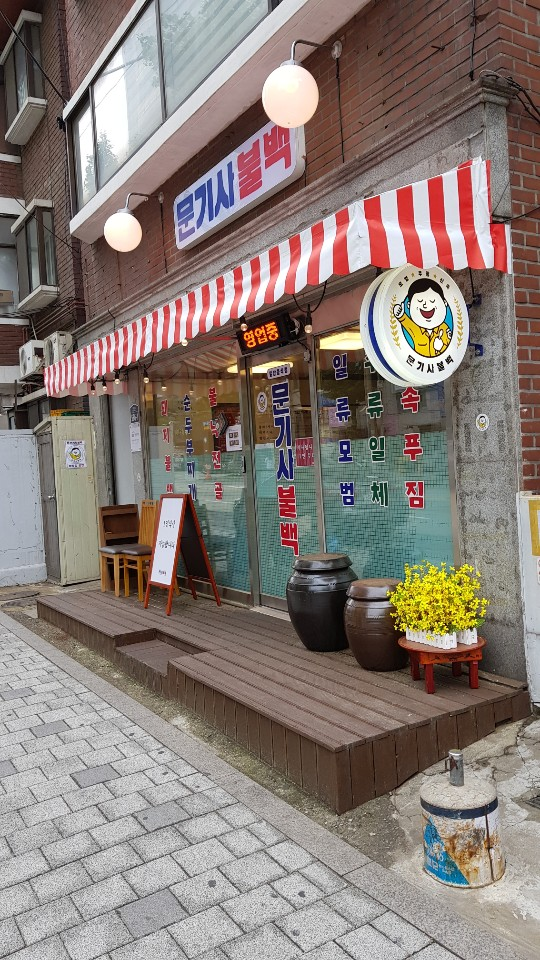
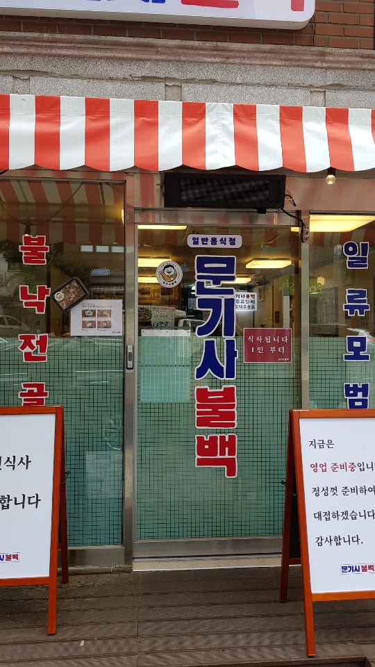

그래서 함께 동반하던 동생들도 극적으로 처음 보는 문기사불백을 시도해 보기로 마음을 굳히게 되었다. 이제는 주유소 쪽에서 횡단보도만 건너면 문기사불백이 바로 코앞이다. 설렌다.

# 식당의 느낌, 그리고 컨셉트

식당의 외관에서도 느꼈지만, 들어가자마자 느낄 수 있었던 것은 확실한 컨셉이었다. 일단 기사식당 + 포차(?) 컨셉트를 잡되 (그곳에서 일하시는 분들을 '기사'라고 칭하는 것 같았다), 기존의 기사식당의 느낌은 약간 서민적이고 약간은 지저분한? 느낌이라면 이 곳은 확실히 깔끔하고 정돈된 느낌이었다. **메뉴는 대표적으로 순두부찌개와 불백(불고기)** 가 있었다 (물론 철판낙지도 있는 것 같았는데 나는 먹지 않았음으로 그 이 메뉴는 패스하도록 하겠다. 그렇지만 주력 메뉴는 순두부찌개와 불백 두 개 같았다)

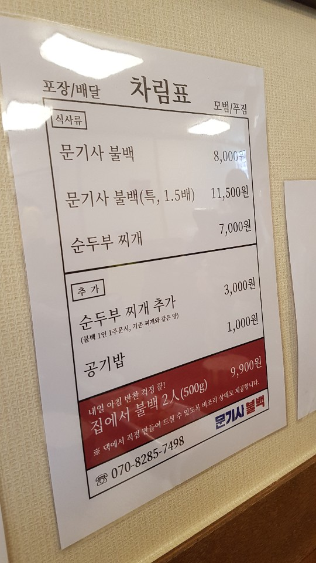

약간 백채같은 느낌이 들었다. 확실한 방향을 정하고 그 곳으로 이미 진출해버린 느낌. 백채 하면 딱 생각나는 것은 고기가 듬뿍 들어간 감칠맛 나는 김치찌개이듯이, 아직 먹지도 않았었는데 다음부터 문기사불백을 생각할 때마다 순두부 찌개랑 불백이 생각날 것만 같았다.

컨셉에 대해서 잡담을 좀 해 보자면, 요즘에는 다 컨셉으로 대박난다고 생각한다. 물론 자영업자 분들께서 정말 피땀 흘려서 노력해서 만드시는 것이지만, 불고기와 순두부찌개는 한국인이라면 좋아하지 않을 수 없는 메뉴고, 맛 없게 만들기가 매우 어렵다. 그래서 요즘엔 어떤 특정한 컨셉 ('기사' 식당, '옛날(레트로 감성)' 식당, 등등)을 잡고 식당을 운영하면 더 눈에 띠기 때문에 영업에 훨씬 이익이 될 것이라 생각한다. 그래서 카페도 이젠 한국에도 거의 포화상태인데, '공사장을 개조해서 만든 카페'라든지, '한옥 스타일의 카페'라든지, '프랑스의 문화를 잠시나마 살펴볼 수 있는 미술 작품들과 책이 있는 특별한 체험을 할 수 있는 카페'라든지, 이런 특정한 _컨셉_을 잡은 업주들이 성공할 수 있다고 생각한다.

# 가게 둘러보기

## 싸인들?

가게에 이런 싸인들이 붙어 있었다. 모두 비교적 거의 최신 사인이었다. 싸인 날짜가 거의 다 1달쯤밖에 안된 사인들이었는데, 사실 궁금증이 일기는 한다. 진짜 이 연예인 분들이 와서 사인을 한 것인지, 아니면 느낌만을 살리기 위해서 직접 종이에 적으셔서 사인을 하신 것인지 말이다 (왜냐하면 사인을 사장님이 직접 하시고 붙여놔도 문제는 없으니까 ㅎㅎ 사인을 본인이 하고 벽에 붙여놓는 행위가 연예인 분들께서 직접 오셔서 식사를 하셨다는 것을 100% 암시한다고 볼 수는 없다)

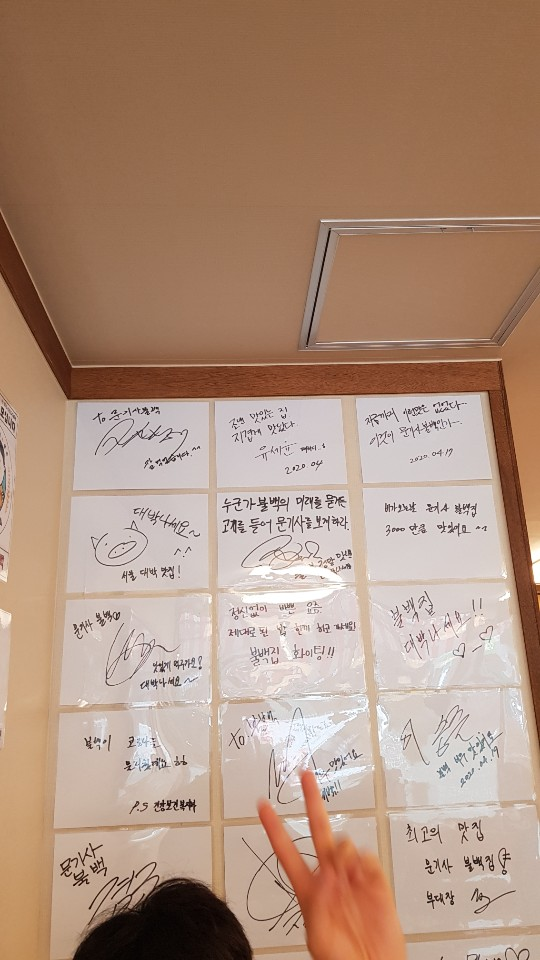

## 포장

포장 메뉴도 판다. 근데 나는 사실 이건 사진 않을 것 같다. 왜냐하면 저녁 9~10시 쯔음에 동네 시장에 가면 거의 600~700g 되는 돼지불고기를 10000원에 살 수 있다 (저번에 3~4끼니에 걸쳐서 먹었다. 양이 너무 많아서). 문기사불백의 불백 포장은 500g이라고 되어있긴 한데, 포장의 크기가 느낌상 그런 건지 왜 이렇게 작은진 모르겠다. 여튼 가격상 살 이유는 못 느끼겠다.

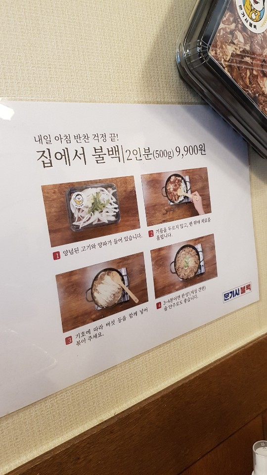

## 우산

비가 올락말락 하는 날씨였는데, 우산을 빌려주신다는 말과 함께 질 좋아보이는 우산 여러개가 꽃혀 있었다. 이미지 상승 + 감성 up + 재방문 고객 유도의 효과가 있을 것이라고 본다.

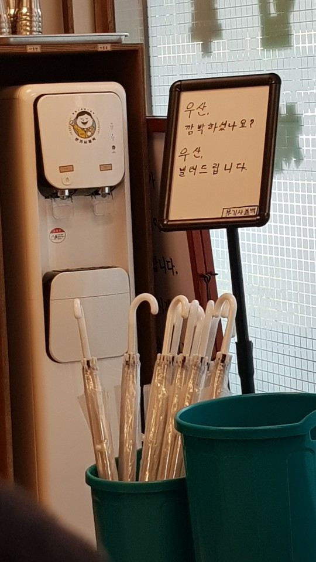

우산을 빌려주는 식당은 많진 않다. 왜냐하면 우산 가져가 버리고 그냥 안 오면 그만이기 때문에. 그렇지만 식당 측에서도 현명한 판단이라는 생각이 드는 게, 5000원짜리 우산이라고 친다면 5명이 가져갔다고 하자. 그 중 1명의 손님만 나중에 돌아와서 2만원만 썼다고 해도 그 우산 값은 이미 커버가 가능하다. 그냥 홍보 효과를 노린 것 같기도 하고. 단지 저 우산에 '문기사불백 것'이라는 표시가 더 강했으면 하는 생각이 든다. 그러면 그 우산을 보는 다른 잠재 고객들에게도 홍보가 될 것 같아서 말이다.

## 1인석

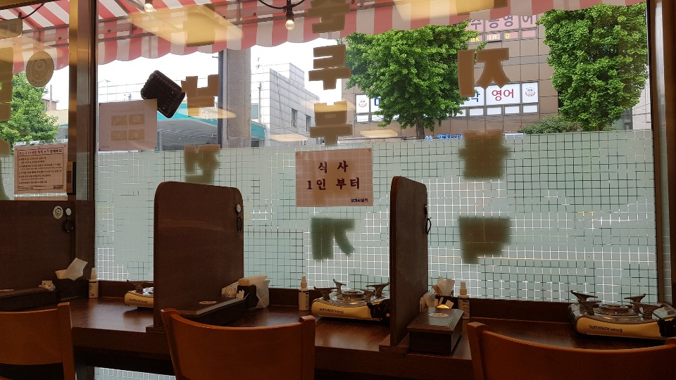

역시 낙성대에 자취생들이 많은 것을 감안한 것인지, 가게 한 켠에는 혼밥할 수 있는 구조로 테이블과 의자가 배치되어 있었다.

# 밥

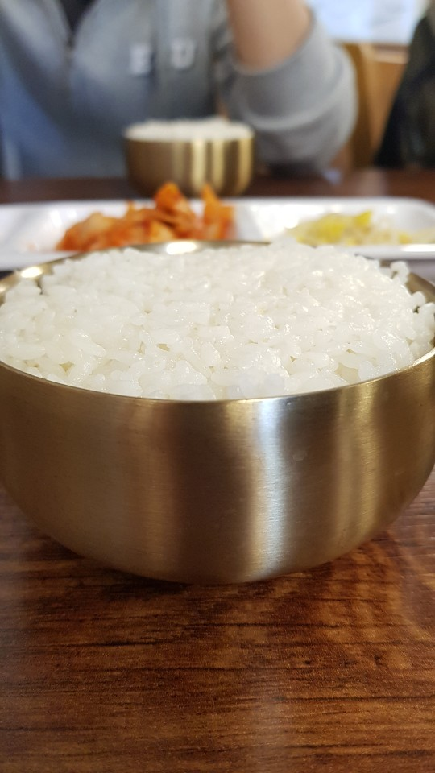

일단 다 정말 깔끔했다. 새 식당이라서 그런진 몰라도 밥그릇이나 밑반찬 그릇의 상태가 매우 양호해 보였다.

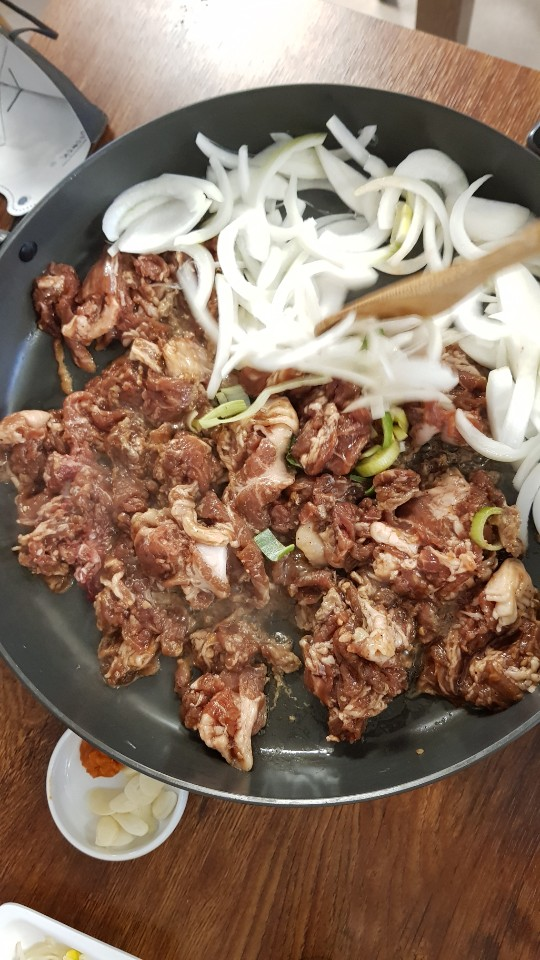
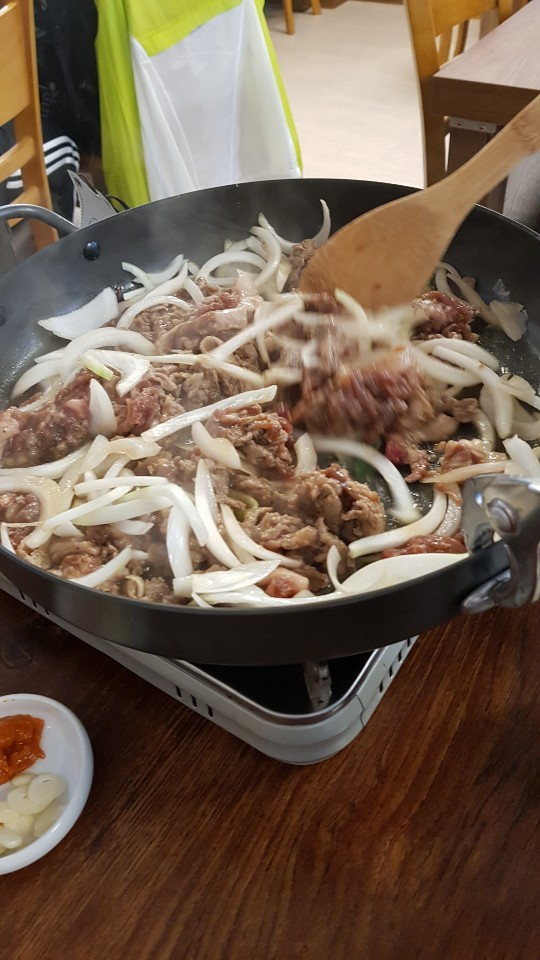

불고기는 3인분 시켰는데, 솔직히 남성 3명이서는 먹고 배부르다고 느끼기엔 좀 부족한 양이다. 그래서 순두부찌개를 옵션으로 넣어놓은 것 같다. 왜냐하면 순두부찌개가 불고기를 1인당 1인분 이상 시켰으면 한 그릇에 3000원밖에 하지 않는다. 이건 살 수 밖에 없다. 왜냐하면 고기를 먹어도 배고프고, 순두부찌개는 맛있으니까.

불고기를 굽는 팬도 널찍했다. 약간 닭갈비 집?에서 나올 것이라고 해도 믿을만한 약간은 큰 팬이 나왔다. 우리가 직접 굽는 방식이다. 맘에 든다. 나쁘지 않다.

**밑반찬**은 사실 잊어버리고 찍지 않은 것 같은데, 콩나물, 김치, [내가 기억나지 않는 하나], 마늘, 쌈장이 나온다. 맛있다. 계속 먹고 싶은 맛이다. 밑반찬이 맛있어야 입맛이 돌을 수 있다.

아 참고로, 셀프다. 문제 없다. 맛있으니까.

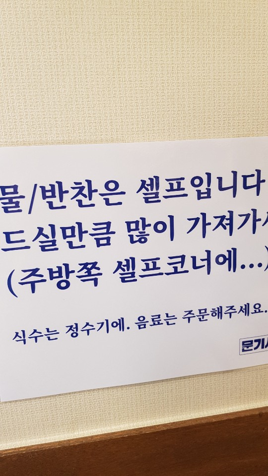

나는 '일단 순두부찌개를 같이 시키면 나중에 배부를지도 모르니까 고기를 먹는 도중에 배고플 것 같으면 따로 더 주문하자'는 전략을 취했는데, 잘한 것 같다. 왜냐하면 막상 순두부찌개를 시키면, 배부름이 서서히 밀려오고 순두부찌개의 양이 실제로 좀 많다 (왜냐하면 따로 메뉴로만으로도 팔 정도이기 때문에).

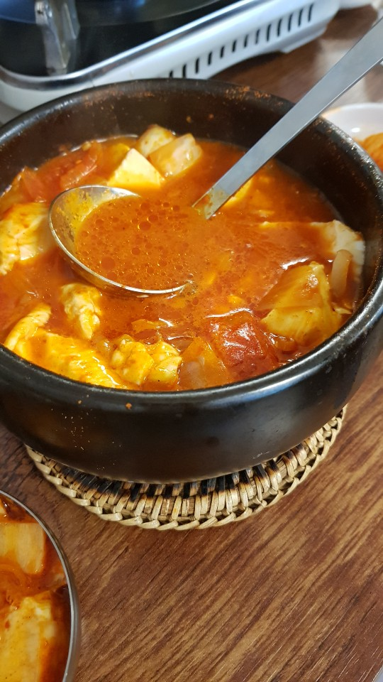

순두부찌개도 약간은 특이하다고 말할 수 있겠다. 왜냐하면:
1. 계란이 들어가지 않는다
2. 좀 맵다
3. 대신 두부가 좀 많다

참고로 순두부 찌개에 들어가는 건더기는 김치와 순두부밖에 없는 듯 했다. 근데 육수가 멸치로 우려낸 맛인 듯 한데, 매우매우 훌륭했다.

양이 너무 많아서 반절은 그냥 남기게 되었다. 그렇지만 든든하고 엄청 잘 먹었다는 느낌은 없앨래야 없을 수가 없었고, 만족감이 서서히 밀려오기 시작했다. 기분이 좋았다. 

# 결론

**일단은 무난하게 맛있다**. 맛있고, 친구들과 무난히 올 수 있는 식당이라고 생각한다. 컨셉과 주력 메뉴도 다 잡혀 있는 식당이라 가게를 관찰하는 재미나 음식의 맛은 걱정하지 않아도 된다.

한 가지 아쉬운 점은 순두부찌개에 계란 옵션을 추가하면 좋겠다. 500원 넣고 추가면 100명중 99명은 계란 추가 무조건 한다. 왜 순두부찌개에 계란을 뺐는지 이유가 궁금하다. 업주님께서 감칠맛을 저하시킨다고 판단을 하신 것일까?

# 에필로그

아, 아니나 다를까. 어쩐지... 진짜 궁금하긴 해서 네이버에 검색해보니 여러 검색 결과가 나왔는데, [엄청난 기획으로 이루어진 식당이었다](https://blog.naver.com/kyeomjo/221941889694). 칭찬해! 

그리고 심지어 _백채에서 새로 만들어 낸 브랜드인 것 같다(!?)_. 왜냐하면 네이버에서 검색하면  백채 홈페이지로 연결되는 링크를 볼 수 있다. 정작 링크 타고 들어가면 아무것도 나오지 않는데 말이다. 준비중이어서 그랬나 보다. 하여튼 연관성이 있다. 어쩐지 브랜딩을 확실하게 하더라니까.

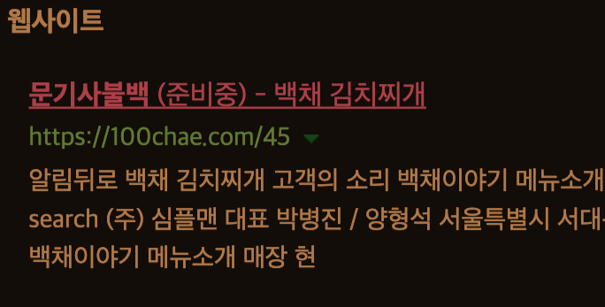

그럼 이것으로, **[개발자도 리뷰할 수 있다] 낙성대 문기사불백 리뷰**를 마치겠다. 긴 글 읽어 주셔서 감사합니다.

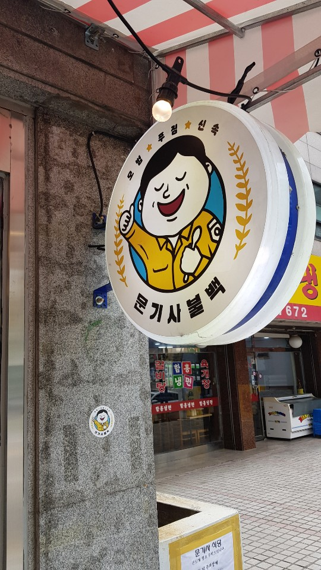 
