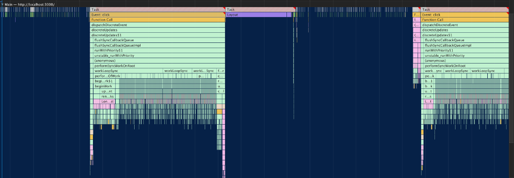
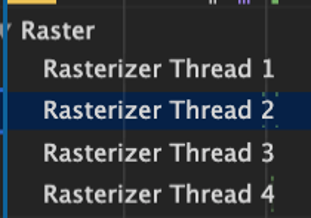
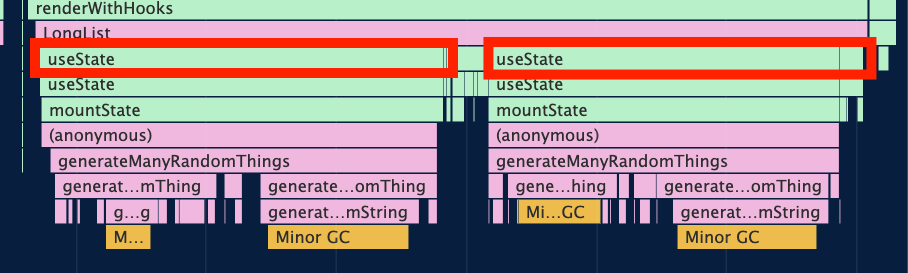

## Yes, Chrome's performance tab is overwhelming


First time you look into all the charts, you have no idea what means what. What does those different colors even mean? It's not self-explanatory at all. There needs to be a guidebook.

In this article, 
1. I will briefly walk you through all functionalities of Chrome's performance tab, with majority of the usual curiosities resolved.
2. Using what we learned, we will find what made our React components so slow and think about how to improve them.

## A very simple example with React

I wrote some short components, `<Item />` and `<LongList />`, to make an example for our article.

```js
import React, { useState } from 'react'

const itemStyle = {
  backgroundColor: 'grey',
  width: '100%',
  height: '20px',
  marginBottom: '2px',
}

const Item = ({ number }) => {
  return (
    <article style={itemStyle}>
      {number}
    </article>
  )
}

const longListStyle = {
  backgroundColor: 'green',
  marginTop: '1000px',
  padding: '5px',
}

const buttonStyle = {
  position: 'fixed',
  top: 50,
  right: 50,
  width: '100px',
  height: '100px',
}

function generateRandomString(length, chars) {
  let result = '';
  for (let i = length; i > 0; --i) result += chars[Math.floor(Math.random() * chars.length)];
  return result;
}

function generateManyRandomThings() {
  return Array.from(
    Array(4500), 
    function generateRandomThing() {
      return Math.random() > 0.5 ? 
      generateRandomString(32, '0123456789abcdefghijklmnopqrstuvwxyzABCDEFGHIJKLMNOPQRSTUVWXYZ') : 
      Math.random() * 100000
    } 
  );
} 

export const LongList = () => {
  const [clickCount, setClickCount] = useState(0);
  const [randomThings, setRandomThings] = useState(() => generateManyRandomThings());
  const handleClick = () => {
    setClickCount(clickCount + 1);
    setRandomThings(generateManyRandomThings());
  }

  return (
    <div>
      <button style={buttonStyle} onClick={handleClick}>{`reload (clickCount: ${clickCount})`}</button>
      <section style={longListStyle}>
        {randomThings.map((num, idx) => (
          <Item key={`item-${idx}`} number={num}/>
          ))}
      </section>
    </div>
  )
}
```

And it's showing me this, which is full of 4500 rows of `<Item />`s and a button to make all 4500 rows again:


The entire loading is quite slow if you slow down CPU on Chrome, like this:


This means that on lower-end PCs, it's likely that it's going to be slow like that too. Let's guess for a second. What's making this so slow? Network requests? `generateManyRandomThings` because it's producing so many elements in an array? Save your guess for now. We are going to investigate this thorougly as we are reaching the end of this guide.

You are able to see [the entire source code on Github (Chrome Performance profiles included)](https://github.com/9oelM/react-optimization) and [access the deployed website on netlify](https://chrome-react-optimization.netlify.app/). Feel free to open up performance devtools on Chrome and try on your own (the production deployment might behave differently, though)

## An overview of all major functionalities in a single slide

So here's what those colors and jargons mean. Check this image out. I wanted to have it in a single slide so that I could grasp everything at one go.


## Breaking down the overwhelming parts

I will explain each part that seems to be overwhelming or not self-explanatory, one by one.

### Reload button


Clicking on the reload button will reload the page and start profiling automatically, and profiling will stop 3 seconds after the load event. This is useful for performance monitoring for initial load.

### Disable javascript samples


Disabled (checked):


Enabled (unchecked):


Clicking on this option disables showing call stacks of Javascript functions in the recording of **Main** panel. This means you cannot see names of functions called during execution at all.

### Enable advanced paint instrumentation


After ticking this checkbox, record the performance again.

1. Click on the frame from **Frames** section; 
2. Click on **Layers** panel at the bottom. You are going to see the layers at the time of that frame and can inspect them.


1. Click on any of paint events from **Main** section
2. Click on paint profiler at the bottom. Inspect instructions and time taken to paint.


## Timeline


This is a timeline from my little React app.


**Summary** panel at the bottom of your **Performance** tab will show colors, and they directly match to the middle **CPU** region. Each same color means the same thing in the **Timeline** and **Summary** panel.


If you look at the rightmost side of your timeline, you are going to see **FPS** (topmost), **CPU** (middle), and **NET** (bottommost). 


The little red section in the pink bar means that FPS dropped so siginificantly that it may have harmed UX.

You can observe from the above picture that the FPS graph (green part) shows a drastic decrease in that pink and red region.

The part with hatched fill pattern means that the work was done off-main-thread (I do not know why Chrome does not tell us this in any direct way, although it's quite confusing for people who are new to performance monitoring).

## Timings

React records time taken for mount and update on Chrome by using [User Timing API](https://web.dev/user-timings/).


You can see `mount` and `update` timings for all components. If you click on the chart, the bottom panel on Performance tab will show you detailed information about that component and its neighbor components. We will talk about this later more.


If you want to inspect how and what functions are used in a specific components, we will have to dig **Main** panel. Hold on a sec until then.

Chrome also records important events:
  - DCL (DOMContentLoaded): HTML is fully loaded and DOM tree is constructed. Stylesheets, images, iframes, other external resources may not have been loaded.
  - L(Load): Basically, DCL + all external resources loaded.
  - [FP (First paint)](https://developer.mozilla.org/en-US/docs/Glossary/First_paint): 'the time between navigation and when the browser renders the first pixels to the screen, rendering anything that is visually different from what was on the screen prior to navigation'
  - [FCP (First Contentful Paint)](https://developer.mozilla.org/en-US/docs/Glossary/First_contentful_paint): time when some contentful thing (text, image, canvas, or SVG) is painted for the first time). The very first time user can start consuming page content.
  - [FMP (First Meaningful Paint)](https://developer.mozilla.org/en-US/docs/Glossary/first_meaningful_paint): the time it takes for a page's primary content (biggest layout change, probably the main HTML structure, and web fonts) to appear on the screen. 
  - [LCP (Largest Contentful Paint, not in the picture below)](https://web.dev/lcp/): the render time of the largest image or text block visible within the viewport.


## Experience


[Very recently, Chrome introduced 'Experience' panel](https://developers.google.com/web/updates/2020/05/devtools#cls). It reports layout shifts for now. A **layout shift** is an **unexpected movement of page content** that usually happens because resources are loaded asynchronously or DOM elements get dynamically added to the page above existing content, harming UX.

I tried this on medium.com and luckily, I got one Layout shift:


Notice that you could click on some little text buttons on the right-bottom side at about the beginning of 1600ms. But as you reach the beginning of 1800ms, these texts suddenly go away (probably to the bottom).

Chrome defines this behaviour as a source of harmful UX, especially when it comprises some crucial activities like payments or credentials.

You can inspect more information from the panel at the bottom:


## Main



So this is the interactive view of call stacks. The functions at the top are the ones that were called earlier; the ones at bottom called later. You can click around and inspect using any of **Summary**, **Bottom-Up**, **Call Tree**, and **Event Log** tabs from the bottom. These are the most important parts I wanted to know: 

- Colors: they don’t have special meaning, but charts are colored in the way that would be easy for you to see pattern of execution.
- Long tasks: the API reports any tasks that execute for longer than 50 milliseconds (ms). [Keeping every task under 50ms ensures visible, immediate response for user once some interactive action was taken by user](https://web.dev/long-tasks-devtools/#what-are-long-tasks).

  

  If you look closely enough, you will find that Chrome already colors the duration of time that should be reduced to make a long task into a 'bearable' task, with red-gray hatch pattern.

- Navigation (pro tip): move around with WASD, and arrow up and down key for your ease. It's unlikely you will use a mouse to navigate around **Main** once you get comfortable with this. 

## Raster and compositor
**Rasterizing** is converting visual information into pixels on the screen. Uses multiple threads (which are not part of the main thread).




**Compositing** is a separating parts of a page into layers (happens in a thread that’s different from rasterizing thread), and rasterize them separately (also happens in other threads).

We will cover these two in a different article because these make such a long topic themselves. For now, let us just be aware that there are these two things.


## Summary, Bottom-Up, Call Tree, and Event Log
### Summary panel


The **range** represents the duration selected in the timeline.

The legend on the right side shows: 
- Loading: time taken for loading resources
- Scripting: time taken to parse and evaluate javascript
- Rendering(Layout): time taken to computing styles and positions of elements on the page. Not sure why Chrome names it **Layout** in the **Main** panel and **Rendering** here.
- Painting: time taken to fill in the pixels
- System: effectively, can be also called as others. All activities not belonging to the categories Loading, Scripting, Rendering, Painting and GPU.

### Bottom-Up Panel


- **Self Time**: the time taken to execute code in the function itself, excluding  the time to execute other functions it calls. (in the example, `useState` and `moutState` have almost 0% self time because the long lines of the chart are suddenly ending at `generateManyRandomStrings` which is causing all the heavy works. 
- **Total Time**: the time taken to run functions (up to the end) from the current function.
- Look for high total time branches, and then find the blocks with high self time. That’s the one that might be causing some performance problems.
- In the example above, `generateManyRandomThings` accounts for 1.3% of rendering time of `LongList`, cumulatively. But its total time is 22.5%. So it should be that the functions it’s running are doing costly works (the actual works done purely inside that function only aren't really slow).


- Don’t be confused: if you open consecutive dropdowns under the first tab, you are tracing back to the initial function that was called. You are going down in the call stack. You are NOT going up.

### Call Tree


- It traces back to the root activity(or activities) that caused the function to be called.
- In the example above, the root activity of `initBackend` is `Function Call`.

### Event log


- It shows chronological order of events. 
- In the example above, `LongList` was first called at 256.7ms, and then `useState` at 290.0ms, and then `generateManyRandomThings` at 290.2ms.

## So how do I use this with React?

Good question. Let's now go back to our code. First, let us slow down our CPU again. I've set it as 4x slowdown. Now, let's try to feel the first loading speed (click on 'Start profiling and reload page' button).


Well, for sure, it took some time until you could first see anything from the browser. Now let's look at the record:


First let's find from when the browser was fully ready before it started doing something with React.


We can see that the browser spent the first 500ms destroying the previous webpage (which was actually the same `localhost:3000`), requesting over network, parsing, and compiling resources like javascript and html files. 


Right after 500ms, we see that actual functions from React library itself as well as our `./src/index.js` are being called. Let's look at it with Timings tab:


The red rectangle is the execution of `LongList` (components are functions too!), and the blue rectangle is the execution of many `Item`s.

My personal, naive guess (without knowing anything well about how React should work in this situation) on why the FCP was so late before looking into the performance log was that `generateManyRandomThings` is running very slowly, simply because I thought it's putting so many elements into an array after numerous calculations.

But after inspecting the log, we find that the culprit is not `generateManyRandomThings` (under `LongList`):
1. Even just by looking at the chart, it's evident that `generateManyRandomThings` is just a small part of the entire render process of `<LongList />`. `generateManyRandomThings` was called twice because `useState` was repeatedly called twice during render; but both were still short. Below is the duration of the first execution of `generateManyRandomThings`. As you can see, it's really just a small part (red circle) under `render`: 


2. `render` took almost 2 secs total time, while `generateManyRandomThings` took only 54.1ms total time (2.7% of `render`'s total time).


Then what's the main cause of slowness? Well, it turns out the culprit is `<Item />`, as you might have easily spotted already.


There are so many repeated processes going on for each of 4500 different `<Item />`s. How can we optimize this then? In reality, we are perhaps going to use something like a virtual list, so that you only render what's inside your current viewport only. That's going to reduce a lot. Because making a virtual list is not the main topic here, let's just pretend we made it by reducing items down to 100 items, and see how our React app does again. For the sake of proof of performance, let's still make 4500 elements in the array and only render 100 `<Item />`s, like this:

```js
function generateManyRandomThings() {
  return Array.from(
    Array(4500), 
    function generateRandomThing() {
      return Math.random() > 0.5 ? 
      generateRandomString(32, '0123456789abcdefghijklmnopqrstuvwxyzABCDEFGHIJKLMNOPQRSTUVWXYZ') : 
      Math.random() * 100000
    } 
  );
} 

export const LongList = () => {
  const [clickCount, setClickCount] = useState(0);
  const [randomThings, setRandomThings] = useState(() => generateManyRandomThings());
  const handleClick = () => {
    setClickCount(clickCount + 1);
    setRandomThings(generateManyRandomThings());
  }

  let randomThingsNodes = [];

  for (let i = 0; i < 100; i++) {
    randomThingsNodes.push(<Item key={`item-${i}`} number={randomThings[i]}/>);
  }

  return (
    <div>
      <button style={buttonStyle} onClick={handleClick}>{`reload (clickCount: ${clickCount})`}</button>
      <section style={longListStyle}>
        {randomThingsNodes}
      </section>
    </div>
  )
}
```

And the result...? Without even inspecting deeply, we can already feel that the initial load (the instant when the rows changed) time was greatly improved.


ah, now we can see that the self-time of `LongList` finally became somewhat similar to total of execution of all `Item`s.


Although it might sound very simple that mounting 4500 components is slower than putting strings and numbers into an array, it's always worth trying out auditing performance using Chrome's Performance tab, because until you inspect the real performance with logs and stats, you are essentially just guessing which part is supposed to be the slowest. In complex React apps, there's only a low chance it's going to work well that way.

## Last question

But why is `useState` being called twice anyways in a single mount, like this?:



Well, it was not related to something we did! [Dan Abramov says it always happens when you use `<React.StrictMode>`](https://github.com/facebook/react/issues/15074). So there's nothing wrong with it. If we change

```js
import React from 'react';
import ReactDOM from 'react-dom';
import './index.css';
import App from './App';
import * as serviceWorker from './serviceWorker';

ReactDOM.render(
  <React.StrictMode>
    <App />
  </React.StrictMode>,
  document.getElementById('root')
);

// If you want your app to work offline and load faster, you can change
// unregister() to register() below. Note this comes with some pitfalls.
// Learn more about service workers: https://bit.ly/CRA-PWA
serviceWorker.unregister();

```

to

```js
import React from 'react';
import ReactDOM from 'react-dom';
import './index.css';
import App from './App';
import * as serviceWorker from './serviceWorker';

ReactDOM.render(
  <App />,
  document.getElementById('root')
);

// If you want your app to work offline and load faster, you can change
// unregister() to register() below. Note this comes with some pitfalls.
// Learn more about service workers: https://bit.ly/CRA-PWA
serviceWorker.unregister();
```

It's going to show you only a single execution of `useState`, like this:


## Closing notes

So.. that's it! We comprehensively covered most basic concepts. In near future, I will also cover GPU, Interactions, and some few parts I saved for another chance. We will also further look into how to optimize complex React + Redux applications with Chrome's Performance panel later.

Thank you for reading!

## More resources
- [Profiling React Performance with React 16 and Chrome DevTools.](https://calibreapp.com/blog/react-performance-profiling-optimization)
- [Painting](https://developers.google.com/web/updates/2015/03/devtools-timeline-now-providing-the-full-story)
- [FMP: First Meaningful Paint](https://scotch.io/courses/10-web-performance-audit-tips-for-your-next-billion-users-in-2018/fmp-first-meaningful-paint#:~:text=Coined%20by%20Google%2C%20First%20Meaningful,to%20appear%20on%20the%20screen.&text=First%20Contentful%20Paint%20is%20the,painted%20for%20the%20first%20time.)
- [Layout shift](https://web.dev/cls/)
- [Raster and composite in different threads](https://developers.google.com/web/updates/2018/09/inside-browser-part3#raster_and_composite_off_of_the_main_thread)
- [How Content collator (or... Chromium Compositor) works](https://chromium.googlesource.com/chromium/src.git/+/master/docs/how_cc_works.md)
- [Compositing](https://developers.google.com/web/updates/2018/09/inside-browser-part3#compositing)
- [Rendering performance overview](https://developers.google.com/web/fundamentals/performance/rendering/)
- [Self time vs Total time](https://bambielli.com/til/2016-02-24-self-time-total-time/)