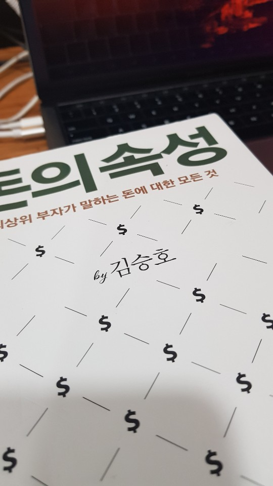

오랜만에 반디앤루니스에 가서 읽을 만한 책을 고르다가 베스트셀러를 차지하고 있는 *돈의 속성*을 사 봤다. 매번 그래왔듯이, 20~30분 내에 읽을 수 있을 만한 정도로 요약하고 내 삶에서 무엇을 적용할 수 있는지 적어보겠다.

# 프롤로그
- 이 책의 가치: 돈을 진짜 많이 벌어본 사람이 쓰고 알려주는 책이다.
- 돈을 적게도 벌어보고 많이도 벌어보신 분이셔서 돈의 여러 모습을 경험해 보셨음. 

## 돈은 인격체다
- 사람처럼 사고, 감정, 의지를 가짐. 기본적으로 사람과 동일하게 행동한다고 생각하면 편함. 나쁜 의도로 대하는 돈은 나가기 마련이고, 좋은 의도로 대하는 돈은 다시 들어오기 마련임. (14-16)

## 나는 나보다 더 훌륭한 경영자에게 투자한다
- 아무것도 모르고 주식 투자 해봤자 아무것도 못 얻는다. (17)
- 나보다 더 훌륭한 경영자가 나보다 더 좋은 회사를 운영하는데 내가 투자를 망설일 이유가 없다. 결국 나보다 훌륭한 경영자에게 투자하는 일은 그들과 동업하는 것과 다름없다. (18)

## 복리의 비밀
- 복리의 숨겨진 힘은 대단하다. 조그만한 차이가 시간이 지나면 큰 차이를 불러옴. (20-21)
- 복리 효과가 부를 어떻게 변화시키는지 이해하려면, 복리와 진지하게 친해지고 함꼐 어울려야 한다 (22)

## 일정하게 들어오는 돈의 힘
- 매달 일정하게 400만원 버는 사람 vs 어느 땐 1000만원 벌고, 어느 땐 하나도 벌지 못하는 사람: 400만원 버는 사람의 돈의 가치와 힘이 더 크다. (24)
- 현금흐름이 일정하게 유지돼야 경제적으로 삶이 윤택해진다 (25)
- 비정규적인 수입은 한 번에 몰려온 돈이라 실제 가치보다 커 보이는 착각을 일으킨다. (25)
- 비정규적 수입의 노동자는 자산을 정규적 수입 자산으로 옮기는 작업을 시작해야 함 (26)

## 돈은 중력의 힘을 가졌다
- 돈의 액수가 크면 더 많고, 더 멀리 있는 돈을 잡아당긴다. (27)
- 10억을 모으려면 1억이 필요. 1억을 모으려면 1000만원이 필요. 처음 1000만원을 벌기 위한 노력은 다음 1000만원을 모으기 위한 노력보다 적을 수 있다. 이미 가지고 있는 1000만원이 이자나 투자로 자체 자본을 만들어 주고 있기 때문 (29)
- 처음 1000만원을 모으기 위해 100을 노력했다면 1억원이 되는 마지막 1000만원은 불과 20 혹은 30정도의 힘으로 만들어진다. ... 그 1억원은 동일한 과정을 통해 몇 년 후엔 몇 억이, 더 지나면 100억 원이 되는 것 ... 1, 2, 4, 8, 16과 같이 배수로 늘어난다. (29)

## 리스크가 클 때가 리스크가 가장 작을 때다
- 사실 리스크가 크다고 알려진 것 자체가 리스크를 줄여놓은 상태라는 걸 알아차리는 사람이 별로 없다. ... "남들이 욕심을 낼 때 두려워하고, 남들이 두려워할 때 욕심을 내야 한다." (32)
- 리스크의 특성 중 하나는 과거 사례가 미래에 영향을 주지 않는다는 점이다. ... '평균 10년에 한 번', '평균 30% 하락' 과 같은 용어는 리스크를 이해하는 데 가장 방해가 되는 데이터. (33)

## 남의 돈을 대하는 태도가 내 돈을 대하는 태도다
- 세금 잘 내자 (35)
- 내 돈이 존중받으려면 남의 돈도 존중해줘야 한다 (36)

## 100억을 상속받았는데 절대 잃지 말라는 유언이 붙었다면
- 100억 원은 거금이지만 일정한 소득을 손실 없이 만들려고 하면 생각보다 적은 돈이다. 반대로 말하면 나에게 276만원의 정기적인 수입이 있다면 100억원을 가진 자산가나 별반 다를 것이 없다는 것. (39)
- 정기적, 고정적 수입은 보통 그 액수의 100배 규모의 자산의 힘과 같음 (39)
- 돈을 버는 것만큼 지키기도 힘듦. (40)
- 검소하고 단정한 삶을 살아야 함 (40)

## 빨리 부자가 되려면, 빨리 부자가 되려 하면 안 된다
- 빨리 부자가 되려는 욕심이 생기면 올바른 판단을 할 수가 없다. ... 쉽게 현혹되어 마음이 급해 리스크를 살피지 않고 감정에 따라 투자를 하게 된다 (41)
- 빨리 부자가 되려는 마음을 버리고 종잣돈을 마련해 복리와 투자를 배우고 경제 용어를 배워 금융문맹에서 벗어나야 한다. (42)
- 자산을 점점 키워서, **그 자본 이익이 노동에서 버는 돈보다 많아지는 날**이 바로 당신이 부자가 된 날이고 경제적 독립기념일이다. (42)

## 경제 전문가는 경기를 정말 예측할 수 있나?
- 없다. 그랬으면 다 부자가 되고도 남았겠지 (44)
- '모릅니다'가 정답인 이유는, 미래는 과거 데이터의 틀 안에서 만들어지는 것이 아니라 새로운 미래가 데이터에 합류될 뿐이기 때문이다. 그렇기에 규칙이 없으며 예상외의 일이 매번 일어나는 것이다. (45)
- 알 수 없다는 것을 알 때, 우리는 개별 투자 자산이나 회사에 대해 깊이 공부하고 정보를 모을 수 있다 (46)

## 삼성전자 주식을 삼성증권에 가서 사는 사람
- 만약 주식 투자를 하려고 마음먹었다면 마치 회사를 경영하듯, 대학 학부 과정을 다니듯, 4년은 공부하기 바란다. 배울 만한 사람들: 워런 버핏, 벤저민 그레이엄, 하워드 막스, 앙드레 코스톨라니 등 (48)
- 투자 철학이 중요하지, '왕년'과 '이론'은 중요하지 않음. (49)
- 증권사 직원들도 믿지 마라. 잘 했으면 벌써 부자 됐겠지. (49)

## 다른 이를 부르는 호칭에 따라 내게 오는 운이 바뀐다
- 성공한 사람은 자신을 되돌아보야 하고 성공하여 풍요롭고 안정적인 삶을 유지하고 싶은 사람은 절대로 이런 경박함을 배우면 안 된다. ... 존중하고 ... 다정하고 ... 한결같아야 한다 (53)

## 반복되는 운은 실력이고 반복되는 실패는 습관이다
- 어렵게 준비해 가게 차리고, 길을 걷다 발목을 다치고 사기를 당하거나 자동차 접촉 사고를 당함: 급한 욕심에 확인도 안 하고 매장을 염. 사업이 안 되는 상황을 고민하며 급하게 길을 걷다가 구멍 난 보도블럭에 발을 다침. 어수선하고 부주의하게 행동하여 자동차 사고로 이어짐. 재수가 없는 게 아니라 재수가 없는 환경에 자신을 계속 노출시킴. 평소의 모든 삶을 점검해야 함. (54)
- 돈, 인간관계, 식사 습관, 말투 등 자기반성을 해보자 (54-55)
- 운이 좋은 사람은 사실은 그렇게 보이는 것이지, 그냥 실력이다. (55-56)

## 뉴스를 통해 사실과 투자 정보를 구분하는 법
- 사실 아무도 미래를 알 수 없다. 나는 사실만을 믿기로 마음먹었다. (59)
- 가장 호황을 누리는 때가 리스크가 가장 큰 때다. 공포와 투매가 존재하는 시점이 리스크가 가장 작다. 주식은 시간이 지나면 회복한다. (60)

## 돈마다 시간은 다르게 흐른다
- 돈도 특수상대성원리를 그대로 적용할 수 있다. (61)
- 월급 받는 날은 더디게 오지만, 빚 갚는 날은 순식간이다. (62)
- 좋은 주인을 만난 돈은 점점 더 여유 있고 풍요로워진다. 시간이 많은 돈이 만들어낸 돈은 모두 ... 많은 돈을 낳는다. (63)

## 달걀을 한 바구니에 담지 않았는데 왜 모두 깨질까?
- 분산투자 하라는 말. (64-65)
- 잘못된 분산투자: 한 시장 안에서 예금, 적금, 부동산, 주식, 채권, 현물 등에 투자하는 것 (65)
- 주식을 특성에 따라 10개쯤의 종목으로 분류시키고, 채권, 예금, 부동산 등으로 나눠나야 한다. (66)

## 부자가 되는 세 가지 방법
1. 상속: 부모가 부자가 아니라면 어려움
2. 복권: 확률이 사업 성공보다 낮음
3. 사업: a. 직접 창업 b. 남의 성공에 올라타기. 즉 주식. 

- 주식을 사서 오르면 팔 생각을 버려야 한다. 주식은 파는 것이 아니라 살 뿐이라는 생각을 가져야 한다. (68)
- 사주의 마음을 갖고 회사를 공부하고 살펴야 함. 연간보고서, 사업보고서, 재무제표 등. (69)
- 기업가 마음을 가지면 업계 전체를 바라보는 눈이 생기고 산업을 이해하게 되고 국가 경제 및 국가 간의 이해 충돌 및 금융시장 전체에도 관심을 갖게 된다. (70)

## 돈을 모으지 못하는 이유
- 음식과 주거를 해결할 수 있을 정도면 누구든 저축을 하고 재산을 모아 투자도 해서 부자가 될 수 있다. (72)
- 신용카드 쓰지 마라.
- 물질을 부주의하게 다루지 말라.
- 작은 돈을 소중히 여기라.

## 자신이 금융 문맹인지 알아보는 법
- 돈에 대해서 알지도 못하면서 부자가 되려고 하는 건 애초에 말이 안 된다 (76-78)
- 금융 용어를 온 국민이 이해하면 어떤 정치가도 국민을 함부로 하지 못하며 부도덕한 사업가가 설 자리는 점점 줄어들 것이다 (80-81)

## 주식으로 수익을 내는 사람들의 세 가지 특징
손실을 보는 사람들의 특징 (83-84):
1. 그냥 따라 들어왔다.
2. 무엇을 살지 계획이 없다.
3. 돈의 힘이 약하다.

수익을 내는 사람들의 특징 (85-86):
1. 자신을 경영자로 생각한다.
2. 보유하고 있는 돈이 품질이 좋은 돈이다 (당장 꺼내지 않아도 되는 돈이다)
3. 싸게 살 때까지 기다린다.

왜 사람들은 주식시장을 합법적 도박장 정도로 생각하거나 제로섬게임장으로 여길까? (86)

## 얼마나 벌어야 정말 부자인가?
일반적인 부자의 기준 (88):
1. 융자가 없는 본인 소유의 집
2. 한국 가구 월평균 소득 541만원을 넘는 비근로 소득
3. 더 이상 돈을 벌지 않아도 되는 욕망 억제능력 소유자. 다른 부자와 비교해봤자 끝도 없이 비교할 수 있어서 의미가 없음. 

결국 더 이상 일하지 않아도 되는 상황을 만들어내는 것이 부자가 되는 첫걸음 (89)

## 내가 재산을 지키기 위해 매일 하는 일
1. 이메일 확인
2. 신문 읽기 (91-92):
- New York Times
- Washington Post
- Wall Street Journal
- CCN
- Fox News
- Financial Times
- The Times
- Reuters
- Ein World News Report
- 아사히신문
- 요미우리
- 일본경제신문
- Yahoo Japan
- Global Times
- 인민일보
- 르몽드
- 르피가로
- 슈피켈
- 디벨트
- 프랑크푸르트 알게 마이너
- 현재 살고 있는 지역의 로컬 신문

신문을 볼 때 여러 시각에서 볼 수 있어야 함. 편향성 버리자. (92)

3. 경제 사이트 읽기 (92-93):
- Yahoo Finance
- CNBC
- Bloomberg
- Marker Screener (CNN Business, Fear & Greed Index)
- 미국 달러 인덱스 차트
- 런던 브렌트 오일 가격
- investing.com
- dividend.com
- finviz.com
- 미연방준비제도 이사회
- markerbeat.com (재무제표)
- whalewisdom.com (기관 투자자의 동향)
- tipranks.com
- seekingalpha.com
- oaktreecapital.com
- barrons.com
- 한경컨센서스
- 팍스넷
- 네이버금융

4. 나머지 기타 사이트 (93)
- loopnet.com
- amazon, netflix, 기타 SNS

- 이 곳들에서 얻는 정보로 사업 방향이나 투자 결정
- 더 궁금하거나 관련 도서를 찾으면 바로 주문, 읽고 정리.
- 무조건 자료화. 보유주식 정보, 부동산 매물정보, 연간보고사, 일반주식 정보 등
- 유튜브로 관록 있는 전문가의 의견에 귀를 기울임

## 가난은 생각보다 훨씬 더 잔인하다
1. 사람들이 돈보다는 자유를 원한다고 말하지만, 자유를 얻으려면 막대한 돈이 필요함. (95)
2. 가난은 인간의 존엄을 지키지 못하게 함 (96)
3. 가족의 근간을 해체시킬 수 있음 (96)

부자를 경멸할 수는 있어도 부를 경멸해서는 안 된다.

## 금융 공황 발생에 따른 세 가지 인간상
상승장, 오버슈팅, 폭락장, 언더슈팅, 베어마켓 등 시간이 지날수록 시장은 변화를 겪기 마련임. 세 가지 부류의 인간:
1. 피해를 고스란히 당하는 사람들 (98-99)
2. 폭락에 전혀 영향을 받지 않음. 빚도 없고 직업도 안정적인 사람들 (99)
3. 이익을 보는 자산가들. 폭락은 기회라는 것을 잘 알고, 산업과 경제에 대한 근본 가치를 믿음 (99-100)

## 내가 청년으로 다시 돌아가 부자가 되려 한다면
- 저축을 통해 부자가 되는 건 더 이상 불가능 (101)
- 나는 은행에 저축을 해서 ... 않을 것이다. 차라리 매달 급여에서 50만원 정도의 돈을 뺴서 한국에서 제일 큰 회사의 주식을 사겠다. 가격이 오르내리는 것은 상관없다. 매달 같은 날 50만원씩 주식을 사 모을 것이다. (103)
- 하루라도 빨리 시작하면 된다. 공식에서 가장 중요한 변수가 투자 기간이기 때문이다. (103)

## 지혜는 기초학문으로부터 시작된다
- 성공한 사람들은 비슷한 철학적 관점을 지니게 됨 (104-105)
- 기초학무니 무엇이든 깊게 배우면 전반적인 지혜를 갖추는 것에 어쨌든 도움이 됨 (105-106)

## 부자가 되기 위해 우선 당장 할 수 있는 일 한 가지
필요없는 (설레지 않는) 물건과 작별 (107-109)

## 앞으로 주식이 오를 것 같습니까?
- 모른다. (110)
- 10년 후를 생각하면서 투자하자. (111)
- 폭락했을 때 주식의 본질적 가치를 계산하라 (111)
- 빠른 시간 내에 수입을 만들려고 하지 마라 (111)
- 내가 사고 싶은 것이 아닌 남이 사는 것을 따라 사지 마라 (111)

## 현재 임차료를 내는 사람들의 숨은 가치
- 임차료를 건물주에게 내고 있는 사람이라면 해당 건물을 소유할 능력을 최고로 많이 가진 사람임 (113)
- 매장, 공장, 사무실 등을 임차료를 지불하면서 사용하며 수입을 얻는 사업자는 1. 사업 자체가 얻는 수입 2. 고객이 왕래하면서 생긴 트래픽에서 발생한 부동산 가치를 얻음. (113)
- 만약 2번에서 발생한 가치가 더 큰데 임대 중이라면 그 가치가 고스란히 건물주에게 돌아감 (114)
- 그러니 2번의 가치가 더 크다면 건물주가 되어보는 것도 나쁘지 않음 (115)

## 부동산에 투자하는 것이 좋을까? 주식이 좋을까?
- 어차피 물어봤자 알지도 모르고 물어보는 것이라, 물어보는 것의 의미가 없다. (119-120)
- 투자자의 분류는 투자 시장의 구분(부동산, 주식)이 아닌 투자 스타일에 따라 나누어야 함 (117)
- 배당은 월세를 받는 것과 같음. 주가 변동에 덜 민감. 고로 부동산 임대와 비슷함 (118)

주식 투자자들의 두 부류 (118-119): 
1. investor: 회사의 내재가치를 찾아내고 저평가된 회사의 주식을 구매, 기다림 
2. trader: 군중의 투자 심리에 따른 기술적 반등과 저항을 따라 매매

## 나의 독립기념일은 언제인가?
- 자본 소득이 근로 소득을 넘긴 날임 (121)
- 독립하려면 나의 노동이 아닌 다른 곳에서 수입이 나오게 만들어야 함 (122)
- 독립하지 않았다면 모든 소득은 자산을 만드는 데 사용해야 함 (122)

## 돈을 다루는 네 가지 능력
1. 버는 능력: 진취적, 낙천적, 성실, 포기하지 않음 (124)
2. 모으는 능력: 지출 관리 능력. 세율, 이자, 투자, 환율 등 금융 관련 지식 필요. 재정분리, 소홀함이 없음. 돈을 대하는 태도가 좋음. (125) 
3. 유지하는 능력: 사치, 허영, 집, 차, 음식, 치구, 명품 등을 멀리함. 허물어지는 것은 한순간이라는 사실을 알음 (126)
4. 쓰는 능력: 검소하되 인색하지 않음. 정직하게 지출해야 할 것은 지출하고, 위세나 허영으로 밥값이나 내지 마라. (127-128)

## 이런 곳에 나는 투자 안 한다
- 생명이 사라지거나 누군가에게 불행이 일어나야 돈을 버는 영역: 무기, 담배, 술, 마약, 제약회사, 전당포 등 (129)

## 보험은 저축이 아니다
- 보험은 리스크를 기반으로 한 확률게임이다. (131)
- 보험을 드는 사람은 최악을 걱절해서 보험을 들지만 그 돈을 20여 년 전부터 모아왔다면 확률상 자가 보험이 더 낫다. 왜냐하면 보험사는 어떤 상품을 팔아도 이미 내게 불리하게 설계를 끝내놓기 때문이다. (135)

## 예쁜 쓰레기
- 정말 필요한 것만 소유하라. 사실상 정말 소중한 건 경험과 추억이다. (137-139)

## 경제에 대한 해석은 자신의 정치적 신념에서 벗어나 있어야 한다
- 쉽게 왜곡될 수 있는 정보는 여러 측면에서 해석해 보아야 함 (140-142)

## 마중물과 종잣돈 1억 만들기의 다섯 가지 규칙
마중물처럼, 큰 돈을 만들기 위해서는 종잣돈이 필요 (144)

종잣돈 1억 만들기의 다섯가지 규칙 (145): 
1. 1억 원을 모으겠다고 마음먹는다.
2. 1억 원을 모으겠다고 책상 앞에 써 붙인다.
3. 신용카드를 잘라 버린다.
4. 통장을 용도에 따라 몇 개로 나누어 만든다: a. 월세, 전화비, 교통비 등 b. 밥값, 커피값, 여유 자금 등 ..
5. 1000만 원을 먼저 만든다: 두 번째 1000만 원은 첫 1000만 원보다 만들기 쉬워진다.

> 이런 이야기를 강연에서 하면 이런 질문을 ... "너무 돈만 강조하시는 거 아닙니까? 삶에서 돈이 중요한 건 알겠지만 ... 돈의 노예가 되는 것 아닌가요?". 나는 돈의 중요성과 부자의 길을 이야기할 뿐인데 저축과 투자 혹은 절약에 대해 건드리면 불편해하는 사람들이 있다. ... 돈에 대해 이야기하는 것조차 경멸하면 부자가 될 첫 문을 닫는 것이고 돈을 그렇게 함부로 생각하는 것 자체가 **이미 돈의 노예가 된 상태**다. (148)

## 좋은 부채, 나쁜 부채

- 김승호 회장님은 예전의 좋지 않은 기억 때문에 의도적으로 부채를 아예 만들지 않았음. 좋은 방법은 아님.
부채를 좋은 부채로 만드는 방법:
1. 소비에 사용하면 안 됨. 추가 이익이나 자본 확장이 일어날 곳에 사용 (152)
2. 나에게 일정한 수입이 있고 이후 추가 이익이 발생하게 만들어 놓아야 함 (152)
3. ROE (Return on Equity) 가 부채에서 발생하는 이자보다 높아야 함. (153)

## 세상의 권위에 항상 의심을 품어라

- 전문가들을 믿지 마라. (155)
- 나 스스로를 믿고, 나 스스로를 판단의 근거로 만들어라. 믿을 건 나밖에 없다. (156-157)

## 좋은 돈이 찾아오게 하는 일곱 가지 방법 (158-159)
1. 품위 없는 모든 버릇을 버려라
2. 도움 구하는 데 망설이지 마라
3. 희생을 할 각오
4. 기록, 정리.
5. 장기 목표
6. 모두에게 사랑받을 생각 버려라
7. 시간이 많다고 생각하지 마라

## 직장인들이 부자가 되는 두 가지 방법
1. 임원이 된다. 임원은 어떻게 되냐? 그냥 상식적으로 열심히 하면 된다. (160-163)
2. 투자. 급여의 20% 이상을 계속 모아서 종잣돈을 만들고 투자. (163-164)

## 감독(자산배분)이 중요한가, 선수(포지션)가 중요한가?

선수보다 감독이 훨씬 더 중요함. (~167)

> 투자 상품에 갖는 관심의 아홉 배를 자산배분에 쏟기 바란다. (168)

## 은행에서 흥정을 한다고요?

- 선택을 요구받거나 선택을 해야 되는 상황이 오면 답안지 안에서만 선택할 수 있다고 생각하지 마라. (170)
- 환율, 수수료, 이자 등을 흥정해보라. 매니저의 재량일 때도 있음. (170)

## 떨어지는 칼을 잡을 수 있는 사람

- 본인이 주식을 잘 한다고 사기를 치는 사람은 어떻게 해도 사기는 칠 수 있다. 아무도 믿지 마라. (172-173)
- 주식이 폭락할 때 분할매수, 회사의 본질 가치에 대한 확신을 가지고 있어야 하락장에서 매수할 수 있다. (172)

## 재무제표에 능통한 회계사는 투자를 정말 잘할까? 

- 그럴거면 다 회계사 했다. (~178)
- 그냥 재무제표를 본인이 그 회사를 운영한다고 생각하고 회계 장부를 들여다보면 장부를 해석할 수 있고, 주주로써 성공할 수 있다. (179)

## 김승호의 투자 원칙과 기준

1. 빨리 돈을 버는 모든 일을 멀리한다: 빠르게 번 돈은 질이 좋지 않음.
2. 생명에 해를 입히는 모든 일에 투자하지 않음: 별로 인간적이지 않음.
3. 투자를 하지 않는 일을 하지 않음: 투자를 하지 않는 건 가장 나쁜 투자.
4. 시간으로 돈을 벌고 돈을 벌어 시간을 산다: 자본이 생길수록 투자 대상의 정보의 양과 질이 달라짐. 한마디로 Positive feedback.
5. 쫓아가지 않는다: 어느 호재나 불황이나 상대적인 가격이 있든, 내가 계산한 내 가격대로 판다. '아님 말고'.
6. 위험에 투자하고 가치를 따라가고 탐욕에서 나온다: 
7. 주식은 5년, 부동산은 10년: 시장이 아무리 좋지 않아도 5년이면 정부도 산업도 바뀌니 회전함. 부동산은 한 번 사면 파는 것이 아님. 
8. 1등 아니면 2등, 하지만 3등은 버린다: 1등이 되면 가격결정권을 가짐. 펩시보단 코카콜라. 마스터카드보단 비자.

## 자식을 부자로 만드는 방법

- 기업가 정신을 물려줘라 (185).
- 자식 명의로 증권 통장 개설.

> 왜 한국 청년들은 미국 나스닥 상장을 꿈꾸지 않고 건물주가 꿈일까? 부모의 잘못이다. (188)

> 번번히 실패해도 한 번만 성공하면 된다. (188)

## 만약 삼성전자 주식을 아직도 가지고 있었다면

- 어차피 팔지 않은 사람은 삼성전자 일가 뺴고 없을 것이다.
- 거래에 능하지 않으면 거래를 안 하면 된다. (190)
- 흥정도 그냥 가격이 마음에 안 들면 깎지 않고 살 것이고, 마음에 안 들면 그냥 나갈 것 (191)
- 오랫동안 팔지 않아도 하는 회사가 주식하기 좋은 회사 (191)

## 국제적 수준의 행동 에티켓과 세계화 과정

- 제발 상식적으로 행동하라. (192-194)

## 당신의 출구 전략은 무엇인가?

3가지가 존재.
1. 매각: 몇 년 안에 존속 가능성이 없어지거나 경쟁자가 늘어날 것 같다고 판단
2. IPO나 M&A. 앞으로도 성장 가능성이 높고, 수입이 유지될 수 있다고 판단
3. 출구전략이 없는 전략. 강력한 브랜드 파워을 소유하고 있거나 이미 시장을 장악하고 있음.

## 모든 비즈니스는 결국 부동산과 금융을 만난다

현대식 생산의 3대 요소: 부동산, 사업체, 금융.

## 똑똑한 사람들이 오히려 음모에 빠진다.

- 주장에 맞는 근거만 찾지 마라
- 나를 제일 믿어라.
- 상식적으로 생각해라. 주식도 마찬가지다. "합리적인 생각을 가진 사람이라면 그 소문이 나에게까지?라고 생각해야 한다" (206)

## 사기를 당하지 않는 방법

- 사람에 대한 당연한 믿음이 존재해서는 안 된다. 상식적으로 생각해야 한다. (209-211)
- 좋은 투자를 거절하는 건 두 가지 이유: 1. 이익이 너무 많고 2. 사업 모델을 내가 이해하지 못함. 내가 이해하지 못하면, 사고가 생겨도 사업을 제어할 수 없고, 예상이익이 많다는 것은 리스크도 크다는 뜻. (210)

## 투자의 승자 자격을 갖췄는지 알 수 있는 열한 가지 질문 (~215)
1. 투자와 트레이딩을 구분할 수 없는가?
2. 매수와 매도에 기준이 없는가?
3. 있어 보이고 싶은가?
4. 5년간 안 써도 될 돈을 마련하지 못했는가?
5. 수입이 일정하지 않은가?
6. 승부욕이 강한가?
7. 부자가 되면 대중과 함께 살 마음이 없는가?
8. 빨리 돈을 벌어야 하는가?
9. 복리를 잘 모르는가?
10. 이번 달 신용카드 결제대금을 다 갚지 못해 이월시켰는가?
11. 귀가 얇은 편인가?

예가 다섯 개 이상이면 절대 투자 하면 안 됨.

## 두량 족난 복팔분 (~217)

80% 정도에서 그만둬라.

옳은 매도도 80%다. 과한 욕심은 해를 부른다. 투자는 100%를 지나면 0%가 될 수 있기에 결국 80%면 가장 높은 점수다.

## 부의 속성

> 열심히 산다고 돈을 많이 버는 것이 아니다. 돈을 많이 번다고 부자가 되지도 못한다. 부자가 된다고 행복해지는 것도 아니다. 부는 삶의 목적이 아니라 도구다. (218~220)

## 흑수저가 금수저를 이기는 법

생각의 틀 안에 갇혀 있어서 약자가 강자를 이기는 걸 쉽게 생각하지 못한다. 그렇지만 약자가 유리한 위치에 있는 점이 정말 많다. 강자도 한 때 약자였을 뿐이다. (~225)

## 당신 사업의 퍼(PER)는 얼마인가?

PER = 주당 시가 / 주당순이익 (EPS) = 회사 가치를 측정하는 데 중요한 자료 = 이 회사의 1년 이익의 몇 년치가 회사 총액과 같은지 확인할 수 있는 지표 = 주가가 시장으로부터 어떤 평가를 받고 있는지를 나타내는 자료

기업의 주식이 한 장에 5만원이고 1주당 수익이 5000원이면 기업의 PER는 10. 10년치 이익과 주식 가격이 같음. PER가 높으면 회사의 가치가 좋게 평가되고 있음. 반대는 반대.

의사, 변호사, 인기 강사, 연예인, 트레이너, 유튜버, 음악가, 방송인 등은 PER가 낮거나 아주 없음. 상대적으로 높은 직업은 그 직업을 가진 사람을 고요ㅇ해서 돈을 버는 경영자들임. PER를 늘리지 않으면 아무리 많이 벌어도 일을 그만두는 순간 수입이 사라짐. 지금부터라도 PEr가 높은 쪽으로 본인의 수입을 옮겨놓아야 함.

## 큰 부자는 하늘이 낸다 (230~)

- 근면함으로 작은 부자가 나오는 것은 맞는 말
- 그렇지만 사업을 성공하는 건 진짜 아무도 모를 일이다
- 부자가 되는 운명이 따로 있는 것이 아니라 부자가 되는 상황이 있는 것 뿐이다. 열심히 노력하고 성실하고 근면한 것은 부자의 요소일 뿐이다. (231)

## 창업을 꿈꾸는 젊은이는 작은 회사로 가라

- 창업은 가장 부자가 되기 쉬운 방법이자 가장 어려운 방법 (232)
- 직원이 3~4명 내외, 직책은 있어도 업무 영역이 구분되지 않을 정도로 작은 회사. 성장하면 성장하는 거고, 실패하면 사장님이 망한다.
- 창업을 통한 성공만이 흙수저로 자수성가하는 가장 빠른 길이고 유일한 길이다 (234)

## 능구와 공부

- 100일을 공부하는 버릇. 100일동안 했다는 것은 절박하게 노력했다는 뜻이다. 3개월만 해 보자. (~236)

## 아직도 할 사업은 끝도 없이 많다

- 아직 없는 사업들은 수두룩하다.

## 사업가는 스스로에게 자유를 줄 수 있는 유일한 직업

- 대기업은 꿈을 빼앗는 직장이다. 임원이 될 확률보다 사업으로 성공할 확률이 42배나 높다. (242)

## 돈마다 품성이 다르다

- 품질이 좋은 돈을 벌자. 정당한 방법으로 차곡차곡 모아지는 돈. (244)
- 삶에 대한 확고한 철학 필요. (245)
- 작은 돈도 아껴야 한다 (246)

## 가족 안에서 가장 부자가 되었을 때 부모와 형제에 대한 행동요령

### 1. 재산 규모가 10억원 안쪽
- 하지 말 것: 형제들 창업자금을 빌려주는 일, 부모님 집이나 차를 바꿔주는 일. 이유: 자산이 아직 뿌리를 내리지 않음. 아직 물에서 나오지도 않았는데 발목을 잡아 모두 같이 내려갈 수도 있다.
- 해야 할 일: 올케언니나 형수님에게 명품 가방 사주기, 조카들 대학 입학 때 노트북 사주기, 가족 단체 식사 값 혼자서 내기, 부모님 생활비 드리기

### 2. 50억원 안쪽
- 부모님의 집을 사주거나 차를 사주는 시기.
- 부모님 용돈 X, 생활비 전체 O
- 조카들 학비 내주기
- 여행 보내주기
- 형제들 지원은 조심

### 3. 100억원 이상
- 형제 중에 가난한 사람이 있으면 안 됨
- 가문이 부자가 되도록 만들어야 함.
- 부모님 여행 보내드리기.
- 가족과 친척의 보험 되기.
- 친지들의 경조사 지원, 병원비 부담.

## 실패할 권리

도전하라. 젊은이의 실패는 특권이 포함된 권리. 청년들은 절대로 실패를 두려워하지 마라. 실패는 권리다.

## 책이 부자로 만들어줄까?

책을 읽을 때 중요한 건 자문을 통해 의심하고 질문하고 혼자 생각하는 연습임. 그렇지 않다면 책에서 얻을 건 없다

## 신은 왜 공평하지 않을까? (~258)

- 신은 항상 공평하다.
- 성공하기 전이나 후나 어느 일이든 관여하지 않는다.
- 신이 세상에 관여하지 않는 것은 무심이 아니라 무위다. 신이 우리를 사랑하지 않아서가 아니라 진정 사랑하여 그러는 것이다. 

## 항상 투자만 하는 송 사장과 항상 화가 나 있는 그의 아내 (~263)

- 배우자와 재산을 반절씩 소유하는 게 기본적인 원칙이다. 배우자와 가정을 챙겨라.

## 동업을 어떻게 생각하세요? (~265)

- 가장 좋지 않은 시나리오를 생각하고, 그래도 괜찮다면 동업하라. 모든 내용은 문서로 협의되어 있어야 안전하다.

## 길을 모르겠으면 큰길로 가라 (266~)

> 나는 지하철 입구에서 나오면 바로 보이는 건물만 삽니다. 오늘 임대나 매물 안내를 붙이면 오늘 연락 오는 곳 말입니다.

완벽하게 이해하지 못하는 시장에 투자를 할 경우, 언제나 1등을 골라라. 이해도가 높아지면 2등을 고르기도 한다. 서울 부동산이 비싸다고 인근 도시에 투자하면 되겠는가? 손실을 피하다가 수익도 놓친다 (267~268)

## 쿼터 법칙

부자가 되어도 100억을 벌으면 25억을 버는 사람처럼 산다. 그것이 김승호 회장님이 세우신 검소함의 기준.

## 기도로는 부자가 될 수 없다 (~275)

- 신이 부자로 만들어 준다면 모두 종교를 가지고 있었겠지.
- 현실적으로 돈을 벌기 위한 일을 열심히만 해라. 그럼 돈이 모인다.

## 재산을 모을 때는 농부가 되고 투자 할 때는 어부가 돼라

- 부자들가 당신의 다른 점은 결정의 방향과 속도. 
- 재산을 모을 때는 농부처럼 행동. 비를 기다리고, 가뭄을 이겨내고, 오래 견딤.
- 자산이 생기면 어부처럼 물고기 떼를 따라 배를 돌리고, 어디든 물망을 내림. 여기저기 돌아다님. 투자 자산의 움직임에 따라 냉정하고 신속한 결정을 하자. (276)

## 돈을 모으는 네 가지 습관 (278~)

1. 일어나자마자 기지개
2. 이부자리 정리
3. 아침 공복에 물 한 잔
4. 일정한 시간에 자고 일정한 시간에 기상

## 감상평

이 책을 읽으면서 그냥 거의 생판 모르던 지식이었는데 대략적으로라도 다 알게 되어서 좋다.

상식적으로 생각해보면, 돈을 많이 벌으려면 돈이란 것을 잘 알아야 하는데 돈을 쥐뿔도 모르면서 막연히 '돈을 많이 벌 수 있겠지'라고 생각해오고 있었다.

마치 영어를 잘 하지도 못하고, 아무런 노력도 하지 않고 있으면서 '영어를 잘 할 수 있겠지'라고 생각하고 있었던 것 같은 느낌. 돈은 왜 예외 케이스로 그냥 그렇게 할 수 있다고 생각했는지 모르겠다.

투자에 대해 상당히 좋지 않은 인식을 가지고 있었다. 하지만 이 책을 읽으면서 생각이 많이 바뀌었다. 내가 아는 투자는 그냥 '투기'에 가까운 것이었다. 그렇지만 이 책에서의 투자는 회사의 경영에 밀접히 참여하는 '주주'로서의 투자였다. 이런 방식으로 투자한다면 (잃더라도) 건강한 투자 활동이라고 할 수 있을 것으로 보인다. 앞으로 더 많은 공부를 해서 투자를 해 보는 것도 나쁘지 않은 생각이다.

돈이 인격체라는 말도 인상 깊었다. 돈을 많이 아는 사람만이 구축할 수 있는 이론이다. 들어보니 그럴싸하고, 또 그런 것 같다.

이 책에서 배운 점은 계속 적을 수 있을 것 같다. 어차피 다 새로운 내용이었어서. 그래서 감상평은 이 정도로 마무리짓겠다. 단지 이 책을 읽고 내용에 얼마나 부합한 삶을 사는지가 결국 중요하기 때문에, 그렇게 살기를 바라고, 그렇게 해야겠다.