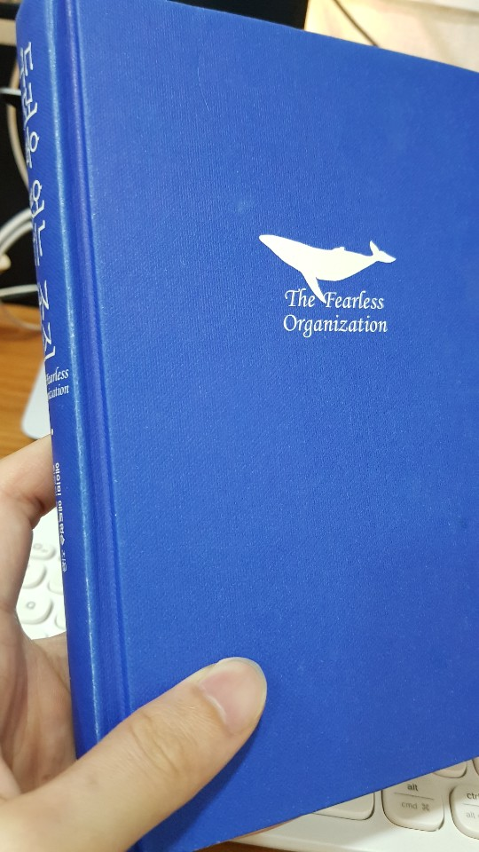
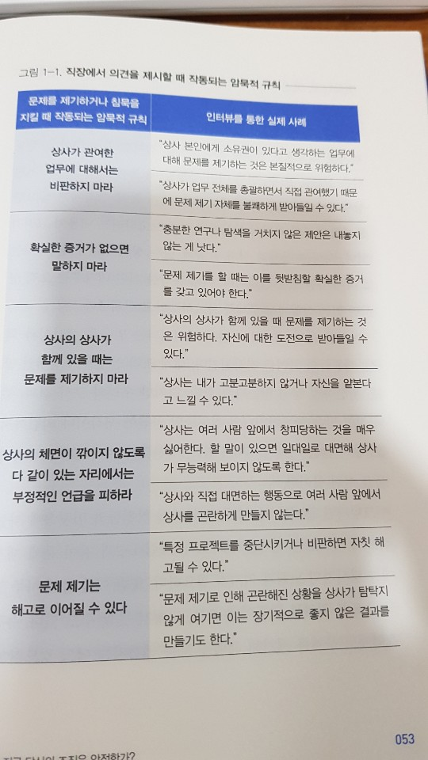
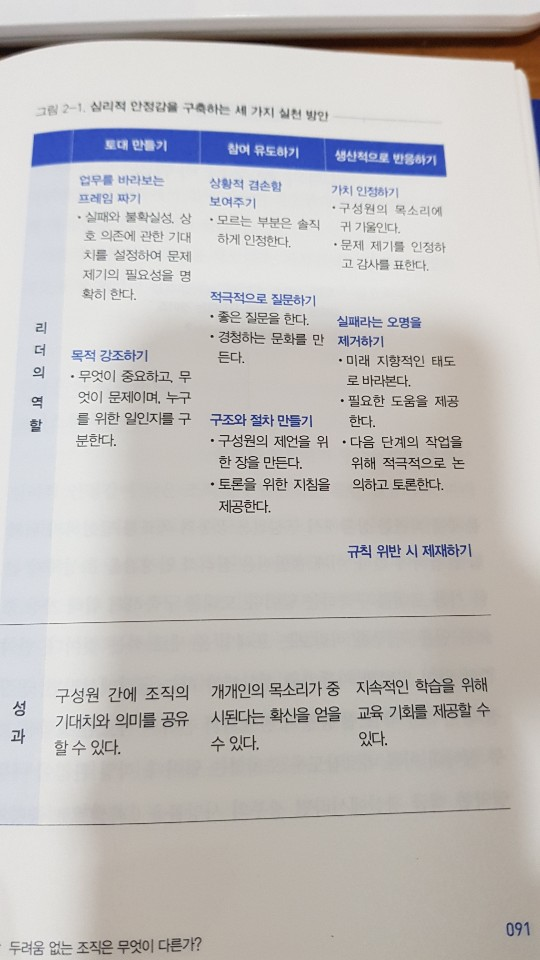
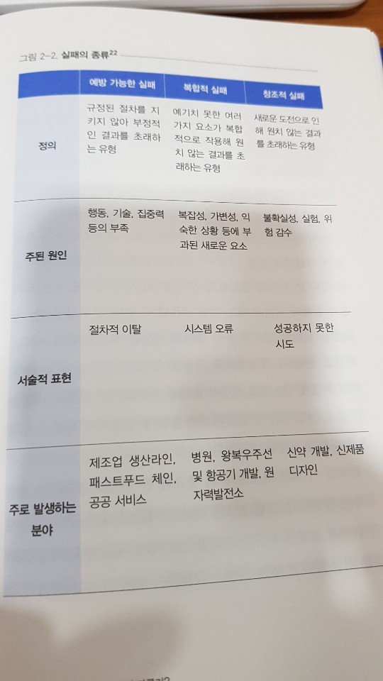
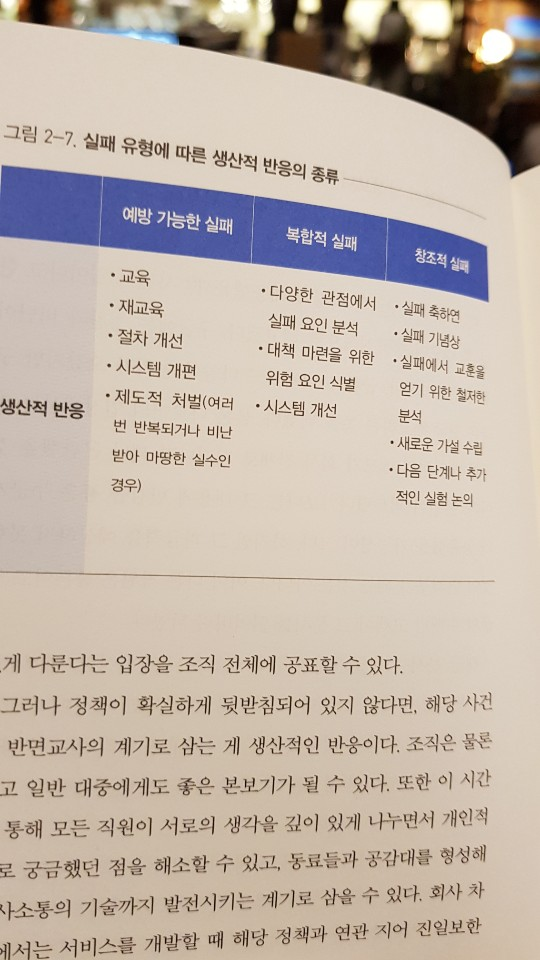

회사에서 '사실상 PM'과 개발자 역할을 같이 수행하게 되면서, 경영에 자꾸 관심이 갔다. 내가 부족하다는 느낌이 많이 들었다. 그래서 무작정 Yes24에서 경영/경제 카테고리에 가서 가장 베스트셀러인 책 하나를 골라왔다. 그것이 바로 <_두려움 없는 조직_> 이었다. 매번 그래왔듯이, 20~30분 내에 읽을 수 있을 만한 정도로 요약하고 내 삶에서 무엇을 적용할 수 있는지 적어보겠다.

```toc
# This code block gets replaced with the TOC
```

## 머릿말 & 감수의 글

에이미 에드먼슨이란 교수님이 하버드에서 25년간 '심리적 안정감'이 조직에서 미치는 영향을 연구하신 내용을 담아낸 책이다. '올바르게' 동작하는 조직을 만들어내기 위해 심리적 안정감을 적용할 수 있는 방안들이 기록되어 있다. (6~9)

> 지난 산업화 시대에 성공을 견인한 관료제는 이제 더 이상 효과적인 성장 동력으로 기능할 수 없습니다. (11)

- 이 책 ...은 조직에 심리적 안정감을 어떻게 배양할 것인가에 대한 구체적인 실행 방안들을 다루고 있다. (14)
- **심리적 안정감**: 상호 신뢰와 존중이 가능한 조직 문화의 핵심 동인으로, 동료들에게 본인이 가지고 있는 원래의 모습을 솔직하게 보여줘도 편안함을 느낄 수 있는 상태 (14)
- 세계적인 컨설팅사 맥킨지에서는 **'반대할 수 있는 의무'**를 강조한다. (15)
- 좋은 인재를 구하는 것도 중요하지만 그 인재가 조직에 잘 적응하고 최고의 성과를 내개 하는 것은 완전히 다른 문제 (16)

## 시작하는 글: 최강의 팀에만 존재하는 특별한 힘

- 훌륭한 아이디어를 가지고 있어도 제안하지 않는 이유는 **본인의 문제 제기로 위한 위험을 감수할 수 없어서**. (17-18)

### 불확실한 시대를 돌파하는 기업의 생존 전략
- '표준화'가 중요한 산업혁명은 끝났고, 지금은 **'아이디어'와 '독창성'이 중요한** 시대. (18)
- 그렇기 때문에 자신의 생각과 의견을 자유롭게 털어놓고 공유할 수 있도록 **'심리적으로 안정된 분위기'를 조성**해 주는 것이 중요 (19)

### 왜 화기애애한 팀이 더 자주 실수할까?
- **팀워크가 좋은 팀**이 그렇지 않은 팀에 비해 오히려 **더 많은 실수**를 저지른다는 결과 도출 (20)
- 이유: 분위기 자체가 개방적이어서 **'실수를 보고하고 논의하는 일'이 활발**했음. 실수는 비슷한 빈도였음. (21)

### 강력한 팀을 만드는 마지막 퍼즐 한 조각

> 넓은 의미에서 심리적 안정감은 '조직 구성원이 자유롭게 의사소통할 수 있는 분위기'를 뜻한다. (22)

- 구글이 5년간 진행한 '아리스토텔레스 프로젝트'도 심리적 안정감을 팀워크를 좋게 만드는 요인으로 판단 (23)
- 팀으로 일하는 시간은 늘어만 가기 때문에 좋은 팀워크는 대부분의 기업에서 더욱 절실해진 상태임 (23-24)

## 1장: 지금 당신의 조직은 안전한가?
### 침묵의 굴레에서 조직을 구출하라

- 위험한 점 #1: **장기적 미래에 대한 회피 성향**. 즉각적으로 나에게 영향을 미치는 것이 수일이 지나야 나오는 좋지 않은 결과보다 더 중요하다고 생각하는 것. (35)
- 위험한 점 #2: **대인관계 위험**. '어떻게 하면 상대방에게 거절이나 멸시당할 위험을 줄일 수 있는지'. (36)

> 무지해 보이기 싫다면?

> ... 질문하지 않으면 된다.

> 무능력해 보이기 싫다면?

> ... 자신의 실수나 약점을 인정하지 않으면 된다

이와 같은 **'포장' 하는 행위는 업무와 팀워크에 아주 심각한 문제**. (37)

> 회의를 하면 뭐가 문제인지 정확히 보였다. ... 틀렸다고 지적받는 게 두려워 아무런 말도 하지 못했다. (37)

### 인간관계가 안전할 것이라고 믿게 하라

- 의사소통을 진행할 때 인간관계가 불편해질 것부터 생각난다면 완전히 잘못된 조직문화. (39-41)

> 이 같은 맥락에서 나는 '심리적 안정감'을 '인간관계의 위험으로부터 근무 환경이 안전하다고 믿는 마음'이라고 정의했다.

- 동료들의 눈치따윈 보지 않고 질문, 우려 사항을 자유롭게 얘기할 수 있어야 함 (41)

### 솔직하지 못한 조직이 관심 병사를 만든다

- 우리는 인간관계의 위험에 노출되어 있지만 그것은 얼마든지 줄일 수 있다. (44)

### 두려움이 성장 동력이 될 수 없는 이유

- 안타까운 점: 수많은 관리자급 리더가 '두려움'이 동기를 유발한다고 믿음. 과학적 사실: 아님. (45)
- 당신은 ... 새로운 아이디어 ... 을(를) 환영하고 지지하는가? 아니면 조롱하고 무시하는가? (47)

### 심리적 안정감은 복지 혜택이 아니다

- 리더는 약한 모습과 실수를 있는 그대로 들어내야 함. 그래야 다른 직원들도 솔직하게 보고할 수 있음 (49)
> 리더로서 자신이 모든 정답을 갖고 있다고 생각한다면, 그 생각은 당장 집어치워야 합니다. (50)

### 조직에 침묵이 만연할 수밖에 없는 이유

- 침묵은 아무 짝에도 쓸모가 없음 (51)
- 동료들이 이상하게 생각할까봐 (52)
- 어차피 중요하게 다뤄지지 않을 문제라고 생각 (52)



### 심리적 안정도와 직원 몰입도는 비례한다

- 업무 만족도가 자발적으로 더 잘해내려는 의지와 비례하진 않음
- 대신 심리적 안정감이 그런 것이 밝혀짐 (57)

### 좋은 리더는 갈등을 추진력으로 삼는다

- 갈등은 효과적인 의사결정과 혁신을 증진함. 그렇지만 잘 활용하는 사람은 드뭄. (59)
- 심리적 안정감이 높다면 갈등도 효과적으로 사용할 가능성이 높음 (59)

> 반드시 기억해야 할 것은 어느 조직에서 일하든 문제를 꼭 제기해야 하는 순간에 목소리를 내지 못하면 그 문제를 수면 위로 드러낼 수 없다. ... 곪아버린다. (60)

### 침묵이 초래한 비극: 테네리페 공항 참사

기장이 부기장의 심리적 안정감을 확보하지 못해 벌어진 참사임. 부기장이 수차례 문제를 제기하고 기장과 함께 해결할 수 있었으나 기장의 쓸데없는 자만감, 자신감으로 모두를 죽음으로 이끄는 대참사가 발생.

### 문제제기에 대한 기대감을 형성하라

> 부하 직원이 문제를 제기할 때는 당연히 엄청난 용기가 필요하다. "부당한 일에는 언제든 허심탄회하게 얘기하세요" 라고 말하는 건 허공에다가 대고 외치는 것에 불과하다. (68)

문제 제기를 일상화시키려면 **문제 제기가 통할 것이라는 기대가 제도적으로 지원**되어야 함.

### 허물없는 소통의 힘: 허드슨강의 기적

- 바른 판단을 돕는 짧고도 명료한 대화 (72)
- 기장과 부기장의 심리적 안정감이 비행기 엔진이 작동하지 않는 상황에서도 모두의 목숨을 살림
- 심리적 안정감이 존재한다고 해서 대화가 한없이 늘어지지는 않음. 논쟁은 없어지고, 회의에는 적은 시간이 소모됨 (76-77)

## 2장: 두려움 없는 조직은 무엇이 다른가?

### 심리적 안정감을 구축하는 세 가지 방법

1. 토대 만들기. (85) 
    - 할 일: 문제나 실수는 너무나 만연하고 당연한 일이라는 것을 모두에게 인지시킨다.
    - 예시: 의료 서비스는 성질이 매우 복잡하므로 문제가 쉽게 발생할 수 있다는 것을 전 직원에게 인지시킴.

2. 참여 유도 (87)
    - 할 일: 아직 보고되지 않은 문제나 실수의 존재에 대해 질문하기
    - 예시: '비난 없는 보고'라는 새로운 정책을 도입, 위험과 문제점에 대해 철저히 비밀을 보장.

3. 생산적으로 반응 (89)
    - 할 일: 문제 제기를 존중, 가치를 인정. 대응 방향 제시
    - 예시: 의료 과실 발생 시마다 각 분과의 담당자들이 모여 실패 원인 분석. 시스템 개선 방안 토의.



### 1. 토대 만들기: 지금 당장 '실패의 틀'부터 바꿔라 (92)

#### 구글은 왜 실패한 팀에 보너스를 주는가? 

- 구글은 '문샷 프로젝트'를 실패한 팀에 두둑한 보너스 제공. (94)

> 발전 가능성이 전혀 없는 프로젝트에 몇 년씩 질질 끌며 돈을 퍼붓느니 그 실상을 정확히 파악하고 중단시킨 직원에게 그만큼 보상을 해주는 편이 낫다. (94)

#### 실패의 세 가지 유형

진정한 실패 (97):

1. 실패를 통해 아무것도 배우지 않음
2. 실패하는 게 두려워 온전한 위험을 감수하지 않음 

세 가지 유형 (99-100):
1. 예방 가능한 실패
2. 복합적 실패
3. 창조적 실패 (가장 우리가 바라는 것)



#### 격동하는 사회에서 가장 이상적인 리더는?

두려움 없는 실패를 보장하기 위해 (101-103):
1. 불확실성: 변화에 대해 민감하게 대응하는 선제적인 실패가 가능
2. 상호의존성: 서로의 임무가 모두 연결되어 있다는 것을 깨닫게 함
3. 문제의 핵심: 이것을 명확히 드러내면 두려움과 침묵의 위험은 없어짐 

...을 보장해야 한다.

4. 리더의 역할을 재정의: 정답을 가지고 있는/지시하는/결과를 평과하는 사람 (X). 업무 방향 설정, 의견 수렴하는 사람 (O).

### 폭스바겐은 어쩌다 돌이킬 수 없는 강을 건넜을까?

- 자동차 엔진의 배기가스 배출량을 조작했음. (104)
- 원인: CEO였던 빈터콘. 거만한 완벽주의자. 신경질적. 공포 정치. 직원을 두렵게 함. (108-109)

> 최고의 자동차를 만들어내는 방법을 알려드리죠. ... '형편없는 구닥다리 모델은 이제 지겨워! ... 6주 후에 제대로 된 게 안 나오면 모두 쫓겨날 각오해!' (109)

책에서 현대도 하는데 폭스바겐은 왜 못하냐고 꾸중을 줬다는 일화가 공개되어 있어서, 나도 너무 궁금해서 유튜브에서 직접 찾아봤다. ㅋㅋㅋㅋ

<iframe width="920" height="518" src="https://www.youtube.com/embed/YpPNVSQmR5c" frameborder="0" allow="accelerometer; autoplay; clipboard-write; encrypted-media; gyroscope; picture-in-picture" allowfullscreen></iframe>

소음이 있어서 다 잘 안들리는데 게다가 독일어라 이해를 못했다. 그래서 번역을 간단하게 해 준 코멘트를 찾아봤다. 디자인 책임자인 Klaus Bischoff씨를 혼내는 내용이었다. 많은 사람들이 있는 박람회에서 디자인 책임자에게 공개적인 망신을 주다니, 폭스바겐의 심리적 안정감은 당시 최악이었던 게 틀림없다.


#### 쓰나미가 다이니 원전을 피해간 이유

- 나오히로 마스다 소장은 동일본 대지진 당시 원자로 4기를 모두 안전하게 폐쇄했음.
- 성공의 이유: 차분함, 솔직함, 겸손함, 판단 착오를 기꺼이 인정 (114)

#### 한 차원 높은 목표로 동기를 부여하라

> 직원들의 업무가 고객을 위해, 나아가 인류를 위해 왜 중요한지를 끊임없이 상기시켜 주면, 그들은 갖은 어려움 속에서도 끝까지 업무를 완수할 에너지를 얻는다. (115)

- 나는 직원들에게 얼마나 자주, 그리고 분명하게 업무의 목적을 강조하고 있는가? (116)

### 2. 참여 유도하기: 겸손하되 적극적으로 파고들어라

#### 상황적 겸손을 보여라

- 리더의 겸손은 옵션이 아니라 필수. 리더는 정답을 항상 알지는 못한다. (118)
- 자신감과 겸손이 반대되는 말은 아님 (119)
- 파산 직전의 Xerox를 회생시킨 Anne Mulcahy는 직원들에게 '무지의 여왕'으로 불림. **아는 척 하지 않고 모르면 모른다고 솔직하게 말함**. (119)
- 리더가 지나치게 확신에 차 있거나 거만한 태도를 보여도 이와 같은 비슷한 결과를 초래할 수 있다. (120)

> 제가 뭔가를 놓친 것 같군요. 앞으로도 언질을 주시면 고맙겠어요. (121)

#### 적극적으로 질문하라

- '정답을 모른다'는 태도로 물어야 한다. ... 상대방의 대답에 제한을 두지 말아야 한다. (123)

> 우리가 놓친 건 없을까요? 다른 방법도 있지 않을까요? 다른 생각을 가지신 분 없나요? (125)

- 좋은 질문은 당신의 목소리가 충분히 수용되고 있다는 신호를 보냄. (125)
- 반대 의견은 언제나 있다. 그것을 존중하라. (126)

### 3. 실패를 축하할 각오가 되어 있는가?

기꺼이 위험을 무릅쓰고 목소리를 낸 직원에게 생산적인 반응을 보이라 (127):  
1. 감사 표현: 노력과 과정도 평가에 반영된다고 믿을 수 있도록 만들어야 함 (129)
2. 실패라는 오명 제거하기: 실패는 피해야 하는 게 아니라 도전하는 과정 중에 생기는 당연한 결과임. 먼저 그렇다고 생각하지 않는 직원들도 있고, 리더가 그렇게 생각하지 않는 경우도 있음. '실패 파티'등으로 생산적인 실패를 독려해야 함 (131-133)
3. 위반 행위에 엄격히 조치: 상식적으로 용납되지 않는 행동 (인종차별, 성차별 등)은 단호히 처벌. 올바른 처벌은 심리적 안정감을 높여줄 뿐임 (~137)



### 심리적 안정감에 대한 몇 가지 편견들
#### 심리적 안정감은 친절함과 다르다

- 상대방 의견에 동의하고, 서로를 친절한 사람으로 포장 (X). 자신의 생각을 자유롭게 표현, 솔직한 피드백 생산 (O) (~139)

#### 심리적 안정감은 개인의 성향을 초월한다

- '누구나 할 말은 하는 분위기'는 성격과는 관계가 없음. 간단한 예시: 외향적인 사람도 심리적 안정감이 박탈된 조직에서는 아무 말도 하지 않음. (140)

#### 심리적 안정감은 신뢰감과 다르다

- 공통점은 많음, 그렇지만 다름 (141)
- 신뢰는 1. 특정 인물이나 조직을 대상 2. 장기적인 반응과 관련
- 심리적 안정감은 1. 대체적인 근무 환경을 대상 2. 일시적이고 즉각적인 반응 (자유롭게 말을/행동을 하느냐 하지 않느냐)와 관련

#### 심리적 안정감이 성과의 기준까지 낮추진 않는다

- 업무 수행 능력이 부족, 마감 기한 미준수에 면죄부 X. 직장에서 마냥 편하게 있어도 된다는 뜻이 아님
- 그런 일은 단지 업무 수행 기준이 낮아서 발생 (~143)

#### 동기부여 없이는 결코 안전할 수 없다

- 심리적 안정감도 중요하지만, 가치 있는 목표를 세워 지속적으로 직원들이 그것을 계속 달성할 수 있도록 만들어 주어야 함 (145)

### 예견된 인재: 후쿠시마 원전 사고

#### 경고를 무시하다

- 사고는 분명한 _인재_이며, 미연에 예방할 수 있었다는 결론. 사고 가능성은 끊임없이 언급해왔었음. 구성원들의 의견을 무시한 나머지 참사 발생 (147)

#### '좋은 게 좋은 것'이라는 잘못된 문화

> 참사의 ... 원인은 ... 복종 문화와 권위에 대항하지 않는 태도 ... 에서 기인한다. (151)

- 구성원은 이런 환경에서 침묵을 택함. 좋지 않은 결과는 불 보듯 뻔함 (152)

### 현실을 두려워한 결과: 웰스파고와 뉴욕 연방준비은행

#### "우리도 월급은 받아야 했죠"

- 웰스파고가 가장 잘 나가는 은행이었는데, '교차판매 스캔'이 터짐.
- 경연진이 달성하지 못할 목표를 주고, 직원들은 목표를 달성하지 못할 것이라는 두려움에 빠짐
- 결국 허위로 계좌를 조작하는 등 불법행위를 저지름 (~158)

#### 규제 당국은 누가 규제 하나

- 2008년 글로벌 금융위기 후 뉴욕 연방준비 은행에 대한 조사가 이루어짐
- 조사 결과 사내 문화와 직원 간의 의사소통이 위축되어 있고 수동적이었던 것으로 판단 (160)
- 문제가 있어도 문제를 모두 덮음 (160-161)

### 직원을 가족처럼: 베리웨밀러

- 제조업계에서 심리적 안정감이 매우 중요하다는 것을 증명한 사례 (162)
- 직원을 가족처럼 대하는 태도가 심리적 안정감 형성에 효과적 (163)

#### 직원과 함께 만드는 리더십 가이드

> 그는 이 과정에서 회사가 개개인을 믿고 있다고 보여주는 게 가장 중요하다는 사실도 깨달을 수 있었따. **또한 출퇴근 기록표를 쓰게 하거나 휴식 시간을 종소리로 알려주는 것, 재고실 문을 자물쇠로 채워두는 행동은 직원들의 이 같은 신뢰를 깨트린다**는 사실도 알게 되었다. 채프먼은 즉시 사기를 떨어뜨리는 모든 관행을 없애버렸다. 돌이켜봐도 책임 있는 성인들을 대상으로 한다기엔 적절치 못한 관행이었다. (~165)

#### 데스크가 아닌 현장에서 조언 구하기

- 가장 이상적인 모습은 직원들이 자발적으로 업무 절차를 혁신 (166)
- 실무자를 회의에 참여시켜야 고위급 관계자가 탁상에서 의논할 떄보다 목표를 더 효과적으로 달성 가능 (167)

## 3장: 최고의 조직은 어떻게 혁신을 거듭하는가?

### 심리적 안정감에 '완결편'은 없다

#### 꾸준히 변할 용기가 있는가?

- 심리적 안정감은 쌓는 것보다 무너뜨리는 것이 훨씬 쉬움 (178)
- 심리적 안정감을 경험하는 최고의 방법은 이미 그 안정감이 실재하는 것처럼 행동 (179)

#### 역풍을 거스르는 항해사처럼

- 심리적 안정감 구축은 불안한 항해를 시작하는 것과 같음. 모든 선원과 선장이 적극 협력해야 성공 가능 (180)
- 견뎌라. 견디면 순항은 온다 (181)

### 솔직하라, 한 번도 상처받지 않은 것처럼!

#### 픽사의 직원은 모두 비평가가 된다

- 픽사의 '브레인트러스트': 한두 달에 한 번씩 정기적으로 만나 제작 중의 영화 관람, 솔직한 의견 나눔.
- 토이스토리가 처음에는 망작이었으나 여러 번의 솔직한 피드백을 받고 완전히 바뀜. 결론적으로는 대박남. (~184)

> 브레인트러스트는 기본적으로 호의적입니다. ... 그 어떤 이기적인 의도도 포함돼 있지 않습니다. (185)

#### 흥행 참패를 막기 위한 '실패할 자유'

- 실패 없이는 모방물밖에 안 나옴 (187)
- 실패를 독려해야 함 (187-189)

### 현실을 두려워한 노키아의 비극

- 노키아의 실패 원인: 두려움의 문화가 회사를 장악했기 때문. 매사에 신경질적인 리더가 겁을 줘 진실을 터놓기 힘들었음. (190)

#### 두려움은 언제든 용기가 될 수 있다

- 사업 재정비 후 자유롭게 토론할 수 있는 규칙부터 수립함 (192)

### 귀를 열고 '침묵의 소리'를 들어라

#### 누군가는 예상했던 컬럼비아호의 폭발

- 엔지니어 한 명이 위험성을 인지하고 있었지만 그의 의견이 무시당하고 말음. 결과: 유인우주선 컬럼비아호 폭발, 승무원 전원 사망. (194-197)

#### 침묵은 저절로 깨지지 않는다

- 이후 나사는 적극적으로 문화를 개선하기 앞자었음. 활발한 의사소통, 경청하는 문화를 독려함. (198)

### 농담으로 볼 수 없는 농담들

#### 소셜미디어 시대에 침묵?

- 미투 운동으로 많은 성추행 피해자들이 입을 열기 시작 (~203)

#### 수잔 파울러가 쏘아 올린 작은 공

- 우버의 성공은 이어졌지만 문화는 건강하게 정착하지 않음 (203)
- 실적 우선주의, 홉스식 유물론 (인간 = 기계), 직원 간 주먹다짐 등 (203)
- SNS로 모든 사실이 밝혀지자 회사 가치, 평판은 급속도로 하락 (205)

#### 우버에 찾아온 평화

- 물갈이 (205)
- 규칙 수립. 몇 가지만 교체해도 두려움은 쉽게 없앨 수 있음 (206)

### 심리적 안정감에 대한 리더의 질문들

Q. 우리 팀에 심리적 안정감이 지나치게 높은 건 아닐까요?

A. 걱정 붙들어 매라. (209)

Q. 심리적으로 안전한 근무 환경을 만드는 데 너무 많은 시간이 걸리지 않나요?

A. 심리적 안정감은 시간은 낭비하는 게 아니라 시간을 절약하는 방법. 심리적 안정감의 부재로 시간이 지연되는 경우도 허다함

Q. 심리적으로 안전한 근무 환경은 곧 모든 것에 투명한 환경을 의미하나요?

A. 개인의 생각을 굳이 알아야 될 필요는 없을 떄는 있다. 이건 화자의 사회성(?)에 달린 문제임. 단지 회사에 도움이 된다면 투명한 환경을 유지하자. (213)

Q. 심리적 안정감은 당연히 필요하다고 믿습니다만, 조직의 대표가 아닌 일반 구성원도 이에 기여할 부분이 있을까요?

A. 리더는 무조건 질문해라. 질문해야 대답이 있다. 그것이 곧 구성원이 참여할 수 있는 방법임.

> 잘 모르겠습니다.

> 도움이 필요해요.

> 제가 실수했군요.

> 죄송합니다.

이런 말들은 자신의 취야함을 드러내고, 심리적 안정감을 증진함 (~216)

Q. 심리적 안정감과 다양성, 포용성, 소속감 사이에는 어떤 관계가 있나요?

A. 조직 구성원의 포용성과 소속감이 높을수록 심리적으로 안전함 (218)

Q. 심리적 안정감은 내부 고발과도 관련이 있나요?

A. 모든 내부 고발이 심리적 안정감을 반영한 행동은 아님. 오히려 내부 고발은 심리적 안정감의 부재를 나타냄. 왜냐하면 이미 심리적으로 안정적이었으면 내부 고발 따윈 필요없기 때문 (221)

Q. 여전히 수직적인 위계질서를 강조하며 성공하는 리더도 많음. 성공 원인은?

A. 독립변수에 경쟁자의 부재, 기가 막힌 운 등이 끼어있음. 다른 변수 존재 가능성이 있음. 혹은 엄청난 천재(예: 스티브 잡스/헨리 포드)가 있어서 그 사람의 말만 따르면 되는 환경이었을 수도 있음 (223)

Q. 시시콜콜 자신의 의견을 말하는 동료 떄문에 미칠 것 같다.

A. 묵묵히 피드백을 해줘야 함. 도움이 되지 않는 의견이었다면 너의 의견은 영향력 있지 않다는 것을 알려주는 피드백이 필요함. (224)

Q. 목소리를 열심히 내니까 더 이상 아무도 저를 좋아해주지 않아요.

A. 1. 당신의 의견에 대해 동료들에게 피드백을 받아보라. 2. 당신의 목소리의 가치를 인정하는 회사로 가라. (225)

Q. 리더가 바뀔 가능성이 전혀 없는 경우는 어떻게 해야 하나

A.

> 윗선에서 정작 아무런 호기심이나 동정심, 헌신을 보이지 않는다고 깨닫는 순간, 이것이 얼마나 실망스러운 일인지를 더 많은 사람에게 알리세요. (227)

Q. 누구나 심리적 안정감을 지향하는 성공하는 리더가 될 수 있을까

A. 그렇다. 단지 한 사람의 마음가짐이 다른 사람에게 긍정/부정적 영향을 끼칠 수 있다는 사실을 기억해야 함 (228)

Q. 문화적 차이. 한국, 중국, 일본에서도 심리적 안정감이 가능할지? 

A. 권력거리가 큰 조직일수록 심리적 안정감이 낮았음. 그렇지만 토요타는 잘 했음. 그러니까 이 나라에 있는 당신의 회사도 가능 (229)

### 모두를 위한 하나, 하나를 위한 모두: 다비타 신장투석 센터

#### 경영진과 의료진 사이의 심리적 안정감

- 핵심 가치를 정할 떄 직원들에게 맡김 (223)

#### 의료진과 환자 사이의 심리적 안정감

- 다비타의 임상결과는 업계 최고. 왜? 환자가 간호조무사를 신뢰하고 편안하게 생각할 수 있는 환경을 제공했음 (235)

### 극도의 솔직함: Bridgewater Associates

#### 투명한 기록 보관소

- 유명한 _원칙 (Principles)_ 이라는 책에서 나와 있듯이, 모든 구성원의 모든 정보와 생각은 투명하게 공유되어야 한다. (239)
- 매 직원에 대한 생각과 정보도 그러함. '베이스볼 카드' 제작 후 전 직원에 대해 공유. (240)

#### 갈등의 생산성

- 갈등 해결은 혁신과 현명한 의사 결정을 위해 반드시 수반되어야 함 (241)
- 갈등 = 진실을 찾아가는 과정 (241)

> 논쟁에서 이기려고 하지 마라. 내가 틀린 상황은 매우 가치 있는 경험이다. 한 가지라도 배우지 않았는가. (241)

### '잘 모릅니다'의 마법: 아일린 피셔

#### 낮은 자세로 귀담아듣기

- 모르는 게 있으면, 인정하고, 들어라.

#### 승인해주는 것의 힘

- 직원들이 열정적으로 참여하는 일을 흔쾌히 허락해주는 것이 중요. 실제로 말단 직원의 의견이 반영되고, 그 직원이 C-level까지 올라서 회사에 좋은 영향을 끼친 경우 존재 (247-249)

## 감상평과 내 개인적 생각

- 회사에 소속되어 있지 않은 사람이 회사에서 일어나는 모든 일을 알아도 부끄럽지 않을 것이라는 생각이 든다면 그 회사는 올바른 길을 가고 있는 것이다.
- 내가 회사에서 일하면서 느낀 건, 회사에서의 직급과 조직의 심리적 안정감을 형성하거나 파괴할 수 있는 힘은 비례한다. 높은 사람이 되었을 때 언행에 더욱 신경써야만 한다. 올바르게 행동하지 않는다면 나 자신만 망치는 게 아니라 조직을 망치는 행위다. 결국 뭘까? 본인의 성격을 죽여야 한다. 제발 둥글둥글한 사람이 되어야 한다. 나를 위해서 뿐만이 아니라, 회사의 성장과 남들을 위해서. 
- (50) 이 책, 또한 _[인간관계론](https://9oelm.github.io/2020-08-17--100BooksProject-(6):How-to-win-friends-and-influence-people/)_을 읽고 열심히 실천하려고 노력중인 것은 기술적인 토론이 벌어졌을 떄 내가 생각하는 기술적인 방식이 옳지 않을 수도 있다는 전제를 무조건 깔고 가는 것이다. 이렇게 하니까 실제로 그랬고, 팀원들이 더 좋은 방향이 수립할 수 있었다. 물론 내가 맞는 때도 있었지만, 누구든지 맞을 수 있고, 틀릴 수도 있다는 생각을 가질 수 있어서 좋았다.
- 심리적 안정감이 거의 존재하지 않는 좋지 않은 회사에서 이직해온 사람들에 대한 각별한 관심도 필요하다. 그 사람들은 그곳에서 경험한 회사가 본인이 아는 '회사'라는 단어의 정의일 가능성이 높다. 그렇다 하지 않을지라도, 이미 습관이 몸에 배어 있을 가능성이 높다. 그렇다면 그런 생각과 습관을 해체하는 작업을 도와주는 사람이 무조건 필요하다. 그렇지 않으면 심리적 안정감을 보장해 주는 회사에 있더라도 심리적 안정감이 보장받지 못하는 것처럼 일하는 사람을 목격할 수 있다 (실제로 그래서 힘들었다).
- (97) 대부분의 인간은 실패를 두려워한다. 그래서 실패를 아무렇지 않게 여기거나 실패에 대해 보너스를 주는 행위가 낯설게 느껴질 수도 있다. 그렇지만 실패를 피하거나, 감추거나, 두려워하는 행위는 인간의 본성이자 사회가 보편적으로 가르치는 개념 뿐이라는 것을 명심해야 한다. 실패에 대해 칭찬을 하고 보너스를 주는 게 '올바른' 행위인지는 모르겠지만, 피하거나 감추거나 두려워하는 것보다는 100배 낫다. 그런데 내가 회사에서 느낀 점은 아직도 실패에 대해 선입견이 존재하는 경우가 많다는 것이다. 특히 실험적인 기술을 사용하는 회사가 더욱 그럴 것이다. 왜냐하면 '모험'을 해야 하니까. 리서치와 개발은 엄연히 다르다. 그리고 리서치를 수반한 개발도 존재한다. 예를 들면 더군다나 인터넷에 예시가 많이 존재하지 않는데, 아직 실험적인 기술을 사용을 해야만 하는 프로젝트를 진행하는 개발자가 있다. 실패 가능성이 무조건 있다. 이 때 우리가 해야 할 일은 이 개발자가 실패에 대한 충분한 심리적 안정감을 가지고 일을 진행할 수 있도록 격려하고 돕는 것이다.
- (116) 업무의 목적을 정기적으로 강조하는 건 필수다. 듣는 사람 입장이든 말해주는 사람 입장이든 정작 이것을 할 때는 시간낭비라고 생각할 수도 있으나, 이것이 없으면 더 chaos가 되는 건 시간문제다. '돈 버는 월급쟁이에 불과하다고 생각하지마. 재미도 있고 사회에 좋은 일을 하고 있다고 생각해 주지 않을래?'라는 주제로 긍지를 심어주는 시간은 무조건 필요하다. _[초격차](https://9oelm.github.io/2020-07-29--100BooksProject-(5):%EC%B4%88%EA%B2%A9%EC%B0%A8(The-Great-Gap)/)_에서 언급되었던 '의례적으로 해야 하는 회의'에 포함된다. 아니면 직원은 동기부여와 목적의식을 잃고 떠난다.
- (119) 모르면 모르면 말한다고 하는 습관은 일 할 때 뿐만 아니라 평소에도 습관을 들여 놓아야 나오는 것 같더라.
- (121) 이렇게 생각하고 말할 수 있는 사람은 상당히 드물다고 생각한다. 난 계속 하려고 노력하는 중. 난 한다고 생각하는데 내 팀 멤버분들은 어떻게 생각하시는진 잘 모르겠다. 나처럼 생각하고 계시면 고마울듯.
- (145) 아마도 이 주제에 대해서는 여러 권의 책이 나와 있을 것으로 보인다. 찾아서 읽어야겠다.
- (221) 군대 생각이 났음. 마음의 편지나 소원수리함 같은 것도 결국 표면적으로는 구성원들의 의견이 표현될 수 있는 방식은 맞지만... 애초에 소통이 잘 되고 있었으면 이런 것도 필요없기 마련임.
- (224) 아.... 그래야겠다. 본인이 하는 말을 본인도 조절하지 못하는 사람도 진짜 있다. 이런 사람들에겐 이런 진솔한 피드백이 필요하다고 본다. 잠언에도 나와 있듯이 쓸데없는 건 말하지 않는 게 도움이 될 떄도 있긴 있다. 내 말은, 진짜 진짜 진짜 쓸데 없는 것 말이다.
- 처음이 중요한 것 같다. 처음 회사에 '심리적 안정감'에 대한 개념조차 확립되어 있지 않은 상태일 때, 누군가는 나서서 그것을 제안하고 바꿔나가려는 시도를 해야 하는데, 그게 참 어려운 일인 것 같다. 단적인 예로 군대(한국군)에서 어떤 사람이 '계급장 떼고 진솔하게 조직의 발전을 위해서 진솔하게 얘기하는 시간을 매주 1시간씩 가지자'라고 제안하는 사람이 누구든지간에 (제일 높은 사람 뺴고) 처음에 욕을 먹을 게 분명하다. 처음에 누군가의 희생(?)이 필요한 것으로 보이기도 한다. 만약 그 사람이 회사를 떠나지 않고 지속적으로 발전시키고 싶다면 말이다.