As always, I've summarized the book so that anyone can get the main concept in about 20-30 mins. And then I wrote some reflections and possible applications in my life. Don't get overwhelmed by the table of contents below!

_typo alert: I typed so much that I can't just review all... if you find a typo, please kindly understand that I made a mistake._

```toc
```
# The fundamentals: why tiny changes make a big difference
## Introduction (~10)

- The author was hit by a baseball bat very hard during his time at the high school.
- Result: broken nose, half a dozen facial factures, and a bulging left eye. Took almost 8 months to recover back to normal life.
- He restarted playing baseball at the university and made quite of a success as an amatuer player (ESPN Academic All-America Team, the university President's Medal, etc). **He attributes this success to atomic habits he built up**, and that's what he wants to explain in this book.

> Small habits helped me fulfill my potential, and since you picked up this book, I'm guessing you'd like to fulfill yours as well. (9)

> (But) this book is about what doesn't change. It's about the fundamentals of human behavior. (10)

## 1: The surprising power of atomic habits (13~)

### Why small habits make a big difference

- British cycling team has conquered almost all competitions in the world after due to the aggregation of little efforts. (~15)


- 1 percent change per day might seem small, but once it aggregates, it exerts its full potential (15-16)
- It's naturally, inherently hard:

> If you save a little money now, you're still not a millionaire. If you go to the gym three days in a row, you're still out of shape. ... (continued, 17)

- Important: what you are consistently doing (18)
- Unimportant: outputs you are seeing right now (18)

> Time magnifies the margin between success and failure. (18)

### What progress is really like

- Even ice does not melt when it's between 26 and 31 degrees. It only starts to melt from 32 degrees (Fahrenheit).

> Breakthrough moments are often the result of many previous actions. (20)

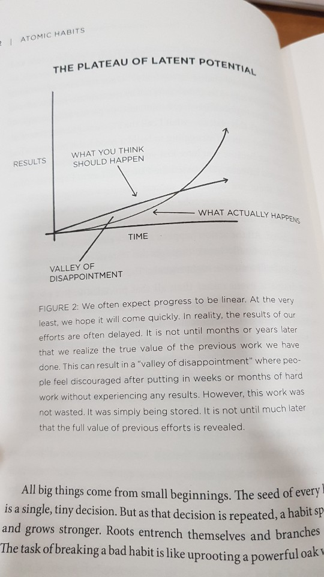

- Don't fall and get frustrated in the Plateau of Latent Potential!

- When you finally break through the Plateau of Latent Potential, people will call it overnight success (21)
  - because they don't see little efforts you have been made for a long time
  - but you know you did a LOT.

- Almost everything in the world works like this. The moment something hits some point, something drastic happens. (~23)

### Forget about goals, focus on systems instead

- Clear bets you would succeed even if you _only_ focus on the system. It's how you approach achieving something. (24)
- If you are an entrepreneur, you goal might be to build a million-dollar business. The system is how you test product ideas, hire employees, ... (24)

### Problem #1: Winners and loser have the same goals. (24)

- Whether you face success or failure, the goal has always been there for everyone. (25)

> Every Olympian wants to win a gold medal. Every candidate wants to get a job. ... the goal has always been there. (25)

- So instead, you should really focus on how you build the _system_.

### Problem #2: Achieving a goal is only a momentary change. (25)

- Sometimes you can achieve a goal without building a great system. That works too, but that's not sustainable at all. (25)

> Achieving a goal only changes your life for the moment. That's the counterintuitive thing about improvement. We think we need to change our results, but the results are not the problem. (25)

### Problem #3: Goals restrict your happiness.

- You are paying your happiness off until the next goal (26)
- You mentally get yourself into narrow version of happiness (26)
- With the systems-first approach, you can be always happy while the system is running (26)

### Problem #4: Goals are at oods with long-term progress.

- yo-yo effect.
- you achieve your goal, and then you stop training.
- it's likely you revert back to your original habit after crossing the finish line (26)

### The system of atomic habits

> Focusing on the overall system, rather than a single goal, is one of the core themes of this book.

## 2: How your habits shape your identity (and vice versa)

Changing habits is hard because
1. we try to change the wrong thing and
2. we try to change our habits in the wrong way.

### Three layers of behavior change

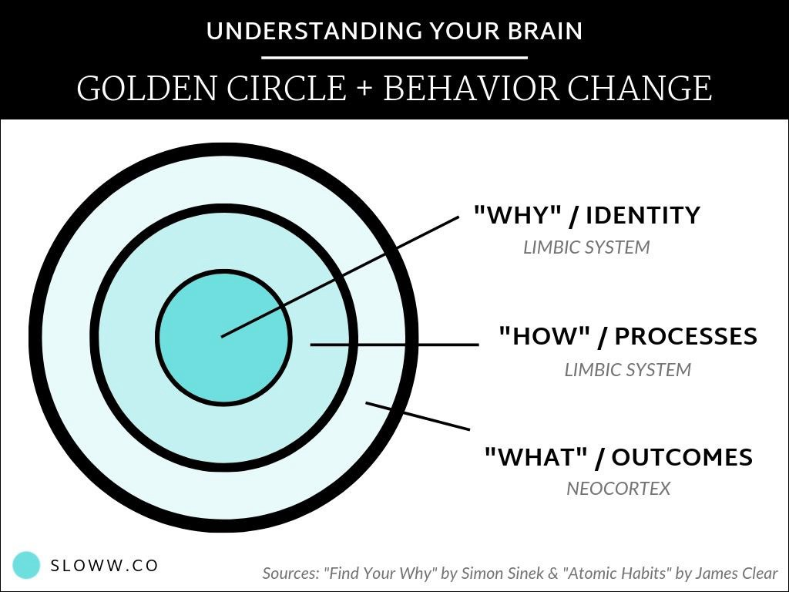

1. Outcomes: changing your results. losing weight, publishing a book, etc. What you get.
2. Processes: changing habits and systems. new routine at the gym, developing meditation practice. What you do. 
3. Identity: changing beliefs. worldview, self-image, judgements. assumptions, biases. What you believe.

</br>

- Many people start from outcomes to identity. That's wrong. (31)
- We can instead start by focusing on _who_ we wish to become (31)
- Notice the difference: "No thanks. I'm trying to quit." vs "No thanks. I'm not a smoker." (32)

> Behind every system of actions are a system of beliefs.

> Behavior that is incongurent with the self will not last. (32)

> The ultimate form of intrinsic motivation is when a habit becomes a part of your identity. (33)

- Taking pride in the identity helps maintain habits

**Bad goals**: to read a book, to run a marathon, to learn an instrument.

**Good goals**: to become a reader, to become a runner, to become a musician.

### The two-step process to changing your identity

- This is a gradual evolution. We do not change by snapping our fingers and deciding to be someone entirely new. (38)

</br>

Two-step process:
1. Decide the type of person you want to be.
2. Prove it to yourself with small wins (39)

So, just think backwards from the outcome you want to get. If you want to become a writer (= outcome), you probably need to be consistent and reliable (= identity). Who do you want to be?

## 3: How to build better habits in 4 simple steps

In an experiment where a cat would escape from a puzzle box, the time that cat would take to escape from the box gradually and dramatically reduced after many times of running the same experiment.

> During the first three trials, ... 1.5 mins. ... last three trials, 6.3 seconds. (44)

### Why your brain builds habits

- You are given a new external stimuli, and after some exploration, suddenly you get a reward. Then you go into the **feedback loop**. (45)

> Whenever you face a problem repeatedly, your brain begins to automate the process of solving it. (45)

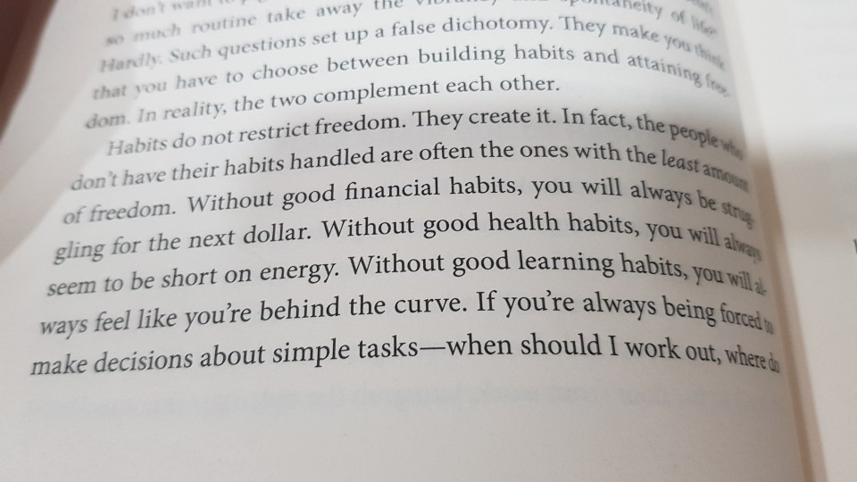

> Habits do not restrict freedom. They **create** it. **In fact, the people who don't have their habits handled are often the ones with the least amount of freedom**. Without good financial habits, you will always be struggling for the next dollar. Without good health habits, you will always seem to be short on energy. Without good learning habits, you will always feel like you're behind the curve. If you're always being forced to make decisions about simple tasks - when should I work out, where do I go to write, when do I pay the bills - then you have less time for freedom. It's only by making the fundamentals of life easier that you can create the mental space needed for free thinking and creativity. (46-47)

### The science of how habits work (47~)

4 steps of building a habit:

1. Cue
2. Craving
3. Response
4. Reward

#### 1. Cue
Unconsciously and consciously, you always look for an information that predicts a reward.

#### 2. Craving
Motivational foce behind a habit. You crave the change in state an action delivers. i.e. you crave the feeling of a clean mouth, not brushing teeth itself.

#### 3. Response
It is an actual habit you perform. 

#### 4. Reward
End goal of a habit. We chase this to:
1. satisfy craving by gaining status or winning approval. It brings contentment and relief.
2. learn which actions are worth remembering in the future.

> your brain is a reward detector. (49)

### Every step is essential in forming a habit
Missing any one of the steps _won't_ result in a habit.

### Example (52)
1. Cue: phone buzzes
2. Craving: you want to learn if something new happened
3. Response: you grab your phone, and check notifications
4. Reward: you satisfy your craving to check anything new.

### The four laws of behavior change (54)
Now we can use the four steps in the 'habit loop' and use it to make the four laws of behavior change.

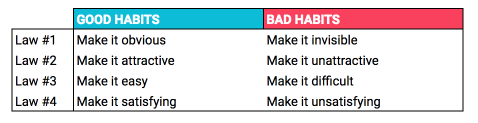

# The 1st law: make it obvious

## 4: The man who didn't look right

- A paramedic coincidentally saw her father-in-law and noticed that he is in a serious medical condition (artery blockage) and was able to detect that in a second, as a result of repeatedly working in that field for years. Similar stories exist. (59)

> Human brain is a prediction machine ... with enough practice, you can pick up on the cues that predict certain outcomes without conscously thinking about it. (59)

- So many things in our bodies already work very automatically and unconsciously. i.e. feeling hunger. (61)
- Similarly, you **don't need to be aware of the cue for a habit to begin**.

> Over time, the cues ... become so common that they are essentially invisible. (62)

### Habits scoreboard

- To reduce number of incidents, Japanese railway devised Pointing-and-Calling process. 
- The operators and relevant employees will point at something of their interest when train is departing or arriving.
- If they find something strange or dangerous, they will immediately stop the train
- This reduced errors up to 85% (63)

- What they did was just **raising the level of awareness from a nonconscious habit to more conscious one.**

- Implication for us: make the bad behavior less automatic, and the good, more. 
- Rate a habit by asking 'Does this behavior help me become the type of person I wish to be?'

**So first step to change bad habits is just to make them obvious, observed, and ackknowledged by you.** (~66)

## 5. The best way to start a new habit

- British researchers found that people with a detailed plan (behavior, time, location) are highly likely to take an actual action as planned. (~71)
- No more just saying "I'm going to eat healthier", or "I'm going to write more".

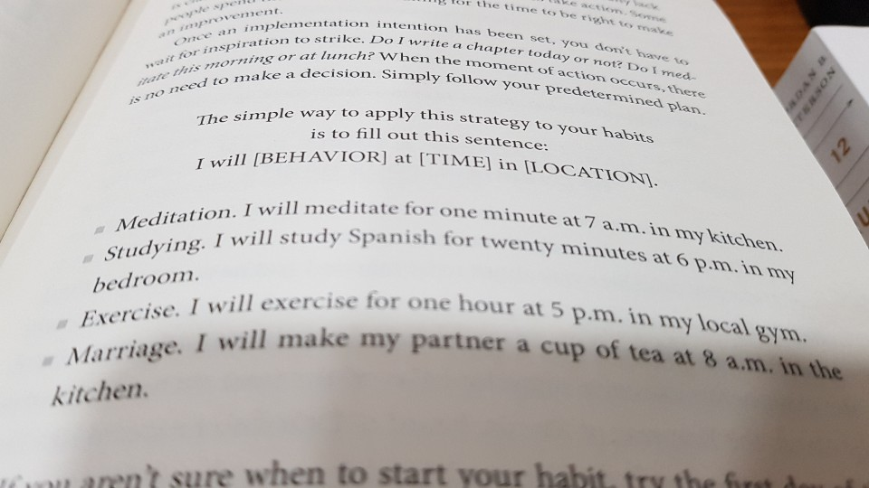

> I will [BEHAVIOR] at [TIME] in [LOCATION]. (71)

### Habit stacking: a simple plan to overhaul your habits

- Diderot effect: obtaining a new possesssion creates an urge for additional purchases
- Apply it to our behavior. It works too. i.e:
    1. Going to the bathroom leads to ...
    2. Washing and drying your hands, and that leads to ...
    3. Putting dirty towels in the laundry, and that leads to ...
    4. Adding laundry detergent to the shopping list (~73)

Take advantange of this connectedness of behavior (74):

> After [CURRENT HABIT], I will [NEW HABIT] (74)

Example:

1. Wake up. THEN
2. Make my bed. THEN
3. Take a shower.

#### Finding the right trigger

1. List down the things you do without fail. i.e. get out of bed, take a shower, ...
2. List down the things that happen to you without fail. i.e. the sun rises, you get a text message, the song you listen to ends, ...

Then, see where you can insert or modify a behavior.

## 6: Motivation is overrated; environment often matters more

- researchers found just placing water at more number of obvious appearances increased chance of people at restaurant buying more of them instead of fizzy drinks. (~83)
- perception really matters. It's all about what's visible to you and close to you.

> Behavior = f(Person, Environment)

### How to design your environment for success

- creating obvious visual cues can draw your attention toward a desired habit (85)

> If you want to practice guitar more frequently, place it in the middle of the living room.

### The context is the cue

- we should care about the people and settings around us.
- if you do something very often at some place (context), it's likely that you will do that automatically once you go to that place. (90)
- to build up a new healthy habit, try new context because there's no bad habit associated. (90)

### The secret to self-control

- high % of U.S soldiers at Vietnam War tried heroin, and many were addicted. But when returned home, most wouldn't relapse. (~93)

> "disciplined" people are better at structuring their lives in a way that does not require heroic willpower and self-control. (92-93)

- if an environmental cue shows up, so does the urge for your habit. AKA, cue-induced wanting. (93)

> If you can't get seem to get any work done, leave your phone in another room for a few hours. (94)

- _make it invisible._

# The 2nd law: make it attractive
## 8: How to make a habit irresistible

- humans are prone to exaggerated versions of reality and cues for survival (102)
- craving persists because the brain's reward centres have not changed for approximately fifty thousand years (103)
- attractive food is often a good combi of salt, sugar and fat that interests the brain. (103)

> if you want to increase the odds that a behavior will occur, then you need to **make it attractive**. (104)

### The dopamine-driven feedback loop

- The experiment showed that rats will die with dopamine deprivation. (105)
- **Habits are dopamine-driven feeback loop**.

- Whenever you expect or receive a reward, a dopamine is released (~107)

### How to use temptation bundling to make your habits more attractive

- Some guy made a system so that only when he rides a stationary bike at certain speed, he will be able to see Netflix. (108-109)

> You are more likely to find a behavior attractive if you get to do **one of your favorite things at the time** (109)

> After [CURRENT HABIT], I will [HABIT I NEED]. After [HABIT I NEED], I will [HABIT I WANT].

### The role of family and friends in shaping your habits

- Some guy wanted to test this theory, so he trained his children to play chess very well. One of them became the youngest world champion for chess. (~114)

## 9: The role of family and friends in shaping your habits
### The seductive pull of social norms

- Those who collaborated and bonded with others enjoyed increased safety, ... opportunities. (115)
- Humans get to get together. Therefore, imitation happens.

Imitation happens in three ways. These can be used to make a habit look _attractive_:

#### 1. Imitating the close (116~)

- You copy the people close to you.

If you want to build a habit, join a culture where
1. your desired behavior is the normal behavior
2. you already have something in common with the group

#### 2. Imitating the many (~121)

The famous experiment by Asch (I learned this in my high school psych class) shows conformity happens

#### 3. Imitating the powerful

We want to be recognized and praised. (121-122)

## 10. How to find and fix the causes of your bad habits 

If people around you smoke, you probably would smoke too (~126).

### Where cravings come from

At a lower level, you want to satisfy basic human desires as follows:

- Find love and reproduce: Tinder
- Connect and bond with others: Facebook

... and so on.

> a craving is the sense that something is missing. It is the desire to change your internal state (129)

### How to reprogram your brain to enjoy hard habits

- you can make your daily tasks sound more attractive.
- you ~~have to~~ wake up early. You _get to_ wake up early.
- reword your thoughts (~132): 
    - ~~I need to go run in the morning.~~ _It's time to build endurance and get fast._
    - ~~I am nervous.~~ _I am excited and I'm getting an adrenaline rush to help me concentrate._

# The 3rd law: make it easy

## 11: Walk slowly, but never backward

- Sometimes motion (things like planning on what to do) is useful, but action (realizing the plan) is what's really needed. (~143)

- "I brainstormed some ideas for that book I want to write. This is coming together". This is not right. You are just preparing to get something done. You _haven't started anything_. (143)

### How long does it actually take to form a new habit?

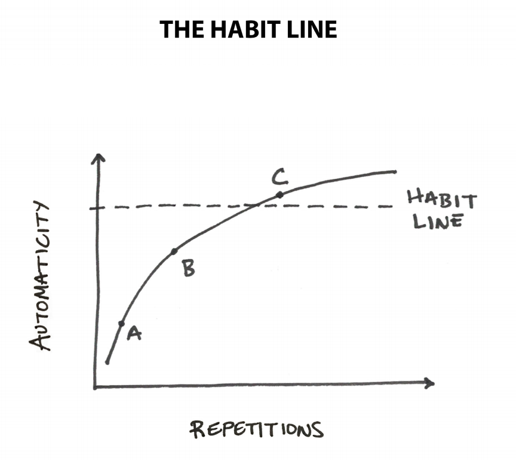

1. A: requires conscious effort to get a thing done
2. B: requires less conscious effort
3. C: effort becomes more automatic than conscious

> In practice, it doesn't really matter how long it takes for a habit to become automatic. What matters is ... **the actions** you need to take ...  (147)

Just **repeat it** until it becomes automatic. 

_Make it easy._ (147)

## 12: The law of least effort

- Agriculture spread two times more slowly in America and Africa than Asia just because the provided environment is harder to expand due to climatic difference along the longitude (~151).

> Our real motivation is to be lazy and to do what is convenient. (151)

### How to acheive more with less effort

1. design your environment so that the habit becomes easier (153)
2. remove frictions (wasted efforts) in your life. (~155)

### Prime the environment for future use

- When you leave your car, throw any trash away.
- When you take a shower, wipe down the toilet while the shower is warming up. (156)

> Whenever you organize a space for its intended purpose, you are priming it to make the next action easy.

**Prepare for your next actions!**

> Whenever possible, I leave my phone in a different room until lunch. When it's right next to me, I'll check it all morning for no reason at all. (157)

## 13: How to stop procrastinating by using the two-minute rule

- Ritual matters. If you take a cab to go to the gym every morning, the **cab is the important point**, not the gym. (~160)

> You check your phone for "just a second" and soon you have spent twenty minutes staring at the screen. (160)

> the ritual is changing into my workout clothes. If I change clothes, I know the workout will happen. ... easy once I've taken the first step.

These can be called _decisive moments_.

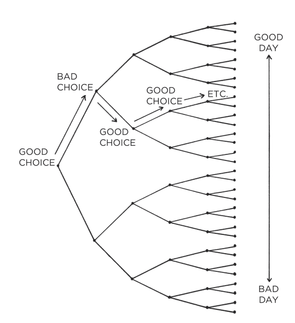

We are limited by where habits lead us. You can't get a sushi once you walk into a steakhouse. (162)

### The two-minute rule

> When you start a new habit, it should take **less than two minutes** to do. 

1. ~~Read before bed each night.~~ _Read one page._
2. ~~Do thirty minutes of Yoga.~~ _Take out my yoga mat._

Remember: _make it easy_. We need a gateway habit. (163)

> If the Two-Minute Rule feels forced, try this: do it for two minutes and then stop. ... (this will make you recognize what you are doing anyways.)

- If you do well for two-minute, go try a bit harder task, even harder one next time, and so on. (167)

## 14: How to make good habits inevitable and bad habits impossible

> Sometimes success is less about making good habits easy and more about making bad habits hard. (169)

Create a **commitment device**: a choice you make in the present that controls your actions in the future. (170)

### How to automate a habit and never think about it again

> The best way to break a bad habit is to make it impractical to do. (172)

The nuance where he says this is like, make it _impossible at all_.

- Then, for sure, the best way to lock in a good habit is to make it _**practical to do**_. (173)
- For sleeping, you may: 1. buy a good mattress. 2. get blackout curtains. 3. remove your TV from bedroom.

- James did it candidly: he asked his assistant to change the passwords of his social media accounts on Monday, and tell him passwords on Friday. This way he wouldn't waste his time on social media at all for the weekdays. (175)

# The 4th law: make it satisfying
## 15: The cardinal rule of behavior change

- Once people who did not wash their hands properly were given premium soaps that smelled and foamed _satisfyingly_, they started to properly wash their hands. (~185)
- Works the same for selling gums and toothpaste.
- Pleasure tells your brain it's worth repeating.

> What is rewarded is repeated.

_Make it satisfying._

### The mismatch between immediate and delayed rewards

- In the past, things were simple. If you did something, you usually received your reward immediately.
- Now, it's not like that. Paycheck comes weeks after. Weight loss comes months after. Reward comes in a _delayed fashion_. (187)

Nowadays:
- bad habits: feels good in the short term, feels bad in the long term
- good habits: feels bad in the short term, feels good in the long term

> ~~What is rewarded is repeated~~.

> What is immediately rewarded is repeated. What is immediately punished is avoided.

### How to turn instant gratification to your advantage

- Immediate reinforcement. Each time you don't spend a money on coffee, visibly put the same amount of money in another account. (191)
- Change is easy when it is enjoyable (193)

## 16: How to stick witth good habits every day

- Making progress and visualizing it is satisfying (~196)

### How to keep your habits on track

- Habit tracker. Crossing out each day on a calendar. (196)

#### Benefit #1: Habit tracking is obvious

- You can see your streak right away on calendar. (197)
- It keeps you honest.

#### Benefit #2: Habit tracking is attractive.

It provides visual proof of your hard work.

#### Benefit #3: Habit tracking is satisfying.

It feels good to watch your results grow.

> After [CURRENT HABIT], I will [TRACK MY HABIT].

### How to recover quickly when your habits break down

- Miss never twice. Get back on progress ASAP. (201)
- Just keep the progress. Simply doing something is huge. _Don't put up a zero._ 

### Knowing when (and when not) to track a habit

- Choose the right unit and target of measurement. (~203)

## 17: How an accountability partner can change everything

- Someone devised an idea to prevent nuclear war: a president would have to see someone right next to him die if he wants to launch a nuclear missile. (~206)
- _Immediate pain_ prevents a bad habit.

### Habit contract

- Write a contract for yourself, just like how national law is observed. (~209)
- Otherwise, just make one accountability partner. (210)

# Advanced tactics: how to go from being merely good to being truly great

## 18: The truth about talent (when genes matter and when they don't)

- The secret to maximizing your odds of success is to choose the right field of competition. (218)
- in short: genes do not determine your destiny. They determine your areas of opportunity. (219)

### How your personality influences your habits

- Some genes innately influence personalities. 
- Example: people that tend to have higher natural oxytocin levels, are high in agreeableness, kind, considerate, and warm. They may easily build habits for writing thank-you notes or organizing social events.
- Habits are not always influenced by personalities, but personalities (or genes) can always us lead to some direction.

> The takeaway is that you should build habits that work for your personality.

- If bodybuilding doesn't work for you, then try rock climbing or cycling. (222)
- **Habits need to be enjoyable if they are going to stick (4th law).**

### How to find a game where the odds are in your favor

- explore/exploit trial and error. (223)

Find a thing that (224-225):
1. feels like fun to me, but work to others
2. makes me lose track of time
3. gets me greater returns than an average person
4. comes naturally to me

Alternative methods:
1. Create a game yourself if you can't find a game where odds are in your favor: Find a new, special, niche market yourself. (225)
2. Win by being different if you can't win by being better. Make your own major at University. (226)

### How to get the most out of your genes

- (genes) tell us what to work hard on.

> pick behaviors that align with your personality and skills. Work hard on the things that come easy. (227)

## 19: The Goldilocks rule: how to stay motivated in life and work

- To keep yourself motivated, you should work on tasks of "just manageable difficulty". (231)
- It's about 4% more of your maxium ability (232)
- If you are in the Goldilocks zone, you can achieve a flow state.

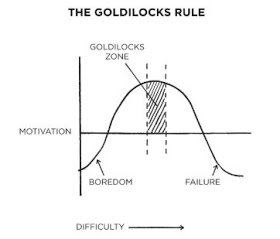

### How to stay focused when you get bored working on your goals

> At some point it becomes down to who can handle the boredom of training every day, doing the same lifts over and over and over. (233)

> The difference is that they still find a way to show up despite feelings of boredom. (234)

- Perhaps this is why many of the most habit-forming products are those that provide continuous forms of novelty, which is called a _variable reward_ in psychology. (234)

> But stepping up when it's annoying or painful ... (is) the difference between a pro and an amateur. (236)

## 20: The downside of creating good habits

- Upside of habits: can do things without thinking
- Downside of habits: get used to doing things a certain way and stop paying attention to little errors, without reinforcing or improving your current habits. (239-240)

Therefore, mastery only comes in this equation:
> Habits + Deliberate practice = Mastery

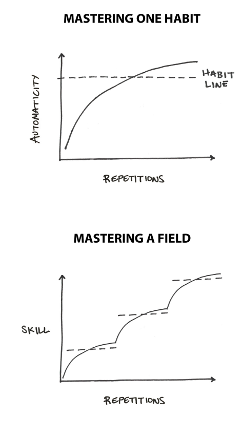

### How to review your habits and make adjustments

- This is a good way to avoid slipping into the trap of complacency. (242)

- A NBA coach, Riley, started a system called Career Best Effort program, where players' performance is compared to their peers' and their historical records. Players consistently got motivated by this system, which led to a huge success. (242-244)

- Without reviewing, it's just so easy to get biased. (245)
- With reviewing, you get to fine-tune things for improvement. (256)

#### James' Annual review questions
1. What went well this year?
2. What didn't go so well this year?
3. What did I learn?

#### James' Integrity report questions
1. What are the core values that drive my life and work?
2. How am I living and working with integrity right now?
3. How can I set a higher standard in the future?

### How to break the beliefs that hold you back

Keep your identity (belief) small. The more you define yourself, you will be tied to that definition. (247-248)

> "I'm an athelete" becomes "I'm the type of personw ho is mentally tough and loves a physical challenge." (248)

> Habits deliver numerous benefits, but the downside is that they can lock us into our previous patterns of thinking and acting - even when the world is shifting around us. Everything is impermanent. Life is constantly changing, so you need to periodically check in to see if your old habits and beliefs are still serving you. A lack of self-awareness is poison. Reflection and review is the antidote. (249)

# Conclusion: the secret to results that last

> Can one tiny change transform your life? It's unlikely you would say so. But what if you made another? And another? And another? At some point, you will have to admit that your life was transformed by one small change. (251)

1. For good habits: make it obvious, attractive, easy and satisfying.
2. For bad habits: make it invisible, unattractive, hard and unsatisfying.

# Cheatsheet

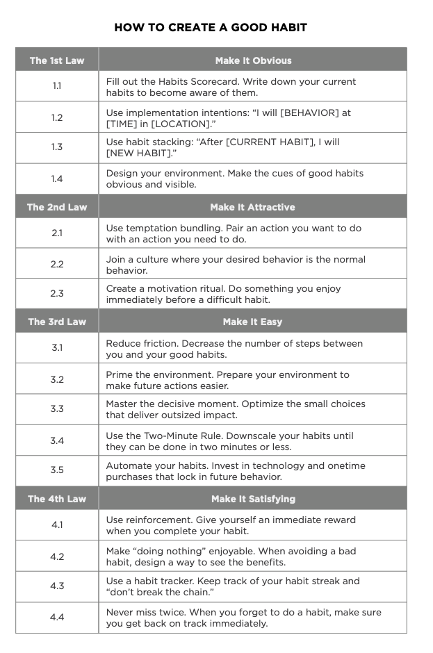
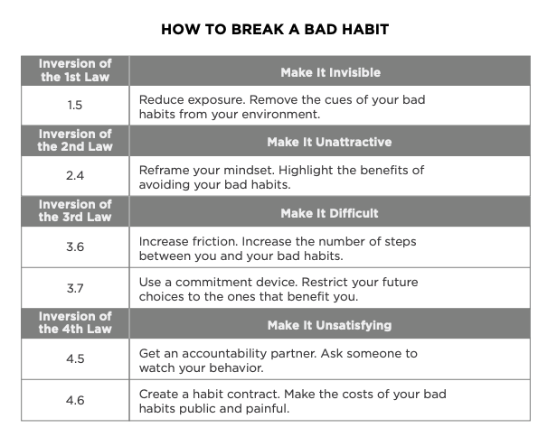

# Reflections and applications

## Positive changes accumulate, but so do negative ones.

I think this is the real danger. Although Clear, in the graph of the power of tiny gains, explained that 0.99^365 is about 0.03, I believe that if you keep doing something that's not right, you could go minus, under the zero. With the math mentioned, it's never possible because n^x where 0 < n < 1 and x > 0 is always bigger than 0. But from my experiences, I know that you could infinitely fall too. So why not this way:

- 1% worse every day: the absolute value of decline increases
- 1% better every day: the absolute value of decline decreases

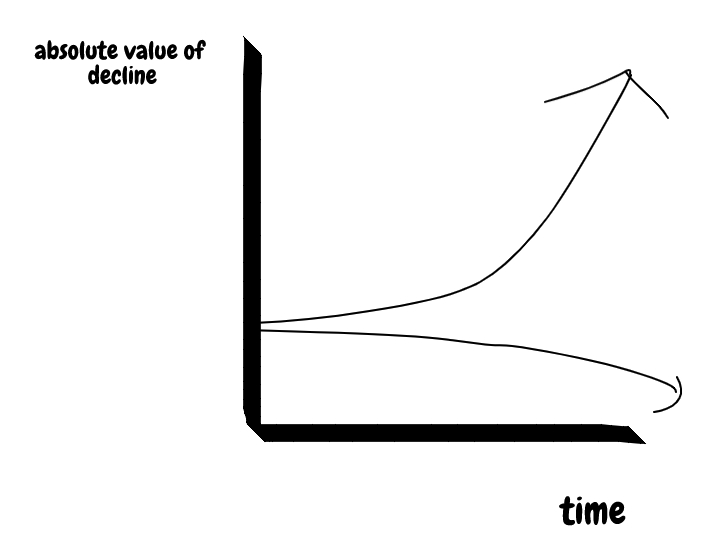

If you think this way, well... we can see that we can indefinitely increase the value of decline. So my belief is that if bad habit piles up, it's going to be as unsatisfiable as the amount of satisfaction you will gain (not only emotional, but also just visible results) when you made a big success.

So... to give an example:

If you sit in a chair with a wrong body posture, that's going to incrementally shape your body in a wrong shape. But is there really a zero for that? I don't think so. I think that once you reach around 150, you get a bit of pain in your waist, and once you reach 1000, you've gotta go to the hospital, and 10000, perhaps you need to get a surgery, and so on. I really think negative changes also don't have the maximum.

## Little by little, for the codes we write too.

After a year ends and we look back at the codes we wrote, we actually write tonnes of code. I mean, like... so much. It seems that the logic applied to the habits also works for anything else. Gradual 1% change. We can do that!

## Habits and freedom

Just never thought this way before. I feel so stupid and wasted for the 24 years I lived without knowing this simple fact. Habits give freedom. In other words, having no habits demolishes freedom.

Why did I not know about this? While I was resisting from myself to get up from the bed early in the morning although I was consciously awake, I did not realize that it would give freedom for me to spend my time usefully in the early afternoon, after work.

### Rules and freedom

Similarly, rules may give freedom. Right now it's just a random though, but I think it pretty much makes sense.

Some may oppose the idea of making a lint rule, because it's always opinionated anyways, anyhow. However making a lint rule across the development team gives the team freedom from unreadable, unmaintainable codes.

Similar thing. If there's no law, there's no freedom either. More homecides for obtaining selfish benefits. More thefts. Freedom for all, but at the same time, no freedom for all.

I've been reading _12 Rules for Life_ by Jordan B. Peterson too, and it seems almost definite that we humans really need rules (not only for freedom)

## My habits scoreboard (65)
I will make one on Notion privately :)

## Habits as a Christian

- Get obstrusive things out of the sight (remove the cue).
- Be with friends who are righteous and follow the will of the Christ.
- Select a browser (for me, Firefox), where I would normally go onto a website to read the Bible and QT materials.

## All those experiments and names of researches I learned back in my high school for my psychology class that I thought were useless

I was quite surpised by this book mentioning some of the experiments I know already, like Asch's. I never thought that the psychology class I took for my high school would be at some point useful. It turns out it indeed is.

It appears to me that psychology is closely related to forming and locking into habits, and more generally, controlling the self. I won't say psychology is not useful for me again. Because it indeed is.

## Knowing myself

I would assert that it is the greatest virtue of a human being. Knowing the self. Without recognizing your problems, you never grow.

I am not sure if this is an innate human nature, but almost everyone (including me) seems to be ignoring what they think should be doing despite awareness. I have no doubt that anyone who succeeds in knowing the self will succeed in anything anyways.

## The decisive moments (161~162)

Just the fact that I have a strong realization that if I take certain action, I am going to ruin my whole day makes me more alert these days.

For me, I think it's the shower. If I don't take a shower in the morning (especially in the weekends), I almost know that I am not going to do anything productive for that day until I take a shower. I don't know why, but I don't feel prepared for the day without shower. Thank God taking a shower isn't difficult at all.

## Real habit changes in my life

1. **Turning off the phone.** 
    - The moment I step into my house, I turn off my phone. The phone serves the purpose of connecting with other people while I'm outside home. (_making it less obvious_)
    - If for any reason the phone is turned on before sleeping, I turn it off right before I go to bed. (Alarm is set on my Google home mini instead)
    - I put it in my closet while I'm home. 
2. **Deleting instagram on my phone.** It doesn't mean that I won't do it. I only do it by installing it from the store again. Once I'm done with keeping up to date with my friends, I delete it again. This significantly reduced my wasted time.
3. **Sleeping at 23pm.** No matter what, I cease doing whatever I have been doing and go to bed at 23. After I normalize my sleeping time, I also plan to set a time for waking up.
4. **Reading a book.** 
    - I reorganized my table so that at least one book is always open on the stand at any time (_making it obvious, easy_).
    - I always bring one book with me when I get out of my house, and read it while commuting, instead of looking at my phone.
5. **Making my bed.** The first thing I do when I wake up is to make up my bed, drink water, and go for a shower.
