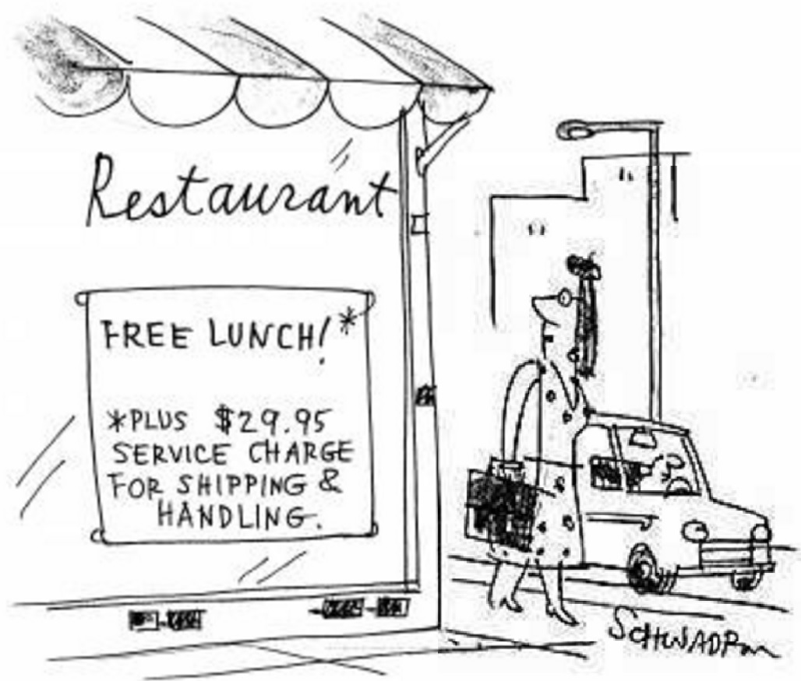

# 상식의 부재

상식이 당신을 지배하게 만들어라.

상식만이 살 길이다.

너무 자주, 너무나도 자주 당신 그리고 우리는, 상식적으로 생각하고 있다는 착각에 빠진다.

혹은, 그러한지 아닌지에 대한 지식조차 없다.

# 상식이란?

상식은:

- 간단하다.
- 관찰할 수 있다.
- 의외로 생각해내기 어렵다.

# 예시 #0

예를 들자면 이런 것이다.

## 전제

1. 당신은 좋은 회사에 취직하고 싶다.
2. 그 '좋은 회사'에는 수많은 지원자들이 몰려 경쟁률이 높다.

### 상식 #0

1. 내가 그 회사에 취직할 수 있는 확률은 다른 지원자와의 차별성이 있어야 증가한다.
2. 차별성이 존재하려면, 특별한 무언가를 해 본 경험이 있어야만 한다.
3. 특별한 무언가를 해 본 경험이 있으려면, 대학 생활때 무언가를 해봐야만 한다.
4. 대학 생활때 무언가를 해보려면, 본인의 관심사를 확실하게 알아야 한다.
5. 본인의 관심사를 확실하게 알려면, 다양한 경험을 해봐야 한다.
6. 다양한 경험을 해보려면, 본인이 먼저 노력해야만 한다.

### 상식 #1

1. 내가 그 회사에 취직할 수 있는 확률은 해당 직종에 대한 나의 의지와 관심도와 비례한다.
2. 나의 의지와 관심도는 지금까지 내가 해왔던 활동들로 증명될 수 있다.
3. 내가 지금까지 해왔던 활동들이 존재하려면, 나의 관심사를 확실하게 알고 있었어야만 한다.
4. 이하 상식#0-5와 동일

### 풀어쓰기

***제가 음악 평론가가 아니기 때문에 완전히 틀린 설명일수도 있지만 (주니어 음악평론가라는게 존재하는지도 모르겠음) but you get the idea of what I'm saying.***

쉽게 풀어쓰자면 이런 것이다. 당신이 가고 싶어 하는 곳은 바로 유명한 음반회사. 지원자는 1000명, 그러나 1명만 뽑는다. 희박한 확률임이 틀림없다. 뽑는 직종은 바로 주니어 음악평론가. 당신은 이미 대학교 1학년 때부터 음악 평론가의 길을 향해서 칼을 갈아왔다. 그렇기 때문에 당신은 [배철수의 음악캠프](http://www.imbc.com/broad/radio/fm4u/musiccamp/)를 하루도 빠짐없이 들었다. 음악을 효과적으로 평론하기 위해서는 음악의 전반적인 역사에 대해 심도있는 이해가 필요하기 때문에, 당신은 음악에 대한 블로그를 3년 전부터 이미 개설, 음악에 대한 흥미로운 역사적 사실이나 비화에 대해 글들을 서술해왔다. 당신의 삶은 이미 음악에 상당히 매료되어 있다. 단적인 예시로, 어느 음악 청취 플랫폼(스포티파이, 멜론 등)에서 웬만한 음악이 나오면 어느 장르인지, 어느 풍조인지, 어느 악기가 사용된 이유는 무엇인지 바로 설명이 가능하다. 이미 이것 또한 블로그에 기록중이다. 특별히 빠진 장르였던 재즈 때문에 당신은 홀로 미국의 뉴 올리언즈까지 비행기를 타고 가서 딕시랜드(전통 재즈)풍 음악을 연구하고, 그곳 현지인들을 인터뷰한 경험이 있다.

이상 언급한 것들은 대학생이어도 충분히, 정말 충분히 할 수 있는 것들이다. 솔직히 이 정도를 했는데, 서류에서 탈락하거나 면접에서 탈락했다면, 그것은 당신에게 문제가 있는 것이 아니라, 단지 당신같은 사람이 한두명 더 있었을 뿐이었을 것이다. '졌잘싸'는 이럴 때 쓰는 말이다. 만약 당신이 이 부류에 속한다면 당신이 단지 더 해야 할 것은 인내다. 당신은 이미 잘 하고 있으며, 곧 원하는 자리를 찾을 수 있을 것이다.

만약 '상식적으로' 이런 준비과정을 거치지 않고 지원했다가 떨어졌다면, 그것은 '졌고 못 싸웠다'다. 당신은 회사가 내어놓은 채용 포지션에 있어서 '상식적으로' 바라는 점들을 알면서도 준비하지 않은 것이다. 여기서는 보통 두 부류의 사람들로 나뉜다: A. 본인이 회사에서 상식적으로 바라는 점들을 준비하지 못했다는 것을 깨닫는 사람 B. 깨닫지 못하고 회사를 탓하거나, 본인을 되돌아 볼 시간을 갖지 않거나 못하는 사람.

# 예시 #1

## 전제

1. 당신은 건강해지고 싶다.

## 상식

1. 일찍 자고 일찍 일어나야 한다.
2. 스트레스 받는 상황을 최소화해야 한다.
3. 운동해야 한다.
4. 음식을 골고루 섭취해야 한다.
5. 추운 날에는 적당히 따뜻하게, 더운 날에는 적당히 시원하게 지내야 한다.

## 풀어쓰기

당신은 어느 날 심한 감기에 걸리고 말았다. 중요한 일정을 취소시키고 만다. 물론 당신은  '평소보다 더 피곤했는데 무리했기 때문에'  감기에 걸렸다고 확신하고 있다.

맞긴 맞을 텐데, 보통은 이런 경우일 것이다. 

당신은 분명히 밀린 대학교 과제가 있음에도 불구하고 유튜브를 먼저 3시간 보는 것을 택했다. 그리고는 새벽 5시까지 과제를 하느라 밤을 새고 말았다. 다음날에는 과제가 있음에도 불구하고 친구와 배드민턴을 장장 일곱 판이나 하고, 과제를 침대에서 엎드려서 하다가 불을 키고 잠에 들고 만다. 과제를 발표하는 날이다. 아침에 일어났더니 목이 잠기고 말이 안 나온다.

**상식적으로**, 당신은 단지 '약해서', '피곤해서', '무리해서'가 아니고, '**절제하지 못해서**' 감기에 걸린 것이다.

# 예시 #2

경제학도 결국 상식이다.

## 전제

당신은 오늘 지나가다가 '정부가 OO시 모든 유치원 무상 급식 제도를 실행'을 홍보하는 현수막을 봤다. 과연 좋은 정책일까, 나쁜 정책일까?

## 상식

- stakeholders: 유치원생, 유치원생의 학부모, 정부, 유치원, 급식 공급 사업자
  - 유치원생: 맛있고 균형잡힌 식사를 하고 싶다.
  - 유치원생의 학부모:
    - 적당한 가격에 자녀가 맛있고 균형잡힌 식사를 하기를 원한다.
    - 유치원에 자녀를 보내고 싶다 (양육하는 시간과 에너지를 덜고 싶다).
  - 정부: (상황에 따라 크게 다르겠지만, 몇 가지 흔한 상황을 들어본다면) 현 여당의 지지율을 높이고 싶다.
  - 급식 공급 사업자: 돈을 벌고 싶다.
  - 유치원: 돈을 벌고 싶다.

- 이 세상 모든 선택에는 단점과 장점이 존재한다. trade-off는 피할 수 없다.
- 모든 유치원의 급식을 무상으로 제공하게 되면 음식의 수준이 정부가 지원하는 가격의 수준으로 고정된다.
  - 만약 정부가 지원하는 가격이 적당하지 않다(낮으)면 음식의 수준은 정부가 지원하지 않을 때보다 떨어질 가능성이 높다.
  - 정부가 급식 공급 사업자를 입찰 방식으로 선택한다면, 입찰이 된 사업자가 급식의 수준을 일정하게 유지하고 싶은 incentive는 상당히 떨어지게 된다. 입찰이 된 후 몇달 뒤면 음식이 더 맛없어질 확률은 증가한다. 재입찰 시기가 다가올수록 음식이 더 맛있어질 확률은 증가한다.
  - 만약 유치원 자체적으로 급식, 배식을 실행한다고 쳐도 급식의 수준은 정부가 지원하는 가격의 수준으로 고정된다.
- 유치원생의 학부모는 평균적으로 돈을 덜 내고 자녀들을 유치원에 보낼 수 있다.
  - 유치원에 자녀들을 보낼 수 있는 가정의 수가 증가한다.
  - 만약 유치원에 자녀를 보내지 않고 있었던 학부모였다면, 유치원에 자녀들을 보낸 사이에 경제활동을 할 수 있는 여유가 생긴다.
- 모든 유치원이 무상 급식 제도를 따라야만 한다면, 부유한 배경을 가진 유치원생들을 위한 프리미엄 유치원은 더 이상 고급 급식을 배식할 수 없다.
  - 프리미엄 유치원은 무상 급식 제도에 반대한다.
  - 부유한 학부모들로부터 불법으로 급식비를 받는 현상이 발생한다.
  - 부유한 학부모들은 제도가 적용되지 않는, 인접했지만 다른 도시로 유치원을 알아본다.
- 금전적으로 여유가 있는 학부모들은 무상 급식의 평균 가격과 질이 낮을 경우 직접 유치원생의 도시락을 싸서 등교시킨다. 무상 급식은 지원되지만 먹지 않는다.
- 정부가 급식을 지원하는 예산만큼 다른 (아마도 중요한) 정책에 예산을 사용할 수 없다.

그래서 무턱대고 '공짜니까 좋은 것 아니야?'라는 생각은 잠시 접어두고 '**상식적으로**' 조금 생각해보는 시간을 무조건 가져야만 한다. There is *no free lunch*.

갑자기 무슨 경제학적인 얘기까지 하게 됐다. 하여튼 내가 하고 싶은 얘기는, 상식적으로 생각하기만 하면 유용하거나 새로운 것을 발견할 수 있다는 말이다.