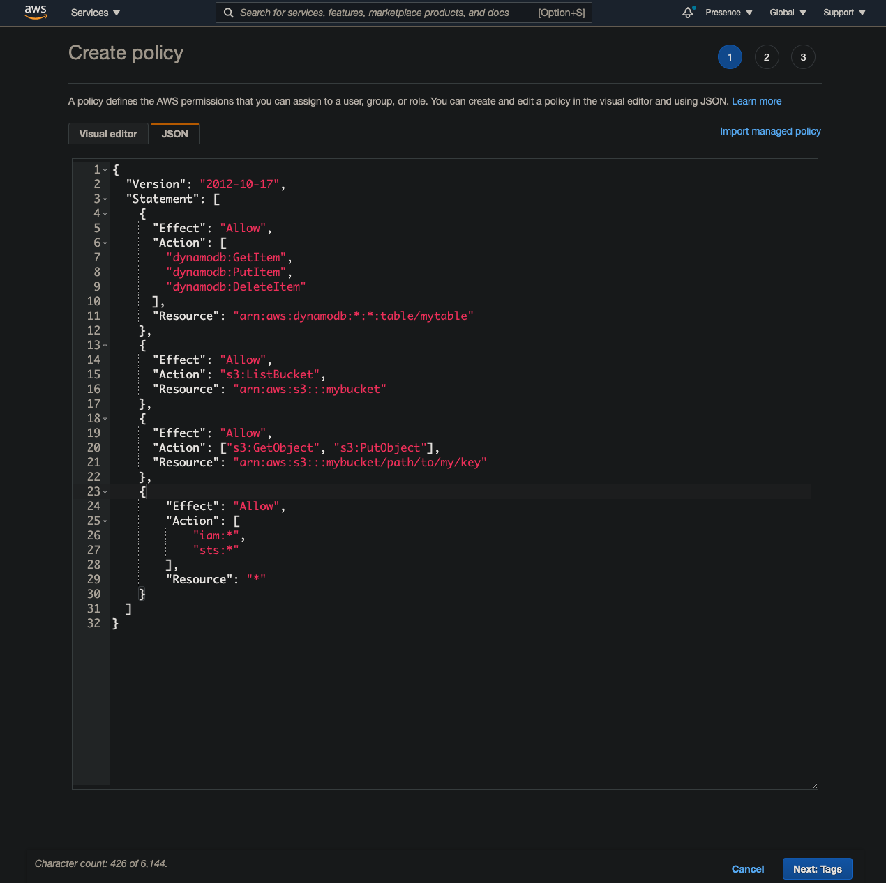

This is a full guide to locally develop and deploy a backend app with [a recently released container image feature for lambda on AWS](https://aws.amazon.com/blogs/aws/new-for-aws-lambda-container-image-support/). 

Needless to say, if you are a great fan of Docker, you would know how amazing it is. What you test on local is what you get when you deploy it, at least at the container level.

Since this feature is quite new, there has been **lots of rabbit holes** I fell into, and I'm sure others will too, so I will break every piece of rabbit hole down so that nobody gets trapped into it.

# Reason to use Terraform and SAM CLI together

Well, it seems that Terraform supports building a Docker image and deploying it to ECR out of the box, but after lots of digging, I noticed that things would get simpler if I just build docker image in another pipeline and deploy it with a few lines of shell script. So Terraform will used to define resources excluding the build and deployment process. There's no problem with that.

And, what SAM CLI? Terraform cannot replace SAM CLI and vice versa. SAM cli is useful in developing local lambdas because it automatically configures endpoints for each lambda and greatly removes barriers to the initial setup. Since lambda functions are 'special' in the way that they only get 'booted up and called' when they are invoked (unlike EC2 or Fargate), just writing a plain `.ts` file and `ts-node my-lambda.ts` would not make it work. Of course there are many other solutions to this matter (such as `sls`) but in this guide I will just use SAM CLI. But for many reasons SAM makes me want to use other better solutions if any... The reason follows right below.

_Disclaimer for the people who are looking for how to 'hot-reload' Dockerfile for typescript or javascript based lambda_: it won't work smoothly as of now. The best bet is to use `nodemon` to watch a certain directory to trigger `sam build` every single time, and in another shell launch `sam local start-api`. It works as expected, but the current problem I see from here is that every single time it `sam build`s, it would make another Docker image and another and so on, so there will be many useless dangling images stacked up in your drive, which you will need to delete manually because SAM CLI does not support passing in a argument that's equivalent to `docker run --rm`. Anyways that's the story, so this is the reason I might want to try some other solutions. [More on this on the relevant issue on Github](https://github.com/aws/aws-sam-cli/issues/921).

Ok. Now let's write some code.

# Setup AWS for Terraform

First, make sure that you've installed and authorized on your AWS CLI. Installing AWS CLI is kind of out of scope here, so [please follow the guide on AWS](https://docs.aws.amazon.com/cli/latest/userguide/install-cliv2-mac.html).

After successful installation, run:

```bash
aws configure
```

You will be prompted to enter Access Key ID and Secret Access Key. Depending on your situation, there are different ways of how you can handle this, but for the sake of simplicity we can make one user (from AWS console. You will probably only use it for 
'Programmatic access') that would have these policies for applying Terraform codes.


This one for setting S3 bucket as a backend:

```json
{
  "Version": "2012-10-17",
  "Statement": [
    {
      "Effect": "Allow",
      "Action": "s3:ListBucket",
      "Resource": "arn:aws:s3:::tf-backend"
    },
    {
      "Effect": "Allow",
      "Action": ["s3:GetObject", "s3:PutObject"],
      "Resource": "arn:aws:s3:::tf-backend/path/to/my/key"
    }
  ]
}
```

And this one for locking the state:

```json
{
  "Version": "2012-10-17",
  "Statement": [
    {
      "Effect": "Allow",
      "Action": [
        "dynamodb:GetItem",
        "dynamodb:PutItem",
        "dynamodb:DeleteItem"
      ],
      "Resource": "arn:aws:dynamodb:*:*:table/tf-state-locks"
    }
  ]
}
```

And the next one is quite tricky; because we will temporarily enable permissions related to managing IAM because we will first need to make a role from which we could `assumeRole` whenever we try to plan and apply our IaC.

For now we can just go onto AWS console and make this policy:

```json
{
    "Version": "2012-10-17",
    "Statement": [
        {
            "Sid": "VisualEditor0",
            "Effect": "Allow",
            "Action": [
                "iam:*",
                "sts:*"
            ],
            "Resource": "*"
        }
    ]
}
```

Make sure you will need to narrow down to specific actions and resources used after everything is done.



Now, now that you've made three distinct policies (or all in one, depending on your preferences), attach them to the user that you've just crated for running `aws configure`.

# Setup Terraform

If you haven't already, [install terraform by following an instruction from the official website](https://learn.hashicorp.com/tutorials/terraform/install-cli). Just download the binary and move it to the `bin` folder.

Now verify version of terraform

```bash
➜  test terraform --version
Terraform v0.14.5

Your version of Terraform is out of date! The latest version
is 0.14.8. You can update by downloading from https://www.terraform.io/downloads.html
```

And then make `main.tf` file in your project directory (I personally put it into `IaC` folder because there will another folder for the 'real' `.ts` codes for the backend):

## `main.tf`

```bash
terraform {
  required_providers {
    aws = {
      source  = "hashicorp/aws"
      version = "~> 3.27"
    }
  }
}

provider "aws" {
  profile = "default"
  region  = "us-west-2" # you will need to change this to your region
}
```

Now, run `terraform init`:

```bash
➜  test terraform init

Initializing the backend...

Initializing provider plugins...
- Finding hashicorp/aws versions matching "~> 3.27"...
- Installing hashicorp/aws v3.32.0...
- Installed hashicorp/aws v3.32.0 (signed by HashiCorp)

Terraform has created a lock file .terraform.lock.hcl to record the provider
selections it made above. Include this file in your version control repository
so that Terraform can guarantee to make the same selections by default when
you run "terraform init" in the future.

Terraform has been successfully initialized!

You may now begin working with Terraform. Try running "terraform plan" to see
any changes that are required for your infrastructure. All Terraform commands
should now work.

If you ever set or change modules or backend configuration for Terraform,
rerun this command to reinitialize your working directory. If you forget, other
commands will detect it and remind you to do so if necessary.
```

Then, we will need to add s3 backend and state locking. But before then, make a table on Dynamodb and also a bucket on S3, each for hosting IaC backend and locking the state.

Now we will need to add more to the policy on DynamoDB we created because we want to create a table:

```bash
  "dynamodb:CreateTable",
  "dynamodb:DescribeTable",
  "dynamodb:Scan",
  "dynamodb:Query",
```

Then you could write this code (by the way, it may be a good idea to put this below IaC in a different general-purpose repository because the current repository is meant to be only used for lambda-related resouces. But for the sake of this article I will just write it away here):

```bash
resource "aws_dynamodb_table" "terraform_state_lock" {
  name           = "tf-state-locks"
  read_capacity  = 5
  write_capacity = 5
  hash_key       = "LockID"
  attribute {
    name = "LockID"
    type = "S"
  }
}
```

And then, also add S3 backend (you will need to add relevant IAM policies too here, but since we know how to do it, I will cut the explanation):

```bash
resource "aws_s3_bucket" "b" {
  bucket = "tf-backend"
  acl    = "private"

  versioning {
    enabled = true
  }
}
```

Now, run `terraform apply`, verify the changes, and enter `yes`. DynamoDB table and S3 Bucket should have been created. Here's the code so far:

## `main.tf`

```bash
terraform {
  required_providers {
    aws = {
      source  = "hashicorp/aws"
      version = "~> 3.27"
    }
  }
}

provider "aws" {
  profile = "default"
  region  = "us-west-2" # you will need to change this to your region
}

+ resource "aws_dynamodb_table" "terraform_state_lock" {
+   name           = "tf-state-locks"
+   read_capacity  = 5
+   write_capacity = 5
+   hash_key       = "LockID"
+   attribute {
+     name = "LockID"
+     type = "S"
+   }
+ }

+  resource "aws_s3_bucket" "terraform_backend" {
+    bucket = "tf-backend"
+    acl    = "private"

+    versioning {
+      enabled = true
+   }
+  }
```

Now, add s3 backend and state lock:

```bash
terraform {
  required_providers {
    aws = {
      source  = "hashicorp/aws"
      version = "~> 3.27"
    }
  }
  backend "s3" {
    profile = "localtf"
    bucket  = "my-iac" # change the bucket name to yours
    key            = "your-stack-name"
    region         = "us-west-2" # change to your region
    dynamodb_table = "terraform-lock"
  }
}
```

We are also going to use Docker provider, so add that too:

## `main.tf`
```bash
terraform {
  required_providers {
    aws = {
      source  = "hashicorp/aws"
      version = "~> 3.27"
    }
 +  docker = {
 +    source  = "kreuzwerker/docker"
 +    version = ">= 2.8.0"
 +  }
  }
  backend "s3" {
    profile = "localtf"
    bucket  = "my-iac" # change the bucket name to yours
    key            = "your-stack-name"
    region         = "us-west-2" # change to your region
    dynamodb_table = "terraform-lock"
  }
}
```

Now because you've added a backend and another provider, we will need to run `terraform init` again, and then `terraform apply`. Run it.

