This is a full guide to locally develop and deploy a backend app with [a recently released container image feature for lambda on AWS](https://aws.amazon.com/blogs/aws/new-for-aws-lambda-container-image-support/). 

Needless to say, if you are a great fan of Docker, you would know how amazing it is. What you test on local is what you get when you deploy it, at least at the container level.

Since this feature is quite new, there have been **lots of rabbit holes** I fell into, and I'm sure others will too, so I will break every piece of rabbit hole down so that nobody gets trapped into it. This guide starts from the real basics like making a user or setting up terraform, so feel free to skip to the section you need.

```toc
# This code block gets replaced with the TOC
```

# Reason to use Terraform and SAM CLI together

Well, it seems that Terraform supports building a Docker image and deploying it to ECR out of the box, but after lots of digging, I noticed that things would get simpler if I just build docker image in another pipeline and deploy it with a few lines of shell script. So Terraform will used to define resources excluding the build and deployment process. There's no problem with that.

And, what SAM CLI? Terraform cannot replace SAM CLI and vice versa. SAM cli is useful in developing local lambdas because it automatically configures endpoints for each lambda and greatly removes barriers to the initial setup. Since lambda functions are 'special' in the way that they only get 'booted up and called' when they are invoked (unlike EC2 or Fargate), just doing `ts-node my-lambda.ts` would not make it work. Of course there are many other solutions to this matter (such as `sls`) but in this guide I will just use SAM CLI. But for many reasons SAM makes me want to use other better solutions if any... The reason follows right below.

_Disclaimer for the people who are looking for how to '**hot-reload**' Dockerfile for typescript or javascript based lambda_: it won't work smoothly as of now. The best bet is to use `nodemon` to watch a certain directory to trigger `sam build` every single time, and in another shell launch `sam local start-api`. It works as expected, but the current problem I see from here is that every single time it `sam build`s, it would make another Docker image and another and so on, so there will be many useless dangling images stacked up in your drive, which you will need to delete manually because SAM CLI does not support passing in a argument that's equivalent to `docker run --rm`. Anyways that's the story, so this is the reason I might want to try some other solutions. [More on this on the relevant issue on Github](https://github.com/aws/aws-sam-cli/issues/921). Please let me know if any of you had a good experience with `sls` because I haven't used it much yet.

Ok. Now let's write some code.

# Setup AWS for Terraform

First, make sure that you've installed and authorized on your AWS CLI. Installing AWS CLI is kind of out of scope here, so [please follow the guide on AWS](https://docs.aws.amazon.com/cli/latest/userguide/install-cliv2-mac.html).

After successful installation, run:

```tf
aws configure
```

You will be prompted to enter Access Key ID and Secret Access Key. Depending on your situation, there are different ways of how you can handle this, but for the sake of simplicity we can make one user (from AWS console. You will probably only use it for 
'Programmatic access') that would have these policies for applying Terraform codes.

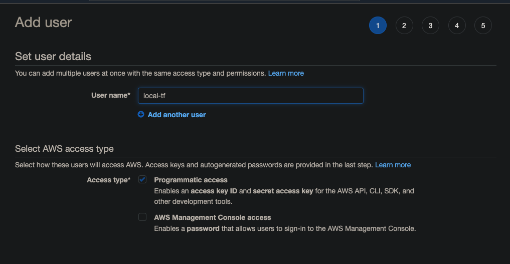

This one for setting S3 bucket as a backend:

```json
{
  "Version": "2012-10-17",
  "Statement": [
    {
      "Effect": "Allow",
      "Action": "s3:ListBucket",
      "Resource": "arn:aws:s3:::tf-backend"
    },
    {
      "Effect": "Allow",
      "Action": ["s3:GetObject", "s3:PutObject"],
      "Resource": "arn:aws:s3:::tf-backend/path/to/my/key"
    }
  ]
}
```

And this one for locking the state:

```json
{
  "Version": "2012-10-17",
  "Statement": [
    {
      "Effect": "Allow",
      "Action": [
        "dynamodb:GetItem",
        "dynamodb:PutItem",
        "dynamodb:DeleteItem"
      ],
      "Resource": "arn:aws:dynamodb:*:*:table/tf-state-locks"
    }
  ]
}
```

And the next one is quite tricky; because we will temporarily enable permissions related to managing IAM because we will first need to make a role from which we could `assumeRole` whenever we try to plan and apply our IaC.

For now we can just go onto AWS console and make this policy:

```json
{
    "Version": "2012-10-17",
    "Statement": [
        {
            "Sid": "VisualEditor0",
            "Effect": "Allow",
            "Action": [
                "iam:*",
                "sts:*"
            ],
            "Resource": "*"
        }
    ]
}
```

Make sure you will need to narrow down to specific actions and resources used after everything is done.

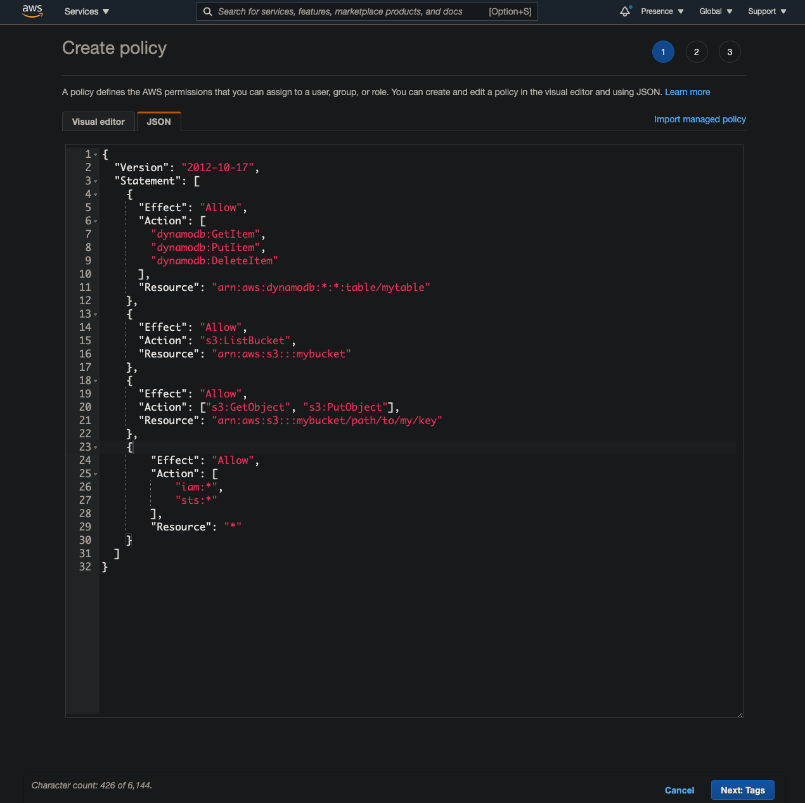

Now, now that you've made three distinct policies (or all in one, depending on your preferences), attach them to the user that you've just crated for running `aws configure`.

# Setup Terraform

If you haven't already, [install terraform by following an instruction from the official website](https://learn.hashicorp.com/tutorials/terraform/install-cli). Just download the binary and move it to the `bin` folder.

Now verify version of terraform

```tf
➜  test terraform --version
Terraform v0.14.5

Your version of Terraform is out of date! The latest version
is 0.14.8. You can update by downloading from https://www.terraform.io/downloads.html
```

And then make `main.tf` file in your project directory (I personally put it into `IaC` folder because there will another folder for the 'real' `.ts` codes for the backend):

## `main.tf`

```tf
terraform {
  required_providers {
    aws = {
      source  = "hashicorp/aws"
      version = "~> 3.27"
    }
  }
}

provider "aws" {
  profile = "default"
  region  = "us-west-2" # you will need to change this to your region
}
```

Now, run `terraform init`:

```tf
➜  test terraform init

Initializing the backend...

Initializing provider plugins...
- Finding hashicorp/aws versions matching "~> 3.27"...
- Installing hashicorp/aws v3.32.0...
- Installed hashicorp/aws v3.32.0 (signed by HashiCorp)

Terraform has created a lock file .terraform.lock.hcl to record the provider
selections it made above. Include this file in your version control repository
so that Terraform can guarantee to make the same selections by default when
you run "terraform init" in the future.

Terraform has been successfully initialized!

You may now begin working with Terraform. Try running "terraform plan" to see
any changes that are required for your infrastructure. All Terraform commands
should now work.

If you ever set or change modules or backend configuration for Terraform,
rerun this command to reinitialize your working directory. If you forget, other
commands will detect it and remind you to do so if necessary.
```

Then, we will need to add s3 backend and state locking. But before then, make a table on Dynamodb and also a bucket on S3, each for hosting IaC backend and locking the state.

Now we will need to add more to the policy on DynamoDB we created because we want to create a table:

```tf
  "dynamodb:CreateTable",
  "dynamodb:DescribeTable",
  "dynamodb:Scan",
  "dynamodb:Query",
```

Then you could write this code (by the way, it may be a good idea to put this below IaC in a different general-purpose repository because the current repository is meant to be only used for lambda-related resouces. But for the sake of this article I will just write it away here):

```tf
resource "aws_dynamodb_table" "terraform_state_lock" {
  name           = "tf-state-locks"
  read_capacity  = 5
  write_capacity = 5
  hash_key       = "LockID"
  attribute {
    name = "LockID"
    type = "S"
  }
}
```

And then, also add S3 backend (you will need to add relevant IAM policies too here, but since we know how to do it, I will cut the explanation):

```tf
resource "aws_s3_bucket" "b" {
  bucket = "tf-backend"
  acl    = "private"

  versioning {
    enabled = true
  }
}
```

Now, run `terraform apply`, verify the changes, and enter `yes`. DynamoDB table and S3 Bucket should have been created. Here's the code so far:

## `main.tf`

```tf
terraform {
  required_providers {
    aws = {
      source  = "hashicorp/aws"
      version = "~> 3.27"
    }
  }
}

provider "aws" {
  profile = "default"
  region  = "us-west-2" # you will need to change this to your region
}

+ resource "aws_dynamodb_table" "terraform_state_lock" {
+   name           = "tf-state-locks"
+   read_capacity  = 5
+   write_capacity = 5
+   hash_key       = "LockID"
+   attribute {
+     name = "LockID"
+     type = "S"
+   }
+ }

+  resource "aws_s3_bucket" "terraform_backend" {
+    bucket = "tf-backend"
+    acl    = "private"

+    versioning {
+      enabled = true
+   }
+  }
```

Now, add s3 backend and state lock:

```tf
terraform {
  required_providers {
    aws = {
      source  = "hashicorp/aws"
      version = "~> 3.27"
    }
  }
+ backend "s3" {
+   profile = "localtf"
+   bucket  = "my-iac" # change the bucket name to yours
+   key            = "your-stack-name"
+   region         = "us-west-2" # change to your region
+   dynamodb_table = "terraform-lock"
+ }
}

provider "aws" {
  profile = "default"
  region  = "us-west-2" # you will need to change this to your region
}

resource "aws_dynamodb_table" "terraform_state_lock" {
  name           = "tf-state-locks"
  read_capacity  = 5
  write_capacity = 5
  hash_key       = "LockID"
  attribute {
    name = "LockID"
    type = "S"
  }
}

 resource "aws_s3_bucket" "terraform_backend" {
   bucket = "tf-backend"
   acl    = "private"

   versioning {
     enabled = true
  }
 }
```

We are also going to use Docker provider, so add that too:

## `main.tf`
```tf
terraform {
  required_providers {
    aws = {
      source  = "hashicorp/aws"
      version = "~> 3.27"
    }
 +  docker = {
 +    source  = "kreuzwerker/docker"
 +    version = ">= 2.8.0"
 +  }
  }
  backend "s3" {
    profile = "localtf"
    bucket  = "my-iac" # change the bucket name to yours
    key            = "your-stack-name"
    region         = "us-west-2" # change to your region
    dynamodb_table = "terraform-lock"
  }
}


provider "aws" {
  profile = "default"
  region  = "us-west-2" # you will need to change this to your region
}

resource "aws_dynamodb_table" "terraform_state_lock" {
  name           = "tf-state-locks"
  read_capacity  = 5
  write_capacity = 5
  hash_key       = "LockID"
  attribute {
    name = "LockID"
    type = "S"
  }
}

 resource "aws_s3_bucket" "terraform_backend" {
   bucket = "tf-backend"
   acl    = "private"

   versioning {
     enabled = true
  }
 }
```

Now because you've added a backend and another provider, we will need to run `terraform init` again, and then `terraform apply`. Run it.

# Setting up lambda

Now we will need to develop lambda on the local machine. Install SAM CLI:

```tf
brew tap aws/tap

brew install aws-sam-cli
```

Note that the outdated versions would not support running Docker containers, so make sure that your version is the latest.

```tf
test:(dev) sam --version
SAM CLI, version 1.20.0
```

Now, we won't run `sam --init`, because it will make it difficult to make the server into a monorepo structure. The reason that we will want to make it into a monorepo is that it will make it much easier to propery dockerize every single lambda and deploy it with dependencies that each of them only require to have. Instead we will use _lerna_ to initialize the server folder.

```tf
mkdir server
```

```tf
|
- IaC
- server
```

And as usual:

```tf
cd server

npm i -g lerna

lerna init
```

Then it will give you this layout:

```tf
➜  test git:(master) ✗ tree
.
├── IaC
│   └── main.tf
└── server
    ├── lerna.json
    ├── package.json
    └── packages
```

Then, add your first function package. For the sake of this example, let's assume that we want to make a REST API, composed of many lambdas, each returning 'hello' as a response in different languages (which is totally useless in reality, but at least useful here). Our first lambda will be an English one.

```tf
➜  server git:(master) ✗ lerna create hello
lerna notice cli v3.18.1
lerna WARN ENOREMOTE No git remote found, skipping repository property
package name: (hello) ls
version: (0.0.0)
description:
keywords:
homepage:
license: (ISC)
entry point: (lib/hello.js)
git repository:
About to write to /Users/jm/Desktop/test/test/server/packages/hello/package.json:

{
  "name": "ls",
  "version": "0.0.0",
  "description": "> TODO: description",
  "author": "9oelM",
  "homepage": "",
  "license": "ISC",
  "main": "lib/hello.js",
  "directories": {
    "lib": "lib",
    "test": "__tests__"
  },
  "files": [
    "lib"
  ],
  "scripts": {
    "test": "echo \"Error: run tests from root\" && exit 1"
  }
}


Is this OK? (yes)
lerna success create New package ls created at ./packages/hello
```

Now the directory structure will look like this:

```tf
➜  test git:(master) ✗ tree -I node_modules
.
├── IaC
│   └── main.tf
└── server
    ├── lerna.json
    ├── package.json
    └── packages
        └── hello
            ├── README.md
            ├── __tests__
            │   └── hello.test.js
            ├── lib
            │   └── hello.js
            └── package.json

6 directories, 7 files
```

Now, under `server`, we will need to add some utils to build and invoke the function locally. Add modify the `server/package.json` as follows and of course, run `npm i` again:

```json
{
  "devDependencies": {
    "@types/node": "^14.14.32",
    "concurrently": "^6.0.0",
    "lerna": "^4.0.0",
    "nodemon": "^2.0.7",
  },
  "scripts": {
    "start": "concurrently \"npm run watch\" \"npm run api\"",
    "watch": "nodemon",
    "api": "sam local start-api"
  },
  "name": "server"
}
```

To add some explanatioon to what we are trying to do: these `devDependencies` are going to be package-wide dependencies. These are not specific to any one of the functions that we are going to build; They will help in tooling general stuffs. That's what we put them here.

Dependencies:

- `@types/node`: we will need this to give proper type definitions for 'built-in node' modules like `fs` or `path`.
- `concurrently`: just a script runner.
- `lerna`: you know it.
- `nodemon`: this will help us watch a directory and build Docker image again.

Scripts:

- `start`, `watch`, `api`: we will need these to launch our lambda function locally and invoke it.

Now, you need to create `template.yml` for SAM cli to consume and run what we want to run.

```yml
AWSTemplateFormatVersion: '2010-09-09'
Transform: AWS::Serverless-2016-10-31
Description: >
  hello api
  
Globals:
  Function:
    Timeout: 3

Resources:
  helloRoomFunction:
    Type: AWS::Serverless::Function
    Metadata:
      DockerTag: nodejs14.x-v1
      DockerContext: ./packages/hello
      Dockerfile: Dockerfile
    Properties:
      # will automatically use local one if testing on local
      ImageUri: {your-aws-account-id}.dkr.ecr.{your-aws-region}.amazonaws.com/dev-hello
      # Note: If the PackageType property is set to Image, then either ImageUri is required, 
      # or you must or you must build your application with necessary Metadata entries in the AWS SAM template file. 
      # For more information, see Building applications.
      PackageType: Image
      FunctionName: HelloInEngFunction
      Events:
        helloRoom:
          Type: Api
          Properties:
            Path: /hello
            Method: get
```

We won't be able to run `sam build` or `sam local start-api` yet, because we still need to setup `Dockerfile` and ECR repository.

So far we have added `template.yml` for running SAM CLI:

```tf
➜  server git:(master) ✗ tree -I node_modules
.
├── lerna.json
├── package.json
├── packages
│   └── hello
│       ├── README.md
│       ├── __tests__
│       │   └── hello.test.js
│       ├── lib
│       │   └── hello.js
│       └── package.json
└── template.yml
```

Now we will add `Dockerfile` in `packages/hello/`.

```tf
cd packages/hello

touch Dockerfile
```

This will be the content for Dockerfile:

```dockerfile
FROM amazon/aws-lambda-nodejs:14 AS builder
WORKDIR /usr/app

COPY package*.json tsconfig.json ./
RUN npm install

COPY ./lib ./lib/
RUN npm run build

RUN ls -la # for debugging

FROM amazon/aws-lambda-nodejs:14
# CMD ["path-to-file.function-name"]
WORKDIR /usr/app

COPY package*.json ./
RUN npm install --only=prod
COPY --from=builder /usr/app/lib /usr/app/lib
CMD [ "/usr/app/lib/index.handler" ]
```

To go through it line by line:

- `amazon/aws-lambda-nodejs:14` is the official amazon image for lambda. Current LTS of nodejs is 14, so we are using this. `AS builder` is related to multi-stage builds in Docker; it helps reduce the final Docker image size. Basically in this `builder` stage, we will only build the output to be included in the final image, and any dependencies installed in this step won't be included in the final output image.
- `WORKDIR /usr/app`: inside the docker image, set the working directory as `/usr/app`. There isn't any `app` folder in a normal docker image, so it will make `app` directory. We will put the compiled js code there.
- `COPY package*.json tsconfig.json ./`: we need these files for compiling typescript into javascriptt files.
- `npm install`: it will install dependencies.
- `npm run build`: it will compile typescript code into js.
- `RUN ls -la # for debugging`: it is merely for debugging. While building, docker will output what's inside there at that time, for you to verify if you are doing what you intended to do.
- `FROM amazon/aws-lambda-nodejs:14`: this is the second build stage in Docker. All outputs from the previous stage will be discarded in this stage unless explicitly specified to be included.
- `RUN npm install --only=prod`: it will only install `dependencies` but `devDepdencies`.
- `COPY --from=builder /usr/app/lib /usr/app/lib`: it explicitly refers to the previous `builder` stage to copy whatever that was inside `/usr/app/lib` to the current `/usr/app/lib`. In this case, it will copy all compiled javascript code.
- `CMD [ "/usr/app/lib/index.handler" ]`: the command should be `path-to-lambda-handler-without-extension.handler`. That's just how it works.

Now we've added a Dockerfile. Now let's setup basic environment for lambda:

```tf
cd packages/hello

➜  hello git:(master) ✗ tsc --init
message TS6071: Successfully created a tsconfig.json file.
```

You will need to modify `tsconfig` to use modern javascript features; Most prominently, add the following. This will allow you to use `Promise` API. I recommend turning other options too, especially those related to strict-type checking:

```json
{
  "compilerOptions": {
    /* Basic Options */
    // "incremental": true,                   /* Enable incremental compilation */
    "target": "es5",                          /* Specify ECMAScript target version: 'ES3' (default), 'ES5', 'ES2015', 'ES2016', 'ES2017', 'ES2018', 'ES2019' or 'ESNEXT'. */
    "module": "commonjs",                     /* Specify module code generation: 'none', 'commonjs', 'amd', 'system', 'umd', 'es2015', or 'ESNext'. */
-    "lib": [],                             /* Specify library files to be included in the compilation. */
+    "lib": ["ES2015"],                             /* Specify library files to be included in the compilation. */
    // "allowJs": true,                       /* Allow javascript files to be compiled. */
    // "checkJs": true,                       /* Report errors in .js files. */
    // "jsx": "preserve",                     /* Specify JSX code generation: 'preserve', 'react-native', or 'react'. */
    // "declaration": true,                   /* Generates corresponding '.d.ts' file. */
    // "declarationMap": true,                /* Generates a sourcemap for each corresponding '.d.ts' file. */
    // "sourceMap": true,                     /* Generates corresponding '.map' file. */
    // "outFile": "./",                       /* Concatenate and emit output to single file. */
    // "outDir": "./",                        /* Redirect output structure to the directory. */
    // "rootDir": "./",                       /* Specify the root directory of input files. Use to control the output directory structure with --outDir. */
    // "composite": true,                     /* Enable project compilation */
    // "tsBuildInfoFile": "./",               /* Specify file to store incremental compilation information */
    // "removeComments": true,                /* Do not emit comments to output. */
    // "noEmit": true,                        /* Do not emit outputs. */
    // "importHelpers": true,                 /* Import emit helpers from 'tslib'. */
-    // "downlevelIteration": true,            /* Provide full support for iterables in 'for-of', spread, and destructuring when targeting 'ES5' or 'ES3'. */
+    "downlevelIteration": true,            /* Provide full support for iterables in 'for-of', spread, and destructuring when targeting 'ES5' or 'ES3'. */
    // "isolatedModules": true,               /* Transpile each file as a separate module (similar to 'ts.transpileModule'). */

    /* Strict Type-Checking Options */
    "strict": true,                           /* Enable all strict type-checking options. */
    // "noImplicitAny": true,                 /* Raise error on expressions and declarations with an implied 'any' type. */
    // "strictNullChecks": true,              /* Enable strict null checks. */
    // "strictFunctionTypes": true,           /* Enable strict checking of function types. */
    // "strictBindCallApply": true,           /* Enable strict 'bind', 'call', and 'apply' methods on functions. */
    // "strictPropertyInitialization": true,  /* Enable strict checking of property initialization in classes. */
    // "noImplicitThis": true,                /* Raise error on 'this' expressions with an implied 'any' type. */
    // "alwaysStrict": true,                  /* Parse in strict mode and emit "use strict" for each source file. */

    /* Additional Checks */
    // "noUnusedLocals": true,                /* Report errors on unused locals. */
    // "noUnusedParameters": true,            /* Report errors on unused parameters. */
    // "noImplicitReturns": true,             /* Report error when not all code paths in function return a value. */
    // "noFallthroughCasesInSwitch": true,    /* Report errors for fallthrough cases in switch statement. */

    /* Module Resolution Options */
    // "moduleResolution": "node",            /* Specify module resolution strategy: 'node' (Node.js) or 'classic' (TypeScript pre-1.6). */
    // "baseUrl": "./",                       /* Base directory to resolve non-absolute module names. */
    // "paths": {},                           /* A series of entries which re-map imports to lookup locations relative to the 'baseUrl'. */
    // "rootDirs": [],                        /* List of root folders whose combined content represents the structure of the project at runtime. */
    // "typeRoots": [],                       /* List of folders to include type definitions from. */
    // "types": [],                           /* Type declaration files to be included in compilation. */
    // "allowSyntheticDefaultImports": true,  /* Allow default imports from modules with no default export. This does not affect code emit, just typechecking. */
    "esModuleInterop": true                   /* Enables emit interoperability between CommonJS and ES Modules via creation of namespace objects for all imports. Implies 'allowSyntheticDefaultImports'. */
    // "preserveSymlinks": true,              /* Do not resolve the real path of symlinks. */
    // "allowUmdGlobalAccess": true,          /* Allow accessing UMD globals from modules. */

    /* Source Map Options */
    // "sourceRoot": "",                      /* Specify the location where debugger should locate TypeScript files instead of source locations. */
    // "mapRoot": "",                         /* Specify the location where debugger should locate map files instead of generated locations. */
    // "inlineSourceMap": true,               /* Emit a single file with source maps instead of having a separate file. */
    // "inlineSources": true,                 /* Emit the source alongside the sourcemaps within a single file; requires '--inlineSourceMap' or '--sourceMap' to be set. */

    /* Experimental Options */
    // "experimentalDecorators": true,        /* Enables experimental support for ES7 decorators. */
    // "emitDecoratorMetadata": true,         /* Enables experimental support for emitting type metadata for decorators. */
  }
}
```

Modify `packages/hello/package.json` too. Be noted that any dependencies you add to be included in the final, compiled output code (javascript) will need to be added to `dependencies`, not `devDependencies`:

## `packages/hello/package.json`

```json
{
  "name": "hello",
  "version": "1.0.0",
  "main": "index.js",
  "license": "MIT",
  "scripts": {
    "build": "tsc --project ./tsconfig.json"
  },
  "devDependencies": {
    "@types/aws-lambda": "^8.10.72",
    "typescript": "^4.2.3"
  }
}
```

Now, add a really simple lambda:

## `packages/hello/lib/index.ts`

```ts
import {
  APIGatewayProxyEvent,
  APIGatewayProxyResult
} from "aws-lambda";

export const handler = async (
  event: APIGatewayProxyEvent
): Promise<APIGatewayProxyResult> => {
  return {
    statusCode: 200,
    body: `hello`
  }
}
```

So far, we have created these:
```tf
➜  server git:(master) ✗ tree -I node_modules
.
├── lerna.json
├── package.json
├── packages
│   └── hello
│       ├── Dockerfile
│       ├── README.md
│       ├── __tests__
│       │   └── hello.test.js
│       ├── lib
│       │   ├── hello.js
│       │   └── index.ts
│       ├── package.json
│       └── tsconfig.json
└── template.yml
```

Now, create `nodemon.json` under `server/` to watch and build files:

## `nodemon.json`
```json
{
  "watch": ["packages"],
  "ext": "ts,json,js",
  "ignore": ["src/**/*.spec.ts", "./**/node_modules", "node_modules", ".aws-sam"],
  "exec": "sam build --template-file ./template.yml"
}
```

After creating `nodemon.json`, you can start running `npm run watch` or `npm start`. It would do two things: build Dockerfile as you make any changes under `packages/` directory, and host a local endpoint for the lambda. It will be similar to hot-reload although it seems more like a hack; you won't need to cancel and run `sam local start-api` again once you make a change. If it does not work, try again after creating ECR first.

```tf
➜  server git:(master) ✗ npm run watch

> server@ watch ~/example-lambda/server
> nodemon

[nodemon] 2.0.7
[nodemon] to restart at any time, enter `rs`
[nodemon] watching path(s): packages/**/*
[nodemon] watching extensions: ts,json,js
[nodemon] starting `sam build --template-file ./template.yml`

...

```

Oh, and you can delete `__tests__` and `lib/hello.js` because we are not using them. Anyways, now we are kind of ready to build this function into a docker image. Let's try it:

```tf
➜  packages git:(master) ✗ cd hello
➜  hello git:(master) ✗ pwd
/Users/jm/Desktop/test/test/server/packages/hello
➜  hello git:(master) ✗ docker build -t hello .
[+] Building 2.3s (15/15) FINISHED
 => [internal] load build definition from Dockerfile                                                                                             0.0s
 => => transferring dockerfile: 445B                                                                                                             0.0s
 => [internal] load .dockerignore                                                                                                                0.0s
 => => transferring context: 2B                                                                                                                  0.0s
 => [internal] load metadata for docker.io/amazon/aws-lambda-nodejs:14                                                                           0.0s
 => [internal] load build context                                                                                                                0.0s
 => => transferring context: 438B                                                                                                                0.0s
 => [builder 1/7] FROM docker.io/amazon/aws-lambda-nodejs:14                                                                                     0.0s
 => CACHED [builder 2/7] WORKDIR /usr/app                                                                                                        0.0s
 => CACHED [stage-1 3/5] COPY package*.json ./                                                                                                   0.0s
 => CACHED [stage-1 4/5] RUN npm install --only=prod                                                                                             0.0s
 => CACHED [builder 3/7] COPY package*.json tsconfig.json ./                                                                                     0.0s
 => CACHED [builder 4/7] RUN npm install                                                                                                         0.0s
 => [builder 5/7] COPY ./lib ./lib/                                                                                                              0.0s
 => [builder 6/7] RUN npm run build                                                                                                              1.6s
 => [builder 7/7] RUN ls -la # for debugging                                                                                                     0.3s
 => [stage-1 5/5] COPY --from=builder /usr/app/lib /usr/app/lib                                                                                  0.1s
 => exporting to image                                                                                                                           0.1s
 => => exporting layers                                                                                                                          0.0s
 => => writing image sha256:f2d79403b039ee76e286564e93382d3e1268024fd053f2f8e0e8c6f5d73b1403                                                     0.0s
 => => naming to docker.io/library/hello                                                                                                         0.0s
```

Everything's cool, docker build succeeded. You can try running the image and test the request:

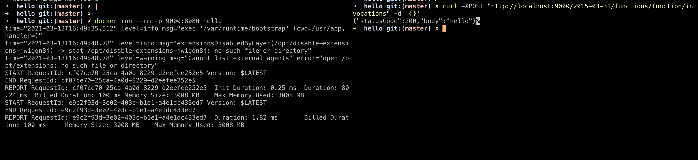

This is where SAM CLI should start to come in. But before then, we will need to make a ECR repository with terraform. Let's go back to terraform for a while.

# Back to terraform: assume role and ECR

Now, we will need to create a role first because we will relay on that role to get required permissions to create whatever resource we want to. This is called 'assuming a role', and the reason why it's deemed to be a good practice is that you won't have to create multiple credentials (probably multiple users) to do certain thing that requires permissions. Instead, you _borrow_ the permission for the period of time when you plan and apply the changes in the resources.

So how do we do it? First, let's create `hello_role.tf`:

## `hello_role.tf`

```tf
resource "aws_iam_role" "hello" {
  name = "hello_role"
  assume_role_policy = jsonencode({
    "Version" : "2012-10-17",
    "Statement" : [
      {
        "Effect" : "Allow",
        "Principal" : {
          # this should be set as the 'default' user on your AWS cli.
          # get 'localtf' user's ARN from AWS IAM console
          # it should look like: arn:aws:iam::{aws-account-id}:user/localtf
          # example: arn:aws:iam::123456789:user/localtf
          "AWS" : "arn:aws:iam::123456789:user/localtf"
          "Service" : [
            "lambda.amazonaws.com"
          ]
        },
        "Action" : "sts:AssumeRole"
      }
    ]
  })
}

resource "aws_iam_policy" "hello" {
  name        = "hello_policy"
  description = "policy needed to run hello server stack"

  policy = jsonencode({
    "Version" : "2012-10-17",
    "Statement" : [
      {
        "Action" : [
          "lambda:*",
          "iam:*",
          "ecr:*",
          "cloudformation:*",
          "apigateway:*",
          "logs:*",
          "route53:*",
          "acm:*",
          "cloudfront:*",
          "ec2:*"
        ],
        "Effect" : "Allow",
        "Resource" : "*"
      }
    ]
  })
}

resource "aws_iam_role_policy_attachment" "hello" {
  role       = aws_iam_role.hello.name
  policy_arn = aws_iam_policy.hello.arn
}
```

For the sake of this article, we won't be diving deep into specific policies, so we will just allow almost all resources without specifying them in detail. For real-world usage, you will have to define exact statements giving just the right permissions.

What we are doing here, essentially, is that we are allowing `localtf` user to assume the role of `hello_role` that possesses all policies to run the hello server stack. This is called 'creating a trust relationship' (you will see this if you do this process on AWS). This way, `localtf` won't always have to hold all permissions it needs. It only acquires them only when needed (i.e. deploying)

Once you are done writing `hello_role.tf`, run `terraform apply` to make changes.

Now, go back to `main.tf` and add:

```tf
terraform {
  required_providers {
    aws = {
      source  = "hashicorp/aws"
      version = "~> 3.27"
    }
   docker = {
     source  = "kreuzwerker/docker"
     version = ">= 2.8.0"
   }
  }
  backend "s3" {
    profile = "localtf"
    bucket  = "my-iac" # change the bucket name to yours
    key            = "your-stack-name"
    region         = "us-west-2" # change to your region
    dynamodb_table = "terraform-lock"
  }
}

provider "aws" {
  profile = "default"
  region  = "us-west-2" # you will need to change this to your region
+ assume_role {
+   role_arn     = "arn:aws:iam::{your-account-id}:role/hello_role"
+   session_name = "terraform"
+ }
}

# you can create this resource in other repository because it's not specific to this project
# resource "aws_dynamodb_table" "terraform_state_lock" {
#   name           = "tf-state-locks"
#   read_capacity  = 5
#   write_capacity = 5
#   hash_key       = "LockID"
#   attribute {
#     name = "LockID"
#     type = "S"
#   }
# }

# you can create this resource in other repository because it's not specific to this project
# resource "aws_s3_bucket" "terraform_backend" {
#   bucket = "tf-backend"
#   acl    = "private"

#   versioning {
#     enabled = true
#   }
# }
```

Once you add `assume_role`, now you can create any resources you want, using the permissions given by that role. Let's now make an ECR repository. Make `ecr.tf`:

## `ecr.tf`
```tf
resource "aws_ecr_repository" "hello" {
  name                 = "${terraform.workspace}-hello"
  image_tag_mutability = "MUTABLE" # you are going to be overwriting 'latest' tagged image.

  image_scanning_configuration {
    scan_on_push = true
  }

  depends_on = [aws_iam_role_policy_attachment.hello]
}

data "aws_ecr_image" "latest" {
  repository_name = aws_ecr_repository.hello.name # from hello_role.tf
  image_tag       = "latest"
}
```

Run `apply` and terraform will soon make ECR.

# Building and pushing the image to ECR

Now that we've made an ECR, we can go back to our server and write a little script to login, build and push the image of the lambda we are writing.

It's pretty much straightforward; just get your AWS cli ready for using; and authenticate to be able to use ECR from Docker CLI:

## `login-docker.sh`
```tf
aws ecr get-login-password --region {your-region} | docker login --username AWS --password-stdin {your-account-id}.dkr.ecr.{your-region}.amazonaws.com
```

Next, tag your Docker image as `latest` and separate timestamnp at the time of the build, so that latest tag will always be the latest built image, and then another image will remain for the record, which you can use later to revert back or do other things in some cases.

## `build-and-push-docker-image.sh`
```tf
DEV_HELLO_REPO_URI="{your-account-id}.dkr.ecr.{your-region}.amazonaws.com/dev-hello"

# change to your region for the ease of finding Docker images later
timestamp=$(TZ=":Asia/Seoul" date +%Y%m%d%H%M%S)

docker build -t "${DEV_HELLO_REPO_URI}:latest" -t "${DEV_HELLO_REPO_URI}:${timestamp}" ./packages/hello

docker push "${DEV_HELLO_REPO_URI}:latest"
docker push "${DEV_HELLO_REPO_URI}:${timestamp}"
```

Now, you can test it out yourself as such:

```tf
# get AWS CLI logged in and ready before as previously explained
cd server

chmod u+x login-docker.sh
chmod u+x build-and-push-docker-image.sh

./login-docker.sh
./build-and-push-docker-image.sh
```

After this, you will be able to see on AWS ECR:

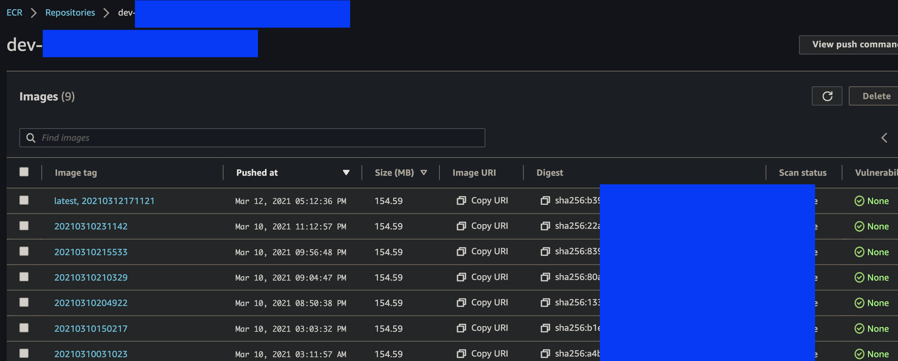

as you can see, the images are going to be tagged by timestamp, and the latest built image will be always tagged as `latest`, and you are going to reference this tag in Terraform to apply newly built Docker image to lambda.

So far, we've made changes like so:

```tf
➜  example-lambda git:(master) tree -I node_modules
.
├── IaC
│   ├── ecr.tf
│   ├── hello_role.tf
│   └── main.tf
└── server
    ├── build-and-push-docker-image.sh
    ├── lerna.json
    ├── login-docker.sh
    ├── nodemon.json
    ├── package-lock.json
    ├── package.json
    ├── packages
    │   └── hello
    │       ├── Dockerfile
    │       ├── README.md
    │       ├── lib
    │       │   └── index.ts
    │       ├── package-lock.json
    │       ├── package.json
    │       └── tsconfig.json
    └── template.yml

5 directories, 17 files
```

# Creating Terraform resources for lambda and API gateway

Now the majority of the prepartion is done, so we can move onto creating actual lambda and API gateway.

## `lambda.tf` 

First, the most important part: you want to create lambda itself from Docker.

```tf
module "lambda_function_container_image" {
  version = "1.43.0"
  source  = "terraform-aws-modules/lambda/aws"

  function_name = "${terraform.workspace}-HelloEngFunction"
  description   = "GET /hello"

  create_package = false

  # this will allow Terraform to detect changes in the docker image because
  # a new image will have a different SHA (digest).
  image_uri    = "{your-account-id}.dkr.ecr.{your-region}.amazonaws.com/${aws_ecr_repository.hello.name}@${data.aws_ecr_image.latest.image_digest}"
  package_type = "Image"
}
```

There is already a module just made for this, so use it to make lambda. Once you are done, `apply` the changes.

The key here is that you are going to reference an image URI from ECR where the tag is the latest. If you have previously built and pushed a new docker image, the hash of the image is going to be different, thus causing a redeployment of the lambda function. Otherwise it has no idea if the docker image is new or not.

Again, after running the change, you can see the lambda on AWS console:

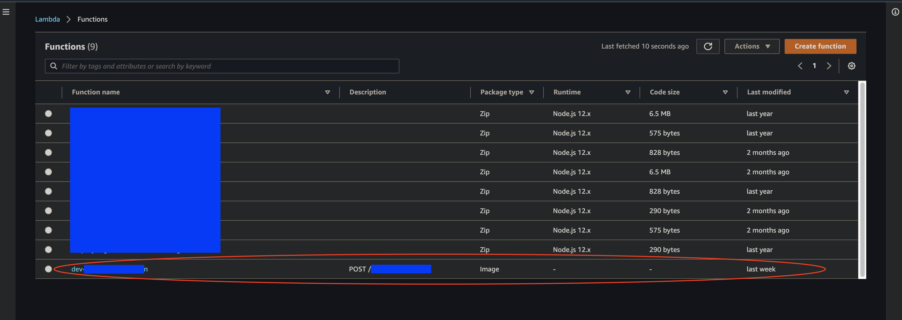

as you can see, compared to other lambdas, it has the package type of 'Image', which means it's not from a Zip, but a Docker image.

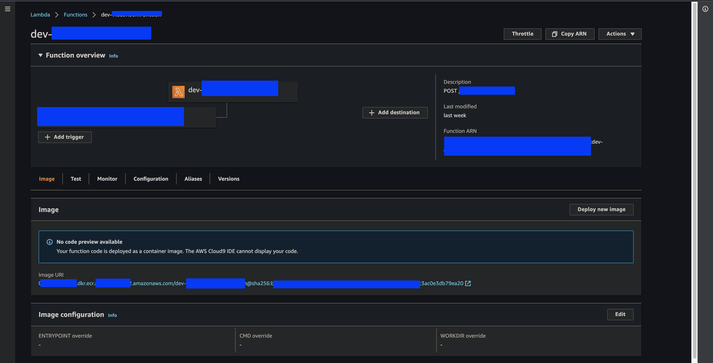

You should be able to see the image URI (including the hash) of the image at the bottom of the information about lambda. If you click on that image URI, you will be navigated to the latest image on ECR that you just built and pushed.

## `api_gateway.tf`

Now, you will be able to test lambda on AWS Lambda console, but what we want in the end is something like sending GET `/hello` to a certain domain and receiving a response. To be able to do that, we need to setup API Gateway. 

For this example, we will setup a domain at `api.hello.com`.

Here's how: 

```tf
resource "aws_api_gateway_rest_api" "hello" {
  description = "all APIs related to api.hello.com"
  name = "hello-api"
}

resource "aws_api_gateway_resource" "hello_eng" {
  path_part   = "hello" # later, you will want to add another path for /bonjour, and so on
  parent_id   = aws_api_gateway_rest_api.hello.root_resource_id
  rest_api_id = aws_api_gateway_rest_api.hello.id
}

resource "aws_api_gateway_method" "hello_eng" {
  rest_api_id   = aws_api_gateway_rest_api.hello.id
  resource_id   = aws_api_gateway_resource.hello_eng.id
  http_method   = "GET"
  authorization = "NONE"
}

resource "aws_lambda_permission" "hello_eng" {
  statement_id  = "AllowExecutionFromAPIGateway"
  action        = "lambda:InvokeFunction"
  function_name = module.lambda_function_container_image.this_lambda_function_name
  principal     = "apigateway.amazonaws.com"

  # More: http://docs.aws.amazon.com/apigateway/latest/developerguide/api-gateway-control-access-using-iam-policies-to-invoke-hello.html
  # example: arn:aws:execute-api:{your-region}:{your-account-id}:{some-random-hash}/test-invoke-stage/GET/hello
  # omit slash before aws_api_gateway_resource.hello_eng.path because it has a preceding slash
  source_arn = "arn:aws:execute-api:{your-region}:{your-account-id}:${aws_api_gateway_rest_api.hello.id}/*/${aws_api_gateway_method.hello_eng.http_method}${aws_api_gateway_resource.hello_eng.path}"
}

resource "aws_api_gateway_integration" "hello_eng" {
  rest_api_id             = aws_api_gateway_rest_api.hello.id
  resource_id             = aws_api_gateway_resource.hello_eng.id
  http_method             = aws_api_gateway_method.hello_eng.http_method
  integration_http_method = "GET"
  type                    = "AWS_PROXY"
  uri                     = module.lambda_function_container_image.this_lambda_function_invoke_arn
}

resource "aws_api_gateway_stage" "hello" {
  description   = "stage of all APIs related to api.hello.com. Right now we have dev only"
  deployment_id = aws_api_gateway_deployment.hello.id
  rest_api_id   = aws_api_gateway_rest_api.hello.id
  stage_name    = terraform.workspace
}

resource "aws_api_gateway_deployment" "hello" {
  rest_api_id = aws_api_gateway_rest_api.hello.id
  description = "deployment all APIs related to api.hello.com"

  triggers = {
    redeployment = timestamp()
    # https://github.com/hashicorp/terraform/issues/6613#issuecomment-322264393
    # or you can just use md5(file("api_gateway.tf")) to make sure that things only get deployed when they changed
  }

  lifecycle {
    create_before_destroy = true
  }
}

```

I will explain the code one by one.

`aws_api_gateway_rest_api` will create a REST api. It usually does not include a single endpoint; it usually contains multiple, like: `api.hello.co/hello`, `api.hello.co/bonjour`, `api.hello.co/nihao`, and so on. On AWS, it is equivalent to a single row in APIs tab:

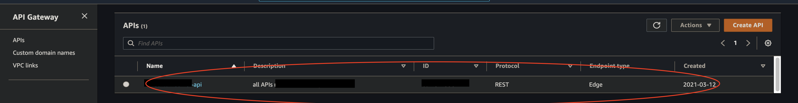

`aws_api_gateway_resource`: to put it very simply, you can think of this as a single API endpoint that has not yet been deployed. In this case we create a single endpoint ending with `/hello`.

In the below example, we have created two different resources with `OPTIONS` and `POST`, to the same path (hidden by black overlay). We will talk about creating OPTIONS resource to handle preflight requests later. For now, it would suffice to know that creating a REST resource means creating a certain endpoint.

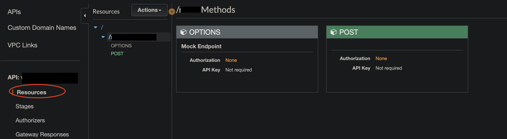

`aws_api_gateway_method`: Now, you want to create a REST method for that resource. Our `/hello` endpoint will just require no auth (out of scope of this article), and be a GET method.

`aws_lambda_permission`: By default, there's no permission for API gateway to invoke lambda function. So we are just granting a permission to it so that it can be executed.

`aws_api_gateway_integration`: API gateway supports transforming (filtering, preprocessing, ...) a request before it reaches client or a response from the client before it reaches the actual lambda. We are not doing any special things here for this example, but you may want to use it in the future. For more, [read relevant AWS docs](https://docs.aws.amazon.com/apigateway/latest/developerguide/how-to-integration-settings.html).

`aws_api_gateway_stage`: API gateway supports separating API into different stages out of the box. You should use this to separate your API across production, staging and development environments. For now, we will only make a stage for current terraform workspace, which is assumed to be `dev` across all examples in this article. Once you apply your changes, you are going to be able to see this on your AWS console:

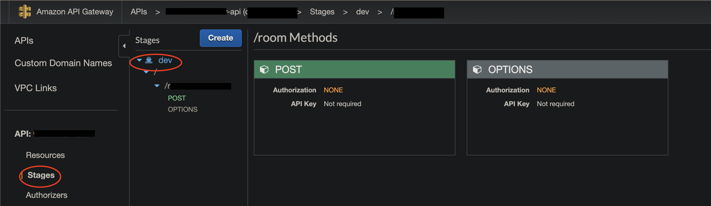

`aws_api_gateway_deployment`: This is equivalent to clicking on 'Deploy API' on AWS console.

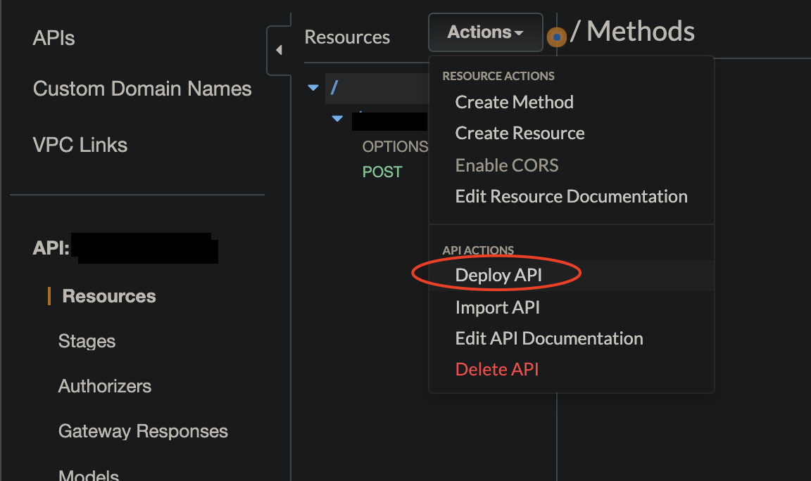

Once resources are created in API gateway, they _must_ be deployed in order to be reachable from external clients. One little problematic thing is `redeployment`; Even if you make a change to your REST API resources, it will not get deployed if `redeployment` argument does not change. There are mainly two ways of getting around this:
1. Use `timestamp()` to trigger redeployment for every single `apply`. Using this approach, lambda may be down for few seconds while redeployment. But it is for sure that it always deploys, so I would just go with this one if my service does not handle many users.
2. Use `md5(file("api_gateway.tf"))` to trigger redeployment whenever this file changes. But you need to always make sure that EVERYTHING related to API Gateway deployment only stays inside this file.

Ok. So far we have set up lambda and basic API Gateway configurations. Right now, you can test your API on Postman like this: first, go to AWS API Gateway console, and find a specific endpoint that is deployed to a certain stage. There should be an 'Invoke URL' at the top of the page.

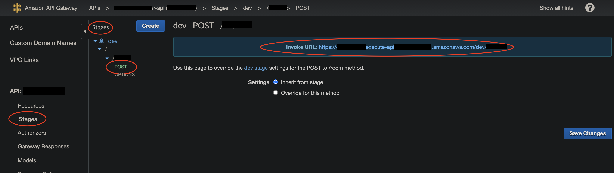

Now, open up Postman, and 
1. Insert your invoke URL
2. Click 'Authorization', and choose the type 'AWS Signature', and enter `AccessKey` and `SecretKey`. These keys should be coming from one of user's credentials from AWS IAM Console. If you do not have one specialized for calling an API set up with lambda and API gateway from local environment, make one user for that and get the keys.
3. Insert your AWS Region.
4. If your API requests any more query parameters or body, insert them.
5. Click send, then it should work.

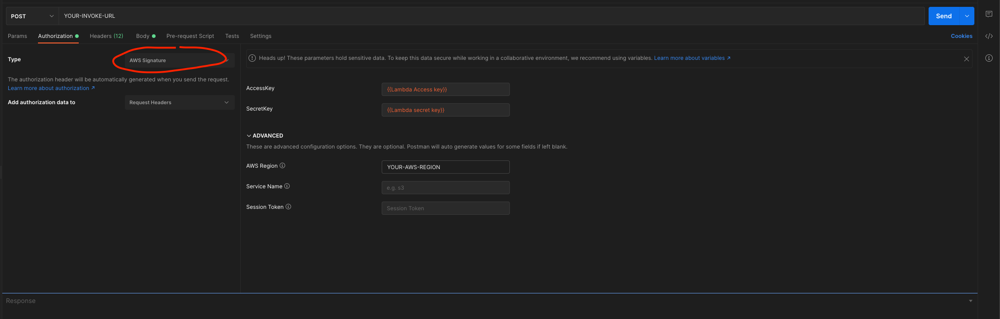

If you do not provide AWS Credentials in your request header, it won't work, because so far your API can be only used by IAM users known to the API gateway, and if you are just sending a request from your local computer without providing any access and secret keys, it won't know it's you. To make it work even without providing credentials for any public APIs intended to be exposed to client applications, you should now configure **custom domain**.

So far we have made changes to make lambda and API Gateway resources. The list of files we should have by now is the following.

```tf
➜  example-lambda git:(master) ✗ tree -I node_modules
.
├── IaC
│   ├── api_gateway.tf
│   ├── ecr.tf
│   ├── hello_role.tf
│   ├── lambda.tf
│   └── main.tf
└── server
    ├── build-and-push-docker-image.sh
    ├── lerna.json
    ├── login-docker.sh
    ├── nodemon.json
    ├── package-lock.json
    ├── package.json
    ├── packages
    │   └── hello
    │       ├── Dockerfile
    │       ├── README.md
    │       ├── lib
    │       │   └── index.ts
    │       ├── package-lock.json
    │       ├── package.json
    │       └── tsconfig.json
    └── template.yml

5 directories, 19 files
```

Next, we will see how to create a custom domain and relate that domain to the REST API we just made.

# Creating Terraform resources for Custom domain

Now, the problem is that we have the API, but it's not callable from any external client applications, which is a common case for many projects. So we want to register a domain first to represent our endpoints.

Before making a change for custom domain, we need to setup another AWS provider because we will need to use `us-east-1` region for Edge-optimized custom domain name ([that's the only region that supports creating an ACM certificate for Edge-optimized custom domain name](https://docs.aws.amazon.com/apigateway/latest/developerguide/how-to-edge-optimized-custom-domain-name.html)). 

There are two choices available for an API endpoint: 1. edge; 2. regional. If your endpoint should be accessed by worldwide clients, use edge; if your endpoint is specifically confined to be used in one specific region in the world, use regional. If you don't know what to do, it totally safe to go with edge for now. First, add another aws provider:

## `main.tf`
```tf
terraform {
  required_providers {
    aws = {
      source  = "hashicorp/aws"
      version = "~> 3.27"
    }
   docker = {
     source  = "kreuzwerker/docker"
     version = ">= 2.8.0"
   }
  }
  backend "s3" {
    profile = "localtf"
    bucket  = "my-iac" # change the bucket name to yours
    key            = "your-stack-name"
    region         = "us-west-2" # change to your region
    dynamodb_table = "terraform-lock"
  }
}

provider "aws" {
  profile = "default"
  region  = "us-west-2" # you will need to change this to your region
  assume_role {
    role_arn     = "arn:aws:iam::{your-account-id}:role/hello_role"
    session_name = "terraform"
  }
}

# for issuing acm certificate
+ provider "aws" {
+  profile = "default"
+  region  = "us-east-1"
+  alias   = "default_us_east_1"
+
+  assume_role {
+    role_arn     = "arn:aws:iam::{your-account-id}:role/hello_role"
+    session_name = "terraform"
+  }
+ }

# you can create this resource in other repository because it's not specific to this project
# resource "aws_dynamodb_table" "terraform_state_lock" {
#   name           = "tf-state-locks"
#   read_capacity  = 5
#   write_capacity = 5
#   hash_key       = "LockID"
#   attribute {
#     name = "LockID"
#     type = "S"
#   }
# }

# you can create this resource in other repository because it's not specific to this project
# resource "aws_s3_bucket" "terraform_backend" {
#   bucket = "tf-backend"
#   acl    = "private"

#   versioning {
#     enabled = true
#   }
# }
```

Then, you write the actual code to make a certificate and custom domain.

## `custom_domain.tf`

```tf
resource "aws_acm_certificate" "hello" {
  provider          = aws.default_us_east_1
  domain_name       = "api.hello.com"
  validation_method = "DNS"

  tags = {
    Environment = terraform.workspace
  }

  lifecycle {
    create_before_destroy = true
  }
}

resource "aws_acm_certificate_validation" "hello" {
  provider = aws.default_us_east_1

  certificate_arn         = aws_acm_certificate.hello.arn
  validation_record_fqdns = [for record in aws_route53_record.hello : record.fqdn]
}

locals {
  aws_route53_your_existing_zone_id = "A123A123A123A123"
}

resource "aws_route53_record" "hello" {
  for_each = {
    for dvo in aws_acm_certificate.hello.domain_validation_options : dvo.domain_name => {
      name   = dvo.resource_record_name
      record = dvo.resource_record_value
      type   = dvo.resource_record_type
    }
  }

  allow_overwrite = true
  name            = each.value.name
  records         = [each.value.record]
  ttl             = 60
  type            = each.value.type
  zone_id         = local.aws_route53_your_existing_zone_id
}
```

Make sure you get the existing hosted zone ID (or any other zone ID that you intend to use) from AWS Route53 Console:

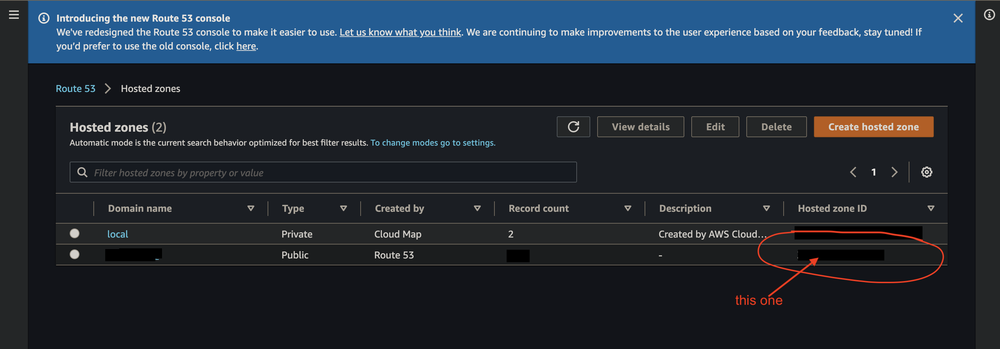

Use that ID to create Route53 Record for the custom domain name.

After you apply your change, you will be able to see ACM certificate being created on AWS Certificate Manager:

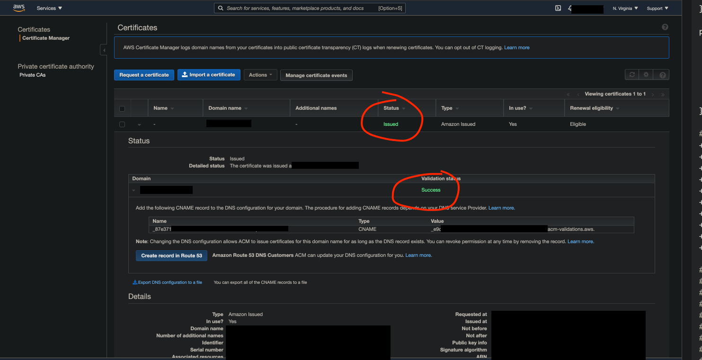

Just make sure you verified the status to be 'Issued' and the validation status to be 'success'. You may need to wait for several minutes before this completes. Also, if your certificate is not showing up, make sure that you are on `us-east-1`, not anywhere else.

After you are done with this, now you can go back to API Gateway again, and configure custom domain. Now that you've registered a domain, you can see it right up from API Gateway console:

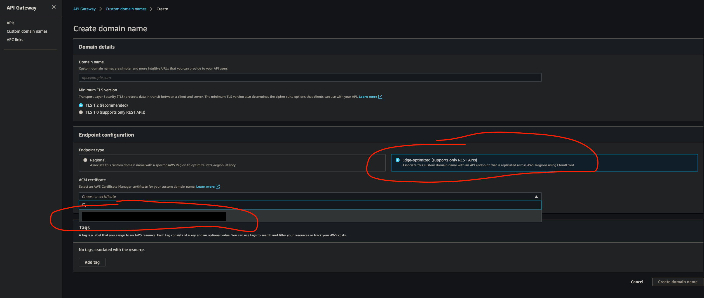

In the certificate dropdown, you should be able to see the domain that you have just created. Do not make create domain name there on the console. Now come back to terraform and let's write the equivalent code for that.

## `custom_domain.tf`

```tf
resource "aws_acm_certificate" "hello" {
  provider          = aws.default_us_east_1
  domain_name       = "api.hello.com"
  validation_method = "DNS"

  tags = {
    Environment = terraform.workspace
  }

  lifecycle {
    create_before_destroy = true
  }
}

resource "aws_acm_certificate_validation" "hello" {
  provider = aws.default_us_east_1

  certificate_arn         = aws_acm_certificate.hello.arn
  validation_record_fqdns = [for record in aws_route53_record.hello : record.fqdn]
}

locals {
  aws_route53_your_existing_zone_id = "A123A123A123A123"
}

resource "aws_route53_record" "hello" {
  for_each = {
    for dvo in aws_acm_certificate.hello.domain_validation_options : dvo.domain_name => {
      name   = dvo.resource_record_name
      record = dvo.resource_record_value
      type   = dvo.resource_record_type
    }
  }

  allow_overwrite = true
  name            = each.value.name
  records         = [each.value.record]
  ttl             = 60
  type            = each.value.type
  zone_id         = local.aws_route53_your_existing_zone_id
}

+ resource "aws_api_gateway_domain_name" "hello" {
+  security_policy = "TLS_1_2"
+  certificate_arn = aws_acm_certificate_validation.hello.certificate_arn
+  domain_name     = aws_acm_certificate.hello.domain_name
+
+  endpoint_configuration {
+    types = ["EDGE"]
+  }
+ }

+ resource "aws_route53_record" "custom_domain_to_cloudfront" {
+ 
+  zone_id = local.aws_route53_your_existing_zone_id
+  name    = "api.hello.com"
+  type    = "CNAME"
+  ttl     = "300"
+  records = [aws_api_gateway_domain_name.hello.cloudfront_domain_name]
+ }
```

You are just going to fill out the options that you just saw from the API Gateway console. Just fill out the relevant info about certificate, domain name, and endpoint config. 

Now, this is important: you need to create another Route53 Record to map your custom domain to cloudfront. Once you create your custom domain, AWS creates 'API Gateway domain name', circled with red in the below picture:

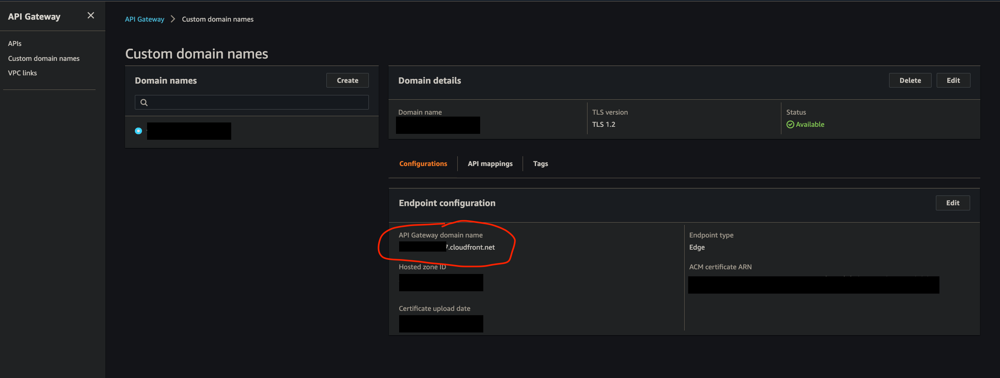

You need to route the traffic to `api.hello.com` to this API Gateway domain name (an example of an API Gateway domain name would be `asdfasdfasdf.cloudfront.net` as long as you are using `EDGE`). That's what we are doing with `aws_route53_record.custom_domain_to_cloudfront`. Otherwise, the response to your API will keep showing some weird errors that are really hard to guess the causes of. I found AWS really lacking a documentation on this part, so please be advised on this one. **You need to create another Route53 Record**.

You will be able to verify by entering Route53 console and looking for `api.hello.com`. It should appear as the following:

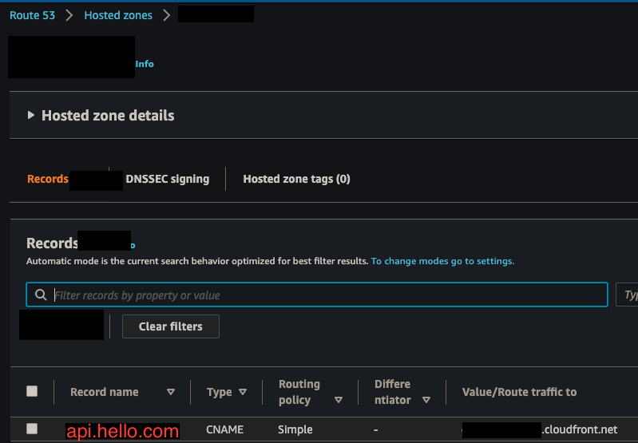

## `api_gateway.tf`

Aftrer that, you don't have to do many things; just add base path mapping resource, in `api_gateway.tf`. Even if you do not have an additional trailing path to your endpoint, you _must_ create a base path mapping. Otherwise your API won't be exposed to the public.

```tf
...

+ resource "aws_api_gateway_base_path_mapping" "hello" {
+  api_id      = aws_api_gateway_rest_api.hello.id
+  stage_name  = terraform.workspace
+  domain_name = aws_api_gateway_domain_name.hello.domain_name
+ }

...

```

After applying this change, verify that your API mapping has been created:

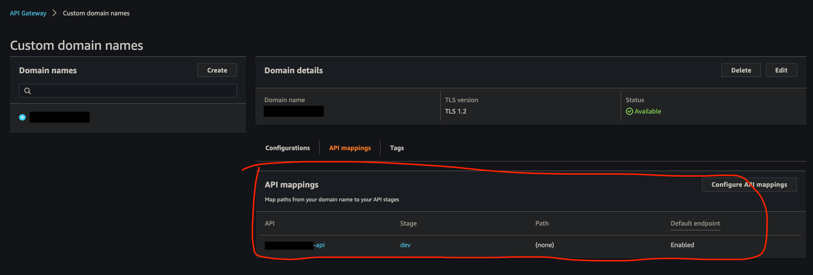

Now, you can go back to Postman, and test your api by requesting GET `api.hello.com/hello`. What may be confusing here is that you are not adding any `path` in base path mapping. If you add `hello` as a path, your API endpoint will be configured  as `api.hello.com/hello/hello`, which is obviously not what we want. So do not add any path mapping if you already have configured your path in `aws_api_gateway_resource`). Anyways, request and response to the API endpoint should work as expected if everything has been setup correctly so far.

# Enabling OPTIONS (preflight request)

Now, our client application, of course, is not Postman, so usually clients will request OPTIONS `api.hello.com/hello` first, and then request GET `api.hello.com/hello`, if they intend to send CORS requests, which is a very common case ([read more about that from MDN docs](https://developer.mozilla.org/en-US/docs/Glossary/Preflight_request))

If you have not done anything related to handling OPTIONS request, it's very likely that you will get some error in your client application, like this ([I got this picture from somewhere else for the purpose of demonstration](https://stackoverflow.com/questions/59909987/aws-api-gateway-403-forbidden-response-to-preflight-options-request)):

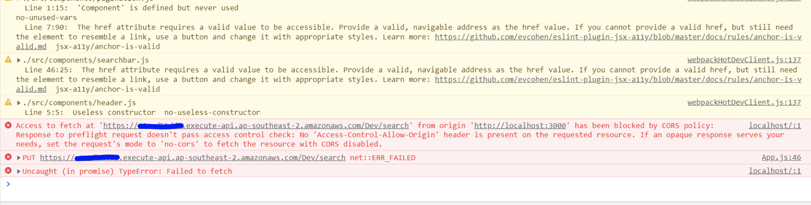

So let's do it! There's already a [handy module written by a great dev](https://github.com/squidfunk/terraform-aws-api-gateway-enable-cors), so we will just use that:

## `api_gateway.tf`

```tf

...

+ module "cors" {
+  source  = "squidfunk/api-gateway-enable-cors/aws"
+  version = "0.3.1"
+  allow_headers = [
+    # default allowed headers
+    "Authorization",
+    "Content-Type",
+    "X-Amz-Date",
+    "X-Amz-Security-Token",
+    "X-Api-Key",
+    # custom allowed headers
+    "x-my-custom-header",
+  ]
+
+  api_id          = aws_api_gateway_rest_api.hello.id
+  api_resource_id = aws_api_gateway_resource.hello_eng.id
+ }
```
Note that if you have any custom headers, you must define it in your config. Next, verify that OPTIONS requests are now allowed on the console:

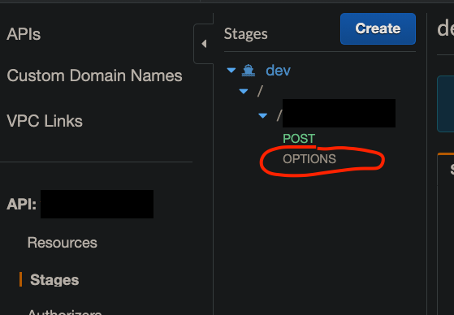

Also, you will need to change your lambda's response header too. Just adding `Access-Control-Allow-Origin": "*"` will work:

## `packages/hello/lib/index.ts`

```ts
import {
  APIGatewayProxyEvent,
  APIGatewayProxyResult
} from "aws-lambda";

export const handler = async (
  event: APIGatewayProxyEvent
): Promise<APIGatewayProxyResult> => {
  return {
+   headers: {
+     "Access-Control-Allow-Origin": "*",
+   },
    statusCode: 200,
    body: `hello`
  }
}
```

Now, apply the changes, and go back to your client app and retry the request. It should be working.

# Summing up

If you have followed everything, you will have created these files:

```tf
➜  example-lambda git:(master) ✗ tree -I node_modules
.
├── IaC
│   ├── api_gateway.tf
│   ├── custom_domain.tf
│   ├── ecr.tf
│   ├── hello_role.tf
│   ├── lambda.tf
│   └── main.tf
└── server
    ├── build-and-push-docker-image.sh
    ├── lerna.json
    ├── login-docker.sh
    ├── nodemon.json
    ├── package-lock.json
    ├── package.json
    ├── packages
    │   └── hello
    │       ├── Dockerfile
    │       ├── README.md
    │       ├── lib
    │       │   └── index.ts
    │       ├── package-lock.json
    │       ├── package.json
    │       └── tsconfig.json
    └── template.yml

5 directories, 20 files
```

So far, we have looked at how to setup, develop and deploy a dockerized lambda application with Typescript, Terraform and SAM CLI. There are tonnes of things to cover on lambda.. maybe next time, it will be on using resources inside VPC from lambda. I hope you enjoyed this and found some valuable insights. Thank you.
