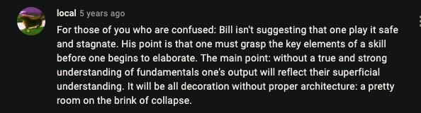

Don't deceive yourself about your progress.

Don't try to take shortcuts.

I was very much inspired by these videos:  [Bill Evans' comment on realistic view on the way to success](https://www.youtube.com/watch?v=YEHWaGuurUk)

> I see this in a lot of people that come to me for instance for advice or should they go ahead and so on that they tend to approximate uh the product **rather than attacking it in a realistic** true way at any elementary level.

The top comment sums the video up pretty much well:

So if you were to learn something, start from the basics, unless you are not a 100% genius.

In other words, there's no shortcut whatsoever.