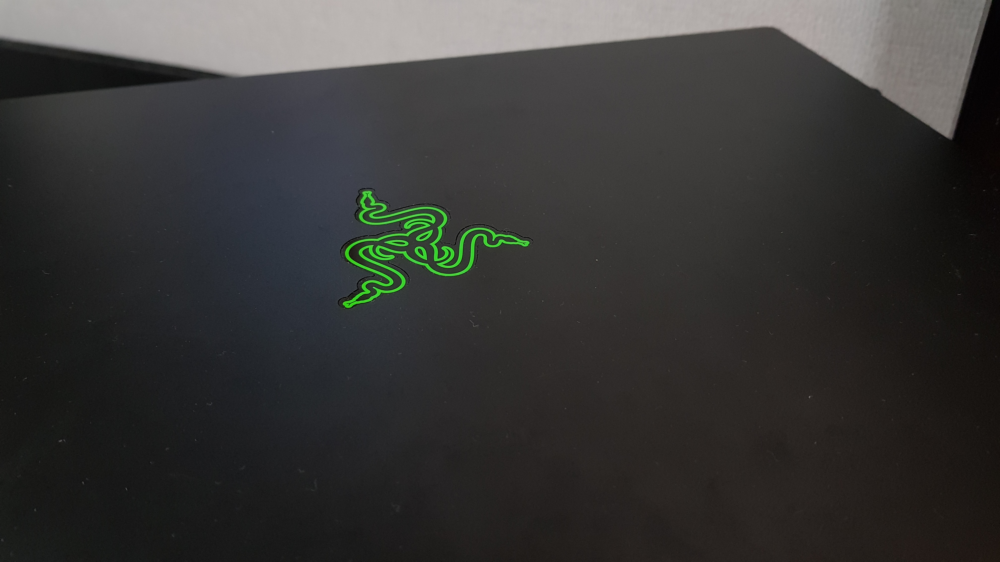
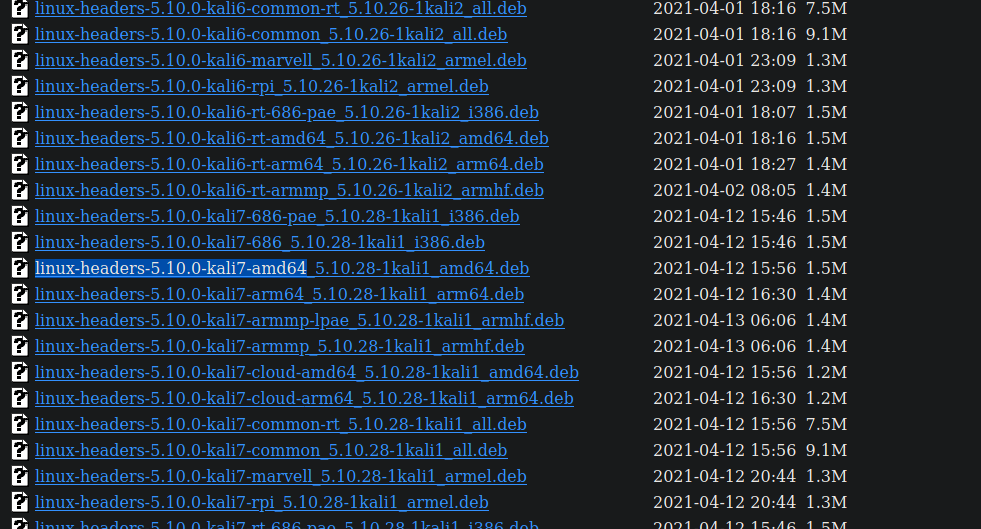
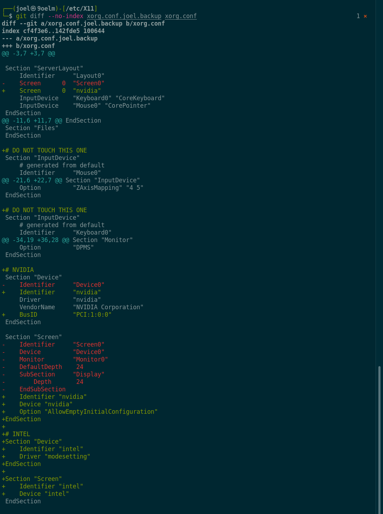
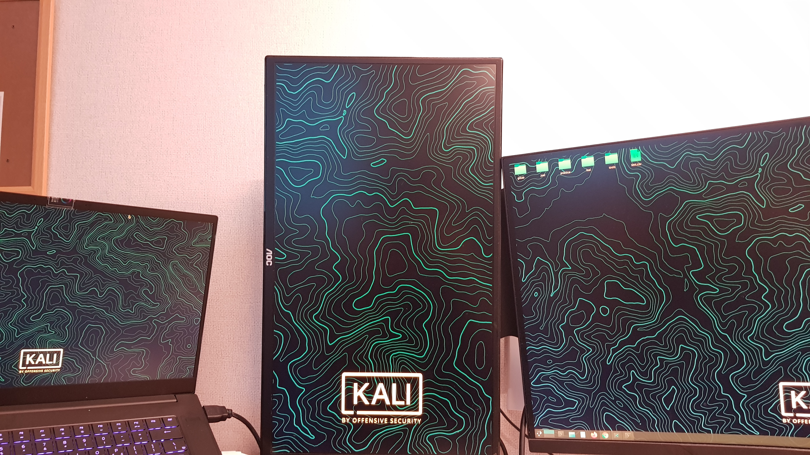

I needed to figure out how to set up multiple monitors on my new Kali linux laptop, because it wouldn't just work automatically like MacOS or Windows. At the end of a week-long research and accumulation of fragmented information on the Internet, I finally found a way to set it up. So here's my guide.

```toc
# This code block gets replaced with the TOC
```

# New optimus laptop




So I've got my brand new laptop, which is [Razer RZ09-0369](https://mysupport.razer.com/app/answers/detail/a_id/4014/~/at-a-glance%3A-razer-blade-15-base-%282021%29-%7C-rz09-0369). And guess what, I'm not running Windows on this beast for sure. I bought this to run Kali Linux. 

I already have my Macbook Pro which runs fairly well despite the two years of active usage, but when it comes to hacking and similar stuffs, I found that I'm not just vibing with it and sometimes it is quite tricky to do stuffs on it. Lots of people use Kali on virtual machine but there are obvious limitations, so I went for another physical machine.

# Problem: Kali linux won't just set up multiple screens for you if you are using an Optimus laptop
Last time when I was using my little old Samsung laptop without any Nvidia GPU (only Intel integrated graphics) to run some tests on Kali linux, I absolutely had no problems with connecting to a single external screen. **But oh dear, now I'm on a machine that's intended for gaming and it's got a huge Nvidia GPU in it along with the Intel integrated graphics, and I've got two external monitors I want to connect to.** And just in case you don't know what an Optimus means: having an 'Optimus' laptop means you have both Nvidia GPU (dGPU) and iGPU in your machine, and your machine switches back and forth from one to another for different tasks (i.e. your laptop may switch to dGPU once you start up a game which requires a lot more graphic processing than normal). Anyways, in such a case, _it won't just work without additional custom configurations if you are running Kali linux._

**I searched all the way up to the very edge of the Internet, but seriously I couldn't find a single answer that worked for me. [The official documentation on Kali linux](https://www.kali.org/docs/general-use/install-nvidia-drivers-on-kali-linux/) does not work because it is not for laptop but desktop users.** In the end, I found that summing up all those answers appropriately after clearly understanding what needed to be done is the only way to get it working. Let me start off.

# Steps to the success

```
- Disclaimer #0: this might be a daunting process. Stay calm and keep going on even if you feel like you are lost in the middle.
- Disclaimer #1: this has been tested on `5.10.0-kali9-amd64` (around July 2021).
- FYI #0: I'm using KDE.
- FYI #1: I've got two external monitors to connect to, both of which are connected via HDMI.
```

1. Update 

Before doing anything else, just make sure that your softare is up to date.
```bash
sudo apt-get update

sudo apt-get dist-upgrade
```

Btw, you can plug your HDMI/DP/VGA cables into your machine in advance.

2. Install kernal headers

```bash
sudo apt-get install -y linux-headers-$(uname -r)
```

The above command might not work because Kali recently changed postfixes of packages. If it can't find the corresponding package, go to https://http.kali.org/kali/pool/main/l/linux/ and find packages named `linux-headers-$(uname -r)`.  For example, mine is 

```bash
└─$ uname -r
5.10.0-kali9-amd64
```

So I've gotta look for `linux-header-5.10.0-kali7-amd64*` packages.



There it is! Download it.

Also, if you just look down below, there are `linux-header-5.10.0-kali7-common*` packages. **Download the one without rt and install that first**.

The resulting command must be something like:

```bash
sudo dpkg -i linux-headers-5.10.0-kali7-common_5.10.28-1kali1_all.deb
sudo dpkg -i linux-headers-5.10.0-kali7-amd64_5.10.28-1kali1_amd64.deb
```

3. Install Nvidia drivers

```bash
sudo apt install nvidia-driver nvidia-xconfig
```

4. Edit blacklist to prevent `nouveau` from starting at next boot

`nouveau` is the default graphics driver but now that you installed `nvdia-driver`, we wanna make sure that you don't use `nouveau` anymore. This is fairly done automatically when you install `nvidia-driver`, but just to make sure, run the command below if needed.

```bash
sudo vim /etc/modprobe.d/nvidia-blacklists-nouveau.conf

# inside the editor, append these
blacklist nouveau
blacklist lbm-nouveau
options nouveau modeset=0
alias nouveau off
alias lbm-nouveau off
```

5. Update the kernal with the new config with 

```bash
sudo update-initramfs -u
```

6. Reboot your computer

```bash
sudo reboot -f
```

7. Check if `nouveau` is not coming up in the processes

```bash
lsmod | grep -i nouveau # should output nothing
```

8. Edit `/etc/X11/xorg.conf` to accommodate Nvidia

First, just to prepare for the case where something goes wrong (although there are other ways of repairing it), run:

```bash
cd /etc/X11/xorg.conf

cp xorg.conf xorg.mybackup.conf
```

Find which busID your Nvidia graphics card is assigned with

```bash
$ lspci | grep VGA
00:02.0 VGA compatible controller: Intel Corporation CometLake-H GT2 [UHD Graphics] (rev 05)
01:00.0 VGA compatible controller: NVIDIA Corporation GA104M [GeForce RTX 3070 Mobile / Max-Q] (rev a1)
```

On my laptop, it's assigned with `01:00.0`.

Double check with `nvidia-xconfig`:

```bash
nvidia-xconfig --query-gpu-info

Number of GPUs: 1

GPU #0:
  Name      : NVIDIA GeForce RTX 3070 Laptop GPU
  UUID      : GPU-ab8f0c77-3c86-5204-3382-9f7378122f8d
  PCI BusID : PCI:1:0:0 # <-- this is what we are looking for

  Number of Display Devices: ...
```

[FYI, `lspci` uses hex to display BusID and `nvidia-xconfig` uses decimal values, which is the reason they may appear different if the number is beyond 10](https://forums.developer.nvidia.com/t/lspci-vs-nvidia-smi-vs-nvidia-xconfig-reporting-different-pci-busid/65634). In your `xorg.conf`, feed the decimal value. 

Then, overwrite this into your `xorg.conf`, and change `BusID` if needed.

```bash
# nvidia-xconfig: X configuration file generated by nvidia-xconfig
# nvidia-xconfig:  version 460.32.03

Section "ServerLayout"
    Identifier     "Layout0"
    Screen      0  "nvidia" # this part
    InputDevice    "Keyboard0" "CoreKeyboard"
    InputDevice    "Mouse0" "CorePointer"
EndSection

Section "Files"
EndSection

# DO NOT TOUCH THIS ONE
Section "InputDevice"
    # generated from default
    Identifier     "Mouse0"
    Driver         "mouse"
    Option         "Protocol" "auto"
    Option         "Device" "/dev/psaux"
    Option         "Emulate3Buttons" "no"
    Option         "ZAxisMapping" "4 5"
EndSection

# DO NOT TOUCH THIS ONE
Section "InputDevice"
    # generated from default
    Identifier     "Keyboard0"
    Driver         "kbd"
EndSection

Section "Monitor"
    Identifier     "Monitor0"
    VendorName     "Unknown"
    ModelName      "Unknown"
    Option         "DPMS"
EndSection

# NVIDIA
Section "Device"
    Identifier     "nvidia"
    Driver         "nvidia"
    VendorName     "NVIDIA Corporation"
    BusID          "PCI:1:0:0" #### <----- CHANGE THIS TO YOUR BUSID
EndSection

Section "Screen"
    Identifier "nvidia"
    Device "nvidia"
    Option "AllowEmptyInitialConfiguration"
EndSection

# INTEL
Section "Device"
    Identifier "intel"
    Driver "modesetting"
EndSection

Section "Screen"
    Identifier "intel"
    Device "intel"
EndSection
```

If you are still curious about which bits changed, look at this diff:



9. Configure `xrandr`

Set the providers and rock

```bash
xrandr --setprovideroutputsource 1 0
xrandr --auto
```

And then your external monitors should come up. Yay!



10. (Bonus) Add step 9 as a startup script

If you don't set up a startup script, you will need to run this every single time you start your machine:

```
xrandr --setprovideroutputsource 1 0
xrandr --auto
```

That's why adding it as a startup script is recommended. It's a bit tricky because `xrandr`-related startup scripts may not work if fired too early. You have various options to put the script in, but [this stackoverflow answer is lit, so you need to look at it](https://unix.stackexchange.com/questions/331398/starting-script-to-set-monitor-configuration).

This is how I would do it:

```bash
vim /etc/X11/Xsession.d/99setup-externalmonitors

# put this in
(sleep 5; xrandr --setprovideroutputsource 1 0 && xrandr --auto) &
```

Note that changing the preceding number of the script may have an effect as well because the scripts are sorted by name and invoked. I noticed that the commands I use need to be called as late as possible. So I kind of hacked into it, and found the above command with `sleep` will reasonably work all the time. It will run around 5 seconds after you get logged in, which is enough for other things to get set up. If you still don't find it working, try to fiddle with the order a bit more.

And so that's all of the magic needed to be done. I hope you really got it to work... if things did not work and you got them working somehow by tweaking some bits, please leave it as a comment so that others can look at it. Thank you.