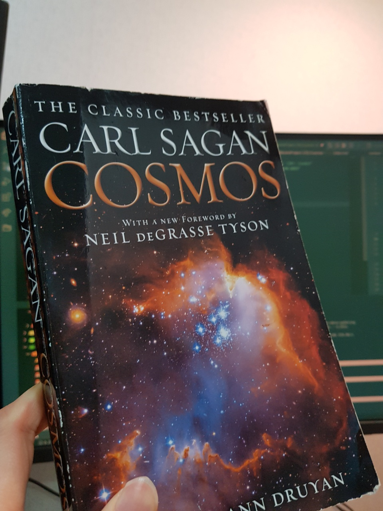
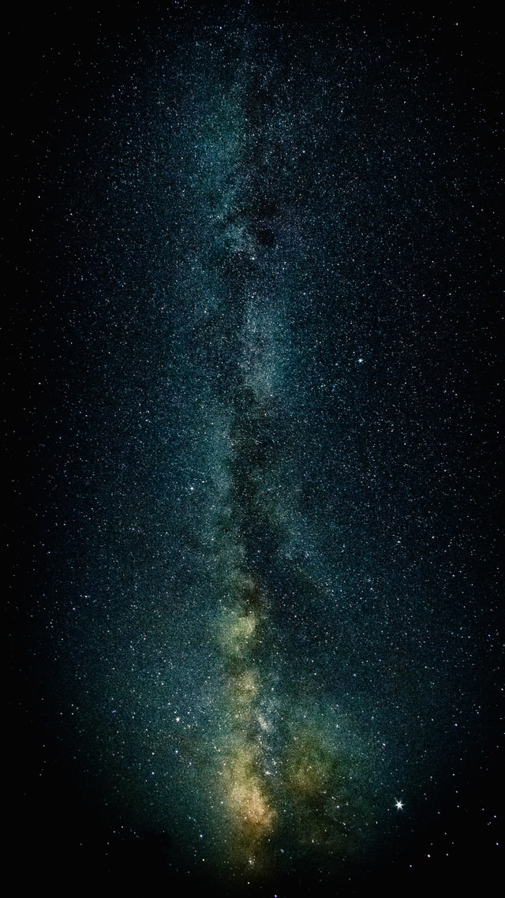
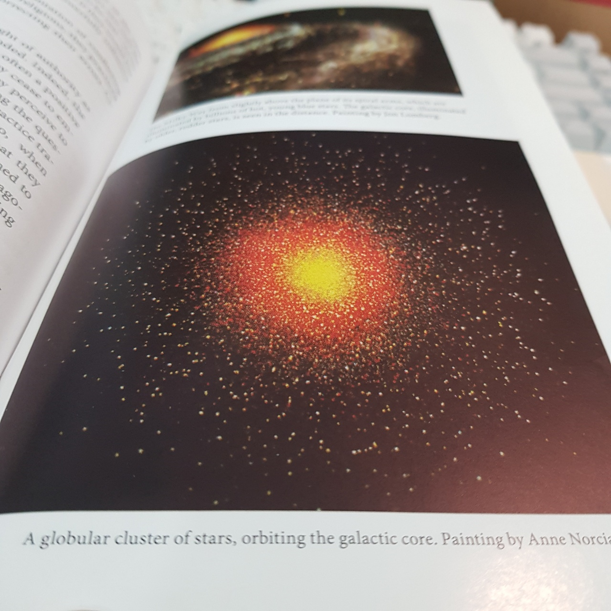
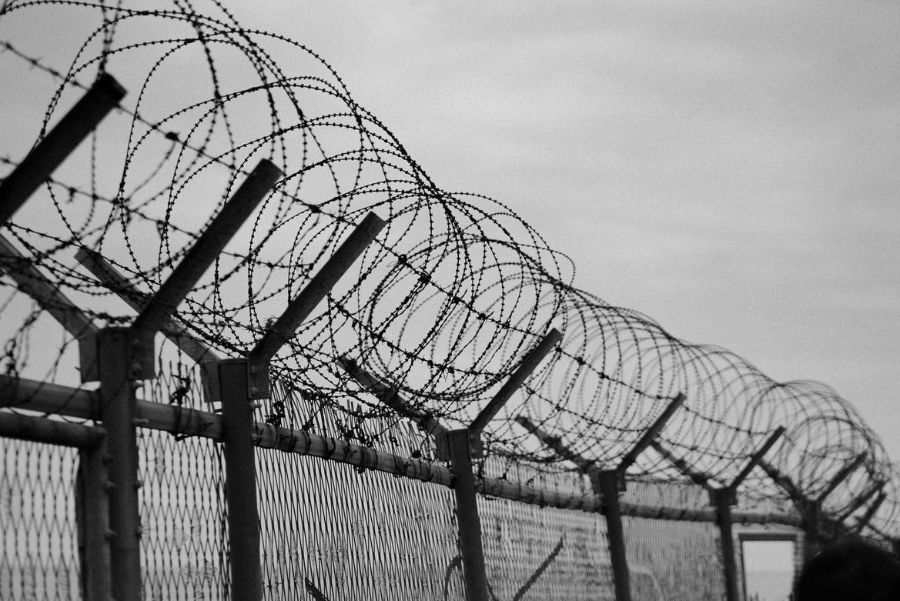

This is a personal reflection and review of the book _Cosmos_.

 

## Table of contents

```toc
```

## Cosmos

An ambitious and curious high schooler, in his twelveth grade, despite all four other students all dropping out and choosing another science subject, sitting alone in the classroom as a student, was being taught about the fundamental astrophysics as an optional topic chosen for Physics SL in International Baccalaureate program. Eyes widened. An inexorable stream of imagination begun. Smiles couldn't be controlled when the law of Nature was being told, due to the sheer, amazing fact that it is just so perfect to keep humans alive, with Ms. Pollack (now Mrs. Pollack, actually) trying to calm my smile down every single time.



It was inconceivable. It just came in as a big amazement for me. How is this _engineered_ to work this way, unmanned, without any interference or any sorts of control, from anyone? Why are we here as a living proof of the fine-tuned universe? Why are we being kept alive under so much favorable conditions? Why isn't a black hole coming down nearby and engulf us all? Why is it that we are just... here and why do things work so _naturally_?

Growing up, I kept this secretly aside to the very corner of my mind and decided not to approach it for some time, because I didn't know, and probably wouldn't know a clear answer to it ever. But I was bad at keeping it aside. It just kept interesting me and I couldn't curb this curiosity either, despite knowing that I won't be able to know clear answers and will only encounter speculations proposed by the big names in the history.

Well, but I still was curious and started to read some of the books about the universe. _Cosmos_ was one of them. And it turns out that Cosmos is a lot more than just a chronological order of events that happened in the antiquity: it's an art, music, humanity, society, people, history, philosophy, mathematics, biology, chemistry, physics, ... encompassing merely _everything_ of everything.

## Cosmos is (and has been) everything



The book itself is named after _Cosmos_, naturally triggering me to speculate that this would only pertain to the very science and logic behind it. But I was way wrong and I am more than happy to find myself that way.

Isn't it so beautiful to find that we are cosmic beings? The book tells us exactly that. **_A cosmic being._** We are in some sense the resultant material of the explosion from singularity, or better known as the Big Bang. We are just made from nothing but the physical explosion in the distant past. How crazy is that.

And created from that explosion is also the sun. How insanely hot should the sun be to to leave a spot of sunburn on your skin? The sun is approximately 15 x 10^10m away and it still gives energy that is so generously big enough to cause sunburn, transfer heat energy to the solar panels, and most importantly, lighten the world up. We are so naturally gifted with the sun that we don't even stop for a second and care that it's always there. But when you think about it, it's really an extraordinary stuff out there. It's probably that we don't think about it because it has always been there, just like how the Earth has been.

'Everything' also consists of the rules of nature. What is holding the solar system (and billions of other stars and galaxies) together is nothing more than the law of nature, especially the rules in the physics: Kepler's laws of planetary motion, Newton's law of universal gravitation, and so on. Doesn't matter if we know them or not. It's not like a rule that you must know to operate something. Even if you don't know it, it's been already _created and maintained_ by the cosmos, from the very beginning. There may even be the rules that we haven't _discovered_ yet. Isn't it so amazing that everything is being governed by the cosmos, in a sense? It's not a being, it's just the cosmos. It does not need to know how to operate itself, it's just wired to work that way, and keeping the rules always consistent. Very weird, but it works.

Overall, everything that works in our lives, and out of our lives, is from the cosmos, and therefore it deserves to be said that the cosmos is everything.

## Human intellect and curiosity

What majorly distinguishes humans from other species is the ability to formulate a thought. This special ability has brought another gift: curiosity. Other animals also exhibit behaviors that may concern or prove a little bit of their curiosity, but the degree of its complexity is of course, as we all know it, simple and trivial.

If you think about it for a second, human curiosity gave a rise to good things, and also bad things. It was because of human curiosity that we now know the Earth is not flat, but spherical; that we know about all those complex mathematical and physical equations that form the universe; that we found a way to cure or alleviate some common diseases, and so on. But the discovery of the flatness of the Earth accompanied worldwide colonization from benefactors of the curiosity: inhumane, illogical and unacceptable massacre and slavery took place. Upon finding all those grand equations came an invention of a weapon that can neutralize all living beings in the world.

Sagan really puts an emphasis on this point in his book, that only if human intellect and curiosity is utliized properly, the entire humanity would be destined for prosperity. If not, it will only lead to nuking the entire world, immediately wiping out all living species on the Earth. But if used wisely, we can't help improving our lives anyways. Isn't it so preposterously ironic that all of those technological endeavors that our ancestors and present-day scientists are making, might as well be converged to destruction. Did Pythagoras mean to support destruction, war, or any sort of belligerence when he discovered Pythagorean theorem? Surely not.

As Sagan puts it:

> National boundaries are not evident when we view the Earth from space. Fanatical ethnic or religious or national chauvinisms are a little difficult to maintain when we see our planet as a fragile blue crescent fading to become an inconspicuous point of light against the bastion and citadel of the stars.


In this perspective, there is another thing to be thankful for every moment: that there is no apparent war in many places in the world, especially nearby myself. Even Korea - where I am living in right now - just had its last war in 1950 to 1953. Conflict of ideologies. Intricate interests of multiple nations. Numerable casualties. Although now it's at an armistice, there is an invisible tension of forces between the South and the North. And ironically, that is what's keeping the armistice unbroken. But once someone starts to break it, even by a mistake, then it will surely be the demolition of most of us.

Anyway. If humans were stupid, we wouldn't have got to this point. But we have intellect and curiosity, so we need to take care of the implications of that.

## The taste of the Cold War, and 2022



A closely connected theme, following the previous topic, highlighted in the book, is self-destruction. The time at which the book was being written was around the times when the sentiments of the Cold War were still present. To be honest, I didn't know an astronomer could talk this much about the politics and global tension, but his arguments are totally agreeable and even convincing. Why would the technologies and inventions have to hurt the ones that developed them.

Now fast forward to 2022, and we are still having the same anxiety. Ukraine is on the verge of turning to a war zone. Russia and the United States, and the allies. A multitude of missile exchanges between Israel and Palestine just a few months ago. A single move from any of the nations involved may cause many things to turn out differently. Paradoxically, it's only a few people's decision influencing the outcome. Others don't get a say about it - even the soliders. It's unfortunate that most of us can't do a lot about it, apart from being grateful for the present peace.

## Nature rules

Separate identities found from totally irrelevant places in nature are found to be relatable in an equation. Isn't that simply amazing. 

I was often encountered situations to use Euler's Identity from high school: `e^(iπ) + 1 = 0`. But I had no idea why. It was just in the formula sheet. Never had any chance or motivation to think about it. I just used it. The surprising point about this equation is that `e`, `i` and `π` were all discovered (or invented - however you call it) by different people, and when put in a suitable form, they create a perfect equation that just works. It's like billions of bolts and metal sheets being shaken in a large jar together, and somehow a Macbook Pro came out of that. Nature doesn't necessarily reveal its inner workings. But when it does, it's truly beautiful, and I learned to appreciate that, thanks to this book. 

Because of that reason, asking questions to the things that no one usually would is also important. Some very important discoveries were made just because people asked questions that weren't before, or were rejected when asked.

> He [Einstein] wondered what the world would look like if you could travel on a wave of light. To travel at the speed of light? What an engaging and magical thought for a boy on the road in a countryside ... (p.213)

> From such elementary questions, Einstein produced a fundamental rethinking of the world, a revolution in physics. (p. 214)

And there came the famous theory: special relativity. Throughout a few thousand years, people hadn't discovered this rule of nature, and Einstein did, just by asking a few questions and thinking about them for a long time. That's the real difference there, I believe.

## Stars and planets

Human lives are way too short compared to the life of the universe and its 'starring' elements. Human life is too insignificant, too. There are billions of billions of trillions of stars and planets out there, and I'm just one of the people in one of those. I just feel so dwarfed and bewildered after reading Cosmos actually. What does it really mean to win challenges and solve problems in this tiny little world. All those daily struggles for a better life. Is it really worth it.

You know, sometimes I get to hop into one of the videos on Youtube about the universe and experience how little we just are, like this one.

<iframe width="100%" height="720px" src="https://www.youtube.com/embed/i93Z7zljQ7I" title="YouTube video player" frameborder="0" allow="accelerometer; autoplay; clipboard-write; encrypted-media; gyroscope; picture-in-picture" allowfullscreen></iframe>

## Extraterrestrial beings

One of the strong and compelling arguments Carl Sagan puts forward is the possibility of an extraterrestrial beings and implications of that. And of course, his assertion is not grounded trivially. Given the randomness of the Big Bang and the universality of the law of nature, there must be some habitable planets where beings have successfully found a way to make and sustain lives. It's just that we can't find them due to the vastness of the universe. That's his argument and I find it pretty convincing. And it sounds really weird to imagine that we are not the only ones in the universe. I don't know. It just feels weird.

## Carl Sagan

I truly learned to delight with his genious that encircles vast range of knowledge over innumerable subjects. I also enjoyed his method of delivery: it's not a science textbook. It's just a pure casual writing that at the same time confers immense, deep knowledge, thereby making it so easy to read, while letting readers aggregate valuable pieces of knoweldge.

It's such a shame that he passed away. I will definitely check on other pieces of work written by him. 