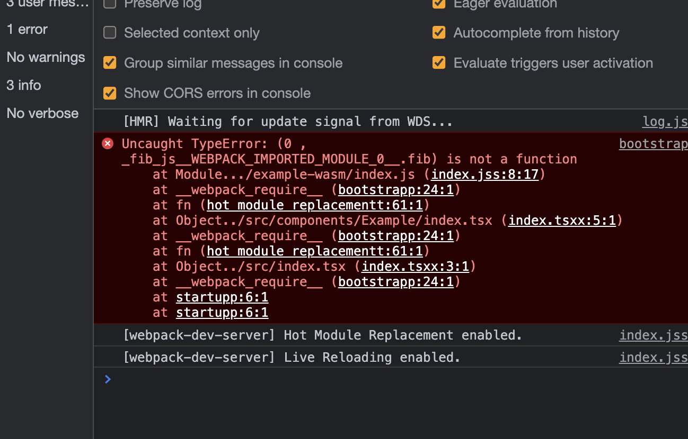
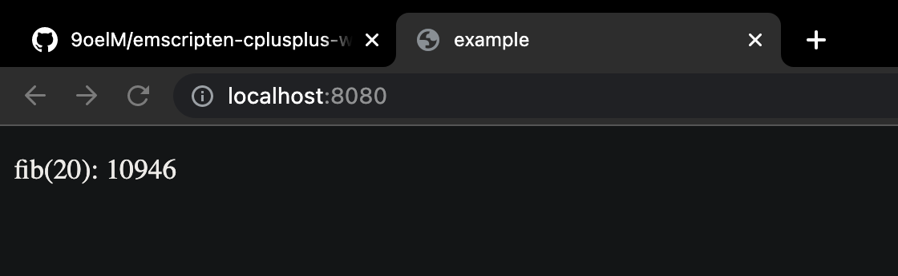

## Rationale

I have been trying to port some C++ project to Webassembly for the first time (I have worked on Assemblyscript and Rust projects for WASM, but this was my first time for C++). And I thought it would be fairly easy, like as easy as compiling Assemblyscript or Rust project into Webassembly. Why did I expect it to be easy? Since the advent of Webassembly, Emscripten has been the de facto smartest tool to compile C(++) into Webassembly, and it has been around for many years already. So I thought it would be extremely easy to compile it and import it into my Webpack-based project. 

But the answer was a big fat no. And this use-case is very poorly and fragmentedly documented across the web. So I started my own research as I always have done, and here's the fruitful finding:


## Prior art

[@surma](https://github.com/surma) has addressed this issue in 2018, but the code was kinda outdated. There were lots of people like me, though, hopeless but looking for a solution. Here's the gist that surma shared: https://gist.github.com/surma/b2705b6cca29357ebea1c9e6e15684cc

## Demo

First off, just look at the demo and confirm it's working. lol.

https://9oelm.github.io/emscripten-cplusplus-webpack-example/

## Repo

And this is the repository that contains the entire elxample code, so pull it before reading next stuffs: https://github.com/9oelM/emscripten-cplusplus-webpack-example

Now, I will just write in order what needs to be exactly done.

## Init project

I assume you already have installed / know `nvm`, so no explanation on this one.

Run from project root:
```bash
nvm use # use appropriate node & npm version as specified by .nvmrc

npm i # install deps for all packages, and link packages from each other under the monorepo setup
```

## Compile C++ to .wasm (everything done inside `packages/example-wasm`)

First, you will need to build the dockerfile. You can use your own `em++` locally, but I personally find it the simplest to use docker container instead.

```bash
$ cd packages/example-wasm 

$ ls
add.cc            dockerutil.sh     fib.wasm          package-lock.json
add.h             fib.cc            index.d.ts        package.json
compile.sh        fib.h             index.js          tsconfig.json
dockerfile        fib.js            node_modules

$ chmod u+x compile.sh dockerutil.sh # grant shell scripts permission

$ ./dockerutil.sh -c build # download & build docker image
[+] Building 0.8s (8/8) FINISHED                                             
 => [internal] load build definition from Dockerfile                    0.0s
 => => transferring dockerfile: 154B                                    0.0s
 => [internal] load .dockerignore                                       0.0s
 => => transferring context: 2B                                         0.0s
 => [internal] load metadata for docker.io/emscripten/emsdk:latest      0.0s
 => CACHED [1/4] FROM docker.io/emscripten/emsdk:latest                 0.0s
 => [2/4] WORKDIR /etc/example-wasm                                     0.0s
 => [3/4] RUN ls -la                                                    0.3s
 => [4/4] RUN which em++                                                0.3s
 => exporting to image                                                  0.0s
 => => exporting layers                                                 0.0s
 => => writing image sha256:c4243b91ba65d543b6ace91d2ca6faf0bed700196f  0.0s
 => => naming to docker.io/library/example-wasm                         0.0s

Use 'docker scan' to run Snyk tests against images to find vulnerabilities and learn how to fix them
```

Then, review the code in `compile.sh` (important stuffs are written as comments in this file, so no alternative elaboration here):

```bash
#!/bin/bash

# EXPORST_NAME means we can import from fib.js as follows:
# import { fib } from './fib.js'
# and fib will contain the module with webassembly

# EXPORTED_FUNCTIONS is the list of functions
# exported from C. Make sure you put them into extern "C" {} block in your c++ code. 
# Then simply prefix the functions you are going to export with an underscore, and add it to the list below

# Uncomment -s "FILESYSTEM=0" if you don't need to use fs (i.e. use it on web entirely)

# if you create more dependencies of fib.cc, simply add them to the end of the below command, like: -o ./fib.js fib.cc add.cc anotherdep.cc and_so_on.cc
em++ -O3 -s WASM=1 -s EXPORTED_RUNTIME_METHODS='[\"cwrap\"]' -s ALLOW_MEMORY_GROWTH=1 -s MODULARIZE=1 -s 'EXPORT_NAME="fib"' -s 'EXPORTED_FUNCTIONS=["_fib"]' -s "ENVIRONMENT='web'" -o ./fib.js fib.cc add.cc
    # -s "FILESYSTEM=0"
```

Now, compile the C++ code using Emscripten in Docker:

```
$ ./dockerutil.sh -c run
```

Then, you must be able to see `fib.js` and `fib.wasm` in the same directory.

## Glue code

If you are looking at this repo, you probably struggled to integrate the output from the previous step into webpack configurations. As pointed out by @surma, you need some additional setup. And the things @surma pointed out in the past also have changed over time... so there needs to be some kind of glue code anyways. That is `packages/example-wasm/index.js`:

```js
import { fib } from "./fib.js"
import fibonacciModule from "./fib.wasm"

// Since webpack will change the name and potentially the path of the
// `.wasm` file, we have to provide a `locateFile()` hook to redirect
// to the appropriate URL.
// More details: https://kripken.github.io/emscripten-site/docs/api_reference/module.html
const wasm = fib({
  locateFile(path) {
    if (path.endsWith(`.wasm`)) {
      return fibonacciModule
    }
    return path
  },
})

export default wasm
```

And here's the type definition (Emscripten does not create one for you, so I created it myself, and you will need to too if you want):

```ts
/* eslint-disable */
export interface FibWasm {
  _fib(a: number): number;
}

export declare const FibWasmPromise: Promise<FibWasm>;

export default FibWasmPromise
```

So.. judging from above code, you can simply do something like:

```js
import FibWasmPromise from './index.js'

... somewhere in the code ...

async function loadAndrunWasm() {
  const fibWasm = await FibWasmPromise

  fibWasm._fib(5)
}
```

Right. But to be able to do this, we need some more work from Webpack side.

## Webpack configuration (everything done inside `packages/example-web`)

Now, webpack natively supports importing wasm, but the problem is that the kind of wasm it supports is NOT the kind produced by emscripten. So what do we do?

We put this in `module.rules` in webpack config:

```js
      {
        test: /fib\.js$/,
        loader: `exports-loader`,
        options: {
          type: `module`,
          // this MUST be equivalent to EXPORT_NAME in packages/example-wasm/complile.sh
          exports: `fib`,
        },
      },
      // wasm files should not be processed but just be emitted and we want
      // to have their public URL.
      {
        test: /fib\.wasm$/,
        type: `javascript/auto`,
        loader: `file-loader`,
        // options: {
        // if you add this, wasm request path will be https://domain.com/publicpath/[hash].wasm
        //   publicPath: `static/`,
        // },
      },
```

You need to use exports-loader because it seems that `fib.js` (output from `em++`) does not export `fib` for whatever reason. You will get this error if you comment out `exports-loader` part:



Now, I mentioned that Webpack supports importing wasm out of the box, and that makes this thing not work. So we are just going to tell Webpack to import wasm without any processing. That is what `file-loader` is doing below `exports-loader`.

After you launch webpack dev server, you will be able to see your wasm being requested as `https://localhost:8080/[hash].wasm`.

And don't forget to include `@emscripten-cplusplus-webpack-example/example-wasm` as a dependency in `packages/example-web/package.json` (it is already there, but you will need to do it yourself for your project)

```
"dependencies": {
    "axios": "^0.24.0",
    "lodash.flow": "^3.5.0",
    "react": "^17.0.2",
    "react-dom": "^17.0.2",
    "@emscripten-cplusplus-webpack-example/example-wasm": "*"
  }
```

## `import` it and rock

Now, just import it, `await` the promise and use it. Ah, and if you are curious about Pure and Impure parts, it's another huge topic... to be explained for effective React. I won't explain it here. Just look at how wasm gets imported and used.

```ts
import React, { useEffect, useState } from "react"
import { FC } from "react"
import { enhance } from "../../utilities/essentials"
import { ExampleFallback } from "./fallback"
import fibWasmPromise from "@emscripten-cplusplus-webpack-example/example-wasm"

// eslint-disable-next-line @typescript-eslint/ban-types
export type ExampleImpureProps = {}

export const ExampleImpure: FC<ExampleImpureProps> =
  enhance<ExampleImpureProps>(() => {
    const [fibResult, setFibResult] = useState<null | number>(null)

    useEffect(() => {
      async function loadAndRunFibWasm() {
        const fibWasm = await fibWasmPromise
        setFibResult(fibWasm._fib(20))
      }
      loadAndRunFibWasm()
    }, [])

    return (
      <ExamplePure
        {...{
          fibResult,
        }}
      />
    )
  })(ExampleFallback)

// eslint-disable-next-line @typescript-eslint/ban-types
export type ExamplePureProps = {
  fibResult: number | null
}

export const ExamplePure: FC<ExamplePureProps> = enhance<ExamplePureProps>(
  ({ fibResult }) => (
    <div>
      {(() => {
        switch (fibResult) {
          case null: {
            return <p>fib(20): loading</p>
          }
          default: {
            return <p>fib(20): {fibResult}</p>
          }
        }
      })()}
    </div>
  )
)(ExampleFallback)
```

Then.. IT WORKS!!



## References
- https://github.com/PetterS/clang-wasm
- https://towardsdev.com/lets-export-the-c-library-to-javascript-wasm-library-part-a-4b99c9a7cf2
- https://emscripten.org/docs/porting/files/file_systems_overview.html#file-system-overview
- https://github.com/webpack/webpack/issues/7352
- https://gist.github.com/surma/b2705b6cca29357ebea1c9e6e15684cc
- https://developer.mozilla.org/en-US/docs/WebAssembly/existing_C_to_wasm
- https://github.com/emscripten-core/emscripten/issues/10224
- https://stackoverflow.com/questions/8249945/what-is-object-in-object-file-and-why-is-it-called-this-way

