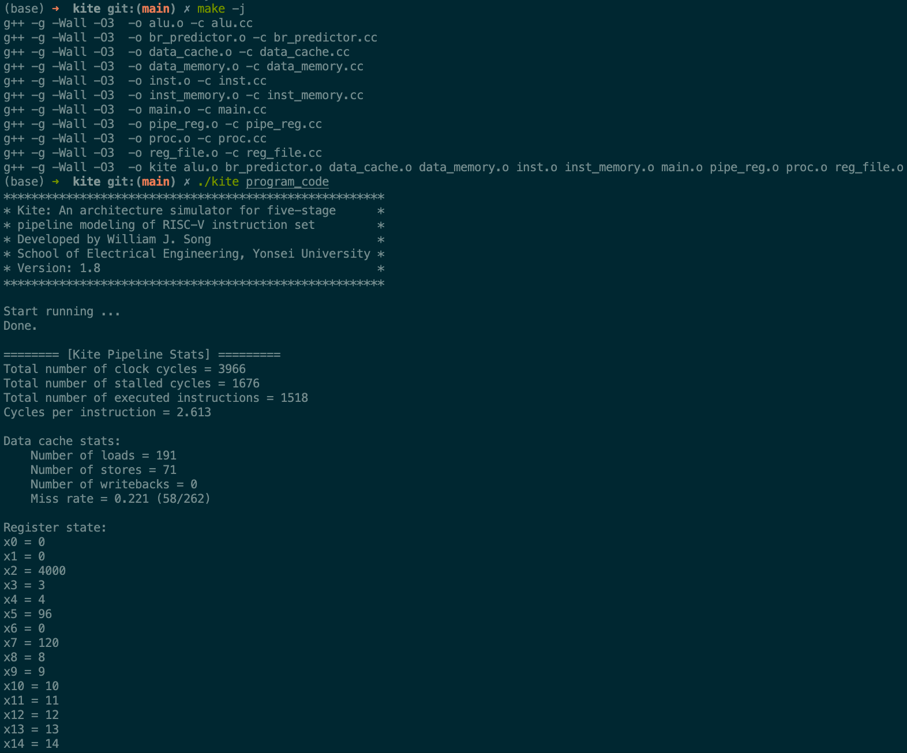

So I have enrolled in this [computer architecture class](https://icsl.yonsei.ac.kr/eee3530/) for the current semester. The lecture is based on [the RISC-V instruction set](https://riscv.org/wp-content/uploads/2017/05/riscv-spec-v2.2.pdf), which was quite of a surprise to me because it is not the popular kind of instruction set in the practical industry yet, although rapidly growing.

And I was looking for some project to do for fun. A few days ago, [I dug into Emscripten a bit and did some experiment with it](https://github.com/9oelM/emscripten-cplusplus-webpack-example), which is what [my previous blog post](https://9oelm.github.io/2022-05-10-How-to-compile-C++-code-into-Webassembly-with-Emscripten-and-use-it-in-Webpack-+-Typescript-+-React-project/) is about. Upon thinking about it, I found [my professor's simple RISC-V simulator, named Kite](https://github.com/yonsei-icsl/Kite), is based on C++. Then everything moved quite quickly because I just found a suitable target to turn into Webassembly for fun. This blog post is a short reflection/how-to-guide for that.

## Table of contents
```toc
```

## Disclamer

RISC-V simulator I ported to Webassembly is for nothing but fun and probably an educational purpose. It does not support complete set of instructions in RISC-V - actually just a very few of them. But again, in the end, it's for fun, so I decided to do it.

## If you want it first

So here's the Webassembly-ported version of Kite: https://riscv.surge.sh

## Porting C++ into a usable Webassembly

But there were a few challenges I needed to tackle:
1. Forwarding the output of C++ out to Javascript, in the form of `string` - that is, not to the console, but as a variable that I can control.
1. Remove file i/o and receive input from Javascript instead
1. Convert build flags like `-DDEBUG` into runtime boolean variables and supply them from Javascript.
1. Throwing an error to Javascript, so that the error can be displayed on the web.
1. Build C++ into Webassembly, which I already kinda knew how to, because of the research I've done previously. But exact flags supplied to Emscripten needed to be different, because Kite is just different from what I previously compiled.

I will explain how I tackled each part.

## Forwarding the output of C++ to Javascript

Emscripten naturally forwards all `std::cout` to the browser console. So even if you don't do anything special, you will just be able to see the output from `std::cout` in the console. 

So `std::cout` is how Kite communicates with the user (who is intended to be a developer or at least a CS student). It's just a console program, so to speak - like below picture.



But I had to convert that into `std::string` and send it to javascript. So the solution was quite evident already, at least from the C++ side: direct the output of the program to `std::ostringstream` to store it, and convert it to `string` later. So here's the difference of the converted code from the original `main` function:

_original_
```cpp
int main(int argc, char **argv) {
    cout << banner << endl;

    if(argc != 2) {
        cerr << "Usage: " << argv[0] << " [program_code]" << endl;
        exit(1);
    }

    proc_t proc;            // Kite processor
    proc.init(argv[1]);     // Processor initialization
    proc.run();             // Processor runs.
    return 0;
}
```

_converted_
```cpp
#include <iostream>
#include <sstream>
#include "proc.h"
#include "string"

using namespace std;

extern "C" {
  inline const char *cstr(const std::string &message)
    {
      auto buffer = (char *)malloc(message.length() + 1);
      buffer[message.length()] = '\0';
      memcpy(buffer, message.data(), message.length());
      return buffer;
    }
    const char *run_kite_once(
        const char *program_code, 
        const char *memory_state, 
        const char *reg_state,
        int8_t *is_debug_on,
        int8_t *is_data_fwd_on,
        int8_t *is_br_pred_on
      )
    {
      proc_t *proc = new proc_t(is_debug_on, is_data_fwd_on, is_br_pred_on);
      proc->init(program_code, memory_state, reg_state); // Processor initialization
      std::ostringstream program_log;
      proc->run(program_log); // Processor runs.
      std::string program_output = std::move(program_log).str();
      std::cout << program_output;
      return cstr(program_output);
    }
}
```

Now we declare `program_log` at the topmost caller function, and inside each function that is followed by the caller function (the functions called by `proc->run`), the program will store its output to `program_log` by running `program_log << "blah"` instead of `std::cout << "blah"`.

After everything runs, we convert `std::ostringstream` into `std::string` by writing `std::string program_output = std::move(program_log).str();`. Then we simply `std::cout << program_output;` for a debugging purpose, and then return `cstr(program_output)`.

What `cstr` does is essentially just to allocate another memory for the string, and copy the string into it, and return the address to it, so that we can use that address to dereference and get the value of the string.

Then, from javascript, you will do something like:

```js
executionOutputCharPtr = _run_kite_once(
  codeCharPtr,
  memoryCharPtr,
  registerCharPtr,
  isDebugOnInt8Ptr,
  isDataFwdOnInt8Ptr,
  isBrPredOnInt8Ptr
)

const executionOutputInJSString = UTF8ToString(executionOutputCharPtr)
setExecutionOutput(executionOutputInJSString)
```

`_run_kite_once` will return a pointer to the start of the string, and `UTF8ToString`, which is a function exported from Emscripten, will dereference the pointer and get the value of string. More on exporting the function later.

## Removing file i/o and receiving input from Javascript instead, converting build flags into runtime variables, and allocate C++ variables in Javascript

Above code also explains how I managed to receive input from Javascript. The original code read local files for program code, register state, and memory state, which look like:

_register state_
```
x0 = 0
x1 = 0
x2 = 4000
x3 = 3
x4 = 4
x5 = 5
x6 = 6
x7 = 7
x8 = 8
x9 = 9

...
```

_memory state_
```

1024 = 5
1032 = -8
1040 = -4
1048 = 7
1056 = -7
1064 = 7
1072 = -7
1080 = -7
1088 = 5
1096 = 1
1104 = 3
1112 = -1
1120 = -7

...
```

_program code_
```
loop:   beq  x11, x0,  exit
        remu x5,  x10, x11
        add  x10, x11, x0
        add  x11, x5,  x0
        beq  x0,  x0,  loop
exit:   sd   x10, 2000(x0)
```

These are all stored in local files and read from the program with `fstream`:

```cpp
    fstream file_stream;
    file_stream.open("memory_state", fstream::in);
    if(!file_stream.is_open()) {
        cerr << "Error: failed to open memory_state" << endl;
        exit(1);
    }

    string line;
    size_t line_num = 0;
    while(getline(file_stream, line)) {

      ...
```

So all I have to do was remove these lines, and receive the string input instead from javascript. That is what `_run_kite_once` is doing: it receives `const char *` pointers in javascript variables (`codeCharPtr`, `memoryCharPtr`, `registerCharPtr`) containing addresses to the variables in C++.

```js
const {
  _run_kite_once,
  allocate,
  ALLOC_NORMAL,
  intArrayFromString,
  _free,
  UTF8ToString,
  _get_exception_message,
  _malloc,
  setValue,
} = kiteWasmRequestResult.current
const { is_debug_on, is_data_fwd_on, is_br_pred_on } = RVSSettings

const codeCharPtr = allocate(
  intArrayFromString(codeState),
  `i8`,
  ALLOC_NORMAL
)
const memoryCharPtr = allocate(
  intArrayFromString(memoryState),
  `i8`,
  ALLOC_NORMAL
)
const registerCharPtr = allocate(
  intArrayFromString(registerState),
  `i8`,
  ALLOC_NORMAL
)
const isDebugOnInt8Ptr = _malloc(1)
const isDataFwdOnInt8Ptr = _malloc(1)
const isBrPredOnInt8Ptr = _malloc(1)
setValue(isDebugOnInt8Ptr, is_debug_on, `i8`)
setValue(isDataFwdOnInt8Ptr, is_data_fwd_on, `i8`)
setValue(isBrPredOnInt8Ptr, is_br_pred_on, `i8`)

executionOutputCharPtr = _run_kite_once(
  codeCharPtr,
  memoryCharPtr,
  registerCharPtr,
  isDebugOnInt8Ptr,
  isDataFwdOnInt8Ptr,
  isBrPredOnInt8Ptr
)
```

There is a need to explain `allocate`, `_malloc`, `setValue` as well. Since Javascript is obviously not C++, there needs to be some special way of declaring C++ variables in Javascript if you need to do that. So these are functions that you will want to use.

For example,
```ts
const isDebugOnInt8Ptr = _malloc(1)
setValue(isDebugOnInt8Ptr, is_debug_on, `i8`)
```
This line above will allocate 1 byte of memory to store `i8` value of `is_debug_on` in Javascript, and `isDebugOnInt8Ptr` can be now supplied to a function exported to wasm.

Another way to do it is to use `allocate`.

```ts
const memoryCharPtr = allocate(
  intArrayFromString(memoryState),
  `i8`,
  ALLOC_NORMAL
)
```

Above code will return a pointer of `const char *` to the int array that represents a `std::string` value. `ALLOC_NORMAL` uses `_malloc` under the hood, so it's basically the same. There are five types of allocation:

```js
var ALLOC_NORMAL = 0; // Tries to use _malloc()
var ALLOC_STACK = 1; // Lives for the duration of the current function call
var ALLOC_STATIC = 2; // Cannot be freed
var ALLOC_DYNAMIC = 3; // Cannot be freed except through sbrk
var ALLOC_NONE = 4; // Do not allocate
```

But in most cases using just `ALLOC_NORMAL` will suffice.

Anyway, after creating these pointers in Javascript, you can supply them as arguments to the wasm function:

```js
const executionOutputCharPtr = _run_kite_once(
  codeCharPtr,
  memoryCharPtr,
  registerCharPtr,
  isDebugOnInt8Ptr,
  isDataFwdOnInt8Ptr,
  isBrPredOnInt8Ptr
)
```

Note that this should exactly match the type definition of the equivalent function in C++:

```cpp
const char *run_kite_once(
  const char *program_code, 
  const char *memory_state, 
  const char *reg_state,
  int8_t *is_debug_on,
  int8_t *is_data_fwd_on,
  int8_t *is_br_pred_on
)
```

The above code also explains how we convert build flags into runtime variables supplied from Javascript. The existing C++ code had many lines like this:

```cpp
#ifdef DEBUG
        cout << *ticks << " : cache miss : addr = " << addr
             << " (tag = " << tag << ", set = " << set_index << ")" << endl;
#endif
```

So all I had to do was to convert that into:

```cpp
if (*is_debug_on) {
    program_log << *ticks << " : cache miss : addr = " << addr
      << " (tag = " << tag << ", set = " << set_index << ")" << endl;
}
```

after getting `is_debug_on` from `run_kite_once`. No more `make -j OPT="-DDEBUG"` after changing the code like so.

## Throwing the error to Javascript

The existing code handled an error like this:

```cpp
    if(val != 1) {
        cerr << "Error: number of sets must be a power of two" << endl;
        exit(1);
    }
```

Just `cerr` and `exit(1)`. But first problem was that `cerr`, even if replaced by `std::ostringstream& program_log`, won't emit the output properly probably due to immediate `exit(1)` right below, which would throw a generic exception to Javascript without any specific error message. So above code would be converted like so:

```cpp
if(val != 1) {
  throw std::logic_error("Cache Error: number of sets must be a power of two");
}
```

Then, you can easily capture the error in Javascript like this:

```js
try {
  executionOutputCharPtr = _run_kite_once(
    codeCharPtr,
    memoryCharPtr,
    registerCharPtr,
    isDebugOnInt8Ptr,
    isDataFwdOnInt8Ptr,
    isBrPredOnInt8Ptr
  )

  const executionOutputInJSString = UTF8ToString(executionOutputCharPtr)
  setExecutionOutput(executionOutputInJSString)
} catch (e: any) {
  errorPtr = e as number
  executionOutputCharPtr = _get_exception_message(errorPtr)
  setExecutionOutput(
    UTF8ToString(executionOutputCharPtr)
  )
} finally {
  ;[
    codeCharPtr,
    memoryCharPtr,
    registerCharPtr,
    isDebugOnInt8Ptr,
    isDataFwdOnInt8Ptr,
    isBrPredOnInt8Ptr,
  ].forEach(_free)
  ;[executionOutputCharPtr, errorPtr].forEach((ptr) => {
    if (ptr) _free(ptr)
  })
}
```

`throw` from C++ would return a pointer to the error, and `_get_exception_message` would convert that into a pointer of `const char *`. Then we can convert that into a javascript string.

Additionally, you will have to free all pointers in `finally`. Your wasm will have a memory leak if you don't free them as you use the webapp.

## Compilation of existing C++ into Webassembly

So how do you export functions from C++? [The basic walkthrough is extensively covered in my previous blog post](https://joel.is-a.dev/2022-05-10-How-to-compile-C++-code-into-Webassembly-with-Emscripten-and-use-it-in-Webpack-+-Typescript-+-React-project/).

But, since the previous blog post is quite general, some more explanation may be needed for the specific context of this project.

First, I never wanted to install Emscripten (`em++`) on my computer, so I used the official docker image. This is the contents of `dockerfile`:

```dockerfile
FROM emscripten/emsdk:latest

WORKDIR /etc/kite-wasm

RUN ls -la

RUN which em++

ENTRYPOINT ["./compile.sh"]
```

Does nothing but running a few checks, setting the workdir and `compile.sh` script.

```bash
#!/bin/bash

em++ -O3 -s WASM=1 -s EXPORTED_RUNTIME_METHODS='["cwrap", "allocate", "intArrayFromString", "ALLOC_NORMAL", "UTF8ToString", "setValue"]' -s ALLOW_MEMORY_GROWTH=1 -s MODULARIZE=1 -s 'EXPORT_NAME="kite"' -s 'EXPORTED_FUNCTIONS=["_run_kite_once", "_free", "_get_exception_message"]' -s "ENVIRONMENT='web'" -o ./kite_wasm.js kite_wasm.cc alu.cc br_predictor.cc data_cache.cc data_memory.cc inst_memory.cc inst.cc pipe_reg.cc proc.cc reg_file.cc
```

Now, above is the `compile.sh` script. The functions we use from Webassembly will need to be exported using `EXPORTED_RUNTIME_METHODS` and `EXPORTED_FUNCTIONS`. The former is for exporting a runtime method, and the latter is for exporting compiled code. But I honestly don't know why `_free` must be in `EXPORTED_FUNCTIONS` and not `EXPORTED_RUNTIME_METHODS`.

`-o ./kite_wasm.js kite_wasm.cc ...` is also important; If you don't place the file that contains `extern "C"` first, `em++` will not work as intended. For example, if you do `-o ./kite_wasm.js alu.cc kite_wasm.cc ...`, you will fail to export your functions you want to.

I also didn't want to copy and paste, or try to remember docker command I use like I do every day, so I just wrote this util:

_dockerutil.sh_
```bash
#!/bin/bash
while getopts c: flag; do
    case "${flag}" in
    c)
        case "${OPTARG}" in
        build)
            docker build . -t kite-wasm
            ;;

        run)
            docker run --rm -v $(pwd):/etc/kite-wasm kite-wasm 
            ;;

        *)
            echo "dockerutil.sh -c run|build"
            exit 
            ;;
        esac

        ;;
    *) 
        echo "dockerutil.sh -c run|build"
        exit 
        ;;
    esac
done
```

So I would just run `./dockerutil.sh -c run` or `./dockerutil.sh -c build` and that's it.

Now I just need to `./dockerutil.sh -c build` for the first time to build the image, and `./dockerutil.sh -c run`.

Then two files will be created: `kite_wasm.js` and `kite_wasm.wasm`. Since I am using Webpack for my React project, I would need some glue code like below ([more details on this in my previous post](https://joel.is-a.dev/2022-05-10-How-to-compile-C++-code-into-Webassembly-with-Emscripten-and-use-it-in-Webpack-+-Typescript-+-React-project/)):

```js
import { kite } from "./kite_wasm.js"
import kiteModule from "./kite_wasm.wasm"

// Since webpack will change the name and potentially the path of the
// `.wasm` file, we have to provide a `locateFile()` hook to redirect
// to the appropriate URL.
// More details: https://kripken.github.io/emscripten-site/docs/api_reference/module.html
const wasm = kite({
  locateFile(path) {
    if (path.endsWith(`.wasm`)) {
      return kiteModule
    }
    return path
  },
})

export default wasm
```

And then import and load Webassembly as follows:
```ts
    useEffect(() => {
      async function loadKiteWasm() {
        const [err, wasm] = await tcAsync(KiteWasmPromise)
        if (!err && wasm) {
          kiteWasmRequestResult.current = wasm
          setWasmRequestStatus(WasmRequestStatus.SUCCESS)
        } else if (err) {
          kiteWasmRequestResult.current = err
          setWasmRequestStatus(WasmRequestStatus.ERROR)
        }
      }
      loadKiteWasm()
    }, [])
```

Then somewhere later in the code you would run

```js
kiteWasmRequestResult.current._run_kite_once(...)
```

!

So that is how I built my latest project.

## Reflections & implications

Some little thoughts after the completion of the project:

1. While [Emscripten](https://emscripten.org/) is the de facto #1 tool to compile C++ to Webassembly, it is still quite poorly documented. Perhaps I will make some PRs to improve the docs. I initially struggled to find insightful docs to use stuffs like `_allocate` or `ALLOC_NORMAL`. In the end, I managed to find some other blog posts that explain them instead.
2. If you overcome all hurdles, it becomes extremely easy to port C++ code to webassembly from then on.
3. It's unavoidable that you understand and change some parts of the existing C++ code to be able to export functions to Webassembly. If this becomes your product's workflow, this may become a bit inconvenient, because a developer may have to think about how a change to the code will affect webassembly as he/she codes. Practically, your code may require lots of changes if it would be used for functionalities specific to Web APIs, like Canvas (props to [the Figma team](https://www.figma.com/blog/webassembly-cut-figmas-load-time-by-3x/) and teams of other similar products using Wasm & Canvas)
4. It's not true anymore that frontend engineering only relates to high-level programming. Things have changed over the past few years. You now have stuffs like `Uint8Array` as well as entire wasm support on the browser (and node.js). A well-disciplined FE engineer will be able to take care of all these.