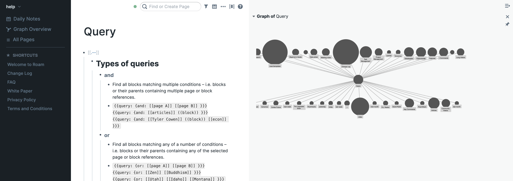
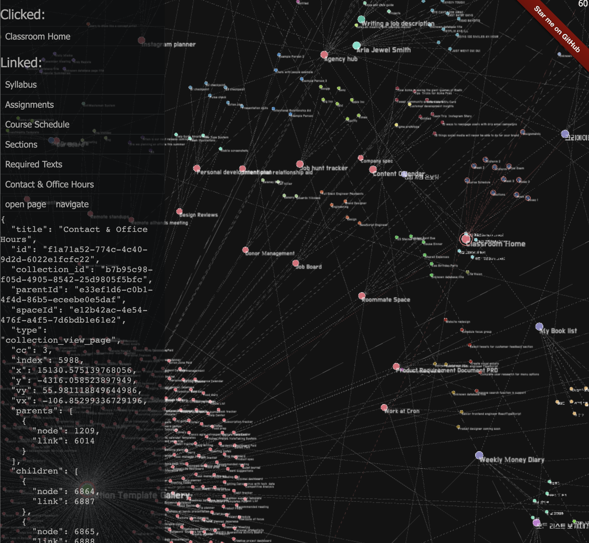

```toc
```
## Why does Notion not have a built-in knowledge graph?

Seriously. I know it may not be the major focus of the product, but still, there is a need. As you start to accumulate lots of pages and backlinks on your Notion, things just get too complicated despite your effort to organize them in a good formation.

Here're some examples of people talking about it:

<blockquote class="twitter-tweet" data-theme="dark"><p lang="en" dir="ltr">If Notion had a knowledge graph……</p>&mdash; Kuldeep (@ku1deep) <a href="https://twitter.com/ku1deep/status/1489161784212611078?ref_src=twsrc%5Etfw">February 3, 2022</a></blockquote> 

<iframe id="reddit-embed" src="https://www.redditmedia.com/r/Notion/comments/it5ep6/supporting_knowledge_graph/?ref_source=embed&amp;ref=share&amp;embed=true&amp;theme=dark" sandbox="allow-scripts allow-same-origin allow-popups" style="border: none;" width="640" scrolling="no"></iframe>

<iframe id="reddit-embed" src="https://www.redditmedia.com/r/Notion/comments/j8yhxn/replicating_roams_knowledge_graph_functionality/?ref_source=embed&amp;ref=share&amp;embed=true&amp;theme=dark" sandbox="allow-scripts allow-same-origin allow-popups" style="border: none;" width="640" scrolling="no"></iframe>

Roam research or similar tools just rock. I mean, Notion is _excellent_ too, but when it comes to mind map and brain-like knowledge layout, it doesn't just have it. Here's how Roam looks like:



It just gathers the links between pages and presents you in a visual form. This can be especially useful for a research-intensive project where you need to fresh up your thoughts by discovering connections across pieces of knowledge.

## So I made it myself

So I decided to make it for Notion too, because it seems like the Notion team will never make this feature anyway. [Here it is](https://graphcentral.github.io/graph) (if you dislike the scroll on this webpage while zooming in, [go to the original website](https://graphcentral.github.io/graph)):

<div style="height:80vh; width:100%;">
<iframe scrolling="no" src="https://graphcentral.github.io/graph/?graph_data=notion" width="100%" height="100%" style="overflow: hidden;"></iframe>
</div>

For those who can't view the iframe or access the website for some reason, here's the screenshot:



So... let me go into why and how I made the libraries. 

## The libraries: `@graphcentral/graph` and `@graphcentral/notion`

So there are two primary libraries I crafted, and you can install them as follows:

```bash
# for your frontend javascript project
npm i --save @graphcentral/graph 
# for your scraper Node.js project
npm i --save @graphcentral/notion 
```

## Why I made `@graphcentral/graph`

`@graphcentral/graph` is a powerful graph visualization library based on WebGL, Webworkers and IndexedDB. But why did I have to make it in the first place while there are multiple libraries capable of visualizing the same stuff out threre?

_Performance._

You see, I was looking for a library that could visualize more than 50K nodes with a sufficient FPS. But I could find none. Most libaries were built for less nodes - lower than 10-20K at most.

Here are all libraries I found. And I tested all of them manually with [my sample data](https://github.com/9oelm/datastore) (yes, it took a lot of time for me):

- [G6](https://g6.antv.vision/en/examples/performance/perf#eva): built by the data visualization team of Ant Group. Quite sluggish from 20K nodes (but I would say it has the best performance of all).
- [cytoscape](https://js.cytoscape.org/): Becomes unresponsive from about 15K nodes
- [WebCola](https://js.cytoscape.org/): Not maintained 
- [force-graph](https://github.com/vasturiano/force-graph): Becomes unresponsive from about 10K nodes
- [echarts](https://echarts.apache.org/examples/en/editor.html?c=graph-webkit-dep): Becomes very sluggish from about 10K nodes 
- [reagraph](https://github.com/reaviz/reagraph): Won't render at all even with 2K nodes

And the root cause of the performance problems of all libraries mentioned above, was they were not using WebGL with `<canvas />`. They were just using a plain `<canvas />`. Normally, it would be able to handle a few thousand nodes. But WebGL possess almost infinite possibilities because it directly takes advantage of hardware acceleration. That is why it is used for most 3D rendering scenes on web browsers. 

Therefore, I decided to craft [my own library](https://github.com/graphcentral/graph) that would fully utilize WebGL and support a graph with up to 50K nodes + 50K links.

## How I made it

At first, I was considering to write actual WebGL shaders on my own, but soon noticed that that is probably not what I want to do, because I didn't necessarily have to go down to the levrl where I have to know how to draw a circle in WebGL from scratch.

Instead, I started to go out and look for libraries that could help me create visual primitives like circles, rectangles, lines and so on.

And I found [pixi.js](https://pixijs.com/) to be an excellent fit. It supported all features I needed and was at the level of abstraction I was looking for (not too much, not too little).

## The way forward

I thought it was just the matter of making it happen. But it wasn't. First, the problem was that I needed to find a way to recursively get all Notion pages using Notion API somehow.

### Scraping the pages from Notion

First, I tried [the official Notion client published by the Notion team on npm](https://github.com/makenotion/notion-sdk-js).

This is a brief code showing how I tried to materialize the idea (you can just pass by if you don't feel like it because it's a bit long):

```ts
/* eslint-disable @typescript-eslint/ban-ts-comment */
import { Client } from "@notionhq/client";
import {
  ListBlockChildrenResponse,
  QueryDatabaseResponse,
} from "@notionhq/client/build/src/api-endpoints";
import to from "await-to-js";
import { RequestQueue } from "../../lib/request-queue";
import { UndirectedNodesGraph } from "../../lib/undirected-nodes-graph";
import { NotionContentNode } from "../../types/notion-content-node";
import {
  separateIdWithDashSafe,
  identifyObjectTitle,
} from "../../lib/isomorphic-notion-util";

function blockTypeToNotionContentNodeType(
  blockType: `child_page` | `child_database`
) {
  switch (blockType) {
    case `child_database`:
      return `database`;
    case `child_page`:
      return `page`;
    default:
      return `error`;
  }
}

/**
*
* @param notion notion client
* @param rootBlockId the id of a root page or database
* @returns `null` on error. Otherwise `database` or `page`
*/
async function retrieveRootNode(
  notion: Client,
  rootBlockId: NotionContentNode[`id`]
): Promise<NotionContentNode | null> {
  const [err, blockInfo] = await to(
    notion.blocks.retrieve({
      block_id: separateIdWithDashSafe(rootBlockId),
    })
  );

  if (err || !blockInfo) {
    return null;
  }

  return {
    type: blockTypeToNotionContentNodeType(
      // @ts-ignore: sdk bad typing
      blockInfo.type
    ),
    id: separateIdWithDashSafe(rootBlockId),
    title: identifyObjectTitle(blockInfo),
  };
}

/**
*
* @param notion
* @param parentNode
* @returns `null` on error, otherwise databaseChildren OR pageChildren
*/
async function retrieveDatabaseOrPageChildren(
  notion: Client,
  parentNode: NotionContentNode
): Promise<{
  databaseChildren: QueryDatabaseResponse | null;
  pageChildren: ListBlockChildrenResponse | null;
} | null> {
  let pageChildren: Awaited<
    ReturnType<typeof notion[`blocks`][`children`][`list`]>
  > | null = null;
  let databaseChildren: Awaited<
    ReturnType<typeof notion[`databases`][`query`]>
  > | null = null;
  switch (parentNode.type) {
    case `database`: {
      const [err, databaseChildrenQueryResult] = await to(
        notion.databases.query({
          database_id: separateIdWithDashSafe(parentNode.id),
          page_size: 50,
        })
      );
      if (databaseChildrenQueryResult) {
        databaseChildren = databaseChildrenQueryResult;
      }
      // if (err) console.log(err)
      break;
    }
    case `page`: {
      const [err, pageChildrenListResult] = await to(
        notion.blocks.children.list({
          block_id: separateIdWithDashSafe(parentNode.id),
          page_size: 50,
        })
      );
      if (pageChildrenListResult) {
        pageChildren = pageChildrenListResult;
      }
      // if (err) console.log(err)
    }
  }

  // something went wrong
  if (!databaseChildren && !pageChildren) {
    return null;
  }

  return {
    databaseChildren,
    pageChildren,
  };
}

function createNotionContentNodeFromPageChild(
  pageChild: ListBlockChildrenResponse[`results`][0]
): NotionContentNode {
  return {
    title: identifyObjectTitle(pageChild),
    id: pageChild.id,
    // @ts-ignore: sdk doesn't support good typing
    type: blockTypeToNotionContentNodeType(
      // @ts-ignore: sdk doesn't support good typing
      pageChild.type
    ),
  };
}

function createNotionContentNodeFromDatabaseChild(
  databaseChild: QueryDatabaseResponse[`results`][0]
): NotionContentNode {
  return {
    title: identifyObjectTitle(databaseChild),
    id: databaseChild.id,
    type: databaseChild.object,
  };
}

/**
* Notion API currently does not support getting all children of a page at once
* so the only way is to recursively extract all pages and databases from the root block (page or database)
* @param notion Notion client
* @param rootBlockId the id of the root page or database.
* Either format of 1429989fe8ac4effbc8f57f56486db54 or
* 1429989f-e8ac-4eff-bc8f-57f56486db54 are all fine.
* @returns all recurisvely discovered children of the root page
*/
export async function buildGraphFromRootNode(
  notion: Client,
  rootBlockId: string
): Promise<{
  nodes: NotionContentNode[];
  links: ReturnType<
    UndirectedNodesGraph<NotionContentNode>[`getD3JsEdgeFormat`]
  >;
}> {
  const rootNode = await retrieveRootNode(notion, rootBlockId);

  if (!rootNode) {
    throw new Error(`Error while retrieving rootNode`);
  }
  const nodes: NotionContentNode[] = [rootNode];
  const nodesGraph = new UndirectedNodesGraph<NotionContentNode>();
  const requestQueue = new RequestQueue({ maxConcurrentRequest: 50 });

  async function retrieveNodesRecursively(parentNode: NotionContentNode) {
    const queryChild = (child: NotionContentNode) => {
      requestQueue.enqueue(() => retrieveNodesRecursively(child));
    };
    const processNewBlock = (newBlock: NotionContentNode) => {
      nodesGraph.addEdge(parentNode, newBlock);
      nodes.push(newBlock);
      queryChild(newBlock);
    };

    const databaseOrPageChildren = await retrieveDatabaseOrPageChildren(
      notion,
      parentNode
    );

    if (!databaseOrPageChildren) {
      return;
    }

    const { pageChildren, databaseChildren } = databaseOrPageChildren;

    if (pageChildren) {
      for (const child of pageChildren.results) {
        try {
          // @ts-ignore: sdk doesn't support good typing
          if (child.type === `child_database` || child.type === `child_page`) {
            const newBlock = createNotionContentNodeFromPageChild(child);
            processNewBlock(newBlock);
          }
        } catch (e) {
          // console.log(e)
          console.log(`e`);
        }
      }
    } else if (databaseChildren) {
      for (const child of databaseChildren.results) {
        try {
          const newBlock = createNotionContentNodeFromDatabaseChild(child);
          processNewBlock(newBlock);
        } catch (e) {
          // console.log(e)
          console.log(`e`);
        }
      }
    }
  }

  const [err] = await to(
    Promise.allSettled([
      retrieveNodesRecursively(rootNode),
      new Promise((resolve) => {
        requestQueue.onComplete(resolve);
      }),
    ])
  );

  if (err) {
    throw err;
  }

  return {
    nodes,
    links: nodesGraph.getD3JsEdgeFormat(),
  };
}
```

But that didn't do it, because [Notion's official SDK has a rate limit](https://developers.notion.com/reference/request-limits). Everything but the rate limit blocked everything.

So it turned into a misery again. I had to find another way.

And I did!

I was looking for an unofficial library that does the same thing. And I stumbled on [notion-client](https://github.com/NotionX/react-notion-x/blob/master/packages/notion-client/readme.md), which basically provided almost all features supported by the official one.

From then on, it was just all about the implementation. Here are some things I did:
- Notion API does not have a feature to request a page along with the information about its recursive children pages, which meant I had to request them all one by one. However, despite the absence of the rate limit in the unofficial API, I did not want to bombard the server at Notion with all of my requests. So I created something called `RequestQueue`, which would manage the number of requests sent inside a specified time range.
- Because the public functions exported from `notion-client` are different from the ones from the official SDK, I had to implement the graph part again. A node in a graph would represent a page or a database in Notion, and its children, backlinked pages would be its child nodes.

Now the project is almost complete - just gotta write some tests and tidy up the code. You can install it by:

```bash
npm i --save @graphcentral/notion-graph-scraper
```

And then use it like this:

```ts
import { NotionGraph } from "@graphcentral/notion-graph-scraper"
import fs from "fs"
/**
 * example of how to use `@graphcentral/notion-graph-scraper`
 */
;(async () => {
  const notionGraph = new NotionGraph({
    maxDiscoverableNodes: 2000,
    maxDiscoverableNodesInOtherSpaces: 2000,
    verbose: true,
  })
  const graph = await notionGraph.buildGraphFromRootNode(
    // notion help page
    `e040febf70a94950b8620e6f00005004`
  )
  console.log(graph.nodes.length)
  console.log(graph.links.length)
  await new Promise((resolve, reject) => {
    fs.writeFile(`test0.json`, JSON.stringify(graph), (err) => {
      if (err) reject(err)
      else resolve(``)
    })
  });

  process.exit(0)
})()
```

[Some example outputs from this library are here](https://github.com/9oelm/datastore).

### Creating a performant graph visualization library based on WebGL

Creating the visualization with Pixi.js was rather straightforward, because the API of Pixi.js was super clear. I named it as `@graphcentral/graph`.

Here is some high-level overview on `@graphcentral/graph`:
- It fetches the graph data containing `nodes` and `links` and builds them as circle and lines.
- Culling is extensively used; Only what's seen inside the screen is intended to be rendered.
- The concept of level of detail is applied to the labels; You only see the small labels when you zoom in close. This helps improve the performance, because every single label essentially contributes to bringing the performance down.
- It can handle 30K - 50k nodes and 30K - 50K links at the same time
- Users can interact with the graph by spanning around. They can also click on a node, see which nodes are connected with it, and access any additional information stored in the node.

## Remaining problems

Now it seems to be all working well, but there are still some more problems to be solved:
- My initial decision to put all label data into IndexedDB and query them as a user browses around the graph seemed to be OK I tested with lots of nodes, like more than 20K. With numberous nodes, the time to query took a long time from UX POV. I need to change the mechanism (probably overthrow IndexedDB entirely) so that the time taken for the user to wait to see the labels of nodes is improved.
- Pixi.js has been great, but when I tried to further improve the performance by integrating `OffscreenCanvas` which can offload substantial amount of computation done in regards on Canvas and WebGL in the webworker thread, it didn't work well together because it does not offer a native support. I would need to reinvent the wheel to do that.

## Building an interactive demo

I am now working on building a website where users can input their own Notion page, get the visualization of the graph, and share it if they want to. Hopefully it's going to be done soon.

