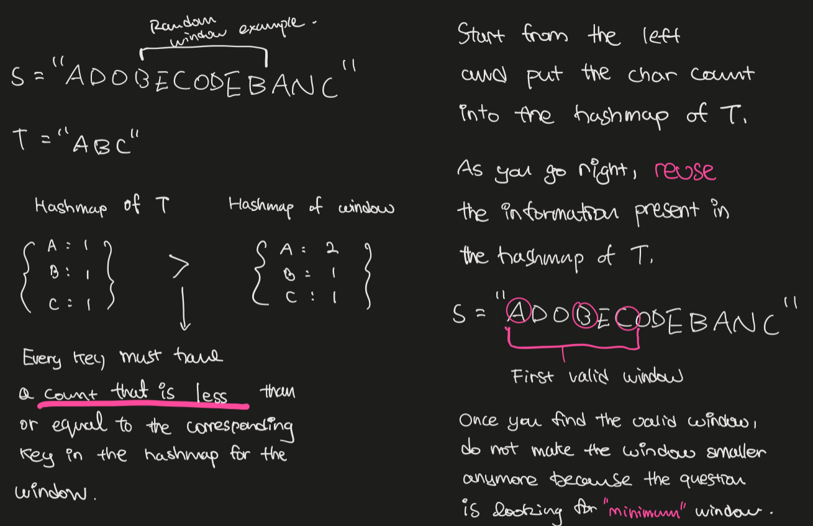

# Preface

This is my own curated list of tips and tricks about data structures and algorithms, in Python or TypeScript.

# Big O cheatsheet

Everything is from [bigocheatsheet.com](bigocheatsheet.com). It's just that I don't visit it as often as my blog.


# Checklist

If you are able to bring up **complexities amd implementations** in mind just by looking at each topic, you are in a good shape.

- [Array](#arrays)
- [Hash table](#hash-tables)
- [String](#strings)
  - [KMP algorithm](https://9oelm.github.io/2022-01-06--find-the-shortest-palindrome-an-intensive-review-of-kmp(knuth-morris-pratt)-algorithm/)
- [Linked List](#linked-lists)
  - [Singly linked list](#singly-linked-list-implementation)
  - [Doubly linked list](#doubly-linked-list-implementation)
- [Stack](#stack)
- [Queue](#queue)
  - [Deque](#deque)
  - [Priority queue](#priority-queue)
- [Tree](#trees)
  - Binary tree
  - [Heap](#heap)
  - [Trie](#trie-prefix-tree)
  - Red-black tree
  - AVL tree
- [Graph](#graphs)
  - [BFS](#dfs-and-bfs)
  - [DFS](#dfs-and-bfs)
  - [Topological sort](#topological-sort)
    - [BFS sort](#iterative-topological-sort-kahns-algorithm)
    - [DFS sort](#classic-dfs-topological-sort)
  - Shortest path
    - Dijkstra’s shortest path algorithm
    - Bellman–Ford algorithm
  - Cycle detection
    - Floyd's cycle detection algorithm (tortoise and hare)
  - Minimum spanning tree
    - Prim’s algorithm
    - Kruskal’s algorithm
  - Union find
  - Strongly connected components
- [Sorting](#sorting)
  - [Overview](#overview)
- [Dynamic programming](#dynamic-programming)
- [Bit manipulation](#dynamic-programming)

If you want to have a look at the entire table of contents, please do so:
<details>
  <summary>👉 Table of contents</summary>

  ```toc
  ```

</details>

# Arrays

- An array can work as a replacement for hash tables if you know the range of indices that will go into the array. But sometimes it will waste spaces.
- otherwise, do use hash tables because they have O(1) amortized time complexity.
- `append()` or `push()` for arrays and strings takes O(1) amortized time. It means that on average it will take O(1) for insertion if you keep adding new elements. This is because it takes O(1) time for simple insertions with no capacity increase, but it will take O(n/2) time for insertions with capacity increase, where n is the size of next array (because usually arrays double the capacity). The insertion with capacity increase only comes when you reach n/2 elements. This is why on average the insertion would take O(1) time. 

## Useful code snippets

Initialize an empty array of length 10 full of 0's:
```ts
const arr = Array(100).fill(0)
```
```py
arr = [0] * 10
```

Be careful when you are creating a 2D array in Python:

```py
doesnt_work_arr = [[0] * 10] * 10 # doesn't work
2d_arr = [[0] * 10 for _ in range(10)] # works
```

Creating an array of certain range of contiguous characters:

```py
count = [0] * (ord("z") - ord("a") + 1)

# access the index corresponding to "c" (should be 2nd index)
count[ord("c") - ord("a")]
```

Remember that uppercase letters come first in the ASCII order (and there are some special characters in between `"Z"` and `"a"`)

```py
>>> ord("A")
65
>>> ord("Z")
90
>>> ord("a")
97
>>> ord("z")
122
```

## Why an arraylist (or just list) has $O(1)$ armortized insertion time

### Basic idea
- An arraylist has:
  - $length$: the actual number of elements in the list
  - $capacity$: the size of the memory allocated for the list (always bigger than or equal to $length$)
- Appending an element to an list while its length is less than or equal to the $capacity$ is an apparent $O(1)$
- When the $capacity$ is full, $length$ (= $capacity$) elements need to be copied over to a brand new list, which is not $O(1)$

### The cost of resizing

- Usually, the list will need to double in its $capacity$ (powers of 2). Therefore, list increases its $capacity$ only when $length = 2^k$ for some integer $k > 0$ (you need to resize at $2, 4, 8, 16, ...$).
- Total number of times for resizing $capacity$ is $floor(log_2(n))$. At certain $length$, the list would have been resized for $floor(log_2(n))$ times. For example, if your $length$ is $34$, that means is the list would have been resized for $floor(log_2(34)) = 5$ times. 
- The total (accumulated) cost of resizing at $length$: $1 + 2 + 4 + 8 + ... + 2^{floor(log_2(length))}$
- We know $\sum_{i=0}^{k}2^k = 2^{k + 1} - 1$. For example, $k = 4 \Rightarrow \sum_{i=0}^{k}2^k = 1 + 2 + 4 + 8 + 16 = 31 = 2^{k + 1} - 1$
- Therefore, the total accumulated cost of resizing at $length$ = $2^{floor(log_2(length)) + 1} - 1 = 2^{k + 1} - 1$ where $k$ is the number of times of resizing.

### The cost of $O(1)$ ops

- Up to a certain $k = 2^{floor(log_2(length))}$, the accumulative cost of $O(1)$ operations is $2^k - k + 1$. For exmaple, let $k = 5 \Rightarrow 2^5 - 5 + 1 = 28$. Other $4 (=k)$ ops are all resizing ops at 2, 4, 8, and 16 (you don't resize at 1).
- Because we are interested in the amortized time complexity, we will have to divide the entire cost by $2^k + 1$. 
- $2^k + 1$ is the general worst case, since the last operation (the $+1$ part) triggers the resizing.

### Conclusion

$$
\frac{\text{Accumulative resizing cost} + \text{Accumulative constant ops cost}}{\text{Number of total ops}} = \newline
\frac{(2^{k + 1} - 1) + (2^k - k + 1)}{2^k + 1} < \newline
\frac{(2^{k + 1} - 1) + (2^k - k + 1)}{2^k} = \newline
\frac{(2^{k + 1}) + (2^k - k)}{2^k} =\newline
\frac{(2^{k}2) + (2^k - k)}{2^k} =\newline
2 + 1 - \frac{k}{2^k}\newline
\text{and clearly,} \lim_{k \to \infty}{3 - \frac{k}{2^k}} = 3 
\newline
\Rightarrow \text{inserting } 2^k + 1 \text{ elements into the list has an amortized time complexity of } O(3) = O(1) \text{ per insertion}
$$

## Sliding window

- Sliding window technique is used in subarray or substring problems, like longest, shortest, or target value.
- For these problems, there is usually an apparent brute force solution that runs in O(N²), O(2^N)
- Two pointers move in the same direction in the way that they will never overtake each other (O(n))
- The key concept is you want to keep track of the previous best information you have

### Intuition

FYI: Big help from this [stackoverflow answer](https://stackoverflow.com/questions/8269916/what-is-sliding-window-algorithm-examples).

Sliding window can be used when you want to efficiently get the maximum sum of a subarray of length 5 in an array, for example.

```py
[ 5, 7, 1, 4, 3, 6, 2, 9, 2 ]
```

The bruteforce algorithm will clearly introduce `O(length_of_the_array * length_of_the_subarray)` time complexity. But we can improve by 'sliding the window':

- The first subarray's sum is sum(5, 7, 1, 4, 3) = 20
- The second subarray's sum is sum(7, 1, 4, 3, 6) = 21
- ... and so on

But the only numbers changing in the calculation are the first and the last number (`5` and `6`). So simply subtracting `5` from and adding `6` to the first subarray's sum would deduce the second array's sum. The same goes for the next subarrays.

This will result in `O(n)` time complexity because subtracting and adding ops are fixed at `2 * O(1)` regardless of length of the array/subarray.

### Sliding window of dynamic range

- Sometimes, the sliding window's length is not fixed. In this case, you will need to move the `start` and `end` pointers to the array dynamically.
- Dynamic range sliding window qs often involes using a hash to store previous information and starting again from there once some condition is met

<details>
 <summary>👉 Example 1: Minimum window substring</summary>

[Leetcode problem](https://leetcode.com/problems/minimum-window-substring/)




```
Input: s = "ADOBECODEBANC", t = "ABC"
Output: "BANC"
Explanation: The minimum window substring "BANC" includes 'A', 'B', and 'C' from string t.
```

```py
from collections import defaultdict
from typing import Dict

def minimum_window_substring(s: str, substr: str) -> str:
  substr_hash: Dict[str, int] = defaultdict(int)
  window_hash: Dict[str, int] = defaultdict(int)

  # for "ABCDAB", need_unique_chars_count will be 4 because A and B overlap
  # it's just len(substr_hash)
  need_unique_chars_count = 0
  for c in substr:
    if substr_hash[c] == 0: need_unique_chars_count += 1
    substr_hash[c] += 1

  have_unique_chars_count = 0
  minimum_window_bounds = [-1, -1]
  start = 0
  # initiate 'end' from the beginning of the string
  for end in range(len(s)):
    if s[end] in substr_hash:
      window_hash[s[end]] += 1
      # minimum requiremenet to create a window
      # for this char (which is s[end]) has been fulfilled
      if window_hash[s[end]] == substr_hash[s[end]]:
        have_unique_chars_count += 1
    
    # while the condition to create a valid sliding window has
    # been fulfilled
    while have_unique_chars_count == need_unique_chars_count:
      curr_window_size = end - start + 1
      # current valid window size is smaller than the existing one
      # therefore we need to replace the window
      if minimum_window_bounds[0] == -1 or curr_window_size < minimum_window_bounds[1] - minimum_window_bounds[0] + 1:
        minimum_window_bounds = [start, end]
      # keep shrinking from the leftmost character because
      # we checked everything with it
      window_hash[s[start]] -= 1
      # if you happen to take out the character
      # that was required for the minimum window,
      # decrement have_unique_chars_count by 1
      if s[start] in substr_hash and window_hash[s[start]] < substr_hash[s[start]]:
        have_unique_chars_count -= 1
      start += 1
  if minimum_window_bounds[0] == -1:
    return ""
  return s[minimum_window_bounds[0]:minimum_window_bounds[1] + 1]
```

Complexities:
- time O(len(s) + len(substr)) because both `start` and `end` pointer scan the string `s` for only one time.
- space: O(len(s) + len(substr)) because all we use is the hashmap for each string.

</details>

<details>
 <summary>👉 Example 2: Minimum Size Subarray Sum</summary>

[Leetcode problem](https://leetcode.com/problems/minimum-size-subarray-sum)


```
Input: target = 7, nums = [2,3,1,2,4,3]
Output: 2
Explanation: The subarray [4,3] has the minimal length under the problem constraint.
```

```py
import math

class Solution:
    def minSubArrayLen(self, target: int, nums: List[int]) -> int:
        if len(nums) == 0:
            return 0
        left = 0
        subarray_sum, subarray_len = 0, math.inf
        # right pointer always increases
        for right, num in enumerate(nums):
            subarray_sum += num
            # if the subarray's sum satisfies the condition,
            # increase the left pointer until the subarray's sum
            # does not satisfy the condition anymore
            while subarray_sum >= target:
                subarray_len = min(right - left + 1, subarray_len)
                subarray_sum -= nums[left]
                left += 1
        return 0 if subarray_len == math.inf else subarray_len
```

Complexities:
- time: 
- space: O(1)

</details>

## Index as a hash key

- The index can be used as a hash table holding index and boolean value as key and value without forgetting about the initial value itself

    Example:
    ```py
    arr = [4,1,5,2,2]

    for n in arr:
      if n < len(arr) and n > 0 and arr[n] > 0:
        arr[n] *= -1

    has_three = arr[3] < 0 # false
    has_two = arr[2] < 0 # true
    ```

## Two pointers

Quite similar concept to the sliding window. Need to use two pointers each pointing at different parts of the array.

## Traversing from the right

Sometimes you need to start from the back of the array.

## Sorting the array

- If an array is sorted, there may be more optimal solution
- Sorting an array may simplify the problem

## Precomputation

Precomutation of prefix/suffix/sum/product might be useful

# Strings

- Watch out for the range of the input strings (characters): for example, `a` to `z`.

# Hash tables, Stack, Queue (Deque)

## Hash tables
Use `defaultdict` in Python instead of checking for the key every time:

```py
from collections import defaultdict

somedict = {}
print(somedict['test1']) # KeyError
# check if key exists
print('test1' in somedict)

somedict2 = defaultdict(int)
print(somedict2['test2']) # 0

# custom initialization
somedict3 = defaultdict(lambda: 3)
print(somedict3['test3']) # 3
```

## Stack

You can easily simulate the behavior of a stack using a `list` in Python or `array` in JavaScript

## Queue

### Standard queue

A normal queue would work in a FIFO fashion. In most cases, you would use Python because it has a queue built into its stdlib.

| op     | explanation                                                                      | time complexity |
|--------|----------------------------------------------------------------------------------|-----------------|
| put    | inserts an item into the back of the queue (also called 'enqueue' or 'prepend').              | O(1)            |
| get    | removes and returns an item from the front of the queue (also called 'dequeue' or 'pop'). | O(1)            |
| .queue | returns a data structure that can be referenced just like a list                 | -               |

<details>
<summary>👉 Standard queue implementation</summary>

```py
from typing import Generic, TypeVar
from doubly_linked_list import DoublyLinkedList

T = TypeVar("T")

class Queue(Generic[T]):
  def __init__(self):
    self.dll = DoublyLinkedList()

  def is_empty(self):
    return len(self.dll) == 0

  def prepend(self, value: T):
    self.dll.insert_at(0, value)

  def pop(self) -> T:
    return self.dll.remove_at(len(self.dll) - 1)

q = Queue[int]()

print(q.is_empty())
q.prepend(1)
print(q.pop()) # 1
q.prepend(2) # 2 1
q.prepend(3) # 3 2 1
print(q.pop())
q.prepend(4) # 4 3 2 1
print(q.is_empty()) # false
print(q.pop()) # 1
print(q.pop()) # 2
print(q.is_empty())
```
</details>

### Deque

A queue with two ends.

| op     | explanation                                                                      | time complexity |
|--------|----------------------------------------------------------------------------------|-----------------|
| appendleft    | appends an item to the left of the queue | O(1)            |
| popleft    | removes and returns an item from the left of the queue | O(1)            |
| append    | appends an item to the right of the queue | O(1)            |
| pop    | removes and returns an item from the right of the queue | O(1)            |
| `[index]` | references the index of a deque just like a list                 | O(1)               |

<details>
<summary>👉 Deque implementation</summary>

```py
from typing import Generic, TypeVar
from doubly_linked_list import DoublyLinkedList, debug

T = TypeVar("T")

class Deque(Generic[T]):
  def __init__(self):
    self.dll = DoublyLinkedList()

  def is_empty(self):
    return len(self.dll) == 0

  def append(self, value: T):
    self.dll.insert_at(len(self.dll), value)

  def prepend(self, value: T):
    self.dll.insert_at(0, value)

  def pop(self) -> T:
    return self.dll.remove_at(len(self.dll) - 1)

  def popleft(self) -> T:
    return self.dll.remove_at(0)

q = Deque[int]()

deque = Deque()

deque.prepend(1)
deque.prepend(2)
deque.prepend(3)
deque.prepend(4)
debug(deque.dll) # 1

deque.append(5)
deque.append(6)
debug(deque.dll) # [4,3,2,1,5,6]

deque.popleft() # 4
deque.pop() # 6
debug(deque.dll) # [3,2,1,5]
```
</details>

### Priority queue

- All elements in a priority queue need to have a priority associated with them. 
- The queue will maintain a sorted order throughout its lifetime
- uses `heapq` (heap data structure) internally 

| op     | explanation                                                                      | time complexity |
|--------|----------------------------------------------------------------------------------|-----------------|
| put    | inserts an item into the queue (also called 'enqueue').              | O(1)            |
| get    | removes and returns an item from the queue (also called 'dequeue'). | O(1)            |
| .queue | returns a data structure that can be referenced just like a list                | -               |

```py
from queue import PriorityQueue

q = PriorityQueue()

q.put((2, 'code'))
q.put((1, 'eat'))
q.put((3, 'sleep'))

q.queue # [(1, 'eat'), (2, 'code'), (3, 'sleep')]
while not q.empty():
    next_item = q.get()
    print(next_item)

#   (1, 'eat')
#   (2, 'code')
#   (3, 'sleep')
```

<details>
<summary>👉 Priority queue implementation</summary>
</details>

# Linked lists

## Singly linked list implementation

<details>
<summary>👉 Singly linked list implementation</summary>

```py
from typing import Iterator, Union


class Node:
  def __init__(self, value=None, nxt=None, prev=None):
    self.value = value
    self.nxt = nxt
    self.prev = prev
  
  def __str__(self) -> str:
    return f"{{value:{self.value}}}"

class SinglyLinkedList:
  def __init__(self):
    self.head = Node()
    self.len = 0

  def __len__(self):
    return self.len

  def is_empty(self) -> bool:
    return len(self) == 0

  def connect_in_between(self, prev: Node, middle: Node, nxt: Node):
    prev.nxt = middle
    middle.nxt = nxt

  def traverse(self) -> Iterator[Node]:
    # head is a dummy pointer
    ptr = self.head.nxt

    while ptr is not None:
      yield ptr
      ptr = ptr.nxt
  
  def traverse_right_before(self, index: int) -> Node:
    ptr = self.head

    visit_count = index
    while ptr.nxt is not None and visit_count > 0:
      ptr = ptr.nxt
      visit_count -= 1

    if visit_count != 0:
      raise Exception(f"Index out of bounds: {index}")

    return ptr

  def insert_at(self, index: int, value) -> Node:
    prev = self.traverse_right_before(index)
    middle = Node(value)
    nxt = prev.nxt
    self.connect_in_between(prev, middle, nxt)

    self.len += 1
  
    return middle

  def remove_at(self, index: int) -> Node:
    prev = self.traverse_right_before(index)
    prev_nxt = prev.nxt
    two_nodes_away_node: Union[Node, None] = prev.nxt.nxt
    prev.nxt = two_nodes_away_node

    self.len -= 1
    # assert self.len >= 0

    return prev_nxt

ll = SinglyLinkedList()
def debug():
  for node in ll.traverse():
    print(node, end=" ")
  print("")
  
ll.insert_at(0, 1)
ll.insert_at(0, 2)
ll.insert_at(0, 3)
ll.insert_at(0, 4)
ll.insert_at(0, 5)
ll.insert_at(0, 6)
ll.insert_at(0, 1)
ll.insert_at(0, 3)
ll.insert_at(5, 100)
debug() 
# {value:3} {value:1} {value:6} {value:5} {value:4} {value:100} {value:3} {value:2} {value:1} 
ll.remove_at(5)
debug()
# {value:3} {value:1} {value:6} {value:5} {value:4} {value:3} {value:2} {value:1} 
ll.remove_at(0)
ll.remove_at(0)
ll.remove_at(3)
debug()
# {value:6} {value:5} {value:4} {value:2} {value:1}
ll.remove_at(0)
ll.remove_at(len(ll) - 1)
debug()
# {value:5} {value:4} {value:2} 
ll.insert_at(2, 50)
debug()
# {value:5} {value:4} {value:50} {value:2} 
```

</details>

### Doubly linked list implementation

<details>
<summary>👉 Doubly linked list implementation</summary>

```py
from typing import Iterator, Union


class Node:
  def __init__(self, value=None, nxt=None, prev=None):
    self.value = value
    self.nxt = nxt
    self.prev = prev
  
  def __str__(self) -> str:
    return f"{{value:{self.value}}}"

class DoublyLinkedList:
  def __init__(self):
    self.head = Node()
    self.tail = Node()
    self.head.nxt = self.tail
    self.tail.prev = self.head
    self.length = 0

  def __len__(self) -> int:
    return self.length

  def traverse(self) -> Iterator[Node]:
    ptr = self.head
    while ptr:
      if ptr == self.head or ptr == self.tail:
        ptr = ptr.nxt
      else:
        yield ptr
        ptr = ptr.nxt

  def traverse_from_right(self) -> Iterator[Node]:
    ptr = self.tail
    while ptr:
      if ptr == self.head or ptr == self.tail:
        ptr = ptr.prev
      else:
        yield ptr
        ptr = ptr.prev

  def connect_in_between(self, prev: Node, middle: Node, nxt: Node):
    prev.nxt = middle
    middle.prev = prev

    middle.nxt = nxt
    nxt.prev = middle

  def traverse_up_to(self, index: int):
    if len(self) < index:
      raise Exception(f"Index out of bounds at {index}")

    ptr = self.head
    
    visit_count = index
    
    while ptr.nxt is not None and visit_count > 0:
      ptr = ptr.nxt
      visit_count -= 1
    
    # should never get here, but just an exhaustive check
    if visit_count != 0:
      raise Exception(f"Index out of bounds at {index}")

    return ptr

  def insert_at(self, index: int, value):
    prev = self.traverse_up_to(index)

    nxt = prev.nxt
    middle = Node(value)
    self.connect_in_between(prev, middle, nxt)
    self.length += 1

  def at(self, index: int) -> Union[Node, None]:
    if len(self) <= index:
      raise Exception(f"Index out of bounds at {index}")

    prev = self.traverse_up_to(index)
    if prev.nxt == self.tail:
      return None
    return prev.nxt

  def remove_at(self, index: int):
    prev = self.traverse_up_to(index)
    two_nodes_away_node = prev.nxt.nxt

    prev.nxt = two_nodes_away_node
    two_nodes_away_node.prev = prev
    self.length -= 1

def debug(dll: DoublyLinkedList):
  for node in dll.traverse():
    print(node, end="")
  print("")
  for node in dll.traverse_from_right():
    print(node, end="")
  print("")

doubly_linked_list = DoublyLinkedList()
doubly_linked_list.insert_at(0, 0)
doubly_linked_list.insert_at(0, 1)
doubly_linked_list.insert_at(0, 2)
doubly_linked_list.insert_at(0, 3)
doubly_linked_list.insert_at(4, 100)
debug(doubly_linked_list)
doubly_linked_list.remove_at(0)
doubly_linked_list.remove_at(3)
doubly_linked_list.remove_at(1)
debug(doubly_linked_list)
```
</details>

## The 'dummy head' technique

pointing to the actual head is useful for languages where there is a no explicit expression of a pointer (like `LinkedListNode *node` in C++). So it would go like this in TS:

```ts
const dummyHead: LinkedListNode = new LinkedListNode()

dummyhead.next = actualHead
```

## Singly linked list does a lot

You can do a lot without making a singly linked list a doubly linked list.

## The runner technique

it employs two pointers at the same time. For example, when you want to get the middle node of the array, you can use this.

```py
def middleNode(self, head: Optional[ListNode]) -> Optional[ListNode]:
  slow = head
  fast = head
  while fast and fast.next:
      slow = slow.next
      fast = fast.next.next
      
  return slow
```

```ts
function middleNode(head: ListNode | null): ListNode | null {
    let slow = head
    let fast = head
    
    while (fast && fast.next) {
        fast = fast.next.next
        slow = slow!.next!
    }
    
    return slow
};
```

## Reversing the list
```ts
function reverseList(head: ListNode | null): ListNode | null {
  let curr = head
  let prev = null
  let next = null

  while (curr) {
    next = curr.next
    curr.next = prev
    prev = curr
    curr = next
  }

  return prev
}
```

Reversing the list may be the alternative for a variable to store values sometimes. 

## Cycle detection

A variation of the runner technique.
Think about it this way: there are two runners in a circular track, one at a slower speed than the other.
Their speeds are fixed. Then the faster one will catch up with the slower one at least once in a while.
In that sense, this technique is also called tortoise and hare algorithm.

```ts
function hasCycle(head: ListNode | null): boolean {
  let slow = head
  let fast = head

  while (fast && fast.next) {
    slow = slow?.next ?? null
    fast = fast?.next?.next ?? null

    if (slow === fast) {
      return true
    }
  }

  return false
};
```

Detecting the entry node to the cycle is an extension of the code above. This however requires some mathmatical reasoning:


The crux of it is the last sentence:

> You need to move the `head` and `slow` nodes forward (by one node each time), and then **they will meet each other at the entry point.**

```ts
function detectCycle(head: ListNode | null): ListNode | null {
  let maybeNodeInLoop = hasCycle(head)

  if (!maybeNodeInLoop) return null

  while (maybeNodeInLoop != head) {
    // practically, it never becomes null because there is a cycle
    maybeNodeInLoop = maybeNodeInLoop?.next ?? null;
    head = head?.next ?? null;
  }
  return head;
};
```

# Trees

- A tree is an undirected and connected acyclic graph
- A tree has $n$ nodes and $n - 1$ edges
- A tree is a recurisve data structure with subtrees

## Terms
- Neighbor: Parent or child of a node
- Ancestor: A node reachable by traversing its parent chain
- Descendant: A node in the node's subtree
- Degree: Number of children of a node
- Degree of a tree: Maximum degree of nodes in the tree
- Distance: Number of edges along the shortest path between two nodes
- Level/Depth: Number of edges along the unique path between a node and the root node
- Height of a node: Number of edges from the node to the deepest leaf
- Height of a tree: a height of the root
- Width: Number of nodes in a level
- Leaf: A node that does not have a child node in the tree
- Sibiling: nodes that share the same parent
- Subtree: basically subgraph

## Binary tree

- A **binary tree** is a tree 
  - where a parent node has two edges at max, each connecting to each of two nodes.
- A **complete binary tree** is a tree where every level of the tree is fully filled with the possible exception of the last level where the nodes must be as far left as possible (see the pic below)
    
- A **balanced binary tree** is a binary tree structure in which the left and right subtrees of every node differ in height by no more than 1.
    
- A **full binary tree** is a binary tree in which each node has exactly zero or two children.
    

## Binary search and binary search tree (BST)

A binary search is:
- an algorithm searches through a sorted collection by dividing the search set into two and comparing an element to the one that is larger or smaller than the element being searched for.

A binary search tree (BST) is a tree:
- where $\text{all left descendents' values} < n < \text{all right descendents' values}$ for every node's value $n$.
    

<detail>
<summary>👉 General idea of binary search implementation</summary>

This post on leetcode discussion just needs pretty much everything we need in terms of binary search: [Check it out](https://leetcode.com/discuss/general-discussion/786126/Python-Powerful-Ultimate-Binary-Search-Template.-Solved-many-problems).

A very general form of binary search function would look like this:

```py
def binary_search(array) -> int:
    def condition(value) -> bool:
        pass

    left, right = min(search_space), max(search_space) # could be [0, n], [1, n] etc. Depends on problem
    while left < right:
        mid = left + (right - left) // 2
        if condition(mid):
            right = mid
        else:
            left = mid + 1
    return left
```

</detail>

<detail>
<summary>👉 General array binary search implementation</summary>

From the previous code, we can easily derive a way to implement binary search for an array.

```py
def binary_search(nums: List[int], target: int) -> int:
    left, right = 0, len(nums) - 1
    while left < right: 
        mid = left + (right - left) // 2
        if nums[mid] >= target: 
            right = mid
        else: 
            left = mid + 1
    return left if nums[left] == target else -1
```

</detail>

For searching the binary tree, recursion may be the most intuitive choice. For example:

<detail>
<summary>👉 Recursive binary tree DFS from the root</summary>

```py
def binary_tree_traversal(root: Union[Node, None]):
  if root is None:
    return
  # --
  # do what you want to do here
  # (code)
  # --
  binary_tree_traversal(root.left)
  binary_tree_traversal(root.right)
```

</detail>

However, iterative approach also works quite well.

<detail>
<summary>👉 Iterative binary tree DFS from the root</summary>

```py
def binary_tree_traversal_iterative_dfs(root: Union[Node, None]):
  stack = [root]

  while stack:
    node = stack.pop()
    # --
    # do what you want to do here
    # (code)
    # --
    if node:
      stack.append(node.left)
      stack.append(node.right)
```

</detail>

<detail>
<summary>👉 Iterative binary tree BFS from the root</summary>

```py
from queue import Queue

def binary_tree_traversal_iterative_dfs(root: Union[Node, None]):
  queue = Queue[Node]()
  queue.put(root)
  while not queue.empty():
    node = queue.get()
    # --
    # do what you want to do here
    # (code)
    # --
    if node:
      queue.put(node.left)
      queue.put(node.right)
```

</detail>


### Insertion algorithm

### Removal algorithm

## AVL tree

**AVL trees**

## Red-black tree

**Red-black trees**

# Graphs

## DFS and BFS


**DFS**: Makes a discovery into the last found vertex (branch) first.

A DFS would usually involve passing `graph` and `visited` as a reference to the function:

```py
def dfsWrapper(edges: List[List[int]], source: int):
  graph = defaultdict(list)
  for edge in edges:
    graph[edge[0]].append(edge[1])
    graph[edge[1]].append(edge[0])
  visited = set()
  dfs(graph, visited, source)

def dfs(graph: Dict[int, List[int]], visited: Set[int], source: int):
  visited.add(source)

  for neighbor in graph[source]:
    if not neighbor in visited:
      dfs(graph, visited, neighbor)
```

A DFS could also be achieved using a stack, without a recursion:

```py
def dfs(self, graph: List[List[int]]):
    stack = [0]
    seen = set(stack)
    while stack:
        i = stack.pop()
        for j in graph[i]:
            if j not in seen:
                stack.append(j)
                seen.add(j)
```

**BFS**: Makes a discovery into the neighbors of a vertex first before going into any other vertices.

A BFS would normally use a queue or deque which is not included in JavaScript's native API, so other languages like Python needs to be used. This is the normal BFS with an adjacency list (`edges`) as an input.

```py
from collections import defaultdict
from queue import Queue
from typing import List

def BFS(edges: List[List[int]], source: int) -> bool:
  graph = defaultdict(list)

  # O(2E) time
  for edge in edges:
    graph[edge[0]].append(edge[1])
    graph[edge[1]].append(edge[0])
  
  visited = defaultdict(bool)
  queue = Queue()
  queue.put(source)
  visited[source] = True
  # O(V) time
  while not queue.empty():
    vertex: int = queue.get()
    for v in graph[vertex]:
      if not visited[v]:
        visited[v] = True
        queue.put(v)
```

As you can see, a BFS has an O(2E + V) time complexity, which is essentially O(E + V).
BFS may be more useful than DFS in general if you are looking for the shortest path.

## Dealing with the adjacency list

To turn it into a `graph`, you may want to use not only `dict` but also `array` as long as the vertices are labeled from 0 to n:

```py
def create_graph(edges: List[List[int]]):
  graph = [[] for _ in range(len(edges))]
  for e in edges:
    # undirected graph stored in an array
    graph[e[0]].append(e[1])
    graph[e[1]].append(e[0])
```

```py
def create_graph(edges: List[List[int]]):
  graph = defaultdict(list)
  for e in edges:
    # undirected graph stored in a dict
    graph[e[0]].append(e[1])
    graph[e[1]].append(e[0])
```

The same goes for `visited` dict. In some cases, it may be better use a fixed length array to achieve it.

## Topological sort


- Happens in a DAG (directed acyclic graph) and returns an array of nodes in which each node appears before all the nodes it is pointing to.
- **Formal definition**: A topological ordering of a graph is a linear ordering of the vertices of a DAG such that if (u, v) is in the graph, u appears before v in the linear ordering
- It is guaranteed that:
  - a DAG has **AT LEAST ONE** topological ordering
  - a cyclic graph **DOES NOT have** a topological ordering 

### DAG (Directed acyclic graph)

The precise definition of DAG is this: 
A graph that has 
- at least one vertex with the **indegree zero** and 
- one vertex with the **out-degree zero**

### Iterative topological sort: Kahn's algorithm

1. Find nodes with zero indegree
2. Store the nodes in zero indgree in a queue (a stack works too)
3. While the queue is not empty:
    1. Dequeue an element from the queue
    1. Increment the number of visited nodes
    1. Reduce the indegrees of all neighbors by one
    1. If the indegree of any neighbors becomes zero, add the corresponding neighbor to the queue
    1. Repeat

To put it in layman's terms, you will 
1. find the vertex that is not pointed to by any other vertices
2. remove the vertex and its outgoing edges, and push that vertex to the topological order
3. repeat the process until you go through all vertices 

```py
def toposort(self, n: int, directed_edges: Dict[int, List[int]]):
    directed_graph: List[List[int]] = [[] for _ in range(n)]
    indegree: List[int] = [0] * n
    topoorder: List[int] = []
    # build a graph and
    # find indegrees of vertices 
    # O(E)
    for edge in directed_edges:
        to, src = edge
        directed_graph[src].append(to)
        indegree[to] += 1
    queue = Queue[int]()
    # find vertices of indegree == 0
    # O(V)
    for i in range(n) :
        if indegree[i] == 0:
            queue.put(i)
    
    # remove the vertices of indegree == 0 and 
    # put them into the topological order
    #
    # This while loop runs exactly O(V) times in total
    while not queue.empty():
        # You are removing a vertex 'curr'
        curr: int = queue.get() 
        topoorder.append(curr)

        # This for loop runs O(E) number of times in total
        for v in directed_graph[curr]:
            indegree[v] -= 1
            # If the neighbor of 'curr' no indegree anymore too,
            # put it into the queue for processing
            if indegree[v] == 0:
                queue.put(v) # .put (O(1)) is executed for O(V) exact times in total
    if len(topoorder) != n:
      raise Exception("Cyclic graph")
    return topoorder
```

Complexities:
- time: O(V + E)
  - build a graph and calculate indegrees of a graph: O(E)
  - find the vertices of indegree == 0: O(V)
  - remove every vertex and edge in the graph (don't get tricked into the while loop. [Think about what it does](https://stackoverflow.com/questions/69622225/topological-sort-complexity-in-linear-time)): O(V) + O(E)
  - total: O(E) + O(V) + O(V) + O(E) = O(V + E)
- space: O(V)
  - store directed graph: O(V)
  - store indegrees: O(V)
  - store topological sort result: O(V)

### Kahn's algorithm and cycle detection

Kahn's algorithm identifies cycle in a DAG when the number of collected vertices in the topological sort is not equal to the number of vertices in the graph:

```py
if len(topoorder) != n:
  raise Exception("Cyclic graph")
```

### Classic DFS topological sort

This approach is different from Kahn's algorithm because it does not use while loop to achieve the sort.

The algorithm goes like this:
1. Store the graph in the form of a dictionary that contains the target vertex (the one that is pointed to) as the **key**, and the source vertex as one of the values in the list or set as the dictionary's value. In short, store it as: `Dict[int, List[int]]` or `Dict[int, set]` 
2. If the cycle is detected in any stages below, immediately return.
3. For each vertex in the graph, run `dfs` if it is not visited yet.
4. Inside `dfs`:
    1. If the vertex has been visited, mark cycle as detected
    1. If the vertex has not been visited at all, mark the vertex is visited and recursively run `dfs` on the neighbor vertices pointing to it (so that the last call of the dfs initiated from this vertex ends up in the vertex that has zero indegree)
    1. Mark the vertex as fully visited after all recursive calls to its neighboring vertices have been finished, and insert the vertex into the topological order.
5. Return the accrued topological order

```py
NOT_VISITED = 0 # white
VISITING = 1 # grey
FULLY_VISITED = 2 # black

def toposort(n: int, directed_edges: List[List[int]]):
    topoorder, found_cycle = [], { 'found': 0 }
    visited_status = [0] * n
    directed_graph: Dict[int, List[int]] = defaultdict(list)
    for to, src in directed_edges:
        # VERY IMPORTANT!! put the target vertex as the key, and the 'from' vertex into the value (list)
        directed_graph[to].append(src)

    for i in range(n):
        if found_cycle['found'] == 1: break      # early stop if the loop is found
        if visited_status[i] == NOT_VISITED:
          dfs(i, directed_graph, visited_status, topoorder, found_cycle)
  
    return [] if found_cycle['found'] == 1 else topoorder

def dfs(
  vertex: int, 
  directed_graph: Dict[int, List[int]], 
  visited_status: List[int], 
  topoorder: List[int], 
  found_cycle: Dict[str, int]
):
    if found_cycle['found'] == 1: return     # early stop if the loop is found    
    if visited_status[vertex] == VISITING:
        found_cycle['found'] = 1               # loop is found
    if visited_status[vertex] == NOT_VISITED:           # node is not visited yet, visit it
        visited_status[vertex] = VISITING             # color current node as gray
        for neighbor_pointing_to_vertex in directed_graph[vertex]:   # visit all its neighbors pointing to the vertex
          dfs(neighbor_pointing_to_vertex, directed_graph, visited_status, topoorder, found_cycle)
        visited_status[vertex] = FULLY_VISITED             # color current node as black
        topoorder.append(vertex)              # add node to answer
```

### Topological sort: DFS vs Kahn's algorithm (BFS)

| Complexities | BFS(kahn) | DFS                                             |
|--------------|-----------|-------------------------------------------------|
| Time         | O(V + E)  | O(V + E)                                        |
| Space        | O(V + E)  | O(V + E) but O(h) where h is height of the tree |

For example, for a complete binary tree, the number of leaves will be  n / 2 = O(n) where n is the number of nodes in the tree. In this case, the recursive call stack has a height of h = O(log n) < O(n). Therefore, DFS will therefore use less memory than BFS because BFS 

## Path discovery


### Finding all paths in a graph from a to b

This is an example of using DFS to find all paths from vertex 0 to n - 1.

```py
from typing import List

class Solution:
    def all_paths(self, graph: List[List[int]]) -> List[List[int]]:
      def dfs(curr: int, path: List[int]):
        if curr == len(graph) - 1: all_paths.append(path)
        else:
          for i in graph[curr]: dfs(i, path + [i])  
      all_paths: List[List[int]] = []
      dfs(0, [0])
      return all_paths
```

## Dijkstra's algorithm

## Heap

Heap

# Tree

## Trie (Prefix tree)

Trie is a special arrangement of nodes such that a prefix of each string is recursively stored up to the root node.

 

Complexities (where `k` is the length of a string and `n` is the number of strings stored)
- time
  - search: O(k)
  - insert: O(k)
- space: O(n * k)

A trie is useful when you need to search for matching prefix from many strings. No major languages offer this data structure in their std. Your own implementation is needed.

**Note that `TrieNode` itself does not contain the character** although from illustration of the tries above it may look like that.

<details>
 <summary>👉 Trie implementation</summary>

```py
class TrieNode:
    def __init__(self) -> None:
        # you can change this to self.nodes: List[TrieNode] = [None] * characters_len
        # if you know the exact set of characters you will receive
        self.nodes: dict[str, TrieNode] = {}
        # is_leaf tells if the node is the end of a word
        self.is_leaf = False

    def insert_many(self, words: list[str]) -> None:
        for word in words:
            self.insert(word)

    def insert(self, word: str) -> None:
        """
        recursively insert char by char
        """
        curr = self
        for char in word:
            if char not in curr.nodes:
                curr.nodes[char] = TrieNode()
            curr = curr.nodes[char]
        curr.is_leaf = True

    def find(self, word: str) -> bool:
        """
        recurisvely find char by char
        if one char in the middle is not in the tree,
        return false
        """
        curr = self
        for char in word:
            if char not in curr.nodes:
                return False
            curr = curr.nodes[char]
        return curr.is_leaf

    def delete(self, word: str) -> None:
        """
        Deletes a word in a Trie
        :param word: word to delete
        :return: None
        """

        def _delete(curr: TrieNode, word: str, index: int) -> bool:
            if index == len(word):
                # If word does not exist
                if not curr.is_leaf:
                    return False
                curr.is_leaf = False
                return len(curr.nodes) == 0
            char = word[index]
            char_node = curr.nodes.get(char)
            # If char not in current trie node
            if not char_node:
                return False
            # Flag to check if node can be deleted
            delete_curr = _delete(char_node, word, index + 1)
            if delete_curr:
                del curr.nodes[char]
                return len(curr.nodes) == 0
            return delete_curr

        _delete(self, word, 0)

def test_trie() -> bool:
    words = "banana bananas bandana band apple all beast".split()
    root = TrieNode()
    root.insert_many(words)
    # print_words(root, "")
    assert all(root.find(word) for word in words)
    assert root.find("banana")
    assert not root.find("bandanas")
    assert not root.find("apps")
    assert root.find("apple")
    assert root.find("all")
    root.delete("all")
    assert not root.find("all")
    root.delete("banana")
    assert not root.find("banana")
    assert root.find("bananas")
    return True
```

</details>

# Sorting

## Overview

| Algorithm      | Brief explanation | Best | Average | Worst | Worst Space | In-place | Stable |
|----------------|-------------------|------|---------|-------|-------------|----------|--------|
| Selection sort |  Repeatedly select the next smallest element from the unsorted array usually on the right part                 |  $O(n^2)$    |      $O(n^2)$    |     $O(n^2)$   |     $O(1)$         |       |
| Insertion sort |                   |      |         |       |    Yes         |
| Bubble sort    |                   |      |         |       |    Yes         |
| Merge sort     |                   |      |         |       |    Yes         |
| Quicksort      |                   |      |         |       |    No         |
| Heapsort       |                   |      |         |   $O(1)$    |    No         |
| Counting sort  |                   |      |         |       |    Yes      |
| Radix sort     |                   |      |         |       |             |

## Stability in sorting

A sorting algorithm is stable if two objects with equal keys appear in the same order even after being sorted

# Dynamic programming

Usually, dymamic programming would consist of creating some memo that stores information about certain index.

Here's an example:

> Given two integer arrays nums1 and nums2, return the maximum length of a subarray that appears in both arrays.

> 
  ```
  Input: nums1 = [1,2,3,2,1], nums2 = [3,2,1,4,7]
  Output: 3
  Explanation: The repeated subarray with maximum length is [3,2,1].
  ```

The answer based on DP would be marking the index with some adjustment on the value that was marked in previous iteration.

```py
class Solution:
    def findLength(self, nums1: List[int], nums2: List[int]) -> int:
        max_lengths = [[0] * (len(nums2) + 1) for _ in range(len(nums1) + 1)]
        for n1_index in range(0, len(nums1)):
            for n2_index in range(0, len(nums2)):
                if nums1[n1_index] == nums2[n2_index]:
                    max_lengths[n1_index + 1][n2_index + 1] = max_lengths[n1_index][n2_index] + 1
        return max(max(row) for row in max_lengths)
```

# Bit manipulation

## General tips and tricks for bit manipulation