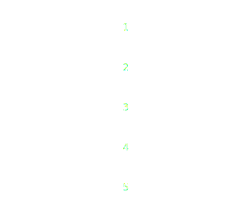
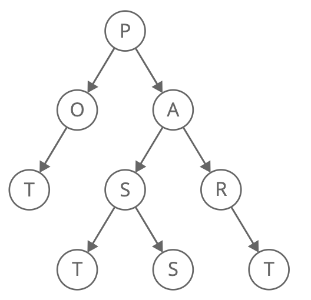
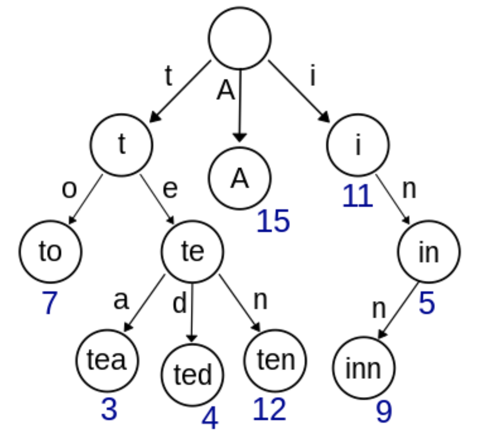

```toc
```
# Preface

This is my own curated list of tips and tricks about data structures and algorithms, in Python or TypeScript.

# Arrays and strings

- An array can work as a replacement for hash tables if you know the range of indices that will go into the array. But sometimes it will waste spaces.
- otherwise, do use hash tables because they have O(1) amortized time complexity.
- `append()` or `push()` for arrays and strings takes O(1) amortized time. It means that on average it will take O(1) for insertion if you keep adding new elements. This is because it takes O(1) time for simple insertions with no capacity increase, but it will take O(n/2) time for insertions with capacity increase, where n is the size of next array (because usually arrays double the capacity). The insertion with capacity increase only comes when you reach n/2 elements. This is why on average the insertion would take O(1) time. 

## Useful code snippets

Initialize an empty array of length 10 full of 0's:
```ts
const arr = Array(100).fill(0)
```
```py
arr = [0] * 10
```

Use `defaultdict` in Python instead of checking for the key every time:

```py
from collections import defaultdict

somedict = {}
print(somedict['test1']) # KeyError
# check if key exists
print('test1' in somedict)

somedict2 = defaultdict(int)
print(somedict2['test2']) # 0

# custom initialization
somedict3 = defaultdict(lambda: 3)
print(somedict3['test3']) # 3
```

# Linked lists

- **The 'dummy head'** technique: pointing to the actual head is useful for languages where there is a no explicit expression of a pointer (like `LinkedListNode *node` in C++). So it would go like this in TS:
    ```ts
    const dummyHead: LinkedListNode = new LinkedListNode()

    dummyhead.next = actualHead
    ```
- You can do a lot without making a singly linked list a doubly linked list.
- **The runner technique**: it employs two pointers at the same time. For example, when you want to get the middle node of the array, you can use this.
    ```py
    def middleNode(self, head: Optional[ListNode]) -> Optional[ListNode]:
      slow = head
      fast = head
      while fast and fast.next:
          slow = slow.next
          fast = fast.next.next
          
      return slow
    ```

    ```ts
    function middleNode(head: ListNode | null): ListNode | null {
        let slow = head
        let fast = head
        
        while (fast && fast.next) {
            fast = fast.next.next
            slow = slow!.next!
        }
        
        return slow
    };
    ```
- **Reversing the list**: classic. goes like this:
    ```ts
    function reverseList(head: ListNode | null): ListNode | null {
      let curr = head
      let prev = null
      let next = null

      while (curr) {
        next = curr.next
        curr.next = prev
        prev = curr
        curr = next
      }

      return prev
    }
    ```
    Reversing the list may be the alternative for a variable to store values sometimes. 
- **Cycle detection**: a variation of the runner technique.
    ```ts
    function hasCycle(head: ListNode | null): boolean {
      let slow = head
      let fast = head

      while (fast && fast.next) {
        slow = slow?.next ?? null
        fast = fast?.next?.next ?? null

        if (slow === fast) {
          return true
        }
      }

      return false
    };
    ```

# Stacks and queues

# Graphs and trees

## DFS and BFS


**DFS**: Makes a discovery into the last found vertex (branch) first.

A DFS would usually involve passing `graph` and `visited` as a reference to the function:

```py
def dfsWrapper(edges: List[List[int]], source: int):
  graph = defaultdict(list)
  for edge in edges:
    graph[edge[0]].append(edge[1])
    graph[edge[1]].append(edge[0])
  visited = set()
  dfs(graph, visited, source)

def dfs(graph: Dict[int, List[int]], visited: Set[int], source: int):
  visited.add(source)

  for neighbor in graph[source]:
    if not neighbor in visited:
      dfs(graph, visited, neighbor)
```

A DFS could also be achieved using a stack, without a recursion:

```py
def dfs(self, graph: List[List[int]]):
    stack = [0]
    seen = set(stack)
    while stack:
        i = stack.pop()
        for j in graph[i]:
            if j not in seen:
                stack.append(j)
                seen.add(j)
```

**BFS**: Makes a discovery into the neighbors of a vertex first before going into any other vertices.

A BFS would normally use a queue or deque which is not included in JavaScript's native API, so other languages like Python needs to be used. This is the normal BFS with an adjacency list (`edges`) as an input.

```py
from collections import defaultdict
from queue import Queue
from typing import List

def BFS(edges: List[List[int]], source: int) -> bool:
  graph = defaultdict(list)

  # O(2E) time
  for edge in edges:
    graph[edge[0]].append(edge[1])
    graph[edge[1]].append(edge[0])
  
  visited = defaultdict(bool)
  queue = Queue()
  queue.put(source)
  visited[source] = True
  # O(V) time
  while not queue.empty():
    vertex: int = queue.get()
    for v in graph[vertex]:
      if not visited[v]:
        visited[v] = True
        queue.put(v)
```

As you can see, a BFS has an O(2E + V) time complexity, which is essentially O(E + V).
BFS may be more useful than DFS in general if you are looking for the shortest path.

## Dealing with the adjacency list

To turn it into a `graph`, you may want to use not only `dict` but also `array` as long as the vertices are labeled from 0 to n:

```py
def create_graph(edges: List[List[int]]):
  graph = [[] for _ in range(len(edges))]
  for e in edges:
    # undirected graph stored in an array
    graph[e[0]].append(e[1])
    graph[e[1]].append(e[0])
```

```py
def create_graph(edges: List[List[int]]):
  graph = defaultdict(list)
  for e in edges:
    # undirected graph stored in a dict
    graph[e[0]].append(e[1])
    graph[e[1]].append(e[0])
```

The same goes for `visited` dict. In some cases, it may be better use a fixed length array to achieve it.

- **binary tree** is a tree where `all left descndents' values <= n < all right descendents' values` for every node value `n`.
  - a **complete binary tree** is a tree where every level of the tree is fully filled.
- **red-black trees**
- **AVL trees**

## Topological sort




- Happens in a DAG (directed acyclic graph) and returns an array of nodes in which each node appears before all the nodes it is pointing to.
- **Formal definition**: A topological ordering of a graph is a linear ordering of the vertices of a DAG such that if (u, v) is in the graph, u appears before v in the linear ordering
- It is guaranteed that:
  - a DAG has **AT LEAST ONE** topological ordering
  - a cyclic graph **DOES NOT have** a topological ordering 

### DAG (Directed acyclic graph)

The precise definition of DAG is this: 
A graph that has 
- at least one vertex with the **indegree zero** and 
- one vertex with the **out-degree zero**

### Iterative topological sort: Kahn's algorithm

1. Find nodes with zero indegree
2. Store the nodes in zero indgree in a queue (a stack works too)
3. While the queue is not empty:
    1. Dequeue an element from the queue
    1. Increment the number of visited nodes
    1. Reduce the indegrees of all neighbors by one
    1. If the indegree of any neighbors becomes zero, add the corresponding neighbor to the queue
    1. Repeat

To put it in layman's terms, you will 
1. find the vertex that is not pointed to by any other vertices
2. remove the vertex and its outgoing edges, and push that vertex to the topological order
3. repeat the process until you go through all vertices 

```py
def toposort(self, n: int, directed_edges: Dict[int, List[int]]):
    directed_graph: List[List[int]] = [[] for _ in range(n)]
    indegree: List[int] = [0] * n
    topoorder: List[int] = []
    # build a graph and
    # find indegrees of vertices 
    # O(E)
    for edge in directed_edges:
        to, src = edge
        directed_graph[src].append(to)
        indegree[to] += 1
    queue = Queue[int]()
    # find vertices of indegree == 0
    # O(V)
    for i in range(n) :
        if indegree[i] == 0:
            queue.put(i)
    
    # remove the vertices of indegree == 0 and 
    # put them into the topological order
    #
    # This while loop runs exactly O(V) times in total
    while not queue.empty():
        # You are removing a vertex 'curr'
        curr: int = queue.get() 
        topoorder.append(curr)

        # This for loop runs O(E) number of times in total
        for v in directed_graph[curr]:
            indegree[v] -= 1
            # If the neighbor of 'curr' no indegree anymore too,
            # put it into the queue for processing
            if indegree[v] == 0:
                queue.put(v) # .put (O(1)) is executed for O(V) exact times in total
    if len(topoorder) != n:
      raise Exception("Cyclic graph")
    return topoorder
```

Complexities:
- time: O(V + E)
  - build a graph and calculate indegrees of a graph: O(E)
  - find the vertices of indegree == 0: O(V)
  - remove every vertex and edge in the graph (don't get tricked into the while loop. [Think about what it does](https://stackoverflow.com/questions/69622225/topological-sort-complexity-in-linear-time)): O(V) + O(E)
  - total: O(E) + O(V) + O(V) + O(E) = O(V + E)
- space: O(V)
  - store directed graph: O(V)
  - store indegrees: O(V)
  - store topological sort result: O(V)

### Kahn's algorithm and cycle detection

Kahn's algorithm identifies cycle in a DAG when the number of collected vertices in the topological sort is not equal to the number of vertices in the graph:

```py
if len(topoorder) != n:
  raise Exception("Cyclic graph")
```

### Classic DFS topological sort

This approach is different from Kahn's algorithm because it does not use while loop to achieve the sort.

The algorithm goes like this:
1. Store the graph in the form of a dictionary that contains the target vertex (the one that is pointed to) as the **key**, and the source vertex as one of the values in the list or set as the dictionary's value. In short, store it as: `Dict[int, List[int]]` or `Dict[int, set]` 
2. If the cycle is detected in any stages below, immediately return.
3. For each vertex in the graph, run `dfs` if it is not visited yet.
4. Inside `dfs`:
    1. If the vertex has been visited, mark cycle as detected
    1. If the vertex has not been visited at all, mark the vertex is visited and recursively run `dfs` on the neighbor vertices pointing to it (so that the last call of the dfs initiated from this vertex ends up in the vertex that has zero indegree)
    1. Mark the vertex as fully visited after all recursive calls to its neighboring vertices have been finished, and insert the vertex into the topological order.
5. Return the accrued topological order

```py
NOT_VISITED = 0 # white
VISITING = 1 # grey
FULLY_VISITED = 2 # black

def toposort(n: int, directed_edges: List[List[int]]):
    topoorder, found_cycle = [], { 'found': 0 }
    visited_status = [0] * n
    directed_graph: Dict[int, List[int]] = defaultdict(list)
    for to, src in directed_edges:
        # VERY IMPORTANT!! put the target vertex as the key, and the 'from' vertex into the value (list)
        directed_graph[to].append(src)

    for i in range(n):
        if found_cycle['found'] == 1: break      # early stop if the loop is found
        if visited_status[i] == NOT_VISITED:
          dfs(i, directed_graph, visited_status, topoorder, found_cycle)
  
    return [] if found_cycle['found'] == 1 else topoorder

def dfs(
  vertex: int, 
  directed_graph: Dict[int, List[int]], 
  visited_status: List[int], 
  topoorder: List[int], 
  found_cycle: Dict[str, int]
):
    if found_cycle['found'] == 1: return     # early stop if the loop is found    
    if visited_status[vertex] == VISITING:
        found_cycle['found'] = 1               # loop is found
    if visited_status[vertex] == NOT_VISITED:           # node is not visited yet, visit it
        visited_status[vertex] = VISITING             # color current node as gray
        for neighbor_pointing_to_vertex in directed_graph[vertex]:   # visit all its neighbors pointing to the vertex
          dfs(neighbor_pointing_to_vertex, directed_graph, visited_status, topoorder, found_cycle)
        visited_status[vertex] = FULLY_VISITED             # color current node as black
        topoorder.append(vertex)              # add node to answer
```

### Topological sort: DFS vs Kahn's algorithm (BFS)

| Complexities | BFS(kahn) | DFS                                             |
|--------------|-----------|-------------------------------------------------|
| Time         | O(V + E)  | O(V + E)                                        |
| Space        | O(V + E)  | O(V + E) but O(h) where h is height of the tree |

For example, for a complete binary tree, the number of leaves will be  n / 2 = O(n) where n is the number of nodes in the tree. In this case, the recursive call stack has a height of h = O(log n) < O(n). Therefore, DFS will therefore use less memory than BFS because BFS 

## Path discovery

### Finding all paths in a graph from a to b

This is an example of using DFS to find all paths from vertex 0 to n - 1.

```py
from typing import List

class Solution:
    def all_paths(self, graph: List[List[int]]) -> List[List[int]]:
      def dfs(curr: int, path: List[int]):
        if curr == len(graph) - 1: all_paths.append(path)
        else:
          for i in graph[curr]: dfs(i, path + [i])  
      all_paths: List[List[int]] = []
      dfs(0, [0])
      return all_paths
```

## Trie (Prefix tree)

Trie is a special arrangement of nodes such that a prefix of each string is recursively stored up to the root node.

 

Complexities (where `k` is the length of a string and `n` is the number of strings stored)
- time
  - search: O(k)
  - insert: O(k)
- space: O(n * k)

A trie is useful when you need to search for matching prefix from many strings. No major languages offer this data structure in their std. Your own implementation is needed.

```py
class TrieNode:
    def __init__(self) -> None:
        # you can change this to self.nodes: List[TrieNode] = [None] * characters_len
        # if you know the exact set of characters you will receive
        self.nodes: dict[str, TrieNode] = {}
        # is_leaf tells if the node is the end of a word
        self.is_leaf = False

    def insert_many(self, words: list[str]) -> None:
        for word in words:
            self.insert(word)

    def insert(self, word: str) -> None:
        """
        recursively insert char by char
        """
        curr = self
        for char in word:
            if char not in curr.nodes:
                curr.nodes[char] = TrieNode()
            curr = curr.nodes[char]
        curr.is_leaf = True

    def find(self, word: str) -> bool:
        """
        recurisvely find char by char
        if one char in the middle is not in the tree,
        return false
        """
        curr = self
        for char in word:
            if char not in curr.nodes:
                return False
            curr = curr.nodes[char]
        return curr.is_leaf

    def delete(self, word: str) -> None:
        """
        Deletes a word in a Trie
        :param word: word to delete
        :return: None
        """

        def _delete(curr: TrieNode, word: str, index: int) -> bool:
            if index == len(word):
                # If word does not exist
                if not curr.is_leaf:
                    return False
                curr.is_leaf = False
                return len(curr.nodes) == 0
            char = word[index]
            char_node = curr.nodes.get(char)
            # If char not in current trie node
            if not char_node:
                return False
            # Flag to check if node can be deleted
            delete_curr = _delete(char_node, word, index + 1)
            if delete_curr:
                del curr.nodes[char]
                return len(curr.nodes) == 0
            return delete_curr

        _delete(self, word, 0)


def print_words(node: TrieNode, word: str) -> None:
    """
    Prints all the words in a Trie
    :param node: root node of Trie
    :param word: Word variable should be empty at start
    :return: None
    """
    if node.is_leaf:
        print(word, end=" ")

    for key, value in node.nodes.items():
        print_words(value, word + key)


def test_trie() -> bool:
    words = "banana bananas bandana band apple all beast".split()
    root = TrieNode()
    root.insert_many(words)
    # print_words(root, "")
    assert all(root.find(word) for word in words)
    assert root.find("banana")
    assert not root.find("bandanas")
    assert not root.find("apps")
    assert root.find("apple")
    assert root.find("all")
    root.delete("all")
    assert not root.find("all")
    root.delete("banana")
    assert not root.find("banana")
    assert root.find("bananas")
    return True
```

## Dijkstra's algorithm
