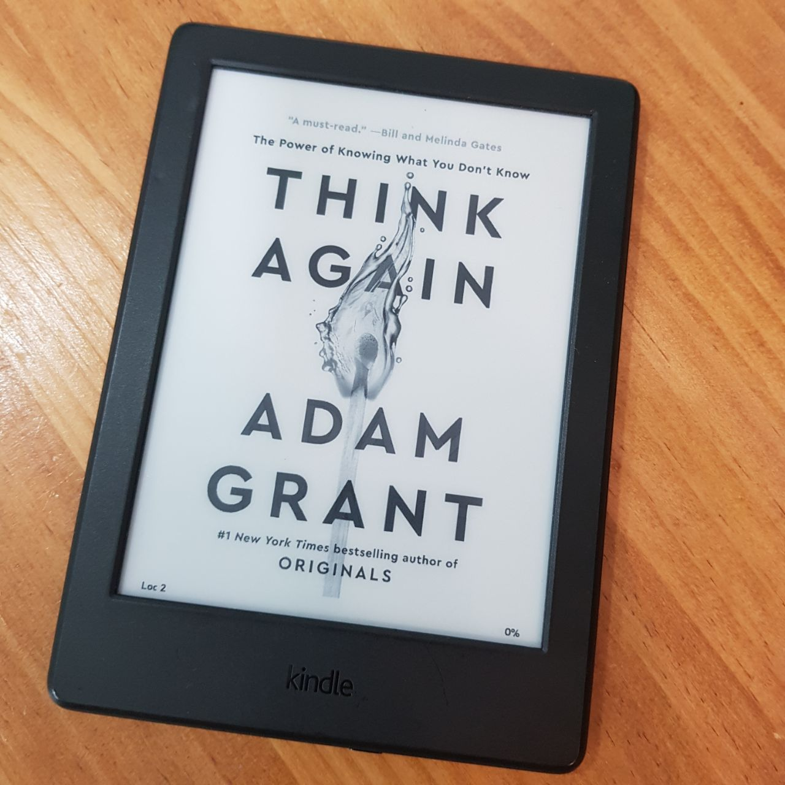

This is my summary on _Think Again_ by [Adam Grant](https://adamgrant.net/), who's already a very renowned professor teaching at Wharton, and also a bestselling author of multiple books about psychology and organization.



```toc
```

## Prologue

- Even lives (example of smokejumpers) can be saved if we avoid the traditional thinking and try to think something novel.
- Students tend to score more correctly on the questions on which they revise the answers.
- There's a reason why people are reluctant to rethinking: _we hesitate at the very idea of rethinking._
- But rethinking would allow you to be _better positioned for success at work and happiness in life._

> Thinking again can help you generate new solutions to old problems and revisit old solutions to new problems.

## Part I. Individual Rethinking: Updating our own views

### Chapter 1. A Preacher, a Prosecutor, a Politician, and a Scientist Walk into Your Mind

- BlackBerry's initial success and its following failure to adapt to (rethink) the rapidly changing landscape in the smartphone market demonostrates the true importance of rethinking.
- Second thoughts: we often favor feeling right over being right, and we need to fix that.
- "we often slip into the mindsets of three different professions: preachers, prosecutors, and politicians."
  - **preachers**: 
    - our sacred beliefs are in jeopardy: we deliver sermons to protect and promote our ideals. 
    - changing mind is a moral weakness.
  - **prosecutors**: 
    - we marshal arguments to prove others wrong and win our case.
    - changing mind is admitting defeat.
  - **politicians**:
    - we seek to win over an audience: we campaign and lobby for the approval of our constituents.
    - changing mind is flip-flopping in response to carrots and sticks
  - **all these mindsets don't leave a room for rethinking.**
- A different pair of goggles: _be a **scientist**._ It helps you find the **truth**. Always favor this mode of thinking over that of preachers, prosecutors, and politicians.
  - doubt what you know
  - be curious about what you don't know
  - update views based on new data.
  - changing mind is a sign of intellectual integrity
- Scientifically rethinking entrepreneurs earned more revenue than others in an experiment.
- The smarter they are, the harder they fail: 
  - confirmation bias: seeing what's expected
  - desirability bias: seeing what's wanted
  - "I'm not biased" bias: people beleive they're more object than others.


- Don't stop unbelieving: there's a rethinking cycle: humility, doubt, curiosity and discovery. _**if knowledge is power, knowing what we don't know is wisdom**_.


- iPhone had the worst reception by Steve Jobs when the idea was first pitched, because it would get in the way of iPod (but think now: anyone uses iPod now?).

### Chapter 2. The Armchair Quarterback and the Impostor: Finding the Sweet Spot of Confidence

- Anton's syndrome: patients don't mentally recognize they are physically blind. Just like this, our blindness in knowledge may give us false confidence in judgement, preventing us from rethinking.
- A tale of two syndromes: 
  - Halla ran for presidency in Iceland despite her disbelief in her own ability and experience.
  - Armchair quarterback syndrome: confidence exceeds competence (in this case, the governor of the central bank, who had no fiannce or econ background)
  - Imposter syndrome: competence exceeds confidence (in this case, Halla, who wasn't convinced of her competence although she had enough)
  - The ideality is in the middle of armchair quarterback and an impostor syndrome.
- The ignorance of arrogance: Dunning-Kruger effect. **When we lack competence, we are likely to be overconfient.** If you lack actual intelligence, you overestimate your intelligence.

> The first rule of the Dunning-Kurger club is you don't know you're a member of the Dunning-Kruger club.

- Stupid: 
  - Armchair quarterback simply gets in the way of rethinking. People with this syndrome wouldn't just accept they are less competent. Their egos defend them. Unable to think about their own thinking.
  - Oddsson lacked **humility** and valued **arrogance**.
- What goldilocks got wrong: 
  - Targeting enough amount of confidence is not right. 
  - Humility is often misunderstood as low confidence
  - The sweet spot of confidence is humility + confidence.


- Benefits of doubt: the more often they felt like imposters, the higher their performance reviews from their supervisors.
  1. makes you work harder
  1. makes you work smarter by rethinking the strategy
  1. makes you a better learner
  1. basically, makes you stay in the confident humility.

### Chapter 3. The Joy of Being Wrong

- In one experiment in Harvard, participants were harshly challenged with views opposite of theirs. Some found it bewildering, while others found it enjoyable and thrilling.

> They aren’t just comfortable being wrong; they actually seem to be thrilled by it.

- Being wrong isn't bad

- But the ego often shuts us down than open up when a core belief is questioned

- Next level: to _enjoy_ being wrong

- Being wrong means you're _learning_, honest, and willing to learn.

- Detachment: 
  - detach yourself from the past self if you know your belief was wrong
  - separate your opinion from your identity: who you are should be a question of what you value, not what you believe

- Your views should constantly evolue through rethinking and 'updating' (being wrong & learning again). Changing beliefs sooner is better than later 

> I’ve noticed a paradox in great scientists and superforecasters: the reason they’re so comfortable being wrong is that they’re terrified of being wrong. What sets them apart is the time horizon. They’re determined to reach the correct answer in the long run, and they know that means they have to be open to stumbling, backtracking, and rerouting in the short run.

### Chapter 4. The Good Fight Club: The Psychology of Constructive Conflict

- Relationship conflict vs task conflict
  - relationship conflict: emotional, personal conflict. Gets in the way of rethinking
  - task conflict: conflict on idea/opinions. Leads to contructive, rethinking conversation.
  - well-performing teams have consistently low relationship conflict and frequently and blatantly engage in task conflicts whenever they need to

> “The absence of conflict is not harmony, it’s apathy.”

- It's crucial to know how to have a good fight

- Be 100% open to a good fight. Encourage it and get used to it.

- "The plight of the people pleaser": don't avoid conflict just because you don't want anyone to get mad at you.

> Strong leaders engage their critics and make themselves stronger. Weak leaders silence their critics and make themselves weaker.

- Let caring people challenge you

- Don't agree to disagree: arguing is a sign of respect.

- Prevent task conflict from spilling over into relationship conflict.
  - Think of a dispute as a debate rather than a disagreement. Disagreement feels personal and hostile. Instead, start by asking "can we debate?"
  - Argue about _how this idea might be right_ instead of _why this idea is right_

## Part II: Interpersonal thinking

### Chapter 5. Dances with Foes: How to Win Debates and Influence People

- How to open up people's minds instead of shutting them down

- Use a collaborative approach with more humility, curiosity and invitation to think more like scientists.

- Debate is not a war. Preacher/prosecutor mindset is not appropriate.

> It’s more like a dance that hasn’t been choreographed, negotiated with a partner who has a different set of steps in mind.

- Plan and find expected areas of agreement. Find common grounds. Accept valid points from the opponent.
- It's not ncessary to pour out all reasons to support the case. Too many points would come at the cost of having to defend more arguments, especially listeners don't really care about what you say.
- No offense or defense. Your argument doesn't have to be the strongest.
- Questions help. Less assertive but putting a step forward together.


- What if people don't want to dance anyway?
  - Start with common ground and fewer reasons
  - Show more curiosity and interest
  - Be tranquil
  - Test your understanding of the other side's feelings by asking

- Moderate confidence may be better than low or high confidence

### Chapter 6. Bad Blood on the Diamond: Diminishing Prejudice by Destabilizing Streotypes

- People are against other groups for a few or no valid or significant reasons at all

- Group polarization: interacting with people who share the streotypes already, which fortifies the existing view

- How to cope:
  - Common identity: doesn't work
  - Empathy towards the other: doesn't work
  - Thinking about arbitariness of animosity: works

- Offer counterfactual thinking. Let people imagine how their views would have been if they were in a different situation. i.e. if you were born Black, Hispanic, Asian, ...

> Psychologists find that many of our beliefs are cultural truisms: widely shared, but rarely questioned.

> As a general rule, it’s those with greater power who need to do more of the rethinking, both because they’re more likely to privilege their own perspectives and because their perspectives are more likely to go unquestioned.

### Chapter 7. Vaccine Whisperers and Mild-Mannered Interrogators: How the Right Kind of Listening Motivates People to Change

- People took it for granted that Measles vaccine is risky and did not get their children vaxxed
- Preaching-mode govnts failed to turn their minds. 
- What doesn't sway us can make our beliefs stronger. Resistence hardens.
- Just telling them hard facts backfires in many cases
- Movitational interviewing: instead, ask questions and listen to the answers
  - start with humility and curiosity. activates a rethinking cycle.
  - statistically and clinically proven effect

> When people ignore advice, it isn’t always because they disagree with it. Sometimes they’re resisting the sense of pressure and the feeling that someone else is controlling their decision.

- Sustain talk vs change talk: go for change talk for a motivational interview
  - Sustain talk: about mantaining the status quo
  - Change talk: referencing a desire, ability, need or commitment to make adjustments

> The objective is not to be a leader or a follower, but a guide.

- _Just **listen**_.

> interacting with an empathetic, nonjudgmental, attentive listener made people less anxious and defensive.

- "Inverse charisma": be a great listener.

- Listening is a display of respect and expression of care

## Part III. Collective rethinking: Creating Communities of Lifelong Learners

### Chapter 8. Charged Conversations: Depolarizing our divided discussions

- binary bias: seeking clarity and closure by simplifying a complex continuum into two categories
  -Overcome the bias: a good starting point is to become aware of the range of perspectives across a given spectrum.
  - Problems are often more complex than just being binary. Realization of complexity gives us humility and doubts on existing opinions, and thus leads to rethinking.
  - Resisting the impulse to simplify is a step toward becoming more argument literate.
  - Humans, like polarizing issues, rarely come in binaries.

- accept uncertainty around complex issues
  - people pay more attention when you accept it
  - people will ignore or even deny the existence of a problem if they’re not fond of the solution.
  - include caveats and contingencies

- put yourselves in another person's shoes
  - The greater the distance between us and an adversary, the more likely we are to oversimplify their actual motives and invent explanations that stray far from their reality
  - productive conversations cover a much more varied spectrum of emotions
  
### Chapter 9. Rewriting the Textbook: Teaching Students to Question Knowledge

- Knowledge is evolving every second. Students need to be motivated to update their knowledge in the present.

- Rethinking is a kind of education

- Unlearning is important. Discard old, outdated, wrong knowledge and adopt the new and correct knowledge

- Rethinking needs to become a regular habit. Unfortunately, traditional methods of education don’t always allow students to form that habit.

- Students get more knowledge and skill from active-learning sessions entaling more effort

- Lectures are not always the best method of learning, and they are not enough to develop students into lifelong learners

> good teachers introduce new thoughts, but great teachers introduce new ways of thinking

### Chapter 10. That's Not the Way We've Always Done: Building Cultures of Learning at Work

> Rethinking is not just an individual skill. It’s a collective capability, and it depends heavily on an organization’s culture.

> Rethinking is more likely to happen in a learning culture, where growth is the core value and rethinking cycles are routine.

- The worst thing about best practices is that once we’ve declared a routine the best, it becomes frozen in time.

- Focusing on results is not favorable for long-term learning. Provide an environment where people feel safe to discuss and introduce new ways of thinking and the problems in current thinking.

- Rethinking is more likely when we separate the initial decision makers from the later decision evaluators.


> Even if the outcome of a decision is positive, it doesn’t necessarily qualify as a success. If the process was shallow, you were lucky. If the decision process was deep, you can count it as an improvement: you’ve discovered a better practice. If the outcome is negative, it’s a failure only if the decision process was shallow. If the result was negative but you evaluated the decision thoroughly, you’ve run a smart experiment.

## Part IV. Conclusion
### Chapter 11. Escaping Tunnel Vision: Reconsidering Our Best-Laid Career and Life Plans

- Whenever you feel like you 'gotta stay on track' for your career, rethink once more.

> We all have notions of who we want to be and how we hope to lead our lives. ... The danger of the plans is that they can give us tunnel vision, blinding us to alternative possibilities.

> When we dedicate ourselves to a plan and it isn’t going as we hoped, our first instinct isn’t usually to rethink it. Instead, we tend to double down and sink more resources in the plan. This pattern is called escalation of commitment.

- There’s a fine line between heroic persistence and foolish stubbornness.

> “What do you want to be when you grow up? As if growing up is finite. As if at some point you become something and that’s the end.”

- Choosing a career isn’t like finding a soul mate. It’s possible that your ideal job hasn’t even been invented yet.

> I’ve noticed that the students who are the most certain about their career plans at twenty are often the ones with the deepest regrets by thirty.

> For the record, I think it’s better to lose the past two years of progress than to waste the next twenty. In hindsight,

- Answering these career checkup questions is a way to periodically activate rethinking cycles.


- Chasing happiness often chases it away, probably because 
  - we ruminate about why our lives aren't more joyful than honoring moments of joy.
  - we spend too much time striving for peak happniess
  - we overemphasize pleasure at the expense of purpose

> When we pursue happiness, we often start by changing our surroundings. We expect to find bliss in a warmer climate or a friendlier dorm, but any joy that those choices bring about is typically temporary. You are you. 

- Passion is developed rather than discovered

> writing out a plan for your life “is like driving at night in the fog. You can only see as far as your headlights, but you can make the whole trip that way.”

- The simplest way to start rethinking our options is to question what we do daily.

## Actions for impact

1. Think like a scientist
2. Define your identity in terms of values, not opinions
3. Seek out information that goes against your views
4. Beware of getting stranded at the summit of Mount Stupid (more confidence means more overestimation)
5. Harness the benefits of doubt
6. Embrace the joy of being wrong
7. Learn something new from each person you meet
8. Build a challenge network, not just a support network
9. Don’t shy away from constructive conflicts
10. Practice the art of persuasive listening
11. Question how rather than why
12. Ask "What evidence would change your mind?": try to know what would open their minds
13. Ask how people originally formed an opinion
14. Acknowledge common ground
15. Remember less is often more
16. Reinforce freedom of choice
17. Have a conversation about the conversation
18. Complexify contentious topic
19. Do not shy away from caveats and contingencies
20. Expand your emotional range
21. Have a weekly myth-busting discussion at dinner
22. Invite kids to do multiple drafts and seek feedback from others.
23. Stop asking kids what they want to be when they grow up
24. Abandon best practices
25. Establish psychological safety
26. Keep a rethinking scoreboard
27. Throw out the ten-year plan
28. Rethink your actions, not just your surroundings
29. Schedule a life checkup
30. Make time to think again