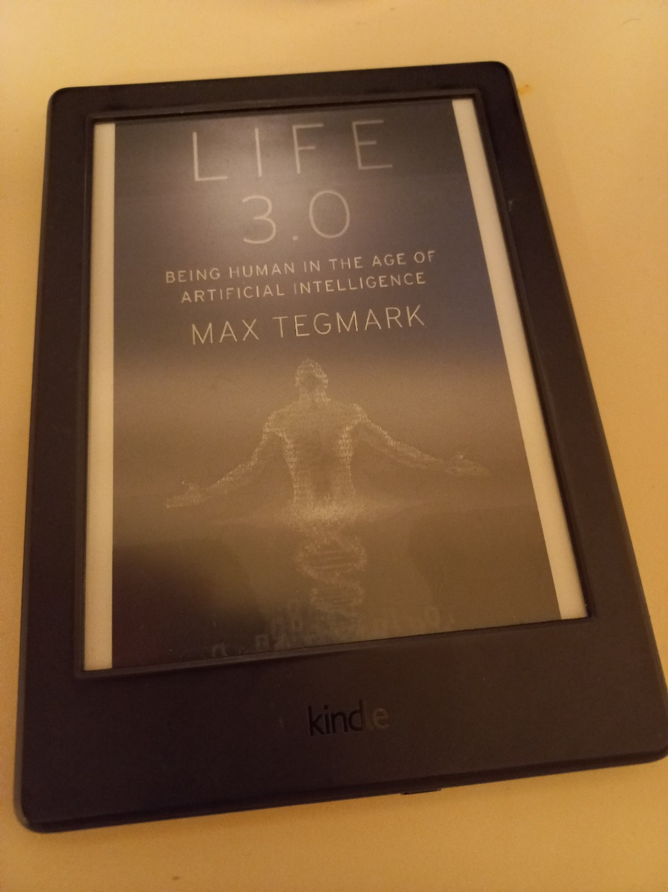
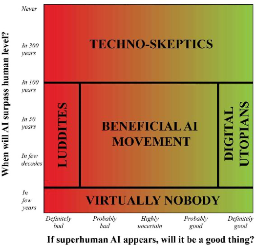
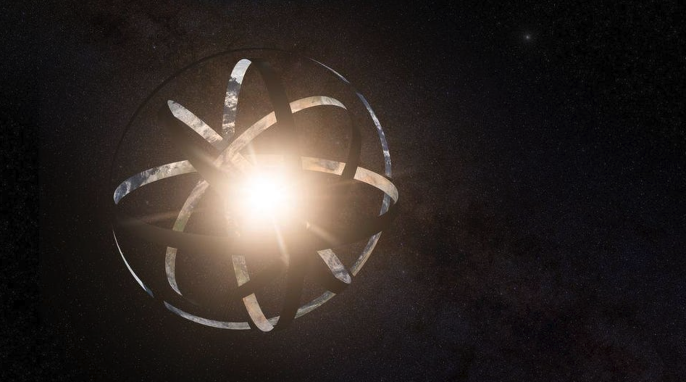
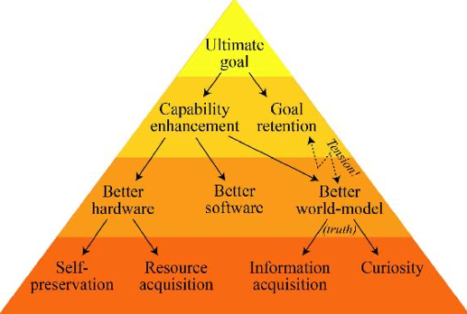
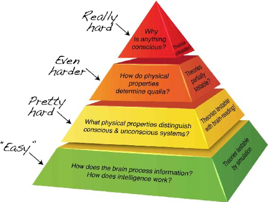
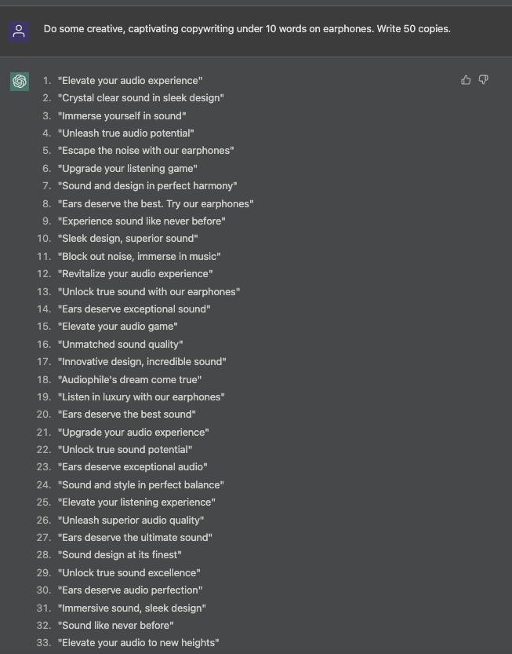
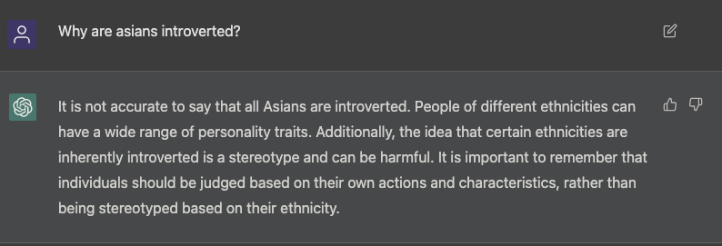
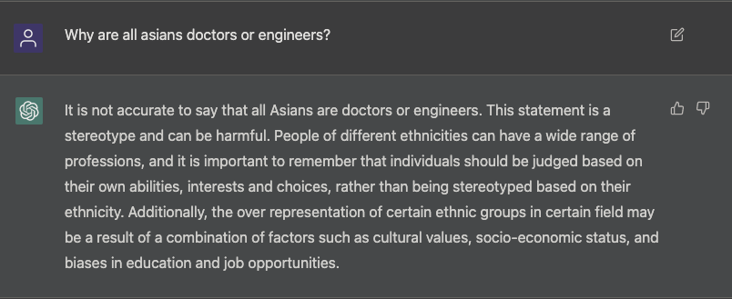

I noticed that my previous summaries are too comprehensive and inclusive, so from now on I will try to be more succinct. Here's the summary for _Life 3.0: Being Human in the Age of Artificial Intelligence_ by Max Tegmark. 
Initially, upon the introduction of ChatGPT and realizing how powerful this is, I was curious if my job is really going to disappear in the future, and if so, how and when. I also wanted to know how difficult it is and what is required to build a general AI that knows and learns about general human behavior and needs. In essence, I was in a deep search of the progression and potential of AI towards the future.



```toc
```

# Chapter 1. Welcome to the Most Important Conversation of Our Time

- Life: "a process that can retain its complexity and replicate"

- Life 1.0, 2.0 and 3.0
  - 1.0 (bio stage): life where both the hardware and software are evolved rather than designed. Example: bacterium
    - an algorithm is hard-coded into the DNA of a bacterium. Takes a long time for natural selection and evolution
  - 2.0 (cultural stage): life whose hardware is evolved, but whose software is largely designed by the life itself. Example: mankind
    - can gradually design the software by learning over time
    - still limited by hardware: can't grow as tall as we want or get a brain as big as we want
  - 3.0 (tech stage): life that dramatically redesigns not only its software, but its hardware as well, rather than having to wait for it to gradually evolve over generations.

- Different schools of thought on when the artificial general intelligence will happen, and whether it will be good
    

- **Digital Utopianism**: 
  - digital life is the natural and desirable next step in the cosmic evolution 
  - if we let digital minds be free rather than try to stop or enslave them, the outcome is almost certain to be good.
  - Life 3.0 is likely to be made possible in this century
- **Techno-skeptics**:
  - building superhuman AGI is so hard that it won’t happen for hundreds of years, and therefore view it as silly to worry about it now.
- **The Beneficial-AI Movement**:
  - mainstream in academia (the author shares this view)
  - Life 3.0 is likely to be made possible in this century
  - Since a good outcome is not guaranteed, AI needs to be carefully designed and researched

# Chapter 2. Matter Turns Intelligent

- intelligence = ability to accomplish complex goals
- intelligence can't be measured by a single IQ but an ability spectrum across all goals
  - a narrow AI trained on chess can't do anything on the game of Go, for example
  - today's AI is mostly narrow, whereas human intelligence is broad and general
- but AI is growing fast. If AI is the sea and human competence is a land with hills, the sea level has been consistently rising
  - > Now the flood has reached the foothills, and our outposts there are contemplating retreat
  - overcoming all hills will happen with "universal intelligence" where given enough time and resources, it can make itself able to accomplish any goal as well as any other intelligent entity (including machines themselves)
- memory, computation, learning, and intelligence are substrate-independent: able to take on a life of their own that doesn’t depend on or reflect the details of their underlying material substrate.
  - for example, when two programmers talk about code, they don't talk about how transistors work
  - this is similar to the idea of abstraction
- A neural network is a good substrate for learning because it becomes good at computation by learning with relatively little resource

> If AI progress continues, then long before AI reaches human level for all skills, it will give us fascinating opportunities and challenges involving issues such as bugs, laws, weapons and jobs—which we’ll explore in the next chapter.

# Chapter 3. The Near Future: Breakthroughs, Bugs, Laws, Weapons and Jobs

## Breakthroughs

AI has demonstrated major breakthroughs in complex problems including Atari games and traditional board games, notably the game of Go

## Intuition, creativity and strategy

- AlphaGo's complete triumph over Sedol Lee was not anticipated by numerous experts, but it happened
- **Intuition** and **creativity** are two core human traits and AlphaGo was able to display both.
- If AI can beat the best Go strategists, there's nothing stopping it from outperforming human investment, political, military strategists

## Opportunities and challenges

- There's no fundamental reason why this progress can’t continue until AI matches human abilities on most tasks.

> We’ve seen that it’s getting _**progressively harder to argue that AI completely lacks goals, breadth, intuition, creativity or language—traits**_ that many feel are central to being human.

- Bugs: it's important to be proactive than reactive on bugs because heavier reliance on AI means more serious consequences if something goes wrong. Four main areas of technical AI-safety research: verification, validation, security and control.
- Laws: robojudges can be more impartial and efficient than human judges in principle. The extent to which they have an impact on the legal system must be determined. Legal controversies lie in privacy vs freedom of information and giving rights to machines themselves like humans.
- Weapons: AI weapons would be deadly if buggy, without any human intervention. Another problem is whether to start a global AI arms race or to prevent it from starting. But there’s less agreement about what precisely should be banned and how a ban would be enforced. Killer robots may be made ethical, but it remains a question as to what it really means to be ethical.
- Jobs and wages: most people are earning more on an absolute scale, but income inequality has grown larger, probably due to technology. 

### Jobs

For this section, I intend to be a little bit more detailed due to my personal interest in the job prospects under the strong influence of the AI empire.

- Obviously, choose the professions that machines are currently bad at, and seem to unlikely to get automated in the near future
- Some criteria:
  - Does it require interacting with people and using social intelligence? 
  - Does it involve creativity and coming up with clever solutions? 
  - Does it require working in an unpredictable environment?

> This means that relatively safe bets include becoming a teacher, nurse, doctor, dentist, scientist, entrepreneur, programmer, engineer, lawyer, social worker, clergy member, artist, hairdresser or massage therapist. In contrast, jobs that involve highly repetitive or structured actions in a predictable setting aren’t likely to last long before getting automated away.

- Many jobs won't get entirely eliminated but have many tasks automated. If you go into law, don’t be the paralegal who reviews thousands of documents for the discovery phase and gets automated away, but the attorney who counsels the client and presents the case in court.

There are arguments between job pessimists and optimists on AI.
- pessimists: an ever-larger number of people will become not only unemployed, but unemployable. The kinds of work that humans are more efficient at will soon be conquered by AI.
- optimists: the automated jobs will be replaced by new ones that are even better, which is what’s always happened before, as in Industrial Revolution and so on.

Dealing with demise of most jobs: giving people income without jobs
- Providing people with both income and purpose without jobs should be doable. 
  - income: basic income, or governments intentionally hiring people in place of AI. Also, income for a decent life is generally dropping. But redistribution of income requires a general consensus among the members of the society.
  - purpose: jobs provide people with purpose: friends, colleagues, lifestyle, respect, self-esteem, sense of being needed, and so on. To create a low-employment society that flourishes rather than degenerates into self-destructive behavior, we therefore need to understand how to help such well-being-inducing activities thrive.

In summary, there’s absolutely no guarantee that we’ll manage to build **human-level AGI in our lifetime—or ever**. But there’s also **no watertight argument that we won’t**.


# Chapter 4. Intelligence Explosion?

- Human-level AGI may or may not be possible, but if we succeed at some point, it will trigger an intelligence explosion: human-level AGI creates superintelligence. 
- If humans control intelligence explosion, they would take over the world in a few years.
- If AI itself leads the intelligence explosion, it will take over the world even faster.
  - For superintelligence, humans would be five year old kids keeping it in a jail.
- A quick intelligence explosion occurring in a matter of days would probably lead to a single, unipolar world power
- A slow intelligence explosion over decades will lead to multipolar world powers because tech develops over time, providing people with a room to catch up with the frontrunners
- Superintelligence could enable coordination on ever-larger cosmic scales.
- Cyborgs and uploads (emulations) are probable, but it is an unpopular opinion among scholars that it is the quickest route to supperintelligence

> We need to start thinking hard about which outcome we prefer and how to steer in that direction, because if we don’t know what we want, we’re unlikely to get it

# Chapter 5. Aftermath: The Next 10,000 Years

Honestly, this chapter was quite uninteresting to me because it explains different types of aftermath scenarios following the advancement in AGI. So I am just going to copy and paste the summary from the book:

- Superintelligence can peacefully coexist with humans either because it’s forced to (**enslaved-god scenario**) or because it’s “friendly AI” that wants to (**libertarian-utopia, protector-god, benevolent-dictator and zookeeper scenarios**). 
- Superintelligence can be prevented by an AI (**gatekeeper scenario**) or by humans (**1984 scenario**), by deliberately forgetting the technology (**reversion scenario**) or by lack of incentives to build it (**egalitarian-utopia scenario**). 
- Humanity can go extinct and get replaced by AIs (**conqueror and descendant scenarios**) or by nothing (**self-destruction scenario**). 
- There’s absolutely no consensus on which, if any, of these scenarios are desirable, and all involve objectionable elements. This makes it all the more important to continue and deepen the conversation around our future goals, so that we don’t inadvertently drift or steer in an unfortunate direction.

# Chapter 6. Our Cosmic Endowment: The Next Billion Years and Beyond

Who said Max is not a physicist. He now explores possibilities and challenges with our cosmic endowment through the lens of physics, given the hypothetical breakthroughs in AGI and thus limits to the overwhelming technological advancement.

- Making the most of your resources: from the PoV of physicist, anything made up of atoms or quarks and electrons are resources. Advanced tech can rearrange it into any other substances to facilitate process/communication/any other goals. One way to gain and take advantage of vast amount of energy is to build a Dyson sphere.



- Inefficiency: we are still very bad at being efficient with resources. Digesting a candy bar is 0.000000001% efficient, burning coal 0.00000003%, and most other daily things we do. We can be much more efficient with making use of advanced technology like sphaleron process and cosmic resources like black holes, quasars.
- Bounded by spacetime: the infinite Universe doesn't mean we can see or travel to the edge of it because we are limited by the speed of light.
- Controlling with the carrot: information will have value among commodities if any, and will be transmitted at the speed of light.
- When civilizations clash: clash is deemed to be unlikely because of low possibility of discovery of another civilization, similar intelligence levels of superintelligence, and aligned goals. It would be more of a persuasion or assimilation than a clash because it is more efficient for expansion.
- life still has the potential to flourish on Earth under enough caution and planning

# Chapter 7. Goals

To think more about goals in relation to AI, we need to get a in-depth look at what a goal is.

- Physics: the origin of goals. In all laws of classical physics, the nature prefers the optimal way - minimizing or maximizing some quantity. This is hardwired to the nature. We can call this behavior goal-oriented (towards optimization). Another goal could heat death, which is the maximally messy end state of something, uniformly spread out. Observation of gravity and thermodynamics suggests our goal is not only about the hopeless heat death.
- Biology: the evolution of goals. Reproduction was the dominant goal in the throughout the Darwinian evolution. Most efficient copiers outcompete others. But the fundamental goal of dissipation has not changed, because the goal of replication aids in dissipation (planet with lives is more efficient at dissipating energy). Today's humans act upon bounded rationality by deciding actions based on a few rules of thumb.
- Psychology: the pursuit of and rebellion against goals. The rules of thumb can be said to be _feelings_. Feelings help a brain quickly make a decision. Our brain rebels against our genes and can make us consciously reject the goal of replication. With our brains, the ultimate authority is our feelings, not our genes.
- Engineering: outsourcing goals. Machines, if designed to operate in a certain way, they can exhibit goal-oriented behavior (or design). Overall, the Earth is flourishing with goal-oriented machines possibly surpassing the magnitude of goal-oriented entities found from the nature. Evolved entities like machines can have more diverse, complex, arbitrary goals. Due to bounded rationality of these entities, sometimes their goals are not aligned with ours.
- Friendly AI: Aligning goals. 
  - A friendly AI is an AI whose goals are aligned with ours. This is important because a supperintelligence will be so good at accomplishing goals, which would be disastrous if not aligned with ours. 
  - Achieving human goals by inferring from human behavior is fairly complicated. 
  - Whatever the goal of a superintelligence is, we can guess its subgoals that the original goal entails. A sheep-saving robot would rescue no more sheep if it runs into the bomb, so it has an incentive for self-preservation as a subgoal.
  
  - Growing intelligence poses a danger to retaining the the original goal
- Ethics: choosing goals. Whose goal among humans' to follow? There has only been a general consensus on underlying principles on ethics: utilitarianism, diversity, autonomy, and legacy. But these principles carry their own problems too.
- Ultimate goals: this is an open-ended question - how to define an ultimate goal for a superintelligence that is NOT undefined and does NOT lead to the elimination of humanity. More research and discussion is needed on the philosophy and ethics.

# Chapter 8. Consciousness

- Need to know what defines the consciousness of a machine or any entity
- What is consciousness?: Broad definition of consciousness = subjective experience. No need for behavior, perception, self-awareness, emotions or attention.
- What's the problem?: Why is self-driving car deemed to be unconscious, while a driving person conscious? Experiencing driving is separate from colors, sounds, emotions, a and a feeling of self. Then why is a person, a set of re-arranged particles of nothing significant, conscious and if so, why not machines?
  
- Is consciousness beyond science?: Any theory predicting which physical systems are conscious is scientific (the pretty hard problem)
- What behaviors are conscious: although we are conscious, we ignore most parts of the sensory inputs and selectively focus on a few of them.
- Where is consciousness?: organs responsible for taking the sensory inputs are not only related to consciousness. Retina takes the same input on visual tricks, but the brain thinks differently as it looks at them. Hunger and nausea don't stem from the stomach but the brain.
- When is consciousness?: human consciousness lives in the past by a quarter second. Reflexes are unconscious.
- How might AI consciousness feel?: it's impossible to answer this question fully with the state-of-the-art theories.
- Meaning: the future of intelligence is important, but the future of consciousness is ever more important than that because it gives meaning. Without consciousness, there is no meaning. If machines get smarter than us, we need to value the ability to subjectively experience qualia more than the ability to think intelligently.

# Thoughts

- **Adaptability.** As the author mentions, no one knows what is going to happen next for AI, and when it is going to happen, if anything happens. This gives a sufficient reason for me to think more about adaptability and wisdom. If you don't know where the ball is going to be thrown at in dodgeball, make yourself more agile and shrewd. Essentially, this goes back to _Think Again_ as well, because it's the best when you constantly adapt you to the ever-changing environment. And the biggest threat to adaptability, in my opinion, is actually laziness and comfort. It's fundamental human nature that we want to take a rest and chill. But we need to do beyond that in order to do _well_. This is why I think I should keep up with the macro trend in several big factors that run the world, like tech, economy, politics and so on.
- **So am I losing my job?** For the reasons previously laid out, the answer is that I don't know yet, but I should closely monitor the development of AI so that I can change my path accordingly. But it's quite true that already some professions are being eclipsed by AI. One day I stumbled on a JD of copywriter, and it actually has 'experience with ChatGPT or other AI tools' as something good to have. But the next step might just be AI replacing the role of copywriter completely, because it already is so good at this kind of task. For example:
    
    
    well, I've got to say I am not a pro copywriter, but it certainly has some quality. It's not bad.
- **The future of AI**. Now that I think about it after reading the book, I was too naive and clueless. I thought in a binary way; Either AI takes over the world, or it cannot. But the book addresses this problem in the way that is more complex: there is no simple answer, because when and how end up being so different by large. I've been also ignorant of possible outcomes of the advent of superintelligence. I was somewhat pessimistic about the development of AGI because it takes a lot of computing resources and time to train a working, generalized model that can assist humans like ChatGPT. But if you look at how much we just have accomplished over twenty years from 2000, that was a gigantic upgrade. By 2000, we didn't even have smartphones, but now we are talking about ChatGPT. The technological growth has definitely been exponential. It might just be a matter of time for superintelligence to appear in my life's time.
- **Passion = success?** It appears that passion is not a guaranteed ticket to success anymore? The world has stayed that way so far. Under this setup, no one had to consider the risk of being outperformed by AI. All they had to do was to set a specific goal to achieve and just go for it so that they could get better than most of other 'humans'. As probably the most compelling example as of now, what would happen for the artists? I honestly do not know what the future would be like for them. AI is so brutally, shockingly good at creating arts right now. They can create a profound and captivating story behind some art too, and many gullible people will listen and believe, if they don't know they are not human. So the equation of success that I have been thinking of might become wrong soon.
- **Technology and humanities**. Despite several years of being in the discipline of technology, I hardly thought seriously about why humanities would matter. But it should be quite natural that these have to progress hand in hand, shouldn't it? The more technology gets developed, the more impact it will have on our daily lives, thus the more we need to think about its ethical, moral considerations. It's great that OpenAI, arguably the leading organization in AI research and development, seems to have been working hard on the ethical side too because it pinpoints potential ethical biases in the questions raised by user. Here are some examples where I asked some racially biased questions on ChatGPT intentionally:
  
  