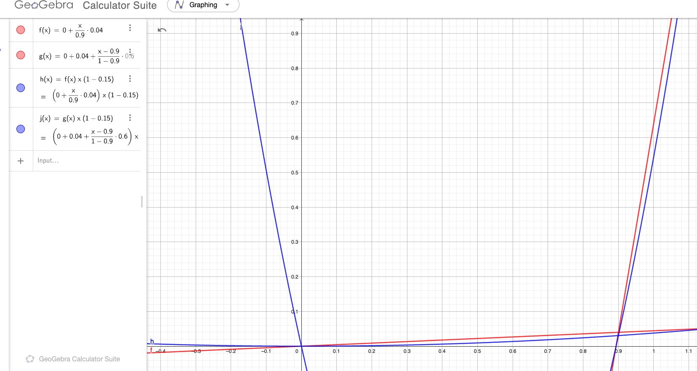
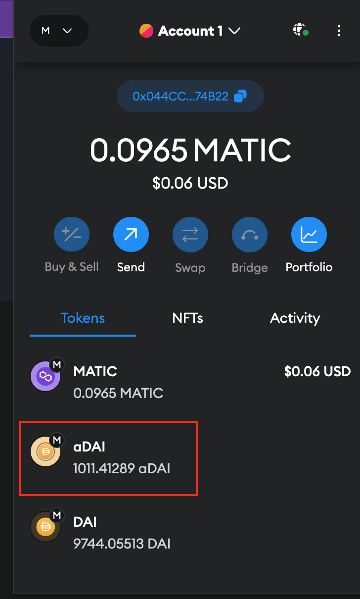
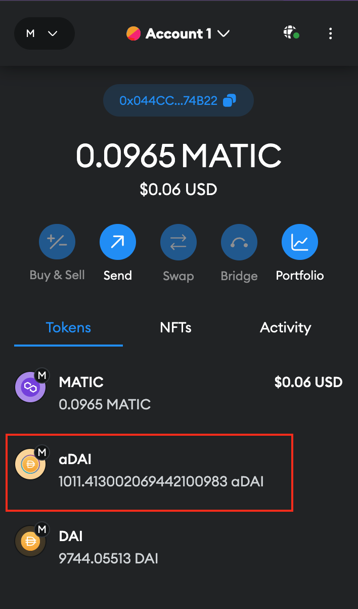
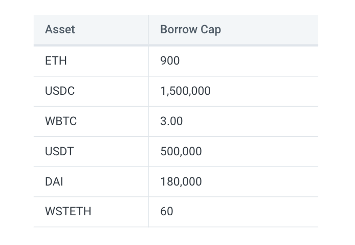
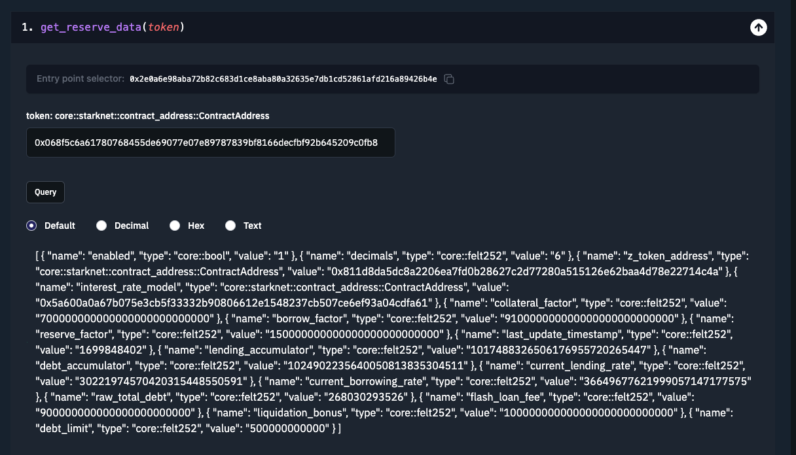
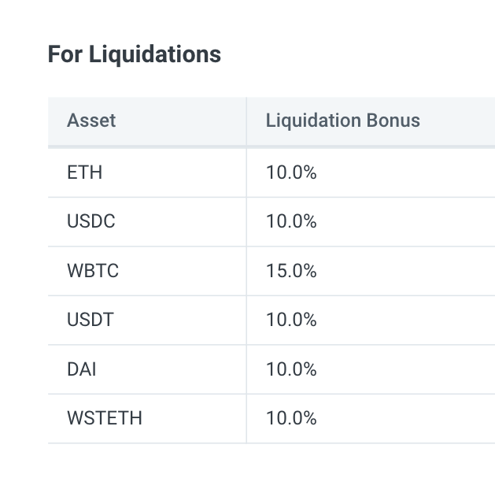

```toc
# This code block gets replaced with the TOC
```

Here's an extensive intro to DeFi lending protocols, especially for a dummy like me. We will look at fundamental concepts and theory, primarily complemented by zklend smart contract codebase at [the commit hash of 10dfb3d1f01b1177744b038f8417a5a9c3e94185](https://github.com/zkLend/zklend-v1-core/commit/10dfb3d1f01b1177744b038f8417a5a9c3e94185).

# How a lending protocol works

## Functionalities

There are 4 major functionalities that a lending protocol provides to the users:

### Deposit

Users can deposit tokens into the smart contract as much as they want. For example, I can deposit 1000 USDC into the smart contract.

This will accrue interest over time. The interest accrual can only happen when there is at least one borrower, because the borrower will need to pay for the depositor's interests. Otherwise, the interest rate stays at 0%. Deposit is the beginning of every other functionalities.

### Borrow

Users are able to borrow certain amount of token, but only based on the amount of collaterals by depositing. For example, you may supply 1.1 ETH to borrow 500 USDC, only if 1.1 ETH is sufficiently more than the value of 500 USDC in USD.

For example, 1.1 ETH is 1,813.79 USD today, and 500 USDC is approximately 500 USD. The collateralization factor, which denotes the value of borrowed amount that can be covered with an amount of collateralized token, is 80%. This means $1813.79 \times 0.8 = 1451.032$ USD worth of other assets can be borrowed from the protocol. This way, all of the borrowings in the protocol are backed by overly sufficient amount of tokens, which is called overcollateralization.

But why borrow in the first place, if you already have as much as (or even more than) the amount of token that you want to borrow?

Below are the possible reasons:

#### Leverage

Here's a table describing the variables for this example:

| name      | value |
|--------------------------|------|
| Price of 1 ETH in USD      | 1200 |
| Price of 1 USDC in USD      | 1 |
| Bob's initial ETH balance     | 2    |
| Collateral factor of ETH | 80%  |
| Gas fees, interests | 0  |

Bob thinks the value of ETH will dramatically increase over time, so just a simple x1 long position is not enough for him. He is so sure that he want to get more than x1 profit when the price of ETH increases. This is how he would position himself at a leveraged long position:

1. Bob deposits 2 ETH into the protocol
2. Bob borrows $1200 \times 2 \times 0.5 = 1200 < 1200 \times 2 \times 0.8 = 1920$ worth of USDC from the protocol. Now he can spend 1200 USDC for whatever he wants.
3. Bob goes to Uniswap, and swaps 1200 USDC for 1 ETH.
4. Now Bob owns 3 ETH, although he has a debt of 1200 USDC.
5. A few days later, the price of 1 ETH in USD increases to 1600 USD. Now his total profit off of this increase is $1600 \times 3 - 1200 \times 3 = 1200$:
   1. Bob now swaps his 1 ETH with 1600 USDC. Then he repays for his 1200 USDC debt. He still has 400 USDC left in his wallet.
   2. Then Bob withdraws 2 ETH from the protocol, and swaps that for $1600 \times 2 = 3200$ USDC at Uniswap.
   3. $3200 +  400 = 3600$ USDC is the total he now has.
   4. Bob started with 2 ETH that was equivalent to 2400 USD, but after the price increase, he made additional 400 USD in addition to 800 USD that is the increase in the USD value of 2 ETH.
6. Imagine if Bob held 3 ETH from the beginning. Then this would be valued at 4800 USD after the price increase, leaving Bob with 1200 USD of profit as well. Without the protocol, he wouldn't have been able to achieve the same profit.

#### Other usages

Other use cases include shorting, liquidity management, arbitraging, etc. The list is not exhausitive and readily available on the Internet. 

### Liquidate

The value of tokens supplied as collaterals fluctuates over time. For example, if you have deposited 1.1 ETH as a collateral, it might be 1790 USD today, but it could have been 1809.47 USD yesterday. In such a case, the total value of collaterals might not be able to cover the total amount of tokens borrowed by a user. 

Then other users get a chance to liquidate that user's position. In liquidation, a substantial amount of the user's debt can be repaid by the liquidator, and the borrower will take an additional percentage of the user's collateral as a liquidation bonus (or a penalty, from POV of the borrower). More on this later too.

### Repay

Repay for the amount of token you borrowed, plus the accrued interest.

## Over-collateralization

Any lending protocol would want to assume over-colleteralization for maximum measure of security. Typically, the more volatile/unstable the price of an asset is, the lower collateral factor it would count for.

Usually, lending protocols would restrict which assets can be used as a collateral. However, it's also worth noting that there are some protocols that allow users to create their own pairs of asset to be borrowed and collateralized.

An example of overcollateralization can be seen in any lending protocols; For example, \$LINK has a 79% of collateral factor on Compound today. This means if you deposit \$100 worth of \$LINK, you will be able to borrow \$79 worth of any assets without being liquidated.

## Utilization rate

We will need to define a few key terms to further understand other concepts.

**Utilization rate** denotes how much of a single asset deposited in the pool is being borrowed at a time.

> The **utilisation rate of each pool** is a function of the current outstanding loan amount over the total capital supply in the specific liquidity pool (from zklend whitepaper)

Here's an example:
- Bob deposits 100 USDT (worth 100 USD) in USDT pool
- Alice deposits 100 DAI (worth 100 USD) in DAI pool
- The collateral factor of DAI is 80%, so Alice borrows 80 USDT, which is the maximum of what she can safely borrow without getting liquidated
- Now, the utilization rate of USDT is $\frac{80}{100} = 80\%$ and that of DAI is $\frac{0}{100} = 0\%$

Utilization rate of an asset will change whenever there is a new borrowing or supply.

Here's [calculate_utilization_rate](https://github.com/zkLend/zklend-v1-core/blob/10dfb3d1f01b1177744b038f8417a5a9c3e94185/src/irms/default_interest_rate_model.cairo#L63-L71) from zklend contract:

```rust
fn calculate_utilization_rate(reserve_balance: felt252, total_debt: felt252) -> felt252 {
    if total_debt == 0 {
        0
    } else {
        let total_liquidity = safe_math::add(reserve_balance, total_debt);
        let utilization_rate = safe_decimal_math::div(total_debt, total_liquidity);
        utilization_rate
    }
}
```

The function's calculation is as follows: $\frac{\text{total debt}}{reserve + \text{total debt}}$. Here, $reserve$ denotes the cash available in the liquidity pool that is not being utilized.

Note that when in used in practice, `total_debt` will have to reflect not only the principal that was borrowed by the user, but also the interests accrued. Otherwise the calculation will result in a wrong value that does not take any interests accrued into account.

## Interest rate

For the interest rate, we need to talk about the interest rate model first. An interest rate model is meant to encourage borrowing when there is enough capital, and discourage borrowing (encourage repayment) and additional supply when there is not enough capital. Logically, we arrive at the conclusion that the interest rate must be high when there is high utilization rate, and low when there is low utilization rate.

We would also want to set an optimal utilization rate, because we generally would not want the utilization rate to be too low (no one's using it) or too high (no one can borrow anymore).

It would be worth noting that the interest rates will change when every single transaction that affects the balance of supply or debt happens. The scope of the interest rates to be discussed in this post, therefore, are only variable interest rates.

### Borrow interest rate

With all of these in mind, we can introduce this interest rate model **for borrowing**:

| Variable | Meaning | Domain (or Range) |
|---|---|---|
| $U$ | Utilization rate | $U \in [0, 1]$ |
| $U_{\text{optimal}}$ | Optimal utilization rate | $U_{\text{optimal}} \in [0, 1]$ |
| $R$ | Interest rate at utiliation rate $U$ | $R \in [0, \infty]$ |
| $R_{\text{slope1}}$ | Variable Rate Slope 1 (the slope that is going to be applied on the left side of the graph) | $R_{\text{slope1}} \in [0, \infty]$ |
| $R_{\text{slope2}}$ | Variable Rate Slope 2 (the slope that is going to be applied on the right side of the graph) | $R_{\text{slope2}} \in [0, \infty]$ |
| $R_0$ | Base interest rate. This adjusts the y-intercept of the interest rate curve. | $R_0 \in [0, 1]$ |

$$
U <= U_{optimal} \rArr R = R_0 + \frac{U}{U_{\text{optimal}}}(R_{\text{slope1}})
$$

$$
U > U_{optimal} \rArr R = R_0 + R_{\text{slope1}} + R_{\text{slope2}}\frac{U - U_{\text{optimal}}}{1 - U_{\text{optimal}}}
$$

It may just be easy to use a graph to find out what it means rather than looking at the equations.

[You can interact with the graphs I created here](https://www.geogebra.org/calculator/cpbssemc).

Below graph is the interest rate model for ['Rate Strategy Stable One' on Aave](https://docs.aave.com/risk/liquidity-risk/borrow-interest-rate#rate-strategy-stable-one). This refers to "Low liquidity stablecoins have lower Optimal Utilisation Ratio than those with higher liquidity". A rate strategy is just a list of variables used for the interest rate model. You would want to use different strategies for different crypto assets, owing to their stability/volatility. Every lending protocol has their own interest rate strategy for different assets; [Zklend has also has one](https://zklend.gitbook.io/documentation/using-zklend/technical/asset-parameters#for-interest-rate-model).


As you can see, until the utilization rate hits 90%, the interest rate stays quite low. But when it becomes slightly above 90%, the borrow interest rate would become 10%. This will (hopefully) act as an disincentive for people to borrow and incentive for the borrowers to repay the money, thereby decreasing the utilization rate, hopefully back to $U_{\text{Optimal}}$.

The calculation of borrow interest rate is handled by [calculate_borrow_rate](https://github.com/zkLend/zklend-v1-core/blob/10dfb3d1f01b1177744b038f8417a5a9c3e94185/src/irms/default_interest_rate_model.cairo#L73):

```rust
fn calculate_borrow_rate(self: @ContractState, utilization_rate: felt252) -> felt252 {
    let params = self.curve_params.read();

    let below_optimal_rate = Into::<_,
    u256>::into(utilization_rate) <= Into::<_, u256>::into(params.optimal_rate);

    if below_optimal_rate {
        let temp_1 = safe_decimal_math::div(utilization_rate, params.optimal_rate);
        let temp_2 = safe_decimal_math::mul(params.slope_0, temp_1);

        let borrow_rate = safe_math::add(params.y_intercept, temp_2);

        borrow_rate
    } else {
        // No need to use safe math here
        let excess_utilization_rate = utilization_rate - params.optimal_rate;
        let optimal_to_one = safe_decimal_math::SCALE - params.optimal_rate;

        let temp_1 = safe_decimal_math::div(excess_utilization_rate, optimal_to_one);
        let temp_2 = safe_decimal_math::mul(params.slope_1, temp_1);
        let temp_3 = safe_math::add(params.y_intercept, params.slope_0);

        let borrow_rate = safe_math::add(temp_2, temp_3);

        borrow_rate
    }
}
```

`curve_params` has a type of `CurveParams`:

```rust
struct CurveParams {
    slope_0: felt252,
    slope_1: felt252,
    y_intercept: felt252,
    optimal_rate: felt252
}
```

It does nothing but to define the variables we just saw in the equation of the borrow interest rate.

The function is pretty straightforward; `if below_optimal_rate` calculates the borrow interest rate when $U <= U_{optimal}$. `else` block calculates when $U > U_{optimal}$.

### Supply interest rate

The supply interest rate is the rate at which interest is generated when someone deposits a token into the liquidity pool. It must always be smaller than the borrow interest rate, because otherwise the protocol wouldn't have a way to fund the interests and take some part of the borrow interests into its reserve.

$$
\text{Supply Interest Rate} = \text{Borrow Interest Rate} \times U \times (1 − \text{Reserve Factor})
$$

$$
\text{Reserve Factor} \in [0, 1)
$$

$\text{Borrow Interest Rate}$ is what we already calculated from the previous section. $\text{Reserve Factor}$ is the percentage of the borrowing interest rate that the protocol takes as a profit.

Let's say we have a reserve factor of $0.15$. If we take all rates into the axis, we will get:



The blue curve is the supply interest rate, and the red borrow interest rate. And we only care about the range of functions for which $x \in [0, 1]$, where $x$ is the utilization rate.

As you noticed from the equation, the supply interest rate curve must always be a parabola, because we have $U$ being multipled by itself once ($\text{Borrow Interest Rate}$ has $U$ in it, and it's being multiplied by $U$ again).

### Compound interest calculation

#### Cumulated liquidity index

But calculating borrow and supply interest rates is not the end of the story. What we've looked at so far is calculation of simple interest rate, without regards to time.

If you have deposited a sum of a token, the interest should pile up on top of another as time goes on. Therefore we need a way to calculate compound interest.

If you have tried any DeFi lending protocol before, you would retrieve some token that represents a token deposited in the protocol that is 1:1 to the real underlying asset in return to your deposit. For example, you get [cToken on Compound](https://docs.compound.finance/v2/ctokens/), [aToken on Aave](https://docs.aave.com/developers/tokens/atoken), and [zToken on Zklend](https://zklend.gitbook.io/documentation/using-zklend/supply/ztokens). And if you check the balance of those tokens on metamask from time to time, you can notice that it changes over time, even if you don't do anything. This is because of interest accrual.

Below is an example of `aDai` on Aave that increases over time as compound interest accrues:




But how is it done under the hood? Let's read code on Zklend.

Below are [functions to calculate the balance of a ZToken](https://github.com/zkLend/zklend-v1-core/blob/10dfb3d1f01b1177744b038f8417a5a9c3e94185/src/z_token/view.cairo#L51-L62). 

```rust
fn balanceOf(self: @ContractState, account: ContractAddress) -> u256 {
    felt_balance_of(self, account).into()
}

fn felt_balance_of(self: @ContractState, account: ContractAddress) -> felt252 {
    let accumulator = internal::get_accumulator(self);

    let balance = self.raw_balances.read(account);
    let scaled_up_balance = safe_decimal_math::mul(balance, accumulator);

    scaled_up_balance
}
```

`felt_balance_of` reads from `ContractState` the raw balance of the token, but it times that with `accumulator`. So that's the secret. If the value of `accumulator` is somehow dynamic, every time your Metamask wallet calls `balanceOf` from the blockchain, the token balance should also be dynamic.

But what does `accumulator` do? First of all, [get_accumulator](https://github.com/zkLend/zklend-v1-core/blob/10dfb3d1f01b1177744b038f8417a5a9c3e94185/src/z_token/internal.cairo#L31-L35) will get the corresponding accumulator that is in the `Market` contract by calling `get_lending_accumulator`.

```rust
fn get_accumulator(self: @ContractState) -> felt252 {
    let market_addr = self.market.read();
    let underlying_addr = self.underlying.read();
    IMarketDispatcher { contract_address: market_addr }.get_lending_accumulator(underlying_addr)
}
```

This is [get_lending_accumulator](https://github.com/zkLend/zklend-v1-core/blob/10dfb3d1f01b1177744b038f8417a5a9c3e94185/src/market/view.cairo#L32-L67), where the compound interest is calculated:

```rust
fn get_lending_accumulator(self: @ContractState, token: ContractAddress) -> felt252 {
    internal::assert_reserve_enabled(self, token);
    let reserve = self.reserves.read_for_get_lending_accumulator(token);

    let block_timestamp: felt252 = get_block_timestamp().into();
    if reserve.last_update_timestamp == block_timestamp {
        // Accumulator already updated on the same block
        reserve.lending_accumulator
    } else {
        // Apply simple interest
        let time_diff = safe_math::sub(block_timestamp, reserve.last_update_timestamp);

        // Treats reserve factor as zero if treasury address is not set
        let treasury_addr = self.treasury.read();
        let effective_reserve_factor = if treasury_addr.is_zero() {
            0
        } else {
            reserve.reserve_factor
        };

        let one_minus_reserve_factor = safe_math::sub(
            safe_decimal_math::SCALE, effective_reserve_factor
        );

        // New accumulator
        // (current_lending_rate * (1 - reserve_factor) * time_diff / SECONDS_PER_YEAR + 1) * accumulator
        let temp_1 = safe_math::mul(reserve.current_lending_rate, time_diff);
        let temp_2 = safe_math::mul(temp_1, one_minus_reserve_factor);
        let temp_3 = safe_math::div(temp_2, SECONDS_PER_YEAR);
        let temp_4 = safe_math::div(temp_3, safe_decimal_math::SCALE);
        let temp_5 = safe_math::add(temp_4, safe_decimal_math::SCALE);
        let latest_accumulator = safe_decimal_math::mul(temp_5, reserve.lending_accumulator);

        latest_accumulator
    }
}
```

Below is the description of the variables being used from `self.reserves`:

| name | description |
|-|-|
| `last_update_timestamp` | the timestamp at which `lending_accumulator` was updated for the last time, in seconds since the epoch |
| `lending_accumulator` | cumulated liquidity index (or simply interest index). Tracks the interest cumulated by the reserve during the time interval, updated whenever a borrow, deposit, repay, redeem, swap, liquidation event occurs. |
| `current_lending_rate` | the current lending rate that was calculated by [`get_interest_rates` of `DefaultInterestRateModel`](https://github.com/zkLend/zklend-v1-core/blob/10dfb3d1f01b1177744b038f8417a5a9c3e94185/src/irms/default_interest_rate_model.cairo#L49-L61) |

The equation for calculating a cumulated liquidity/borrow index is as follows:

$$
Index_n = Index_{n-1} \times (1 + r \times t)
$$
where
$$
t = \text{Time Interval} \text{ (length of time since the last index calculation)}
$$
$$
r = \text{Interest Rate}
$$
$$
n = n^{th}\text{ index calculated}
$$
$$
Index_0 = 1
$$

we can see that $r$ is represented by `current_lending_rate * (1 - reserve_factor)`, and $t$ by `time_diff / SECONDS_PER_YEAR` (look at the comment in the code), and $Index_{n-1}$ by `reserve.lending_accumulator`.

This works exactly the same way for [get_debt_accumulator](https://github.com/zkLend/zklend-v1-core/blob/10dfb3d1f01b1177744b038f8417a5a9c3e94185/src/market/view.cairo#L69):

```rust
fn get_debt_accumulator(self: @ContractState, token: ContractAddress) -> felt252 {
    internal::assert_reserve_enabled(self, token);
    let reserve = self.reserves.read_for_get_debt_accumulator(token);

    let block_timestamp: felt252 = get_block_timestamp().into();
    if (reserve.last_update_timestamp == block_timestamp) {
        // Accumulator already updated on the same block
        reserve.debt_accumulator
    } else {
        // Apply simple interest
        let time_diff = safe_math::sub(block_timestamp, reserve.last_update_timestamp);

        // (current_borrowing_rate * time_diff / SECONDS_PER_YEAR + 1) * accumulator
        let temp_1 = safe_math::mul(reserve.current_borrowing_rate, time_diff);
        let temp_2 = safe_math::div(temp_1, SECONDS_PER_YEAR);
        let temp_3 = safe_math::add(temp_2, safe_decimal_math::SCALE);
        let latest_accumulator = safe_decimal_math::mul(temp_3, reserve.debt_accumulator);

        latest_accumulator
    }
}
```

It is the same logic as [`get_lending_accumulator`](https://github.com/zkLend/zklend-v1-core/blob/10dfb3d1f01b1177744b038f8417a5a9c3e94185/src/market/view.cairo#L32-L67), except that the reserve factor is not a part of the equation because we are taking profit from the debtors, not for lending. That means we want to take the full borrow index as it is from the debt, and instead lower the liquidity index for lending so that the protocol can take certain % as a profit.

#### Example: interest rate calculation

To find the final amount of borrowing or deposit with the accrued interests considered, all you need to do is to multiply the raw principal value with the cumulated liquidity/borrow index. But calculating the index requires calculating interest rates. So let's dive into one example. This example is based on [zklend's smart contract tests](https://github.com/zkLend/zklend-v1-core/blob/10dfb3d1f01b1177744b038f8417a5a9c3e94185/tests/market.cairo#L198).

Here's an example for calculating accrued interests for borrowing and deposit.

Let's say we got \$SIS and \$BRO tokens:

| Token | Oracle Price (USD) | Collateral factor | $R_{\text{slope1}}$ | $R_{\text{slope2}}$ | $R_0$ | $U_{\text{optimal}}$ | Reserve factor | 
|-|-|-|-|-|-|-|-|
| \$SIS | 50 | 50% | 0.1 | 0.5 | 1% | 60% | 10% |
| \$BRO | 100 | 75% | 0.2 | 0.3 | 5% | 80% | 20% |

Bob deposits $10000$ \$BRO, Alice deposits $100$ \$SIS.

Alice borrows 

22.5 \$BRO =

$$
22.5 \times \$100 = \$2250 < 100 \times 50 \times 0.5 = \$2500
$$

which is well within the value of collateral supplied.

Now,
$$
U_{BRO} = \frac{22.5}{10,000} = 0.00225 \newline = 
0.225\% < U_{{BRO}{_{Optimal}}} = 80\% \newline
$$

$$
U_{BRO} <= U_{{BRO}{_{Optimal}}} \rArr \newline R_{{\text{BRO}}_\text{Borrow}} = R_{{\text{BRO}}_\text{0}} + \frac{U_{BRO}}{U_{{BRO}{_{Optimal}}}}(U_{{BRO}{_{slope1}}}) \newline = 0.05 + \frac{0.00225}{0.8} \times 0.2 = 0.0505625
$$

Now we calculate the supply interest rate, but without considering the reserve factor for now.

$$
R_{{BRO}{_{\text{Supply (no reserve)}}}} = R_{{\text{BRO}}_\text{Borrow}} \times U_{BRO} = 0.0505625 \times 0.00225 = 0.000113765625
$$

So there we have it:

$$
R_{{\text{BRO}}_\text{Borrow}} = 0.0505625 \newline
R_{{BRO}{_{\text{Supply (no reserve)}}}} = 0.000113765625
$$

#### Example (continued): cumulated liquidity index & cumulated borrow index calculation

And let's say:
- 100 seconds have elapsed, starting from timestamp 0
- no cumulated liquidity index and cumulated borrow index were calculated before, making them 1 respectively by default

Then you can calculate them as follows:

$$
\text{Cumulated Liquidity Index}_n = \newline 
\text{Cumulated Liquidity Index}_{n-1} \times (1 + r \times t) = \newline
1 \times (1 + (0.000113765625 \times (1 - 0.2)) \times \frac{100}{365 \times 86400}) = 1.000000000288598744292237442
\newline
$$
$$
\text{Cumulated Borrow Index}_n = \newline
\text{Cumulated Borrow Index}_{n-1} \times (1 + r \times t) = \newline
1 \times (1 + 0.0505625 \times \frac{100}{365 \times 86400}) = 1.000000160332635717909690512
$$

Instead of factoring the reserve factor into the lending rate, we instead do it when we calculate it in the cumulated liquidity index. 

$t$ is calculated as 100 seconds divided by the number of seconds per year (without caring about leap years).

Other than this, the calculation above should be straightforward.

#### Update frequency of cumulated liquidity index and interest rates

The cumulated liquidity index is updated once per block only. You can go back and check this line:

```rust
if (reserve.last_update_timestamp == block_timestamp) {
    // Accumulator already updated on the same block
    reserve.debt_accumulator
}
```

So even if further transactions take place in the same block, the accumulator will change only once for the first transaction in the block and that will be it.

However, interest rates will update every transaction that relates to the change in the amount of value borrowed/lent. This means that the accumulator will take the last available interest rate into consideration, which should be from more than or equal to one previous block from the current block.

This makes sense because accumulators use the time difference between the last update time and now. So it's not possible to update accumulators more than once in the same block.

But the liquidity in the same block can change multiple times, which means there can be varying interest rates per block. The last interest rate of that block will be used for the next accumulator calculation in the later block.

Accumulator example:
- https://starkscan.co/event/0x0359993b4c7ceac20c64fdfb74a9096e0bde30fe8b7439b2382c63f4256405e1_1
- https://starkscan.co/event/0x052fd45de382dbd2b2f69d5d313135cf392ed9736b649aa03d2bf25d812afe39_0

Two different `AccumulatorsSync` events for the same token `0x49d36570d4e46f48e99674bd3fcc84644ddd6b96f7c741b1562b82f9e004dc7`, but the value of accumulators stays the same.

Interest rates example:
- https://starkscan.co/event/0x061536cd135f4e51f861b693208cee8b1c47f8b0962fca5d90efe89b9f64d71a_2
- https://starkscan.co/event/0x052fd45de382dbd2b2f69d5d313135cf392ed9736b649aa03d2bf25d812afe39_2

Two different `InterestRatesSync` events, in the same block 10000, for the same asset `0x49d36570d4e46f48e99674bd3fcc84644ddd6b96f7c741b1562b82f9e004dc7` but different `lending_rate` and `borrowing_rate`.

#### Approximation of compound interest over a time period

It is impossible to predictably calculate the compound interest accrued/earned from the protocol because the interest rate is variable every block, and the movement of interest rates cannot be predicted without users' actions.

There is a way to run an approximate calculation: **continuous compounding interest formula**.

$$
P(t) = P_0e^{rt}
$$

where

$P(t) = \text{value at time }t$

$P_0 = \text{original principal}$

$e = \text{Euler's number}$

$r = \text{annual interest rate}$

$t = \text{length of time the interest rate is applied per year}$

To elaborate, let's take an example: you deposit 25 USDC and wait for a month. The projected average APY over the month is 5%, so we just take a stable 5% APY for example.

Then,

$$
P(t) = P_0 × e^{r \times t} = 25 * e^{0.05 \times \frac{1}{12}} = 25.1043839823
$$

This means the compound interest for an average of 5% APY over a month is approximately 0.10 zUSDC.

The reason we use continuous compounding is that the frequency of compounding is simply impossible to be predicted in the case of lending protocols on blockchain and the time difference between each compounding is always different. The frequency of compounding under a given time period is $\text{the number of blocks that contain at least one transaction regarding a particular token on the protocol}$.

Let's give an example of `AccumulatorsSync` event for token `0x68f5c6a61780768455de69077e07e89787839bf8166decfbf92b645209c0fb8` from block 61993 to 61998:

-  at block 61993
-  at block 61997
-  at block 61998

| block  |  event   |   timestamp   |  time diff (secs) from previous compounding |
|--------|----------|-----|-----|
| 61993 | [link](https://starkscan.co/event/0x0764b9c1cd4884ebc8232ed50198d685c20d9231d9db6f528c0c20f7a884e876_1) | 1684912486 | - |
| 61997 | [link](https://starkscan.co/event/0x06940256795acc94ade489a2c23634286860b387845fa628eb40d0841e9a2c44_1) | 1684912643 | 157 |
| 61998 | [link](https://starkscan.co/event/0x020bfd1d027523232b9a613f32968ae892cb2227f2c4b0adadc262beb5a41952_1) | 1684912678 | 35 |

Given that there were already existing accumulators before block 61993, the lending and borrowing accumulators compounded 3 times within the specified block range.

And the time difference between each compounding event is different, making us unable to use the traditional compound interest formula ($A = P(1 + \frac{r}{n})^{nt}$), where you need to specify $\text{n = number of compounding periods per unit of time}$, which is always variable as explained in above example. Also, each compounding period isn't constant; so this equation can't really be used, because it assumes that each compounding period is the same. Therefore, a fair approximation can be better deduced by using continuous compounding interest formula.

## Liquidation

A few more terms need to be defined to be able to understand liquidation.

**Health factor**. $\text{Health factor} = \frac{\sum{Collateral_i \times \text{USD value of Collateral}_i \times \text{Collateral factor}_i}}{\sum{Liability_i \times \text{USD value of Liability}_i}}$. It denotes the status of user's position. If the health factor is lower than 1, the position may be liquidated, because that would mean the value of collaterals is not enough to back the value of borrowings.

**Liquidation bonus** (or penalty, for debtors). Additional % applied on the collateral deposited by the debtor, which in turn is received by the liquidator after the repayment. This is to incentivize liquidators to liquidate.

Potential liquidators will be monitoring the market closely and frequently, and try to call `liquidate()` earlier than their competitors with suitable amount of gas fee that might get their transaction get through earlier than others. Once the transaction gets through, the debtor's position will be liquidated and the corresponding amount of collateral in USD plus the liquidation bonus will be paid back to the liquidator. Liquidators are only allowed to repay no more than the amount that will bring the borrower’s Health Factor back to 1.

Liquidation is essential to the healthy operation of a lending protocol; it removes unhealthy, undercollateralized positions to keep it healthy.

# Technical review

## Deposit

All typical user interactions will be done at [market.cairo](https://github.com/zkLend/zklend-v1-core/blob/10dfb3d1f01b1177744b038f8417a5a9c3e94185/src/market.cairo) file.

The [deposit](https://github.com/zkLend/zklend-v1-core/blob/10dfb3d1f01b1177744b038f8417a5a9c3e94185/src/market.cairo#L230-L232) function in [market.cairo](https://github.com/zkLend/zklend-v1-core/blob/10dfb3d1f01b1177744b038f8417a5a9c3e94185/src/market.cairo) will call `deposit` function from [market/external.cairo](https://github.com/zkLend/zklend-v1-core/blob/10dfb3d1f01b1177744b038f8417a5a9c3e94185/src/market/external.cairo#L41C1-L45C2):

```rust
// deposit in market.cairo

fn deposit(ref self: ContractState, token: ContractAddress, amount: felt252) {
   external::deposit(ref self, token, amount)
}
```

Again, [that](https://github.com/zkLend/zklend-v1-core/blob/10dfb3d1f01b1177744b038f8417a5a9c3e94185/src/market/external.cairo#L41C1-L45C2) will call [`internal::deposit` from `market/internal.cairo`](https://github.com/zkLend/zklend-v1-core/blob/10dfb3d1f01b1177744b038f8417a5a9c3e94185/src/market/internal.cairo#L67-L108).

```rust
// deposit in market/external.cairo
fn deposit(ref self: ContractState, token: ContractAddress, amount: felt252) {
    reentrancy_guard::start(ref self);
    internal::deposit(ref self, token, amount);
    reentrancy_guard::end(ref self);
}
```

```rust
// deposit in market/internal.cairo
fn deposit(ref self: ContractState, token: ContractAddress, amount: felt252) {
    assert(amount.is_non_zero(), errors::ZERO_AMOUNT);

    let caller = get_caller_address();
    let this_address = get_contract_address();

    let UpdatedAccumulators{debt_accumulator: updated_debt_accumulator, .. } = update_accumulators(
        ref self, token
    );

    assert_reserve_enabled(@self, token);
    let z_token_address = self.reserves.read_z_token_address(token);

    // Updates interest rate
    update_rates_and_raw_total_debt(
        ref self,
        token, // token
        updated_debt_accumulator, // updated_debt_accumulator
        false, // is_delta_reserve_balance_negative
        amount, // abs_delta_reserve_balance
        false, // is_delta_raw_total_debt_negative
        0 // abs_delta_raw_total_debt
    );

    self
        .emit(
            contract::Event::Deposit(
                contract::Deposit { user: caller, token: token, face_amount: amount }
            )
        );

    // Takes token from user

    let amount_u256: u256 = amount.into();
    let transfer_success = IERC20Dispatcher {
        contract_address: token, 
    }.transferFrom(caller, this_address, amount_u256);
    assert(transfer_success, errors::TRANSFERFROM_FAILED);

    // Mints ZToken to user
    IZTokenDispatcher { contract_address: z_token_address }.mint(caller, amount);
}
```

The first thing that this `deposit` function does is to call `update_accumulators`:

```rust
fn update_accumulators(ref self: ContractState, token: ContractAddress) -> UpdatedAccumulators {
    let block_timestamp: felt252 = get_block_timestamp().into();

    let updated_lending_accumulator = view::get_lending_accumulator(@self, token);
    let updated_debt_accumulator = view::get_debt_accumulator(@self, token);

    self
        .emit(
            contract::Event::AccumulatorsSync(
                contract::AccumulatorsSync {
                    token,
                    lending_accumulator: updated_lending_accumulator,
                    debt_accumulator: updated_debt_accumulator
                }
            )
        );

    // It's okay to call this function here as the updated accumulators haven't been written into
    // storage yet
    let amount_to_treasury = view::get_pending_treasury_amount(@self, token);

    // No need to check reserve existence since it's done in `get_lending_accumulator` and
    // `get_debt_accumulator`
    let z_token_address = self.reserves.read_z_token_address(token);

    self
        .reserves
        .write_accumulators(
            token, block_timestamp, updated_lending_accumulator, updated_debt_accumulator
        );

    // No need to check whether treasury address is zero as amount would be zero anyways
    if amount_to_treasury.is_non_zero() {
        let treasury_addr = self.treasury.read();
        IZTokenDispatcher {
            contract_address: z_token_address
        }.mint(treasury_addr, amount_to_treasury);
    }

    UpdatedAccumulators {
        lending_accumulator: updated_lending_accumulator, debt_accumulator: updated_debt_accumulator
    }
}
```

And this respectively calls accumulators for debt and lending:

```rust
fn get_lending_accumulator(self: @ContractState, token: ContractAddress) -> felt252 {
    internal::assert_reserve_enabled(self, token);
    let reserve = self.reserves.read_for_get_lending_accumulator(token);

    let block_timestamp: felt252 = get_block_timestamp().into();
    if reserve.last_update_timestamp == block_timestamp {
        // Accumulator already updated on the same block
        reserve.lending_accumulator
    } else {
        // Apply simple interest
        let time_diff = safe_math::sub(block_timestamp, reserve.last_update_timestamp);

        // Treats reserve factor as zero if treasury address is not set
        let treasury_addr = self.treasury.read();
        let effective_reserve_factor = if treasury_addr.is_zero() {
            0
        } else {
            reserve.reserve_factor
        };

        let one_minus_reserve_factor = safe_math::sub(
            safe_decimal_math::SCALE, effective_reserve_factor
        );

        // New accumulator
        // (current_lending_rate * (1 - reserve_factor) * time_diff / SECONDS_PER_YEAR + 1) * accumulator
        let temp_1 = safe_math::mul(reserve.current_lending_rate, time_diff);
        let temp_2 = safe_math::mul(temp_1, one_minus_reserve_factor);
        let temp_3 = safe_math::div(temp_2, SECONDS_PER_YEAR);
        let temp_4 = safe_math::div(temp_3, safe_decimal_math::SCALE);
        let temp_5 = safe_math::add(temp_4, safe_decimal_math::SCALE);
        let latest_accumulator = safe_decimal_math::mul(temp_5, reserve.lending_accumulator);

        latest_accumulator
    }
}

fn get_debt_accumulator(self: @ContractState, token: ContractAddress) -> felt252 {
    internal::assert_reserve_enabled(self, token);
    let reserve = self.reserves.read_for_get_debt_accumulator(token);

    let block_timestamp: felt252 = get_block_timestamp().into();
    if (reserve.last_update_timestamp == block_timestamp) {
        // Accumulator already updated on the same block
        reserve.debt_accumulator
    } else {
        // Apply simple interest
        let time_diff = safe_math::sub(block_timestamp, reserve.last_update_timestamp);

        // (current_borrowing_rate * time_diff / SECONDS_PER_YEAR + 1) * accumulator
        let temp_1 = safe_math::mul(reserve.current_borrowing_rate, time_diff);
        let temp_2 = safe_math::div(temp_1, SECONDS_PER_YEAR);
        let temp_3 = safe_math::add(temp_2, safe_decimal_math::SCALE);
        let latest_accumulator = safe_decimal_math::mul(temp_3, reserve.debt_accumulator);

        latest_accumulator
    }
}
```

We already discussed in depth what an accumulator is and why it needs to be used. They need to be updated every single time the corresponding interest rate needs to change. 

After updating the accumulators, [amount_to_treasury](https://github.com/zkLend/zklend-v1-core/blob/10dfb3d1f01b1177744b038f8417a5a9c3e94185/src/market/internal.cairo#L815) is calculated and that amount is sent to the treasury, in the form of zToken. Remember that zToken is redeemable at 1:1 rate with the underlying asset, so it's the same as sending real token to the reasury.

Next in `internal::deposit`, [update_rates_and_raw_total_debt](https://github.com/zkLend/zklend-v1-core/blob/10dfb3d1f01b1177744b038f8417a5a9c3e94185/src/market/internal.cairo#L81) is called. This function does two things as it name suggests; but it will only update the rate for `deposit` operation, as you can tell from the argument of `0` for `abs_delta_raw_total_debt`.

However if `reserve.last_update_timestamp` is not the current block timestamp, the debt accumulator would still get updated and will affect the interest rate calculated inside [update_rates_and_raw_total_debt](https://github.com/zkLend/zklend-v1-core/blob/10dfb3d1f01b1177744b038f8417a5a9c3e94185/src/market/internal.cairo#L81), because the 'scaled' debt (that is, principal value of debt multiplied by the latest debt accumulator) would be slightly larger than the one calculated at the previous block timestamp.

[Here is `update_rates_and_raw_total_debt`](https://github.com/zkLend/zklend-v1-core/blob/10dfb3d1f01b1177744b038f8417a5a9c3e94185/src/market/internal.cairo#L840):

```rust
fn update_rates_and_raw_total_debt(
    ref self: ContractState,
    token: ContractAddress,
    updated_debt_accumulator: felt252,
    is_delta_reserve_balance_negative: bool,
    abs_delta_reserve_balance: felt252,
    is_delta_raw_total_debt_negative: bool,
    abs_delta_raw_total_debt: felt252,
) {
    let this_address = get_contract_address();

    let StorageBatch1{
        interest_rate_model, raw_total_debt: raw_total_debt_before } = self
        .reserves
        .read_interest_rate_model_and_raw_total_debt(token);

    // Makes sure reserve exists
    // (the caller must check it's enabled if needed since it's not validated here)
    assert(interest_rate_model.is_non_zero(), errors::RESERVE_NOT_FOUND);

    let reserve_balance_before: felt252 = IERC20Dispatcher {
        contract_address: token
    }.balanceOf(this_address).try_into().expect(errors::BALANCE_OVERFLOW);

    let reserve_balance_after = if is_delta_reserve_balance_negative {
        safe_math::sub(reserve_balance_before, abs_delta_reserve_balance)
    } else {
        safe_math::add(reserve_balance_before, abs_delta_reserve_balance)
    };

    let raw_total_debt_after = if is_delta_raw_total_debt_negative {
        safe_math::sub(raw_total_debt_before, abs_delta_raw_total_debt)
    } else {
        safe_math::add(raw_total_debt_before, abs_delta_raw_total_debt)
    };

    let scaled_up_total_debt_after = safe_decimal_math::mul(
        raw_total_debt_after, updated_debt_accumulator
    );
    let ModelRates{lending_rate: new_lending_rate, borrowing_rate: new_borrowing_rate } =
        IInterestRateModelDispatcher {
        contract_address: interest_rate_model
    }.get_interest_rates(reserve_balance_after, scaled_up_total_debt_after);

    // Writes to storage
    self.reserves.write_rates(token, new_lending_rate, new_borrowing_rate);
    if raw_total_debt_before != raw_total_debt_after {
        self.reserves.write_raw_total_debt(token, raw_total_debt_after);
    }

    self
        .emit(
            contract::Event::InterestRatesSync(
                contract::InterestRatesSync {
                    token, lending_rate: new_lending_rate, borrowing_rate: new_borrowing_rate
                }
            )
        );
}
```

It reads existing `interest_rate_model`, `raw_total_debt: raw_total_debt_before` from the storage. And then runs calculations to get parameters for `IInterestRateModelDispatcher.get_interest_rates`.

After that, the newly calculated interest rates and debt are updated.

Finally, [`transferFrom` of the underlying ERC20 token is called](https://github.com/zkLend/zklend-v1-core/blob/10dfb3d1f01b1177744b038f8417a5a9c3e94185/src/market/internal.cairo#L103) in `internal::deposit` function. This is where the actual transfer happens.

Lastly, [the interest bearing zToken of the exact same deposit amount for that specific ERC20 token is minted](https://github.com/zkLend/zklend-v1-core/blob/10dfb3d1f01b1177744b038f8417a5a9c3e94185/src/market/internal.cairo#L107) back to the user, so they can track the sum of their principal and interest at any time.

## Withdraw

Everything that is meant to be accessed on zklend frontend is defined in [`src/market/external.cairo`](https://github.com/zkLend/zklend-v1-core/blob/10dfb3d1f01b1177744b038f8417a5a9c3e94185/src/market/external.cairo), just like `deposit`. So is `withdraw`, and it again calls `internal::withdraw`.

[`withdraw` in `src/market/internal.cairo`](https://github.com/zkLend/zklend-v1-core/blob/10dfb3d1f01b1177744b038f8417a5a9c3e94185/src/market/internal.cairo#L110):

```rust
fn withdraw(ref self: ContractState, token: ContractAddress, amount: felt252) {
    assert(amount.is_non_zero(), errors::ZERO_AMOUNT);

    let caller = get_caller_address();
    withdraw_internal(ref self, caller, token, amount);
}
```

So the real meat must be in [`withdraw_internal`](https://github.com/zkLend/zklend-v1-core/blob/10dfb3d1f01b1177744b038f8417a5a9c3e94185/src/market/internal.cairo#L659).

[`withdraw_internal` in `src/market/internal.cairo`](https://github.com/zkLend/zklend-v1-core/blob/10dfb3d1f01b1177744b038f8417a5a9c3e94185/src/market/internal.cairo#L659):

```rust
fn withdraw_internal(
    ref self: ContractState, user: ContractAddress, token: ContractAddress, amount: felt252
) {
    let UpdatedAccumulators{debt_accumulator: updated_debt_accumulator, .. } = update_accumulators(
        ref self, token
    );

    assert_reserve_enabled(@self, token);
    let z_token_address = self.reserves.read_z_token_address(token);

    // NOTE: it's fine to call out to external contract here before state update since it's trusted
    let amount_burnt = burn_z_token_internal(ref self, z_token_address, user, amount);

    // Updates interest rate
    update_rates_and_raw_total_debt(
        ref self,
        token, // token
        updated_debt_accumulator, // updated_debt_accumulator
        true, // is_delta_reserve_balance_negative
        amount_burnt, // abs_delta_reserve_balance
        false, // is_delta_raw_total_debt_negative
        0, // abs_delta_raw_total_debt
    );

    self
        .emit(
            contract::Event::Withdrawal(
                contract::Withdrawal { user, token, face_amount: amount_burnt }
            )
        );

    // Gives underlying tokens to user
    let amount_burnt: u256 = amount_burnt.into();
    let transfer_success = IERC20Dispatcher {
        contract_address: token
    }.transfer(user, amount_burnt);
    assert(transfer_success, errors::TRANSFER_FAILED);

    // It's easier to post-check collateralization factor, at the cost of making failed
    // transactions more expensive.
    let is_asset_used_as_collateral = is_used_as_collateral(@self, user, token);

    // No need to check if the asset is not used as collateral at all
    if is_asset_used_as_collateral {
        assert_not_undercollateralized(@self, user, true);
    }
}
```

Basically, the exact opposite of `internal::deposit`.

The first bit is the same; It starts off by calling `update_accumulators` to get `updated_debt_accumulator` which will be used as an argument to `update_rates_and_raw_total_debt`:

```rust
let UpdatedAccumulators{debt_accumulator: updated_debt_accumulator, .. } = update_accumulators(
        ref self, token
    );
```

Then, the corresponding amount of zToken is burnt:

```rust
let z_token_address = self.reserves.read_z_token_address(token);

// NOTE: it's fine to call out to external contract here before state update since it's trusted
let amount_burnt = burn_z_token_internal(ref self, z_token_address, user, amount);
```

If `amount` is not zero, zToken's `external::burn` will be called:

```rust
fn burn(ref self: ContractState, user: ContractAddress, amount: felt252) {
    internal::only_market(@self);

    let accumulator = internal::get_accumulator(@self);

    let scaled_down_amount = safe_decimal_math::div(amount, accumulator);
    assert(scaled_down_amount.is_non_zero(), errors::INVALID_BURN_AMOUNT);

    let raw_balance_before = self.raw_balances.read(user);
    let raw_balance_after = safe_math::sub(raw_balance_before, scaled_down_amount);
    self.raw_balances.write(user, raw_balance_after);

    let raw_supply_before = self.raw_total_supply.read();
    let raw_supply_after = safe_math::sub(raw_supply_before, scaled_down_amount);
    self.raw_total_supply.write(raw_supply_after);

    let amount: u256 = amount.into();
    self
        .emit(
            contract::Event::Transfer(
                contract::Transfer { from: user, to: contract_address_const::<0>(), value: amount }
            )
        );
}
```

`let accumulator = internal::get_accumulator(@self);` gets the current lending accumulator so it can be used for further calculations. Remember, zToken has a dynamic balance due to the accumulator.

So why `let scaled_down_amount = safe_decimal_math::div(amount, accumulator);`? The reason is that the amount that the user requests to withdraw, passed down as `amount: felt252` argument, already assumes that the amount has the interest index (the accumulator) factored in.

Let's go back to the example presented before.


If you see `aDAI` (just imagine it's a zToken, it's the same thing essentially anyways) balance of $1011.413002069442100983$ and let's say you want to withdraw everything that you have.

Then you know that the amount that you are looking at on MetaMask is the principal amount multiplied by the lending accumulator.

However, in `fn burn`, we want to subtract the `amount` from the principal (denoted as `raw_*` in the code) which does not have the accumulator factored in; it is literally the exact amount that the user had deposited before. To be able to do that, we need to convert `amount` into the same scale. This is because we only store the principal value on the blockchain instead of the principal multiplied by the accumulator.

Now we understand why it has to be:

```rust
let raw_balance_after = safe_math::sub(raw_balance_before, scaled_down_amount);
```

and 

```rust
let raw_supply_after = safe_math::sub(raw_supply_before, scaled_down_amount);
```

Lastly, `Transfer` event where the token is sent to the null address is emitted, and `burn` function exits.

Next up is `update_rates_and_raw_total_debt`:

```rust
update_rates_and_raw_total_debt(
    ref self,
    token, // token
    updated_debt_accumulator, // updated_debt_accumulator
    true, // is_delta_reserve_balance_negative
    amount_burnt, // abs_delta_reserve_balance
    false, // is_delta_raw_total_debt_negative
    0, // abs_delta_raw_total_debt
);
```

Similar to `deposit` function, we are running this because we know that the supply of a token has changed, and this must affect the position on the interest rate curve as per the earlier discussion. Notice `true, // is_delta_reserve_balance_negative` because we know that the reserve balance (the supply of the token being withdrawn) has decreased.

Calling `update_rates_and_raw_total_debt` will update borrowing and lending interest rates.

Then, the corresponding amount of ERC20 token is `transfer`red to the user. Remember `amount_burnt` of zToken must be sent because a pair of zToken and ERC20 should be 1:1 in terms of their amounts.

```rust
// Gives underlying tokens to user
let amount_burnt: u256 = amount_burnt.into();
let transfer_success = IERC20Dispatcher {
    contract_address: token
}.transfer(user, amount_burnt);
```

After that, collateralization checks are done. If the user withdraws too much that his borrowing is undercollateralized, the transaction would fail.

```rust
// It's easier to post-check collateralization factor, at the cost of making failed
// transactions more expensive.
let is_asset_used_as_collateral = is_used_as_collateral(@self, user, token);

// No need to check if the asset is not used as collateral at all
if is_asset_used_as_collateral {
    assert_not_undercollateralized(@self, user, true);
}
```

It's easier to check collateralization after all calculations regarding everything else are finished, because that way all variables such as the amount of token after withdrawal are already available for use. We will look at collateralization checks in more details in later sections.

## Borrow

At this point, we know how `src/market/external.cairo` and `src/market/internal.cairo` work, so we will go straight into [internal::borrow](https://github.com/zkLend/zklend-v1-core/blob/10dfb3d1f01b1177744b038f8417a5a9c3e94185/src/market/internal.cairo#L122):

```rust
fn borrow(ref self: ContractState, token: ContractAddress, amount: felt252) {
    let caller = get_caller_address();

    let UpdatedAccumulators{debt_accumulator: updated_debt_accumulator, .. } = update_accumulators(
        ref self, token
    );

    assert_reserve_enabled(@self, token);

    let scaled_down_amount = safe_decimal_math::div(amount, updated_debt_accumulator);
    assert(scaled_down_amount.is_non_zero(), errors::INVALID_AMOUNT);

    // Updates user debt data
    let raw_user_debt_before = self.raw_user_debts.read((caller, token));
    let raw_user_debt_after = safe_math::add(raw_user_debt_before, scaled_down_amount);
    self.raw_user_debts.write((caller, token), raw_user_debt_after);

    set_user_has_debt(ref self, caller, token, raw_user_debt_before, raw_user_debt_after);

    // Updates interest rate
    update_rates_and_raw_total_debt(
        ref self,
        token, // token
        updated_debt_accumulator, // updated_debt_accumulator
        true, // is_delta_reserve_balance_negative
        amount, // abs_delta_reserve_balance
        false, // is_delta_raw_total_debt_negative
        scaled_down_amount // abs_delta_raw_total_debt
    );

    // Enforces token debt limit
    assert_debt_limit_satisfied(@self, token);

    self
        .emit(
            contract::Event::Borrowing(
                contract::Borrowing {
                    user: caller, token: token, raw_amount: scaled_down_amount, face_amount: amount
                }
            )
        );

    // It's easier to post-check collateralization factor
    assert_not_undercollateralized(@self, caller, true);

    let amount_u256: u256 = amount.into();
    let transfer_success = IERC20Dispatcher {
        contract_address: token
    }.transfer(caller, amount_u256);
    assert(transfer_success, errors::TRANSFER_FAILED);
}
```

First, we get the latest debt accumulator by running `update_accumulators`.

Then again we need to 'scale down' the `amount` argument at `let scaled_down_amount = safe_decimal_math::div(amount, updated_debt_accumulator)`, because the amount that the user is requesting already has the borrowing accumulator factored in.

The scaled down amount can now be used to subtract from or add to the principal of the user's debt:

```rust
// Updates user debt data
let raw_user_debt_before = self.raw_user_debts.read((caller, token));
let raw_user_debt_after = safe_math::add(raw_user_debt_before, scaled_down_amount);
self.raw_user_debts.write((caller, token), raw_user_debt_after);

set_user_has_debt(ref self, caller, token, raw_user_debt_before, raw_user_debt_after);
```

Now we update the interest rate again by calling `update_rates_and_raw_total_debt`:

```rust
// Updates interest rate
update_rates_and_raw_total_debt(
    ref self,
    token, // token
    updated_debt_accumulator, // updated_debt_accumulator
    true, // is_delta_reserve_balance_negative
    amount, // abs_delta_reserve_balance
    false, // is_delta_raw_total_debt_negative
    scaled_down_amount // abs_delta_raw_total_debt
);
```

Notice the difference in the parameters passed in compared to `deposit` or `withdraw`:

`true, // is_delta_reserve_balance_negative` because the contract is borrowing a portion of the reserve to the user;

`amount, // abs_delta_reserve_balance` because `amount` is the actual amount that the user will receive as a result of borrowing;

`false, // is_delta_raw_total_debt_negative` because the total debt increases as a result of borrowing;

`scaled_down_amount // abs_delta_raw_total_debt` because the absolute amount of the difference in total debt that does not consider the borrowing interest index is `scaled_down_amount`.

Then, the [debt limit](https://zklend.gitbook.io/documentation/using-zklend/technical/asset-parameters#borrow-caps) is checked:

```rust
// Enforces token debt limit
assert_debt_limit_satisfied(@self, token);
```

On [zklend documentation](https://zklend.gitbook.io/documentation/using-zklend/technical/asset-parameters#borrow-caps), this is described as a "borrow cap". The debt limit is not per individual user; It is imposed at the individual liquidity pool level:



When the amount of total borrowing per token reaches the limit specified by the protocol, users won't be able to borrow anymore until someone repays his debt. 

The debt limit can be checked at https://starkscan.co/contract/0x04c0a5193d58f74fbace4b74dcf65481e734ed1714121bdc571da345540efa05#read-write-contract. For example, for USDT of contract address `0x068f5c6a61780768455de69077e07e89787839bf8166decfbf92b645209c0fb8`:



The debt limit is `500000000000`. Because it has `6` decimal places, the actual debt limit is $\frac{500000000000}{10^6}=500,000$, which is in line with zklend's documentation.

Then, the collateralization is checked by `assert_not_undercollateralized(@self, caller, true)` because users shouldn't be able to borrow if they are not backed by enough collaterals.

There is a new term that we need to know about regarding `assert_not_undercollateralized`: **borrow factor**. It is a variable used to deduce the risk-adjusted value of a liability of a certain asset. For example, [on zklend, the following is true](https://zklend.gitbook.io/documentation/using-zklend/technical/asset-parameters#for-borrow-lend):

| asset | collateral factor | borrow factor | 
|-|-|-|
| ETH | 80% | 100% |
| USDT | 70% | 91% |

Let's say you have deposited \$1000 worth of ETH and want to borrow USDT. That means you can borrow $1000 \times 0.8 \times 0.91 = 728$ dollars worth of USDT at max only. Essentially, borrow factor works to adjust the risk of the asset that is being borrowed, just like how collateral factor is used to adjust that of the asset being collateralized. So `assert_not_undercollateralized` takes this into account too.

Finally, after all checks are done, the requested amount is `transfer`red to the user:

```rust
let amount_u256: u256 = amount.into();
let transfer_success = IERC20Dispatcher {
    contract_address: token
}.transfer(caller, amount_u256);
assert(transfer_success, errors::TRANSFER_FAILED);
```

## Repay

Repayment takes three kinds: [fn repay](https://github.com/zkLend/zklend-v1-core/blob/10dfb3d1f01b1177744b038f8417a5a9c3e94185/src/market/internal.cairo#L174), [fn repay_for](https://github.com/zkLend/zklend-v1-core/blob/10dfb3d1f01b1177744b038f8417a5a9c3e94185/src/market/internal.cairo#L192), and [fn repay_all](https://github.com/zkLend/zklend-v1-core/blob/10dfb3d1f01b1177744b038f8417a5a9c3e94185/src/market/internal.cairo#L212). All is the same, except that `repay_for` is used to repay for someone else's debt, and `repay_all` is used to repay for all debt owed.

So let's look at `repay`:

```rust
fn repay(ref self: ContractState, token: ContractAddress, amount: felt252) {
    assert(amount.is_non_zero(), errors::ZERO_AMOUNT);

    let caller = get_caller_address();

    let DebtRepaid{raw_amount, face_amount } = repay_debt_route_internal(
        ref self, caller, caller, token, amount
    );
    self
        .emit(
            contract::Event::Repayment(
                contract::Repayment {
                    repayer: caller, beneficiary: caller, token, raw_amount, face_amount
                }
            )
        );
}
```

All business is done at [repay_debt_route_internal](https://github.com/zkLend/zklend-v1-core/blob/10dfb3d1f01b1177744b038f8417a5a9c3e94185/src/market/internal.cairo#L708C4-L708C4):

```rust
/// `amount` with `0` means repaying all. Returns actual debt amounts repaid.
fn repay_debt_route_internal(
    ref self: ContractState,
    repayer: ContractAddress,
    beneficiary: ContractAddress,
    token: ContractAddress,
    amount: felt252
) -> DebtRepaid {
    assert_reserve_enabled(@self, token);

    let updated_debt_accumulator = view::get_debt_accumulator(@self, token);

    if amount.is_zero() {
        let user_raw_debt = self.raw_user_debts.read((beneficiary, token));
        assert(user_raw_debt.is_non_zero(), errors::NO_DEBT_TO_REPAY);

        let repay_amount = safe_decimal_math::mul(user_raw_debt, updated_debt_accumulator);

        repay_debt_internal(ref self, repayer, beneficiary, token, repay_amount, user_raw_debt);

        DebtRepaid { raw_amount: user_raw_debt, face_amount: repay_amount }
    } else {
        let raw_amount = safe_decimal_math::div(amount, updated_debt_accumulator);
        assert(raw_amount.is_non_zero(), errors::INVALID_AMOUNT);
        repay_debt_internal(ref self, repayer, beneficiary, token, amount, raw_amount);

        DebtRepaid { raw_amount, face_amount: amount }
    }
}
```

This function is just a step before calling `repay_debt_internal`, and is designed to be called in all of the three repayment functions, and the code is pretty straightforward, given what we have been discussing so far.

So let's look at [repay_debt_internal](https://github.com/zkLend/zklend-v1-core/blob/10dfb3d1f01b1177744b038f8417a5a9c3e94185/src/market/internal.cairo#L740):

```rust
/// ASSUMPTION: `repay_amount` = `raw_amount` * Debt Accumulator.
/// ASSUMPTION: it's always called by `repay_debt_route_internal`.
/// ASSUMPTION: raw_amount is non zero.
fn repay_debt_internal(
    ref self: ContractState,
    repayer: ContractAddress,
    beneficiary: ContractAddress,
    token: ContractAddress,
    repay_amount: felt252,
    raw_amount: felt252
) {
    let this_address = get_contract_address();

    let UpdatedAccumulators{debt_accumulator: updated_debt_accumulator, .. } = update_accumulators(
        ref self, token
    );

    // No need to check if user is overpaying, as `safe_math::sub` below will fail anyways
    // No need to check collateral value. Always allow repaying even if it's undercollateralized

    // Updates user debt data
    let raw_user_debt_before = self.raw_user_debts.read((beneficiary, token));
    let raw_user_debt_after = safe_math::sub(raw_user_debt_before, raw_amount);
    self.raw_user_debts.write((beneficiary, token), raw_user_debt_after);

    set_user_has_debt(ref self, beneficiary, token, raw_user_debt_before, raw_user_debt_after);

    // Updates interest rate
    update_rates_and_raw_total_debt(
        ref self,
        token, // token
        updated_debt_accumulator, // updated_debt_accumulator
        false, // is_delta_reserve_balance_negative
        repay_amount, // abs_delta_reserve_balance
        true, // is_delta_raw_total_debt_negative
        raw_amount // abs_delta_raw_total_debt
    );

    // Takes token from user
    let repay_amount: u256 = repay_amount.into();
    let transfer_success = IERC20Dispatcher {
        contract_address: token
    }.transferFrom(repayer, this_address, repay_amount);
    assert(transfer_success, errors::TRANSFER_FAILED);
}
```

## Liquidate

[internal::liquidate](https://github.com/zkLend/zklend-v1-core/blob/10dfb3d1f01b1177744b038f8417a5a9c3e94185/src/market/external.cairo#L100):

```rust
fn liquidate(
    ref self: ContractState,
    user: ContractAddress,
    debt_token: ContractAddress,
    amount: felt252,
    collateral_token: ContractAddress
) {
    let caller = get_caller_address();

    // Validates input
    assert(amount.is_non_zero(), errors::ZERO_AMOUNT);

    assert_reserve_enabled(@self, debt_token);
    assert_reserve_enabled(@self, collateral_token);
    let debt_reserve_decimals = self.reserves.read_decimals(debt_token);
    let collateral_reserve = self.reserves.read(collateral_token);

    // Liquidator repays debt for user
    let DebtRepaid{raw_amount, .. } = repay_debt_route_internal(
        ref self, caller, user, debt_token, amount
    );

    // Can only take from assets being used as collateral
    let is_collateral = is_used_as_collateral(@self, user, collateral_token);
    assert(is_collateral, errors::NONCOLLATERAL_TOKEN);

    // Liquidator withdraws collateral from user
    let oracle_addr = self.oracle.read();
    let debt_token_price = IPriceOracleDispatcher {
        contract_address: oracle_addr
    }.get_price(debt_token);
    let collateral_token_price = IPriceOracleDispatcher {
        contract_address: oracle_addr
    }.get_price(collateral_token);
    let debt_value_repaid = safe_decimal_math::mul_decimals(
        debt_token_price, amount, debt_reserve_decimals
    );
    let equivalent_collateral_amount = safe_decimal_math::div_decimals(
        debt_value_repaid, collateral_token_price, collateral_reserve.decimals
    );
    let one_plus_liquidation_bonus = safe_math::add(
        safe_decimal_math::SCALE, collateral_reserve.liquidation_bonus
    );
    let collateral_amount_after_bonus = safe_decimal_math::mul(
        equivalent_collateral_amount, one_plus_liquidation_bonus
    );

    IZTokenDispatcher {
        contract_address: collateral_reserve.z_token_address
    }.move(user, caller, collateral_amount_after_bonus);

    // Checks user collateralization factor after liquidation
    assert_not_overcollateralized(@self, user, false);

    self
        .emit(
            contract::Event::Liquidation(
                contract::Liquidation {
                    liquidator: caller,
                    user,
                    debt_token,
                    debt_raw_amount: raw_amount,
                    debt_face_amount: amount,
                    collateral_token,
                    collateral_amount: collateral_amount_after_bonus,
                }
            )
        );
}
```

This is a publicly visible function that can be called directly by any liquidators.

The first step is the same as the `repay` function; The liquidator will repay for the undercollateralized asset for the debtor.

The next step is to take the collateral away from the debtor as a liquidator.

The amount that the liquidator is able to take away from the debtor is always $\text{Amount of the collateral in USD equivalent to the amount being repaid by the liquidator} \times (1 + \text{Liquidation bonus})$, where $\text{Liquidation bonus}$ varies from an asset to asset, and is decided by the protocol.

Currently, zklend's liquidation bonus ranges from 10% to 15%:



After calculating the amount of collateral to be transferred to the liquidator, the function simply `move`s the zToken of the corresponding collateral from the debtor to the liquidator:

```rust
IZTokenDispatcher {
    contract_address: collateral_reserve.z_token_address
}.move(user, caller, collateral_amount_after_bonus);
```

Lastly, since zklend only allows the liquidator to recover the debtor's position back to the health factor of 1 at maximum, it checks if the debtor is overcollateralized:

```rust
assert_not_overcollateralized(@self, user, false);
```

Here's an example of liquidation that works, adopted from [zklend's test case](https://github.com/zkLend/zklend-v1-core/blob/10dfb3d1f01b1177744b038f8417a5a9c3e94185/tests/market.cairo#L998).

The setup is the same as the example used in the interest rate calculation:

| Token | Oracle Price (USD) | Collateral factor | $R_{\text{slope1}}$ | $R_{\text{slope2}}$ | $R_0$ | $U_{\text{optimal}}$ | Reserve factor | Liquidation bonus | 
|-|-|-|-|-|-|-|-|-|
| \$SIS | 50 | 50% | 0.1 | 0.5 | 1% | 60% | 10% | 20% |
| \$BRO | 100 | 75% | 0.2 | 0.3 | 5% | 80% | 20% | 10% |

Bob deposits $10000$ \$BRO, Alice deposits $100$ \$SIS.

Alice borrows 

22.5 \$BRO =
    
$$
22.5 \times \$100 = \$2250 < 100 \times 50 \times 0.5 = \$2500
$$

So initially Alice is in a healthy position, because her health factor would be 

$$\text{Health factor} = \frac{\sum{Collateral_i \times \text{USD value of Collateral}_i \times \text{Collateral factor}_i}}{\sum{Liability_i \times \text{USD value of Liability}_i}} \newline
= \frac{2500}{2250} > 1
$$

Now, let's suppose the price of \$SIS declines to \$40. Then Alice's health factor will be:

$$
\frac{
    100 \times 40 \times 0.5
}{
    2250
} = \frac{
    2000
}{
    2250
} = \frac{
    8
}{9} < 1
$$

This means $\frac{1}{9}$ of Alice's liabilities = \$250 worth of \$BRO is now undercollateralized and can be readily liquidated by anyone.

While monitoring the market, Bob notices Alice is in an undercollateralized position, so he calls `liquidate()` function, repaying 6.25 \$BRO for Alice instead.

Bob expects to receive: 
$$
(\frac{
    \text{Amount repaid}_\text{BRO} \times \text{Price in USD}_\text{BRO}
}{
    \text{Price in USD}_\text{SIS}
}) \times (1 + \text{Liquidation bonus}_\text{SIS}) = \newline
(\frac{
    6.25 \times 100
}{
    40
}) \times (1 + 0.2) = \newline
18.75
$$

... 18.75 \$SIS, which is worth $18.75 \times 40 = 750$ dollars. He spent $6.25 \times 100 = 625$ dollars to repay, so as long as the gas fee is low enough, he's made a profit of $750 - 625 - \text{gas}$ dollars.

After liquidation, Alice's health factor is:

$$
\frac{
    81.25 \times 40 \times 0.5
}
{
    (22.5 - 6.25) \times 100
} = \newline 
\frac{
    1625
}
{
    1625
} = 1
$$

which means Alice is not overcollateralized, which if it was the case make the transaction rejected.

Liquidation should only work for undercollateralized positions. Liquidators cannot liquidate healthy positions.

## Storage

WIP

## Precision

WIP
<!-- 
## Flash loan

Flash loan does not exist in TradFi, so there really is no term to explain that. But essentially it is a transaction that borrows an asset from the protocol and makes use of it somehow and returns it back to the protocol with a fee at the end of the protocol.

Because the transaction would fail if the user does not return the borrowed asset at the end of the transaction anyway, there is no need to supply a collateral for the transaction to happen.

## Storage

## Precision

## Oracle

[Pragma Oracle](https://www.pragmaoracle.com/) is used for zklend protocol.  -->