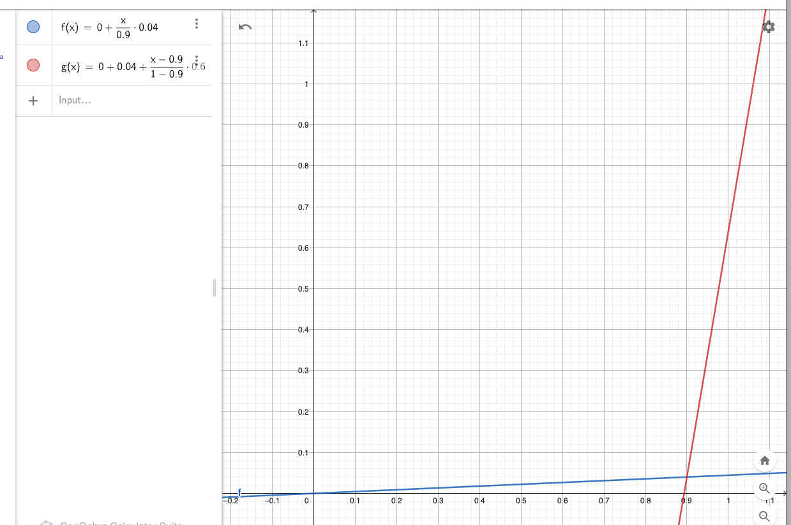
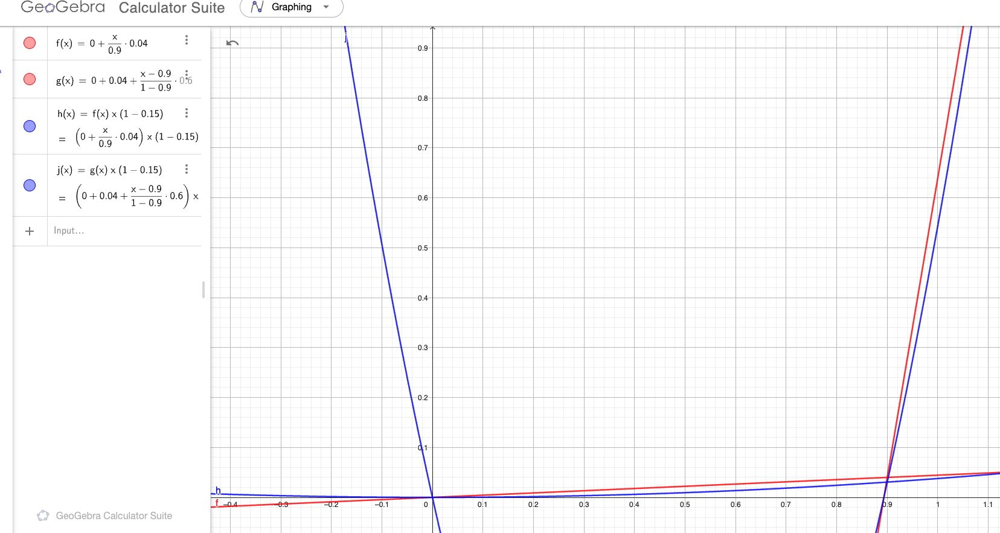
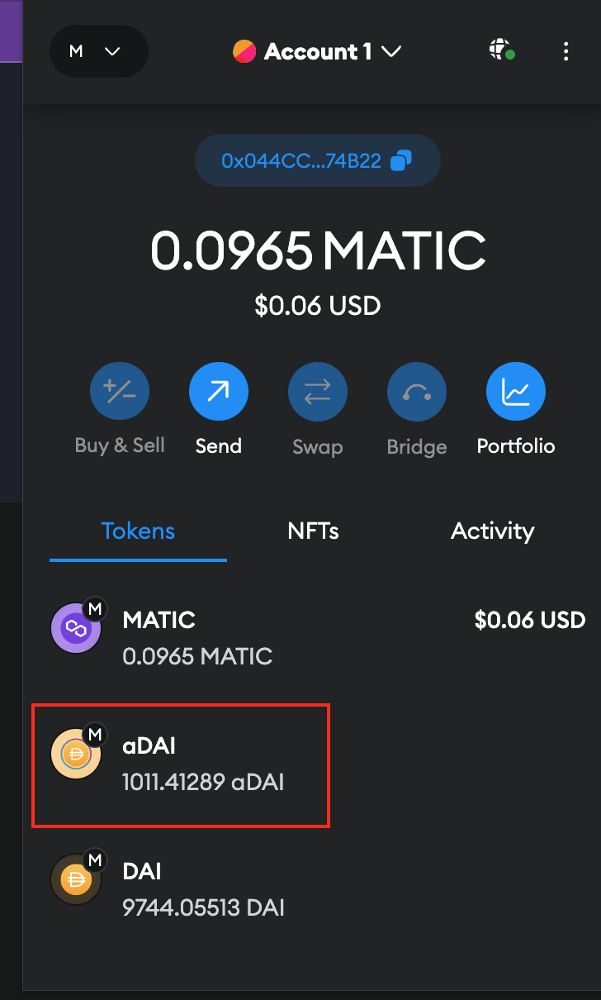
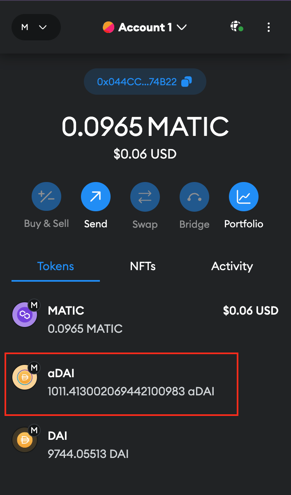

```toc
# This code block gets replaced with the TOC
```

Here's an extensive intro to DeFi lending protocols, especially for a dummy like me. We will look at fundamental concepts and theory, primarily complemented by zklend smart contract codebase at [the commit hash of 10dfb3d1f01b1177744b038f8417a5a9c3e94185](https://github.com/zkLend/zklend-v1-core/commit/10dfb3d1f01b1177744b038f8417a5a9c3e94185).

# How a lending protocol works

## Functionalities

There are 4 major functionalities that a lending protocol provides to the users:

### Deposit

Users can deposit tokens into the smart contract as much as they want. For example, I can deposit 1000 USDC into the smart contract.

This will accrue interest over time. The interest accrual can only happen when there is at least one borrower, because the borrower will need to pay for the depositor's interests. Otherwise, the interest rate stays at 0%. Deposit is the beginning of every other functionalities.

### Borrow

Users are able to borrow certain amount of token, but only based on the amount of collaterals by depositing. For example, you may supply 1.1 ETH to borrow 500 USDC, only if 1.1 ETH is sufficiently more than the value of 500 USDC in USD.

For example, 1.1 ETH is 1,813.79 USD today, and 500 USDC is approximately 500 USD. The collateralization factor, which denotes the value of borrowed amount that can be covered with an amount of collateralized token, is 80%. This means $1813.79 \times 0.8 = 1451.032$ USD worth of other assets can be borrowed from the protocol. This way, all of the borrowings in the protocol are backed by overly sufficient amount of tokens, which is called overcollateralization.

But why borrow in the first place, if you already have as much as (or even more than) the amount of token that you want to borrow?

Below are the possible reasons:

#### Leverage

Here's a table describing the variables for this example:

| name      | value |
|--------------------------|------|
| Price of 1 ETH in USD      | 1200 |
| Price of 1 USDC in USD      | 1 |
| Bob's initial ETH balance     | 2    |
| Collateral factor of ETH | 80%  |
| Gas fees, interests | 0  |

Bob thinks the value of ETH will dramatically increase over time, so just a simple x1 long position is not enough for him. He is so sure that he want to get more than x1 profit when the price of ETH increases. This is how he would position himself at a leveraged long position:

1. Bob deposits 2 ETH into the protocol
2. Bob borrows $1200 \times 2 \times 0.5 = 1200 < 1200 \times 2 \times 0.8 = 1920$ worth of USDC from the protocol. Now he can spend 1200 USDC for whatever he wants.
3. Bob goes to Uniswap, and swaps 1200 USDC for 1 ETH.
4. Now Bob owns 3 ETH, although he has a debt of 1200 USDC.
5. A few days later, the price of 1 ETH in USD increases to 1600 USD. Now his total profit off of this increase is $1600 \times 3 - 1200 \times 3 = 1200$:
   1. Bob now swaps his 1 ETH with 1600 USDC. Then he repays for his 1200 USDC debt. He still has 400 USDC left in his wallet.
   2. Then Bob withdraws 2 ETH from the protocol, and swaps that for $1600 \times 2 = 3200$ USDC at Uniswap.
   3. $3200 +  400 = 3600$ USDC is the total he now has.
   4. Bob started with 2 ETH that was equivalent to 2400 USD, but after the price increase, he made additional 400 USD in addition to 800 USD that is the increase in the USD value of 2 ETH.
6. Imagine if Bob held 3 ETH from the beginning. Then this would be valued at 4800 USD after the price increase, leaving Bob with 1200 USD of profit as well. Without the protocol, he wouldn't have been able to achieve the same profit.

#### Shorting

### Liquidate

The value of tokens supplied as collaterals fluctuates over time. For example, if you have deposited 1.1 ETH as a collateral, it might be 1809.47 USD today, but it could have been 1790 USD yesterday. In such a case, the total value of collaterals might not be able to cover the total amount of tokens borrowed by a user. 

Then other users get a chance to liquidate that user's position. In liquidation, a substantial amount of the user's debt can be repaid by the liquidator, and the borrower will take an additional percentage of the user's collateral as a liquidation bonus (or a penalty, from POV of the borrower). More on this later too.

### Repay

repay for the amount of token you borrowed, plus the accrued interest.

## Over-collateralization

Any lending protocol would want to assume over-colleteralization for maximum measure of security. Typically, the more volatile/unstable the price of an asset is, the lower collateral factor it would count for.

Usually, lending protocols would restrict which assets can be used as a collateral. However, it's also worth noting that there are some protocols that allow users to create their own pairs of asset to be borrowed and collateralized.

An example of overcollateralization can be seen in any lending protocols; For example, \$LINK has a 79% of collateral factor on Compound today. This means if you deposit \$100 worth of \$LINK, you will be ables to borrow \$79 worth of any assets without being liquidated.

## Utilization rate

We will need to define a few key terms to further understand other concepts.

**Utilization rate** denotes how much of a single asset deposited in the pool is being borrowed at a time.

> The **utilisation rate of each pool** is a function of the current outstanding loan amount over the total capital supply in the specific liquidity pool (from zklend whitepaper)

Here's an example:
- Bob deposits 100 USDT (worth 100 USD) in USDT pool
- Alice deposits 100 DAI (worth 100 USD) in DAI pool
- The collateral factor of DAI is 80%, so Alice borrows 80 USDT, which is the maximum of what she can safely borrow without getting liquidated
- Now, the utilization rate of USDT is $\frac{80}{100} = 80\%$ and that of DAI is $\frac{0}{100} = 0\%$

Utilization rate of an asset will change whenever there is a new borrowing or supply.

Here's [`calculate_utilization_rate`](https://github.com/zkLend/zklend-v1-core/blob/10dfb3d1f01b1177744b038f8417a5a9c3e94185/src/irms/default_interest_rate_model.cairo#L63-L71) from zklend contract:

```rust
fn calculate_utilization_rate(reserve_balance: felt252, total_debt: felt252) -> felt252 {
    if total_debt == 0 {
        0
    } else {
        let total_liquidity = safe_math::add(reserve_balance, total_debt);
        let utilization_rate = safe_decimal_math::div(total_debt, total_liquidity);
        utilization_rate
    }
}
```

The function's calculation is as follows: $\frac{\text{total debt}}{reserve + \text{total debt}}$. Here, $reserve$ denotes the cash available in the liquidity pool that is not being utilized.

## Interest rate

For the interest rate, we need to talk about the interest rate model first. An interest model is meant to encourage borrowing when there is enough capital, and discourage borrowing (encourage repayment) and additional supply when there is not enough capital. Logically, we arrive at the conclusion that the interest rate must be high when there is high utilization rate, and low when there is low utilization rate.

We would also want to set an optimal utilization rate, because we generally would not want the utilization rate to be too low (no one's using it) or too high (no one can borrow anymore). 

### Borrow interest rate

With all of these in mind, we can introduce this interest rate model **for borrowing**:

| Variable | Meaning | Domain (or Range) |
|---|---|---|
| $U$ | Utilization rate | $U \in [0, 1]$ |
| $U_{\text{optimal}}$ | Optimal utilization rate | $U_{\text{optimal}} \in [0, 1]$ |
| $R$ | Interest rate at utiliation rate $U$ | $R \in [0, \infty]$ |
| $R_{\text{slope1}}$ | Variable Rate Slope 1 (the slope that is going to be applied on the left side of the graph) | $R_{\text{slope1}} \in [0, \infty]$ |
| $R_{\text{slope2}}$ | Variable Rate Slope 2 (the slope that is going to be applied on the right side of the graph) | $R_{\text{slope2}} \in [0, \infty]$ |
| $R_0$ | Base interest rate. This adjusts the y-intercept of the interest rate curve. | $R_0 \in [0, 1]$ |

$$
U <= U_{optimal} \rArr R = R_0 + \frac{U}{U_{\text{optimal}}}(R_{\text{slope1}})
$$

$$
U > U_{optimal} \rArr R = R_0 + R_{\text{slope1}} + R_{\text{slope2}}\frac{U - U_{\text{optimal}}}{1 - U_{\text{optimal}}}
$$

It may just be easy to use a graph to find out what it means rather than looking at the equations.

[You can interact with the graphs I created here](https://www.geogebra.org/calculator/cpbssemc).

Below graph is the interest rate model for ['Rate Strategy Stable One' on Aave](https://docs.aave.com/risk/liquidity-risk/borrow-interest-rate#rate-strategy-stable-one). This refers to "Low liquidity stablecoins have lower Optimal Utilisation Ratio than those with higher liquidity". A rate strategy is just a list of variables used for the interest rate model. You would want to use different strategies for different crypto assets, owing to their stability/volatility. Every lending protocol has their own interest rate strategy for different assets; [Zklend has also has one](https://zklend.gitbook.io/documentation/using-zklend/technical/asset-parameters#for-interest-rate-model).



As you can see, until the utilization rate hits 90%, the interest rate stays quite low. But when it becomes slightly above 90%, the borrow interest rate would become 10%. This will (hopefully) act as an disincentive for people to borrow and incentive for the borrowers to repay the money, thereby decreasing the utilization rate, hopefully back to $U_{\text{Optimal}}$.

The calculation of borrow interest rate is handled by [calculate_borrow_rate](https://github.com/zkLend/zklend-v1-core/blob/10dfb3d1f01b1177744b038f8417a5a9c3e94185/src/irms/default_interest_rate_model.cairo#L73):

```rust
fn calculate_borrow_rate(self: @ContractState, utilization_rate: felt252) -> felt252 {
    let params = self.curve_params.read();

    let below_optimal_rate = Into::<_,
    u256>::into(utilization_rate) <= Into::<_, u256>::into(params.optimal_rate);

    if below_optimal_rate {
        let temp_1 = safe_decimal_math::div(utilization_rate, params.optimal_rate);
        let temp_2 = safe_decimal_math::mul(params.slope_0, temp_1);

        let borrow_rate = safe_math::add(params.y_intercept, temp_2);

        borrow_rate
    } else {
        // No need to use safe math here
        let excess_utilization_rate = utilization_rate - params.optimal_rate;
        let optimal_to_one = safe_decimal_math::SCALE - params.optimal_rate;

        let temp_1 = safe_decimal_math::div(excess_utilization_rate, optimal_to_one);
        let temp_2 = safe_decimal_math::mul(params.slope_1, temp_1);
        let temp_3 = safe_math::add(params.y_intercept, params.slope_0);

        let borrow_rate = safe_math::add(temp_2, temp_3);

        borrow_rate
    }
}
```

`curve_params` has a type of `CurveParams`:

```rust
struct CurveParams {
    slope_0: felt252,
    slope_1: felt252,
    y_intercept: felt252,
    optimal_rate: felt252
}
```

It does nothing but to define the variables we just saw in the equation of the borrow interest rate.

The function is pretty straightforward; `if below_optimal_rate` calculates the borrow interest rate when $U <= U_{optimal}$. `else` block calculates when $U > U_{optimal}$.

### Supply interest rate

The supply interest rate is the rate at which interest is generated when someone deposits a token into the liquidity pool. It must always be smaller than the borrow interest rate, because otherwise the protocol wouldn't have a way to fund the interests and take some part of the borrow interests into its reserve.

$$
\text{Supply Interest Rate} = \text{Borrow Interest Rate} \times U \times (1 − \text{Reserve Factor})
$$

$$
\text{Reserve Factor} \in [0, 1)
$$

$\text{Borrow Interest Rate}$ is what we already calculated from the previous section. $\text{Reserve Factor}$ is the percentage of the borrowing interest rate that the protocol takes as a profit.

Let's say we have a reserve factor of $0.15$. If we take all rates into the axis, we will get:



The blue curve is the supply interest rate, and the red borrow interest rate. And we only care about the range of functions for which $x \in [0, 1]$, where $x$ is the utilization rate.

As you noticed from the equation, the supply interest rate curve must always be a parabola, because we have $U$ being multipled by itself once ($\text{Borrow Interest Rate}$ has $U$ in it, and it's being multiplied by $U$ again).

### Compound interest calculation

#### Cumulated liquidity index

But calculating borrow and supply interest rates is not the end of the story. What we've looked at so far is calculation of simple interest rate, without regards to time.

If you have deposited a sum of a token, the interest should pile up on top of another as time goes on. Therefore we need a way to calculate compound interest.

If you have tried any DeFi lending protocol before, you would retrieve some token that represents a token deposited in the protocol that is 1:1 to the real underlying asset in return to your deposit. For example, you get [cToken on Compound](https://docs.compound.finance/v2/ctokens/), [aToken on Aave](https://docs.aave.com/developers/tokens/atoken), and [zToken on Zklend](https://zklend.gitbook.io/documentation/using-zklend/supply/ztokens). And if you check the balance of those tokens on metamask from time to time, you can notice that it changes over time, even if you don't do anything. This is because of interest accrual.

Below is an example of `aDai` on Aave that increases over time as compound interest accrues:




But how is it done under the hood? Let's read code on Zklend.

Below are [functions to calculate the balance of a ZToken](https://github.com/zkLend/zklend-v1-core/blob/10dfb3d1f01b1177744b038f8417a5a9c3e94185/src/z_token/view.cairo#L51-L62). 

```rust
fn balanceOf(self: @ContractState, account: ContractAddress) -> u256 {
    felt_balance_of(self, account).into()
}

fn felt_balance_of(self: @ContractState, account: ContractAddress) -> felt252 {
    let accumulator = internal::get_accumulator(self);

    let balance = self.raw_balances.read(account);
    let scaled_up_balance = safe_decimal_math::mul(balance, accumulator);

    scaled_up_balance
}
```

`felt_balance_of` reads from `ContractState` the raw balance of the token, but it times that with `accumulator`. So that's the secret. If the value of `accumulator` is somehow dynamic, every time your Metamask wallet calls `balanceOf` from the blockchain, the token balance should also be dynamic.

But what does `accumulator` do? First of all, [`get_accumulator`](https://github.com/zkLend/zklend-v1-core/blob/10dfb3d1f01b1177744b038f8417a5a9c3e94185/src/z_token/internal.cairo#L31-L35) will get the corresponding accumulator that is in the `Market` contract by calling `get_lending_accumulator`.

```rust
fn get_accumulator(self: @ContractState) -> felt252 {
    let market_addr = self.market.read();
    let underlying_addr = self.underlying.read();
    IMarketDispatcher { contract_address: market_addr }.get_lending_accumulator(underlying_addr)
}
```

This is [`get_lending_accumulator`](https://github.com/zkLend/zklend-v1-core/blob/10dfb3d1f01b1177744b038f8417a5a9c3e94185/src/market/view.cairo#L32-L67), where the compound interest is calculated:

```rust
fn get_lending_accumulator(self: @ContractState, token: ContractAddress) -> felt252 {
    internal::assert_reserve_enabled(self, token);
    let reserve = self.reserves.read_for_get_lending_accumulator(token);

    let block_timestamp: felt252 = get_block_timestamp().into();
    if reserve.last_update_timestamp == block_timestamp {
        // Accumulator already updated on the same block
        reserve.lending_accumulator
    } else {
        // Apply simple interest
        let time_diff = safe_math::sub(block_timestamp, reserve.last_update_timestamp);

        // Treats reserve factor as zero if treasury address is not set
        let treasury_addr = self.treasury.read();
        let effective_reserve_factor = if treasury_addr.is_zero() {
            0
        } else {
            reserve.reserve_factor
        };

        let one_minus_reserve_factor = safe_math::sub(
            safe_decimal_math::SCALE, effective_reserve_factor
        );

        // New accumulator
        // (current_lending_rate * (1 - reserve_factor) * time_diff / SECONDS_PER_YEAR + 1) * accumulator
        let temp_1 = safe_math::mul(reserve.current_lending_rate, time_diff);
        let temp_2 = safe_math::mul(temp_1, one_minus_reserve_factor);
        let temp_3 = safe_math::div(temp_2, SECONDS_PER_YEAR);
        let temp_4 = safe_math::div(temp_3, safe_decimal_math::SCALE);
        let temp_5 = safe_math::add(temp_4, safe_decimal_math::SCALE);
        let latest_accumulator = safe_decimal_math::mul(temp_5, reserve.lending_accumulator);

        latest_accumulator
    }
}
```

Below is the description of the variables being used from `self.reserves`:

| name | description |
|-|-|
| `last_update_timestamp` | the timestamp at which `lending_accumulator` was updated for the last time, in seconds since the epoch |
| `lending_accumulator` | cumulated liquidity index (or simply interest index). Tracks the interest cumulated by the reserve during the time interval, updated whenever a borrow, deposit, repay, redeem, swap, liquidation event occurs. |
| `current_lending_rate` | the current lending rate that was calculated by [`get_interest_rates` of `DefaultInterestRateModel`](https://github.com/zkLend/zklend-v1-core/blob/10dfb3d1f01b1177744b038f8417a5a9c3e94185/src/irms/default_interest_rate_model.cairo#L49-L61) |

The equation for calculating a cumulated liquidity/borrow index is as follows:

$$
Index_n = Index_{n-1} \times (1 + r \times t)
$$
where
$$
t = \text{Time Interval} \text{ (length of time since the last index calculation)}
$$
$$
r = \text{Interest Rate}
$$
$$
n = n^{th}\text{ index calculated}
$$
$$
Index_0 = 1
$$

we can see that $r$ is represented by `current_lending_rate * (1 - reserve_factor)`, and $t$ by `time_diff / SECONDS_PER_YEAR` (look at the comment in the code), and $Index_{n-1}$ by `reserve.lending_accumulator`.

This works exactly the same way for [`get_debt_accumulator`](https://github.com/zkLend/zklend-v1-core/blob/10dfb3d1f01b1177744b038f8417a5a9c3e94185/src/market/view.cairo#L69):

```rust
fn get_debt_accumulator(self: @ContractState, token: ContractAddress) -> felt252 {
    internal::assert_reserve_enabled(self, token);
    let reserve = self.reserves.read_for_get_debt_accumulator(token);

    let block_timestamp: felt252 = get_block_timestamp().into();
    if (reserve.last_update_timestamp == block_timestamp) {
        // Accumulator already updated on the same block
        reserve.debt_accumulator
    } else {
        // Apply simple interest
        let time_diff = safe_math::sub(block_timestamp, reserve.last_update_timestamp);

        // (current_borrowing_rate * time_diff / SECONDS_PER_YEAR + 1) * accumulator
        let temp_1 = safe_math::mul(reserve.current_borrowing_rate, time_diff);
        let temp_2 = safe_math::div(temp_1, SECONDS_PER_YEAR);
        let temp_3 = safe_math::add(temp_2, safe_decimal_math::SCALE);
        let latest_accumulator = safe_decimal_math::mul(temp_3, reserve.debt_accumulator);

        latest_accumulator
    }
}
```

It is the same logic as [`get_lending_accumulator`](https://github.com/zkLend/zklend-v1-core/blob/10dfb3d1f01b1177744b038f8417a5a9c3e94185/src/market/view.cairo#L32-L67), except that the reserve factor is not a part of the equation because we are taking profit from the debtors, not for lending. That means we want to take the full borrow index as it is from the debt, and instead lower the liquidity index for lending so that the protocol can take certain % as a profit.

#### Example: interest rate calculation

To find the final amount of borrowing or deposit with the accrued interests considered, all you need to do is to multiply the raw principal value with the cumulated liquidity/borrow index. But calculating the index requires calculating interest rates. So let's dive into one example. This example is based on [zklend's smart contract tests](https://github.com/zkLend/zklend-v1-core/blob/10dfb3d1f01b1177744b038f8417a5a9c3e94185/tests/market.cairo#L198).

Here's an example for calculating accrued interests for borrowing and deposit.

Let's say we got \$SIS and \$BRO tokens:

| Token | Oracle Price (USD) | Collateral factor | $R_{\text{slope1}}$ | $R_{\text{slope2}}$ | $R_0$ | $U_{\text{optimal}}$ | Reserve factor | 
|-|-|-|-|-|-|-|-|
| \$SIS | 100 | 50% | 0.1 | 0.5 | 1% | 60% | 10% |
| \$BRO | 50 | 75% | 0.2 | 0.3 | 5% | 80% | 20% |

Bob deposits $10000$ \$BRO, Alice deposits $100$ \$SIS.

Alice borrows 

\$22.5 \$BRO =

$$
\$22.5 \times 50 = \$1125 < 100 \times 100 \times 0.5 = \$5000
$$

which is well within the value of collateral supplied.

Now,
$$
U_{BRO} = \frac{22.5}{10,000} = 0.00225 \newline = 
0.225\% < U_{{BRO}{_{Optimal}}} = 80\% \newline
$$

$$
U_{BRO} <= U_{{BRO}{_{Optimal}}} \rArr \newline R_{{\text{BRO}}_\text{Borrow}} = R_{{\text{BRO}}_\text{0}} + \frac{U_{BRO}}{U_{{BRO}{_{Optimal}}}}(U_{{BRO}{_{slope1}}}) \newline = 0.05 + \frac{0.00225}{0.8} \times 0.2 = 0.0505625
$$

Now we calculate the supply interest rate, but without considering the reserve factor for now.

$$
R_{{BRO}{_{\text{Supply (no reserve)}}}} = R_{{\text{BRO}}_\text{Borrow}} \times U_{BRO} = 0.0505625 \times 0.00225 = 0.000113765625
$$

So there we have it:

$$
R_{{\text{BRO}}_\text{Borrow}} = 0.0505625 \newline
R_{{BRO}{_{\text{Supply (no reserve)}}}} = 0.000113765625
$$

#### Example (continued): cumulated liquidity index & cumulated borrow index calculation

And let's say:
- 100 seconds have elapsed, starting from timestamp 0
- no cumulated liquidity index and cumulated borrow index were calculated before, making them 1 respectively by default

Then you can calculate them as follows:

$$
\text{Cumulated Liquidity Index}_n = \newline 
\text{Cumulated Liquidity Index}_{n-1} \times (1 + r \times t) = \newline
1 \times (1 + (0.000113765625 \times (1 - 0.2)) \times \frac{100}{365 \times 86400}) = 1.000000000288598744292237442
\newline
$$
$$
\text{Cumulated Borrow Index}_n = \newline
\text{Cumulated Borrow Index}_{n-1} \times (1 + r \times t) = \newline
1 \times (1 + 0.0505625 \times \frac{100}{365 \times 86400}) = 1.000000160332635717909690512
$$

Instead of factoring the reserve factor into the lending rate, we instead do it when we calculate it in the cumulated liquidity index. 

$t$ is calculated as 100 seconds divided by the number of seconds per year (without caring about leap years).

Other than this, the calculation above should be straightforward.

#### Example (continued): compound interest calculation

Now we have calculated the interest indices, we can calculate the compoud interest for Alice's \$BRO borrowing of 22.5, and Bob's \$BRO deposit of 10000, at 100th seconds.

$$
\text{Final Amount}_{BRO, deposit, 100, Bob} = \newline
\text{Principal}_{BRO, deposit, Alice} \times \text{Cumulated Liquidity Index}_{\text{BRO, 100}} =\newline 
10000 \times 1.000000000288598744292237442 =\newline
10000.000002885987442922
$$

$$
\text{Final Amount}_{BRO, borrow, 100, Alice} =\newline 
\text{Principal}_{BRO, borrow, Alice} \times \text{Cumulated Borrow Index}_{\text{BRO, 100}} =\newline 
22.5 \times 1.000000160332635717909690512=\newline
22.500003607484303652
$$

Consequently, Bob will see $10000.000002885987442922$ \$zBRO on his Metamask instead of $10000$ \$zBRO. Alice on the other hand will have to repay $0.000003607484303652$ additional interest for her borrowing of \$BRO.

# Technical review

## Deposit

All typical user interactions will be done at [market.cairo](https://github.com/zkLend/zklend-v1-core/blob/10dfb3d1f01b1177744b038f8417a5a9c3e94185/src/market.cairo) file.

The [deposit](https://github.com/zkLend/zklend-v1-core/blob/10dfb3d1f01b1177744b038f8417a5a9c3e94185/src/market.cairo#L230-L232) function in [market.cairo](https://github.com/zkLend/zklend-v1-core/blob/10dfb3d1f01b1177744b038f8417a5a9c3e94185/src/market.cairo) will call `deposit` function from [market/external.cairo](https://github.com/zkLend/zklend-v1-core/blob/10dfb3d1f01b1177744b038f8417a5a9c3e94185/src/market/external.cairo#L41C1-L45C2):

```rust
// deposit in market.cairo

fn deposit(ref self: ContractState, token: ContractAddress, amount: felt252) {
   external::deposit(ref self, token, amount)
}
```

Again, [that](https://github.com/zkLend/zklend-v1-core/blob/10dfb3d1f01b1177744b038f8417a5a9c3e94185/src/market/external.cairo#L41C1-L45C2) will call `internal::deposit` from [`market/internal.cairo`](https://github.com/zkLend/zklend-v1-core/blob/10dfb3d1f01b1177744b038f8417a5a9c3e94185/src/market/internal.cairo#L67-L108).

```rust
// deposit in market/external.cairo
fn deposit(ref self: ContractState, token: ContractAddress, amount: felt252) {
    reentrancy_guard::start(ref self);
    internal::deposit(ref self, token, amount);
    reentrancy_guard::end(ref self);
}
```

```rust
// deposit in market/internal.cairo
fn deposit(ref self: ContractState, token: ContractAddress, amount: felt252) {
    assert(amount.is_non_zero(), errors::ZERO_AMOUNT);

    let caller = get_caller_address();
    let this_address = get_contract_address();

    let UpdatedAccumulators{debt_accumulator: updated_debt_accumulator, .. } = update_accumulators(
        ref self, token
    );

    assert_reserve_enabled(@self, token);
    let z_token_address = self.reserves.read_z_token_address(token);

    // Updates interest rate
    update_rates_and_raw_total_debt(
        ref self,
        token, // token
        updated_debt_accumulator, // updated_debt_accumulator
        false, // is_delta_reserve_balance_negative
        amount, // abs_delta_reserve_balance
        false, // is_delta_raw_total_debt_negative
        0 // abs_delta_raw_total_debt
    );

    self
        .emit(
            contract::Event::Deposit(
                contract::Deposit { user: caller, token: token, face_amount: amount }
            )
        );

    // Takes token from user

    let amount_u256: u256 = amount.into();
    let transfer_success = IERC20Dispatcher {
        contract_address: token, 
    }.transferFrom(caller, this_address, amount_u256);
    assert(transfer_success, errors::TRANSFERFROM_FAILED);

    // Mints ZToken to user
    IZTokenDispatcher { contract_address: z_token_address }.mint(caller, amount);
}
```

The first thing that this `deposit` function does is to call `update_accumulators`:

```rust
fn update_accumulators(ref self: ContractState, token: ContractAddress) -> UpdatedAccumulators {
    let block_timestamp: felt252 = get_block_timestamp().into();

    let updated_lending_accumulator = view::get_lending_accumulator(@self, token);
    let updated_debt_accumulator = view::get_debt_accumulator(@self, token);

    self
        .emit(
            contract::Event::AccumulatorsSync(
                contract::AccumulatorsSync {
                    token,
                    lending_accumulator: updated_lending_accumulator,
                    debt_accumulator: updated_debt_accumulator
                }
            )
        );

    // It's okay to call this function here as the updated accumulators haven't been written into
    // storage yet
    let amount_to_treasury = view::get_pending_treasury_amount(@self, token);

    // No need to check reserve existence since it's done in `get_lending_accumulator` and
    // `get_debt_accumulator`
    let z_token_address = self.reserves.read_z_token_address(token);

    self
        .reserves
        .write_accumulators(
            token, block_timestamp, updated_lending_accumulator, updated_debt_accumulator
        );

    // No need to check whether treasury address is zero as amount would be zero anyways
    if amount_to_treasury.is_non_zero() {
        let treasury_addr = self.treasury.read();
        IZTokenDispatcher {
            contract_address: z_token_address
        }.mint(treasury_addr, amount_to_treasury);
    }

    UpdatedAccumulators {
        lending_accumulator: updated_lending_accumulator, debt_accumulator: updated_debt_accumulator
    }
}
```

And this respectively calls accumulators for debt and lending:

```rust
fn get_lending_accumulator(self: @ContractState, token: ContractAddress) -> felt252 {
    internal::assert_reserve_enabled(self, token);
    let reserve = self.reserves.read_for_get_lending_accumulator(token);

    let block_timestamp: felt252 = get_block_timestamp().into();
    if reserve.last_update_timestamp == block_timestamp {
        // Accumulator already updated on the same block
        reserve.lending_accumulator
    } else {
        // Apply simple interest
        let time_diff = safe_math::sub(block_timestamp, reserve.last_update_timestamp);

        // Treats reserve factor as zero if treasury address is not set
        let treasury_addr = self.treasury.read();
        let effective_reserve_factor = if treasury_addr.is_zero() {
            0
        } else {
            reserve.reserve_factor
        };

        let one_minus_reserve_factor = safe_math::sub(
            safe_decimal_math::SCALE, effective_reserve_factor
        );

        // New accumulator
        // (current_lending_rate * (1 - reserve_factor) * time_diff / SECONDS_PER_YEAR + 1) * accumulator
        let temp_1 = safe_math::mul(reserve.current_lending_rate, time_diff);
        let temp_2 = safe_math::mul(temp_1, one_minus_reserve_factor);
        let temp_3 = safe_math::div(temp_2, SECONDS_PER_YEAR);
        let temp_4 = safe_math::div(temp_3, safe_decimal_math::SCALE);
        let temp_5 = safe_math::add(temp_4, safe_decimal_math::SCALE);
        let latest_accumulator = safe_decimal_math::mul(temp_5, reserve.lending_accumulator);

        latest_accumulator
    }
}

fn get_debt_accumulator(self: @ContractState, token: ContractAddress) -> felt252 {
    internal::assert_reserve_enabled(self, token);
    let reserve = self.reserves.read_for_get_debt_accumulator(token);

    let block_timestamp: felt252 = get_block_timestamp().into();
    if (reserve.last_update_timestamp == block_timestamp) {
        // Accumulator already updated on the same block
        reserve.debt_accumulator
    } else {
        // Apply simple interest
        let time_diff = safe_math::sub(block_timestamp, reserve.last_update_timestamp);

        // (current_borrowing_rate * time_diff / SECONDS_PER_YEAR + 1) * accumulator
        let temp_1 = safe_math::mul(reserve.current_borrowing_rate, time_diff);
        let temp_2 = safe_math::div(temp_1, SECONDS_PER_YEAR);
        let temp_3 = safe_math::add(temp_2, safe_decimal_math::SCALE);
        let latest_accumulator = safe_decimal_math::mul(temp_3, reserve.debt_accumulator);

        latest_accumulator
    }
}
```

Let's talk about what an accumulator does first. Accumulator is a way to compound the interest since the last block timestamp.

## Precision