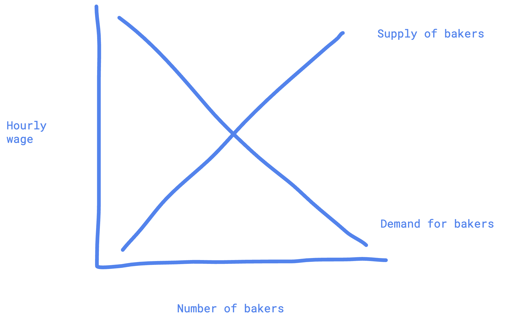
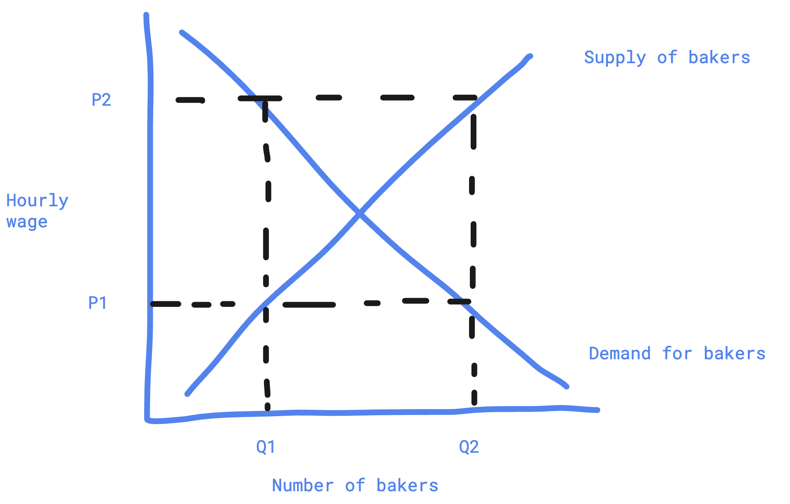

몇년동안 적어야지 적어야지 말만 해대다가 드디어 이 주제에 대해서 글을 적어보도록 하겠다. 바라건대 시리즈로 풀어나갈 이 주제는 비단 한국이 왜 망할 수밖에 없는지에 대한 내용은 아니다. 이것은 내가 왜 한국을 싫어하는지에 대한 이유다. 이것은 또한 그 많고 많은 재외한국인이 죽어도 한국에서 일을 하기 싫어하는 이유다. 이것은 내가 한국에서 새로이 자라나는 어린 친구들이 불쌍하다고 생각하는 이유다. 이 글을 읽는 당신도 당신만의 어떤 이유를 찾을 수 있기를 바란다.

원래는 책을 쓰거나 유튜브 동영상을 업로드 해야겠다고 생각했으나 그게 오히려 시간이 너무 오래 걸릴 것 같아서 그냥 일단 블로그에 글을 쓰는 걸로 시작부터 하려고 한다. 생각만 하다가 결국엔 미루고 미루고 시작하지 못했다. 하여튼. 고사하고. 시작하자.

오늘은 **사라진 능력주의**를 살펴보자.

## 능력주의

누구나 알다시피 아담 스미스는 보이지 않는 손이라는 개념을 제시했다. 개념은 간단하다. 사람들을 내버려 둔다면 개인의 이기적인 행동들이 서로를 위한 이익의 추구로 연결된다는 것이다. 배고픈 사람들은 빵을 사먹기 위해 회사에 가서 일을 할 것이며, 월세를 지불하고 싶은 사람은 빵을 만들어 팔 것이다. 세입자가 주는 월세로 돈을 벌고 싶은 사람은 집 한 채를 구매하기 위해 큰 사업을 벌릴 것이다.

능력주의는 이와 밀접한 연관이 있다. 능력이 좋다면 주어진 시간 안에 돈을 더 많이 벌을 수 있어야 한다. 경쟁하고 있는 빵집보다 비교적 싸고 맛있는 빵을 만들 수 있는 능력만 된다면 빵집 주인은 비교적 더 많은 수익을 얻을 수 있을 것이다. 당연한 결말이다. 고객이 더 싸고 맛있는 빵을 원하기 때문이다. 이것은 빵집 주인이 더 열심히 노동하도록 만들어 주는 긍정적 피드백으로 작용한다. 반면, 비교적 비싸고 맛 없는 빵을 만드는 빵집 주인은 고객을 빼앗긴 나머지 빵집을 유지하지 못할 수준의 수입을 올릴 것이며, 결국엔 빵집이 아닌 수익을 얻을 다른 방법을 찾아야 할 것이다. 결국 돈이 사람을 움직이는 원동력인 것이다.

일터에서도 능력주의는 예외가 아니다. 당신이 일을 열심히 하는 이유는 무엇인가? 아니, 당신이 일을 열심히 하게 만드는 이유는 무엇인가? 바로 돈이다.

## 돈

혹자는 질문할 수도 있다. 그게 돈이라고 어떻게 확신하지? 단순히 열정이나 꿈일 수 있지 않을까? [랜덤한 블로그에서 가져온 평균 소득이 가장 낮은 직업 50개](https://howtodothingsbetter.tistory.com/53)를 예를 들어 설명을 해 보자. "자연 및 문화해설사"가 연봉 783만원으로 가장 최저 평균 소득을 얻는다. 그런데 만약 '나는 문화를 다른 이들에게 알려주는 일이 가치있고 보람차다고 생각해 이것에 열정을 쏟고 싶다'라고 말하는 사람이 있다면 나의 주장이 잘못될 수도 있지 않을까?

글쎄다. 일단 현실적으로 평균적인 사회 생활을 하고 평균적인 여가와 오락을 즐기며 평균적인 식성 등을 가진 다 큰 독립한 성인이 783만원으로 일 년 생활이 가능할지 의문이다. $\frac{783}{12}=65.25$만원인데, 65.25만원으로, 미래를 위해 저축하고 사회생활 (결혼식 축의금 등)도 잘 하고, 외식도 가끔 하고, 여행도 다니면서 살 수 있을까? 거의 불가능이다. 당신이 783만원 혹은 이하를 한국에서 벌면서 과연 행복할 수 있을까? 나는 아니라고 본다.

내가 말하고 싶은 건, 돈에 관심이 없다는 사실 자체는 전혀 문제가 되지 않지만, 그것에 상응하는 결과가 따르기 마련이라는 것이다. 결국 평균 혹은 그 이상의 행복을 원한다면 평균 혹은 그 이상의 돈을 벌고 그것에 관심을 가져야 한다는 말에는 흠이 없을 것이다. 

돈은 열정과 다르다. 돈은 꿈과 다르다. 돈은 무슨 뜬구름 잡는 소리가 아니다. 전 세계 어느 나라에 가도 돈은 사용된다. 모두가 이해하고 모두가 사용하고 모두가 가치를 인정해준다. 돈의 보편성은 누구라도 알아준다. 당신이 게임에 대한 열정이 있는데 그것으로 소고기를 먹고 싶다면 열정으로 소고기를 사는 대신 그 열정으로 프로게이머가 돼서 돈을 벌고 그 돈으로 소고기를 살 것이다. 당신이 시간이 있는데 그 시간으로 소고기를 사고 싶다면 카페에서 알바를 해서 돈을 받고 그 돈으로 소고기를 살 것이다. 이런 의미에서 돈은 보편적인 사회적 합의이고 유용하다.

## 노동의 자유시장경제

그렇기 때문에 당신이 회사에서 일을 하면 시간으로 월급을 받지 않는다. 소고기로 월급을 받지 않는다. 귀여운 토끼 인형으로 월급을 받지 않는다. 왜? 돈이라는 사회적 합의로 모든 것을 사고 팔기로 동의했기 때문이다.

그렇다면 여기까지 왜 노동을 해서 돈을 벌을 수밖에 없는지에 대해 설명해봤다. 그런데 문제가 생긴다.

빵집에서 일을 하고 돈을 받으려고 하는데, 동일하게 주어진 시간 내에 나보다 빵을 더 맛있고 완성도 있게 만드는 사람이 천 명이 더 있다. 내가 만든 빵을 먹으면 바로 토만 나오는데 그들이 만드는 빵은 입에서 살살 녹아 잘 팔리기까지 한다.

당신이 빵집 사장이라면 나를 고용하겠는가, 그 천 명중 한 명을 고용하겠는가? 당연히 나를 버려야 맞다. 나는 안중에도 없어야 한다.

이게 바로 고등/대학교에서 배웠을 기본 중에 기본인 자유시장경제의 원리다.

그래도 간단하게 살펴보자. $x$축은 제빵사가 시간당 생산해낼 수 있는 빵의 수준과 수량이다. $y$축은 제빵사가 받을 수 있는 시급이다. $y=x$ 모양인 그래프는 제빵사의 공급을 나타낸다. $y=-x+a$ 모양인 그래프는 제빵사에 대한 수요다.

좀 더 쉽게 설명해보자. 공급 먼저. $P1 = 5000$원의 시급을 준다고 했을 때 100명이 제빵사를 하고 싶은 마음이 있다고 가정하자. 그게 $Q1$ 정도의 위치가 될 것이다. 그런데 만약 빵을 굽는 일이 모종의 이유로 매우 중요해져서 $P2 = 100,000$원의 시급을 준다고 해 보자. 그러면 제빵사 하기 싫은 사람도 하고 싶은 마음이 샘솟을 것이다. 그래서 하고 싶은 사람이 10만명으로 늘어난다. 그게 $Q2$의 위치라고 가정하자. 

이것도 복잡하다면 뉴스로 쉽게 이해하자. ['평균 연봉 1억' 기아 킹산직 300명 뽑는다...10만명 지원 대란?](https://biz.sbs.co.kr/article/20000145051) 그냥 돈 많이 주면 그 일을 하고 싶은 사람이 많이 생기기 마련이다. 평균 연봉이 2천이었으면 10만명이나 지원하고 싶겠는가.

다음, 수요. 시급이 5000원이라면 싸다고 생각해서 더 많은 제빵사를 채용해서 ($Q2$) 사업을 확장하고 잘 굴러가게 하고 싶을 것이다. 그런데 시급이 만약에 10만원이라면 아마 한 명 ($Q1$)만 채용하고 말 것이다. 기아차도 마찬가지. 평균 연봉이 1억이니까 300명만 뽑았지, 5만명을 뽑겠는가.

그래서 왜 자유시장경제냐고? 아무도 방해하거나 참견하지 않으니까 자유하다. 시급이 너무 비싸서 한 명만 채용하는 사장님에게 너무 적게 채용하니까 더 채용해달라는 사회의 압박감이나 정부의 요청은 터무니없다. 이미 채용된 제빵사가 일은 못하지만 근속을 오래했다는 이유만으로 본래 시장에서 받아야 할 시급의 두 배를 받는 것은 (예를 들자면 $P1$을 받아야 하는 사람이 $P2$를 받고 있다면) 시스템의 특정 부분이 잘못되어 자유시장이 제 역할을 하지 않는다는 증거다.

앞서 말했듯이 모든 제빵사의 실력이 동일할리가 없다. 제빵사 노동시장이 상식적이고 자유롭다면 제빵사의 실력은 Y축인 시급과 비례해야만 한다. 시급이 $P2$만큼 늘어난다면 물론 $Q2$만큼의 제빵사가 되고 싶어하는 사람이 있겠지만, $Q2$중 제빵 초보도 있을 것이고 고수도 있을 것이고 유명 베이커리에서 이미 20년동안 일한 장인이 있을 수도 있을 것이다. 그러면 아마 그 중 잘 하는 사람이 $P2$를 차지하고, 못 하는 사람은 $P2$보다 적은 시급을 주는 포지션으로 밀려나게 될 것이다. 공정하고 행복하다. 못 하면 덜 벌고, 잘 하면 더 번다.

## 파괴된 능력주의

> 못 하면 덜 벌고, 잘 하면 더 번다.

아쉽게도 이 말은 한국에서 대부분의 경우 사실이었던 적이 없다.

**호봉제.** 호봉제는 능력주의와 가장 반대되는 개념이다. 나라를 운영하는 공무원, 군인, 교사 등의 직업뿐만 아니라 많은 기업들에게 적용된다. [“국내 300인 이상 기업 60%가 호봉제”](https://www.donga.com/news/Economy/article/all/20230301/118129216/1). 한마디로 요약하자면 _**해고를 당하지 않는 이상, 근속을 더 오래 할수록 아무 노력을 하지 않아도 받는 돈이 늘어난다.**_ 일을 해 본 누구나라면 쉽게 대답할 수 있다. 회사에 오래 다녔다고 해서 일을 잘 하는 것이 절대 아니다. '철밥통'이라는 말이 그냥 나오는 게 아니다. 여러 큰 회사에서 주는 월급부터 이렇게 잘못되었다면 어디서부터 다시 시작해야만 할까. 나라를 운영하는 일이 나라에서 가장 중요한데 공무원 월급부터 이렇다면 어디서부터 잘못된걸까.

그래. 다른 나라는 어떻냐고? 일단 한 가지 명심할 점은, 이 글은 한국을 비판하는 글이지, 다른 나라가 특출나게 잘났다는 글은 아니다.

**나이와 경력.** 이건 내 개인적으로 느끼는 사항인데 한국 뿐 아니라 거의 어디든지 경력과 나이가 적으면 능력이 좋아도 돈을 많이 받기가 힘들다. 

그래서 뭐가 문제냐고? 인재들이 일을 할 동기가 사라진다. 그 동기가 없어지면 나라의 성장이 저하되고 혁신이 없어진다. 돈으로 보상받아야 하는 이유는 이미 충분히 앞서 설명했다. 돈은 일할 동기를 부여한다. 당신의 직업 윤리와 열정 등도 물론 중요하겠지만, 돈에 비해서는 하찮은 동기부여일 뿐이다. 당신의 직업 윤리와 열정은 의식주를 마련해주지 않는다.

개인적으로, 나는 이것이 정치와 이념의 문제가 아니라고 생각한다. 보통 우파가 능력주의를 지지한다는 말에는 모두가 동의할 것이다.  그런데 정치를 떠나서, 사람들의 관심사와 장단점이 각양각생인데 어떻게 이들을 능력이 아닌 다른 수단으로 평가할 수 있는가? 1시간 내에 내 친구는 빵을 한 조각만 굽고 나는 동일한 품질의 빵을 열 조각을 구울 수 있다면 내가 당연히 더 높은 보수를 받아야 하는 게 아닌가?

## 변화

