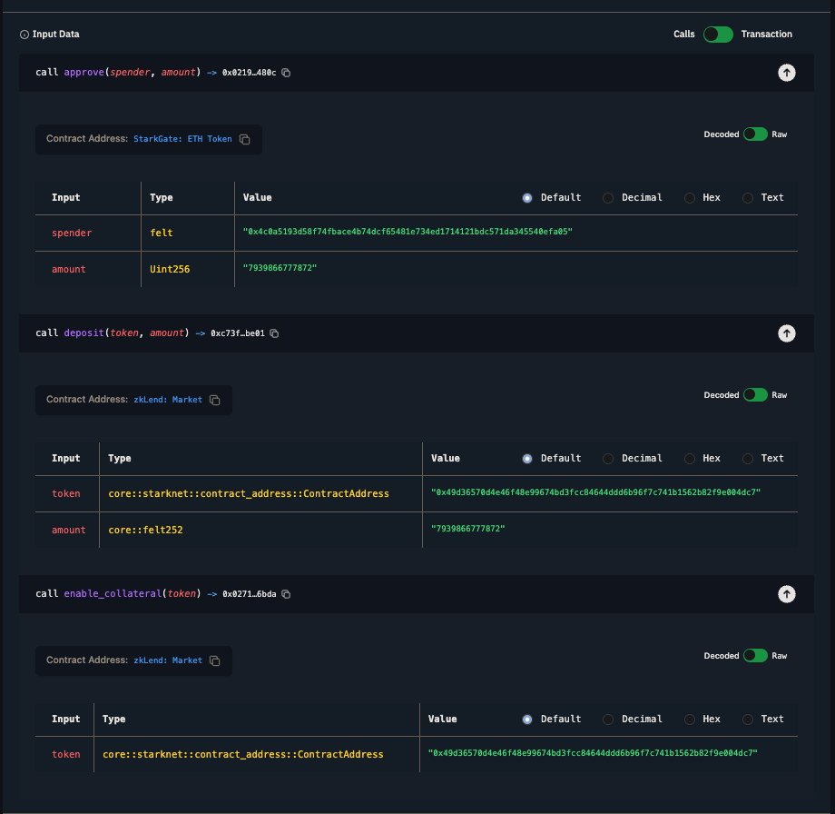
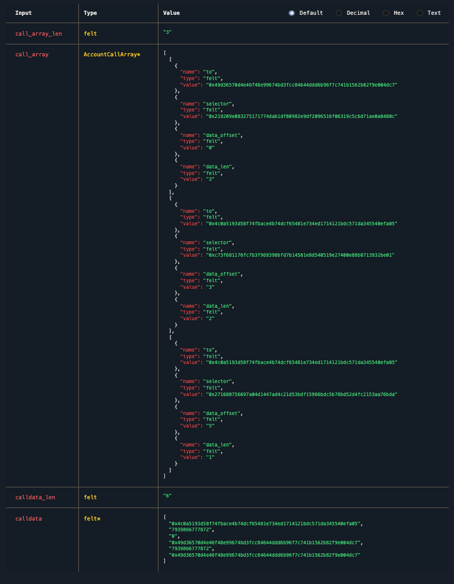
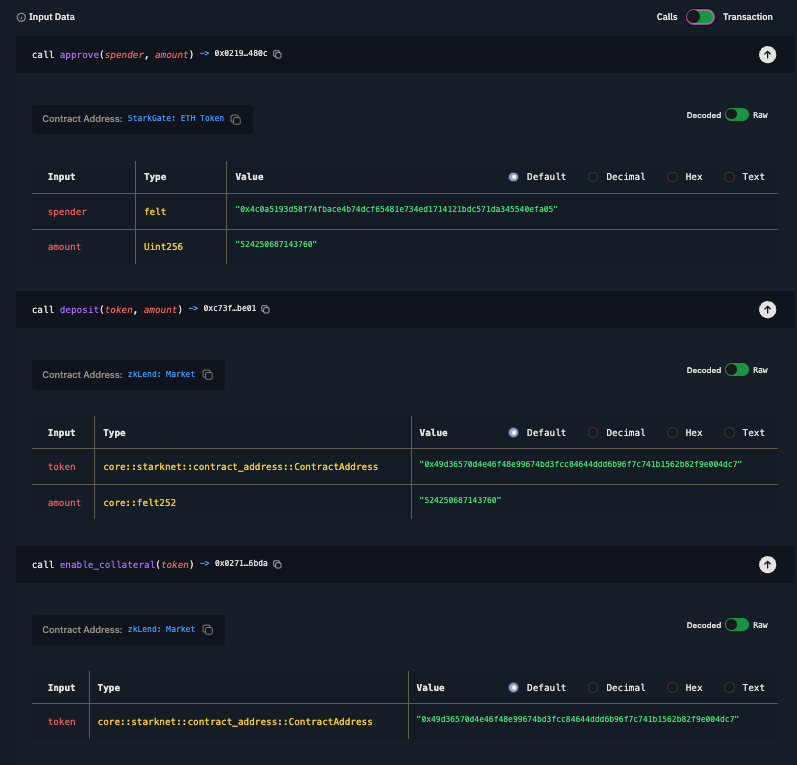
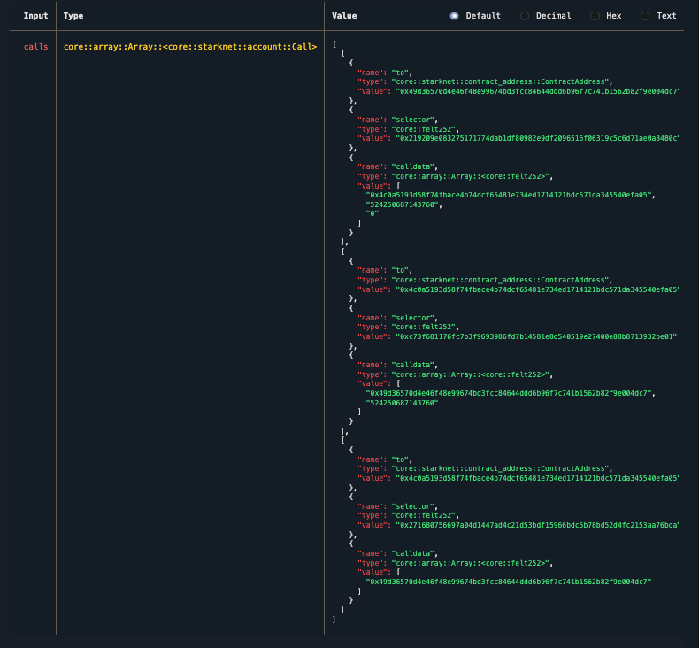

This is a brief summary of the anatomy of Starknet's calldata and how to decode it. The Internet needs more information about how Starknet works.

Basically, Starknet has two versions of execution encoding: legacy and new. You can check [starknet-rs](https://github.com/xJonathanLEI/starknet-rs/blob/49719f49a18f9621fc37342959e84900b600083e/starknet-accounts/src/single_owner.rs#L33-L41):

```rs
/// How calldata for the `__execute__` entrypoint is encoded.
#[derive(Debug, Copy, Clone, PartialEq, Eq)]
pub enum ExecutionEncoding {
    /// Encode `__execute__` calldata in Cairo 0 style, where calldata from all calls are concated
    /// and appended at the end.
    Legacy,
    /// Encode `__execute__` calldata in Cairo (1) style, where each call is self-contained.
    New,
}
```

But unfortunately starknet-rs only supports encoding calldata. This means one needs to work backwards and write a code to decode calldata, which is not super difficult but still needs to be done.

So without any further due, if you just want to use the code (Rust), go to https://github.com/9oelM/decode-starknet-calldata/ and use it right away.

If you wanna learn about the structure of calldata, keep reading.

## Legacy format

Let's take an example of [Transaction of hash 0x06b8627ba886d457d32cc5a2ef0cc99741fc67b1142ce3f180a29b817b6f5f33](https://starkscan.co/tx/0x06b8627ba886d457d32cc5a2ef0cc99741fc67b1142ce3f180a29b817b6f5f33#overview), which is a transaction that has 3 calls: namely `approve`, `deposit` and `enable_collateral`.



The legacy format follows this signature: `__execute__(call_array_len, call_array, calldata_len, calldata)`. The order of the calldata follows the order of arguments of `__execute__`.

So the raw data is:

```
0	0x3
1	0x49d36570d4e46f48e99674bd3fcc84644ddd6b96f7c741b1562b82f9e004dc7
2	0x219209e083275171774dab1df80982e9df2096516f06319c5c6d71ae0a8480c
3	0x0
4	0x3
5	0x4c0a5193d58f74fbace4b74dcf65481e734ed1714121bdc571da345540efa05
6	0xc73f681176fc7b3f9693986fd7b14581e8d540519e27400e88b8713932be01
7	0x3
8	0x2
9	0x4c0a5193d58f74fbace4b74dcf65481e734ed1714121bdc571da345540efa05
10	0x271680756697a04d1447ad4c21d53bdf15966bdc5b78bd52d4fc2153aa76bda
11	0x5
12	0x1
13	0x6
14	0x4c0a5193d58f74fbace4b74dcf65481e734ed1714121bdc571da345540efa05
15	0x738a4f05910
16	0x0
17	0x49d36570d4e46f48e99674bd3fcc84644ddd6b96f7c741b1562b82f9e004dc7
18	0x738a4f05910
19	0x49d36570d4e46f48e99674bd3fcc84644ddd6b96f7c741b1562b82f9e004dc7
```

and this is what you get from it:



Observe that the real calldata is always appended at the last part.


## New format

The new format is relatively easier than the legacy format. Each call is just self-contained, and are stored in an array of calls.

Let's take an example of the same calls (`approve`, `deposit`, and `enable_collateral`) at a different transaction of hash [0x06a031ca9916acc3a3723f2f15c2a0c32e756c887b33271d914b1309f57be0f0](https://starkscan.co/tx/0x06a031ca9916acc3a3723f2f15c2a0c32e756c887b33271d914b1309f57be0f0):



This is what you get as raw data:

```
0	0x3
1	0x49d36570d4e46f48e99674bd3fcc84644ddd6b96f7c741b1562b82f9e004dc7
2	0x219209e083275171774dab1df80982e9df2096516f06319c5c6d71ae0a8480c
3	0x3
4	0x4c0a5193d58f74fbace4b74dcf65481e734ed1714121bdc571da345540efa05
5	0x1dccd9ffaff50
6	0x0
7	0x4c0a5193d58f74fbace4b74dcf65481e734ed1714121bdc571da345540efa05
8	0xc73f681176fc7b3f9693986fd7b14581e8d540519e27400e88b8713932be01
9	0x2
10	0x49d36570d4e46f48e99674bd3fcc84644ddd6b96f7c741b1562b82f9e004dc7
11	0x1dccd9ffaff50
12	0x4c0a5193d58f74fbace4b74dcf65481e734ed1714121bdc571da345540efa05
13	0x271680756697a04d1447ad4c21d53bdf15966bdc5b78bd52d4fc2153aa76bda
14	0x1
15	0x49d36570d4e46f48e99674bd3fcc84644ddd6b96f7c741b1562b82f9e004dc7
```

And these are the corresopnding calls:



The raw data is in the same order as the `value`s in the array in the picture above. The only difference is that there are numbers in between to indicate the length of the forthcoming call. 

For example, `0x3` is the field element in the data. The first field element in the raw data must always be the length of all calls, which is `0x3` = 3.

Then `0x49d36570d4e46f48e99674bd3fcc84644ddd6b96f7c741b1562b82f9e004dc7` and `0x219209e083275171774dab1df80982e9df2096516f06319c5c6d71ae0a8480c` are just `to` and `selector` of the first call. Then we have a calldata of the first call. But before that, we have `0x3`, which again indicates that the forthcoming `calldata` is an array of length 3.

Inside the calldata of the first array are:

```
4	0x4c0a5193d58f74fbace4b74dcf65481e734ed1714121bdc571da345540efa05
5	0x1dccd9ffaff50
6	0x0
```

Then, we jump to `to` of the second call, and the rest works the same.

That's it! Thanks.