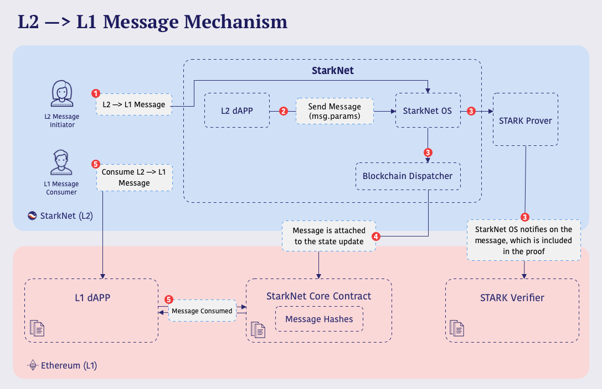
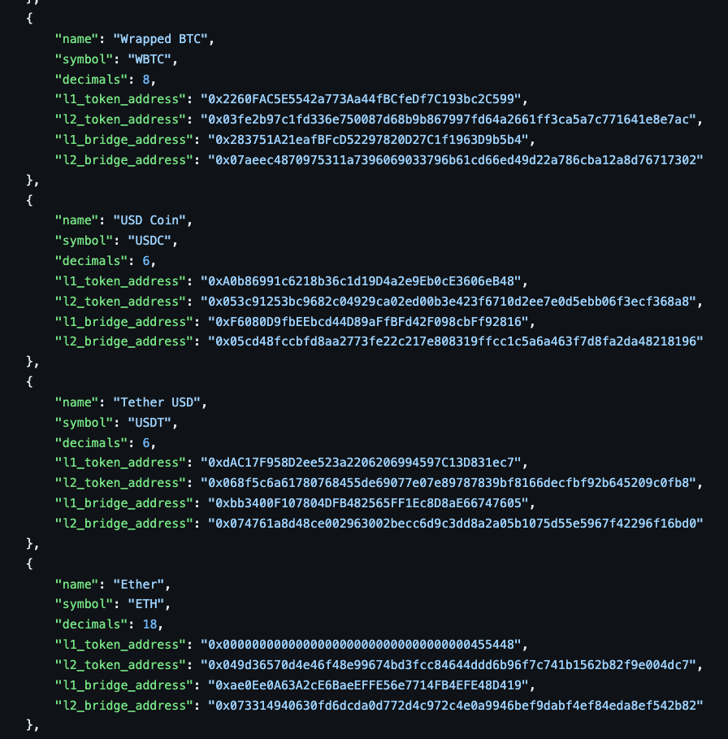
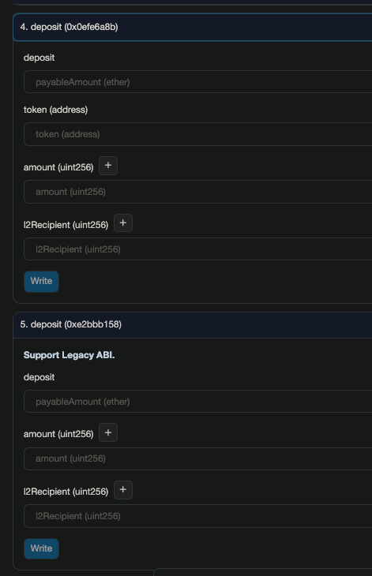
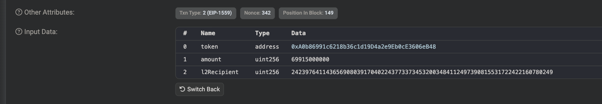
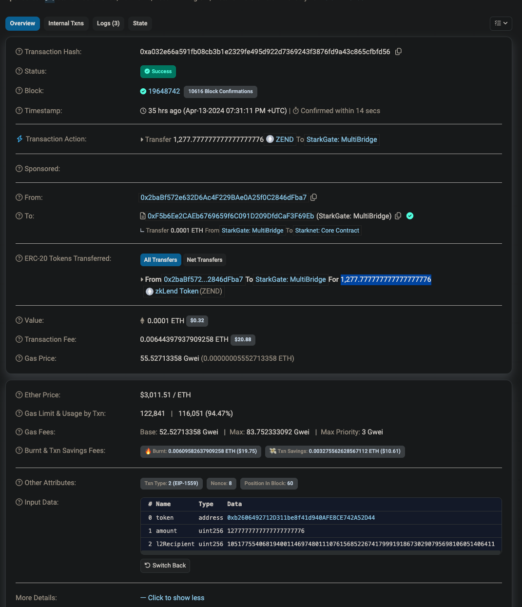
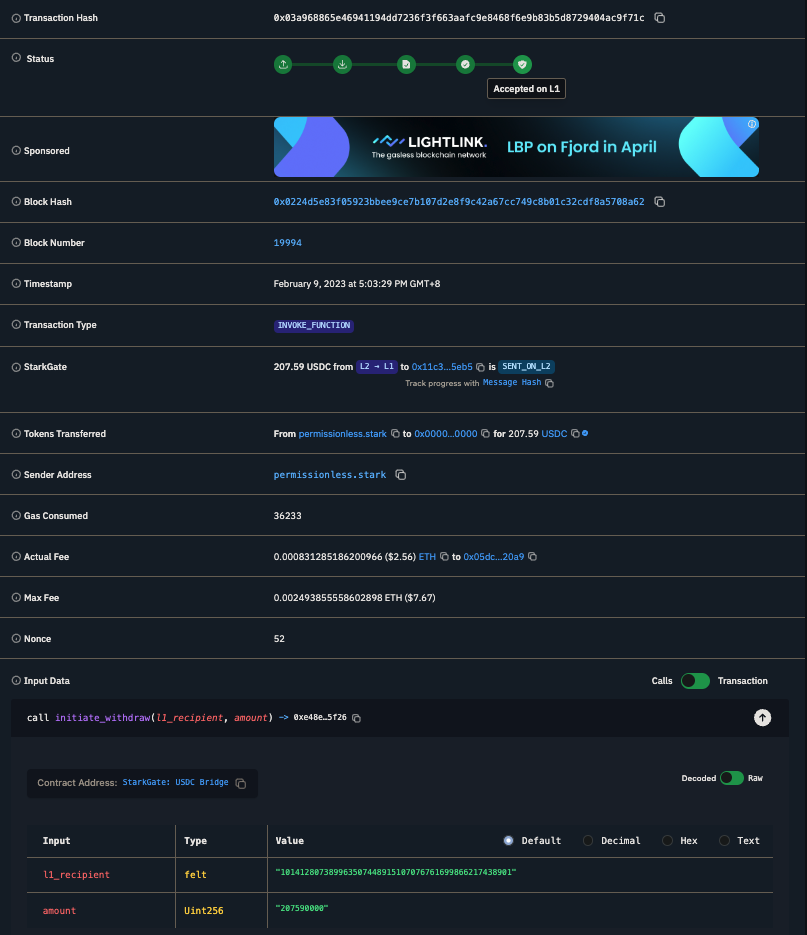
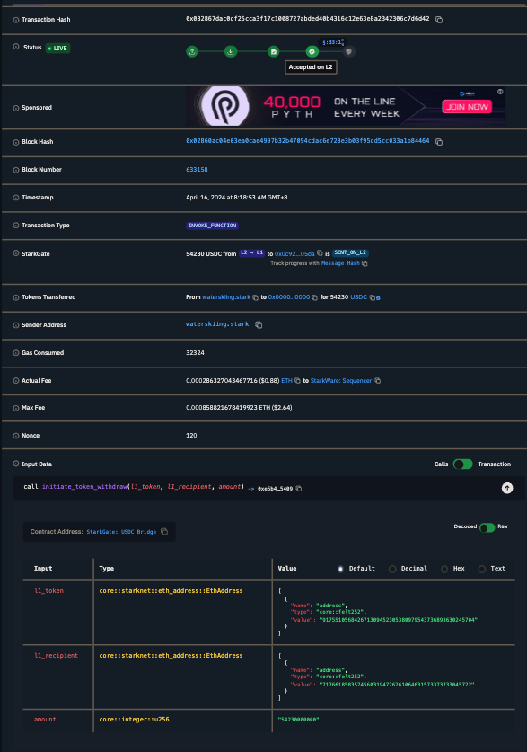
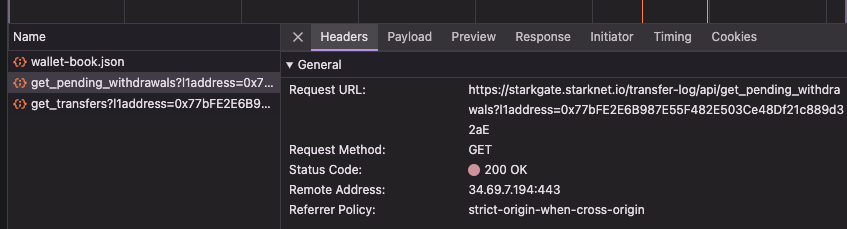

_This article was originally posted at [Lazer 1 Research](https://research.lazer1.xyz/blog/making-sense-of-starknet-architecture-and-l1-l2-messaging/), which is another blog that I maintain specifically for blockchain._

With the introduction of the STRK provisions program, Starknet has garnered significant public attention, sparking a growing curiosity regarding its technical intricacies. Particularly, there exists a notable gap in understanding the architecture of Starknet and the mechanics of L1-L2 messaging. Thus, the purpose of this writing is to provide a comprehensive elucidation of these two topics.

# Starknet architecture

Let us start by defining the architecture of Starknet. Starknet consists of several components:
- Mempool (Gateway)
- Sequencer
- Prover
- Full node
- Starknet core contract
- Verifier
- Starknet bridge contract

## Mempool (Gateway)

A mempool (memory pool) is a temporary storage for pending transactions that are not included in a block yet. When you submit a transaction, it doesn't go straight into the network and make changes. It will have to wait in the mempool.

The mempool performs a preliminary validation on the transaction, like checking the length of calldata.

<!-- Write more about mempool -->

## Sequencer

Sequencer retrieves transactions from mempool and puts them in a specific sequential order, and produces blocks containing them.

In essence, a sequencer has two core tasks[^1]: 
1. sequencing (ordering): it orders transactions, determining the canonical sequence of blocks for a given chain fork. It then appends new blocks to this sequence.
2. executing (validation): it executes these transactions, updating the system’s state based on a given function. The block produced by the sequencer is submitted to Ethereum as a single compact proof (aka "rollup").

Starknet has some open-source sequencers:
- [Mandara](https://github.com/keep-starknet-strange/madara/)
- [Blockifier](https://github.com/starkware-libs/blockifier)
- [Kraken](https://github.com/lambdaclass/starknet_stack/tree/main/sequencer) (seemingly discontinued by Lambdaclass)

A sequencer is needed in L2 blockchains for scalability and performance wins. By processing transactions off-chain in batches, it is able to achieve much faster speed. 

Blockchains may have a centralized sequencer, like Starknet. The centralized sequencer can function as perfectly as a decentralized one. But the primary drive for the decentralization comes from mitigating the risk of censorship, because transactions can be reordered, included, or excluded by a centralized party without no one noticing it. In light of this, [Starknet is actively moving towards decentralization, as described by their blog post in Oct 2023](https://starkware.co/resource/starknet-decentralization-a-roadmap-in-broad-strokes/), although the sequencer is likely to be one of the last components in the stack to be decentralized.

## Full node

Starknet has a few full node implementations:
- [Pathfinder](https://github.com/eqlabs/pathfinder)
- [Juno](https://github.com/NethermindEth/juno)
- [Papyrus](https://github.com/starkware-libs/papyrus)

The full node is responsible for handling all [API requests specified per spec](https://github.com/starkware-libs/starknet-specs/blob/master/api/starknet_api_openrpc.json).

## Prover

The prover generates proofs for the transactions in the blocks produced by the sequencer. [cairo-vm](https://github.com/lambdaclass/cairo-vm) is used as a prover. Another implementation is [cairo-vm-go](https://github.com/NethermindEth/cairo-vm-go).

The prover receives blocks from the sequencer, and processes each block to assert the correctness, and generates proof, and submits the proof to Ethereum.

Starknet uses SHARP, which stands for a SHARed Prover. It is:

> a powerful system designed to generate STARK proofs for aggregated Cairo programs. Cairo, being a general computation programming language, allows for _the accommodation of various code logics in one single proof_. 

> SHARP processes batches of transactions off-chain, and validates the proof for their computation on-chain, amortizing the cost of all transactions across a single proof. The generated unified STARK proof is validated through an on-chain Solidity verifier contract, enabling SHARP to enhance throughput, reduce gas fees, and minimize latency.[^2]

In other words, different Cairo programs are run together and a single proof for all of those programs are generated. [Here's a good read on on SHARP](https://book.starknet.io/ch03-03-provers.html).

## Verifier

Starknet manages a verifier smart contract on Ethereum responsible for verifying the proof generated from the Cairo VM. If the proof is valid, Starknet's state root is updated to the newest one. The verification and state transition can be seen at [https://github.com/starkware-libs/cairo-lang/blob/efa9648f57568aad8f8a13fbf027d2de7c63c2c0/src/starkware/starknet/solidity/Starknet.sol#L286](https://github.com/starkware-libs/cairo-lang/blob/efa9648f57568aad8f8a13fbf027d2de7c63c2c0/src/starkware/starknet/solidity/Starknet.sol#L286).

## Starknet core contract

The Starknet core contract is an Ethereum contract deployed at [`0xc662c410C0ECf747543f5bA90660f6ABeBD9C8c4`](https://etherscan.io/address/0xc662c410C0ECf747543f5bA90660f6ABeBD9C8c4#code) at time of writing. The source code can be viewed at [Starknet.sol](https://github.com/starkware-libs/cairo-lang/blob/efa9648f57568aad8f8a13fbf027d2de7c63c2c0/src/starkware/starknet/solidity/Starknet.sol).

The core contract:
- stores the list of verifier contracts
- manages L1-L2 messaging
- oversees state commitment and update between L1 and L2

## Starknet bridge contract

When we say 'Starknet bridge contract', it means multiple contracts that work together to enable bridging. Bridging mean not only the transfer of a token, but also any arbitrary messages between Ethereum and Starknet.

The bridge contracts can be located at:
- [LegacyBridge.sol](https://github.com/starknet-io/starkgate-contracts/blob/cairo-1/src/solidity/LegacyBridge.sol): the old bridge contract that used to be deployed per token. Still in use by most prominent tokens on Starknet, like wBTC, USDC, USDT, and more.
- [StarknetTokenBridge.sol](https://github.com/starknet-io/starkgate-contracts/blob/cairo-1/src/solidity/StarknetTokenBridge.sol): the new bridge contract that is used to bridge multiple tokens with just one contract. Adding a token is permissionless.
- [StarkgateManager.sol](https://github.com/starknet-io/starkgate-contracts/blob/cairo-1/src/solidity/StarkgateManager.sol): manager contract that oversees tokens bridged by `StarknetTokenBridge.sol`. Can deactivate or block a token, enroll a new token, etc.
- [StarkgateRegistry.sol](https://github.com/starknet-io/starkgate-contracts/blob/cairo-1/src/solidity/StarkgateRegistry.sol): maintains the list of bridged tokens.
- [token_bridge.cairo](https://github.com/starknet-io/starkgate-contracts/blob/5a10fd263d29cd032b7229691d043520edae0737/src/cairo/token_bridge.cairo): the bridge contract on L2 that is compatible with both `LegacyBridge.sol` and `StarknetTokenBridge.sol`. Users submit withdraw requests from here. L1 bridges use this L2 contract to deposit tokens into L2. More on this later.

## Architecture diagram

[Below diagram](https://drive.google.com/file/d/1DL62Put2DFxHyqYq5jIXcleDs4sEyTPP/view?usp=sharing) helps understand how these components work together.

<iframe frameborder="0" style="width:100%;height:613px;" src="https://viewer.diagrams.net/?tags=%7B%7D&highlight=0000ff&edit=_blank&layers=1&nav=1&title=Starknet%20architecture%20diagram.drawio#Uhttps%3A%2F%2Fdrive.google.com%2Fuc%3Fid%3D1DL62Put2DFxHyqYq5jIXcleDs4sEyTPP%26export%3Ddownload"></iframe>

First, the user creates and submits a transaction to the mempool. Ths sequencer picks up the transactions from the mempool, orders, validates and executes them using Cairo VM. The Cairo program execution yields an execution trace, aggregating all the transactions appearing in that block to it. The execution trace, along with the previous state root, is fed into the prover.

The prover, again using Cairo VM, generates a new state root and proof based on the data received from the sequencer. Then it passes those to the verifier contract. The Starknet core contract verifies the validity of the state update, and if it is valid, it updates the state. Then the user's transaction is successfully accepted on L1.

Now that we know how Starknet works, we are ready to talk about L1-L2 messaging. The Starknet bridge contract in the diagram deliberately has not been elaborated in this section for that reason.

# L1-L2 messaging

## Overview

Here's an overview of L1-L2 messaging on Starknet. Here's [a diagram from Starknet's official documentation](https://docs.starknet.io/documentation/architecture_and_concepts/Network_Architecture/messaging-mechanism/):

Keep this in mind, as we are going to go through each step in detail in words. Then you can fully grasp the concept by coming back to this diagram later.

## LegacyBridge ([`LegacyBridge.sol`]((https://github.com/starknet-io/starkgate-contracts/blob/cairo-1/src/solidity/LegacyBridge.sol)))

Starknet used to have a bridge per token. This means that for every single token that was meant to be bridged, the same bridge has to be deployed again. This bridge is still live in production and still serves most of the bridge tokens to this date. The list of tokens that make use of `LegacyBridge` can be discovered at [https://github.com/starknet-io/starknet-addresses/blob/master/bridged_tokens/mainnet.json](https://github.com/starknet-io/starknet-addresses/blob/master/bridged_tokens/mainnet.json).

Some of them are:

You can see that each token's bridge address is different from one another, which means that `LegacyBridge` is only limited to one deployment per token.

## MultiBridge ([`StarknetTokenBridge.sol`]((https://github.com/starknet-io/starkgate-contracts/blob/cairo-1/src/solidity/StarknetTokenBridge.sol)))

But deploying a bridge per token is quite troublesome, isn't it? Ideally, it would be nice if a single bridge can handle multiple number of tokens, which means you don't need to deploy a bridge every single time you want to bridge a new token.

This bridge is the latest standard on Starknet for any newer tokens on Starknet. Any new tokens looking for being bridged should use this contract instead.

The deployment of this bridge is managed by the StarkWare team themselves, so all you need to do is to enroll a token and use this bridge.

## Enroll a token bridge

The first thing to be done is to create an ERC20 token on Ethereum. The reason we don't do it on Starknet is that Starknet bridge contract is going to create an ERC20 contract on Starknet for us automatically once we enroll a token bridge.

Once you have your Ethereum ERC20 token address ready, you can use it to call `enrollTokenBridge`. Enrolling a new token bridge is permissionless. This means anyone can submit a transaction to enroll a new token bridge for any token with a small gas fee:

<iframe frameborder="0" scrolling="no" style="width:100%; height:226px;" allow="clipboard-write" src="https://emgithub.com/iframe.html?target=https%3A%2F%2Fgithub.com%2Fstarknet-io%2Fstarkgate-contracts%2Fblob%2F53c4939f05b3d122e4c904533f5fdb27457abcde%2Fsrc%2Fsolidity%2FStarkgateManager.sol%23L132-L138&style=atom-one-dark&type=code&showBorder=on&showLineNumbers=on&showFileMeta=on&showFullPath=on&showCopy=on"></iframe>

This relates to a few other contracts, namely `StarkgateRegistry.sol` and `StarkgateBridge.sol` (which is in fact inherited by Starknet core contract, `Starknet.sol`).

Let us look at the implementation of `registryContract.enlistToken(token, bridge())`:

<iframe frameborder="0" scrolling="no" style="width:100%; height:415px;" allow="clipboard-write" src="https://emgithub.com/iframe.html?target=https%3A%2F%2Fgithub.com%2Fstarknet-io%2Fstarkgate-contracts%2Fblob%2F53c4939f05b3d122e4c904533f5fdb27457abcde%2Fsrc%2Fsolidity%2FStarkgateRegistry.sol%23L84-L99&style=atom-one-dark&type=code&showBorder=on&showLineNumbers=on&showFileMeta=on&showFullPath=on&showCopy=on"></iframe>

It checks if there is an existing bridge for a token, or a blocked token. If it passes that check, the `bridge` address is assigned to the corresponding `token` key in the `tokenToBridge` mapping. This way, the registry contract maintains a mapping of `token` to `bridge` mapping.

Then, it calls `enrollToken`:

<iframe frameborder="0" scrolling="no" style="width:100%; height:415px;" allow="clipboard-write" src="https://emgithub.com/iframe.html?target=https%3A%2F%2Fgithub.com%2Fstarknet-io%2Fstarkgate-contracts%2Fblob%2F53c4939f05b3d122e4c904533f5fdb27457abcde%2Fsrc%2Fsolidity%2FStarkgateRegistry.sol%23L84-L99&style=atom-one-dark&type=code&showBorder=on&showLineNumbers=on&showFileMeta=on&showFullPath=on&showCopy=on"></iframe>

In `sendDeployMessage`, `sendMessageL2` is called, and the sequencer will pick up `deployMessagePayload(token)` and send it to the relevant `l1_handler` represented by `HANDLE_TOKEN_DEPLOYMENT_SELECTOR` at the contract address of `l2TokenBridge()` on L2:

<iframe frameborder="0" scrolling="no" style="width:100%; height:310px;" allow="clipboard-write" src="https://emgithub.com/iframe.html?target=https%3A%2F%2Fgithub.com%2Fstarknet-io%2Fstarkgate-contracts%2Fblob%2F53c4939f05b3d122e4c904533f5fdb27457abcde%2Fsrc%2Fsolidity%2FStarknetTokenBridge.sol%23L431-L441&style=atom-one-dark&type=code&showBorder=on&showLineNumbers=on&showFileMeta=on&showFullPath=on&showCopy=on"></iframe>

<iframe frameborder="0" scrolling="no" style="width:100%; height:1087px;" allow="clipboard-write" src="https://emgithub.com/iframe.html?target=https%3A%2F%2Fgithub.com%2Fstarknet-io%2Fstarkgate-contracts%2Fblob%2F53c4939f05b3d122e4c904533f5fdb27457abcde%2Fsrc%2Fcairo%2Ftoken_bridge.cairo%23L1066-L1113&style=atom-one-dark&type=code&showBorder=on&showLineNumbers=on&showFileMeta=on&showFullPath=on&showCopy=on"></iframe>

The only important line is `deploy_syscall(class_hash, l1_token.into(), calldata.span(), false).unwrap_syscall();`. You are deploying a new ERC20 contract, which has initially been triggered by your call to `enrollTokenBridge`.

Once this is complete, you will have an ERC20 contract on Starknet that corresponds to yours on Ethereum, joined together by Starknet bridge contract.

## Transfer a token from L1 to L2 (deposit)

For a token using the _legacy_ bridge, either call [`function deposit(uint256 amount, uint256 l2Recipient)`](https://github.com/starknet-io/starkgate-contracts/blob/5a10fd263d29cd032b7229691d043520edae0737/src/solidity/LegacyBridge.sol#L61) or [`deposit(address token, uint256 amount, uint256 l2Recipient)`](https://github.com/starknet-io/starkgate-contracts/blob/5a10fd263d29cd032b7229691d043520edae0737/src/solidity/StarknetTokenBridge.sol#L285). The legacy bridge is designed to support the legacy function with only two parameters for backward compatibility as well as the newest function signature with three parameters:

Here's [an example transaction that deposits 69915.000000 USDC](https://etherscan.io/tx/0x909c08e23c32f75e2c2a6195fcb73cf8984d5226642c10cc8bb56fbbb7100668):

For a token that uses the new bridge, call [`deposit(address token,uint256 amount,uint256 l2Recipient)`](https://github.com/starknet-io/starkgate-contracts/blob/5a10fd263d29cd032b7229691d043520edae0737/src/solidity/StarknetTokenBridge.sol#L285). The new bridge, also called MultiBridge, is capable of handling multiple tokens with just one bridge, unlike the legacy bridge. It is deployed at [`0xF5b6Ee2CAEb6769659f6C091D209DfdCaF3F69Eb`](https://etherscan.io/address/0xF5b6Ee2CAEb6769659f6C091D209DfdCaF3F69Eb#writeProxyContract) on Ethereum.

[Here's an example transaction that deposits 1,277.777777777777777776 ZEND](https://etherscan.io/tx/0xa032e66a591fb08cb3b1e2329fe495d922d7369243f3876fd9a43c865cfbfd56):

Do note that `l2recipient` is a `uint256` variable because `felt252` needs to fit in the variable. `address` won't do it because it's only 20 bytes, whereas `felt252` will need 31 bytes. `uint256` containing 32 bytes is deemed to be a suitable choice to contain `felt252` variable. For those who are new with Starknet, `felt252` is a variable type that can be declared in Cairo that is used to represent many things on Starknet.

### Deposit code examination

Now, let's examine the `deposit` function. The legacy and new ones essentially function in the same way, so we will only look into the new function.

<iframe frameborder="0" scrolling="no" style="width:100%; height:667px;" allow="clipboard-write" src="https://emgithub.com/iframe.html?target=https%3A%2F%2Fgithub.com%2Fstarknet-io%2Fstarkgate-contracts%2Fblob%2F5a10fd263d29cd032b7229691d043520edae0737%2Fsrc%2Fsolidity%2FStarknetTokenBridge.sol%23L285-L312&style=atom-one-dark&type=code&showBorder=on&showLineNumbers=on&showFileMeta=on&showFullPath=on&showCopy=on"></iframe>

First, notice that the function is `payable`, although we are depositing an ERC20 token. This is because we need to use Ether as a fee for deposit. The fee will be used by the sequencer to send the message to L2. The gas used in the deposit transaction cannot be directly used as a fee for depositing into L2. [^3]

Then, `acceptDeposit` checks if the fee is enough and transfers the specified amount of token into the contract:

<iframe frameborder="0" scrolling="no" style="width:100%; height:226px;" allow="clipboard-write" src="https://emgithub.com/iframe.html?target=https%3A%2F%2Fgithub.com%2Fstarknet-io%2Fstarkgate-contracts%2Fblob%2F5a10fd263d29cd032b7229691d043520edae0737%2Fsrc%2Fsolidity%2FStarknetTokenBridge.sol%23L152-L158&style=atom-one-dark&type=code&showBorder=on&showLineNumbers=on&showFileMeta=on&showFullPath=on&showCopy=on"></iframe>

The allowed range of fee is in fact hardcoded into [`Fee` contract](https://github.com/starknet-io/starkgate-contracts/blob/5a10fd263d29cd032b7229691d043520edae0737/src/solidity/Fees.sol#L1-L29).

<iframe frameborder="0" scrolling="no" style="width:100%; height:688px;" allow="clipboard-write" src="https://emgithub.com/iframe.html?target=https%3A%2F%2Fgithub.com%2Fstarknet-io%2Fstarkgate-contracts%2Fblob%2F5a10fd263d29cd032b7229691d043520edae0737%2Fsrc%2Fsolidity%2FFees.sol%23L1-L29&style=atom-one-dark&type=code&showBorder=on&showLineNumbers=on&showFileMeta=on&showFullPath=on&showCopy=on"></iframe>

This implies that it's not actually an estimation, but just a hardcoded value. So you don't need to call [`estimateDepositFee`](https://github.com/starknet-io/starkgate-contracts/blob/5a10fd263d29cd032b7229691d043520edae0737/src/solidity/StarknetTokenBridge.sol#L143) to 'estimate' it. You can just hardcode your fee at some small amount of Ether that falls within `MIN_FEE` and `MAX_FEE`.

After checking the fee, we call `sendDepositMessage`:

<iframe frameborder="0" scrolling="no" style="width:100%; height:562px;" allow="clipboard-write" src="https://emgithub.com/iframe.html?target=https%3A%2F%2Fgithub.com%2Fstarknet-io%2Fstarkgate-contracts%2Fblob%2F5a10fd263d29cd032b7229691d043520edae0737%2Fsrc%2Fsolidity%2FStarknetTokenBridge.sol%23L443-L465&style=atom-one-dark&type=code&showBorder=on&showLineNumbers=on&showFileMeta=on&showFullPath=on&showCopy=on"></iframe>

`require(l2TokenBridge() != 0, "L2_BRIDGE_NOT_SET");` checks whether the L2 bridge address is set. In the case of MultiBridge, this will be the corresponding MultiBridge contract ([token_bridge.cairo](https://github.com/starknet-io/starkgate-contracts/blob/5a10fd263d29cd032b7229691d043520edae0737/src/cairo/token_bridge.cairo)) on Starknet, currently deployed at [0x0616757a151c21f9be8775098d591c2807316d992bbc3bb1a5c1821630589256](https://starkscan.co/contract/0x0616757a151c21f9be8775098d591c2807316d992bbc3bb1a5c1821630589256).

Then, we make sure the amount is non-zero by writing `require(amount > 0, "ZERO_DEPOSIT")`.

The next line is possible due to `using UintFelt252 for uint256;` directive at the top of the contract code. `UintFelt252` is a small library to manage `Felt252` data type. So we just make sure that `l2Recipient` is a valid L2 address by writing `require(l2Recipient.isValidL2Address(), "L2_ADDRESS_OUT_OF_RANGE");`.

If you have been following well, you should notice that `bool isWithMsg = selector == HANDLE_DEPOSIT_WITH_MESSAGE_SELECTOR;` should be `false`, because the `selector` that is being passed down is `HANDLE_TOKEN_DEPOSIT_SELECTOR` which is not `HANDLE_DEPOSIT_WITH_MESSAGE_SELECTOR` because we don't have any `message` - it is an empty array.

<iframe frameborder="0" scrolling="no" style="width:100%; height:604px;" allow="clipboard-write" src="https://emgithub.com/iframe.html?target=https%3A%2F%2Fgithub.com%2Fstarknet-io%2Fstarkgate-contracts%2Fblob%2F5a10fd263d29cd032b7229691d043520edae0737%2Fsrc%2Fsolidity%2FStarknetTokenBridge.sol%23L389-L413&style=atom-one-dark&type=code&showBorder=on&showLineNumbers=on&showFileMeta=on&showFullPath=on&showCopy=on"></iframe>

We create a payload using `depositMessagePayload` function. Everything that is relevant to the transaction (in this case, deposit) that the user is making needs to be included in the payload, because it will be an input to generate a hash that represents L1 to L2 message hash. 

Failure to include all relevant information in the payload will result in a message hash from which certain information cannot be confirmed. For example, if you deposited 500 USDC but if the amount of 500 USDC is not reflected in the hash, there is no proof on blockchain that you deposited 500 USDC anymore.

When `withMessage == false`, the `payload` would be `[token, msg.sender, l2Recipient, amountLow, amountHigh]`. The reason we encode the amount into low and high variables is that the amount is a variable of type `uint256`, which means it cannot be represented by `felt252` which is only 31 bytes. To be able to represent that information on Starknet, we divide it into two variables, which would have been fine if we were to only care about Ethereum.

If `withMessage == true`, the `payload` would contain `[token, msg.sender, l2Recipient, amountLow, amountHigh, message.length, message[0], message[1], ..., message[message.length - 2], message[message.length - 1]]`. As such, a user can send an arbitrary length of message along with the token.

Finally, we call `sendMessageToL2` from the Starknet core contract. Let's look at how `sendMessageToL2` is implemented in that contract:

<iframe frameborder="0" scrolling="no" style="width:100%; height:415px;" allow="clipboard-write" src="https://emgithub.com/iframe.html?target=https%3A%2F%2Fgithub.com%2Fstarkware-libs%2Fcairo-lang%2Fblob%2Fefa9648f57568aad8f8a13fbf027d2de7c63c2c0%2Fsrc%2Fstarkware%2Fstarknet%2Fsolidity%2FStarknetMessaging.sol%23L110-L125&style=atom-one-dark&type=code&showBorder=on&showLineNumbers=on&showFileMeta=on&showFullPath=on&showCopy=on"></iframe>

The function first increments the `nonce`. The `nonce` is very important in this context, because it prevents the transactions of the same payload to be differentiated from one another. Remember that the `payload` can contain `[token, msg.sender, l2Recipient, amountLow, amountHigh]` in its simplest form. Then, if the `msg.sender` sends the same `amount` of a `token` to the same `l2Recipient` more than once, the same message hash will be produced if a unique nonce is not included in the hash.

After incrementing the nonce, the hash is derived by using `getL1ToL2MsgHash`:

<iframe frameborder="0" scrolling="no" style="width:100%; height:457px;" allow="clipboard-write" src="https://emgithub.com/iframe.html?target=https%3A%2F%2Fgithub.com%2Fstarkware-libs%2Fcairo-lang%2Fblob%2Fefa9648f57568aad8f8a13fbf027d2de7c63c2c0%2Fsrc%2Fstarkware%2Fstarknet%2Fsolidity%2FStarknetMessaging.sol%23L88-L105&style=atom-one-dark&type=code&showBorder=on&showLineNumbers=on&showFileMeta=on&showFullPath=on&showCopy=on"></iframe>

Notice that everything related to the current transaction is included in the hash to avoid any hash collisions.

Once Starknet sequencer detects the transaction by waiting for enough L1 confirmations for it, it initiates the desired L2 transaction by invoking the relevant function in `token_bridge.cairo` marked with `#[l1_handler]`.

Depending on the existence of the message, the sequencer will pick up the transaction and call `handle_deposit` or `handle_deposit_with_message`:

<iframe frameborder="0" scrolling="no" style="width:100%; height:436px;" allow="clipboard-write" src="https://emgithub.com/iframe.html?target=https%3A%2F%2Fgithub.com%2Fstarknet-io%2Fstarkgate-contracts%2Fblob%2F5a10fd263d29cd032b7229691d043520edae0737%2Fsrc%2Fcairo%2Ftoken_bridge.cairo%23L1009-L1025&style=atom-one-dark&type=code&showBorder=on&showLineNumbers=on&showFileMeta=on&showFullPath=on&showCopy=on"></iframe>

<iframe frameborder="0" scrolling="no" style="width:100%; height:877px;" allow="clipboard-write" src="https://emgithub.com/iframe.html?target=https%3A%2F%2Fgithub.com%2Fstarknet-io%2Fstarkgate-contracts%2Fblob%2F5a10fd263d29cd032b7229691d043520edae0737%2Fsrc%2Fcairo%2Ftoken_bridge.cairo%23L1027-L1064&style=atom-one-dark&type=code&showBorder=on&showLineNumbers=on&showFileMeta=on&showFullPath=on&showCopy=on"></iframe>

The first thing to note is that `only_from_l1_bridge` asserts that the deposit is always from the L1 bridge. `l1_handler`'s first parameter is always the address of the L1 contract that initiated the transaction, which is being used to validate `only_from_l1_bridge`. Failure to do so will directly result in a security vulnerability, because anyone can forge a deposit payload and call `sendMessageToL2` in the Starknet core contract with it. That means anyone might be able to mint a token to L2 without having to prove that they have a token on L1. 

The only authoritative deposit is from the L1 bridge, which is a separate contract from the core contract. The L1 bridge could be any of the addresses specified as `l1_bridge_address` at [https://github.com/starknet-io/starknet-addresses/blob/master/bridged_tokens/mainnet.json](https://github.com/starknet-io/starknet-addresses/blob/master/bridged_tokens/mainnet.json).

In case of `handle_token_deposit`, we just need to increase the token balance of the `l2_recipient`. This is done by `handle_deposit_common`:

<iframe frameborder="0" scrolling="no" style="width:100%; height:331px;" allow="clipboard-write" src="https://emgithub.com/iframe.html?target=https%3A%2F%2Fgithub.com%2Fstarknet-io%2Fstarkgate-contracts%2Fblob%2F5a10fd263d29cd032b7229691d043520edae0737%2Fsrc%2Fcairo%2Ftoken_bridge.cairo%23L362-L373&style=atom-one-dark&type=code&showBorder=on&showLineNumbers=on&showFileMeta=on&showFullPath=on&showCopy=on"></iframe>

`permissioned_mint` is a function that is present in the ERC20 contract deployed by Starknet core contract. We will cover this later on. For now, it's enough to know that it mints a token to `l2_recipient`.

If a deposit contains a message, `handle_deposit_with_message` will be invoked instead. After calling `handle_deposit_common`, the next procedure is just invoking `on_receive` of `l2_recipient` with the calldata containing the information about the deposit, which is `[l2_token, amount, depositor, message]`.

[This feature is called 'smart deposit'](https://docs.starknet.io/documentation/tools/starkgate-automated_actions_with_bridging/), where the deposit moves funds from L1 to L2 and then triggers subsequent actions. If `on_receive` isn't implemented or fails to return `true`, `handle_deposit_with_message` will not succeed, and the fund will have to be recovered with [`depositWithMessageCancelRequest`](https://github.com/starknet-io/starkgate-contracts/blob/5a10fd263d29cd032b7229691d043520edae0737/src/solidity/StarknetTokenBridge.sol#L535) because there is no way it can be received by `l2_recipient` anymore.

Once one of these `l1_handler`s successfully run, the `l2_recipient` should be able to see the increase in the amount of the token on its wallet.

Later on, `l1ToL2Messages` are processed altogether at the same time at the Starknet core contract, when the state is being updated to reflect the relevant transaction that just happened on L2:

<iframe frameborder="0" scrolling="no" style="width:100%; height:226px;" allow="clipboard-write" src="https://emgithub.com/iframe.html?target=https%3A%2F%2Fgithub.com%2Fstarkware-libs%2Fcairo-lang%2Fblob%2Fefa9648f57568aad8f8a13fbf027d2de7c63c2c0%2Fsrc%2Fstarkware%2Fstarknet%2Fsolidity%2FStarknet.sol%23L234-L240&style=atom-one-dark&type=code&showBorder=on&showLineNumbers=on&showFileMeta=on&showFullPath=on&showCopy=on"></iframe>

The `programOutput` is the execution result of StarkNet OS program that encompasses multiple Cairo programs that were processed at a time.

<iframe frameborder="0" scrolling="no" style="width:100%; height:1864px;" allow="clipboard-write" src="https://emgithub.com/iframe.html?target=https%3A%2F%2Fgithub.com%2Fstarkware-libs%2Fcairo-lang%2Fblob%2Fefa9648f57568aad8f8a13fbf027d2de7c63c2c0%2Fsrc%2Fstarkware%2Fstarknet%2Fsolidity%2FOutput.sol%23L76-L160&style=atom-one-dark&type=code&showBorder=on&showLineNumbers=on&showFileMeta=on&showFullPath=on&showCopy=on"></iframe>

`processMessages` will enter the `else` branch at line 116. Then, `msgFeePlusOne` for each message will be accessed to add to `totalMsgFees`. Right after that, `messages[messageHash] = 0` to specify that the corresponding message has been consumed to L2.

## Transfer a token from L2 to L1 (withdraw)

The withdrawal begins by calling either `initiate_withdraw` or `initiate_token_withdraw` in `token_bridge.cairo`:

<iframe frameborder="0" scrolling="no" style="width:100%; height:1234px;" allow="clipboard-write" src="https://emgithub.com/iframe.html?target=https%3A%2F%2Fgithub.com%2Fstarknet-io%2Fstarkgate-contracts%2Fblob%2F5a10fd263d29cd032b7229691d043520edae0737%2Fsrc%2Fcairo%2Ftoken_bridge.cairo%23L478-L532&style=atom-one-dark&type=code&showBorder=on&showLineNumbers=on&showFileMeta=on&showFullPath=on&showCopy=on"></iframe>

[Here's a transaction that calls `initiate_withdraw` for 207.59 USDC](https://starkscan.co/tx/0x03a968865e46941194dd7236f3f663aafc9e8468f6e9b83b5d8729404ac9f71c):

Do note that this is from some time ago, on Feb 9, 2023, which is the reason that the transaction is a call to the legacy function `initiate_withdraw`. But the upgraded legacy bridges also now support `initiate_token_withdraw`, which has the exact same functionality. Although the legacy function still works, it is left there for backward compatibility. Any new applications should strive to use `initiate_token_withdraw` wherever possible.

[So here's a transaction that calls `initiate_token_withdraw` on 54230 USDC](https://starkscan.co/tx/0x032867dac0df25cca3f17c1008727abded40b4316c12e63e8a2342306c7d6d42):

Mainly, two things are happening:
1. The L2 token is being burnt by `permissioned_burn`.
2. A message is being sent to L1 by `send_message_to_l1_syscall`. The message payload always contains `[0, l1_recipient, l1_token, amount]`. `0` is used to mean a 'transfer from Starknet'.

Once the message arrives at L1, its hash will be stored in [`l2ToL1Messages`](https://github.com/starkware-libs/cairo-lang/blob/efa9648f57568aad8f8a13fbf027d2de7c63c2c0/src/starkware/starknet/solidity/StarknetMessaging.sol#L43-L45) (which in the body of `function processMessages` below, is supplied as a parameter called `messages`):

<iframe frameborder="0" scrolling="no" style="width:100%; height:394px;" allow="clipboard-write" src="https://emgithub.com/iframe.html?target=https%3A%2F%2Fgithub.com%2Fstarkware-libs%2Fcairo-lang%2Fblob%2Fefa9648f57568aad8f8a13fbf027d2de7c63c2c0%2Fsrc%2Fstarkware%2Fstarknet%2Fsolidity%2FOutput.sol%23L102-L116&style=atom-one-dark&type=code&showBorder=on&showLineNumbers=on&showFileMeta=on&showFullPath=on&showCopy=on"></iframe>

Starknet core contract will iterate through every message from L2 to L1 and store each in its `messageHash`. We observe that `messages[messageHash] += 1;` because we want to signify that the message has been received. It is possible that `messages[messageHash] > 1` in case of the same withdrawal request. Also, note that we do not have a `nonce` here unlike deposit. The reason is that we don't need to differentiate one withdrawal from another if they are of the same `l1_recipient`, `l1_token` and `amount`. 

As for deposit, `nonce` makes each instance of deposit unique. For example, if you deposited 500 USDC at 3PM and another 500 USDC at 4PM with the exact same `l2_recipient`, somehow the deposit at 4PM might have worked and 3PM might have not. In that case, the two deposits are not the 'same' anymore, and the distinct instance of deposit at 3PM needs to be cancelled. As per the dev's comment:

<iframe frameborder="0" scrolling="no" style="width:100%; height:121px;" allow="clipboard-write" src="https://emgithub.com/iframe.html?target=https%3A%2F%2Fgithub.com%2Fstarkware-libs%2Fcairo-lang%2Fblob%2Fefa9648f57568aad8f8a13fbf027d2de7c63c2c0%2Fsrc%2Fstarkware%2Fstarknet%2Fsolidity%2FStarknetMessaging.sol%23L121-L122&style=atom-one-dark&type=code&showBorder=on&showLineNumbers=on&showFileMeta=on&showFullPath=on&showCopy=on"></iframe>

On the other hand, withdrawal cannot be cancelled, so there is no reason to keep track of `nonce` for it.

Once `processMessages` is triggered by the sequencer to update the state, the withdrawal request should now be placed in [`l2ToL1Messages`](https://github.com/starkware-libs/cairo-lang/blob/efa9648f57568aad8f8a13fbf027d2de7c63c2c0/src/starkware/starknet/solidity/StarknetMessaging.sol#L43-L45). If so, `recipient` at L1 can now call `withdraw` to claim the bridged token:

<iframe frameborder="0" scrolling="no" style="width:100%; height:478px;" allow="clipboard-write" src="https://emgithub.com/iframe.html?target=https%3A%2F%2Fgithub.com%2Fstarknet-io%2Fstarkgate-contracts%2Fblob%2F5a10fd263d29cd032b7229691d043520edae0737%2Fsrc%2Fsolidity%2FStarknetTokenBridge.sol%23L482-L500&style=atom-one-dark&type=code&showBorder=on&showLineNumbers=on&showFileMeta=on&showFullPath=on&showCopy=on"></iframe>

We can see that `consumeMessage` just creates the payload that we saw in `initiate_token_withdraw` already and calls `consumeMessageFromL2`. `TRANSFER_FROM_STARKNET` is set to `0`, which is in line with what we have done on L2:

<iframe frameborder="0" scrolling="no" style="width:100%; height:373px;" allow="clipboard-write" src="https://emgithub.com/iframe.html?target=https%3A%2F%2Fgithub.com%2Fstarknet-io%2Fstarkgate-contracts%2Fblob%2F5a10fd263d29cd032b7229691d043520edae0737%2Fsrc%2Fsolidity%2FStarknetTokenBridge.sol%23L467-L480&style=atom-one-dark&type=code&showBorder=on&showLineNumbers=on&showFileMeta=on&showFullPath=on&showCopy=on"></iframe>

Finally, `consumeMessageFromL2` at Starknet core contract derives the hash with `keccak256(abi.encodePacked(fromAddress, uint256(uint160(msg.sender)), payload.length, payload))`. If the hash exists, we subtract 1 away from `l2ToL1messages[msgHash]` to tell that this `msgHash` has been fully consumed.

<iframe frameborder="0" scrolling="no" style="width:100%; height:478px;" allow="clipboard-write" src="https://emgithub.com/iframe.html?target=https%3A%2F%2Fgithub.com%2Fstarkware-libs%2Fcairo-lang%2Fblob%2Fefa9648f57568aad8f8a13fbf027d2de7c63c2c0%2Fsrc%2Fstarkware%2Fstarknet%2Fsolidity%2FStarknetMessaging.sol%23L127-L145&style=atom-one-dark&type=code&showBorder=on&showLineNumbers=on&showFileMeta=on&showFullPath=on&showCopy=on"></iframe>

<!-- TODO: figure how?? -->

<!-- You might be wondering then, how is ['one-click withdrawal'](https://www.starknet.io/en/content/simple-guide-on-starkgate-1click-withdraw) implemented if you would need to include `msg.sender` as an input to the hash? One-click withdrawal is a feature offered by SpaceShard team, where once you `initiate_token_withdraw` from L2, you don't need to submit another `withdraw` transaction on L1, given you pay a small amount of service fee to their relayer.   -->

Once the message is consumed, the fund is transferred to the `recipient` suing `transferOutFunds`. At this point the `recipient` should be able to see a change in the balance on its wallet.

### Indexing withdrawal initiations

Now, if you are an dApp builder who wants to provide withdrawal functionality to users, you would need to track the calls to `initiate_token_withdraw` at L2 because users will need to use the parameters of `initiate_token_withdraw` as an input to generate message hash to access `l2ToL1messages` later on L1.

This means you would need some off-chain indexer that does this. You can simply keep track of the event emitted from `initiate_token_withdraw`, which is:

<iframe frameborder="0" scrolling="no" style="width:100%; height:310px;" allow="clipboard-write" src="https://emgithub.com/iframe.html?target=https%3A%2F%2Fgithub.com%2Fstarknet-io%2Fstarkgate-contracts%2Fblob%2F5a10fd263d29cd032b7229691d043520edae0737%2Fsrc%2Fcairo%2Ftoken_bridge.cairo%23L199-L209&style=atom-one-dark&type=code&showBorder=on&showLineNumbers=on&showFileMeta=on&showFullPath=on&showCopy=on"></iframe>

Then, the indexer would at times query `l2ToL1messages[msgHash]` to see if the message is ready for consumption at L1 by constructing `msgHash` from the information given from `WithdrawInitiated` events. If `l2ToL1messages[msgHash] > 0`, the frontend can display an option to submit a transaction for `withdraw` at L2.

In fact, this is the current implementation of [Starkgate](https://starkgate.starknet.io/), a full-stack bridge software maintained by StarkWare. It constantly checks if you have a pending withdrawal by querying an off-chain indexer hosted at `starkgate.starknet.io/transfer-log/api/*` once you enter the website and connect your wallets:

Once it detects that you have a pending withdrawal, you will have a little toast that tells you to submit a transaction to complete the withdrawal of your fund on L1.

### Withdrawal limit

The Starknet bridge contract implements something called ['withdrawal limit' or 'withdrawal quota'](https://docs.starknet.io/documentation/tools/starkgate_architecture/#stark_gate_withdrawal_limit). So far we have seen a few lines of code where it enforces some rule related to it, but didn't bother to explain there.

The withdrawal limit can be enabled by a designated security agent only. This means even ERC20 token contract owners cannot enforce a withdrawal limit. It is only enabled when the security determines that there is a serious security issue that may bring about withdrawals of unsual amount.

<!-- ## Send a message

## Cancel a message -->

# References
[^1]: [https://book.starknet.io/ch03-02-sequencers.html](https://book.starknet.io/ch03-02-sequencers.html)

[^2]: [https://starkware.co/resource/joining-forces-sharp/](https://starkware.co/resource/joining-forces-sharp/)

[^3]: [https://docs.starknet.io/documentation/architecture_and_concepts/Network_Architecture/messaging-mechanism/#l1-l2-message-fees](https://docs.starknet.io/documentation/architecture_and_concepts/Network_Architecture/messaging-mechanism/#l1-l2-message-fees)

- [The Starknet Book](https://book.starknet.io/title-page.html)
- [Mandara architecture](https://github.com/keep-starknet-strange/madara/blob/main/docs/architecture.md)
- [Joining Forces: SHARP - Save Costs and Enhance Ethereum’s Scalability: If it’s Written in Cairo, SHARP Can Prove it](https://starkware.co/resource/joining-forces-sharp/)
- [Starknet Community Call #35 | SHARP - the backbone of Starknet](https://www.youtube.com/watch?v=VMNreeZkAgI)
- [SHARP: StarkWare's Shared Prover | Kineret Segal](https://www.starknet.io/en/content/sharp-starkwares-shared-prover-video)
- [Starknet Glossary](https://www.starknet.io/en/learn/glossary)
- [Transaction lifecycle](https://docs.starknet.io/documentation/architecture_and_concepts/Network_Architecture/transaction-life-cycle/)
- [Starknet architecture review](https://david-barreto.com/starknets-architecture-review/)
- [Starknet architecture](https://book.starknet.io/ch03-00-architecture.html)
