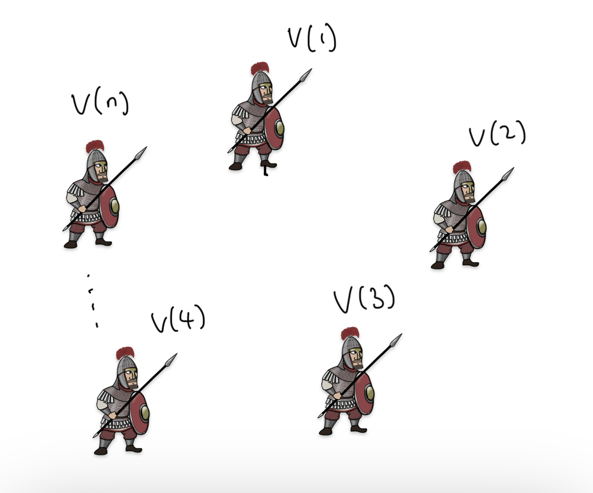
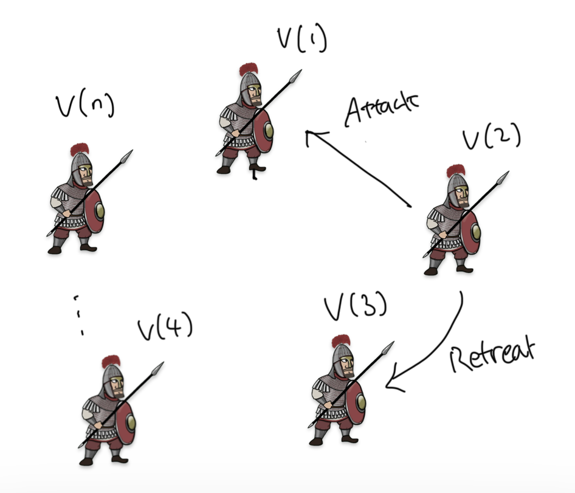
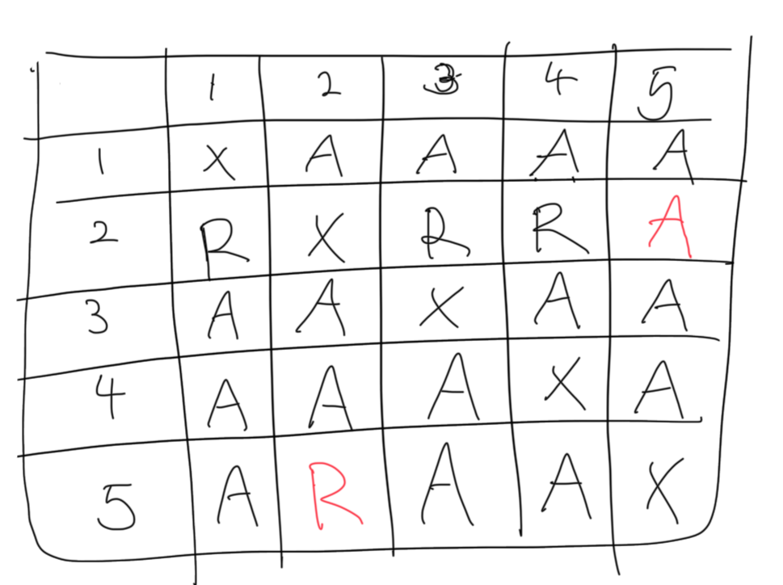
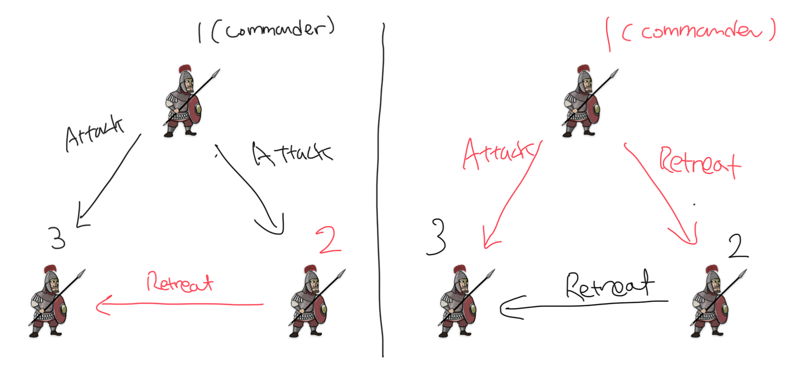
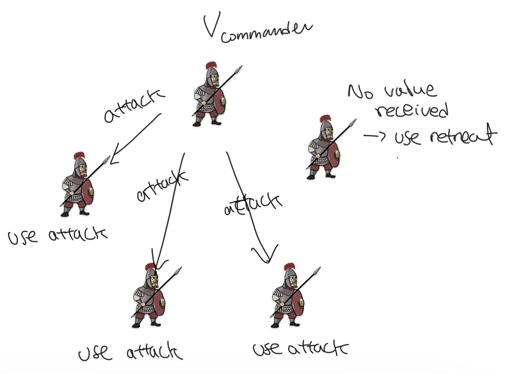
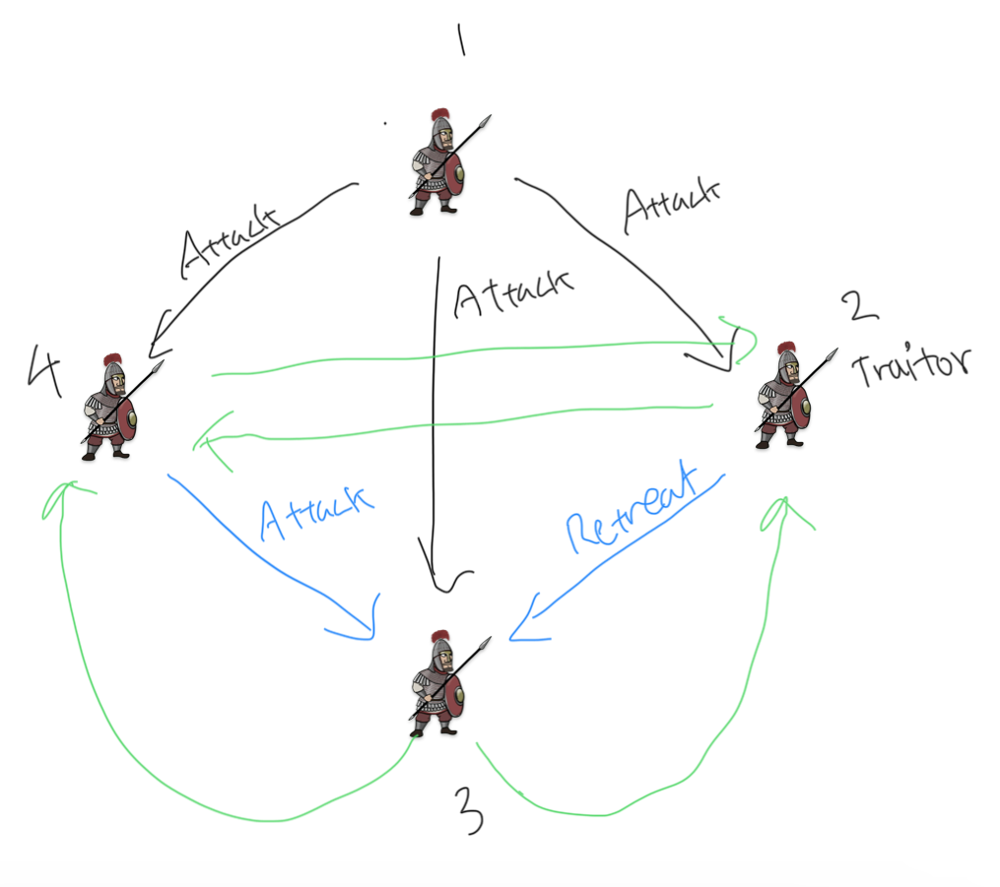
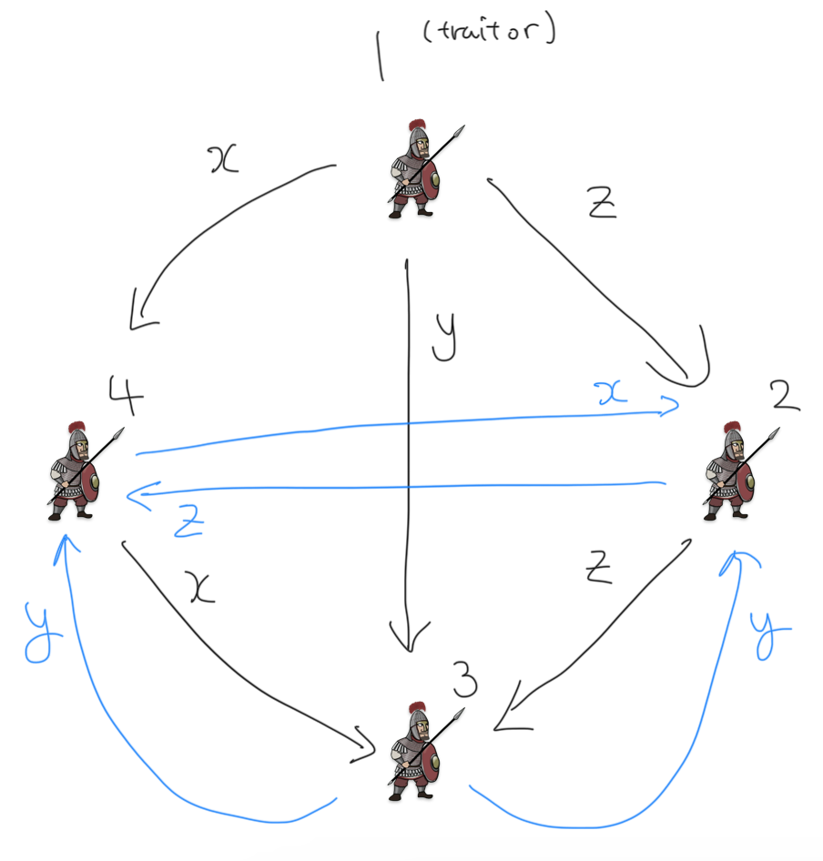
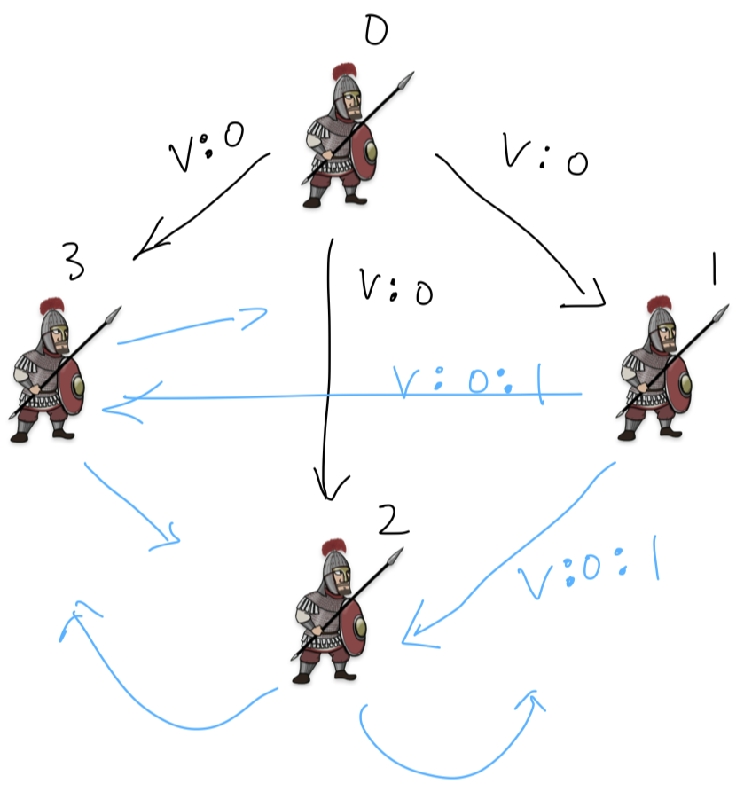
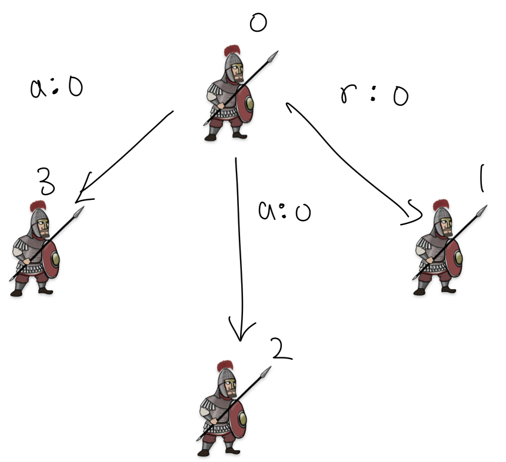
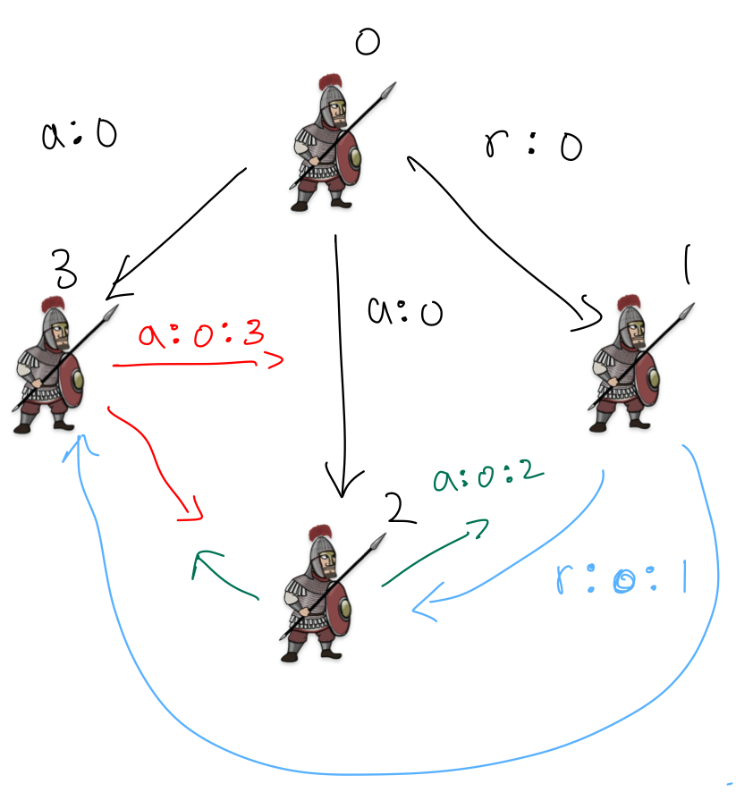

```toc
```

One of the most prominent blockchain consensus algorithms is Byzantine Fault Tolerance algorithm.

Now this concept has been democratized, with many popular implementations like CometBFT or HotStuff out there. All BFT implementations are based on Lamport's paper _The Byzantine Generals Problem_. 

## WTH is Byzantine Generals Problem


> This situation can be expressed abstractly in terms of a group of generals of the Byzantine army camped with their troops around an enemy city. Communicating only by messenger, the generals **must agree upon a common battle plan**. However, **one or more of them may be traitors** who will try to confuse the others. The problem is to find an algorithm to **ensure that the loyal generals will reach agreement**. 

Specifically, these are the conditions:
- A: All loyal generals decide upon the **same plan of action**. 
- B: A **small number of traitors cannot** cause the loyal generals to adopt a bad plan. 

Now, let $v(i)$ be the information from $i$ th general.



Each general uses some method to combine $v(1), ... , v(n)$.

Then, obviously, condition A can be achieved if all generals use the same method (or a function) to combine $v(1), ... , v(n)$, because it will always give the same result, giving them the same plan of action.

<!-- The goal is to have a group of distributed nodes agree on a value, like the next block or a tx order, even if some nodes are dysfunctional. -->
To fulfill condition B, the first intuitive method is to use the majority vote. Let every $v(i)$ be either 'attack' or 'retreat', and we just count the number of each option from each general. In this case, a small number of traitors may be able to twist the result from attack to retreat or retreat to attack, but both decisions will kind of make sense (if it is at 56% or something like that). The way $v(i)$ is communicated is by sending a messenger to every other general. 

But this way, traitorous generals may send different values to different generals. For example, 2nd general may send attack to 1st, and retreat to 3rd general. This makes condition A fail, where all loyal generals decide upon the **same plan of action**, because they need the same set of $v(1), ..., v(n)$ in order to decide the same plan of action. 



So if we want **condition A** to be true, we need two other conditions:
1. Every loyal general must obtain the same $v(1), ...., v(n)$. This is because a general cannot trust the value of $v(i)$ from ith general due to the presence of a traitorous general who may send out different information to different generals.

    Not only that, we must not allow a loyal general to use info from a traitorous general for condition B to be fulfilled. So that leads to the next condition:

2. If the ith general is loyal, then the value that he sends must be used by every loyal general as the value of $v(i)$.

Now, we can rephrase condition 1 as **condition 1'**: for every _i_, any two loyal generals use the same value of $v(i)$.

Here's one simple example where **condition 1** and **condition 2** are fulfilled:



$n = 5$, and traitorous generals are 2nd and 5th generals. Magically, the traitorous generals send a different message to each other only, fulfilling condition 1 and condition 2.

Conditions 1' and 2 relate to the value sent by ith general, so let's restrict the problem to **_how a single general sends his information to others_** (this is the most crucial point to understand, as we will only focus on a single general at a time when working with the algorithm):

**Byzantine Generals Problem.** A commanding general must send an order to his n - 1 lieutenant generals such that 
- IC1. All loyal lieutenants obey the same order. 
- IC2. If the commanding general is loyal, then every loyal lieutenant obeys the order he sends.

Note that there's no restriction to who becomes a commanding general. Any one general at a time can be a commanding general.

## It can't work with three generals

It's known that there is no solution that fulfills IC1 and IC2 for three generals with at least one traitor. Think about these two different cases below:



In both cases, the 1st general is the commander. In the first case, the 2nd general is a traitor. In the second case, the first general is. The 3rd general, being a loyal one, has no legitimate way to figure out which message is real, because there are only two generals sending him two different messages.

We thus come up with this theorem (we will skip the proof simply because I don't want to study more about the proof):

> No solution with fewer than $3m + 1$ generals can cope with $m$ traitors.

## Oral message solution

Before going into the solution, we define three assumptions about the messages among the generals.

- A1. Every message that is sent is delivered correctly
- A2. The receiver of a message knows who sent it
- A3. The absence of a message can be detected

We need A1 and A2 so that a traitor can't tamper with the communication between two other generals. A3 is so that a traitor won't be able to prevent a decision making process by not sending a message, which will have to be just replaced by a default value such as retreat.

Now we define the 'Oral Message algorithms' $OM(m)$ where $m ≥ 0$, where a commanding general sends an oral message to $n - 1$ other generals.

In this algorithm, we have a $majority$ function where $majority(v_1, ..., v_{n-1}) = v$ when a majority of values $v_i$ equal $v$. If $v_i$ does not exist, we fall back to the value $retreat$.

Now let's look at the trivial case of $OM(m)$, where $m = 0$ (zero traitors):



1. The commander sends $v_{commander}$ to every other general.
2. Every other general uses the value from the commander, or uses the value $retreat$ if no value received.

What about $OM(m), m > 0$?

1. The commander sends his value to every other general (remember, this could be fake or real info - we don't have a reason to trust the commander).
2. Every other general receives value $v_i$ from the commander, or chooses $retreat$ if no value received. **Every ith general** acts as the commanding general in $OM(m - 1)$ to send $v_i$ to $n - 2$ other generals (n - 2 because we exclude ith general and the commanding general at $OM(m)$).
3. For each $i$ and $j ≠ i$, ith general receives the value from from jth general, which is $v_j$. ith general uses $majority(v_1,...,v_{n-1})$. If no value received, default to $retreat$.

For example, if $m = 1, n = 4$:



We start from $OM(1)$, which is the top level. Because we're at the top level, only one commander initiates the message, which is the 1st general in the illustration above. He sends out $attack$ to everyone. 

Then, at $OM(0)$, remember everyone sends out their value to everyone else. This is illustrated by green and blue arrows. We only care about the value that the 3rd general receives at $OM(0)$, so we draw them in blue. The 2nd general is a traitor, so he sends a forged value $retreat$.

The 3rd general in total receives 2 attack orders and 1 retreat order. $majority(attack, attack, retreat) = attack$, so the 3rd general is able to get he correct value.

But does it also work when the commanding general is a traitor given the same $m$ and $n$? Let's take another example:



The 1st commander is a traitor. He sends out $x,y,z$ respectively to the 2nd, 3rd and 4th general at $OM(1)$. These values can be either attack or retreat, but it doesn't really matter.

At $OM(0)$, each loyal general broadcasts the value that he received. We find that all loyal generals receive the same value $x,y,z$ no matter what. So they can all use the same $v = majority(x,y,z)$, which is good.

We can go on and on and try a bigger $n$, but basically the whole concept is built around recursion. $OM(m)$ invokes $OM(m - 1)$ as many as $n - 1$ times, till we get to $m = 0$. So $OM(m - k)$ will be called $(n - 1) ... (n - k)$ times.

How could we differentiate the same value (attack or retreat) received from different generals? We simply prefix the number assigned to each general to $v_i$.

For example, when general $i$ sends a message, he adds his own number to the back of it.

So if general 1 sends value $attack$, it becomes:
`[ATTACK, 1]`

If general 3 passes it on, it becomes:
`[ATTACK, 1, 3]`

If general 2 passes it,
`[ATTACK, 1, 3, 2]`

Something like that.

## Signed message solution

On top of A1, A2 and A3, we add A4:

- a. A loyal general's signature cannot be forged, and any alteration of the contents of his signed messages can be detected.
- b. Anyone can verify the authenticity of a general's signature.

And now we'll see that a solution using signed messages is much more useful. The algorithm is denoted by $SM(m)$, where $m$ is the number of maximum traitors we have in a problem.

The only requirement for this algorithm is that it has a function called $choice$ that will be applied to the set of final orders $V$ that each general will have collected. The $choice$ function satisfies two properties:

1. If the set $V$ consists of the single element $v$, then $choice(V) = v$.

    For example, $choice(\{attack\}) = attack$.

2. $choice(\emptyset) = RETREAT$, where $\emptyset$ is the empty set.

The requirement is not exhaustive; these are the two essential properties that $choice$ function needs to have. Othere than these, any deterministic rule can be applied to the set of orders that a general receives, to decide on one final order. Lamport doesn't specify a specific choice function with more properties, leaving a room for more specific algorithms such as PBFT, HotStuff, and CometBFT to be developed, each with their own unique rule.

### Order vs message

And just to make it clear before talking about the algorithm, an order and a message are different:

- order: just a value or command that's being passed on. In our example, it's been attack or retreat.
- message: a message is an order, followed by a list of signatures from the generals that have forwarded the order so far.

    For example, $attack:0:1$ would mean that general 0 issued an attack order, and forwarded that to general 1.

### Algorithm $SM(m)$

Initially, each general has an empty set of orders received.

The commanding general signs and sends his order to every other general.

For each $i$, 

- if a general $i$ receives a message of the form $v:0$ (commander is the 0th general) and he has an empty set of orders, then
    - general $i$ lets $V_i = {v}$
    - he sends the message $v:0:i$ to every other general except the commanding general.

        

- if general $i$ receives a message of the form $v:0:j_1:...:j_k$ and v is not in the set $V_i$,
    1. general $i$ adds $v$ to $V_i$. For example, maybe $V_i = \{attack\}$, but $v = retreat$, because someone was a traitor. In this case, the commanding general must be a traitor, or another traitor forged/inserted a message pretending to have come from a traitor commanding general, which is also only possible if commanding general’s a traitor. If the commander is loyal, no one can forge his sig according to A4, so no new $v$ should appear.
    1. if $k < m$, then he sends the message $v:0:j_1:...:j_k$ to every general other than $j_l, ..., j_k$. This just means sending a message to every general that hasn't received this message yet.


        For example, the commanding general at 0 sends $retreat:0$ to general 1, but sends $attack:0$ to others.
        
        

        Then, each general sends the message $v:0:j_1:...:j_k$ to every general other than $j_l, ..., j_k$. Note that every message containing an order $v$ already in the set $V_i$ is ignored.

        Upon receiving the message, each general would know that the general 0 is a traitor, because each would have $V = \{attack, retreat\}$, but the message originated from general 0.

        For example, upon receiving $r:0$, general 1 would have $V = \{retreat\}$, and after receiving $a:0:3$ or $a:0:2$, he would have $V = \{retreat, attack\}$. But since he knows that the message originated from general 0 but it turns out to be a different order, he can take steps to deduce that general 0 is a traitor. But the specifics of how this works is out of the scope of the Byzantine Generals Problem. The BGP only focuses on two properties: 
        - IC1. All loyal lieutenants obey the same order. 
        - IC2. If the commanding general is loyal, then every loyal general obeys the order he sends.

        And all generals that receive the order from general 0 will end up with $choice(\{attack, retreat\})$, which will give a deterministic result.

        

    1. For each i: when general i will receive no more messages, he obeys the order $choice(V_i)$.
## References

- [The Byzantine Generals Problem](https://dl.acm.org/doi/pdf/10.1145/357172.357176)
- [Practical Byzantine Fault Tolerance](http://pmg.csail.mit.edu/papers/osdi99.pdf)