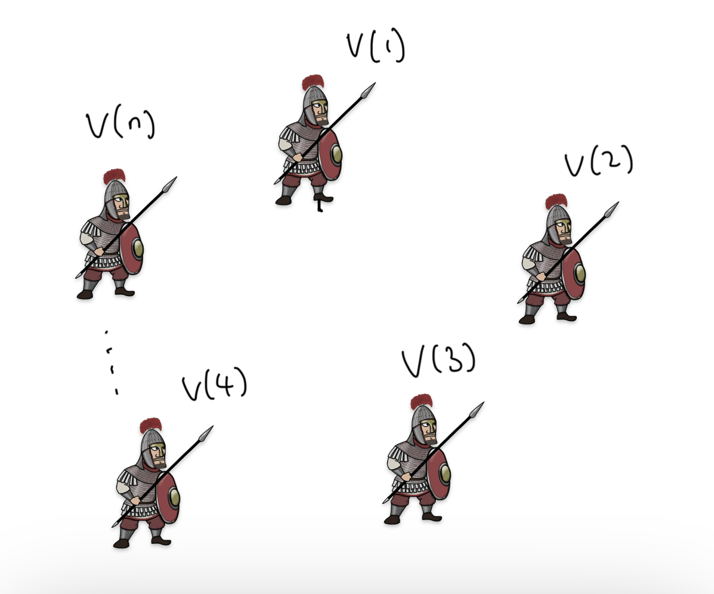
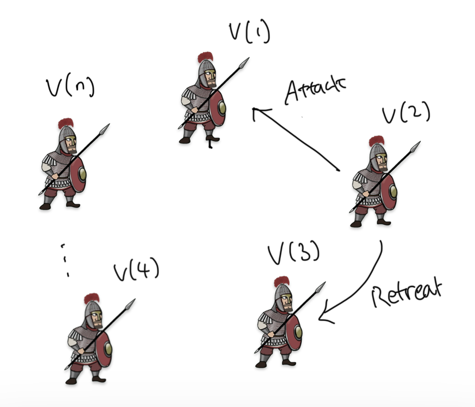
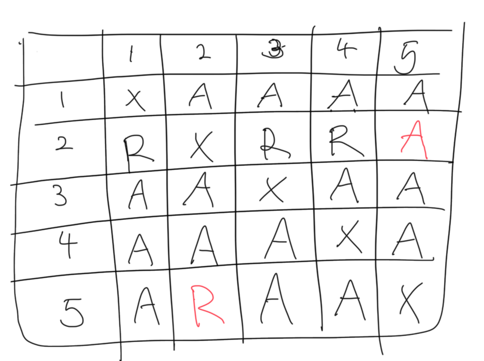
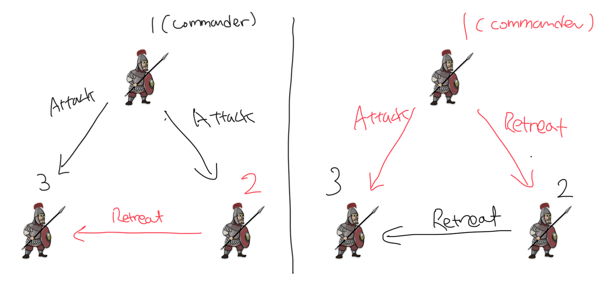
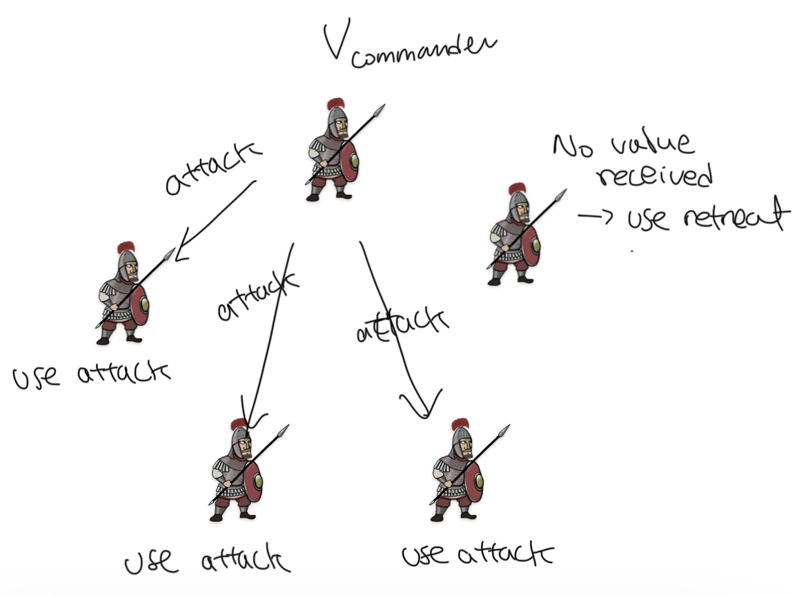

One of the most prominent blockchain consensus algorithms is Byzantine Fault Tolerance algorithm.

Now this concept has been democratized, with one popular implementation being named as CometBFT. Let's get down to the bottom of it.

## WTH is Byzantine Generals Problem

In his paper _The Byzantine Generals Problem_, Leslie defines an interesting problem: 

> This situation can be expressed abstractly in terms of a group of generals of the Byzantine army camped with their troops around an enemy city. Communicating only by messenger, the generals **must agree upon a common battle plan**. However, **one or more of them may be traitors** who will try to confuse the others. The problem is to find an algorithm to **ensure that the loyal generals will reach agreement**. 

Specifically, these are the conditions:
- A: All loyal generals decide upon the **same plan of action**. 
- B: A **small number of traitors cannot** cause the loyal generals to adopt a bad plan. 

Now, let $v(i)$ be the information from $i$ th general.

Each general uses some method to combine $v(1), ... , v(n)$.

Then, obviously, condition A can be achieved if all generals use the same method (or a function) to combine $v(1), ... , v(n)$, because it will always give the same result, giving them the same plan of action.

<!-- The goal is to have a group of distributed nodes agree on a value, like the next block or a tx order, even if some nodes are dysfunctional. -->
To fulfill condition B, the first intuitive method is to use the majority vote. Let every $v(i)$ be either 'attack' or 'retreat', and we just count the number of each option from each general. In this case, a small number of traitors may be able to twist the result from attack to retreat or retreat to attack, but both decisions will kind of make sense (if it is at 56% or something like that). The way $v(i)$ is communicated is by sending a messenger to every other general. 

But this way, traitorous generals may send different values to different generals. For example, 2nd general may send attack to 1st, and retreat to 3rd general. This makes condition A fail, where all loyal generals decide upon the **same plan of action**, because they need the same set of $v(1), ..., v(n)$ in order to decide the same plan of action. 

So if we want **condition A** to be true, we need two other conditions:
1. Every loyal general must obtain the same $v(1), ...., v(n)$. This is because a general cannot trust the value of $v(i)$ from ith general due to the presence of a traitorous general who may send out different information to different generals.

    Not only that, we must not allow a loyal general to use info from a traitorous general for condition B to be fulfilled. So that leads to the next condition:

2. If the ith general is loyal, then the value that he sends must be used by every loyal general as the value of $v(i)$.

Now, we can rephrase condition 1 as **condition 1'**: for every _i_, any two loyal generals use the same value of $v(i)$.

Here's one simple example where **condition 1** and **condition 2** are fulfilled:

$n = 5$, and traitorous generals are 2nd and 5th generals. Magically, the traitorous generals send a different message to each other only, fulfilling condition 1 and condition 2.

Conditions 1' and 2 relate to the value sent by ith general, so let's restrict the problem to **_how a single general sends his information to others_**:

**Byzantine Generals Problem.** A commanding general must send an order to his n - 1 lieutenant generals such that 
- IC1. All loyal lieutenants obey the same order. 
- IC2. If the commanding general is loyal, then every loyal lieutenant obeys the order he sends.

Note that there's no restriction to who becomes a commanding general. Any one general at a time can be a commanding general.

## It can't work with three generals

It's known that there is no solution that fulfills IC1 and IC2 for three generals with at least one traitor. Think about these two different cases below:

In both cases, the 1st general is the commander. In the first case, the 2nd general is a traitor. In the second case, the first general is. The 3rd general, being a loyal one, has no legitimate way to figure out which message is real, because there are only two generals sending him two different messages.

We thus come up with this theorem (we will skip the proof simply because I don't want to study more about the proof):

> No solution with fewer than $3m + 1$ generals can cope with $m$ traitors.

## Solution

Before going into the solution, we define three assumptions about the messages among the generals.

- A1. Every message that is sent is delivered correctly
- A2. The receiver of a message knows who sent it
- A3. The absence of a message can be detected

We need A1 and A2 so that a traitor can't tamper with the communication between two other generals. A3 is so that a traitor won't be able to prevent a decision making process by not sending a message, which will have to be just replaced by a default value such as retreat.

Now we define the 'Oral Message algorithms' $OM(m)$ where $m ≥ 0$, where a commanding general sends an oral message to $n - 1$ other generals.

In this algorithm, we have a $majority$ function where $majority(v_1, ..., v_{n-1}) = v$ when a majority of values $v_i$ equal $v$. If $v_i$ does not exist, we fall back to the value $retreat$.

Now let's look at the trivial case of $OM(m)$, where $m = 0$ (zero traitors):

1. The commander sends $v_{commander}$ to every other general.
2. Every other general uses the value from the commander, or uses the value $retreat$ if no value received.

What about $OM(m), m > 0$?

1. The commander sends his value to every other general (remember, this could be fake or real info - we don't have a reason to trust the commander).
2. Every other general receives value $v_i$ from the commander, or chooses $retreat$ if no value received. **Every ith general** acts as the commanding general in $OM(m - 1)$ to send $v_i$ to $n - 2$ other generals (n - 2 because we exclude ith general and the commanding general at $OM(m)$).
3. For each $i$ and $j ≠ i$,  

## References

- [The Bazantine Generals Problem](https://dl.acm.org/doi/pdf/10.1145/357172.357176)
- [Practical Byzantine Fault Tolerance](http://pmg.csail.mit.edu/papers/osdi99.pdf)