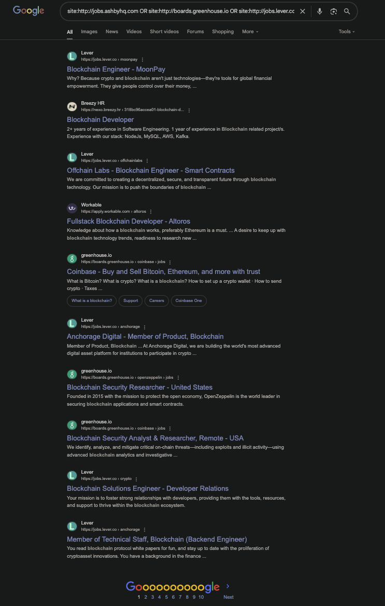

지난 1년간 블록체인과 해외취업에 중점을 맞춘 [스레드 계정](https://www.threads.com/@nerdycrypto.dev/)과 [오픈채팅방](https://open.kakao.com/o/ge7kPiEg)을 운영하면서 블록체인 개발자 취업과 관련하여 자주 받은 질문, 여기서 다 정리해 드리겠다.

# 질문 리스트

```toc
```

### 주니어도 채용의 기회가 많나요?

적어도 해외 리모트는 주니어 포지션이 많이 없습니다. 그렇다고 해서 국내를 보자니 애초에 블록체인 관련 채용 포지션이 적습니다.
보통은 어느 포지션이든 최소 2-3년 정도의 경험이 있는 경력직을 선호합니다. 요즘엔 최소 5년도 많은듯 합니다.

이유를 들자면 이 업계는 보통 소수정예 선발을 좋아하고, 시행착오를 이미 겪어서 빠르게 프로덕트를 만들 수 있는 사람을 더 선호하기 때문입니다. 소수정예란 뜻은 Web2 회사에 비해서 Web3 회사는 현저히 인력이 적다는 말입니다. Web3 '대기업'은 아직까지 없습니다.

그렇다면 그 전에는 Web3 밖에서만 활동해야 하느냐고 물었을때 또 그런건 아닌 것 같습니다. 트위터, 텔레그램으로 소식 열심히 받아보고 채용공고 심심할때쯤 한번씩 들어가보고 솔리디티 끄적끄적 해 보고 오픈소스된 컨트랙트 좀 읽어보고 유명 블록체인 프로젝트에 기여도 좀 해보고 문서도 좀 읽어보고 등등. 이렇게 해야만 기회가 비로소 왔을 때 잡을 수 있슴다. 인맥+파트타임으로 살짝씩 시작하는 것도 좋은 전략입니다. 제가 그렇게 시작했습니다.

### 비전공자도 취업 가능할까요?

결론부터 말하자면 최악의 시나리오에서 유수 대학에서 4년제 컴공을 졸업한 사람과 경쟁할 자신이 있어야 합니다. 그건 본인이 자신감을 어떻게든 가지는 수 밖에 없구요.

자신감만 있으면 전공자든 비전공자든 열심히 준비하기만 하면 좋은 결과가 있을 수 밖에 없습니다.

진입장벽이 좀 높아서 처음엔 필히 안 좋은 회사에서 시작할 수밖에 없을 수도 있습니다. 어쩔 수 없는 단계지만 그곳에서 얼마나 빠르게 상승할 수 있는지가 관건이고 그건 오로지 본인에게 달려있습니다.

### 한국에서 리모트로 해외 회사에서 일하면 계약 구조는 어떻게 되나요?

한국에서 개인사업자를 차리고, 해외 회사와 그 개인사업자가 계약을 맺는 식으로 진행됩니다.

월급을 받는 방법은 크게 두 가지입니다.
1. 암호화폐 (USDC, USDT, DAI 등)
2. 법정화폐 (USD 등)

두 방법 모두 월급을 받았을 때 세금 문제를 해결해야 합니다.

가장 쉬운 방법은 세무사 한 분을 붙여서 한달에 10-20 만원의 비용을 내고 기장 관리를 맡기는 것입니다.

은행 계좌는 인터넷은행(카카오, 토스, K뱅크)이 아닌 은행에서 개인사업자용 계좌를 하나 열면 됩니다.
계좌는 한화계좌, 외환계좌 중 하나를 선택해야 합니다. 한화계좌로 받게 되면 송금되는 화폐에 상관없이 무조건 한국 원으로 바로 입금됩니다.
USD를 들고 있을 수 있는 외환계좌를 선택하게 되면 USD를 그대로 받을 수 있게 됩니다.
경우에 따라 은행에 사업 계약서를 제출해야 할 수 있습니다.

지금까지 들어본 말로는 1번이 법적으로 모호한 영역에 있어서 보통 2번을 추천한다고 합니다.

### 처음 공부를 시작할때 추천하는 자료가 있나요?
#### 무료 튜토리얼
- https://cryptozombies.io/
- https://www.cyfrin.io/updraft
- https://metaschool.so/courses?blockchain=Ethereum
- https://learnweb3.io/degrees/ethereum-developer-degree/
- https://speedrunethereum.com/
- https://www.udemy.com/course/advanced-solidity-yul-and-assembly/ (유료)
- https://ethernaut.openzeppelin.com/

#### 블록체인 트렌드 관련
텔래그램

- https://t.me/joelweb3kr (제 채널입니다 😅)
- https://t.me/telonews
- https://t.me/ahboyashreads
- https://t.me/wublockchainenglish
- https://t.me/cookiesreads
- https://t.me/web3subin
- https://t.me/catallactic
- https://t.me/FourPillarsGlobal
- https://t.me/catallactic
- https://t.me/snu_decipher
- https://t.me/tiger_research
- https://t.me/unfolded_defi

웹사이트
- https://www.hashedopenresearch.com/
- https://kairoscrypto.substack.com/

### 처음 공부를 시작할때 추천하는 로드맵이 있나요 (어떤 언어 먼저 공부 등)?

1. 블록체인 관련 어플리케이션 사용해보기/살펴보기. 뭘 만드는지도 모르는데 공부를 시작하는게 더 이상하다고 생각합니다.

사용해보면 어쩔 수 없이 이해해야 할 수 밖에 없음.
- CEX
  - [업비트](https://upbit.com/)
  - [빗썸](https://www.bithumb.com/react/)
  - [Binance](https://binance.com)
  - [OKX](https://okx.com)
  - [Coinbase](https://www.coinbase.com/)
- Software wallet
  - [Metamask](https://metamask.io/)
  - [Phantom](https://phantom.app/)
  - [OKX Wallet](https://www.okx.com/web3)
  - [Rabby wallet](https://rabby.io/)
  - [Coinbase wallet](https://www.coinbase.com/wallet)
  - [Trust wallet](https://trustwallet.com/)
- Hardware wallet
  - [Ledger wallet](https://www.ledger.com/)
  - [Trezor](https://trezor.io/)
  - [Keystone](https://keyst.one/)
- DEX 
  - [Uniswap](https://uniswap.org/)
  - [Jupiter](https://jup.ag/)
  - [Curve](https://curve.fi/)
  - [PancakeSwap](https://pancakeswap.finance/)
  - [Balancer](https://balancer.fi/)
- Lending
  - [Aave](https://aave.com/)
  - [Compound](https://compound.finance/)
  - [Spark](https://app.sparkprotocol.io/)
  - [Kamino](https://kamino.finance/)
  - [Morpho](https://app.morpho.org/ethereum/earn)
  - [Suilend](https://suilend.fi/)
  - [Maple Finance](https://maple.finance/)
- CDP
  - [Sky](https://sky.money/)
  - [Avalon](https://www.avalonfinance.xyz/)
  - [Lista](https://lista.finance/)
  - [Liquidty](https://www.liquity.org/)
  - [crvUSD](https://www.curve.finance/crvusd/ethereum/markets/)
  - [Yala](https://yala.finance/)
- Yield
  - [Pendle](https://pendle.finance/)
  - [Convex Finance](https://www.convexfinance.com/)
- Vaults/Farms
  - [Veda](https://veda.finance/)
  - [ether.fi](https://ether.fi/)
  - [Solv](https://solv.finance/)
  - [Upshift](https://www.upshift.finance/)
  - [Turtle Club](https://www.turtle.xyz/)
  - [Mitosis](https://mitosis.org/)
  - [Mellow restaking vaults](https://mellow.finance/)
- Basis trading
  - [Ethena USDe](https://www.ethena.fi/)
  - [USDX](https://usdx.money/)
  - [BounceBit](https://www.bouncebit.io/)
  - [Resolv](https://resolv.finance/)
- Derivatives
  - [Jupiter Perps](https://jup.ag/perps)
  - [Hyperliquid](https://hyperliquid.xyz/)
  - [Drift](https://www.drift.trade/)
  - [GMX](https://gmx.io/)
  - [dYdX](https://dydx.trade/)
- Liquid staking
  - [Lido](https://lido.fi/)
  - [Jito](https://jito.network/)
  - [Rocket Pool](https://rocketpool.net/)
- Restaking
  - [EigenLayer](https://www.eigenlayer.xyz/)
  - [Babylon](https://babylonchain.io/)
  - [Symbiotic](https://symbiotic.fi/)
- Liquid restaking
  - [ether.fi](https://ether.fi/)
  - [Kelp](https://kelpdao.xyz/)
  - [Renzo](https://www.renzoprotocol.com/)
  - [Fragmetric](https://fragmetric.xyz/)
- Cross-chain/interoperability
  - [Layerzero](https://layerzero.network/)
  - [Wormhole](https://wormhole.com/)
  - [Axelar](https://axelar.network/)
- Oracle
  - [Chainlink](https://chain.link/)
  - [Pyth](https://pyth.network/)
  - [RedStone](https://redstone.finance/)
- RWA tokenization
  - [Ondo Finance](https://ondo.finance/)
  - [USDtb](https://usdtb.money/)
  - [Spiko](https://www.spiko.io/)
- Dashboard
  - [DeFillama](https://defillama.com/)
  - [L2Beat](http://l2beat.com/)
  - [rwa.xyz](https://rwa.xyz)
  - [CryptoQuant](https://cryptoquant.com/)
  - [Messari](https://messari.io/)
  - [Coinmarketcap](https://coinmarketcap.com/)
- Social/InfoFi
  - [Farcaster](https://farcaster.xyz/)
  - [Kaito](https://www.kaito.ai/)

2. Solidity 공부 시작

또 다른 EVM 전용 언어인 Yul, Sui와 Aptos의 Move, 솔라나의 Rust 등 스마트 컨트랙트 언어가 많지만, 결국엔 진입장벽이 낮고 배울 수 있는 리소스가 가장 많은 솔리디티가 기본입니다.
프로그래밍의 파이썬? 같은, 그냥 기본으로 가져가는 느낌입니다.

저에게 가장 효과 있었던 방법은 오픈소스 프로토콜 (Uniswap, Aave 등)의 소스코드를 찾아서 코드 한줄 한줄씩이 무슨 뜻인지 해석해보고, 블로그 글로 적어보는 식입니다. 물론 그 전에 그 프로토콜이 어떻게 작동하는지는 직접 사용해보면서 공부를 하고요.

3. Web3 프로젝트 개발 시도하기


### 블록체인 개발은 정확히 어떤 걸 의미하나요?

1. 풀스택 (FE & BE) 개발: TS만 알아도 큰 문제는 없음. 물론 회사에 따라 백엔드에 Rust, Go를 사용할 수 있음. 예시: https://github.com/aave/interface, https://github.com/aave/aave-utilities, https://github.com/aave/protocol-subgraphs 등.
1. 스마트컨트랙트 개발: Solidity, TS 사용. Rust/Go는 중점적으로 사용하진 않지만 도움이 될 수는 있음. 예시: https://github.com/aave-dao/aave-v3-origin, https://github.com/aave/Aave-Vault, https://github.com/aave/gho-core 등.
1. 프로토콜(L1, L2, Bridge, AVS 등) 개발: Solidity, Rust, Go 등을 주로 사용. 예시: https://github.com/ethereum/go-ethereum, https://github.com/paradigmxyz/reth 등.
1. 기타등등: 인프라/데브옵스/SRE/보안 엔지니어

### 리모트로 해외 회사 블록체인 개발을 하게 되면 영어를 잘 해야만 하는지 궁금합니다.

- 개발 직군: 개발 천재면 영어 못해도 잘 할 수 있습니다. 개발 천재 아니면 아닐수록 영어로 입을 털어야 일을 잘 할 수 있습니다.
- 비개발 직군: 영어 잘해야 합니다.

### 채용 공고는 어떻게 찾아보나요?
링크드인은 검색 기능이 너무 안 좋아서 개인적으로 사용하진 않습니다.

- 구글에 다음 키워드로 검색: `site:http://jobs.ashbyhq.com OR site:http://boards.greenhouse.io OR site:http://jobs.lever.co OR site:http://apply.workable.com OR site:*.http://breezy.hr/p/ “내 키워드”`

  

- https://www.bountycaster.xyz/jobs
- https://x.com/jobs

### 블록체인 개발 업계 평균 연봉이 궁금합니다.

몇 가지 조건에 따라 달라질 수 있습니다.

1. 회사 HQ 위치
    - 한국이면 당연히 적게 줍니다. 진짜 진짜 진짜 잘하는 형을 아는데 한국회사 다니면서 대충 세전 2억 언저리로 받는다고 들었습니다.
    - 외국(특히 미국)이면 상방은 아름답게 뚫려 있습니다. 잘하기만 하면 기본급 200-400K USD 노려볼 수 있습니다.
1. 직무는 보상이 회사 따라 천차만별이라 그냥 일반적으로 잘 주는지 안 주는지만 적어놓겠습니다.
    1. 프론트엔드: 하. 가장 쉬우니 가장 덜쳐줌
    1. 백엔드: 중. 프엔보단 더 쳐줌. 백엔드가 특별히 중요한 곳들이 더 있음. 거래소 같은 곳은 백엔드 중요함
    1. 인프라/데브옵스/SRE: 중. 이미 이 포지션을 뽑는다는 거 자체가 회사가 어느정도 성숙했고, 이 부분이 중요하다는 뜻. 잘 쳐줌.
    1. 스마트 컨트랙트 개발: 중. 잘 쳐줌.
    1. 블록체인 코어 개발 (L1, L2 등): 상. 매우매우 잘 쳐줌.
    1. 보안 감사: 상. 매우매우 잘쳐줌.
1. Seniority
    1. 경력이 없으면 일 자체를 구하기가 힘듭니다.
    1. 2-3년 경력이면 취업을 노려볼 수는 있으나 특별한 케이스 아닌 이상 100-150K 정도
    1. 그 이후는 그냥 열려있음 (최상의 경우에는 400K 정도. 물론 400K 받는 사람은 손에 꼽습니다)
1. 회사 투자유치 현황
    1. 투자 못 받았으면 당연히 많이 못 줍니다.
    1. 3-5M 정도면 150K는 줄 수 있는듯
    1. 10M-50M이면 그냥 막 불러도 되는듯

그래서 제가 보기엔 해외 기준으로는 Base salary 80K-400K, 한국 기준으론 최저임금부터 2억까지인것 같습니다.

물론 특별한 경우는 언제나 존재합니다. Take it with a grain of salt.

### 현실적인 해외 + 리모트 + 블록체인 회사 취업 가능성이 궁금합니다.

쉽지 않습니다. 영어 해야하죠, 인터뷰 빡세게 봐야하죠, 코드 잘 적어야 하죠, 블록체인 잘 이해해야 하죠, 오픈소스 잘 해야 하죠, 네트워킹 잘 해야 하죠..

그리고 글로벌 인재들과 경쟁을 하기 때문에 한국 내에서 취업하는 것보다는 배로 어렵습니다. 상상해보세요. 하버드 나온 인도인도 내가 지원하는 포지션에 지원하고 있을 수도.

하지만. 불가능한 건 아닙니다. 그니까 제가 생각하는 극단적인 불가능의 정도는 프로 야구선수 되기 정도의 불가능입니다. 이 정도는 당연히 아니고요. 그 불가능의 정도에서 한 100,000 정도만 곱하면 될 것 같습니다. $\text{프로 야구선수 될 수 있는 확률} \times 100000$

진짜 하고 싶다면 걱정할 시간에 코드 한 줄이라도 더 적고, 오픈소스 코드 한 줄이라도 더 보는 게 맞다고 생각합니다.

잘하면 보상은 확실합니다.

### 블록체인 노동시장에서 개발자로써 경쟁력을 가질 수 있는 방법이 궁금합니다.

### 다른 업계 (web2)에 종사하는데 쉽게 넘어갈 수 있는 방법이 있나요?
