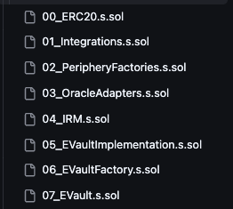
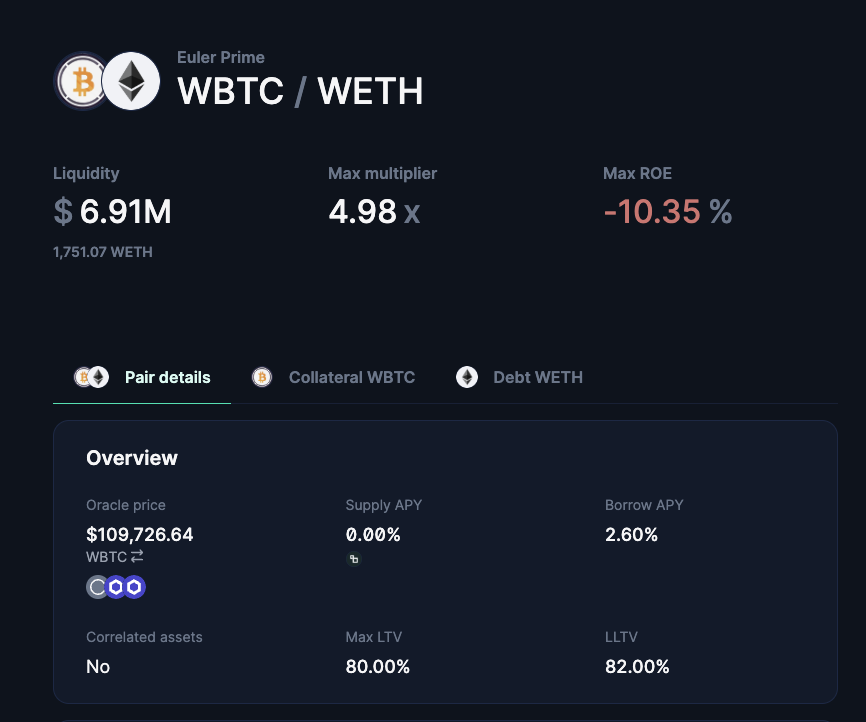
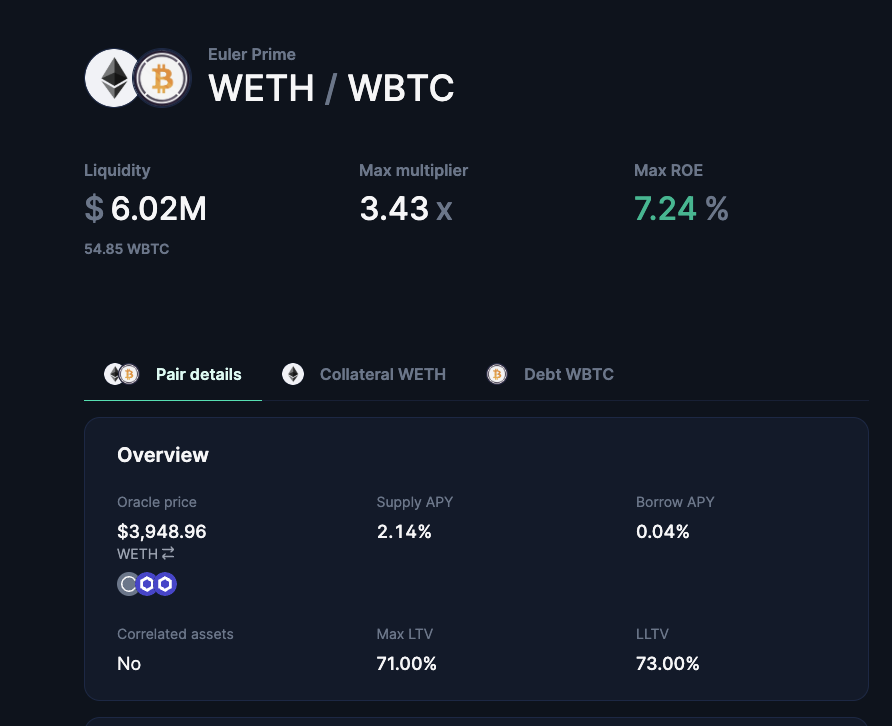
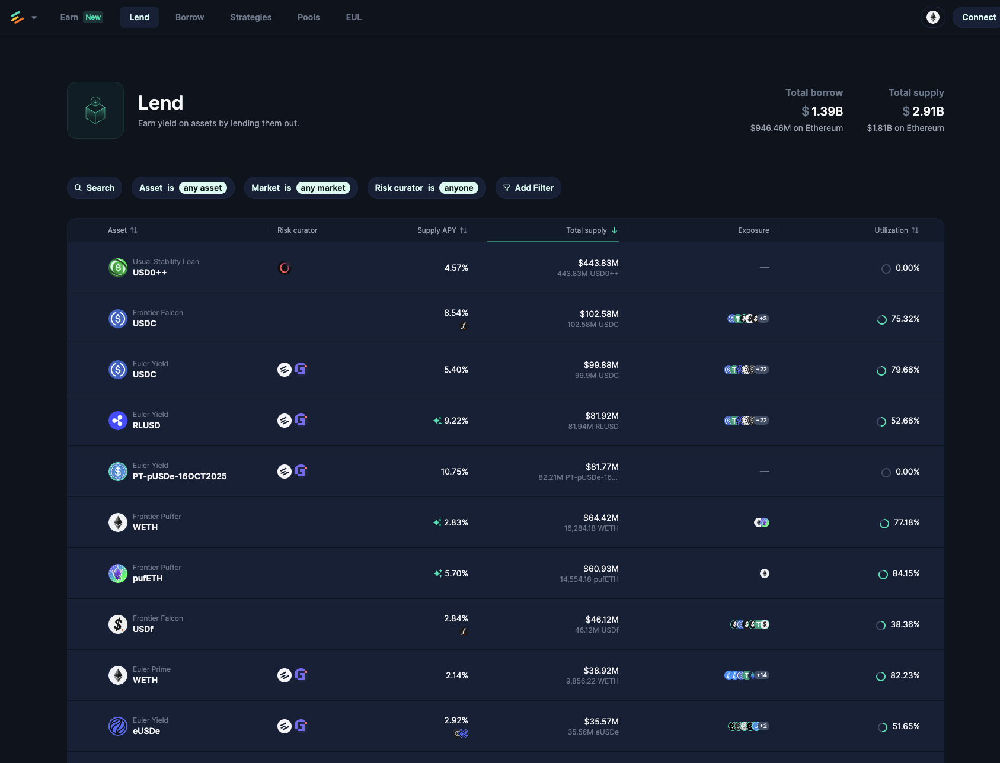
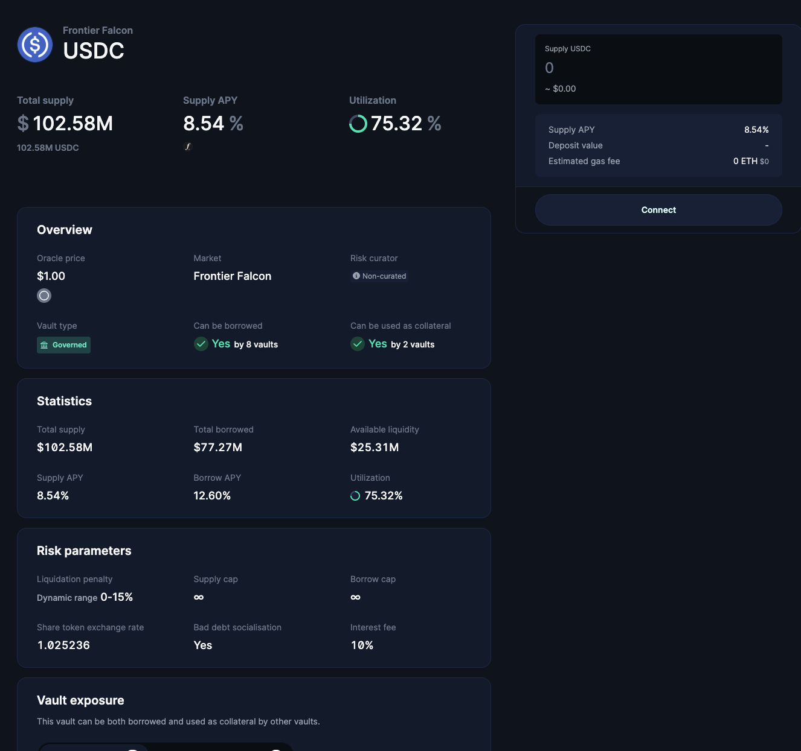
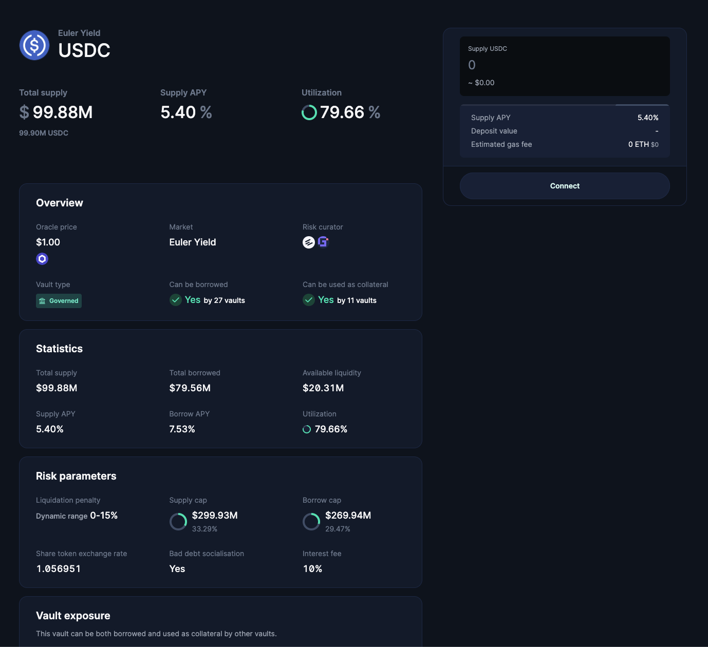
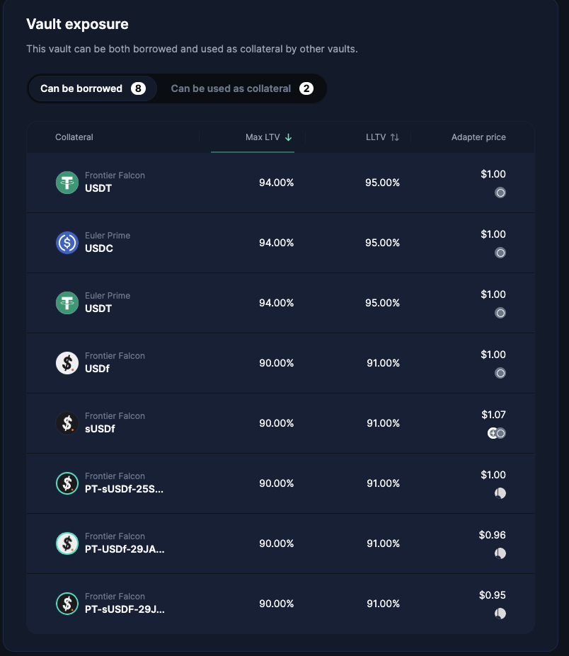
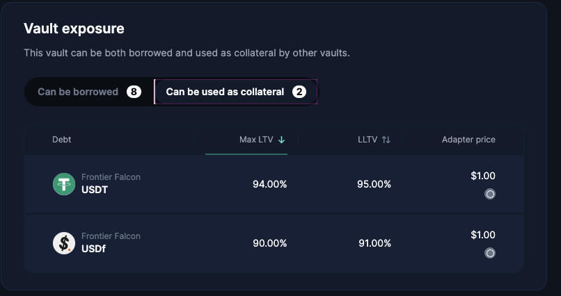

# Euler V2 system deployment

To get a better overview of any sophisticated system of smart contracts, it's always good to start from how the deployment works.

## Deployment in EVK Test setup

How Euler v2 is set up can be found out by looking at [the test setup file](https://github.com/euler-xyz/euler-vault-kit/blob/5b98b42048ba11ae82fb62dfec06d1010c8e41e6/test/invariants/Setup.t.sol#L47-L47):

<iframe frameborder="0" scrolling="no" style="width:100%; height:3271px;" allow="clipboard-write" src="https://emgithub.com/iframe.html?target=https%3A%2F%2Fgithub.com%2Feuler-xyz%2Feuler-vault-kit%2Fblob%2F5b98b42048ba11ae82fb62dfec06d1010c8e41e6%2Ftest%2Finvariants%2FSetup.t.sol%23L47C29-L54C1&style=atom-one-dark&type=code&showBorder=on&showLineNumbers=on&showFileMeta=on&showFullPath=on&showCopy=on"></iframe>

First, protocol core is deployed by `_deployProtocolCore`, and then vaults are deployed by `_deployVaults`. We're going to talk about `EthereumVaultConnector` a bit later. Following that are protocol config and mock oracle and assets.

Now, in `_deployVaults` is where the real magic happens. First, the deployed `EthereumVaultConnector`, `ProtocolConfig`, `SequenceRegistry`, and `BalanceTracker` are packaged into `Base.Integrations` struct. We call them `integrations`.

Then, each module such as `Vault`, `Borrowing`, `Liquidation` are deployed and stored in `Dispatch.DeployedModules` struct.

These two structs - `Base.Integrations` and `Dispatch.DeployedModules` are again used to initialize `EvaultExtended` contract. This serves as the implementation for the vault factory contract.

<iframe frameborder="0" scrolling="no" style="width:100%; height:373px;" allow="clipboard-write" src="https://emgithub.com/iframe.html?target=https%3A%2F%2Fgithub.com%2Feuler-xyz%2Feuler-vault-kit%2Fblob%2F5b98b42048ba11ae82fb62dfec06d1010c8e41e6%2Ftest%2Finvariants%2FSetup.t.sol%23L102-L115&style=atom-one-dark&type=code&showBorder=on&showLineNumbers=on&showFileMeta=on&showFullPath=on&showCopy=on"></iframe>

Using the factory contract, multiple copies of `EvaultExtended` are created for each asset concerned.

## Deployment in `euler-devland`

Another example of the deployment script is at [euler-devland](https://github.com/euler-xyz/euler-devland/blob/eeef15f35109e04bba6a8197378cd91e663a0a43/script/DeployScenario.s.sol#L147-L190). It contains scripts to spin up an instance of Euler contracts for local development and testing purposes.

<iframe frameborder="0" scrolling="no" style="width:100%; height:1003px;" allow="clipboard-write" src="https://emgithub.com/iframe.html?target=https%3A%2F%2Fgithub.com%2Feuler-xyz%2Feuler-devland%2Fblob%2Feeef15f35109e04bba6a8197378cd91e663a0a43%2Fscript%2FDeployScenario.s.sol%23L147-L190&style=atom-one-dark&type=code&showBorder=on&showLineNumbers=on&showFileMeta=on&showFullPath=on&showCopy=on"></iframe>

We can see that this is exactly the same pattern of deployment that we saw in EVK Test setup.

## Deployment in `euler-xyz/evk-periphery`

The real deployment script that is used for the mainnet lives under [euler-xyz/evk-periphery/script](https://github.com/euler-xyz/evk-periphery/blob/e41f2b9b7ed677ca03ff7bd7221a4e2fdd55504f/script). It really does not matter which repository has the deployment script, because the complete Euler system includes multiple Github repositories anyways.

Pivotal to the system are probably only the first few deployment scripts:

`01_Integrations.s.sol` deploys the 'protocol core' that will form the `Base.Integrations` struct:

<iframe frameborder="0" scrolling="no" style="width:100%; height:562px;" allow="clipboard-write" src="https://emgithub.com/iframe.html?target=https%3A%2F%2Fgithub.com%2Feuler-xyz%2Fevk-periphery%2Fblob%2Fe41f2b9b7ed677ca03ff7bd7221a4e2fdd55504f%2Fscript%2F01_Integrations.s.sol%23L45-L67&style=atom-one-dark&type=code&showBorder=on&showLineNumbers=on&showFileMeta=on&showFullPath=on&showCopy=on"></iframe>

`02_PeripheryFactories.s.sol` deploys periphery contracts - not too important in understanding the core Euler contracts:

<iframe frameborder="0" scrolling="no" style="width:100%; height:436px;" allow="clipboard-write" src="https://emgithub.com/iframe.html?target=https%3A%2F%2Fgithub.com%2Feuler-xyz%2Fevk-periphery%2Fblob%2Fe41f2b9b7ed677ca03ff7bd7221a4e2fdd55504f%2Fscript%2F02_PeripheryFactories.s.sol%23L66-L82&style=atom-one-dark&type=code&showBorder=on&showLineNumbers=on&showFileMeta=on&showFullPath=on&showCopy=on"></iframe>

`03_OracleAdapters.s.sol` and `04_IRM.s.sol` are just self-explanatory: they deploy oracle adapters and interest rate models.

`05_EvaultImplementation.s.sol` deploys the vault modules and stores them in `Dispatch.DeployedModules` struct.

<iframe frameborder="0" scrolling="no" style="width:100%; height:436px;" allow="clipboard-write" src="https://emgithub.com/iframe.html?target=https%3A%2F%2Fgithub.com%2Feuler-xyz%2Fevk-periphery%2Fblob%2Fe41f2b9b7ed677ca03ff7bd7221a4e2fdd55504f%2Fscript%2F05_EVaultImplementation.s.sol%23L80-L96&style=atom-one-dark&type=code&showBorder=on&showLineNumbers=on&showFileMeta=on&showFullPath=on&showCopy=on"></iframe>

One difference between this and the `Setup.t.sol` we saw before is that `EVault` implementation is represented by `address evaultImpl = address(new EVaultExtended(integrations, modules));` in the setup contract, while here in production deployment, we use `EVault` contract:

<iframe frameborder="0" scrolling="no" style="width:100%; height:100px;" allow="clipboard-write" src="https://emgithub.com/iframe.html?target=https%3A%2F%2Fgithub.com%2Feuler-xyz%2Fevk-periphery%2Fblob%2Fe41f2b9b7ed677ca03ff7bd7221a4e2fdd55504f%2Fscript%2F05_EVaultImplementation.s.sol%23L95-L95&style=atom-one-dark&type=code&showBorder=on&showLineNumbers=on&showFileMeta=on&showFullPath=on&showCopy=on"></iframe>

And in fact, `EVaultExtended` is just an extension of `EVault` with a few more `view` functions, so for the sake of understanding, we can just pretend it's an `EVault` contract itself:

<iframe frameborder="0" scrolling="no" style="width:100%; height:559px;" allow="clipboard-write" src="https://emgithub.com/iframe.html?target=https%3A%2F%2Fgithub.com%2Feuler-xyz%2Feuler-vault-kit%2Fblob%2F5b98b42048ba11ae82fb62dfec06d1010c8e41e6%2Ftest%2Finvariants%2Fhelpers%2Fextended%2FEVaultExtended.sol%23L16-L37&style=atom-one-dark&type=code&showBorder=on&showLineNumbers=on&showFileMeta=on&showFullPath=on&showCopy=on"></iframe>

`06_EVaultFactory.s.sol` deploys a `GenericFactory` that can deploy copies of EVault for different assets later:

<iframe frameborder="0" scrolling="no" style="width:100%; height:163px;" allow="clipboard-write" src="https://emgithub.com/iframe.html?target=https%3A%2F%2Fgithub.com%2Feuler-xyz%2Fevk-periphery%2Fblob%2Fe41f2b9b7ed677ca03ff7bd7221a4e2fdd55504f%2Fscript%2F06_EVaultFactory.s.sol%23L27-L30&style=atom-one-dark&type=code&showBorder=on&showLineNumbers=on&showFileMeta=on&showFullPath=on&showCopy=on"></iframe>

Now, `07_EVault.s.sol` calls `createProxy` of `GenericFactory` that was deployed in the previous step to create a vault for each asset:

<iframe frameborder="0" scrolling="no" style="width:100%; height:226px;" allow="clipboard-write" src="https://emgithub.com/iframe.html?target=https%3A%2F%2Fgithub.com%2Feuler-xyz%2Fevk-periphery%2Fblob%2Fe41f2b9b7ed677ca03ff7bd7221a4e2fdd55504f%2Fscript%2F07_EVault.s.sol%23L77-L83&style=atom-one-dark&type=code&showBorder=on&showLineNumbers=on&showFileMeta=on&showFullPath=on&showCopy=on"></iframe>

## Vaults deployment

To systematically manage and deploy vaults, Euler came up with something called clusters.

A cluster is a collection of vaults that accept each other as collateral and have a common [governor](https://docs.euler.finance/developers/periphery/governors/). A governor acts as an admin, controlling upgrades, parameter changes, and access to sensitive functions.

To deploy a cluster, one can just inherit [`ManageClusterBase.s.sol`](https://github.com/euler-xyz/evk-periphery/blob/e41f2b9b7ed677ca03ff7bd7221a4e2fdd55504f/script/production/ManageClusterBase.s.sol#L32-L32) contract to write custom deployment script for a cluster.

When a cluster is deployed, each pair that can be used as a collateral or debt against each other becomes visible on Euler. For example:

<iframe frameborder="0" scrolling="no" style="width:100%; height:730px;" allow="clipboard-write" src="https://emgithub.com/iframe.html?target=https%3A%2F%2Fgithub.com%2Feuler-xyz%2Fevk-periphery%2Fblob%2Fe41f2b9b7ed677ca03ff7bd7221a4e2fdd55504f%2Fscript%2Fproduction%2Fmainnet%2Fclusters%2FPrimeCluster.s.sol%23L210-L240&style=atom-one-dark&type=code&showBorder=on&showLineNumbers=on&showFileMeta=on&showFullPath=on&showCopy=on"></iframe>

From this script, we can find that the LLTV for borrowing WBTC against WETH collateral is 73% (19th column, 1st row), and for that for borrowing WETH against WBTC collateral is 82% (1st column, 19th row).

This is directly reflected on Euler frontend, which means you can find the details of pair on the website:

[WBTC (collateral)/WETH (debt)](https://app.euler.finance/positions/0x998D761eC1BAdaCeb064624cc3A1d37A46C88bA4/0xD8b27CF359b7D15710a5BE299AF6e7Bf904984C2?network=ethereum):

[WETH (collateral)/WBTC (debt)](https://app.euler.finance/positions/0xD8b27CF359b7D15710a5BE299AF6e7Bf904984C2/0x998D761eC1BAdaCeb064624cc3A1d37A46C88bA4?network=ethereum):

So we know `cluster.ltvs` actually means liquidation LTV, and max LTV (max borrowable ratio against collateral) is 2% less as per `cluster.spreadLTV = 0.02e4;`.

# Euler Vault Kit (EVK)

So far we've been talking about vaults a lot under the deployment section, but what really is a vault? Each vault is represented by an EVK. EVK is an [ERC-4626](https://eips.ethereum.org/EIPS/eip-4626) vault with added borrowing functionality. The original spec of ERC-4626 vaults only allow deposits and withdrawals, but EVK allows users to borrow assets against their deposited collateral.

So there are as many vaults as different assets at the very least. Each asset can have multiple vaults too. Each vault tracks basically any information that relates to the credit vault of an asset like interest rate, deposits, borrows.

Each row that you can see on the ['Lend' page of Euler](https://app.euler.finance/?network=ethereum) is a vault:

For example, these are two different vaults for USDC:

[Frontier Falcon USDC](https://app.euler.finance/vault/0x3573A84Bee11D49A1CbCe2b291538dE7a7dD81c6?network=ethereum):

[Euler Yield USDC](https://app.euler.finance/vault/0xe0a80d35bB6618CBA260120b279d357978c42BCE?network=ethereum):

And again, these vaults belong to different clusters. For example, [Frontier Falcon USDC](https://app.euler.finance/vault/0x3573A84Bee11D49A1CbCe2b291538dE7a7dD81c6?network=ethereum) belongs to a cluster called Falcon:

<iframe frameborder="0" scrolling="no" style="width:100%; height:1507px;" allow="clipboard-write" src="https://emgithub.com/iframe.html?target=https%3A%2F%2Fgithub.com%2Feuler-xyz%2Fevk-periphery%2Fblob%2Fe41f2b9b7ed677ca03ff7bd7221a4e2fdd55504f%2Fscript%2Fproduction%2Ffrontier%2FFalcon.sol%23L14-L81&style=atom-one-dark&type=code&showBorder=on&showLineNumbers=on&showFileMeta=on&showFullPath=on&showCopy=on"></iframe>

The code matches exactly what we can see on the frontend of [Frontier Falcon USDC](https://app.euler.finance/vault/0x3573A84Bee11D49A1CbCe2b291538dE7a7dD81c6?network=ethereum):

We look at the first column of `cluster.ltvs`. All of the assets can be used as collateral for USDC debt.

On the other hand, the first row of `cluster.ltvs` only has `USDT` and `USDf` with an actual value of LTV, other assets being all `LTV_ZERO`. This means only these two assets can be borrowed with USDC being used as a collateral, which is shown on 'Can be used as collateral' tab.

# Ethereum Vault Connector (EVC)

<!-- ## Oracle

Todo

## Deposit -->

# References

- https://www.euler.finance/blog/euler-v2-the-new-modular-age-of-defi
- https://github.com/euler-xyz/euler-vault-kit/blob/5b98b42048ba11ae82fb62dfec06d1010c8e41e6/docs/whitepaper.md
- https://github.com/euler-xyz/ethereum-vault-connector
- https://github.com/euler-xyz/evk-periphery
- https://docs.euler.finance/developers/contract-addresses/
- https://evc.wtf/docs/contracts/ethereum-vault-connector-contracts
- https://docs.euler.finance/developers/