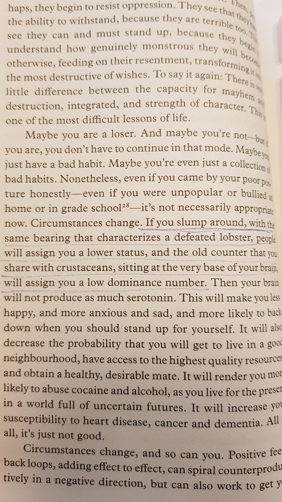

# Foreword (vii-xxvii)

- Question: Why even expect more rules in our lives anyways, while it seems pretty clear that people don't like rules? (vii)

- Answer: 
  
  > But the story of the golden calf also reminds us that without rules we _quickly become slaves to our passions - and there's nothing freeing about that._ (viii)

Most people don't like rules. But they live in a chaos, and they don't like themselves being in a chaos too. That's the reason they would need a set of rules to live against.

Short introduction to Jordan as an 'erudite', 'practical', renowned, and knowledgeable person. (~xiv)

Jordan's first book _Maps of Meaning_ explains why and how we do things that we do today, to deal with uncertainty and the unavoidable unknown. It contains somewhat more complex concepts, which _12 Rules of Life_ actually based upon. (~xv)

Young people actually have an hunger for rules. They've been taught two contradicting ideas at schools, which left them just confused on what's right or wrong (xx). One major school of thought is that "morality is relative, at best a personal 'value judgement'." There is no absolute right or wrong in anything. Even more extreme: postmodernist left's argument that a group's morality is nothing but its attempt to exercise power over another group (xxii). Therefore, the best way to live, is to simply tolerate and respect different ways of living a life. But it turns out that **people in moral relativism can't live without a moral compass** (~xxiii).

While modern response to different rules of different societies was relativism, nihilism or ideology, the ancient Greeks endevoured to search for the reasons and ideas intertwined with those rules. Aristotle found one striking similarity across these societies too: while the rules differed, human beings have a tendency to make rules, laws and customs. (~xxv)

> It seems that all human beings are, by some kind of biological endowment, so ineradicably concenred with morality that we create a structure of laws and rules wherever we are. **The idea that human life can be free of moral concerns is a fantasy.** (xxv)

> We are rule generators. And given that we are moral animals, what must be the effectt of our simplistic modern relativism upon us? It means that **we are hobbling ourselves by pretending to be something we are not.** (xxv)

# Overture (xxviii-)

Jordan first started to answer some questions about ilfe on Quora, and started to get some popularity there. In 2013, he started to upload videos of his lectures at university, which got popular too. (~xxx)

Later he was suggested to write a guide on 'how to live well', and the proposal was acceptede by Penguin Random House. (~xxxviii)

The title was picked as so because it's clear that we need rules. We need order. But chaos exists too, which hinder us from being in an order. 

> If we each live properly, we will collectively flourish. (xxxix)

# Rule 1: Stand up straight with your shoulders back (1)

## Lobsters - and territory

Lobsters have a simple nervous systems which could be thoroughly studied by scientists (1). This helps us understand how our brain and behavior function too.

Lobsters want a secure, reliable and sustainable home where prey is abundant. What happens when multiple lobsters want the same space? The same happens for songbirds. (2)

## Birds - and territory

Wrens would warn and fight you when you get into their territory. Both wrens and lobsters are obsessed with status and position.

Also important for chickens too: the location (proximity to prey) of chicken determines its priority in getting the food, thus the survival.

> The wiliest, strongest, healthiest and most fortunate birds occupy prime territory, and defend it. Because of this, they are more likely to attract high-quality mates, and to hatch chcisk who survive and thrive. (4)

A pandemic across birds would kill the least dominant and the most vulnerable birds first. Same for human societies. 

Territorial conflict imposes a problem: how to win or lose without the disagreeing parties incurring too great a cost (because the winner might be hurt even after winning, which means the 3rd bird can come in and take the space). (4)

## Conflict - and territory

A defated wolf shows its subordination to a victor by a specific gesture. Dolphins make certain sounds to reduce conflict between dominant and subordinate group members. Many other animals behave like so. (5)

Lobsters too. They want a safe place to hide. The place may be scarce. When two lobsters competing for the same spot encounter each other, they spout chemicals containing information of size, sex, health, and mood out to each other. (6) If a lobster finds that the opponent is too big, it will just retreat.

Otherwise, lobsters will try to flip the other on its back. Once they do it, the flipped one will generally give up and leave. 

Otherwise, they will physically fight. Typically, they will have a winner here. The once dominant brain will phyiscally replace itself with a subordinate brain. (8)

Victors will have high serotonin and low octopamine, and losers the reverse. (8-9)

> (Winner lobster) ... is a coky, strutting sort of shellfish, much less liekly to back down when challenged. ... (the loser lobster is) ... a defeated-looking, scrunched-up, inhibited, drooping, skulking sort of lobster, very likely to hang around street corners ... (8-9)

## The principle of unequal distribution (9)

The defeated lobster is more likely to lose in the next fight. The winning lobster, the reverse. Similarly: 

- majority of scientific papers are published by a small % of scientists
- majority of commercial music is composed by a small % of musicians
- 500 books sell more than 100,000 books in the US.
- Four classical composers wrote almost all the music played by modern ochestras.

This is known as Price's law. Anyways, nature has produced a very simple and efficient mechanism for a hierarchy of lobsters. The winner takes it all, the loser can't get anything. (10-11)

## All the girls (11)

Female lobsters naturally get attracted to dominant (winning) lobsters (the most efficient, correct way to identify the best man)

The dominant lobster gets all the girls too.

The dominance hierarchy of lobsters exhibit the same features as the environment to which all complex life has adapted. **Lobsters have existed from a really long time ago only with a very simple nervous system, but they still had a mechanism to think about status and society** (13).

## The nature of nature (13)

Nature is not a simple thing.

- It is dynamic: as the environment changes, the faetures that make a given individual successful in surviving and reproducing also transform and change. So natural selection is not "creatures matching themselves ever more precisely to a template specified by the world", but a very interactive process between the nature and the world.
- It is static: some things change less quickly. "Leaves change more quickly than trees, and trees more quickly than forests." (15)

There exists an ancient and fundamental part in our brain that keeps track of our position in the dominance hierarchy: the reason we act like lobsters when we are defeated. Weak people exhibit low levels of serotoin, thus much of stress and vulnerability to illness, death and depression. (18)

## Top and Bottom (18)

If you are at the top, you get all of the best parts: good counterpart, health, opportunities, ... If you are at the botttom, you don't get anything. Terrible food, nowhere to live, poor mental and physical conditions, etc. We are not talking about possessing money here; it's just about a general human life (18-19)

'The ancient part of the brain' will watch how other people treat you. If they treat you badly, it will incur low serotonin level. This process burns up a lot of energy. It's called **stress**. (19)

> This response is really what everyone calls stress, and it is by no means only or even primarily psychological. It 's a reflection of the genuine constraints of unfortunate circumstances. (19)

If you are already stressed, even the smallest external stimuli will cause chains of negative reactions in your mental and physical state, making you de-energized, impulsive, etc.

If you are at the top (not stressed), you already know you are safe and all good, so chances of you being damanged from a threat is substantially low. **The result is that you still stay clam, tall, straight, and confident**. (20)

## Malfunction (20)

#### Sleeping and eating

Inconsistent patterns of sleeping and eating can cause a stress too. The body needs to "function like a well-rehearsed orchestra"

**Your sleeping and eating schedule need to be consistent in order to keep you out of chaos!** 

> It is for such reasons that I always ask my clinical clients first about sleep. ... If the answer is no, fixing thatt is the first thing I recommend.
> 
> The next thing I ask about is breakfast. ... eat a fat and protein-heavy breakfastt as soon as possible after they are awaken.

Having a fat, protein-heavy breakfast ASAP will prevent you from having a high insulin level that will make you psychologically unstable. (20-21)

#### Complex positive feedback loop

1. You feel vulnerable
2. You do something bad in order to fix that
3. You feel better
4. Some time later, you feel vulnerable because of something bad you did in order to fix it
5. Then you do something bad again
6. And so on.

Example: **alcohol addiction**. A person drinks an alcohol. Makes him happy. When he stops drinking, he will feed bad due to metabolization and secretion of toxins. To remove that bad feeling, he will just resume drinking. After that, the hungover goes on again, and then it can be temporarily handled with a few more drinks. It will go on and on.

Another example: agoraphobia or experience of being bullied. Just functions in the same mechanism as alcohol addiction.

**Continuation of these bad habits or psychological state will only lead to itself again!** (-26)

## Rising Up

Stop being in a defeated posture (30)

> Maybe you are a loser. And maybe you are not - but if you are, you don't have to continue in that mode. Maybe you just have a bad habit. Maybe you're even just a collection of bnad habits. Nonetheless, even if you came by your poor posture honestly - even if you were unpopular or bullied at home or in grade school - it's not necessarily appropriate now. Circumstances change. **If you slump around, with the same bearing that characterizes a defeated lobster, people will assign you are lower status, and the old counter that you share with crustaceans, sitting at the very base of your brain, will assign you a low dominance number.** (30)

Standing up straight with shoulders back has not only physical but also psychological implications.

> Circumstances change, and so can you.  ... if you present yourself as defeated, then people will react to you as if you are losing. If you start to straighten up, then people will look at and treat you differently. ... But **standing up straight with your shoulders back is not something that is only phyiscal, because you;re not only a body. You're a spirit, so to speak - a psyche - as well.**  (31)

Life is terrible, but standing up straight with shoulders back means confidently accepting that and trying to improve it.

> To stand up ... is to accept the terrible responsibility of life, ... means deciding to boluntarily transform the chaos of potential into the realities of habitable order. ... means adopting the burden of self-conscious vulnerability, .... 
> 
> **So, attend carefully to your posture. Quit drooping and hunching around.** (32)

Then, people will start to perceive you as a dominant being. Why not try it first and see how it goes before even going into defeated mode? (33)

# Treat yourself like someone you are responsible for helping (35)

## Why won't you just take your damn pills? (35)

- people tend to miss out on taking the pills for various reasons, both unintendedly and intendedly. (35)

- even some people going on a kidney transplantation surgery - they won't be able to go on with the best surgery if they just don't take their pills. But why? (36)

- when it comes to giving pills to the pets, people tend to do it much better. You will actually do your best to get them pills. 
  
  > In fact, on average, you care more. People are better at filling and properly administering prescription medication to their pets than to themselves. (37)

- But why?

## The Oldest Story and the Nature of the World (38)

- Two stories of creation are introduced in Genesis (38):
  
  - The 'Priestly' version:
    
    - God created the world with his speech.
  
  - The 'Jawhist' version 

- In the modern world, we base our thoughts on scientific truths quite naturally, but that is absolutely not the case in the past (38)
  
  > Being was understood as **a place of action**, not a place of things. It was understood as something more akin to story or drama (39)
  
  - subjective experience can be related more to a novel or a movie than to a science. (39)

## The Domain, Not of Matter, but of What Matters (40)

- The scientific world of matter can be reduced to some fundamental concepts (40)

- The world of experience can be too, to **chaos, order, and consciousness**. (40)
  
  - chaos and order cause us to doubt the validity of existence, but consciousness leads to "the real way out".

Chaos (40)

- is..
  
  > The foreginer, the tranger, the member of another gang, ... the monster under the bed, the hidden anger of your mother, and the sickness of your child. ... the despair and horror you feel .. where we are when we don't know where we are, and what we are doing when we don't know what we are doing.

- is **all those things and situations we neither know nor understand.**

Order (41)

- is:
  
  > explored territory. position and authority. structure of society. tribe, religion, hearth, home and country. the value of the currency. plan for the day. politeness. ...

- **where everything is certain.**

- Where there is an order, there is chaos. (43)

- Our brains are wired to repond instantly to chaos. (43)

## Chaos and Order: Persnoality, Female and Male

- So far, it's been explained why **chaos and order** are two most fundamental elements of lived experience (Being). Chaos and order are perceived as **personalities** as well. (43-44)

- Perception of things as entities with personality occurs before perception of things as things. This works the same for order and chaos. They are personified first, and then perceived as things and objects. (44)

- Therefore, the most significant elements of our environment of origin were peronsalities, not things, objects or situations. (44)

- The personalities majorly have been split into **male** and **female** for a billion years, since when there has been separate sexes (44).

- Naturally, the category of **parent** and **child** has existed for a long time too, unavoidably deeply embedded into our psychology (44)

- We are social and we care about other creatures, which can be translated as environment. (45)

- Our brain also has a capacity to have knowledge about the nature of the world, or the objective world. We grew to **deal with** what's **outside** of what we currently understand. (45)

- When we first started doing this, we used categories representing pre-human animal social world, which is even older than our species. It can be said that the most basic category is the sex: **male** and **female**.
  
  > We appear to hhave taken that primordial knowledge of structured, creative opposition (male and female) and begun to interpret everything through its lens (46)

### Order (46)

- is: masculinity, yang of the Taoist yin-yang symbol, men throughout history have been the builders of towns and cities, engineers, stonemasons, bricklayers ..., God the Father, ledgerkeeper, policemen and soldiders, ...

### Chaos (46)

- is: feminine. possibility, the source of ideas, mysterious realm of gestation and birth. the darkness of a cave and the accident by the side of the road. it's the mother grizzly that tears you to pieces. crushing force of sexual selection. 

### Duality of masculinity and feminity (47-)

- Many religious symbols share masculinity and feminity at the same time:
  
  - The Star of David
  
  - the yoni and lingam of Hinduism
  
  - Fuxi and Nuwa in China
  
  - the Virgin Mary with the Christ Child
  
  - androgyny of Christ

- The structure of the brain also reflects this duality (48): 
  
  > the hemispheric structure of the cortex reflects the fundamental division between novelty (the unknown, or chaos) and routinization (the known, order)

- We all know this, but we don't know we know it. **We eternally inhabit order, surroundded by chaos.** (49) (This sentence is what really sums up the last few pages)

- Chaos and order is anywhere in our lives, and the balance between chaos and order is crucial. Being inclined on either side too much may cause a problem. Neither shouldn't exist too. The same applies for other living things (50-51)

## The Garden of Edens (51)

- As previously mentioned, Genesis was combined from multiple sources:
  
  - Chapter 1: 'Priestly' story (refer back to 38)
    
    - Naturally connects to Chapter 2, suggesting someone or some people carefully attached these two stories together
  
  - Chapter 2: 'Jahwist' story (52)
    
    - Uses the name YHWH (Jahweh) to describe God
    
    - Contains the story of Adam and Eve
    
    - Adam was instructed not to touch or eat the Tree of the Knowledge of Good and Evil, but he did
    
    - Adam and Eve were not self-conscious: they were naked but not ashamed.

- Chapter 3 has a serpent appearing. While **God only knows why it's inside the garden**,**the serpent appears to play the role of chaos, and the paradise that of order.** (53)

- Where there is an order, there has to be a chaos, _because nothing can be completely walled off from the rest of reality._

# Reflections

## Freedom

> But the story of the golden calf also reminds us that without rules we _quickly become slaves to our passions - and there's nothing freeing about that._ (viii)

This is the exact same thing the book _Atomic Habits_ suggests. If you make a habit (or in the context of this book, a _rule_ in your life), it is rather going to free you. For example, if you make a habit to save money, it will going to give you more freedom in buying stuffs later when you need them, while on the surface it might seem like that habit is restricting you from buying anything.
