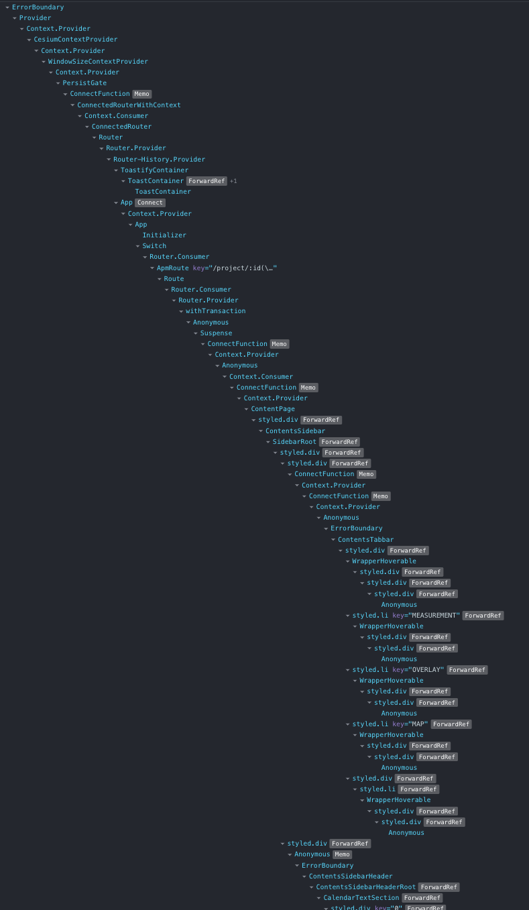
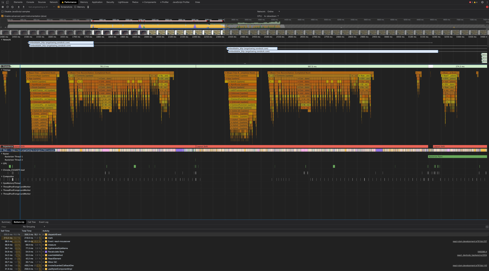
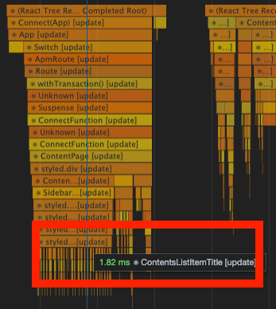
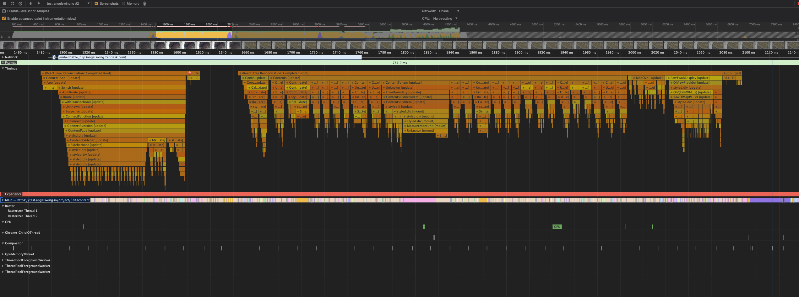
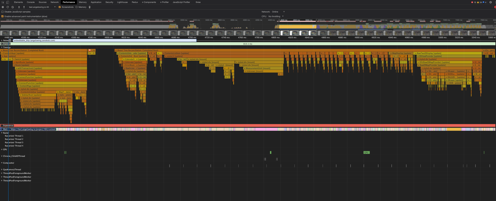

_If you are new and are looking for basic prevention of re-render due to changes of `props`, please take a look at the previous article: [Making Stupid React Smart in Re-rendering](https://medium.com/swlh/making-stupid-react-smart-in-re-rendering-5f04b5bab327)_.

# Defining the problem

When the component trees are shallow and the architecture of your React project is simple, there are hardly any problems. The real problem comes when you have hundreds of nested components like this:

Then you would have to start thinking about optimizing re-renders, because re-renders are costly if you have many costly logics that need to be calculated over and over.

Problems with re-render due to a change detected in `props` could be easily resolved by using some simple methods as covered in the previous article: [Making Stupid React Smart in Re-rendering](https://medium.com/swlh/making-stupid-react-smart-in-re-rendering-5f04b5bab327). But what makes using global state such as Redux so different from simple prop changes that incur re-renders?

# Illustration of the problem

Here's the disaster caused from a single click from our real web application.

## Finding which part is slow
### Prerequisites
- Go to `performance` tab, and select any of 2x, 4x or 6x slowdown from `CPU` tab to make performance issue even more palpable in Chrome developer tools.
  
- Install [React devtools](https://chrome.google.com/webstore/detail/react-developer-tools/fmkadmapgofadopljbjfkapdkoienihi?hl=en)
- Disable all Chrome extensions except React Devtools
  

### Tackling the first big render tree

It was full of useless updates of Components called `ContentsListItemTitle`. 

Before

After applying some basic tatics
- useCallback
- useMemo
- memo
- useSelector

;

<!-- 1. Use `useSelector` in a better way
2. Batch multiple actions into one action that triggers one update -->

<!-- ## Making the slow part fast: React-wise -->
