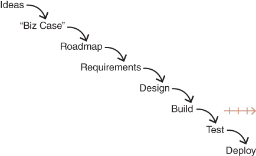

# Part I: Lessons from top tech companies

The author and his team at Hewlett Packard created a state-of-art AI product at a very high price in 1980. Everything went well, except the fact that _no one bought it_.

> Just one problem: No one bought it (2)

## Chapter 1: behind every good product

- Behind every good product, usually there's someone working tirelessly. (6)
- This book is written for **a product manager**.
- Lots of work for a PM.

## Chapter 2: Technology-powered products and services

- This book is exclusively for **products powered by tech**, such as:
    - e-commerce sites
    - social media
    - business sites
    - mobile apps
    - etc

## Chapter 3: Getting to product/market fit

Three stages of companies (9):
1. startup
    - yet to achieve product/market fit
    - less than 25 engineers
    - PM role is covered by one of the co-founders
    - nothing else matters until you find a product that fits the market
    - stressful, exhausting, risky, but may be positive and rewarding too (10)
2. growth-stage company
3. enterprise company

## Chapter 4: Growth-stage companies: scaling to success

- growth-stage companies share one big concern: **how to effectively grow and scale**. (11)
- 25 to several hundred engineers

Common problems:
- product team complains they don't understand the big picture
- some early methods that led to success are not valid anymore (12)
- technical debt (12)

## Chapter 5: Enterprise companies: consistent product innovation

Common problems (13):
- consistent product innovation
- original vision is achieved, and next vision is obscure
- frustrated leadership with not-innovating product teams

## Chapter 6: The root causes of failed product efforts

Idea to roadmap, roadmap to requirements, ... to developing, developing ... to deployment. _**Most companies do it this way.**_

This is _waterfall._ (17)

> While almost everyone today claims to be Agile, what I've just described is very much a waterfall process. (17)

### Details of the problems (17~21)

1. **Idea**: Sales-driven, stakeholder-driven products. This is often not the best way to pick up on the best idea.
2. **Biz case**: We _can't know_ how much money will be earned and spent at the 'biz case' stage. _Knowing what we can't know_ is important.
3. **Product roadmaps**. It's got an underlying problem: _two inconvenient truths about product_.
    - **Half of our ideas are just not going to work**. There is a rare chance customers will keep using the product.
    - **It's going to take a long time and several interations** to deliever necessary business value even if the idea works.
4. **Project management**: Gathering requirements and documenting them for engineers is more of project management instead of modern product management.
5. **Design**: It's too **late** in the game to get the real value of design where every requirement is already set. "Lipstick on the pig" model.
6. **Engineering**: gets in way too **late** too.
7. **Agile**: Principles and key benefits of Agile enter the picture far too late
8. The entire process is project-centric.
9. **Customer validation**: happens way too late.
10. **Huge waste of money and time** being inefficient in the entire process.

## Chapter 7: beyond lean and agile

> The best product teams often leverage **core principles of Lean and Agile**, but raising the bar on what they're trying to achieve and how they work. (24)

Three major points on best product team:
1. **Risks are tackled up front**, rather than at the end.
2. **Collaboration**: Products are defined and design collaboratively, rather than sequentially.
3. **Solving problems**: It's all about solving problems, not implementing features.

## Chapter 8: Key concepts

_Product_ in this book is defined holistically. (25) It's something that includes all of these:
- functions (features)
- tech
- UX design
- monetization
- user and customer acquisition
- offline experiences

Example: everything eccept the actual merchandise being sold, for an e-commerce site

### Continuous discovery and delivery

Two essential high-level activities in all product teams (26~):
1. Discover the product to be built
2. Deliever that product to the market

### Product discovery (27)
1. Will the user buy/use this?
2. Can the user figure out how to use this?
3. Can our engineers build this?
4. Can our stakeholders support this?

### Prototypes (~28)

- Test many product ideas each week on the order of 10 or 20 per week.
- Meant to be fast and cheap

### Product delivery (28)
Includes:
- scale
- performance
- reliability
- fault tolerance
- security
- privacy
- i18n
- l10n

### Products and product/market fit (28)

### Product vision (29)

long-term objective of the product, for 2-10 years ahead

### MVP

- Lots of confusions still exist for the term _MVP_. (29)
- **MVP should never be an actual product**: something developers can release with confidence, that your customers can run their business on, ...
- **MVP should be a prototype.** (30)

# Part II: The right people (31)

## Chapter 9: Principles of strong product teams

1. Team of missionaries: true believers in the vision, committed to solving problems for the customers.
2. Team composition: 10-12 engineers / 1 product manager. 
3. Team empowerment and accountability: solve hard problems.
4. Team size: practical upper bound is 8-12 engineers (two-pizza rule)
5. Team reporting structure: usually report to functional manager (designer to head of design, product manager to head of product)
6. Team collaboration: product, design, and engineering should work out together.
7. Team location: remote works too, but **co-location** is almost always better. Just being together helps. Random chitchats, having lunch together and all that.
8. Team scope: how do we devide teams if we have many people? Each team may focus on: 
    - different type of user
    - different type of device
    - different workflows or customer journey
9. Team duration: Keep teams together and stable. It always takes someone a time to gain enough expertise in an area to innovate.
10. Team autonomy: we need to give them significant level of autonomy to let them empowered to solve problems.

> They are able to try to solve the problems they are assigned in tne best way they see fit.

### Why it works

You basically have to be able to taste the deepest part of the problem and context that customers are facing. This is so far the best way known to do that. (39)

### Principles and techniques

PM has to know what works too, but equally importantly, _why._ (39)

## Chapter 10: The product manager (41)

Three ways PM could work, but only one works:
1. The PM can escalate every issue and decision up to the CEO
2. The PM can call a meeting with all the stakeholders in the rom and then let them fight it out
3. **The PM can do his or her job**

This book tries to convince the third way of working.

> The honest truth is that the PM needs to be among the strongest talent in the company. (42)

Many companies disregard the importance of a PM. This book is telling you: _please don't._ (42)

### Key responsibilities

1. **Evaluating opportunities and determining backlog** (what needs to get built) and delivered to customers
2. Show evidence that what engineers and designers are asked to build is worth building.
3. Manage the product team, whose members build the product for customers.

> When a product succeeds, it's because everyone on the team did what they needed to do. But when a product fails, it's the product manager's fault. (43)

### Deep knowledge of the customer

A PM should know customers' issues, pains, desires, how they think, ... and how product works (43-44)

### Deep knowledge of the data

Should be comfortable with sales and usage analytics

### Deep knowledge of your business

- Understand your business and how it works, and the role your product plays in your business. (44)
- Understand various stakeholders and constraints (45)

### Deep knowledge of your market and industry

- Understand key trends, customer behaivor, expectations, ...
- Understand competitive landscape so that customers may be lured to switch over to your product (45)
- Love technology and tech-powered products.
- Not afraid to learn new tech and constantly changing market

> To summarize, deep knowledge 1. of your customer 2. of the data 3. of the business and its stakeholders 4. your market and industry

### Smart, creative, consistent

These are traits of a successful PM.

1. Smart: intellectually curious, quickly learning, and applying new tech to solve problems
2. Creative: thinking outside of the normal boundary
3. Persistent: constantly pushing the product beyond boundary (47)

> PM is not a 9-to-5 job. ... there is a ton of work, and it follows you home every night. Pretty much any other role on a product team is better if ... work-life balance. (47)

### PM profiles (48~)

1. **Product management is absolutely distinct from other disciplines**: it's not a project manager; it's not a designer. It's closer to CEO, but PM is not the boss of anyone. 
2. **Like a CEO, the PM must deeply understand all aspects of the business**: just all of the context, from the beginning to the end.
3. **In every one of these examples, the winning solutions didn't come from users, customers, or sales**: great product comes from great collaboration between design and engineering to solve real problems (49)
4. **True leadership is a big part of what separates the great product people from the merely good ones** (50)

### PM vs PO

# Reflections and applications

## Team duration (38)

## Team autonomy (38)
I think this is one of the most difficult toics to handle and apply to the real world setting. 

## Deep knowledge of the data (44)

I should say I'm weak in data analytics. Perhaps I can do enough for excel or python, and at the same time I learn fast; but I never applied my skills for practical stuffs.

If I want to be a PM at any point in the future, I should really take some introductory courses online.

## The dream team

Everyone's sharing most traits of PM

## The PM should understand all aspects of the business (49)
- This concept just did not directly come into my mind, probably because in my current company the business team is separate from the product team (although this never means that they have no reason to collaborate)
