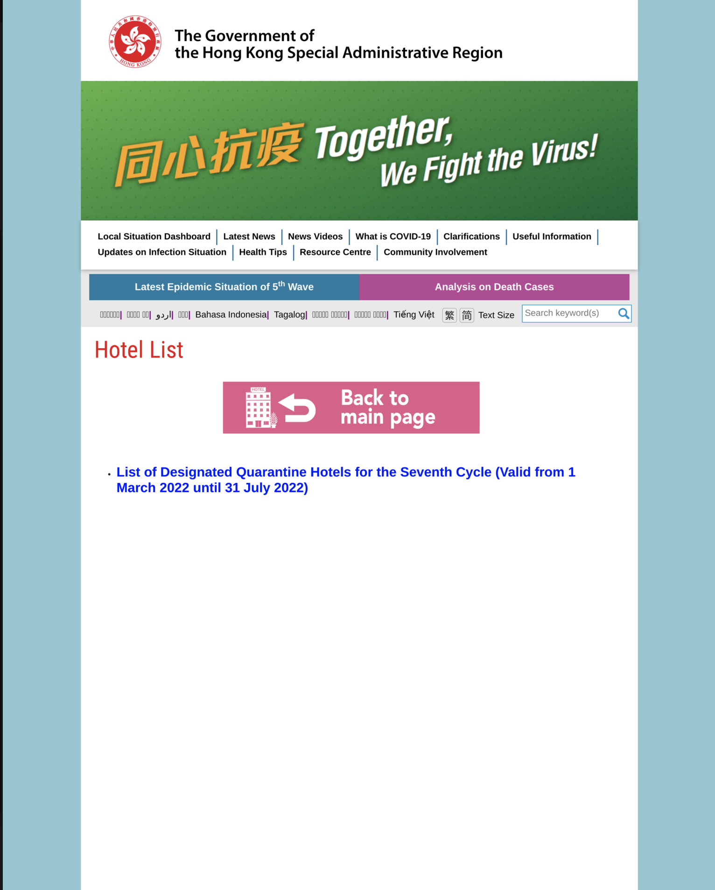
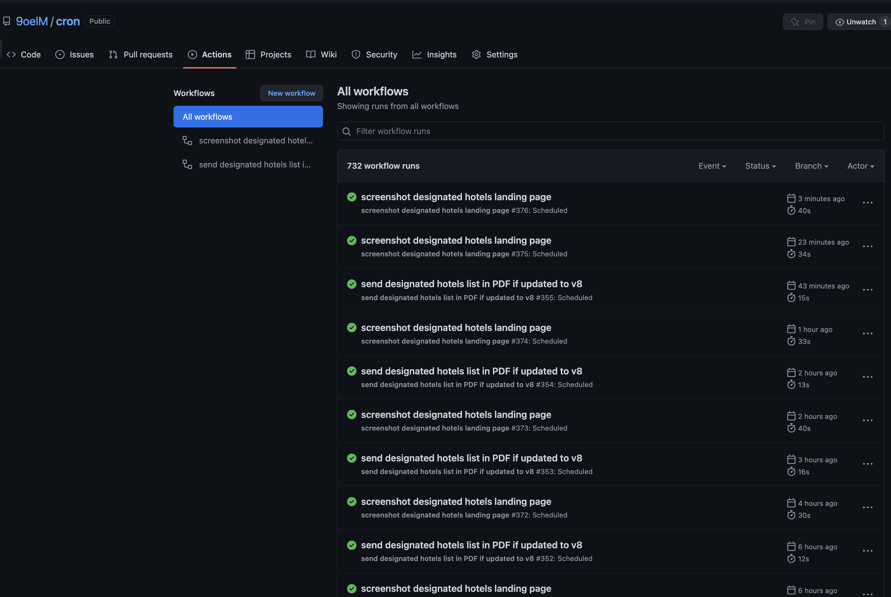
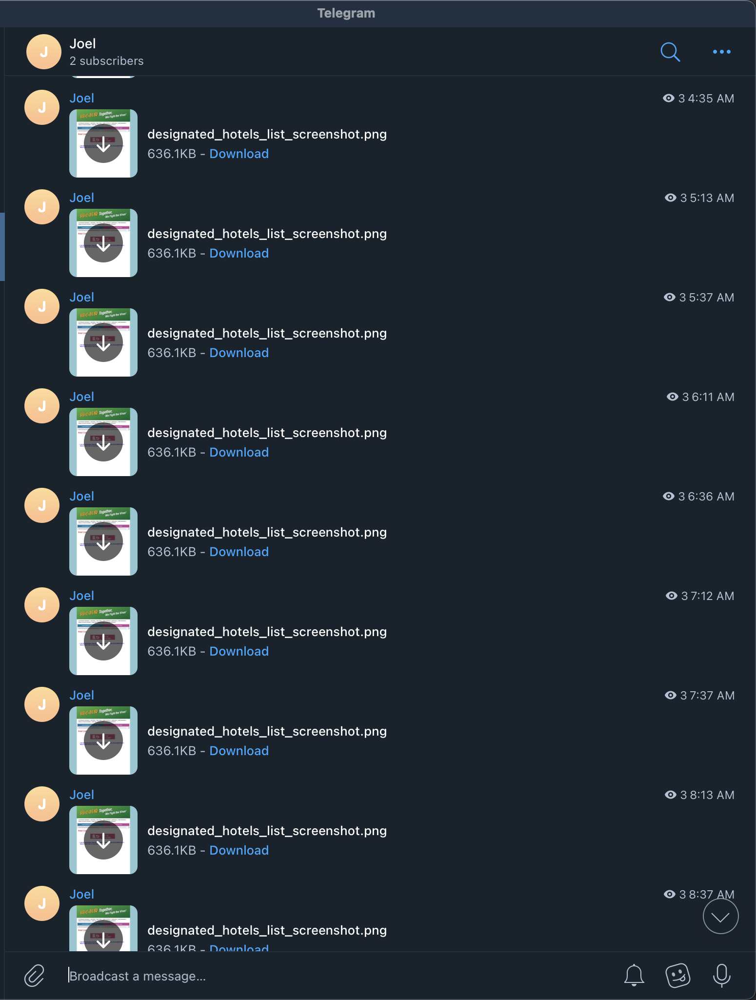
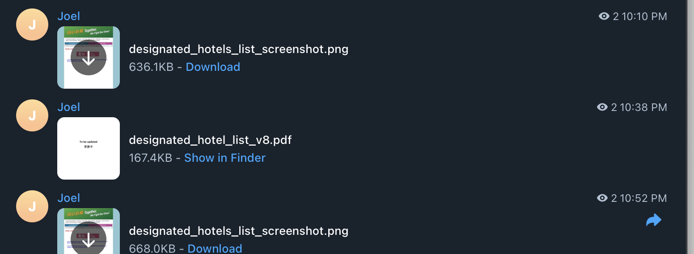
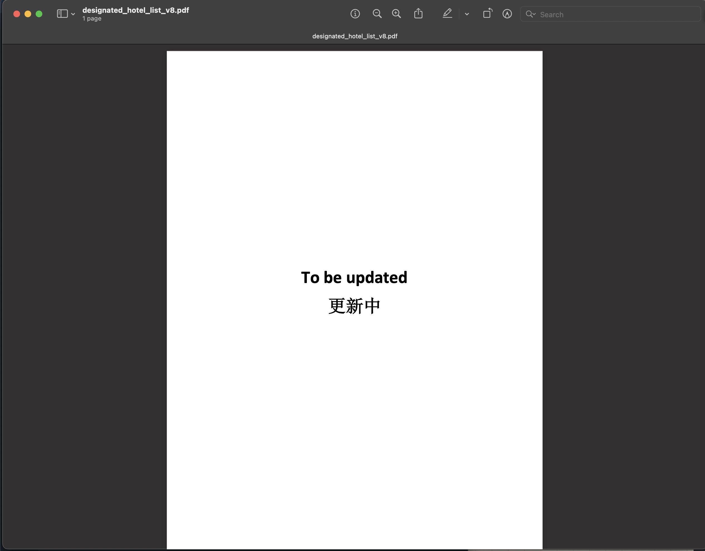
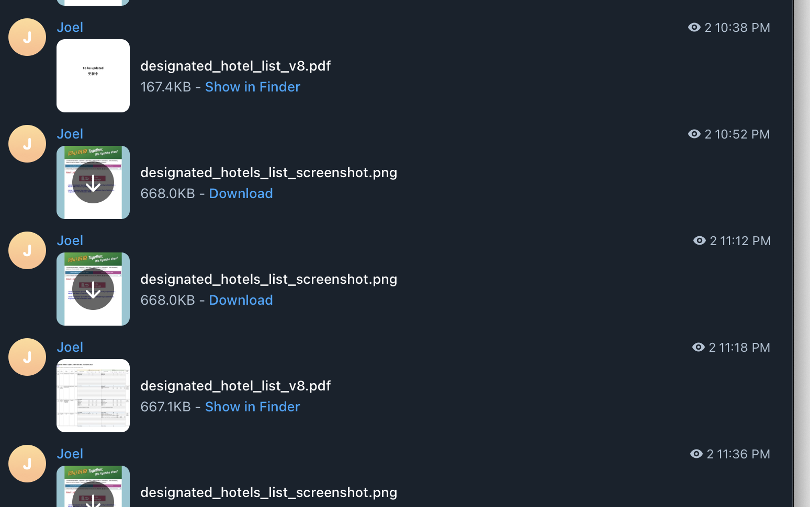
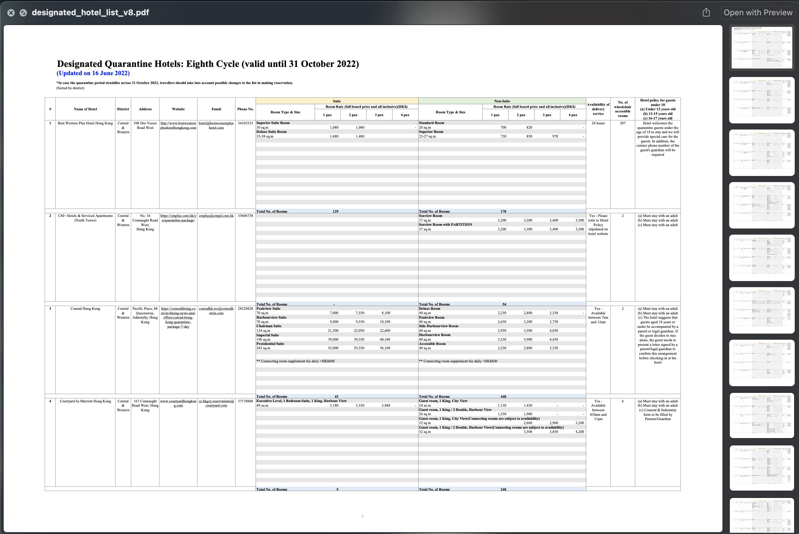

This is a brief story of how I chose the best hotel for quarantine upon arrival in Hong Kong I could possibly choose using Github actions and Telegram bot (LOL).

## Current affairs

### I am going back
As the heading reads. I am going back to Hong Kong from S.Korea for real, at least for now. It is bound to happen in this August. Finally. But I had to manage to work out the details for quarantine by myself.

### 7-day Quarantine in Hong Kong
Hong Kong government is still pushing hard on its 7-day quarantine rule for most inbound travellers with a few exceptions that obviously don't count me in. It was the '7th cycle' of the quarantine policy, as they'd like to put it - and [there was a specific list of hotels in that cycle](https://www.coronavirus.gov.hk/eng/designated-hotel-list.html):



### Nobody knows about the details of the '8th cycle'

The problem was, nobody - like nobody at all - could guarantee if the hotels in the 7th cycle were going to be designated again in the next (8th) cycle. I had to know this because, again, I am going back in August, and the 8th cycle would start from August 1. So if I were to choose a hotel that wasn't going to be included in the 8th cycle, I'd be doomed and I need to make a reservation for another hotel, which wouldn't be easy because all inbound travellers to Hong Kong are in eager eyes trying to catch a good spot in a decent hotel (even now most hotels are fully booked already in August). I phoned the hotels before the 8th cycle came up (I will talk about that more later) and all receptions told me that even they don't know if they were going to be quarantine designated hotels in the next cycle.

And what's really frustrating also was that even **the date of announcement of the list of hotels in the 8th cycle was unknown**. And it has always been that way since the 'first cycle', judging from the government announcements in the past. Here's a brief table of when they announced the list of hotels for the upcoming cycle (Now that the Hong Kong government announced the 8th cycle just yesterday (June 16, 2022), I included that too in the top. But I did not know it until yesterday obviously):

|   | Duration of the 'current' cycle | Duration of upcoming cycle | Date on which the list of hotels for the upcoming cycle was announced | `Days(Date(First day of the upcoming cycle) - Date(the list of hotels for the upcoming cycle was announced))`  |
|---|---------------------------------|----------------------------|-------------------------------------------------------------------|---|
|   |  1 March 2022 - 31 July 2022 (7th)     |  1 August 2022 - 31 October 2022 (8th) | 16 June 2022                            |  46 days |
|   |  1 December 2021 - 28 February 2022 (6th)       |   1 March 2022 - 31 July 2022 (7th)     | 31 December 2021           | 60 days |
|   |   1 September 2021 - 30 November 2021 (5th)   |  1 December 2021 - 28 February 2022 (6th)  |          19 October 2021  | 43 days |
|   |   20 June 2021 - 31 August 2021 (4th)  |   1 September 2021 - 30 November 2021 (5th)  |   30 July 2021  | 33 days  |

Historically, HK government announced the list of hotels in the next cycle before one to two months. And it was late May/very early June when I was trying to find a hotel.. so I expected the list of the hotels for the 8th cycle to be announced quite soon (which turned out to happen about a fortnight later).

### I booked one anyway

So without being able to make a certain _and_ great choice , I was looking for a hotel to be quarantined at a few weeks ago, and I found and booked one, but there were a few problems that bothered me so much:
- This hotel is obviously not the best (Google Review 3.8, 4 stars), but other hotels were quite occupied already. I spent hours trying to look for a better one but could not find one.
- Even the employees at this hotel do not know if the hotel would be joining the list of quarantine designated hotels for the next cycle. If it turns out it's not, then I would need to book another hotel.

So that apparently wasn't the end of the story. I had to do something. Because there were many global competitors travelling to Hong Kong, I wanted to be the first person in the world to know about the list of hotels in the 8th cycle when Hong Kong government would announce it (which was yesterday, June 16) and choose another hotel if needed, cancelling the one I booked originally.

## Cron in Github actions + Telegram bot to the rescue

So I decided to monitor [the website](https://www.coronavirus.gov.hk/eng/designated-hotel-list.html) using Github actions and Telegram. The workflows were simple. There were two:
- `screenshot_designated_hotels_landing_page.yml`: just sends a screenshot of https://www.coronavirus.gov.hk/eng/designated-hotel-list.html to me via Telegram so that I can check as soon as there's an additional remark about the eighth cycle.
- `send_designated_hotels_list_pdf.yml`: sends a PDF of the list of designated hotels in the 8th cycle if it is available.

It's really simple - just a few lines of codes in Github workflow files:

`screenshot_designated_hotels_landing_page.yml`:
```yml
name: screenshot designated hotels landing page
on:
  schedule:
    - cron: '*/30 * * * *'
  workflow_dispatch:

jobs:
  check_designated_hotel_screenshot:
    runs-on: ubuntu-latest
    steps:
      - name: send screenshot of https://www.coronavirus.gov.hk/eng/designated-hotel-list.html
        env:
          BOT_TOKEN: ${{ secrets.BOT_TOKEN }}
          CHAT_ID: ${{ secrets.CHAT_ID }}
        run: |
          npm install --global capture-website-cli
          capture-website "https://www.coronavirus.gov.hk/eng/designated-hotel-list.html" --output=designated_hotels_list_screenshot.png --height=1600
          curl -F document=@designated_hotels_list_screenshot.png "https://api.telegram.org/bot${BOT_TOKEN}/sendDocument?chat_id=${CHAT_ID}"
```

`send_designated_hotels_list_pdf.yml`:
```yml
name: send designated hotels list in PDF if updated to v8
on:
  schedule:
    - cron: '*/30 * * * *'
  workflow_dispatch:

jobs:
  check_designated_hotel_updates:
    runs-on: ubuntu-latest
    steps:
      - name: Check if there's an update and send message if there is 
        env:
          BOT_TOKEN: ${{ secrets.BOT_TOKEN }}
          CHAT_ID: ${{ secrets.CHAT_ID }}
        run: |
          status_code=$(curl -s -o designated_hotel_list_v8.pdf -w "%{http_code}" https://www.coronavirus.gov.hk/pdf/designated-hotel-list-v8_en.pdf)
          if [[ "$status_code" != "404" ]]; then
            curl -F document=@designated_hotel_list_v8.pdf "https://api.telegram.org/bot${BOT_TOKEN}/sendDocument?chat_id=${CHAT_ID}"
          fi
```

First, I didn't want to spend a lot on this because by doing this I felt like I was already commiting some of my time to these workflow files, while I got many other things to do. So there's no fancy database, no pixel-by-pixel comparison with the previous image - anything like that. no. Just wanted to keep it as simple as possible. And then I initially wanted to run the cron job like every 5 minutes, so that I would immediately know if there's a change from the website.

But then I found that a consistent cron behavior is not possible at all for Github actions, probably due to heavy loads of actions from numerous users every day. Here's a related info: https://upptime.js.org/blog/2021/01/22/github-actions-schedule-not-working/. I honestly did not expect Github to have such an issue just because it's Github. It's not a little company.. but it has that issue anyway - still pretty much ongoing, and unlikely to be solved in the near future. 

So what happened when I set the cron schedule to `'*/5 * * * *'` was that it just didn't run at all. So I changed it to `*/30` and it started to work reasonably, and getting an update every 30-ish minutes was still OK.

So then, [after implementing this on my Github repo](https://github.com/9oelm/cron), my Github workflows would run periodically like this



and I would get such messages in my private channel on Telegram:



Notice that the time interval between messages is not even. Sometimes it's 20 mins, sometimes it's 40, 30... but whatever. It works and just does the job.

And finally, after long boring time of just checking the same images over and over - I finally noticed some noticeable development in my messages from yesterday night. First of all, my second workflow was designed to send [PDF](https://www.coronavirus.gov.hk/pdf/designated-hotel-list-v8_en.pdf) only if the URL does not return 404. And so I wasn't getting any PDF files through Telegram as long as the HK government hadn't uploaded the file yet. I knew, though, that it was going to be this exact url: https://www.coronavirus.gov.hk/pdf/designated-hotel-list-v8_en.pdf because previous files exhibited the same pattern of just appending the version (cycle) number and language at the end of the pdf file. That's why I kept sending the request for that file. 

Finally, my Telegram bot sent my first `designated_hotel_list_v8.pdf` to me at 10:38PM on June 16, 2022, KST.  


But it wasn't quite the file I was expecting:


But at the same time, it was something. It wasn't the 404 I was getting anymore. It was the big fat 200 I longed for. The time was coming. And guess what, the next message would contain the actual PDF. That was 11:18PM on June 16, 2022, KST.





So I looked at the list of hotels, found that the hotel I booked a room from is still in the list, and also that the list didn't change almost at all from the previous cycle, which kind of made me disappointed because I was thinking of all the effort put into this little Telegram bot.

But remember I wasn't satisfied with the hotel I booked and I didn't even go to yet. So now that I had a clear, _deterministic_ list of the hotels that have the quarantine package in August, I searched through the ones that might still have any vacancies and eventually picked one of them that looked decent (at least better than the last one) and made a reservation right away. It was STILL HARD though - many hotels were already fully booked, although people didn't even know if the hotel they chose was going to support quarantine package for sure. Anyway, the hotel I newly booked now stands on an average score of 4.2 in Google reviews, and especially recent ones were quite nicely wrote. I liked this one better.

And so that's how I became the first person in the world to know about the list of hotels in the eighth cycle in Hong Kong (probably).

Moral of the story: even little automation helps.

See y'all in Hong Kong.
