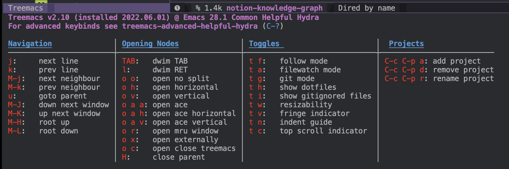

## Prerequisites

This post assumes that you already have https://github.com/syl20bnr/spacemacs installed into your emacs.

### Terminologies

| Character                      | Key   |
|------------------------------|-------|
| M | Alt |
| C | Control |
| SPC | Space |
| s | Command |

## Essential commands

### Essential of essentials

| Command                      | Key   |
|------------------------------|-------|
| Open Spacemacs command panel (`M-m` or `SPC`: [what the heck is it?](https://github.com/syl20bnr/spacemacs/issues/5283)) | `Alt+m` or `SPACE` |
| Show keybindings | `SPC ?` |
| Closed automatically opened windows (like update debugger) | focus on it and `q` |
| Close bottom command panel | `C-x 1` |
| Open terminal | `C-x 1` |
| Show all emacs commands and search in plain string | `M-x [search keyword]` |
| Launch shell in emacs | `M-x shell` |
| Run a shell command | `M-x ! [my shell command]` |
| Abort whatever command you have been writing | `C-g` |
| Open .spacemacs config file |  `SPACE f e d`  |
| Open current projectile buffers or files | `SPC p h` |

### Make a directory a project

Just create a `.projectile` (empty) file in a directory.

### Essentials

| Command                      | Key   |
|------------------------------|-------|
|  |  |

### `treemacs`

| Command                      | Key   |
|------------------------------|-------|
| open(toggle) treemacs (browse and open directory in Emacs) | `SPC f t`   |
| `treemacs-advanced-helpful-hydra` (show `treemacs` help) |  `SPC f t ?`     |
| Go up a directory in Helm find files | `C h`  |
| Autocomplete in Helm find files |  `TAB`  |
| Go up/down in Helm find files |  `C j / C k`  |
| Save current file |  `SPC f s`  |
| Create new file |  `SPC f f and then type in new file path`  |
| Switch between files (buffers) |  `SPC b b`  |
| Go back to previous file (buffer) |  `SPC TAB`  |
| Zoom out from a file |  `C-x C-\-` or `s-\-` |
| Zoom into a file |  `C-x C-\+` or `s-\+` |

## Essential configurations

### Javascript & Typescript autocomplete

### Tabs

