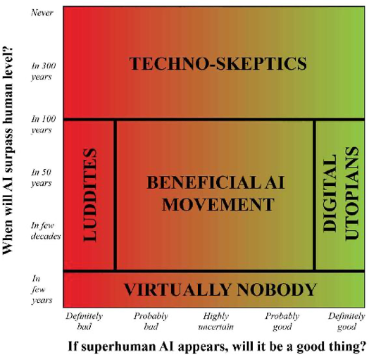

```toc
```

# Chapter 1. Welcome to the Most Important Conversation of Our Time

- Life: "a process that can retain its complexity and replicate"

- Life 1.0, 2.0 and 3.0
  - 1.0 (bio stage): life where both the hardware and software are evolved rather than designed. Example: bacterium
    - an algorithm is hard-coded into the DNA of a bacterium. Takes a long time for natural selection and evolution
  - 2.0 (cultural stage): life whose hardware is evolved, but whose software is largely designed by the life itself. Example: mankind
    - can gradually design the software by learning over time
    - still limited by hardware: can't grow as tall as we want or get a brain as big as we want
  - 3.0 (tech stage): life that dramatically redesigns not only its software, but its hardware as well, rather than having to wait for it to gradually evolve over generations.

- Different schools of thought on when the artificial general intelligence will happen, and whether it will be good
    

- **Digital Utopianism**: 
  - digital life is the natural and desirable next step in the cosmic evolution 
  - if we let digital minds be free rather than try to stop or enslave them, the outcome is almost certain to be good.
  - Life 3.0 is likely to be made possible in this century
- **Techno-skeptics**:
  - building superhuman AGI is so hard that it won’t happen for hundreds of years, and therefore view it as silly to worry about it now.
- **The Beneficial-AI Movement**:
  - mainstream in academia (the author shares this view)
  - Life 3.0 is likely to be made possible in this century
  - Since a good outcome is not guaranteed, AI needs to be carefully designed and researched

# Chapter 2. Matter Turns Intelligent

- intelligence = ability to accomplish complex goals
- intelligence can't be measured by a single IQ but an ability spectrum across all goals
  - a narrow AI trained on chess can't do anything on the game of Go, for example
  - today's AI is mostly narrow, whereas human intelligence is broad and general
- but AI is growing fast. If AI is the sea and human competence is a land with hills, the sea level has been consistently rising
  - > Now the flood has reached the foothills, and our outposts there are contemplating retreat\
  - overcoming all hills will happen with "universal intelligence" where given enough time and resources, it can make itself able to accomplish any goal as well as any other intelligent entity (including machines themselves)
- memory, computation, learning, and intelligence are substrate-independent: able to take on a life of their own that doesn’t depend on or reflect the details of their underlying material substrate.
  - for example, when two programmers talk about code, they don't talk about how transistors work
  - this is similar to the idea of abstraction
- A neural network is a good substrate for learning because it becomes good at computation by learning with relatively little resource

> If AI progress continues, then long before AI reaches human level for all skills, it will give us fascinating opportunities and challenges involving issues such as bugs, laws, weapons and jobs—which we’ll explore in the next chapter.

# Chapter 3. The Near Future: Breakthroughs, Bugs, Laws, Weapons and Jobs

## Breakthroughs

AI has demonstrated major breakthroughs in complex problems including Atari games and traditional board games, notably the game of Go

## Intuition, creativity and strategy

- AlphaGo's complete triumph over Sedol Lee was not anticipated by numerous experts, but it happened
- **Intuition** and **creativity** are two core human traits and AlphaGo was able to display both.
- If AI can beat the best Go strategists, there's nothing stopping it from outperforming human investment, political, military strategists

## Opportunities and challenges

- There's no fundamental reason why this progress can’t continue until AI matches human abilities on most tasks.

> We’ve seen that it’s getting _**progressively harder to argue that AI completely lacks goals, breadth, intuition, creativity or language—traits**_ that many feel are central to being human.

- Bugs: it's important to be proactive than reactive on bugs because heavier reliance on AI means more serious consequences if something goes wrong. Four main areas of technical AI-safety research: verification, validation, security and control.
- Laws: robojudges can be more impartial and efficient than human judges in principle. The extent to which they have an impact on the legal system must be determined. Legal controversies lie in privacy vs freedom of information and giving rights to machines themselves like humans.
- Weapons: AI weapons would be deadly if buggy, without any human intervention. Another problem is whether to start a global AI arms race or to prevent it from starting. But there’s less agreement about what precisely should be banned and how a ban would be enforced. Killer robots may be made ethical, but it remains a question as to what it really means to be ethical.
- Jobs and wages: most people are earning more on an absolute scale, but income inequality has grown larger, probably due to technology. 


### Jobs

For this section, I intend to be a little bit more detailed due to my personal interest in the job prospects under the strong influence of the AI empire.

- Obviously, choose the professions that machines are currently bad at, and seem to unlikely to get automated in the near future
- Some criteria:
  - Does it require interacting with people and using social intelligence? 
  - Does it involve creativity and coming up with clever solutions? 
  - Does it require working in an unpredictable environment?

> This means that relatively safe bets include becoming a teacher, nurse, doctor, dentist, scientist, entrepreneur, programmer, engineer, lawyer, social worker, clergy member, artist, hairdresser or massage therapist. In contrast, jobs that involve highly repetitive or structured actions in a predictable setting aren’t likely to last long before getting automated away.

- Many jobs won't get entirely eliminated but have many tasks automated. If you go into law, don’t be the paralegal who reviews thousands of documents for the discovery phase and gets automated away, but the attorney who counsels the client and presents the case in court.

There are arguments between job pessimists and optimists on AI.
- pessimists: an ever-larger number of people will become not only unemployed, but unemployable. The kinds of work that humans are more efficient at will soon be conquered by AI.
- optimists: the automated jobs will be replaced by new ones that are even better, which is what’s always happened before, as in Industrial Revolution and so on.

Dealing with demise of most jobs: giving people income without jobs
- Proiding people with both income and purpose without jobs should be doable. 
  - income: basic income, or governments intentionally hiring people in place of AI. Also, income for a decent life is generally dropping. But redistribution of income requires a general consensus among the members of the society.
  - purpose: jobs provide people with purpose: friends, colleagues, lifestyle, respect, self-esteem, sense of being needed, and so on. To create a low-employment society that flourishes rather than degenerates into self-destructive behavior, we therefore need to understand how to help such well-being-inducing activities thrive.


In summary, there’s absolutely no guarantee that we’ll manage to build **human-level AGI in our lifetime—or ever**. But there’s also **no watertight argument that we won’t**.

# Thoughts

- No one knows what is going to happen next, and when it is going to happen, if anything happens. This gives a sufficient reason for me to think more about adaptability and wisdom. If you don't know where the ball is going to be thrown at in dodgeball, make yourself more agile and shrewd.
- It appears that passion is not a guaranteed ticket to success anymore? The world has stayed that way so far. Under this setup, no one had to consider the risk of being outperformed by AI. All they had to do was to set a specific goal to achieve and just go for it so that they could get better than most of other 'humans'. As probably the most compelling example as of now, What would happen for the artists