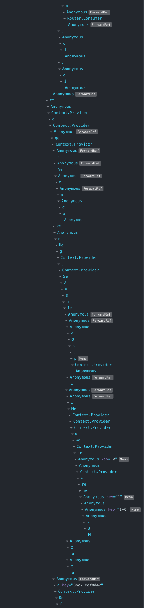

_If you are new and are looking for basic prevention of re-render due to changes of `props`, please take a look at the previous article: [Making Stupid React Smart in Re-rendering](https://medium.com/swlh/making-stupid-react-smart-in-re-rendering-5f04b5bab327)_.

# Defining the problem

When the component trees are shallow and the architecture of your React project is simple, there are hardly any problems. The real problem comes when you have hundreds of nested components like this (taken from one of the pages on Medium):

Then you would have to start thinking about optimizing re-renders, because re-renders are costly if you have many costly logics that need to be calculated over and over.

Problems with re-render due to a change detected in `props` could be easily resolved by using some simple methods as covered in the previous article: [Making Stupid React Smart in Re-rendering](https://medium.com/swlh/making-stupid-react-smart-in-re-rendering-5f04b5bab327). But what makes using global state such as Redux so different from simple prop changes that incur re-renders?

# Illustration of the problem
